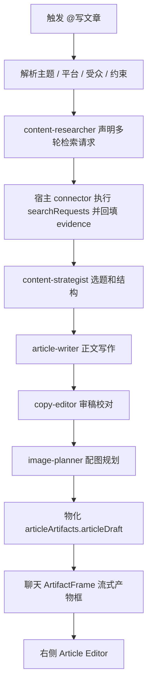

# Writing Workflow 设计

更新时间：2026-06-29
状态：In Progress

## 1. Workflow 定义

`content_article_workflow` 是内容工厂插件包声明的文章生产工作流。它不是宿主内置 parser，也不是普通聊天 prompt。

```text
content_article_generate
  -> content_article_workflow
  -> content-researcher
  -> content-strategist
  -> article-writer
  -> copy-editor
  -> image-planner
  -> ArtifactFrame
  -> articleArtifacts.articleDraft
```

## 2. 子 Agent

| 子 Agent             | 责任                                     | 输出                           |
| -------------------- | ---------------------------------------- | ------------------------------ |
| `content-researcher` | 搜索主题、事实、案例、竞品和上下文材料。 | research notes、引用、风险点。 |
| `content-strategist` | 判断角度、受众、平台和结构。             | brief、标题候选、文章大纲。    |
| `article-writer`     | 根据 brief 和 research 写正文。          | Markdown draft、摘要、标题。   |
| `copy-editor`        | 校对、压低 AI 味、检查事实和表达。       | revised draft、问题清单。      |
| `image-planner`      | 规划封面、段落配图和图片提示词。         | image plan、slot refs。        |

## 3. Skills

| skill                | 责任                         | 备注                               |
| -------------------- | ---------------------------- | ---------------------------------- |
| `article-research`   | 资料检索、事实整理和引用归档。 | 内容工厂插件声明，不由宿主硬编码。 |
| `article-strategy`   | 选题、角度、受众和结构策划。   | 输出标题候选、大纲和写作计划。     |
| `article-writing`    | 中文文章写作和正文成稿。       | 负责 `articleDraft.source.markdown`。 |
| `article-editing`    | 审稿、校对、事实检查和表达调整。 | 输出审稿清单和修改建议。           |
| `article-image-plan` | 封面、段落配图和图片提示词规划。 | 输出 image slots 和 image plan。    |

## 4. CLI / Connectors / Hooks / 工具

| 能力                          | 责任                                                                       |
| ----------------------------- | -------------------------------------------------------------------------- |
| `search_query` / WebSearch    | 由 worker 声明 `searchRequests`，由宿主 connector / tool timeline 执行真实检索、事实补充和引用确认，并把 evidence 回填到 articleDraft metadata。 |
| `content-factory-worker`      | 执行内容工厂 runtime task，产出 workspace patch。                          |
| `content-factory` CLI         | 本地 inspect / run / validate，证明插件包、workflow 和 worker 自洽。       |
| connectors                    | 声明搜索、知识库、云端账号、媒体生成等外部依赖和授权状态。                 |
| toolRefs                      | 声明 worker / CLI / local tool 依赖与能力标签；它不是 connector 列表。     |
| hooks                         | 在 prompt / tool / task 生命周期中注入运行约束、路由策略和 evidence 归档。 |
| `artifact writer`             | 保存 Markdown / workspace patch / evidence。                               |
| `right surface action router` | 处理继续改写、生成配图、导出等受控动作。                                   |

## 5. 编排流程



## 6. ArtifactFrame 规则

`ArtifactFrame` 是聊天区里的通用独立产物框，承担“承载产物、展示状态、流式更新、点击进入右侧画布”的入口。文章只是其中一种 renderer，后续还应支持图片集、表格、演示稿、网页、报告、代码和媒体产物。注册链以 `ArtifactFrame` 为事实源，不再使用 message 专用命名。

当前 worker 的安全契约是 `directProviderAccess=false`、`directFilesystemAccess=false`：worker 可以输出 `searchRequests`、pending `searchEvidence`、`reviewChecklist` 和 `imagePlan`，但不能直接联网或读写宿主文件。真实检索必须由宿主 connector / tool timeline 执行并回填；在这一步完成前，不能把“多轮检索结构已生成”写成“真实搜索已完成”。

通用框架必须包含：

- 标题。
- 状态：`running`、`ready`、`needs_review`、`failed`。
- renderer 类型：如 `articleArtifacts`、`imageSetArtifacts`、`tableArtifacts`。
- 内部内容区：文章类允许完整正文流式输出；图片类显示网格；表格类显示表格预览。
- 框头动作：展开 / 收起、打开右侧、继续处理。
- object ref / artifact ref，用于右侧展开、历史恢复和后续动作。

产物框不应包含：

- 大段 prompt。
- provider 或 stack trace。
- 旧 Profile 调试字段。

文章 `ArtifactFrame` 规则：

- 可以完整显示正文，不只显示摘要。
- 正文更新必须进入框内流式内容区，不进入普通 assistant message。
- 内容区应有最大高度或内部滚动策略，避免长文把输入区挤出视口。
- 点击框头或打开按钮进入右侧 Article Editor。

## 7. Article Editor 规则

右侧 `articleDraft` Article Editor 至少包含：

| 区域       | 内容                                                 |
| ---------- | ---------------------------------------------------- |
| 标题栏     | 文章标题、状态、版本、来源 workflow。                |
| 左侧工具条 | 大纲、编辑、引用、配图、版本、导出等文章级工具入口。 |
| 正文画布   | Markdown / ArtifactDocument 草稿，支持段落级编辑。   |
| 结构面板   | 大纲、摘要、目标平台、受众。                         |
| 引用面板   | 搜索来源和事实依据。                                 |
| 配图面板   | 配图 slot、提示词、生成状态。                        |
| 动作       | 继续改写、补充搜索、生成配图、导出。                 |

旧 Profile 路径不再作为内部事实源、文章主界面或右侧用户可见标题；Article Workspace 是唯一工作区事实源。

## 8. 失败处理

| 阶段       | 失败表现                                  | 用户可做                   |
| ---------- | ----------------------------------------- | -------------------------- |
| 未安装插件 | 不显示 `@写文章` 候选，插件中心提示安装。 | 安装内容工厂。             |
| 插件不可用 | 候选置灰并显示 blocker code。             | 查看插件详情或授权。       |
| 搜索失败   | 卡片停在 research failed。                | 重试、跳过搜索或补充素材。 |
| 写作失败   | 卡片停在 failed，不生成假正文。           | 重试或查看 evidence。      |
| 物化失败   | 不打开右侧空白 Article Editor。           | 显示 artifact error card。 |

## 9. 验证点

- `@写文章` 输入建议来自 installed plugin contract。
- activation metadata 包含 workflow、subagents、skills、CLI refs、connector refs 和 hook policy。
- worker evidence 包含 `workflowKey` 和 `orchestration`。
- worker evidence 包含 `searchRequests`、pending `searchEvidence`、`reviewChecklist` 和 `imagePlan`。
- 宿主 connector 执行 `searchRequests` 后，真实检索结果回填到 articleDraft metadata 和工具时间线。
- 聊天出现独立 `ArtifactFrame`，文章正文在框内流式输出。
- 产物框点击能打开右侧 `articleDraft` Article Editor。
- 历史恢复能恢复 selected object。
