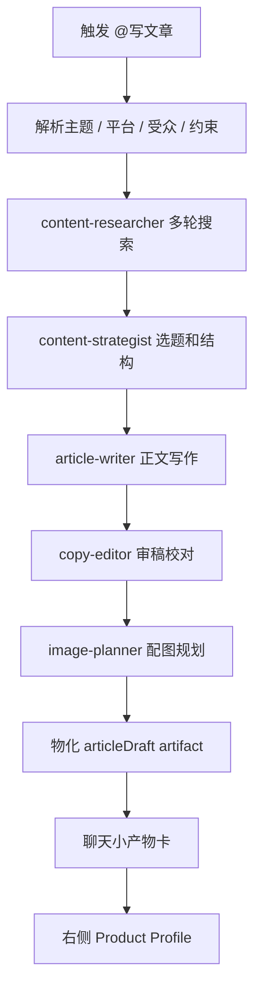

# Writing Workflow 设计

更新时间：2026-06-28  
状态：In Progress

## 1. Workflow 定义

`content_article_workflow` 是内容工厂插件包声明的文章生产工作流。它不是宿主内置 parser，也不是普通聊天 prompt。

```text
content_article_generate
  -> content_article_workflow
  -> content-researcher
  -> content-strategist
  -> article-writer
  -> copy-editor
  -> image-planner
  -> articleDraft
```

## 2. 子 Agent

| 子 Agent | 责任 | 输出 |
| --- | --- | --- |
| `content-researcher` | 搜索主题、事实、案例、竞品和上下文材料。 | research notes、引用、风险点。 |
| `content-strategist` | 判断角度、受众、平台和结构。 | brief、标题候选、文章大纲。 |
| `article-writer` | 根据 brief 和 research 写正文。 | Markdown draft、摘要、标题。 |
| `copy-editor` | 校对、压低 AI 味、检查事实和表达。 | revised draft、问题清单。 |
| `image-planner` | 规划封面、段落配图和图片提示词。 | image plan、slot refs。 |

## 3. Skills

| skill | 责任 | 备注 |
| --- | --- | --- |
| `content_ideation` | 选题、角度、受众和结构策划。 | 内容工厂插件声明，不由宿主硬编码。 |
| `copywriting` | 中文文章写作和改写。 | 负责正文产出和风格控制。 |
| `article-image-cheatsheet` | 公众号 / 长文配图规划。 | 可作为后续图片 workflow 的 skill ref。 |
| `gongzonghao-article-writer` | 中文公众号写作经验沉淀。 | 写作风格参考，不直接把 skill 内容塞进 UI。 |

## 4. CLI / Connectors / Hooks / 工具

| 能力 | 责任 |
| --- | --- |
| `search_query` / WebSearch | 支持多轮检索、事实补充、引用确认。 |
| `content-factory-worker` | 执行内容工厂 runtime task，产出 workspace patch。 |
| `content-factory` CLI | 本地 inspect / run / validate，证明插件包、workflow 和 worker 自洽。 |
| connectors | 声明搜索、知识库、云端账号、媒体生成等外部依赖和授权状态。 |
| hooks | 在 prompt / tool / task 生命周期中注入运行约束、路由策略和 evidence 归档。 |
| `artifact writer` | 保存 Markdown / workspace patch / evidence。 |
| `right surface action router` | 处理继续改写、生成配图、导出等受控动作。 |

## 5. 编排流程



## 6. 小产物卡规则

小产物卡是聊天区里的唯一文章展示对象，承担“看见产物、点击进入、继续动作”的入口。

卡片必须包含：

- 标题。
- 状态：`running`、`ready`、`needs_review`、`failed`。
- 一段不超过 120 字的摘要。
- workflow 进度，如“检索完成 / 大纲完成 / 初稿完成 / 审稿完成”。
- 主动作：打开、继续改写、生成配图。
- object ref / artifact ref，用于右侧展开和历史恢复。

卡片不应包含：

- 完整正文。
- 全量搜索笔记。
- 大段 prompt。
- provider 或 stack trace。

## 7. Product Profile 规则

右侧 `articleDraft` Product Profile 至少包含：

| 区域 | 内容 |
| --- | --- |
| 标题栏 | 文章标题、状态、版本、来源 workflow。 |
| 正文 | Markdown 草稿，后续支持局部编辑。 |
| 结构 | 大纲、摘要、目标平台、受众。 |
| 引用 | 搜索来源和事实依据。 |
| 配图 | 配图 slot、提示词、生成状态。 |
| 动作 | 继续改写、补充搜索、生成配图、导出。 |

## 8. 失败处理

| 阶段 | 失败表现 | 用户可做 |
| --- | --- | --- |
| 未安装插件 | 不显示 `@写文章` 候选，插件中心提示安装。 | 安装内容工厂。 |
| 插件不可用 | 候选置灰并显示 blocker code。 | 查看插件详情或授权。 |
| 搜索失败 | 卡片停在 research failed。 | 重试、跳过搜索或补充素材。 |
| 写作失败 | 卡片停在 failed，不生成假正文。 | 重试或查看 evidence。 |
| 物化失败 | 不打开右侧空白 Profile。 | 显示 artifact error card。 |

## 9. 验证点

- `@写文章` 输入建议来自 installed plugin contract。
- activation metadata 包含 workflow、subagents、skills、CLI refs、connector refs 和 hook policy。
- worker evidence 包含 `workflowKey` 和 `orchestration`。
- 聊天只出现小产物卡。
- 卡片点击能打开右侧 `articleDraft`。
- 历史恢复能恢复 selected object。
