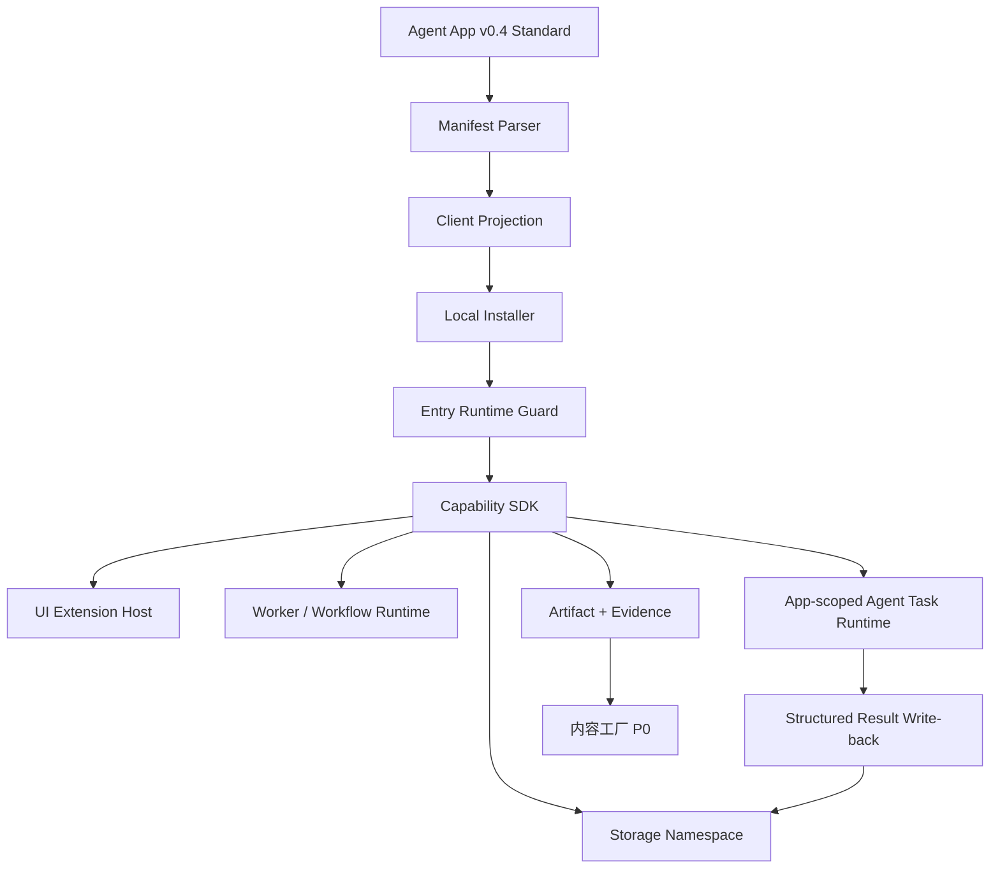

# Agent App 客户端路线图

更新时间：2026-05-18

## v2 迭代入口

v2 独立安装与 Runtime 底座拆分规划见 [`v2/prd.md`](./v2/prd.md)。该方向固定“Agent App 是产品、Lime Runtime 是底座、Lime Desktop 是多 App 工作台、Lime App Shell 是独立单 App 宿主”，用于承接 Agent App v0.8 标准。

## 定位

本目录只承载 Lime Desktop / Lime 客户端侧的 Agent App 路线图。

客户端职责是把 Agent App 真正安装并跑起来：本地 package cache、manifest projection、readiness、Capability SDK、UI extension host、storage namespace、worker / workflow runtime、Agent Runtime bridge、Artifact / Evidence、权限和本地数据边界。

服务端 / Cloud / LimeCore 的职责不写在本目录；对应文档在 `/Users/coso/Documents/dev/ai/limecloud/limecore/internal/roadmap/agentapp`。

产品边界必须固定：Agent App 是业务工作台，Lime Agent 是 App 可编排的智能运行时。用户应该在 App 内完成业务流程，而不是为了生成、确认、交付或复盘被迫跳回 Lime 通用 Chat UI。Lime Experts 是对话优先的专家模块，适合问答、咨询、分析和轻量任务；Chat / Expert 只是 Agent App 的一种入口或嵌入式协作方式，不是业务流程的唯一容器。

```text
Lime Cloud / LimeCore
  Catalog / Release / License / Tenant Enablement / Gateway / ToolHub
    ↓
Lime Desktop Client
  Install / Projection / Capability SDK / UI Host / Storage / Runtime / Evidence
    ↓
Agent App Runtime Package
  App UI / Worker / Workflow / Storage Schema / Business Code
```

## 当前事实源

| 分类      | 对象                                                                      | 说明                                                                                                                                                                                                                                                                                                                                                                                                                                                                                                                            |
| --------- | ------------------------------------------------------------------------- | ------------------------------------------------------------------------------------------------------------------------------------------------------------------------------------------------------------------------------------------------------------------------------------------------------------------------------------------------------------------------------------------------------------------------------------------------------------------------------------------------------------------------------- |
| current   | `/Users/coso/Documents/dev/ai/limecloud/agentapp`                         | Agent App 标准事实源；v0.4 固定 Host Bridge v1，v0.5 固定分层 manifest，v0.6 新增 `app.runtime.yaml` 与 Agent task runtime contract。Lime 已按 P18.7-B 跟上当前 v0.6，不再假定 reference sample 永远停在 v0.3/v0.4/v0.5。                                                                                                                                                                                                                                                                                                                                                         |
| current   | `internal/roadmap/agentapp/capability-sdk.md`                                 | Lime Desktop 侧 Capability SDK 与 Host Bridge 方案。                                                                                                                                                                                                                                                                                                                                                                                                                                                                            |
| current   | `internal/roadmap/agentapp/p18-7-full-lime-capability-surface.md`             | P18.7 全量 Lime capability surface：把 UI、数据、AgentRuntime、模型、Token、Skills、Tools、MCP、浏览器、搜索、媒体、终端、记忆、凭证、策略、Evidence 等统一抽象为 `lime.*` 能力，并固定 App / Lime 主 App 边界与 v0.6 分层 manifest / runtime contract 兼容顺序。                                                                                                                                                                                                                                                                                             |
| current   | `internal/roadmap/agentapp/implementation-plan.md`                            | 客户端落地实施方案，覆盖 P0-P18 当前计划；P18.7-B Agent App v0.6 current compatibility 已完成，当前下一刀是 P18.7-C Host capability discovery。                                                                                                                                                                                                                                                                                                                                          |
| current   | `internal/roadmap/agentapp/p0-technical-design.md`                            | P0 只读 App Host 技术设计，覆盖 manifest、projection、readiness、cleanup dry-run。                                                                                                                                                                                                                                                                                                                                                                                                                                              |
| current   | `internal/roadmap/agentapp/p1-mock-capability-host.md`                        | P1 Mock Capability Host 技术设计，覆盖 SDK facade、mock artifact/evidence、uninstall delete-data。                                                                                                                                                                                                                                                                                                                                                                                                                              |
| current   | `internal/roadmap/agentapp/p2-adapter-capability-host.md`                     | P2 Adapter Capability Host 技术设计，覆盖本地 adapter store、knowledge / agent adapter、provenance 查询、delete-data 清理。                                                                                                                                                                                                                                                                                                                                                                                                     |
| current   | `internal/roadmap/agentapp/p3-ui-extension-host.md`                           | P3 UI Extension Host 技术设计，覆盖受控 UI Host、sandbox、injected SDK bridge、Lab 预览。                                                                                                                                                                                                                                                                                                                                                                                                                                       |
| current   | `internal/roadmap/agentapp/p4-content-factory-demo.md`                        | P4 内容工厂最小闭环，覆盖项目、知识、内容场景、内容资产、Artifact、Evidence、cleanup。                                                                                                                                                                                                                                                                                                                                                                                                                                          |
| current   | `internal/roadmap/agentapp/p4-workflow-runtime.md`                            | P4.2 受控 Workflow Runtime，覆盖白名单 DSL、runtime policy、trace、cancel 和内容工厂 demo 迁移。                                                                                                                                                                                                                                                                                                                                                                                                                                |
| current   | `internal/roadmap/agentapp/content-factory-app.md`                            | 内容工厂作为客户端标杆案例的 UI / storage / workflow / artifact 方案。                                                                                                                                                                                                                                                                                                                                                                                                                                                          |
| current   | `internal/roadmap/agentapp/v0.3-rebaseline-plan.md`                           | v0.3 / 内容工厂升级后的实施重排计划，记录 P4-R rebaseline 与验证证据。                                                                                                                                                                                                                                                                                                                                                                                                                                                          |
| current   | `internal/roadmap/agentapp/p5-cloud-bootstrap.md`                             | P5 Cloud Bootstrap 客户端接入计划，覆盖 payload 校验、企业定制注册码、统一 package source、readiness 合并和 disable / offline / upgrade 回归。                                                                                                                                                                                                                                                                                                                                                                                  |
| current   | `internal/roadmap/agentapp/p6-schema-coverage.md`                             | P6 v0.3 projection / readiness schema coverage，覆盖 services、workflows、skills、tools、evals、secrets、overlays、lifecycle 和 setup checks。                                                                                                                                                                                                                                                                                                                                                                                  |
| current   | `internal/roadmap/agentapp/p7-schema-gate.md`                                 | P7 本地 schema / snapshot gate，机械验证 projection / readiness 结构与 setup issue 字段。                                                                                                                                                                                                                                                                                                                                                                                                                                       |
| current   | `internal/roadmap/agentapp/p8-setup-resolver.md`                              | P8 setup resolver / needs-setup 语义，把结构性 setup checks 推进到明确 readiness 状态。                                                                                                                                                                                                                                                                                                                                                                                                                                         |
| current   | `internal/roadmap/agentapp/p9-setup-state-store.md`                           | P9 installed setup state store，把 setup resolver 输入推进为本地可查询、可清理的 binding 状态。                                                                                                                                                                                                                                                                                                                                                                                                                                 |
| current   | `internal/roadmap/agentapp/p10-installed-state-persistence.md`                | P10 installed app state snapshot，把 preview、setup、projection、readiness 汇总为可清理的可序列化安装状态。                                                                                                                                                                                                                                                                                                                                                                                                                     |
| current   | `internal/roadmap/agentapp/p11-local-persistence-adapter.md`                  | P11 Local Persistence Adapter，把 installed state 从 in-memory 推进到本地可恢复 persistence adapter。                                                                                                                                                                                                                                                                                                                                                                                                                           |
| current   | `internal/roadmap/agentapp/p12-package-cache-verify-rollback.md`              | P12 Package Cache / Verify / Rollback，覆盖 package cache、hash verify、cached fallback、upgrade staging 和 rollback。                                                                                                                                                                                                                                                                                                                                                                                                          |
| current   | `internal/roadmap/agentapp/p13-runtime-package-loader.md`                     | P13 Runtime Package Loader / UI Bundle Loader，覆盖已验证 package 的 runtime descriptor 和 UI bundle descriptor 加载边界。                                                                                                                                                                                                                                                                                                                                                                                                      |
| current   | `internal/roadmap/agentapp/p14-entry-runtime-guard-permission-prompt.md`      | P14 Entry Runtime Guard / Permission Prompt 实现，合并 entry readiness、permission、setup state、package verification 和 runtime policy。                                                                                                                                                                                                                                                                                                                                                                                       |
| current   | `internal/roadmap/agentapp/p15-lab-install-launch-flow.md`                    | P15 Lab Install / Launch Flow 实现，把安装审查、权限确认、启动和清理串成 Lab-only 端到端流程。                                                                                                                                                                                                                                                                                                                                                                                                                                  |
| current   | `internal/roadmap/agentapp/p15-h-gui-smoke-cleanup-rehearsal.md`              | P15-H GUI smoke / cleanup rehearsal hardening，记录 Lab 专用 smoke、证据输出、清理演练和 P16 入口 gate。                                                                                                                                                                                                                                                                                                                                                                                                                        |
| current   | `internal/roadmap/agentapp/p16-agent-app-manager-product-entry-gate.md`       | P16 Agent App Manager / Product Entry Gate，记录实验岛内 App 管理面、entry launcher、lifecycle action、cleanup evidence 与剩余 P16-H 缺口。                                                                                                                                                                                                                                                                                                                                                                                     |
| current   | `internal/roadmap/agentapp/p16-h-multi-app-repository-lifecycle-hardening.md` | P16-H Multi-app repository / lifecycle hardening，记录多 App list、持久化 lifecycle、cleanup evidence export、residual audit 和 P17 前 gate。                                                                                                                                                                                                                                                                                                                                                                                   |
| current   | `internal/roadmap/agentapp/p17-formal-entry-gate-audit.md`                    | P17 正式入口前 Gate 审计，逐项映射 P16-H 证据、正式 Agent Apps 入口条件和剩余禁区。                                                                                                                                                                                                                                                                                                                                                                                                                                             |
| current   | `internal/roadmap/agentapp/p17-formal-entry-contract.md`                      | P17.0 正式入口契约，固定 `agent-apps`、`agent-app-lab` 与 runtime surface 的职责边界、禁区、架构和后续 gates。                                                                                                                                                                                                                                                                                                                                                                                                                  |
| current   | `internal/roadmap/agentapp/p17-source-install-contract-hardening.md`          | P17.2 Source / Install Contract Hardening 当前执行计划，固定 source state、install review、registration、Cloud release metadata、package verify、cached fallback 与 reference CLI cross-check 边界。                                                                                                                                                                                                                                                                                                                            |
| current   | `internal/roadmap/agentapp/p17-lifecycle-cleanup-contract-hardening.md`       | P17.3 Lifecycle / Cleanup Contract Hardening 已完成执行计划，固定正式入口 enable / disable、uninstall rehearsal、cleanup evidence、residual audit 与 namespace 归属边界。                                                                                                                                                                                                                                                                                                                                                       |
| current   | `internal/roadmap/agentapp/p17-4-host-bridge-runtime.md`                      | P17.4-H Host Bridge Runtime 已完成执行计划，固定正式 App iframe 与 Lime Host 的 `lime.agentApp.bridge` 事件协议、主题同步、Host action、capability invoke、App-scoped Agent task 与结构化写回边界；P17.4.5 已通过完整 GUI smoke。                                                                                                                                                                                                                                                                                               |
| current   | `internal/roadmap/agentapp/p17-5-formal-entry-gui-smoke.md`                   | P17.5 Formal Entry GUI Smoke 已完成，记录正式 `agent-apps` 入口 install / registration / launch / disable / uninstall rehearsal / runtime surface / flag-off 的独立 smoke 证据。                                                                                                                                                                                                                                                                                                                                                |
| current   | `internal/roadmap/agentapp/p18-typed-capability-sdk-gate.md`                  | P18 Typed Capability SDK Gate 计划，固定上游 Host Bridge、SDK typed facade、stable error、mock / contract tests 与 App-scoped Agent task 边界；P18.1-P18.6 已落地，P18.7-B 已对齐上游 `manifestVersion: 0.6.0`、分层 manifest 与 `app.runtime.yaml` reference sample，下一刀进入 P18.7-C Host capability discovery。 |
| current   | `internal/roadmap/agentapp/p18-4-h-agentruntime-handoff-gate.md`              | P18.4-H AgentRuntime Handoff Gate，记录 prompt-to-artifact checklist、隔壁 AgentRuntime current MVP 证据、P18 消费侧判定和仍归 AgentRuntime owner 的缺口。                                                                                                                                                                                                                                                                                                                                                                      |
| current   | `internal/roadmap/agentapp/p18-5-content-factory-sdk-regression.md`           | P18.5 内容工厂 SDK 化回归，记录 Lime-side content factory SDK contract、Host Bridge SDK client、外部 package read-only tests、dirty 边界和 package-side 剩余缺口。                                                                                                                                                                                                                                                                                                                                                              |
| current   | `internal/roadmap/agentapp/p18-5-3-package-sdk-migration-plan.md`             | P18.5.3 package-side SDK facade 迁移计划，固定外部 `content-factory-app` 当前只读事实、推荐写集、迁移步骤、验收清单和回滚点。                                                                                                                                                                                                                                                                                                                                                                                                   |
| current   | `internal/roadmap/agentapp/p18-5-3-owner-handoff.md`                          | P18.5.3 给外部 package owner 的执行单页，浓缩接管前命令、最小写集、禁止项、验证顺序和完成条件。                                                                                                                                                                                                                                                                                                                                                                                                                                 |
| current   | `internal/roadmap/agentapp/p18-6-raw-worker-pre-gate.md`                      | P18.6 Raw Worker 前 Gate，记录 P18 不执行 raw worker / 外部代码 / 网络 / 文件系统 / secret value 的证据和 P19 后续退出条件。                                                                                                                                                                                                                                                                                                                                                                                                    |
| current   | `internal/roadmap/agentapp/p18-completion-audit.md`                           | P18 completion audit / 协作防打架记录，映射 P18.1-P18.7 证据、外部 package 边界、验证命令、feature island 复核和下一刀判定。                                                                                                                                                                                                                                                                                                                               |
| reference | `/Users/coso/Documents/dev/ai/limecloud/limecore/internal/roadmap/agentapp`   | 服务端 catalog、release、tenant enablement、gateway、ToolHub 路线图；LimeCore 只做 control-plane metadata，真实 release 必须提供 `https` package URL 和完整 package / manifest hash，未激活注册码时不得下发可安装 package。                                                                                                                                                                                                                                                                                                     |

## 文档索引

| 文档                                                                                                     | 说明                                                                                                                             |
| -------------------------------------------------------------------------------------------------------- | -------------------------------------------------------------------------------------------------------------------------------- |
| [capability-sdk.md](./capability-sdk.md)                                                                 | 客户端 Capability SDK、runtime bridge、能力注入、权限拦截和 mock host。                                                          |
| [implementation-plan.md](./implementation-plan.md)                                                       | 客户端 App Host 落地实施方案：manifest parser、projection、installer、storage、UI host、worker runtime。                         |
| [p0-technical-design.md](./p0-technical-design.md)                                                       | P0 技术设计：只读 package、manifest normalize、projection、readiness、cleanup dry-run、Lab 展示。                                |
| [p1-mock-capability-host.md](./p1-mock-capability-host.md)                                               | P1 技术设计：SDK facade、MockCapabilityHost、mock artifact/evidence、uninstall delete-data。                                     |
| [p2-adapter-capability-host.md](./p2-adapter-capability-host.md)                                         | P2 技术设计：AdapterCapabilityHost、本地 adapter store、knowledge / agent adapter、provenance 查询、delete-data 清理。           |
| [p3-ui-extension-host.md](./p3-ui-extension-host.md)                                                     | P3 技术设计：受控 UI Host、sandbox policy、injected SDK bridge、Lab 预览。                                                       |
| [p4-content-factory-demo.md](./p4-content-factory-demo.md)                                               | P4 技术设计：内容工厂最小闭环、content table Artifact、Evidence、delete-data 清理。                                              |
| [p4-workflow-runtime.md](./p4-workflow-runtime.md)                                                       | P4.2 技术设计：受控 workflow runtime、白名单 DSL、trace、cancel、policy guard。                                                  |
| [content-factory-app.md](./content-factory-app.md)                                                       | 内容工厂 Product-level Agent App 的客户端产品与实现方案。                                                                        |
| [v0.3-rebaseline-plan.md](./v0.3-rebaseline-plan.md)                                                     | Agent App v0.3 / 内容工厂升级后的 rebaseline 实施计划。                                                                          |
| [p5-cloud-bootstrap.md](./p5-cloud-bootstrap.md)                                                         | P5 技术计划：Cloud bootstrap 作为客户端 package source 输入，继续保持本地 install / projection / readiness / runtime / cleanup。 |
| [p6-schema-coverage.md](./p6-schema-coverage.md)                                                         | P6 技术计划：补齐 v0.3 projection / readiness schema coverage，但不进入正式主路径。                                              |
| [p7-schema-gate.md](./p7-schema-gate.md)                                                                 | P7 技术计划：用本地 schema / snapshot gate 防止 projection / readiness 字段漂移。                                                |
| [p8-setup-resolver.md](./p8-setup-resolver.md)                                                           | P8 技术计划：增加 setup resolver 输入和 `needs-setup` readiness 语义。                                                           |
| [p9-setup-state-store.md](./p9-setup-state-store.md)                                                     | P9 技术计划：本地 setup state store、readiness 输入和 cleanup preview 集成。                                                     |
| [p10-installed-state-persistence.md](./p10-installed-state-persistence.md)                               | P10 技术计划：installed state snapshot、in-memory store、cleanup preview 集成。                                                  |
| [p11-local-persistence-adapter.md](./p11-local-persistence-adapter.md)                                   | P11 技术实现：本地 persistence adapter、启动恢复、坏文件隔离、delete-data 清理。                                                 |
| [p12-package-cache-verify-rollback.md](./p12-package-cache-verify-rollback.md)                           | P12 技术实现：package cache、hash verify、cached fallback、upgrade staging 和 rollback。                                         |
| [p13-runtime-package-loader.md](./p13-runtime-package-loader.md)                                         | P13 技术实现：runtime package loader、bundle manifest gate、UI host 接线前安全边界。                                             |
| [p14-entry-runtime-guard-permission-prompt.md](./p14-entry-runtime-guard-permission-prompt.md)           | P14 技术计划：entry runtime guard、permission prompt descriptor、setup / readiness / policy 合并。                               |
| [p15-lab-install-launch-flow.md](./p15-lab-install-launch-flow.md)                                       | P15 技术实现：Lab install / launch flow、install review、permission prompt、runtime launch、cleanup preview。                    |
| [p15-h-gui-smoke-cleanup-rehearsal.md](./p15-h-gui-smoke-cleanup-rehearsal.md)                           | P15-H 技术实现：Agent App Lab 专用 GUI smoke、证据输出、cleanup rehearsal 与 P16 gate。                                          |
| [p16-agent-app-manager-product-entry-gate.md](./p16-agent-app-manager-product-entry-gate.md)             | P16 技术计划：Agent App Manager、entry launcher、lifecycle actions、cleanup evidence 和正式入口前 gate。                         |
| [p16-h-multi-app-repository-lifecycle-hardening.md](./p16-h-multi-app-repository-lifecycle-hardening.md) | P16-H 技术计划：多 App repository list、持久化 lifecycle、cleanup evidence export、residual audit 和 P17 前 gate。               |
| [p17-formal-entry-gate-audit.md](./p17-formal-entry-gate-audit.md)                                       | P17 Gate 审计：正式入口前 checklist、验证记录、进入条件和 P17.0 契约入口。                                                       |
| [p17-formal-entry-contract.md](./p17-formal-entry-contract.md)                                           | P17.0 技术计划：正式 `agent-apps` 入口契约、Lab 边界、runtime surface、架构 / 时序 / 流程、后续 gates。                          |
| [p17-source-install-contract-hardening.md](./p17-source-install-contract-hardening.md)                   | P17.2 技术计划：正式入口 source state、install review、registration、Cloud release metadata 与客户端安装边界。                   |
| [p17-lifecycle-cleanup-contract-hardening.md](./p17-lifecycle-cleanup-contract-hardening.md)             | P17.3 技术计划：正式入口 lifecycle、cleanup rehearsal、evidence export、residual audit 与 namespace 分离。                       |
| [p17-4-host-bridge-runtime.md](./p17-4-host-bridge-runtime.md)                                           | P17.4-H 技术计划：Host Bridge v1、主题同步、Host action、capability invoke、iframe message 安全边界。                            |
| [p17-5-formal-entry-gui-smoke.md](./p17-5-formal-entry-gui-smoke.md)                                     | P17.5 验证记录：正式 `agent-apps` 入口独立 GUI smoke、cleanup dry-run evidence 与 flag-off regression。                          |
| [p18-typed-capability-sdk-gate.md](./p18-typed-capability-sdk-gate.md)                                   | P18 技术计划：Typed Capability SDK Gate、Host Bridge v1 调用信封、stable error、mock / contract tests、App-scoped Agent task。   |
| [p18-4-h-agentruntime-handoff-gate.md](./p18-4-h-agentruntime-handoff-gate.md)                           | P18.4-H 验证记录：AgentRuntime handoff checklist、证据映射、剩余 owner 缺口与 P18.5 进入判定。                                   |
| [p18-5-content-factory-sdk-regression.md](./p18-5-content-factory-sdk-regression.md)                     | P18.5 验证记录：内容工厂 Lime-side SDK regression、Host Bridge SDK client、package-side dirty 边界和下一刀。                     |
| [p18-5-3-package-sdk-migration-plan.md](./p18-5-3-package-sdk-migration-plan.md)                         | P18.5.3 迁移计划：外部 package 写集、SDK facade 迁移步骤、验收和回滚点。                                                         |
| [p18-5-3-owner-handoff.md](./p18-5-3-owner-handoff.md)                                                   | P18.5.3 owner handoff 单页：接管前命令、最小写集、禁止项、验证顺序和完成条件。                                                   |
| [p18-6-raw-worker-pre-gate.md](./p18-6-raw-worker-pre-gate.md)                                           | P18.6 验证记录：raw worker 禁止执行边界、受控 workflow DSL、policy 证据和 P19 退出条件。                                         |
| [p18-7-full-lime-capability-surface.md](./p18-7-full-lime-capability-surface.md)                         | P18.7 路线图：全量 Lime capability surface、App / Lime 主 App 边界、v0.6 标准兼容、Host discovery 和后端接线顺序。                |
| [p18-completion-audit.md](./p18-completion-audit.md)                                                     | P18 completion audit：完成项、阻塞项、验证命令、协作边界和下一刀。                                                               |

## 客户端边界

1. 客户端负责运行 Agent App；服务端不默认运行 Agent。
2. App 不能 import Lime 内部模块，只能通过 Capability SDK 使用 `lime.*` 能力。
3. UI、worker、workflow、storage migration 都在客户端受控 runtime 中执行。
4. App storage namespace、artifact namespace、event namespace 必须隔离。
5. 客户数据、workspace data、secrets 和 overlay 不进入官方 App package。
6. Expert 只是 `expert-chat` entry；客户端必须支持非聊天页面和业务 workflow。
7. Cloud 下发 release / tenant enablement，客户端做本地 readiness 和能力注入。
8. App UI 与 Lime Host 的主题、语言、导航、通知、下载和 capability 请求统一走 `lime.agentApp.bridge`，不允许每个 App 自定义私有桥。
9. App 拥有业务 UI、业务 workflow、业务状态、结构化结果写回和人工确认；Lime Agent / Host 拥有 task runtime、模型 / 工具 / 知识调用、权限、trace、Artifact、Evidence 和 cleanup。
10. 通用 Chat 不能成为 Agent App 主流程的强制回跳点；如果核心工作仍需在 Chat 里完成，说明 App 只是 Chat 包装壳，不是 product-level Agent App。
11. App 也不能为了避免回 Chat 而自建模型网关、凭证系统、权限系统、证据系统或工具调度器；这些属于 Lime capability。
12. Agent App SDK 不拥有 Claw / AgentRuntime capability catalog；Chat `@命令`、Agent App `lime.agent.startTask` 和 Automation job 都只是 surface adapter，不能在 App 侧复制 `*_skill_launch` 或新增垂直 `content_factory_*` 后端能力。
13. 全量 Lime 功能必须先进入 `lime.* capability catalog`，再接 Host / AgentRuntime / ToolRuntime；业务 App 只能消费 capability，不能把 preview 能力 mock 成生产成功。

## 主路线



## 当前执行顺序

路线图已从 Agent App v0.3 / 内容工厂 rebaseline 推进到上游 v0.4 Host Bridge 对齐；当前上游示例已进入 `manifestVersion: 0.6.0` 并新增 `app.runtime.yaml`，P18.7-B 已完成 layered manifest / runtime contract reference cross-check 兼容，下一步继续后端 capability discovery / 接线。上游标准已补齐 discovery / installation、release metadata、runtime model、security model、overlay resolver、readiness runner、typed Capability SDK、public JSON Schema、reference CLI 与 Host Bridge v1。P4-R、P5、P6、P7、P8、P9、P10、P11、P12、P13、P14、P15、P15-H、P16、P16-H、P17 Gate、P17.0、P17.1、P17.2.1-P17.2.5、P17.3 lifecycle / cleanup contract、P17.4 runtime surface production hardening 与 P17.5 formal entry GUI smoke 已完成当前实现 / 专用验证 / 计划收口。当前进入 P18 Typed Capability SDK Gate，仍不做 marketplace、Cloud 管理台、真实 delete-data 或完整行业内容系统：

```text
P0 manifest / projection / readiness / cleanup dry-run
→ P1 Mock Capability Host
→ P2 Adapter Capability Host
→ P3.1 UI Extension Host mount contract
→ P4-R v0.3 / 内容工厂 Rebaseline（已通过）
→ P4.1 内容工厂业务闭环
→ P4.2 受控 Workflow Runtime
→ P5.0 v0.3 标准差距收口（已完成）
→ P5.1 Cloud Bootstrap payload DTO / parser / validator（已完成）
→ P5.2 统一 Package Source Adapter（已完成）
→ P5.3 Tenant Enablement + Local Readiness 合并（已完成）
→ P5.4 Disable / Upgrade / Offline Regression（已完成）
→ P5.5 Schema / Reference CLI Cross-check（已完成）
→ P6 v0.3 Projection / Readiness Schema Coverage（已完成）
→ P7 Schema Validator / Reference Snapshot Gate（已完成）
→ P8 Setup Resolver / Needs-Setup Semantics（已完成）
→ P9 Installed Setup State Store（已完成）
→ P10 Installed App State / Persistence（已完成）
→ P11 Local Persistence Adapter（已完成）
→ P12 Package Cache / Verify / Rollback（已完成）
→ P13 Runtime Package Loader / UI Bundle Loader（已完成）
→ P14 Entry Runtime Guard / Permission Prompt（已完成）
→ P15 Lab Install / Launch Flow（已完成）
→ P15-H GUI smoke / cleanup rehearsal hardening（已完成专用证据）
→ P16 Agent App Manager / Product Entry Gate（已完成最小实现）
→ P16-H.0 Multi-app repository / lifecycle hardening 计划收口（已完成）
→ P16-H.1 Repository-backed multi-app list（已完成最小实现）
→ P16-H.2 Selected app launcher + persisted lifecycle（已完成最小实现）
→ P16-H.3 Cleanup rehearsal evidence export（已完成最小实现）
→ P16-H.4 Residual audit（已完成最小实现）
→ P16-H.5 Agent App Lab GUI smoke + flag-off regression（已完成最小实现）
→ P17 正式入口前 Gate 审计（已完成）
→ P17.0 Formal Entry Contract（已完成计划收口）
→ P17.1 Formal route / nav / copy hardening（已完成最小实现）
→ P17.2.1 Source state model（已完成最小实现）
→ P17.2.2 Install review descriptor（已完成最小实现）
→ P17.2.3 Registration hardening（已完成最小实现）
→ P17.2.4a Cloud release descriptor / verification gate（已完成最小实现）
→ P17.2.4b-1 Cloud package acquisition seam / verified cache source（已完成最小实现）
  ↳ sidecar：P17.4 Formal runtime surface pre-work（已完成补丁；不改变 P17.2 顺序）
→ P17.2.4b-2 packageUrl fetch / staging / manifest extraction（已完成最小实现）
→ P17.2.5 Schema / reference CLI / example package cross-check（已完成）
→ P17.3 Lifecycle / cleanup contract hardening（已完成）
→ P17.4 Runtime surface production hardening（已完成，含 P17.4.5 GUI smoke）
→ P17.5 Formal entry GUI smoke（已完成，和 Lab smoke 分离）
→ P18.0 v0.4 Host Bridge / Typed SDK gap matrix（文档计划已落地）
→ P18.1 Typed SDK facade / mock host / stable error（已完成）
→ P18.2 Host Bridge typed router / stable error response（已完成）
→ P18.3 Core capability adapters（已完成）
→ P18.4 App-scoped Agent task SDK facade（已完成）
→ P18.4-H AgentRuntime handoff gate（已完成）
→ P18.5.1 Lime-side 内容工厂 SDK regression（已完成）
→ P18.5.2 Package-side read-only tests（已完成）
→ P18.5.3 Package-side SDK facade / verify / dist 同步（已完成）
→ P18.6 Raw Worker 前 Gate（已完成）
```

不要先做市场页、Cloud 管理台、完整行业内容系统，也不要让 App 绕过 SDK；P17.5 只证明正式入口独立 smoke 可跑通，不等于发布 marketplace。当前 P18 功能面已收口：Lime-side regression、外部 package tests / validate / readiness、真实 package verify、dist 同步和 handoff gate 均有证据；下一步只做 P18.7-C Host capability discovery，不扩大 marketplace、Cloud 管理台或垂直内容工厂后端。

## 下一刀判定

P5.0-P5.5、P6、P7、P8、P9、P10、P11、P12、P13、P14、P15、P15-H、P16、P16-H、P17 Gate、P17.0、P17.1、P17.2.1-P17.2.5、P17.3、P17.4.1-P17.4.5、P17.5、P18.1、P18.2、P18.3、P18.4、P18.4-H、P18.5.1、P18.5.2、P18.5-S、P18.5.3 与 P18.6 已通过定向 / 专用验证 / GUI smoke / 计划收口；2026-05-16 10:53 SDK seam / handoff core 定向测试 5 files / 17 tests passed，`typecheck`、`test:contracts` 与 `lint` 当前会话复核通过。当前只做 P18.7-C Host capability discovery：

1. P18.5 只做内容工厂现有 package 的 SDK 化回归，不新增 marketplace、Cloud 管理台或完整行业系统。
2. `agent-apps` 是用户入口，`agent-app-lab` 是研发验证入口；P18 不能让 App 回跳通用 Chat 才能完成业务流程。
3. 继续复用 P11 repository、P14 guard、P15 cleanup preview、P16-H evidence / audit、P17.4 Host Bridge 和 AgentRuntime surface，不新增第二套 store / scanner / installer / runtime。
4. Cloud / LimeCore 继续只提供 catalog / release / tenant metadata，不运行 Agent、不渲染 UI、不接管本地 storage。
5. Agent App feature island 仍不得直接 `safeInvoke` / `invoke` / raw Worker；上层 App 只能通过 SDK / Host Bridge 调用 Lime 能力。

协作分工口径：

| 方向                     | 负责                                                                                                                                        | P18 消费方式                                                                                                     | 防打架边界                                                                                              |
| ------------------------ | ------------------------------------------------------------------------------------------------------------------------------------------- | ---------------------------------------------------------------------------------------------------------------- | ------------------------------------------------------------------------------------------------------- |
| AgentRuntime current MVP | `agent_app_runtime_*` facade、`AgentRuntimeThreadReadModel`、Host response、`artifact:created` refs、跨刷新恢复、Artifact / Evidence 投影。 | P18.1 已抽象成 SDK 类型和 mock contract；P18.4 已包装为 `lime.agent` typed adapter；P18.4-H 已消费隔壁运行证据。 | 不在 P18.5 改 `src-tauri/*`、`src/lib/api/agentAppRuntime.ts`、`agentRuntimeCapabilityHost*` 实现逻辑。 |
| AgentRuntime 剩余缺口    | 后端 push subscribe、`content_factory.workspace_patch` producer、独立 capability catalog service、真实桌面 GUI smoke。                      | 已在 P18.4-H 记录 owner 与退出条件；P18.5 只消费，不伪造生产级完成。                                             | 不由 Agent App SDK 伪造生产级完成。                                                                     |
| Agent App P18            | typed facade、stable error、mock host、capability envelope、SDK contract tests。                                                            | 固定 App 作者只调用 `@lime/app-sdk`，不手写私有 bridge。                                                         | 不扩 marketplace、Cloud 管理台、raw worker、真实 delete-data 或垂直内容工厂后端。                       |

当前计划更新口径：

- P16-H.3 已落纯函数 evidence builder、Manager JSON 预览和 Lab smoke 证据。
- P16-H.4 已落 residual audit summary，只做 namespace 内残留检查，不做真实删除。
- P16-H.5 已扩展 Agent App Lab 专用 smoke 与 flag-off 回归，不替代全局 GUI smoke，也不发布正式入口。
- P17.0 已新增正式入口契约。
- P17.1 已完成 `agent-apps` 路由、导航、文案和测试边界最小硬化。
- P17.2.1 / P17.2.2 / P17.2.3 已完成 source state model、install review descriptor 和 registration refresh。
- P17.2.4a 已完成 release descriptor、verification gate、hash mismatch blocker 和 exact-hash cached fallback。
- P17.2.4b-2 已完成 `packageUrl` fetch / staging / manifest extraction：缺 verified cache 时通过集中命令下载 `https` package、校验 package / manifest sha256、解包 `APP.md` 并写入 verified cache。
- P17.3 lifecycle / cleanup contract hardening 已完成：formal 页面 disable / enable / uninstall rehearsal、cleanup namespace classifier、evidence / residual audit、guard integration 与 boundary regression 已收口；`agent_app_uninstall` 保持 rehearsal-only，不碰真实 delete-data。
- P17.4.1-P17.4.4 已完成：runtime surface guard-before-start、App-scoped Agent task start / stream / get / cancel / retry、storage / artifact / evidence 声明级写回 guard，以及 content factory promise-based Host Bridge 样板。
- LimeCore 服务端已明确：`content-factory-app` seeded catalog 不能内置假 release / 假下载地址 / 占位 hash；客户端 P17.2.4b-2 已把 package metadata 作为 release descriptor 输入，未激活注册码时仍停在 source state，不用 seeded fixture 或 dev resolver 兜底。
- P17.4.5 已完成：代码层 contracts、typecheck、feature island boundary、定向测试与完整 `verify:gui-smoke -- --reuse-running --timeout-ms 300000` 均有证据；本轮未结束或重启隔壁 Tauri / Cargo / Vite 任务。
- P17.5 已完成：`smoke:agent-apps` 覆盖 install / registration / launch / disable / uninstall rehearsal / runtime surface / flag-off，并输出独立 summary。
- P18.1 已完成：新增 typed capability contract、stable error mapping、mock transport 与 SDK contract tests；未触碰 AgentRuntime / Rust / runtime facade。
- P18.2 已完成：Host Bridge `capability:invoke` 接入 typed envelope、stable success / error response，保留 `response.result` 兼容，并补 runtime page / dispatcher / bridge contract tests；未触碰 Rust / Cloud / AgentRuntime facade。
- P18.3 已完成：新增 `createLimeCoreCapabilityAdapters`，覆盖 `lime.ui / storage / artifacts / evidence / knowledge / tools` typed facade、namespace、provenance 与 stable error parity；定向 tests / typecheck / contracts / feature-island 边界已过。
- P18.4 已完成：`createLimeCoreCapabilityAdapters` 新增 `agent` facade，覆盖 `startTask / streamTask / getTask / cancelTask / retryTask / submitHostResponse / listTasks`，并用 SDK fixture 固定 task / artifact / evidence 事件、Host response 和 retry / cancel 语义。
- P18.4-H 已完成：新增 AgentRuntime handoff checklist，逐项映射 facade、task options、events、Host response、artifact/evidence refs、workspace patch、跨刷新恢复、no-private-bridge 和隔壁 owner 缺口。
- P18.5.1 已完成：新增 Lime-side content factory SDK regression，验证 `lime.agent -> lime.storage -> lime.artifacts -> lime.evidence` 主链能由通用 SDK facade 表达。
- P18.5.2 已完成：外部 `content-factory-app` 只读 `npm test` 在 2026-05-16 09:05 owner handoff gate 复核为 46 tests passed，覆盖 Host Bridge task、stream、Host response、storage、artifact、evidence 写回；该结果不替代 package-side SDK facade / verify。
- P18.6 已完成：新增 raw worker 前 gate，固定 P18 不执行 raw worker、任意外部代码、网络、文件系统或 secret value，相关 runtime policy / guard / workflow tests 已通过。
- P18.7 已完成第一刀：新增 `src/features/agent-app/sdk/capabilityCatalog.ts`，把 `lime.ui / storage / files / agent / knowledge / tools / artifacts / workflow / policy / secrets / evidence / events / capabilities / models / usage / memory / skills / mcp / browser / search / documents / media / terminal / tasks / settings / workspace / context / connectors / automation / review` 收敛为唯一能力事实源；`capabilityContract`、p0/mock/adapter profile 和 SDK adapter 均从 catalog 派生，preview 能力默认不可用，不在业务 App 内伪造成功。
- P18.7-B 已完成：Lime 已兼容上游 `manifestVersion: 0.6.0` reference sample、分层 manifest 与 `app.runtime.yaml`，`referenceCliCrossCheck.test.ts` 复绿；下一刀 P18.7-C 只做 Host capability discovery，不改外部 `agentapp` / `content-factory-app`。
