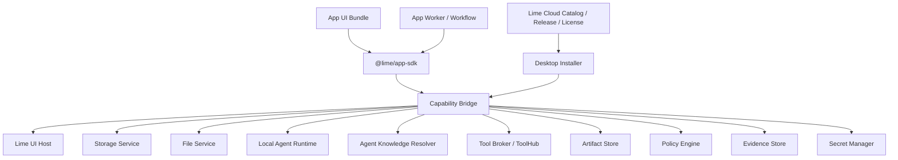
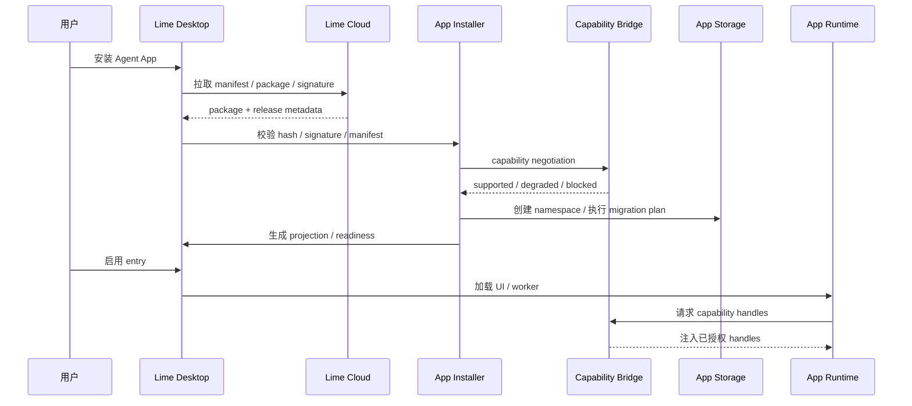

# Agent App 客户端 Capability SDK 方案

更新时间：2026-05-16

## 一句话目标

在 Lime Desktop 客户端侧提供稳定、版本化、可授权、可 mock 的 Capability SDK；Agent App 通过 SDK 调用本地平台能力，自己实现 UI、业务流程、数据模型和交付物，而不重复造 Lime 客户端底座、不依赖内部实现。

更严格地说：业务用户应留在 App 的业务工作台里完成任务；Lime Agent 通过 `lime.agent` / `lime.workflow` 作为 App 可编排的任务运行时被调用。SDK 不是把用户送回通用 Chat 的跳板，也不是允许 App 绕过 Lime 自建模型、工具、凭证和证据系统的逃逸口。

## 边界

本文只讨论 Lime Desktop / Lime 客户端侧能力：App Host、Capability Bridge、UI Host、Storage Namespace、Worker / Workflow Runtime、本地 Agent Runtime Bridge。Cloud / LimeCore 的 catalog、release、tenant enablement、gateway、ToolHub 只作为上游输入，不在本文设计。

## 背景

真实 Agent App 和底层系统高度耦合。一个 App 可能同时需要：文件、知识库、模型任务、工具调用、Artifact、UI、storage、background task、权限、凭证、Evidence、升级和 tenant overlay。

如果没有 SDK，每个 App 都会重复实现这些底座；Lime 底层升级后，所有 App 都要大改。Agent App 平台能成立的前提，是把 Lime 能力封装成稳定 capability facade。

## 非目标

- P0 不做公开 marketplace、支付分账、审核流。
- P0 不允许 App 直接运行任意无沙箱代码访问系统资源。
- P0 不把 Cloud 变成默认 Agent Runtime。
- P0 不把某个垂直业务写进 Lime Core。
- P0 不要求一次性支持所有 UI 插件形态；先支持可控 extension slot。

## 核心原则

1. **SDK 暴露能力，不暴露实现**：App 不能 import Lime internal path。
2. **声明先于调用**：manifest 先声明 capability、permission、storage、secret、network、tool。
3. **Host 注入能力**：运行时由 Desktop 注入 capability handles。
4. **权限双层拦截**：UI 提示只是体验，runtime bridge 必须强制拦截。
5. **App 数据命名空间化**：每个 App 有独立 storage namespace、artifact namespace、event namespace。
6. **Cloud 不跑默认 Agent**：Cloud 做 catalog、release、license、tenant enablement、gateway。
7. **可 mock 和 contract test**：每个 capability 都要有 mock host 和契约测试。
8. **升级不覆盖用户资产**：官方包、tenant overlay、workspace data、secrets 分离。
9. **业务不出 App**：Agent 任务进度、引用、错误、人工确认和结构化结果都应回到 App UI / workflow 内呈现。
10. **Agent 不出 Lime 治理**：模型、工具、知识、文件、凭证、Artifact、Evidence、成本和权限都必须通过 `lime.*` capability。
11. **完整 Agent 能力不等于模型 API**：`LIME_GATEWAY_*` / `OPENAI_BASE_URL` 只能是低阶模型 executor 或 degraded fallback；`lime.agent` / `lime.workflow` 的生产事实源必须回到 `internal/roadmap/agentruntime/app-surface-runtime.md` 定义的 AgentRuntime Surface。

## Lime 全功能能力化地图

详细执行路线图见 [P18.7 Full Lime Capability Surface](./p18-7-full-lime-capability-surface.md)。本文保留 SDK / Host Bridge 方案和能力地图摘要；后续代码实施顺序、v0.6 标准兼容和完成审计以 P18.7 文档为准。

代码事实源：`src/features/agent-app/sdk/capabilityCatalog.ts`。后续新增、迁移或下线 Lime 能力时，必须先更新该 catalog，再由 `capabilityContract.ts`、`hostCapabilityProfile.ts`、`mockCapabilityProfile.ts`、`adapterCapabilityProfile.ts` 和 SDK public surface 派生；禁止在业务 App、mock、adapter 或文档里再维护第二份能力清单。

这张表回答“所有 Lime 功能如何被 App 使用”：App 负责业务形态、状态递进和结果验收；Lime 主 App 负责 AgentRuntime、模型、工具、凭证、策略、证据、成本和平台资源。`current` 代表 SDK 名称和 profile 已进入单一事实源；`preview` 代表先占住统一抽象和边界，底层实现不得在业务 App 内私造。

| 分组          | Capability          | 阶段    | Lime owner              | App 做什么                                    | Lime 主 App 做什么                                         |
| ------------- | ------------------- | ------- | ----------------------- | --------------------------------------------- | ---------------------------------------------------------- |
| App surface   | `lime.ui`           | current | Desktop Host            | 决定业务页面、提示和导航触发时机。            | 主题、语言、受控导航、下载、入口校验。                     |
| App surface   | `lime.events`       | preview | Desktop Host            | 订阅业务事件，不写私有 bridge。               | 事件路由、namespace 隔离、订阅生命周期。                   |
| App surface   | `lime.workspace`    | preview | Desktop Host            | 围绕当前 workspace 展示业务状态。             | workspace 身份、路径 ref、跨平台路径封装。                 |
| Data          | `lime.storage`      | current | Desktop Host            | 定义业务对象、schema、写回时机。              | namespace 隔离、持久化、provenance。                       |
| Data          | `lime.files`        | current | Desktop Host            | 声明文件类型，把解析结果转为业务草稿。        | 文件授权、file ref、解析器、安全边界。                     |
| Data          | `lime.knowledge`    | current | Knowledge Runtime       | 选择知识空间并消费检索结果。                  | 知识索引、binding、版本、引用 provenance。                 |
| Data          | `lime.artifacts`    | current | Artifact Runtime        | 定义产物类型、内容结构和业务状态联动。        | 产物持久化、viewer/export、来源记录。                      |
| Data          | `lime.documents`    | preview | Tool Runtime            | 定义 PDF / Word / Markdown / PPT 的业务落点。 | 文档解析、格式转换、权限和 evidence。                      |
| Agent runtime | `lime.agent`        | current | AgentRuntime            | 组装业务任务输入、期望产物、人工确认。        | session/thread/turn/task、Skills、Tools、模型、Evidence。  |
| Agent runtime | `lime.workflow`     | current | AgentRuntime            | 定义业务步骤、checkpoint 和人工介入点。       | workflow 状态、恢复、Host response、权限。                 |
| Agent runtime | `lime.tools`        | current | Tool Runtime            | 声明工具需求并消费结构化结果。                | Tool Broker、权限、进度、超时、审计。                      |
| Agent runtime | `lime.models`       | preview | AgentRuntime            | 表达任务偏好、质量/成本约束。                 | 模型事实源、Provider 能力、路由和成本估算。                |
| Agent runtime | `lime.memory`       | preview | AgentRuntime            | 声明可读/可写记忆意图。                       | `memory_runtime_*` / `unified_memory_*`、上下文压缩。      |
| Agent runtime | `lime.skills`       | preview | AgentRuntime            | 声明必需 Skill 和业务场景。                   | Skill catalog、workspace binding、runtime gate、调用证据。 |
| Agent runtime | `lime.context`      | preview | AgentRuntime            | 显式提交当前业务选择和资源上下文。            | session/thread/turn context、压缩和恢复边界。              |
| Agent runtime | `lime.automation`   | preview | AgentRuntime            | 定义业务触发、输入和终止条件。                | automation job runtime、队列、权限、证据。                 |
| Integration   | `lime.mcp`          | preview | Tool Runtime            | 声明需要的 MCP capability。                   | MCP bridge、inventory、命名、权限和审计。                  |
| Integration   | `lime.browser`      | preview | Tool Runtime            | 表达网页采集目标和用户授权。                  | 浏览器 profile、自动化、截图、回放证据。                   |
| Integration   | `lime.search`       | preview | Tool Runtime            | 给出业务检索问题和筛选规则。                  | 搜索/深搜 provider、来源去重、引用、成本。                 |
| Integration   | `lime.media`        | preview | Tool Runtime            | 给出图片/音频/视频 brief 和交付约束。         | 媒体 runtime、文件产物、安全策略、成本。                   |
| Integration   | `lime.terminal`     | preview | Tool Runtime            | 说明命令目的和输入。                          | sandbox、approval、日志、危险操作拦截。                    |
| Integration   | `lime.connectors`   | preview | Cloud Overlay / Desktop | 声明外部系统连接需求。                        | OAuth、secret、tenant policy、连接器审计。                 |
| Governance    | `lime.policy`       | current | Policy Runtime          | 说明能力用途并处理拒绝/降级。                 | 权限、风险、成本、企业策略和授权。                         |
| Governance    | `lime.secrets`      | current | Policy Runtime          | 只保存 secret ref，不读取明文。               | 凭证托管、授权、轮换、最小权限访问。                       |
| Governance    | `lime.settings`     | preview | Desktop Host            | 读/改自己的配置域。                           | schema、workspace overlay、tenant 默认值、迁移。           |
| Governance    | `lime.review`       | preview | Policy Runtime          | 把审核嵌入业务 UI。                           | 审核证据、权限、发布门禁和决策记录。                       |
| Governance    | `lime.capabilities` | preview | Desktop Host            | 根据 profile 做降级，不猜测底层实现。         | 发布能力目录、版本、readiness 和可用性。                   |
| Observability | `lime.evidence`     | current | Artifact Runtime        | 声明证据类型并挂到产物/任务。                 | evidence 持久化、导出、审计。                              |
| Observability | `lime.usage`        | preview | AgentRuntime            | 展示业务任务成本并响应预算拦截。              | Token、费用、预算、request telemetry 归因。                |
| Observability | `lime.tasks`        | preview | AgentRuntime            | 展示本 App 相关后台任务。                     | 任务中心、队列、恢复、事件订阅、审计。                     |

### 可用性口径

| 层                         | current 事实源                                            | 说明                                                                           |
| -------------------------- | --------------------------------------------------------- | ------------------------------------------------------------------------------ |
| 名称 / 分组 / owner / 阶段 | `capabilityCatalog.ts`                                    | 唯一允许新增 `lime.*` 名称的地方。                                             |
| TypeScript 调用契约        | `capabilityContract.ts`                                   | 所有 capability 必须有 typed method；未实现也要返回 stable unavailable error。 |
| SDK facade                 | `capabilityAdapters.ts`                                   | `createLimeCoreCapabilityAdapters()` 按 catalog 自动生成全部 adapter key。     |
| Host readiness profile     | `hostCapabilityProfile.ts`                                | 基础 profile 覆盖所有 capability，默认 `enabled=false / implementation=none`。 |
| Mock / adapter profile     | `mockCapabilityProfile.ts`、`adapterCapabilityProfile.ts` | 只从 catalog 标注的能力派生，不再各自维护数组。                                |
| 真实执行                   | AgentRuntime / ToolRuntime / Desktop Host                 | 业务 App 不拥有执行事实源；preview 能力未接入时必须显式不可用。                |

### 边界结论

1. 业务 App 可以拥有多个页面、多个工作流、多个业务对象，但不能拥有第二套模型、工具、Skill、凭证、成本、证据或运行过程事实源。
2. `lime.agent` 只是完整 Agent 能力入口之一；模型选择、Skill、MCP、浏览器、搜索、媒体、终端、记忆、用量和审计都必须继续向对应 `lime.*` capability 收敛。
3. Claw 已有能力不能复制到 App 内；Chat `@命令`、Agent App task、Automation job 都应成为同一 AgentRuntime / capability catalog 的 surface adapter。
4. preview capability 不是假入口：profile 默认关闭，调用必须返回 stable unavailable / policy error；只有 Host 真正接线后才可标记 `mock`、`adapter` 或 `native`。

## 架构图



## 与 AgentRuntime Surface 的关系

Capability SDK 是 App 调用 Lime 能力的 facade，不是新的 Agent Runtime。Agent App、Claw Chat、Automation 共享的执行事实源是 AgentRuntime：

```text
Agent App
  -> @lime/app-sdk
  -> Host Bridge / Capability Bridge
  -> Agent App Runtime Surface
  -> AgentRuntime control plane
  -> Aster / lime_agent / Claw capability / Skills / Tools / Evidence
```

边界固定如下：

| 层                                                        | 做什么                                                                                                                                                  | 不做什么                                                                               |
| --------------------------------------------------------- | ------------------------------------------------------------------------------------------------------------------------------------------------------- | -------------------------------------------------------------------------------------- |
| `@lime/app-sdk`                                           | 暴露 `lime.storage`、`lime.agent`、`lime.workflow` 等稳定 facade。                                                                                      | 不暴露 Lime internal path，不执行模型和工具。                                          |
| Host Bridge                                               | 安全传输、主题、语言、capability invoke、Host action。                                                                                                  | 不保存执行事实，不判断任务完成。                                                       |
| Agent App Runtime Surface                                 | 把 App task / workflow 映射成 AgentRuntime request，并附加 app provenance。                                                                             | 不复制 Claw skill launch，不新建第二套 runtime。                                       |
| AgentRuntime                                              | 维护 session/thread/turn/task/event/read model/evidence。                                                                                               | 不决定垂直 App UI 形态。                                                               |
| AgentRuntime Capability Catalog / Claw Capability Catalog | 把现有 `@配图`、`@搜索`、`@研报` 等能力注册为可复用 capability；Chat `@命令`、Agent App `lime.agent.startTask`、Automation job 都只是 surface adapter。 | 不再让能力只绑定 Chat/Inputbar，也不把 capability catalog owner 下放给 Agent App SDK。 |

生产期 `lime.agent.startTask` / `lime.workflow.start` 必须通过后端 AgentRuntime Surface；前端 `CapabilityHost` / `WorkflowRuntimeHost` 只能作为 adapter、mock 或本地预览，不得成为生产执行事实源。详细设计见：

- `internal/roadmap/agentruntime/app-surface-runtime.md`
- `internal/roadmap/agentruntime/backend-surface-facade-plan.md`
- `internal/roadmap/agentruntime/claw-capability-sharing.md`

## Host Bridge v1

正式 App UI 运行在 iframe / sandbox 中时，Capability SDK 不能依赖 React context、全局 store 或直接 import Lime 模块。UI 侧 SDK 请求必须通过标准 Host Bridge 传输：

```text
App UI
  -> @lime/app-sdk facade
  -> lime.agentApp.bridge message
  -> AgentAppHostBridge
  -> P14 guard / readiness / policy
  -> Lime capability implementation
```

标准信封：

```ts
interface LimeAgentAppBridgeMessage {
  protocol: "lime.agentApp.bridge";
  version: 1;
  type: string;
  requestId?: string;
  appId: string;
  entryKey?: string;
  payload?: unknown;
}
```

首版 Host Bridge 覆盖：

| 方向        | 事件                                  | 说明                                          |
| ----------- | ------------------------------------- | --------------------------------------------- |
| Host -> App | `host:snapshot` / `theme:update`      | 同步主题、语言、入口上下文、capability 摘要。 |
| Host -> App | `host:response` / `host:error`        | 按 `requestId` 返回 SDK / Host action 结果。  |
| Host -> App | `host:visibility`                     | 页面可见性变化，供 App 暂停或恢复轻量同步。   |
| App -> Host | `app:ready` / `host:getSnapshot`      | App 初始化和快照补偿。                        |
| App -> Host | `host:toast` / `host:navigate`        | 非技术提示和受控导航。                        |
| App -> Host | `host:openExternal` / `host:download` | 受控外链和同源产物下载。                      |
| App -> Host | `capability:invoke`                   | SDK capability 调用统一入口。                 |

安全规则：

1. Host 必须校验 `event.source`、`event.origin`、`protocol`、`version`、`appId`、`entryKey`。
2. `capability:invoke` 仍必须经过 manifest 声明、entry readiness、permission、policy 和 provenance。
3. 未开放能力返回 blocked error，不返回 mock 成功、不写假数据。
4. 主题同步只传当前已生效 token；App 只应用到自己的 DOM，不读取外层 DOM。
5. App 不应各自解析 `theme.tokens` 或手写 `root.style.setProperty` 循环。主题 payload 到 DOM 的同步事实源是 SDK helper `applyLimeHostTheme` / `syncLimeHostTheme`；业务 App 只调用 helper，并在 CSS 中消费 `--lime-*` / `--app-*` token。

## Host Bridge SDK Client

P18.5-S 已在 Lime-side SDK 增加标准 Host Bridge client，目标是让 package-side App 不再各自手写私有 `postMessage` wrapper。App UI 仍运行在 sandbox frame 内，但业务代码只依赖 SDK-style runtime handle：

```ts
import {
  buildLimeCapabilityInvokeProvenance,
  createLimeCoreCapabilityAdapters,
  createLimeHostBridgeCapabilityInvoker,
} from "@lime/app-sdk";

const provenance = buildLimeCapabilityInvokeProvenance({
  sourceKind: "agent_app",
  appId: "content-factory-app",
  appVersion: "1.0.0",
  packageHash,
  manifestHash,
  entryKey: "dashboard",
});

const lime = createLimeCoreCapabilityAdapters({
  invoker: createLimeHostBridgeCapabilityInvoker({
    appId: "content-factory-app",
    entryKey: "dashboard",
    trustedHostOrigin: "https://lime.local",
  }),
  provenance,
  storageNamespace: "content-factory-app",
});

await lime.agent.startTask({
  title: "生成内容批次",
  taskKind: "content.copy.generate",
  idempotencyKey: "dashboard:copy",
  expectedOutput: {
    artifactKind: "content_batch",
    workspacePatch: "contentFactoryWorkspacePatch",
  },
});
```

客户端当前实现位置：

| 对象                                                  | 作用                                                                                                                                                                                                                                                                                                                                                               |
| ----------------------------------------------------- | ------------------------------------------------------------------------------------------------------------------------------------------------------------------------------------------------------------------------------------------------------------------------------------------------------------------------------------------------------------------ |
| `src/features/agent-app/sdk/hostBridgeClient.ts`      | 把 typed SDK request 转成 Host Bridge v1 `capability:invoke` message，处理 `app:ready`、`host:getSnapshot`、`host:toast`、`host:navigate`、`host:openExternal`、`host:download`、`host:snapshot`、`theme:update`、`host:visibility`、`host:response` / `host:error`、trusted origin、timeout、pending cleanup，以及 `capability:subscribe / unsubscribe / event`。 |
| `src/features/agent-app/sdk/index.ts`                 | SDK-only public surface，只导出 capability facade、stable error、Host Bridge client、mock host 和 App package 需要的 task / storage / artifact / evidence 类型；不导出 UI、installer、repository 或 runtime host 内部实现。                                                                                                                                        |
| `src/features/agent-app/index.ts`                     | 当前 Lime repo public feature entry 已导出 `createLimeCoreCapabilityAdapters`、`createLimeHostBridgeCapabilityInvoker`、`LIME_AGENT_APP_BRIDGE_PROTOCOL` 与 `LIME_AGENT_APP_BRIDGE_VERSION`，作为后续正式 SDK package / package-local shim 的事实源。                                                                                                              |
| `src/features/agent-app/sdk/hostBridgeClient.test.ts` | 覆盖 ready / snapshot / theme / visibility / toast / navigate / openExternal / download、envelope、stable error、timeout cleanup、capability subscription 事件分发，以及内容工厂 task / storage / artifact / evidence 主链。                                                                                                                                       |
| `src/features/agent-app/sdk/publicSdkSurface.test.ts` | 固定 SDK-only public surface，确保后续正式 `@lime/app-sdk` 或 package-local shim 可以从窄导出清单取能力；同时从运行时 namespace 和源码 export 来源两侧禁止导出 UI、安装器、repository、runtime host、adapter、schema 或 dispatcher 内部对象。                                                                                                                      |
| `src/features/agent-app/index.test.ts`                | 固定 public feature entry 的 SDK export seam，防止后续 App 只能依赖 Lime 内部深路径。                                                                                                                                                                                                                                                                              |

发布状态与退出条件：正式 `@lime/app-sdk` package 尚未从 Lime repo 独立发布；外部 App 仍不得 import `src/features/agent-app/*` 或其它 Lime internal path。P18.5.3 如果需要 package-local shim，只能镜像本节 public API，并在正式 SDK package 可安装后退出。

2026-05-16 08:37 只读复核：Lime repo 根 `package.json` 仍是 `"private": true` 的桌面 App 包；`packages/` 下只有 `packages/lime-cli-npm`，未发现独立 `@lime/app-sdk` / `lime-app-sdk` package 或 workspace export。当前可依赖的 Lime-side 事实源仍是 `src/features/agent-app/index.ts` 的 public feature entry 与 `index.test.ts` 的 export regression；因此外部 `content-factory-app` 在 P18.5.3 迁移时不能 import Lime internal path，正式 SDK 未发布前只能使用带退出条件的 package-local shim 或等待后续独立 SDK package。

2026-05-16 09:52 补充：Lime-side 已新增 `src/features/agent-app/sdk/index.ts` 作为 SDK-only public surface，并用 `publicSdkSurface.test.ts` 固定导出范围。该文件仍不是可安装 npm package，也不授权外部 App import Lime 源码深路径；它只是把后续正式 `@lime/app-sdk` 或 package-local shim 的导出清单从 feature 总入口中剥离出来，降低 UI / installer / runtime host 内部实现被误导出的风险。

2026-05-16 10:08 补充：`contentFactorySdkRegression.test.ts` 已改为只从 `src/features/agent-app/sdk/index.ts` 导入 SDK 类型和 helper，证明 Lime-side 内容工厂回归消费的是 SDK-only public surface，而不是 `capabilityContract.ts` / `capabilityAdapters.ts` 等内部深文件。该调整仍不代表外部 `content-factory-app` package 已迁移。

2026-05-21 补充：Agent App Studio 云端发布链路已收敛到宿主开放平台基础能力，不把发布业务代理进宿主。Studio 通过 `lime.cloudSession.getAccessToken` 显式获取宿主当前 session token，未登录或过期时通过 `lime.cloudSession.requestLogin` 拉起宿主登录。Lime GUI / DevBridge 模式下登录不再使用 `lime://oauth/callback` 作为浏览器回跳，而是在宿主侧启动 `127.0.0.1:<port>/oauth/callback` 一次性本机回调桥；Rust 命令 `start_oem_cloud_oauth_callback_bridge` 收到回调后 emit `oem-cloud-oauth-callback`，前端完成 session 写入并继续 Studio 上传。该命令必须作为 bridge truth 走真实 DevBridge / Rust，不允许在浏览器模式优先回退 mock，否则会出现“返回了 localhost 地址但没有真实监听服务”的假成功。2026-05-21 实测 `content-factory-app` 本地目录 `/Users/coso/Documents/dev/ai/limecloud/agentapp/docs/examples/content-factory-app` 可直接识别并一键上传，发布为开发构建 `0.8.0+studio.20260520182133563`，Release `agent-app-release-2368`。

迁移规则：

1. App package 业务文件不能直接构造 `lime.agentApp.bridge` message。
2. App package 可以保留业务 helper，但 helper 底层必须调用 `lime.agent / lime.storage / lime.artifacts / lime.evidence` typed facade。
3. `app:ready`、snapshot、theme、visibility、toast、navigate、openExternal、download 等 Host action / Host event 必须通过 SDK client 使用，不由业务文件直接监听 window message。
4. `trustedHostOrigin` 应由 Host snapshot / package runtime 注入；开发态可以配置为本地 Host origin，但不得在生产包里写死任意公网 origin。
5. `targetOrigin` 默认跟随 `trustedHostOrigin`；缺失时只能作为开发态 fallback，不作为正式 package verify 的通过条件。
6. 订阅类进度事件必须通过 `subscribeCapability / unsubscribeCapability` 注册，业务文件只消费事件 payload，不直接监听 `capability:event`。
7. P18.5.3 外部 `content-factory-app` 已在 2026-05-16 10:55 完成 package-side SDK facade / verify / dist 同步；后续迁移其它 App 时仍按同一规则执行，不允许回退到私有 bridge transport。

## App 内 Agent Task API

`lime.agent` 是 App 调用 Lime Agent 的主能力，不是跳转通用 Chat 的快捷方式。App 决定业务任务何时启动、需要什么上下文、结果写回哪个业务对象；Host 决定 Agent task 如何运行、可用哪些工具 / 知识 / secret、如何记录 trace / artifact / evidence。

最小请求语义：

```ts
interface LimeAgentTaskRequest {
  appId: string;
  entryKey: string;
  taskKind: string;
  idempotencyKey: string;
  input: unknown;
  expectedOutput?: unknown;
  knowledge?: Array<{ key: string; mode: "retrieval" | "data" }>;
  tools?: string[];
  humanReview?: boolean;
}
```

最小运行语义：

| 阶段       | App 责任                                                                                 | Lime Host / Agent 责任                                                                   |
| ---------- | ---------------------------------------------------------------------------------------- | ---------------------------------------------------------------------------------------- |
| Start      | 从当前页面 / workflow 组装业务输入、期望结构和幂等键。                                   | 校验 manifest、entry readiness、permission、policy、cost。                               |
| Stream     | 在 App 内显示进度、引用、工具调用、错误和可取消状态。                                    | 发送 `taskId`、`traceId`、status、tool call、citation、partial artifact、blocked error。 |
| Review     | 让用户编辑、确认、拒绝或重试结果。                                                       | 保留 trace，确保重试和取消可审计。                                                       |
| Write-back | 通过 `lime.storage` 写业务对象，通过 `lime.artifacts` / `lime.evidence` 写交付物和依据。 | 自动附加 appId、entryKey、package provenance、workspace / tenant 上下文。                |

验收口径：内容工厂的资料整理、场景生成、批量文案、交付和复盘都应在 App 页面内启动、观察、确认和写回；Expert Chat 只能作为嵌入式协作者读取同一上下文，不允许成为手工复制结果的旁路。

后端验收口径：App task 启动后必须能关联 `sessionId / threadId / turnId / taskId / traceId`，并可由 AgentRuntime read model / Evidence Pack 追溯；不能只返回模型文本或前端 mock task。

## 安装时序



## Runtime Package 契约

```text
app-package/
├── APP.md
├── dist/ui
├── dist/worker
├── storage/schema.json
├── storage/migrations
├── workflows
├── agents
├── artifacts
├── policies
└── examples
```

安装器必须做到：

- 只信任 package 内声明过的入口。
- UI、worker、workflow、migration 都有 package provenance。
- storage migration 先 dry-run / plan，再执行。
- user data、workspace data、tenant overlay 不进入 package hash。

## App Manifest 核心字段

```yaml
requires:
  lime:
    appRuntime: ">=0.3.0 <1.0.0"
  capabilities:
    lime.ui: "^0.3.0"
    lime.storage: "^0.3.0"
    lime.agent: "^0.3.0"
runtimePackage:
  ui:
    path: ./dist/ui
  worker:
    path: ./dist/worker
storage:
  namespace: app-id
  schema: ./storage/schema.json
  migrations: ./storage/migrations
entries:
  - key: dashboard
    kind: page
  - key: advisor
    kind: expert-chat
  - key: nightly_review
    kind: background-task
```

## P0 交付物

| 交付物                   | 说明                                                      | 验收                             |
| ------------------------ | --------------------------------------------------------- | -------------------------------- |
| App manifest v0.3 parser | 支持 `requires`、`runtimePackage`、`storage`、`entries`。 | 示例 App 可 validate / project。 |
| Capability SDK 类型草案  | TypeScript types + mock host。                            | App 示例可以用 mock 运行单测。   |
| Desktop Installer 方案   | 安装、hash、projection、readiness、权限。                 | 能生成 projection，不运行代码。  |
| Storage namespace 方案   | schema、migration、保留/删除策略。                        | 卸载时可选择保留数据。           |
| UI extension slot 方案   | page / panel / settings / artifact viewer。               | App 页面不需要写进 Core。        |
| Worker runtime 方案      | long task、cancel、trace、policy。                        | 能执行受控后台任务。             |
| Evidence 串联            | task/tool/knowledge/artifact/eval provenance。            | 产物能追溯 App 和知识版本。      |

## 分期计划

### P0：单机 App Host 骨架

- 完成 Agent App v0.3 标准对齐。
- 设计 `@lime/app-sdk` 最小 API surface 和 mock host。
- Desktop 支持安装本地 package、projection、readiness。
- 支持 page / expert-chat / workflow 三类 entry。
- 支持 storage namespace + basic migration。
- 支持 Artifact create + Evidence provenance。

### P1：真实垂直 App 验证

- 用 内容工厂验证 UI、storage、workflow、worker、Agent task、Artifact。
- 支持文件选择、文档解析、Knowledge binding、批量生成和去 AI 味 eval。
- App 所有业务 UI 不进 Lime Core。

### P2：Cloud Catalog / Tenant Enablement

- Cloud 下发 app release、package hash、tenant enablement、license。
- Desktop 只执行已启用 App。
- 支持 tenant overlay 覆盖默认知识、工具、模型、eval 阈值。

### P3：安全、升级和生态

- App signature、sandbox、permission review、compat matrix。
- SDK capability deprecation 策略和 contract tests。
- App-to-App capability sharing 规则。
- Marketplace / 私有分发 / 企业策略。

## 风险与应对

| 风险                 | 影响                                    | 应对                                                                                                |
| -------------------- | --------------------------------------- | --------------------------------------------------------------------------------------------------- |
| SDK 过厚             | 变成第二套 Lime 内部 API。              | 只暴露 capability facade，不暴露 store/internal path。                                              |
| SDK 过薄             | App 重复造轮子。                        | P0 优先封装高频底座：storage、files、agent、artifact、knowledge、tools。                            |
| UI 安全              | App UI 诱导授权或越权访问。             | Host 控制容器 + runtime permission bridge 双拦截。                                                  |
| Migration 破坏数据   | App 升级损坏用户数据。                  | migration plan、dry-run、backup、保留数据策略。                                                     |
| Cloud 变 Runtime     | 破坏 Lime 本地运行定位。                | server-assisted 必须显式声明并受 policy 控制。                                                      |
| Agent 能力退化为 API | App 绕过 Claw / Aster / Evidence 主链。 | `lime.agent` / `lime.workflow` 必须进入 AgentRuntime Surface，模型 token 仅作 executor / fallback。 |
