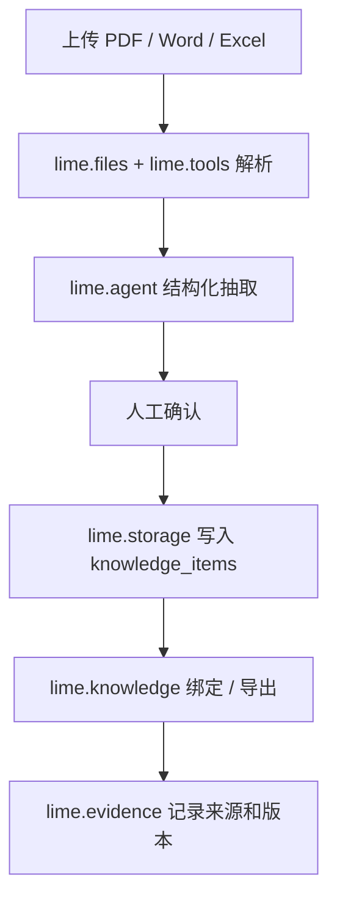
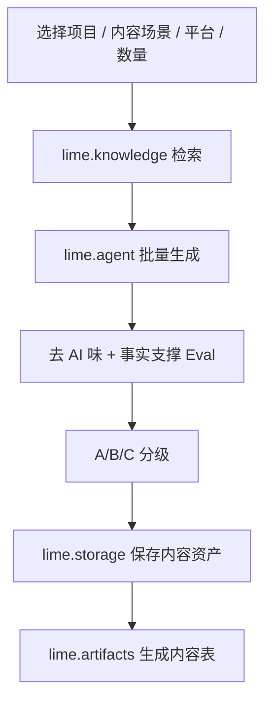
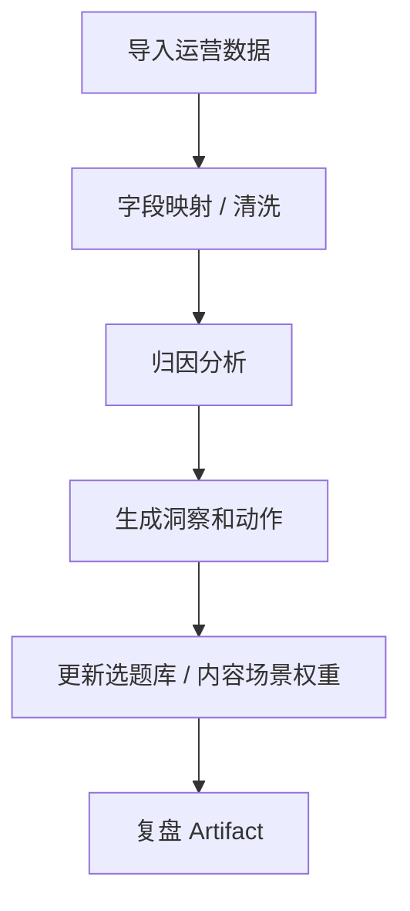

# 内容工厂 PRD

更新时间：2026-05-16

## 一句话目标

基于 Lime Agent App 平台开发一个独立垂直产品：`内容工厂`。它不是“内容专家聊天框”，而是有自己 UI、storage、worker、workflow、Knowledge 绑定、Artifact 和数据复盘闭环的完整业务应用，安装到 Lime Desktop 后本地运行。

验收心智：运营用户应在内容工厂内完成资料整理、场景规划、批量生产、交付和复盘；Lime Agent 在背后作为 `lime.agent` / `lime.workflow` 能力执行任务。用户不应为了关键步骤跳回 Lime 通用 Chat，也不允许内容工厂自建一套模型、凭证、权限、证据和工具底座来绕过 Lime。

## 关键校准

这份需求不能用 `APP.md + prompt` 解决。功能背后必须有完整实现：

```text
内容工厂
├── UI：项目首页 / 三层知识库 / 内容场景规划 / 内容工厂 / 策略报告 / 数据复盘
├── Storage：项目、知识条目、内容场景、内容资产、复盘数据、洞察
├── Worker：文件解析、知识结构化、批量生成、去 AI 味评分、PPT / 报告生成
├── Workflow：建项目、知识库构建、内容场景规划、内容生产、策略交付、数据复盘
├── Agent Entries：内容策略专家、知识库整理专家、文案优化专家
├── Skills / Tools / Knowledge：复用生态能力，不重复造底座
└── Artifacts / Evidence / Evals：内容表、脚本、报告、PPT、复盘和质量记录
```

`APP.md` 只声明这些能力和入口；真实功能在 runtime package 中实现，并通过 `@lime/app-sdk` 调用 Lime 能力。

内容工厂内的 Expert 只是协作者入口：它可以读取当前项目、资料版本、内容批次和复盘指标，也可以触发 App workflow；但它不能成为“用户把结果从聊天框复制回内容表”的旁路。

后端事实源：内容工厂的 AI 任务必须通过 `internal/roadmap/agentruntime/app-surface-runtime.md` 定义的 Agent App Runtime Surface 进入 AgentRuntime 主链。`LIME_GATEWAY_*` / 模型 API 只能作为低阶 executor 或降级能力，不能替代 Lime Agent 的工具、知识、权限、证据和 artifact 治理。

当前实现进展：Lime Host 的 `AgentAppRuntimePage` 已把 iframe Host Bridge 里的 `lime.agent.startTask / streamTask / getTask / cancelTask / retryTask / submitHostResponse` 接入 `agent_app_runtime_*` facade，并由后端复用 `AgentRuntimeThreadReadModel` 投影 `taskStatus / taskEvents`。这意味着内容工厂页面内发起“生成文案 / 场景规划”等 Agent task 时，第一跳已经进入完整 Lime AgentRuntime 主链；当 runtime 追问上下文、等待确认或要求工具授权时，App 也能在页面内回传响应，而不是跳回通用 Chat。Host Bridge / `AgentRuntimeCapabilityHost` 负责把 Claw 式过程进一步封装为标准 `runtimeProcess` / `process`：包含思考、正文流、执行流、Skill、工具、模型、Token、费用、产物、证据、终态与默认折叠策略。内容工厂只消费该视图做业务展示，不再维护自己的底层运行过程解析器。当前剩余缺口是更多真实多 capability 编排、后端/cross-surface capability policy owner，以及重启宿主后的端到端业务流覆盖。

新增硬验收：内容工厂不是“本地 Web + 生成 API”。知识库整理、场景地图、内容战役、脚本 / 图片提示词、交付包和复盘只要触发 AI 业务动作，就必须构造 `ContentFactoryAgentTask` 并通过 `lime.agent` 进入 AgentRuntime。页面必须展示 AI 运行现场：思考、执行、流式输出、Skill、工具、模型、Token、费用、artifact、evidence；完成后可以折叠，但过程不能消失。Host 已连接时，`/api/scene/generate`、`/api/copy/batch`、`/api/script/generate`、`/api/strategy/analyze`、`/api/review/submit` 等本地生成接口只能作为开发 fallback，不能承接正式生成。

## 背景

来自行业内容团队的真实需求：团队希望把个人 IP、项目事实、内容方法论、素材资产和运营复盘沉淀成可复用系统，而不是每次在 Claude、豆包、Gemini、图片工具、PPT 工具之间复制粘贴。

核心链路：

```text
三层知识库
→ 内容场景规划
→ 批量内容生产
→ 脚本 / 图片提示词 / 策略报告 / PPT
→ 数据复盘
→ 选题库和知识库迭代
```

这不是 Lime Core 的垂直功能，而是验证 Agent App 平台能力的标杆 App。

## 用户与收益

| 用户           | 核心诉求                                                                           | 收益                                            |
| -------------- | ---------------------------------------------------------------------------------- | ----------------------------------------------- |
| 内容运营团队   | 项目资料一次沉淀，批量生产文案、脚本、提示词。                                     | 从灵感驱动变为系统化生产。                      |
| 个人 IP / 讲师 | 基于本人经历和表达风格产出文章、课程稿、朋友圈和私域话术。                         | 语气一致、素材复用、减少重复讲背景。            |
| 交付顾问       | 为客户交付可运行系统，而不是复制 prompt 或 fork Lime。                             | 交付可复制，官方 App 可升级，客户数据不被覆盖。 |
| 团队管理员     | 控制 App 可见性、模型、工具、默认知识模板、质量门禁。                              | 团队能力标准化、权限可控。                      |
| Lime 平台      | 验证 App SDK、UI extension、storage namespace、worker runtime、artifact/evidence。 | 新行业通过 App 扩展，不污染 Core。              |

## 非目标

- 不把行业内容系统写进 Lime Core。
- 不把客户真实资料、私有 SOP、品牌语气、投放数据打进官方 App 包。
- 不在 Lime Cloud 增加默认云端 Agent Runtime。
- P0 不做完整 SaaS：不做账号体系、计费、复杂审核、公开 marketplace。
- P0 不做全部外部平台 API，对数据复盘先支持 CSV / Excel 手动导入。

## 产品形态

### 主导航

```text
内容工厂
├── 项目组合 / 项目驾驶舱
├── 知识库底座
├── 场景地图
├── 内容战役
│   ├── 战役设置
│   ├── 场景包
│   ├── 文案批次
│   ├── 脚本与图片提示词
│   ├── 质量检查
│   └── 提交确认
├── 交付包
├── 复盘与下一轮
└── 项目设置
```

### Expert entries

专家只是 App 内的入口：

| Expert         | 用途                               |
| -------------- | ---------------------------------- |
| 内容策略专家   | 项目定位、竞品分析、内容方向判断。 |
| 知识库整理专家 | 协助资料分层、裁剪、版本化。       |
| 文案优化专家   | 去 AI 味、平台适配、人工改稿。     |
| 数据复盘专家   | 解释方向表现、生成下周建议。       |

## App Package 草案

```text
content-factory-app/
├── APP.md
├── dist/
│   ├── ui/
│   └── worker/
├── storage/
│   ├── schema.json
│   └── migrations/
├── workflows/
│   ├── create-project.workflow.md
│   ├── build-knowledge.workflow.md
│   ├── content-scenarios.workflow.md
│   ├── batch-copy.workflow.md
│   ├── strategy-report.workflow.md
│   └── data-review.workflow.md
├── agents/
│   ├── content-strategist.md
│   ├── knowledge-architect.md
│   └── review-analyst.md
├── skills/
├── knowledge-templates/
├── artifacts/
├── evals/
└── policies/
```

## Manifest 草案

```yaml
manifestVersion: 0.3.0
name: content-factory-app
version: 0.3.0
status: draft
appType: domain-app
description: 内容工厂，用于知识库构建、内容场景规划、批量内容生产和数据复盘。
runtimeTargets:
  - local
requires:
  lime:
    appRuntime: ">=0.3.0 <1.0.0"
  capabilities:
    lime.ui: "^0.3.0"
    lime.storage: "^0.3.0"
    lime.files: "^0.3.0"
    lime.agent: "^0.3.0"
    lime.knowledge: "^0.3.0"
    lime.tools: "^0.3.0"
    lime.artifacts: "^0.3.0"
    lime.workflow: "^0.3.0"
    lime.evidence: "^0.3.0"
runtimePackage:
  ui:
    path: ./dist/ui
  worker:
    path: ./dist/worker
  storage:
    schema: ./storage/schema.json
    migrations: ./storage/migrations
storage:
  namespace: content-factory-app
  schema: ./storage/schema.json
  migrations: ./storage/migrations
entries:
  - key: dashboard
    kind: page
    title: 项目首页
    route: /dashboard
  - key: knowledge
    kind: page
    title: 三层知识库
    route: /knowledge
  - key: content_scenario_planning
    kind: workflow
    title: 内容场景规划
    workflow: ./workflows/content-scenarios.workflow.md
  - key: content_factory
    kind: page
    title: 内容工厂
    route: /content-factory
  - key: content_strategist
    kind: expert-chat
    title: 内容策略专家
    persona: ./agents/content-strategist.md
knowledgeTemplates:
  - key: ip_knowledge
    standard: agentknowledge
    type: personal-profile
    required: false
  - key: project_knowledge
    standard: agentknowledge
    type: brand-product
    required: true
  - key: material_library
    standard: agentknowledge
    type: content-operations
    required: false
```

## Storage 模型

| 表                  | 说明                                                     |
| ------------------- | -------------------------------------------------------- |
| `projects`          | 项目、行业、平台、是否需要 IP、默认模型和状态。          |
| `knowledge_spaces`  | IP / project / material 三层知识库空间、版本和健康度。   |
| `knowledge_items`   | 分区知识条目、来源、证据、字数、版本。                   |
| `content_scenarios` | 内容场景规划结果：维度、痛点、解决方案、决策阶段、标签。 |
| `content_assets`    | 文案、脚本、图片提示词、报告等内容资产。                 |
| `review_imports`    | CSV / Excel 数据导入批次。                               |
| `metrics`           | 完播率、搜索占比、转化、素材复用率等指标。               |
| `insights`          | 自动归因、方向判断、下步建议。                           |
| `app_settings`      | 禁用词、平台规则、评分阈值、默认导出格式。               |

## Workflow

### 知识库构建



### 内容生产



### 数据复盘



## Capability 调用映射

全量 Lime 能力抽象、App / Lime 主 App 边界和后端接线顺序见 [P18.7 Full Lime Capability Surface](./p18-7-full-lime-capability-surface.md)。内容工厂只作为第一个业务验证 App，不拥有底层 AgentRuntime / ToolRuntime 能力事实源。

内容工厂只实现内容业务层，不实现 Lime 底层 AI 平台层。所有 Lime 功能先看 `internal/roadmap/agentapp/capability-sdk.md` 的全量能力地图；内容工厂 MVP 消费其中一部分，后续扩展也必须继续走 `lime.*` capability，而不是新增 `content_factory_*` 专用后端命令或裸模型 API。

| 业务功能                                | 主要 Capability                                               | 说明                                                                                           |
| --------------------------------------- | ------------------------------------------------------------- | ---------------------------------------------------------------------------------------------- |
| 文件上传和解析                          | `lime.files`、`lime.documents`、`lime.tools`                  | App 选择资料类型和业务落点；Lime 负责 file ref、解析器、工具执行和证据。                       |
| 三层知识库管理                          | `lime.storage`、`lime.knowledge`、`lime.evidence`             | App 管 IP / 项目 / 素材三层业务模型；Lime 管 namespace、检索、binding、版本和来源。            |
| 结构化抽取 / 场景 / 文案 / 脚本         | `lime.agent`、`lime.skills`、`lime.models`、`lime.memory`     | App 组织 task input 和 expected output；AgentRuntime 负责模型、Skill、上下文、记忆和运行事实。 |
| 批量任务、进度、中断                    | `lime.workflow`、`lime.tasks`、`lime.events`                  | App 展示阶段和人工确认；Lime 托管 checkpoint、任务中心、事件订阅和恢复。                       |
| 运行过程、思考、工具、模型、Token、费用 | `lime.agent`、`lime.usage`、`lime.capabilities`               | App 只消费 Host 下发的 `runtimeProcess`；模型、用量和可用性来自 Lime。                         |
| 内容表、报告、PPT、交付物               | `lime.artifacts`、`lime.documents`、`lime.media`              | App 定义交付结构；Lime 负责 artifact、导出、图片/音频/视频/文档 runtime。                      |
| 外部调研和网页采集                      | `lime.search`、`lime.browser`、`lime.mcp`、`lime.connectors`  | App 给出调研问题和筛选规则；Lime 负责搜索、浏览器、MCP、连接器和审计。                         |
| 凭证、权限、成本、风险、审核            | `lime.secrets`、`lime.policy`、`lime.settings`、`lime.review` | App 解释用途并处理降级；Lime 托管 secret、策略、设置 overlay 和发布/风险审核。                 |
| 产物证据和复盘                          | `lime.evidence`、`lime.usage`、`lime.tasks`                   | App 展示来源和复盘指标；Lime 从 runtime facts / telemetry 归因。                               |

边界结论：内容工厂可以有自己的多页面、多工作流和业务数据库视图，但模型路由、Skill 调用、MCP、浏览器、搜索、媒体、终端、凭证、Token 费用、Evidence Pack 和运行过程都必须由 Lime 主 App capability 提供。

## App 内 Agent 任务闭环

内容工厂的 Agent 能力必须作为业务任务嵌入 App，而不是跳转到通用 Chat：

| 业务任务        | App 输入                             | Lime Agent / Capability                                                                         | App 内写回                                                  |
| --------------- | ------------------------------------ | ----------------------------------------------------------------------------------------------- | ----------------------------------------------------------- |
| 资料整理        | 用户授权文件、资料类型、项目目标。   | `lime.files` / `lime.tools` 解析，`lime.agent.startTask` 结构化抽取，`lime.evidence` 记录来源。 | `knowledge_items` 草稿、资料健康度、人工确认状态。          |
| 场景规划        | 已确认知识库、目标平台、人群和数量。 | `lime.knowledge.search` 检索，`lime.agent.startTask` 生成结构化场景。                           | `content_scenarios` 表、场景 Artifact、引用证据。           |
| 批量文案 / 脚本 | 场景、平台规则、数量、风格约束。     | `lime.agent.startTask` + writer skills，Eval 检查事实支撑和去 AI 味。                           | `content_assets` / `script_batches`、A/B/C 分级、质量记录。 |
| 策略交付        | 内容批次、项目事实、竞品资料。       | `lime.agent.startTask` 生成报告结构，`lime.artifacts` 持久化交付物。                            | 策略报告、PPT 大纲、交付状态。                              |
| 数据复盘        | CSV / Excel 指标、历史内容资产。     | `lime.tools` 归一化，`lime.agent.startTask` 归因分析。                                          | `review_reports`、下轮动作、选题权重更新。                  |

每个任务都必须在内容工厂页面内展示进度、引用、工具调用、失败原因、重试和人工确认；最终结果以结构化对象写回 App storage，再生成 Artifact / Evidence。

当前 App Host 第一刀已具备：Host Bridge 的 `lime.agent` 调用会经 `AgentRuntimeCapabilityHost` 转入 `agent_app_runtime_start_task`，`streamTask / getTask` 先消费 `agent_app_runtime_get_task` 的 snapshot events，`cancelTask` 委托 `agent_app_runtime_cancel_task`，`retryTask` 复用同一 runtime session 重新提交 App task，`submitHostResponse` 委托 `agent_app_runtime_submit_host_response`。前端本地 adapter 继续只作为 storage / artifact / evidence / knowledge 的样板实现，不能再被用来证明内容工厂已经具备完整 Agent 能力。

### 写文案页面 Runtime 主链

“本轮任务”面板里的“生成文案和配套素材”和“只重写文案”是 App-scoped Agent task，不是普通表单 API：

```text
写文案表单状态
  -> lime.agent.startTask / lime.workflow.start
  -> Agent App Runtime Surface
  -> AgentRuntime session / turn / task
  -> Claw capability / Skill / Tool
  -> AgentAppTaskStreamEvent
  -> App 内 review
  -> storage / artifact / evidence write-back
```

最小 task 输入：

| 字段                | 来源                                                              |
| ------------------- | ----------------------------------------------------------------- |
| `taskKind`          | `content_factory.copy.generate` 或 `content_factory.copy.rewrite` |
| `task`              | “今天要完成什么”输入框                                            |
| `category`          | 品类输入框                                                        |
| `platform`          | 平台选择                                                          |
| `audience`          | 目标人群                                                          |
| `coreWords`         | 核心词                                                            |
| `materialVersion`   | 生产前检查中的资料版本                                            |
| `selectedScenarios` | 优先场景或自动补齐场景                                            |
| `scriptRefs`        | 现有脚本 / 视频口播引用                                           |
| `expectedOutput`    | 文案、素材 brief、脚本片段、交付包                                |
| `humanReview`       | 默认 `true`                                                       |

最小事件投影：

| 事件                                     | 页面反馈                                               |
| ---------------------------------------- | ------------------------------------------------------ |
| `task:started`                           | 本轮任务开始，锁定输入快照。                           |
| `task:contextChecked`                    | 更新“生产前检查”卡片，不再只显示静态数字。             |
| `task:missingContextRequested`           | 在 App 内补资料、补场景或追问用户。                    |
| `task:toolCall`                          | 显示知识检索、搜索、图片、报告、PDF / 总结等工具进度。 |
| `task:citation`                          | 显示资料版本、场景、网页或文件引用。                   |
| `task:partialArtifact`                   | 展示草稿文案、素材 brief、脚本片段。                   |
| `task:reviewRequested`                   | 用户在当前页面确认、编辑、拒绝或重试。                 |
| `task:completed`                         | 写回内容资产并生成交付物。                             |
| `artifact:created` / `evidence:recorded` | 交付物和证据已落库。                                   |

“只重写文案”必须限制 artifact policy：只允许改写当前文案资产，不允许重写资料、场景或脚本来源。“生成文案和配套素材”可以触发资料检查、场景补齐、素材 brief 和配图能力，但所有副作用都必须带 App provenance。

### 复用 Claw 能力

内容工厂不得复制 Claw 已有能力，首批复用关系见 `internal/roadmap/agentruntime/claw-capability-sharing.md`：

| 内容工厂需求          | 复用 capability                                                              | 后端主链                                             |
| --------------------- | ---------------------------------------------------------------------------- | ---------------------------------------------------- |
| 生产前资料补齐        | `lime.capability.research.search` / `lime.capability.summary.generate`       | `research_skill_launch` / `summary_skill_launch`     |
| 竞品和策略分析        | `lime.capability.report.generate`                                            | `report_skill_launch`                                |
| PDF / 资料读取        | `lime.capability.pdf.read`                                                   | `pdf_read_skill_launch`                              |
| 配套素材 / 海报 brief | `lime.capability.image.generate` / `lime.capability.cover.generate`          | `image_skill_launch` / `cover_skill_launch`          |
| 交付 PPT / 报告       | `lime.capability.presentation.generate` / `lime.capability.webpage.generate` | `presentation_skill_launch` / `webpage_skill_launch` |

## Host Bridge 要求

内容工厂是第一个正式样板 App，不能使用私有 iframe 协议。它的 UI runtime 必须接入 Agent App 标准 Host Bridge：

| 场景                  | Bridge 事件                     | 验收                                                                                          |
| --------------------- | ------------------------------- | --------------------------------------------------------------------------------------------- |
| 跟随 Lime 主题 / 配色 | `host:snapshot`、`theme:update` | 主 App 切换主题后，内容工厂 iframe 内字体、颜色、背景和选中态同步变化。                       |
| 非技术提示            | `host:toast`                    | App 内操作结果用 Lime Host 提示，不暴露 Gateway、Artifact、RAG 等技术词。                     |
| 页面跳转              | `host:navigate`                 | 从项目中心进入资料、写文案、做脚本等入口时仍由 Host 校验 entry / route。                      |
| 下载交付物            | `host:download`                 | 只允许下载同源 runtime 产物或 Host 已授权 Artifact。                                          |
| 后续能力调用          | `capability:invoke`             | 资料解析、模型生成、Artifact 写入继续经过 readiness / permission / policy，不返回 mock 成功。 |

内容工厂 App 内部只保留主题 fallback，方便脱离 Lime Host 做本地预览；真实嵌入 Lime 时，主题、语言、入口上下文和 Host actions 都以 `lime.agentApp.bridge` 快照为准。

## MVP 范围

P0 只做最小闭环：

```text
创建项目
→ 上传资料
→ 生成三层知识库草稿
→ 人工确认
→ 生成 120 个内容场景
→ 批量生成 20 条文案 / 脚本
→ 去 AI 味评分
→ A/B/C 分级
→ 保存为 Artifact
```

P0 页面：

1. 项目首页。
2. 三层知识库。
3. 内容场景规划。
4. 内容工厂。
5. 交付物列表。

P0 不做：

- PPT 完整排版引擎。
- 飞书自动同步。
- 外部平台 API 自动抓数。
- 多租户商业化后台。
- 完整 marketplace。

## 分期计划

| 阶段             | 目标                                                      | 验收                                                   |
| ---------------- | --------------------------------------------------------- | ------------------------------------------------------ |
| P0 App Host 验证 | 用 mock SDK 跑通 App UI + storage + workflow + artifact。 | 不修改 Lime Core 业务代码即可打开 App 页面和保存数据。 |
| P1 内容生产 MVP  | 跑通知识库构建、内容场景规划、批量文案 / 脚本。           | 30 秒内输出 20 条，评分和分级可见，Artifact 可追溯。   |
| P2 策略交付      | 策略分析、报告、PPT 大纲或 pptx 导出。                    | 输入项目与竞品资料，10 分钟内生成可编辑交付物。        |
| P3 数据飞轮      | 运营数据导入、自动归因、选题库迭代。                      | 导入一周数据后自动生成复盘 Artifact。                  |
| P4 企业启用      | Cloud catalog、tenant enablement、overlay、secrets。      | 租户可启用 App，客户数据不进入官方包。                 |

## Readiness 规则

| 检查                       | 级别               | 说明                                       |
| -------------------------- | ------------------ | ------------------------------------------ |
| `lime.storage` 缺失        | blocking           | App 无法保存项目和内容资产。               |
| `lime.files` 缺失          | blocking           | 无法上传 / 解析资料。                      |
| `project_knowledge` 未绑定 | blocking           | 内容生产不能运行。                         |
| 必需 writer skill 缺失     | blocking           | 批量文案和脚本不可运行。                   |
| document parser 缺失       | warning / blocking | P0 上传资料流程 blocking；手工录入可降级。 |
| eval 未启用                | warning            | 可生成草稿，但不能标记 publish-ready。     |
| 外部调研工具缺失           | warning            | 策略报告降级为用户提供资料模式。           |

## 验收标准

- App 不作为 Lime Core 垂直功能出现；业务 UI 来自 App runtime package。
- App 所有底层能力调用都通过 Capability SDK。
- App storage namespace 独立，卸载时可选择保留或导出数据。
- 每个 Artifact 带 app version、knowledge version、skill/tool/eval provenance。
- 官方包升级不覆盖客户 Knowledge、workspace data、secrets 或 overlay。
- Expert entry 可用，但不是唯一入口；非聊天页面和 workflow 是一等公民。

## P0 用户故事

| 编号  | 用户故事                                                                 | 验收标准                                                                |
| ----- | ------------------------------------------------------------------------ | ----------------------------------------------------------------------- |
| US-01 | 作为运营，我可以创建一个内容项目，并选择行业、目标平台和是否需要 IP 库。 | `projects` 写入 App storage namespace；不新增 Lime Core 业务表。        |
| US-02 | 作为运营，我可以上传产品资料，系统生成三层知识库草稿。                   | 文件通过 `lime.files` 授权读取；结构化结果进入 `knowledge_items`。      |
| US-03 | 作为负责人，我可以逐条确认、裁剪和版本化知识条目。                       | 知识库健康度显示字数、分区、来源和版本。                                |
| US-04 | 作为内容同学，我可以基于确认后的项目知识库生成 120+ 场景。               | `content_scenarios` 表保存应用场景、用户痛点、解决方案、决策阶段。      |
| US-05 | 作为内容同学，我可以选择内容场景和平台批量生成 20 条文案或脚本。         | 生成结果进入 `content_assets`，带 A/B/C 分级和去 AI 味评分。            |
| US-06 | 作为交付顾问，我可以把内容批次保存为 Artifact 并追溯来源。               | Artifact 带 app / knowledge / skill / tool / eval provenance。          |
| US-07 | 作为管理员，我可以看到缺失能力或缺失知识绑定的 readiness 提示。          | 缺少 `project_knowledge`、`lime.files` 或 writer skill 时不能静默运行。 |

## 典型用例

### 用例 1：项目知识库构建

```text
输入：产品说明书、竞品资料、检测报告、用户差评表
过程：文件解析 → AI 分区 → 人工确认 → 字数健康检查 → 版本化
输出：项目知识库 v1、知识健康度、Evidence
```

### 用例 2：内容工厂批量生产

```text
输入：项目、内容场景、平台、数量、人群画像
过程：知识检索 → 技能编排 → 批量生成 → 去 AI 味评分 → A/B/C 分级
输出：内容表 Artifact、可编辑内容资产、Eval 记录
```

### 用例 3：专家辅助修改

```text
输入：某条文案或脚本
过程：用户从内容表打开专家对话 → 专家读取当前资产和知识版本 → 给出修改建议
输出：修改后的内容版本、人工确认记录
```

## 实现边界

| 责任               | 放在 App 实现 | 放在 Lime 平台                                     |
| ------------------ | ------------- | -------------------------------------------------- |
| 三层知识库 UI      | 是            | 提供 UI host 和 storage capability。               |
| 文案生成业务规则   | 是            | 提供 Agent Runtime、Skills 调用、Evidence。        |
| 去 AI 味规则库     | 是            | 提供 Eval 执行和结果记录。                         |
| 文件权限与解析入口 | 编排          | `lime.files` 和 `lime.tools` 提供授权与工具执行。  |
| 数据表物理存储     | 否            | `lime.storage` 管 namespace、CRUD、migration。     |
| Artifact 持久化    | 定义内容      | `lime.artifacts` 管创建、打开、导出和 provenance。 |
| 凭证               | 否            | `lime.secrets` 托管。                              |
| 租户默认配置       | App 默认值    | Cloud / Desktop overlay 覆盖。                     |

## P0 页面验收细节

| 页面         | 必备组件                                             | Capability                                      |
| ------------ | ---------------------------------------------------- | ----------------------------------------------- |
| 项目首页     | 项目列表、知识健康度、最近 Artifact、快捷操作。      | `lime.storage`、`lime.artifacts`                |
| 三层知识库   | IP / 项目 / 素材 tabs、分区表、字数警告、来源查看。  | `lime.files`、`lime.storage`、`lime.knowledge`  |
| 内容场景规划 | 内容场景表、维度筛选、人工编辑、批量保存。           | `lime.agent`、`lime.storage`                    |
| 内容工厂     | 平台选择、数量、内容场景选择、批量结果、评分与分级。 | `lime.agent`、`lime.artifacts`、`lime.evidence` |
| 交付物       | 内容表、报告、导出、版本历史。                       | `lime.artifacts`、`lime.evidence`               |

## 暂缓项

这些功能应该进入 P2 以后，避免 P0 变成完整 SaaS：

- 自动抓取抖音 / 小红书 / 淘宝 / 京东数据。
- 完整 PPT 排版与模板市场。
- 飞书自动同步和审批流。
- 多团队权限后台。
- 公开模板商城。
- 自定义代码插件市场。

## 下一刀

当前客户端已完成 App Host、SDK、UI Host、内容工厂最小闭环、受控 workflow runtime、Cloud bootstrap、schema coverage、setup resolver、setup state store、installed state snapshot、local persistence adapter、package cache / verify / rollback、runtime package loader、P14 Entry Runtime Guard、P15 Lab Install / Launch Flow、P15-H Agent App Lab 专用 GUI smoke、P16 最小 Agent App Manager、P17 Gate 审计、P17.0、P17.1、P17.2.1-P17.2.5、P17.3 lifecycle / cleanup contract，以及 P17.4.1-P17.4.5 Host Bridge / App 内 task / structured write-back / bootstrap 样板 / GUI smoke。下一刀不扩成完整内容系统，进入 P17.5 formal entry GUI smoke：

```text
repository-backed multi-app list（已完成）
→ selected app launcher（已完成）
→ persisted enable / disable（已完成）
→ cleanup evidence export（已完成）
→ residual audit（已完成）
→ Agent App Lab GUI smoke + flag-off regression（已完成）
→ P17 Gate 审计（已完成）
→ P17.0 Formal Entry Contract（已完成计划收口）
→ P17.1 Formal route / nav / copy hardening（已完成最小实现）
→ P17.2.1 Source state model（已完成）
→ P17.2.2 Install review descriptor（已完成）
→ P17.2.3 Registration hardening（已完成）
→ P17.2.4a Cloud release descriptor / verification gate（已完成）
→ P17.2.4b-1 acquisition seam / verified cache source（已完成）
→ P17.2.4b-2 packageUrl fetch / staging（已完成）
→ P17.2.5 Schema / reference CLI cross-check（已完成）
→ P17.3 Lifecycle / cleanup contract hardening（已完成）
→ P17.4 Host Bridge / App 内 task / structured write-back / bootstrap 样板（P17.4.1-P17.4.4 已完成）
→ P17.4.5 Security / smoke（已完成，完整 GUI smoke 通过）
→ P17.5 Formal entry GUI smoke（下一刀）
```

只有多 App 管理面、entry runtime guard、permission prompt、cleanup evidence、policy gate、Host Bridge 和正式 runtime smoke 稳定后，再进入真实文件解析、批量生成、质量评分和外部平台数据复盘。
