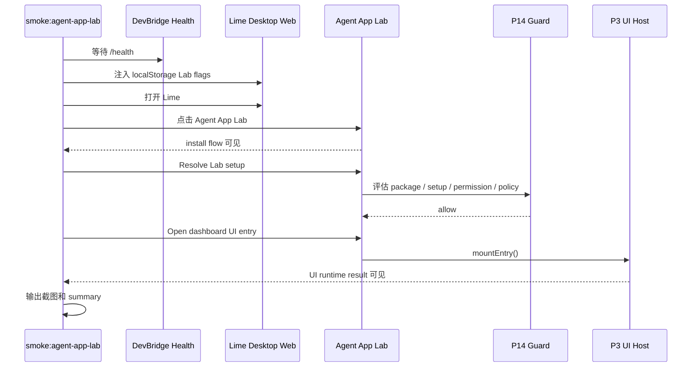

# Agent App P15-H GUI Smoke / Cleanup Rehearsal Hardening

更新时间：2026-05-15

## 一句话目标

P15-H 把 P15 的 Lab-only 安装启动闭环从“组件和单测可用”推进到“真实 GUI 可演示、失败可定位、清理可复演”。它仍然不把 Agent App 接入正式主导航，也不把 LimeCore / Cloud 变成 runtime。

## 为什么需要 P15-H

P15 已经串起 `source → install review → verify/cache → installed state → setup/readiness → permission prompt → launch → cleanup preview`，但这还不能证明用户真的能在 Lime Desktop 里完整走完流程。P15-H 专门补三类证据：

1. GUI 证据：能从桌面壳进入 Agent App Lab，打开安装流程，处理 setup，经过 guard 后挂载 App UI。
2. 边界证据：Lab 运行仍复用 P14 guard，不绕过 package verification、setup、permission 或 runtime policy。
3. 清理证据：cleanup preview 与 keep-data / delete-data 分支继续覆盖 package cache、installed state、setup state、storage、artifact、evidence。

## 当前落地

| 项 | 状态 | 证据 |
|---|---|---|
| Lab GUI smoke 脚本 | 已落地 | `scripts/agent-app/lab-smoke.mjs`。 |
| npm 入口 | 已落地 | `npm run smoke:agent-app-lab`。 |
| GUI smoke feature flags | 已落地 | `resolveAgentAppHostFlags()` 支持 `lime.agentAppHost.flags` localStorage JSON，仅服务本地 Lab / smoke。 |
| P15 flow 可见性 | 已验证 | smoke 检查 `[data-testid="agent-app-install-flow"]`。 |
| setup → guard → UI mount | 已验证 | smoke 点击 `agent-app-lab-resolve-setup` 与 `agent-app-open-ui-entry-dashboard`。 |
| 证据输出 | 已落地 | `.lime/qc/gui-evidence/agent-app-lab/agent-app-lab-smoke-summary.json` 与截图。 |

## GUI Smoke 场景



## 清理演练范围

P15-H 不直接删除用户数据；它验证 cleanup preview 和卸载分支是否仍能解释清楚：

| 清理对象 | keep-data | delete-data |
|---|---|---|
| package cache / staged package | 删除或保留已验证指针，取决于安装策略 | 删除 Agent App package cache 目标 |
| installed state / projection / readiness | 删除 App 安装态 | 删除 App 安装态 |
| setup state | 保留用户绑定数据 | 删除 App setup binding 状态 |
| app storage namespace | 保留 | 删除 App namespace |
| artifact / evidence / task refs | 保留 | 删除 `sourceKind: agent_app` 且匹配 appId 的实验产物 |
| 非 Agent App 数据 | 不触碰 | 不触碰 |

## 非目标

1. 不做 marketplace、App Catalog、Cloud 管理台或企业分发控制台。
2. 不把 Agent App entry 接入正式主导航、命令面板、Chat 主路径或 Artifact 主 schema。
3. 不执行 raw worker bundle、任意 package JS、native binary 或 npm install。
4. 不新增 Tauri command，不让 Agent App 直接 `safeInvoke` / `invoke`。
5. 不把 GUI smoke 的 localStorage flags 变成生产开关或远程控制协议。

## 验收标准

1. `npm run smoke:agent-app-lab -- --timeout-ms 180000` 能输出 summary 和截图。
2. summary 中 `labVisible / installFlowVisible / setupResolved / guardAllowed / uiMounted / launchedStatus / cleanupPreview / noConsoleErrors` 全为 `true`。
3. smoke 打开 Lab 后没有新增 console error 或 failed request。
4. 关闭 Lab flags 后 Agent App Lab 不成为正式主路径入口。
5. `src/features/agent-app` 仍无 `safeInvoke` / `invoke` / Tauri command / raw Worker 越界入口。
6. 全局 `npm run verify:gui-smoke` 的外部 provider/model 失败不能被伪装成 Agent App 通过；两类证据必须分开记录。

## 验证记录

| 命令 | 结果 |
|---|---|
| `npm run smoke:agent-app-lab -- --timeout-ms 180000` | 通过；summary 输出到 `.lime/qc/gui-evidence/agent-app-lab/agent-app-lab-smoke-summary.json`，截图输出到 `.lime/qc/gui-evidence/agent-app-lab/agent-app-lab-smoke.png`。 |
| `npm run typecheck` | 通过。 |
| `npm run verify:gui-smoke` | 最新 P16 验证已通过；P15-H 仍保留 Agent App Lab 专用 smoke 作为更贴边界证据。 |

## P15-H 后的计划更新

P15-H 通过后，下一刀不应该直接做 marketplace 或 Cloud 管理台，而是进入 P16：Agent App Manager / Product Entry Gate。P16 已完成实验岛内最小 Manager，P17 Gate 审计、P17.0 Formal Entry Contract、P17.1 Formal route / nav / copy hardening、P17.2.1-P17.2.4a 已完成，P17.2.4b-1 acquisition seam / verified cache source、P17.2.4b-2 packageUrl fetch / staging / manifest extraction 与 P17.2.5 public schema / reference CLI / standard example package cross-check 已完成，P17.3 lifecycle / cleanup contract 与 P17.4 runtime surface production hardening 已完成，当前进入 P17.5 formal entry GUI smoke。

P16 的目标是把“单个 Lab fixture 的安装启动流程”收敛成仍在实验岛内的 App 管理面，先验证多 App 生命周期，再评估是否进入正式产品入口：

```text
P16.0 正式入口前 gate 定义
→ P16.1 installed apps 列表与状态徽标
→ P16.2 enable / disable / launch / uninstall 生命周期动作
→ P16.3 统一复用 P14 guard 的 entry launcher
→ P16.4 cleanup rehearsal 与 evidence export
→ P16.5 flag-off / rollback / boundary regression
```

只有 P16-H 进一步证明多 App 管理、权限、清理和证据都能稳定工作，才评估正式 Agent Apps 入口；否则继续保持 Lab-only。
