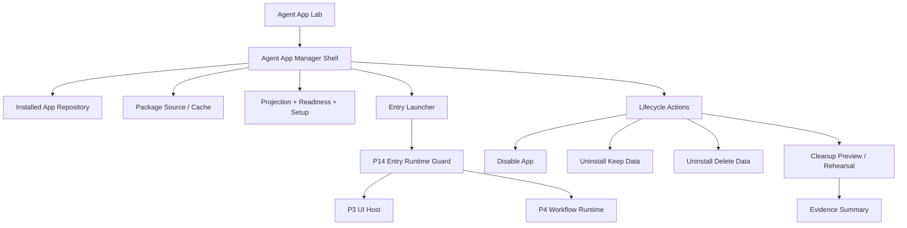
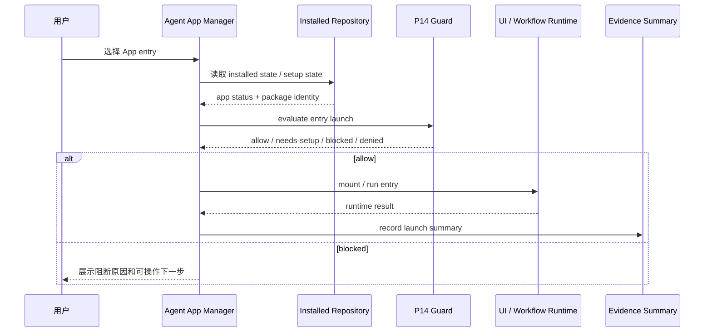
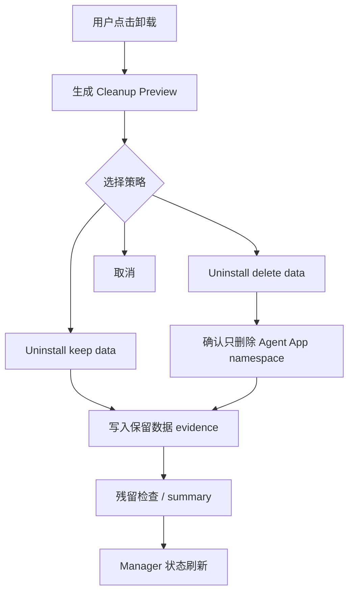

# Agent App P16 Agent App Manager / Product Entry Gate

更新时间：2026-05-15

## 一句话目标

P16 不是把 Agent App 直接发布到正式主导航，而是在实验岛内把单个 Lab flow 升级为可管理多个 App 的 Agent App Manager，用 installed state、entry guard、lifecycle action 和 cleanup evidence 证明 Agent App 有资格进入正式产品入口。

## 背景

P15 / P15-H 已经证明一个 App package 可以在 Lab 中完成安装审查、setup、授权、启动和 cleanup preview。但这仍然只是单个 fixture 的演示流程，不足以支撑正式产品入口。

正式入口前还缺四类能力：

1. 管理面：用户需要看到已安装 App、版本、source、readiness、enabled / disabled 状态。
2. 生命周期：用户需要可控地 launch、disable、uninstall keep-data、uninstall delete-data。
3. 统一入口：所有 entry 都必须复用 P14 guard，而不是每个按钮自己拼运行逻辑。
4. 证据闭环：每次 launch、disable、uninstall、cleanup rehearsal 都需要可追踪 evidence，方便失败后清理。

## 当前落地

| 项 | 状态 | 证据 |
|---|---|---|
| Manager shell | 已完成最小实现 | `src/features/agent-app/ui/AgentAppManagerPanel.tsx`。 |
| Installed app 状态 | 已完成最小实现 | 基于 P15 `installedState` 展示 appId、version、source、readiness、setup 和 permission 摘要。 |
| Entry launcher | 已完成最小实现 | Manager launch 继续调用 P14 guard；page / panel / settings 走 UI Host，其他 entry 走 CapabilityHost。 |
| Disable / enable | 已完成最小实现 | Lab 内状态禁用后 entry launcher 不可启动，不删除用户数据。 |
| P11 repository list | 已完成最小实现 | Manager 通过 `LocalInstalledAgentAppStateRepository` / browser localStorage driver 保存、恢复并展示 repository list / issue count。 |
| 持久化 disable / enable | 已完成最小实现 | disable / enable 通过 P11 repository `setDisabled()` 更新 installed state，不新增第二套 store。 |
| Uninstall preview | 已完成最小实现 | keep-data / delete-data 复用 P15 uninstall preview，并生成 evidence summary。 |
| GUI smoke | 已通过 | `smoke:agent-app-lab` 断言 `managerVisible`、`managerRepository` 和 `managerEvidence`。 |
| P16-H 计划 | 已完成计划收口 | 详见 [p16-h-multi-app-repository-lifecycle-hardening.md](./p16-h-multi-app-repository-lifecycle-hardening.md)。 |

## 非目标

1. 不做公开 marketplace、审核流、支付、企业分发控制台。
2. 不接 LimeCore Cloud 管理台，不把 Cloud 变成 runtime。
3. 不把 App entry 接进正式主导航、命令面板、Chat 主路径或 Artifact 主 schema。
4. 不执行 raw worker bundle、任意 package JS、native binary 或 npm install。
5. 不新增 Tauri command，不让 Agent App 直接 `safeInvoke` / `invoke`。

## 架构图



关键点：

- `Manager Shell` 仍在 Agent App 实验岛内，不是正式产品入口。
- `Entry Launcher` 只编排 entry，不拥有自己的 guard 规则。
- `Lifecycle Actions` 复用 P10-P15 的 installed state、package cache、setup state 和 cleanup plan。
- `Evidence Summary` 只记录 Agent App 相关对象，不包含 secret value、客户原文或非 App 数据。

## 状态模型

```text
discovered
→ installed
→ setup-required
→ launchable
→ running
→ disabled
→ uninstall-preview
→ uninstalled
```

阻断状态：

```text
package-invalid
hash-mismatch
cloud-disabled
permission-denied
runtime-blocked
cleanup-required
```

## 时序图：从 Manager 打开 App Entry



## 流程图：卸载与清理演练



## 用户故事

| 编号 | 用户故事 | 验收标准 |
|---|---|---|
| US-P16-01 | 作为用户，我可以看到已安装 App、版本、来源、hash 和 readiness。 | Manager 列表展示 installed state，不展示客户数据。 |
| US-P16-02 | 作为用户，我可以从同一个管理面打开 App entry。 | 所有 launch / mount 都先通过 P14 guard。 |
| US-P16-03 | 作为用户，我可以禁用 App 但保留数据。 | disabled 后 entry 不可启动，storage / artifacts 不删除。 |
| US-P16-04 | 作为用户，我可以卸载 App 并选择保留或删除数据。 | keep-data / delete-data preview 与 P15 cleanup 口径一致。 |
| US-P16-05 | 作为维护者，我可以复核每次 cleanup rehearsal 的证据。 | evidence summary 包含 appId、version、packageHash、targets 和执行结果。 |

## 分期计划

| 阶段 | 目标 | 不做什么 |
|---|---|---|
| P16.0 | 已完成：定义正式入口前 gate 和 Manager shell 数据契约。 | 未注册正式主导航。 |
| P16.1 | 已完成最小实现：已安装 App 列表、状态徽标、版本 / source / hash 展示。 | 未做 marketplace。 |
| P16.2 | 已完成：Entry launcher 统一复用 P14 guard。 | 未让 UI 直接调用 runtime。 |
| P16.3 | 已完成最小实现：Enable / disable / uninstall keep-data / delete-data 生命周期动作。 | 未删除非 Agent App 数据。 |
| P16.4 | 已完成最小实现：Cleanup rehearsal evidence summary。 | 未记录 secret value 或客户原文。 |
| P16.5 | 已完成：flag-off、boundary regression 与 Agent App Lab GUI smoke。 | 未扩大到 Cloud 管理台。 |

## 文件边界

| 文件 / 目录 | 计划 |
|---|---|
| `src/features/agent-app/ui/AgentAppLabPage.tsx` | 可以继续承载实验岛入口，但应把 Manager shell 拆成局部组件，避免单文件继续膨胀。 |
| `src/features/agent-app/ui/*` | 新增 Manager list / status / lifecycle panels，仍只在 Lab feature flag 下渲染。 |
| `src/features/agent-app/install/*` | 复用 installed state、package cache、setup state、cleanup plan，不新增第二套 repository。 |
| `src/features/agent-app/runtime/entryRuntimeGuard.ts` | 继续作为所有 entry launch 的唯一 guard。 |
| `scripts/agent-app-lab-smoke.mjs` | 扩展覆盖 Manager list、entry launcher、disable / uninstall preview。 |
| `internal/roadmap/agentapp/*` | 更新 P16 验证证据和进入正式入口的 gate 判定。 |

## 验收标准

1. Manager 能展示至少一个 installed app 的 identity、version、source、readiness、setup 和 enabled 状态。
2. 所有 entry launch / mount 都复用 P14 guard，不能直接调用 UI Host / CapabilityHost。
3. Disable 后 entry 不可启动，且不会删除用户数据。
4. Uninstall keep-data / delete-data preview 能解释将删除 / 保留的目标。
5. Cleanup rehearsal evidence 能关联 `appId / appVersion / packageHash / manifestHash`。
6. 关闭 Agent App Lab flags 后 Manager 不出现在正式主路径。
7. `src/features/agent-app` 仍无 `safeInvoke` / `invoke` / Tauri command / raw Worker 越界入口。

## 最小验证

```bash
npm run test -- \
  src/features/agent-app/install/labInstallFlow.test.ts \
  src/features/agent-app/runtime/entryRuntimeGuard.test.ts \
  src/features/agent-app/ui/AgentAppLabPage.test.tsx

npm run smoke:agent-app-lab -- --timeout-ms 180000
npm run typecheck
npm run test:contracts

git diff --check -- internal/roadmap/agentapp src/features/agent-app scripts/agent-app-lab-smoke.mjs package.json

rg -n "safeInvoke|invoke\(|tauri::|generate_handler|mockPriorityCommands|defaultMocks|new Worker|Worker\(" src/features/agent-app || true
```

## 验证记录

| 命令 | 结果 |
|---|---|
| `npm run test -- src/features/agent-app/ui/AgentAppLabPage.test.tsx src/features/agent-app/install/labInstallFlow.test.ts src/features/agent-app/runtime/entryRuntimeGuard.test.ts src/features/agent-app/featureFlag.test.ts` | 通过，4 files / 25 tests。 |
| `npm run test -- src/i18n/__tests__/translation-coverage.test.ts src/i18n/__tests__/loadNamespace.test.ts src/i18n/__tests__/types.test.ts` | 通过，3 files / 17 tests。 |
| `npm run typecheck` | 通过。 |
| `npm run smoke:agent-app-lab -- --timeout-ms 180000` | 通过；summary 增加 `managerVisible`、`managerRepository` 与 `managerEvidence`。 |
| `npm run verify:gui-smoke` | 通过；覆盖 workspace-ready、browser-runtime、site-adapters、Agent runtime tool surface、Claw Chat ready streaming、Knowledge GUI 与 Design Canvas。 |
| `npm run test:contracts` | 通过。 |
| `git diff --check -- internal/roadmap/agentapp src/features/agent-app scripts/agent-app-lab-smoke.mjs package.json src/i18n/resources src/components/agent/chat/workspace/useSceneAppExecutionSummaryRuntime.test.tsx` | 通过。 |
| `rg` boundary / legacy audit | 通过，`src/features/agent-app` 无 `safeInvoke` / Tauri / raw Worker 越界，未复活旧内容工程化 key。 |

## 剩余差距

| 差距 | 处理 |
|---|---|
| Manager 当前只管理 Lab fixture 形成的单个 installed app。 | P16-H 再接多 package source / 多 App lifecycle，不用 fake marketplace。 |
| Repository list 已接 P11 local adapter，但还没有多 App source。 | P16-H 后续补多 App fixture / local package source 列表，不新增第二套 store。 |
| Uninstall 仍是 preview / rehearsal，没有执行真实 delete-data。 | P16-H 先做 rehearsal evidence 与残留检查，再评估真实删除。 |
| Manager 尚未进入正式主路径。 | 当前正确状态；正式入口仍需 P16-H 后再次评估。 |

## 进入正式入口前 Gate

P16 最小实现完成后仍不自动进入正式产品入口。只有同时满足以下条件，才评估 P17 / 正式 Agent Apps 入口：

1. Agent App Manager 的生命周期动作和 cleanup rehearsal 都有 GUI smoke 证据。
2. App entry launcher 与 P14 guard 的耦合可通过测试证明，不存在旁路启动。
3. App 数据导出、保留、删除策略已覆盖异常和 rollback。
4. flag-off 后 UI、storage、runtime 和 evidence 不影响普通 Chat / Skill / Artifact / Workspace 主流程。
5. Cloud / LimeCore 仍只提供 catalog / release / tenant metadata，不运行默认 Agent、不渲染 UI、不接管本地 storage。

## 下一刀

P16 已完成实验岛内最小 Agent App Manager，并已把 list / disable / enable 接到 P11 local persistence adapter。P16-H.1 repository-backed multi-app list、P16-H.2 selected app launcher + persisted lifecycle、P16-H.3 cleanup rehearsal evidence export、P16-H.4 residual audit、P16-H.5 Agent App Lab GUI smoke + flag-off regression、P17 Gate 审计、P17.0 Formal Entry Contract、P17.1 Formal route / nav / copy hardening、P17.2.1 Source state model、P17.2.2 Install review descriptor、P17.2.3 Registration hardening 与 P17.2.4a Cloud release descriptor / verification gate 已完成；P17.2.4b-1 acquisition seam / verified cache source、P17.2.4b-2 packageUrl fetch / staging / manifest extraction 与 P17.2.5 public schema / reference CLI / standard example package cross-check 已完成，P17.3 lifecycle / cleanup contract 与 P17.4 runtime surface production hardening 已完成，当前进入 P17.5 formal entry GUI smoke。仍不做 marketplace、Cloud 管理台、真实 delete-data 或完整内容工厂业务系统。
