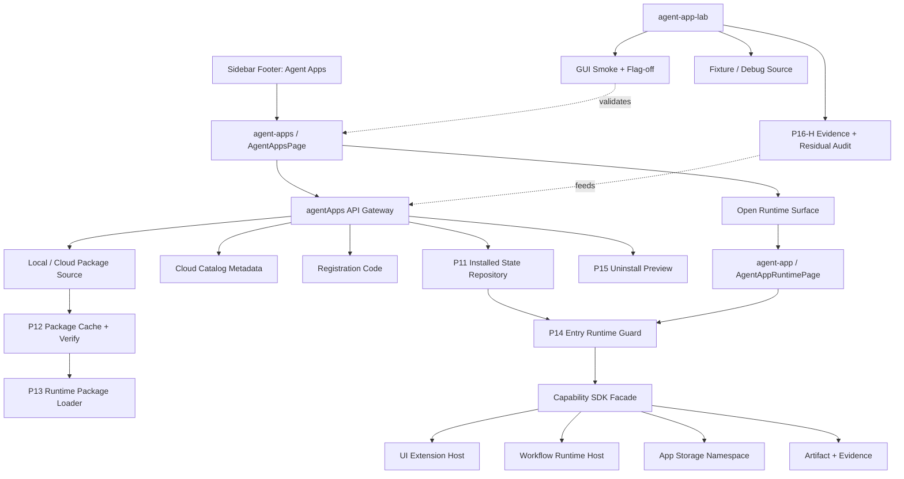
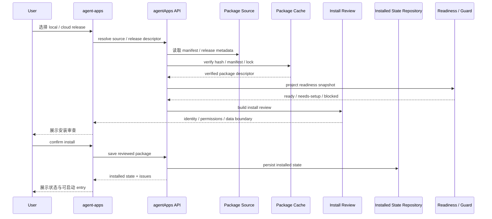
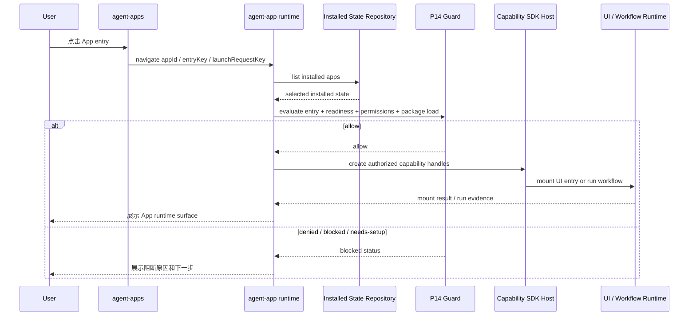
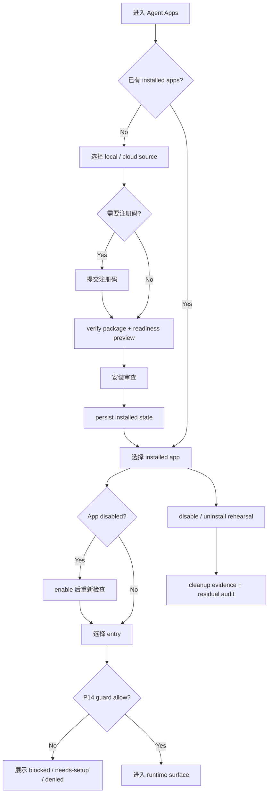

# Agent App P17.0 正式入口契约

更新时间：2026-05-15

## 一句话结论

P17.0 不发布 marketplace，也不扩展 Cloud 管理台；它只把 Lime Desktop 现有 `agent-apps` 受控入口定成 current 主链：用户在这里安装、注册、启动、禁用、卸载演练和进入 runtime；`agent-app-lab` 继续作为研发验证入口，负责 fixture、smoke、flag-off 和实验断言。

## 背景

P16-H 已完成多 App repository、selected launcher、持久化 lifecycle、cleanup evidence、residual audit、Agent App Lab GUI smoke、flag-off 回归和 P17 Gate 审计。结合 `/Users/coso/Documents/dev/ai/limecloud/agentapp` v0.3 标准，客户端下一步不能继续停留在 Lab，也不能跳到公开市场，而是要先固定正式入口契约。

这次计划更新的关键判断：

1. Agent App 是完整可安装应用，不是专家卡片、prompt 包或 Markdown 目录。
2. Lime Desktop 是运行宿主，负责安装、cache、projection、readiness、SDK 注入、UI / workflow runtime、storage namespace 和 cleanup。
3. Lime Cloud / LimeCore 只负责 catalog、release、license、tenant enablement、gateway 和 ToolHub metadata，不运行默认 Agent、不渲染 App UI、不接管本地 storage。
4. `agent-apps` 可以成为正式受控入口，但必须继续复用 P11 repository、P14 guard、P15 cleanup preview、P16-H evidence / audit。
5. `agent-app-lab` 不能继续承担用户入口职责；它只保留研发、验证、fixture 和失败退出证明。

## 目标

| 目标 | 说明 |
|---|---|
| 固定正式入口 | `agent-apps` 成为用户可见 App 管理和启动入口，不再依赖 Lab 心智解释核心流程。 |
| 固定研发入口 | `agent-app-lab` 继续用于 fixture、smoke、cleanup rehearsal、flag-off 和实验断言。 |
| 复用 current 主链 | P17 不新增第二套 installer、store、scanner、guard、runtime loader 或 cleanup 机制。 |
| 明确能力边界 | App 只能通过 Capability SDK 使用 Lime 能力，不能 import Lime 内部模块或直接调用 Tauri command。 |
| 保持失败可清理 | disable、uninstall rehearsal、cleanup evidence、residual audit 和 flag-off 仍是正式入口前硬门槛。 |
| 分离后续 gate | 真实 delete-data、public catalog、企业控制台和完整内容工厂业务系统分别另立计划。 |

## 非目标

1. 不做公开 marketplace、审核流、支付、排名、推荐或分发运营。
2. 不做 Cloud 管理台、企业租户控制台或远程 Agent Runtime。
3. 不做真实 delete-data 执行器；P17 仍只做 rehearsal / evidence / audit。
4. 不把 内容工厂扩成完整行业 SaaS。
5. 不恢复 `SceneApp`、`contentEngineering*`、`sceneapp_*` 或 `shenlan-content-engineering` 旧路线。
6. 不新增 raw Worker 执行或任意 App package JS 执行。
7. 不允许 Agent App 绕过 Capability SDK 直接使用 Lime internal store、`safeInvoke` 或 `invoke`。

## 入口契约

| 入口 | 面向对象 | 可以做 | 不可以做 | 事实源 |
|---|---|---|---|---|
| `agent-apps` | 普通用户 / 团队管理员 | 安装 local / cloud release、提交注册码、查看 installed apps、启动 entry、disable / enable、uninstall rehearsal、查看 runtime surface。 | 公开市场、审核流、真实删除、Lab fixture 调试、smoke 控制、Cloud 管理台。 | `AgentAppsPage`、`AgentAppRuntimePage`、`src/lib/api/agentApps.ts`、P11-P16-H current 链。 |
| `agent-app-lab` | 开发者 / QA / 路线图验证 | fixture 验证、package review、guard 断言、cleanup rehearsal、residual audit、GUI smoke、flag-off regression。 | 作为正式用户入口、承载 marketplace、替代正式 runtime page、写入 Cloud metadata。 | `AgentAppLabPage`、`AgentAppManagerPanel`、`scripts/agent-app/lab-smoke.mjs`。 |
| `agent-app` runtime | 从正式入口或深链进入的 App 运行面 | 展示 App entries、触发 P14 guard、mount UI entry、run workflow / entry、展示 readiness / artifact / knowledge 摘要。 | 绕过 P14 guard、加载 disabled App、直接执行未验证 package、直接访问宿主内部 store。 | `AgentAppRuntimePage`、P13 loader、P14 guard、Capability SDK host。 |

## 架构图



## 安装时序



## 启动时序



## 主流程



## 用户故事

| ID | 用户故事 | 验收口径 |
|---|---|---|
| P17-US1 | 作为用户，我可以从侧栏 footer 的 Agent Apps 进入受控 App 管理页。 | `agent-apps` 不依赖 Lab flag；Lab 关闭时仍可见。 |
| P17-US2 | 作为用户，我可以安装一个本地或 Cloud metadata 指向的 App release。 | 安装走 package source、cache verify、installed state repository，不写第二套状态。 |
| P17-US3 | 作为企业用户，我可以为需要授权的 App 输入注册码后再安装。 | registration 只改变 source enablement，不把凭证写入 App package。 |
| P17-US4 | 作为用户，我可以启动某个 App entry，并进入 App 自己的 runtime surface。 | 启动必须经过 P14 guard；disabled / blocked / needs-setup 不能绕过。 |
| P17-US5 | 作为用户，我可以 disable / enable App。 | 状态持久化到 repository，刷新后不丢，disabled App 不可启动。 |
| P17-US6 | 作为用户，我可以预览卸载和删除数据影响。 | P17 只输出 rehearsal evidence / residual audit，不执行真实 delete-data。 |
| P17-US7 | 作为开发者，我仍能在 Lab 里跑 fixture 和 smoke。 | `agent-app-lab` 保留但不承担正式入口职责。 |
| P17-US8 | 作为维护者，我能证明 App 没有绕过 SDK。 | `src/features/agent-app` 无直接 `safeInvoke` / `invoke` / raw Worker / Tauri command 扩散。 |

## 分阶段计划

| 阶段 | 交付 | 范围 | 验收 |
|---|---|---|---|
| P17.0 | Formal Entry Contract。 | 本文档、README、implementation plan 和 P17 Gate 审计口径同步。 | 文档固定 `agent-apps` / `agent-app-lab` / runtime 三层职责，明确禁区和后续 gates。 |
| P17.1 | 已完成最小实现：Formal route / nav / copy hardening。 | 固定 `agent-apps` 为用户入口，`agent-app-lab` 为实验入口；补足五语言正式入口文案；UI entry 从正式入口进入独立 runtime surface。 | `AgentAppsPage`、`AppPageContent`、`sidebarNav` 定向测试通过；Lab flag-off 不影响 `agent-apps`；不再展示本机硬编码 local path。 |
| P17.2 | 已完成最小实现：Source / install contract hardening。 | P17.2.1 / P17.2.2 / P17.2.3 已完成 source state model、install review descriptor 与 registration hardening；P17.2.4a 已完成 Cloud release descriptor、package / manifest verification gate、cached fallback exact-hash 判断；P17.2.4b-1 已完成 acquisition seam / verified cache source；P17.2.4b-2 已完成 packageUrl fetch / staging / manifest extraction；P17.2.5 已对齐上游 schema / reference CLI / 示例包。 | install / registration 仍复用 `src/lib/api/agentApps.ts`、P12 cache、P11 repository，不新增 store；Cloud card / Lab fixture 不能作为正式 review 来源；详见 [p17-source-install-contract-hardening.md](./p17-source-install-contract-hardening.md)。 |
| P17.3 | 已完成最小实现：Lifecycle / cleanup contract hardening。 | 详见 [p17-lifecycle-cleanup-contract-hardening.md](./p17-lifecycle-cleanup-contract-hardening.md)：formal 页面展示 disable / enable、uninstall rehearsal、cleanup evidence 和 residual audit。 | disabled / cleanup-blocked 不能启动；uninstall rehearsal 不真实删除；audit 只查 Agent App namespace。 |
| P17.4 | 已完成：Runtime surface contract hardening。 | P17.4.1-P17.4.5 已完成 guard-before-start、Host Bridge task contract、structured write-back guard、content factory bootstrap sample 与完整 GUI smoke。 | 所有 launch 都经 P14 guard；生产路径只加载 verified runtime package，dev resolver 不作为正式 fallback；runtime 不加载 disabled / unverified package；App UI 只能通过 `lime.agentApp.bridge` 和 injected SDK handles 使用 Lime 能力。 |
| P17.5 | Formal entry GUI smoke。 | 增加或扩展 `agent-apps` 专用 smoke，和 Lab smoke 分离。 | summary 覆盖 install、registration、launch、disable、uninstall rehearsal、runtime surface、flag-off。 |

## 后续 Gate

| Gate | 进入条件 | 不满足时 |
|---|---|---|
| P18 Real Delete Data Gate | cleanup plan targets 可枚举、dry-run 可复核、namespace 删除可回滚、用户二次确认。 | 继续 rehearsal，不执行真实删除。 |
| P19 Public Catalog Gate | release channel、审核状态、签名、版本兼容、风险标签和安装说明完整。 | Cloud 继续只提供 seeded metadata / enterprise allowlist。 |
| P20 Enterprise Console Gate | tenant enablement、license、audit metadata、policy overlay 和管理员操作记录明确。 | 不做 Cloud 管理台，只保留客户端 registration / metadata 输入。 |
| P21 Content Factory Business Expansion Gate | 平台入口稳定、SDK 能表达完整业务、storage / artifact / eval 版本化。 | 内容工厂继续作为示例，不扩成行业 SaaS。 |

## 文件边界

| 分类 | 路径 / 对象 | 状态 |
|---|---|---|
| current | `src/features/agent-app/**` | Agent App 客户端 current 功能岛。 |
| current | `src/features/agent-app/ui/AgentAppsPage.tsx` | 正式受控入口候选，P17 hardening 只在此基础上推进。 |
| current | `src/features/agent-app/ui/AgentAppRuntimePage.tsx` | App runtime surface，必须复用 P14 guard 和 Capability SDK。 |
| current | `src/lib/api/agentApps.ts` | Agent Apps API gateway / bridge 事实源；如新增命令必须同步 contracts。 |
| current | `internal/roadmap/agentapp/p17-formal-entry-gate-audit.md` | P17 Gate 审计证据。 |
| current | `internal/roadmap/agentapp/p17-formal-entry-contract.md` | P17.0 正式入口契约。 |
| current | `internal/roadmap/agentapp/p17-source-install-contract-hardening.md` | P17.2 source / install contract hardening 当前计划。 |
| current | `internal/roadmap/agentapp/p17-lifecycle-cleanup-contract-hardening.md` | P17.3 lifecycle / cleanup contract hardening 已完成计划。 |
| current | `internal/roadmap/agentapp/p17-4-host-bridge-runtime.md` | P17.4-H Host Bridge Runtime 当前计划。 |
| reference | `/Users/coso/Documents/dev/ai/limecloud/agentapp` | Agent App v0.3 标准事实源。 |
| reference | `/Users/coso/Documents/dev/ai/limecloud/limecore/internal/roadmap/agentapp` | 服务端 / Cloud 控制面路线图。 |
| deprecated | `agent-app-lab` 用户入口心智 | Lab 仍 current 于研发验证，但不再作为用户正式入口。 |
| dead | `SceneApp` / `contentEngineering*` / `sceneapp_*` | 不恢复、不迁移、不兼容。 |

## 验收标准

1. P17 文档必须清楚说明 `agent-apps`、`agent-app-lab`、runtime surface 的职责边界。
2. 正式入口实现不得新增第二套 repository、installer、cache、guard、runtime loader 或 cleanup scanner。
3. `agent-apps` 可在 Lab flag-off 后保持可见，`agent-app-lab` 在 flag-off 后不可见。
4. 所有用户可见文案覆盖 `zh-CN / zh-TW / en-US / ja-JP / ko-KR`。
5. `src/features/agent-app` 不直接出现 `safeInvoke`、`invoke(`、`tauri::`、`generate_handler`、`new Worker`。
6. 如修改 Tauri command / bridge，必须同步 frontend gateway、Rust registration、command catalog、mock priority / default mocks，并执行 `npm run test:contracts`。
7. GUI 证据必须区分 Agent Apps formal smoke 与 Agent App Lab smoke；不能用 Lab 证据冒充正式入口可交付。

## 最小验证

P17.1 已执行：

```bash
npm run test -- src/features/agent-app/ui/AgentAppsPage.test.tsx src/components/AppPageContent.test.tsx src/lib/navigation/sidebarNav.test.ts
npm run test -- src/i18n/__tests__/translation-coverage.test.ts src/i18n/__tests__/loadNamespace.test.ts src/i18n/__tests__/types.test.ts
rg -n "safeInvoke|invoke\\(|tauri::|generate_handler|mockPriorityCommands|defaultMocks|new Worker|Worker\\(" src/features/agent-app || true
git diff --check -- src/features/agent-app src/components/AppPageContent.tsx src/components/AppPageContent.test.tsx src/i18n/resources internal/roadmap/agentapp
```

P17.2 及之后每一刀至少执行：

```bash
npm run test -- src/features/agent-app/ui/AgentAppsPage.test.tsx src/features/agent-app/ui/AgentAppRuntimePage.test.tsx src/lib/navigation/sidebarNav.test.ts
npm run test -- src/i18n/__tests__/translation-coverage.test.ts src/i18n/__tests__/loadNamespace.test.ts src/i18n/__tests__/types.test.ts
git diff --check -- internal/roadmap/agentapp src/features/agent-app src/lib/api/agentApps.ts src/i18n/resources
```

若改动 command / bridge：

```bash
npm run test:contracts
```

若改动正式入口 GUI 主流程：

```bash
npm run smoke:agent-app-lab -- --timeout-ms 180000
```

后续如果新增 `smoke:agent-apps`，P17.5 起用正式入口 smoke 替代 Lab smoke 作为主证据，Lab smoke 只保留研发回归证据。

## 当前下一刀

P17.1 已完成正式入口 route / nav / copy 最小硬化；P17.2.1-P17.2.5 已完成 source / install / schema cross-check；P17.3 已完成 lifecycle / cleanup contract hardening；P17.4.1-P17.4.5 已完成 runtime guard-before-start、App 内 Agent task、structured write-back guard、content factory bootstrap sample 与完整 GUI smoke。当前下一刀进入 P17.5 formal entry GUI smoke。

P17.2 只处理正式入口的 package source、install review、registration、source state 和剩余 Lab-only 语义，不做 public catalog、真实 delete-data、Cloud 管理台或完整内容工厂业务扩展。
