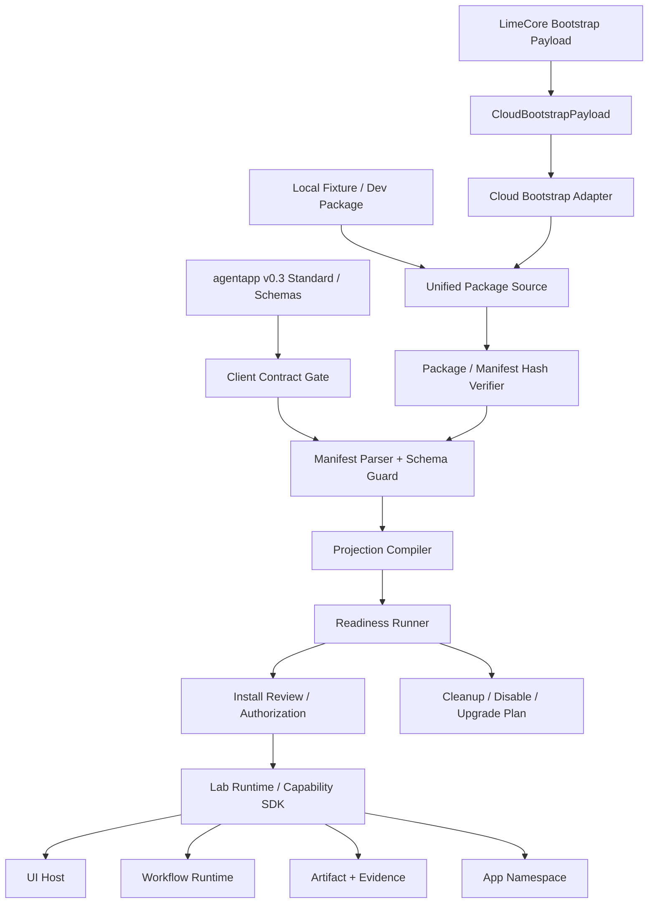
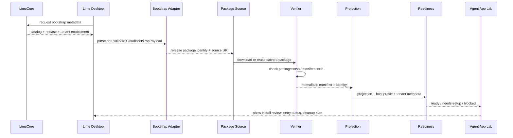
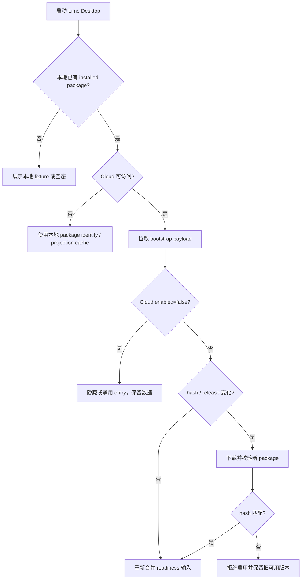

# Agent App P5 Cloud Bootstrap 客户端接入计划

更新时间：2026-05-15

## 一句话目标

P5 的目标不是把 Lime Desktop 变成 Cloud 的执行器，而是让客户端在保持本地运行、可离线、可清理的前提下，消费 LimeCore 下发的 catalog / release / tenant enablement 元数据，并把它收敛到现有 `package source -> verify -> manifest -> projection -> readiness -> runtime` 链路。

## 背景

`/Users/coso/Documents/dev/ai/limecloud/agentapp` 已升级到 Agent App v0.3 的完整标准层。相对早期草案，新增的约束不只是字段更多，而是把宿主实现从“能展示一个 APP.md”推进到“能安全安装、投影、授权、运行、升级和清理一个可执行应用包”。

对 Lime Desktop 的直接影响：

| 标准变化 | 客户端计划影响 |
|---|---|
| 强 JSON schemas：manifest / projection / readiness | P5 必须把 schema 契约作为机械校验来源，不能只靠手写类型和 UI 展示。 |
| Release metadata：package URL、package hash、manifest hash、signature、channel / pin | Cloud payload 必须先映射为不可变 package identity，再进入安装链路。 |
| Projection provenance：packageHash + manifestHash | 所有 entry、artifact、evidence、cleanup plan 必须带 release provenance。 |
| Readiness 扩展到 Skills / Knowledge / Tools / Artifacts / Evals / Secrets / Overlays | P5 不能只检查 capability range，要输出可行动 setup findings。 |
| Overlay templates 和 policy defaults | Cloud 可以给默认策略，但 Desktop 仍负责本地 resolver、policy guard 和 readiness invalidation。 |
| Lifecycle：install / activate / upgrade / disable / uninstall / export | Cloud disable 只能禁用 entry，不删除本地 App data；delete-data 仍由客户端卸载流程控制。 |
| Typed SDK expectations：error code、cancel、retry、idempotency、trace、mock | P5 接 Cloud 前要保证 runtime call 继续穿过 Capability SDK，而不是直接调 Lime internal。 |
| `scene` / `home` 仅兼容历史 | P5 projection 必须继续拒绝 v0.3 下的旧 entry kind，不复活旧 SceneApp。 |

## 客户端 / Cloud 分工

| 层 | 负责 | 不负责 |
|---|---|---|
| LimeCore / Cloud | Catalog、Release、package metadata、tenant enablement、license、ToolHub availability、policy defaults、audit metadata。 | 不运行 Agent、不渲染 UI、不执行 worker、不管理本地 storage。 |
| Lime Desktop | 下载、校验、缓存、manifest 解析、projection、readiness、authorization、SDK 注入、UI / workflow / worker runtime、storage namespace、artifact / evidence、cleanup。 | 不实现 Cloud catalog 管理台、不保存租户发布状态事实源、不把 App 写进 Lime Core。 |
| Agent App package | UI bundle、workflow、worker、storage schema、业务代码、entries、permissions、overlay templates。 | 不 import Lime internal、不携带客户数据、不携带明文 secret。 |

## 架构图



关键不变量：

1. `CloudBootstrapPayload` 只是 `Source` 的一种输入，不是第二套安装系统。
2. `Projection` 和 `Readiness` 必须可由同一个 package identity 重建。
3. `Runtime` 只能拿到 scoped Capability SDK handle，不能拿 Cloud payload 原文里的业务状态。
4. `Cleanup` 是 P5 的一等输出；disable、uninstall keep data、delete data、export then delete 必须分开。

## 时序图



断网分支：



## P5 分期

当前状态：P5.0-P5.5 已完成并通过定向验证。P5 证明 Cloud bootstrap 只能作为 source / metadata 输入，不接管本地运行时；后续 P6-P13 已继续完成 schema coverage、schema gate、setup resolver、setup state store、installed state snapshot、local persistence adapter、package cache / verify / rollback 与 runtime package loader，[P14 Entry Runtime Guard / Permission Prompt](./p14-entry-runtime-guard-permission-prompt.md) 与 [P15 Lab Install / Launch Flow](./p15-lab-install-launch-flow.md) 已完成当前实现与定向验证，P15-H 已补 Agent App Lab 专用 GUI smoke / cleanup rehearsal 证据，P16 已完成最小 Agent App Manager；P17 Gate 审计、P17.0 Formal Entry Contract、P17.1 Formal route / nav / copy hardening、P17.2.1 Source state model、P17.2.2 Install review descriptor、P17.2.3 Registration hardening 与 P17.2.4a Cloud release descriptor / verification gate、P17.2.4b-1 acquisition seam / verified cache source、P17.2.4b-2 packageUrl fetch / staging / manifest extraction 与 P17.2.5 public schema / reference CLI / standard example package cross-check 已完成，P17.3 lifecycle / cleanup contract 与 P17.4 runtime surface production hardening 已完成，当前进入 P17.5 formal entry GUI smoke。

### P5.0：标准差距收口

目标：把上游 v0.3 标准升级转成客户端可执行清单，避免 P5 只做 Cloud DTO 却漏掉 schema / readiness / lifecycle。

交付：

- 固定上游事实源：`agentapp/docs/zh/specification.md`、`docs/zh/client-implementation/*`、`docs/zh/reference/json-schemas.md`、`docs/examples/content-factory-app/APP.md`。
- 建立客户端 gap matrix：manifest、projection、readiness、package identity、overlay、lifecycle、SDK error semantics。
- 明确 P5 不修改正式主导航、不新增 Tauri command、不接市场页。

验收：

```bash
rg -n "scene_exhaustion|content_engineering|shenlan-content-engineering|scene\b|home\b" internal/roadmap/agentapp
```

允许结果：只能出现在 legacy / deprecated / 兼容历史说明中，current 计划不能依赖这些对象。

### P5.1：Cloud Bootstrap Payload DTO / Parser / Validator

目标：先定义客户端能安全接受什么，不下载、不安装、不运行。

交付：

- `CloudBootstrapPayload`、`CloudBootstrapApp`、`CloudBootstrapToolAvailability`、validation issue / result 类型。
- `parseCloudBootstrapPayload()` 和 `validateCloudBootstrapPayload()`。
- 禁止敏感数据进入 payload：secret、token、customer data、workspace data、knowledge content、private content。
- `packageUrl` 只允许受信任来源；首轮至少拒绝非 `https:`。
- `packageHash` / `manifestHash` 必须是具体 `sha256:` 值，不能接受占位符。
- 默认拒绝 `server-assisted` 作为隐式执行模式；需要时必须在 manifest、tenant policy 和 runtime policy 三处显式声明。

验收：

```bash
npm run test -- \
  src/features/agent-app/install/cloudBootstrap.test.ts \
  src/features/agent-app/featureFlag.test.ts
```

### P5.2：统一 Package Source Adapter

目标：让 Cloud、local fixture、dev package 共用同一安装链路。

交付：

- `cloud_release` package identity source kind。
- `BootstrapPackageSourceAdapter` 把 payload 映射为现有 package source 输入。
- 只复用现有 manifest parser、projection、readiness、cleanup plan；不新增第二套 Cloud install flow。
- 支持 cached package：hash 未变化时不重复下载，断网时可使用已安装版本。

验收：

```bash
npm run test -- \
  src/features/agent-app/install/cloudBootstrap.test.ts \
  src/features/agent-app/install/packageIdentity.test.ts \
  src/features/agent-app/install/installedAppPreview.test.ts
```

## P5.1 落地证据

P5.1 当前只覆盖 bootstrap 输入层，未进入 package 下载、安装、projection 或 runtime。

| 项 | 证据 |
|---|---|
| DTO | `CloudBootstrapPayload`、`CloudBootstrapApp`、`CloudBootstrapToolAvailability`、`CloudBootstrapLicenseState` 已落到 `src/features/agent-app/types.ts`。 |
| parser / validator | `src/features/agent-app/install/cloudBootstrap.ts` 提供 `validateCloudBootstrapPayload()`、`parseCloudBootstrapPayload()` 和 `AgentAppCloudBootstrapError`。 |
| release identity | `buildCloudReleasePackageIdentity()` 输出 `cloud_release` package identity，并保留 `releaseId`、`tenantId`、`tenantEnablementRef`、`channel`、`signatureRef`。 |
| 安全拒绝 | validator 拒绝非 `https:` package URL、占位 / 非 `sha256:` hash、敏感字段、默认 `allowServerAssisted=true`、非法 license state。 |
| feature flag | `cloudBootstrapEnabled` 默认关闭；开启时只打开 Lab / projection / readiness / cleanup dry-run，不自动启用 mock / adapter / UI / workflow runtime。 |
| 定向测试 | `npm run test -- src/features/agent-app/install/cloudBootstrap.test.ts src/features/agent-app/featureFlag.test.ts` 通过，10 tests。 |
| 回归测试 | `npm run test -- src/features/agent-app/install/cloudBootstrap.test.ts src/features/agent-app/featureFlag.test.ts src/features/agent-app/manifest/parseManifest.test.ts src/features/agent-app/projection/projectApp.test.ts src/features/agent-app/readiness/checkReadiness.test.ts` 通过，17 tests。 |
| 类型与命令边界 | `npm run typecheck`、`npm run test:contracts`、`git diff --check -- internal/roadmap/agentapp src/features/agent-app src/vite-env.d.ts` 均通过。 |
| 越界审计 | `src/features/agent-app` 中未出现 `safeInvoke` / `invoke` / Tauri 注册 / mock priority / raw Worker 入口。 |
| legacy 审计 | `src/features/agent-app` 与五语言 `agent.json` 中未出现 `contentEngineering`、`scene_exhaustion`、`content_engineering_*`、`shenlan-content-engineering` 等旧 current 关键字。 |

## P5.2 落地证据

P5.2 当前只把 Cloud release metadata 适配到现有 preview / projection / readiness / cleanup 链路，仍未实现下载器、安装器或正式入口。

| 项 | 证据 |
|---|---|
| 统一 source | `buildCloudBootstrapPackageSource()` 输出 `cloud_release` source，携带 identity、enabled、defaultEntries、policyDefaults、toolAvailability。 |
| 复用 preview 链路 | `buildCloudBootstrapInstalledAppPreview()` 接收已取得的 package manifest，并复用 `buildInstalledAppPreview()` 的 manifest normalize、projection、readiness、cleanup plan。 |
| identity guard | `buildInstalledAppPreview()` 支持外部 `PackageIdentity`，并拒绝 identity appId / version 与 manifest 不一致的 package。 |
| provenance | Cloud release 的 `packageHash` / `manifestHash` 进入 projection provenance 和 cleanup package cache path。 |
| 定向测试 | `npm run test -- src/features/agent-app/install/cloudBootstrap.test.ts src/features/agent-app/featureFlag.test.ts` 通过，12 tests。 |
| 回归测试 | `npm run test -- src/features/agent-app/install/cloudBootstrap.test.ts src/features/agent-app/featureFlag.test.ts src/features/agent-app/manifest/parseManifest.test.ts src/features/agent-app/projection/projectApp.test.ts src/features/agent-app/readiness/checkReadiness.test.ts` 通过，19 tests。 |
| 类型与命令边界 | `npm run typecheck`、`npm run test:contracts` 通过；未新增 Tauri command。 |

### P5.3：Tenant Enablement + Local Readiness 合并

目标：Cloud 可以影响“可见 / 默认启用 / tool availability / policy defaults”，但不能绕过本地 readiness。

交付：

- 合并输入：host capability profile、manifest requirements、tenant enablement、tool availability、policy defaults、license state、local storage state。
- readiness 输出补齐 v0.3 类别：compatibility、capability、package、storage、permissions、knowledge、skills、tools、artifacts、evals、secrets、overlay。
- 支持 global readiness 和 entry-specific readiness。
- 每个 blocker / warning 输出 remediation，不泄露 secret 或客户数据。

验收：

```bash
npm run test -- \
  src/features/agent-app/readiness/checkReadiness.test.ts \
  src/features/agent-app/projection/projectApp.test.ts \
  src/features/agent-app/manifest/parseManifest.test.ts
```

## P5.3 落地证据

P5.3 当前只把 Cloud metadata 合并为本地 readiness 输入；Cloud 仍不能直接把 App 标记为 ready。

| 项 | 证据 |
|---|---|
| readiness 输入 | `checkReadiness()` 支持 `cloud?: CloudBootstrapApp` 输入，并把 Cloud metadata 与本地 capability/profile 结果合并。 |
| tenant enablement | `enabled=false` 生成 `CLOUD_APP_DISABLED` blocker，并同步到 entry-specific readiness。 |
| license state | `expired` / `revoked` 生成 blocker；`trial` / `unknown` 生成 warning。 |
| ToolHub availability | required tool 的 `missing` / `not-enabled` 生成 blocker；optional tool 生成 warning。 |
| policy defaults | `allowServerAssisted=true` 生成 `CLOUD_POLICY_UNSUPPORTED` blocker，不能绕过本地 runtime policy。 |
| entry-specific readiness | `defaultEntries` 未覆盖的 entry 生成 `CLOUD_ENTRY_NOT_ENABLED` warning。 |
| preview 贯通 | `buildCloudBootstrapInstalledAppPreview()` 自动把 Cloud app metadata 传入 readiness runner。 |
| 定向测试 | `npm run test -- src/features/agent-app/install/cloudBootstrap.test.ts src/features/agent-app/featureFlag.test.ts` 通过，13 tests。 |
| 回归测试 | `npm run test -- src/features/agent-app/install/cloudBootstrap.test.ts src/features/agent-app/featureFlag.test.ts src/features/agent-app/manifest/parseManifest.test.ts src/features/agent-app/projection/projectApp.test.ts src/features/agent-app/readiness/checkReadiness.test.ts` 通过，20 tests。 |
| 类型与命令边界 | `npm run typecheck`、`npm run test:contracts` 通过；未新增 Tauri command。 |

### P5.4：Disable / Upgrade / Offline Regression

目标：验证 Cloud 控制面变化不会破坏本地数据和已安装 App。

交付：

- `enabled=false`：disable only，隐藏或阻断 entry，保留 package、storage、artifact、evidence。
- hash mismatch：拒绝启用新 release，保留旧 installed package 可审查状态。
- offline：已安装 App 继续可读、可展示 projection、可按本地 policy 运行已授权 entry。
- upgrade：新 release 先生成 migration / cleanup preview，不覆盖 overlay、secret、storage、artifact、evidence。

验收：

```bash
npm run test -- \
  src/features/agent-app/install/uninstallApp.test.ts \
  src/features/agent-app/runtime/workflowRuntimeHost.test.ts \
  src/features/agent-app/ui/AgentAppLabPage.test.tsx
```

## P5.4 落地证据

P5.4 当前只提供 Cloud bootstrap install decision，本地不会因为 Cloud 状态变化删除用户数据。

| 项 | 证据 |
|---|---|
| 决策 helper | `resolveCloudBootstrapInstallDecision()` 输出 `install_required / up_to_date / upgrade_available / disabled / hash_mismatch / offline_available / offline_unavailable`。 |
| Disable only | `enabled=false` 输出 `disabled`，`shouldDownload=false`、`shouldDeleteData=false`、`preserveData=true`。 |
| Hash mismatch | `actualPackageHash` / `actualManifestHash` 与 Cloud release metadata 不一致时输出 `hash_mismatch`，保留旧 installed identity 可审查状态。 |
| Offline | Cloud 不可达且存在 installed identity 时输出 `offline_available`，允许使用本地 package identity。 |
| Upgrade preview | 同 app 不同 package identity 输出 `upgrade_available`，只提示 `shouldDownload=true`，不覆盖本地数据。 |
| 定向测试 | `npm run test -- src/features/agent-app/install/cloudBootstrap.test.ts src/features/agent-app/featureFlag.test.ts` 通过，17 tests。 |
| 回归测试 | `npm run test -- src/features/agent-app/install/cloudBootstrap.test.ts src/features/agent-app/featureFlag.test.ts src/features/agent-app/manifest/parseManifest.test.ts src/features/agent-app/projection/projectApp.test.ts src/features/agent-app/readiness/checkReadiness.test.ts` 通过，24 tests。 |
| 类型与命令边界 | `npm run typecheck`、`npm run test:contracts` 通过；未新增 Tauri command。 |

### P5.5：Schema / Reference CLI Cross-check

目标：把上游标准从“参考文档”变成客户端计划的机械门禁。

交付：

- 用上游 `agentapp-ref` 校验 `content-factory-app` 示例的 validate / project / readiness 输出。
- 记录 Lime Desktop 当前 projection / readiness 和 reference CLI 的差异。
- 对差异分类：必须实现、可降级、标准候选反馈、暂缓。

验收：

```bash
npm --prefix /Users/coso/Documents/dev/ai/limecloud/agentapp run cli -- validate docs/examples/content-factory-app
npm --prefix /Users/coso/Documents/dev/ai/limecloud/agentapp run cli -- project docs/examples/content-factory-app
npm --prefix /Users/coso/Documents/dev/ai/limecloud/agentapp run cli -- readiness docs/examples/content-factory-app
```

本轮标准基线：

| 命令 | 结果 | 关键信息 |
|---|---|---|
| `agentapp-ref validate content-factory-app` | 通过 | `findings=0`，manifest hash 为 `sha256:6ac0f5793c37f8a52ef87dd5c70417649c10c659be43a14534b0a811b8d17908`。 |
| `agentapp-ref project content-factory-app` | 通过 | `content-factory-app@0.3.0`，投影 entry 数量为 5。 |
| `agentapp-ref readiness content-factory-app` | 通过 | 状态为 `needs-setup`，输出 32 条 setup checks；这说明 package 有效，但宿主仍需完成 Knowledge / Tool / Skill / Eval / Secret 等准备。 |

## P5.5 落地证据

P5.5 当前完成 reference CLI cross-check 和差异分类，不把 reference CLI 输出直接当 Lime runtime 实现。

| 检查项 | Reference CLI | Lime Desktop 当前 | 分类 |
|---|---|---|---|
| Validate | `ok=true`、`findings=0`、manifest hash `sha256:6ac0f5793c37f8a52ef87dd5c70417649c10c659be43a14534b0a811b8d17908`。 | P5 bootstrap validator 只校验 Cloud payload；manifest parser 仍是客户端子集 parser。 | P6 必须实现：schema validator / manifest parser coverage。 |
| Projection entries | `dashboard`、`knowledge_builder`、`content_factory`、`content_strategist`、`content_calendar`。 | `dashboard`、`knowledge`、`content_scenario_planning`、`content_factory`、`content_strategist`。 | 已记录差异：客户端 P4 标杆 key 暂不混用；进入主路径前必须统一到标准示例或形成标准反馈。 |
| Projection fields | 包含 `services`、`workflows`、`toolRequirements`、`evals`、`events`、`secrets`、`overlayTemplates`、`lifecycle`、`ui`。 | 当前 projection 仅覆盖 `app`、`package`、`entries`、`requiredCapabilities`、`runtimePackage`、`storage`、`knowledgeBindings`、`artifactTypes`、`policies`、`provenance`。 | P6 必须实现：v0.3 projection schema 子集扩展。 |
| Readiness kinds | `artifact / capability / eval / knowledge / overlay / secret / service / skill / tool / workflow`，状态 `needs-setup`，32 checks。 | 当前 readiness 覆盖 capability、storage、UI runtime、worker runtime、Cloud app disabled、license、tool availability、policy defaults、entry enablement。 | P6 必须实现：readiness schema、remediation、Knowledge / Skill / Eval / Secret / Overlay checks。 |
| Cloud boundary | Reference docs明确 Cloud 只做 catalog / release / tenant enablement。 | P5.1-P5.4 已保持 Desktop 本地 install / projection / readiness / cleanup；未新增 Tauri command。 | 已满足 P5。 |
| Data cleanup | Reference docs要求 disable / uninstall / export 分离。 | P5.4 install decision 保证 `shouldDeleteData=false`；delete-data 仍由客户端 uninstall / cleanup plan 控制。 | 已满足 P5；P6/P7 再接真实 installed state store。 |

## 用户故事

| 用户故事 | 验收 |
|---|---|
| 作为租户管理员，我希望 Cloud 启用某个 App 后，Desktop 能展示安装审查和 readiness 缺口，而不是自动运行。 | Bootstrap payload 解析成功后只生成 install review / projection / readiness。 |
| 作为普通用户，我希望断网时已安装 App 仍然能打开已有页面和数据。 | Cloud 不可用时使用本地 package identity 和 cache。 |
| 作为安全负责人，我希望 Cloud 下发 disable 时只禁用 App，不删除用户数据。 | `enabled=false` 进入 disable-only 状态，cleanup plan 不执行 delete-data。 |
| 作为 App 作者，我希望同一个 package 在本地 fixture 和 Cloud release 下产生同样 projection。 | local / cloud source 使用同一 parser 和 projection compiler。 |
| 作为维护者，我希望升级失败时不会污染主路径。 | P5 仍在 `src/features/agent-app/` 实验岛，不新增正式导航和 Tauri command。 |

## 用例

### 用例 1：Cloud 启用内容工厂

1. LimeCore payload 返回 `content-factory-app@0.3.0`、`registrationRequired=true`、`registrationState`、tenant policy defaults。
2. 如果 `registrationState!=active`，Desktop 只展示 App 元数据和注册码输入，不生成下载 identity，不请求 package。
3. 用户提交注册码后，Desktop 调用 `POST /client/agent-apps/:appId/registration` 并刷新云端目录。
4. 注册激活后，Desktop 校验 package URL / hash，生成 `cloud_release` package identity。
5. Desktop 下载或复用本地 package，校验 hash。
6. Desktop 解析 manifest，投影 entries 和 setup tasks。
7. Desktop readiness 发现缺少 `project_knowledge` 或 ToolHub 授权，展示 `needs-setup`。
8. 用户完成设置后，Lab 内运行内容工厂 entry。

### 用例 2：Cloud 禁用 App

1. payload 中 `enabled=false`。
2. Desktop 将 App entry 标记为 disabled。
3. 本地 storage、artifact、evidence、logs 保留。
4. 用户仍可从 Lab 看到数据保留说明和 uninstall / export 操作。

### 用例 3：hash mismatch

1. payload 指向新 release，但下载包 hash 与 `packageHash` 不一致。
2. Desktop 拒绝启用新 release。
3. 如果已有旧 release，本地保留旧 installed state；如果没有，则展示 blocked。
4. Evidence / log 记录失败原因，但不记录敏感 payload。

## DTO 草案

```ts
type CloudBootstrapPayload = {
  schemaVersion?: string
  generatedAt?: string
  tenantId?: string
  apps: CloudBootstrapApp[]
}

type CloudBootstrapApp = {
  appId: string
  version: string
  enabled: boolean
  packageUrl: string
  packageHash: `sha256:${string}`
  manifestHash: `sha256:${string}`
  releaseId?: string
  channel?: string
  signatureRef?: string
  capabilityRequirements?: Record<string, string>
  tenantPolicyDefaults?: Record<string, unknown>
  toolAvailability?: CloudBootstrapToolAvailability[]
  licenseState?: 'active' | 'trial' | 'expired' | 'revoked' | 'unknown'
  registrationRequired: boolean
  registrationState?: 'not_required' | 'required' | 'active' | 'expired' | 'revoked'
  registrationHint?: string
}
```

DTO 只表达安装和启用元数据；不得携带 App runtime code、客户知识全文、workspace data、secret value 或用户私有内容。
企业定制 App 未注册时，`packageUrl` / `packageHash` / `manifestHash` 必须为空；客户端必须把 `CLOUD_REGISTRATION_REQUIRED` 作为 blocker，不能绕过云端目录安装。

## 风险与止损

| 风险 | 止损 |
|---|---|
| Cloud payload 变成业务状态总线 | Validator 禁止客户数据和 secret；adapter 只生成 package identity 和 readiness 输入。 |
| 为了 Cloud 接入新增第二套安装链路 | P5.2 必须复用现有 package source、manifest、projection、readiness、cleanup。 |
| tenant enablement 绕过本地安全检查 | P5.3 明确 local readiness final say；Cloud 只能增加输入，不能直接 ready。 |
| App 失败后难清理 | P5.4 把 disable / uninstall keep data / delete data / export then delete 拆开验证。 |
| 上游标准继续变化 | P5.5 引入 reference CLI / schema cross-check，差异进入 gap matrix。 |

## Current / Compat / Dead 分类

| 分类 | 对象 | 处理 |
|---|---|---|
| current | `src/features/agent-app/**`、`content-factory-app`、`CloudBootstrapPayload`、`cloud_release` package identity | P5 只在实验岛推进。 |
| current | `page / panel / expert-chat / command / workflow / artifact / background-task / settings` | v0.3 entry kind，projection 必须支持或显式阻断。 |
| compat | `tenantPolicyDefaults` 作为服务端字段别名 | 可在 parser 中映射到客户端 policy defaults，不代表旧 Agent App 兼容层。 |
| deprecated | `scene` / `home` entry kind | 只作为历史说明；v0.3 manifest 下应拒绝。 |
| dead | 旧 SceneApp、`sceneapp_*`、`contentEngineering*`、`content_engineering_*`、`shenlan-content-engineering` | 不复活、不新增兼容代码。 |

## P5 完成判定

P5 不是“Cloud 能返回列表”就完成。完成标准是：

1. Cloud / local / fixture 三种 source 共用一条 package 安装链路。
2. package hash / manifest hash 校验失败会阻断启用。
3. projection 和 readiness 含 package provenance，且可由 cache 重建。
4. tenant enablement、tool availability、policy defaults 只影响 readiness 和 entry 状态，不绕过 SDK policy guard。
5. disable、offline、upgrade、uninstall keep data、uninstall delete data 均有测试。
6. `src/features/agent-app` 无 `safeInvoke` / `invoke` / Tauri command / raw Worker 越界入口。
7. `test:contracts` 通过，证明没有新增命令边界漂移。
