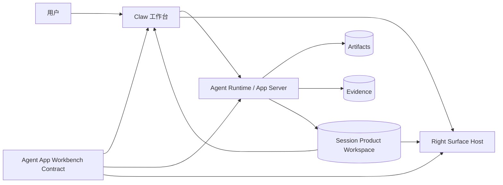
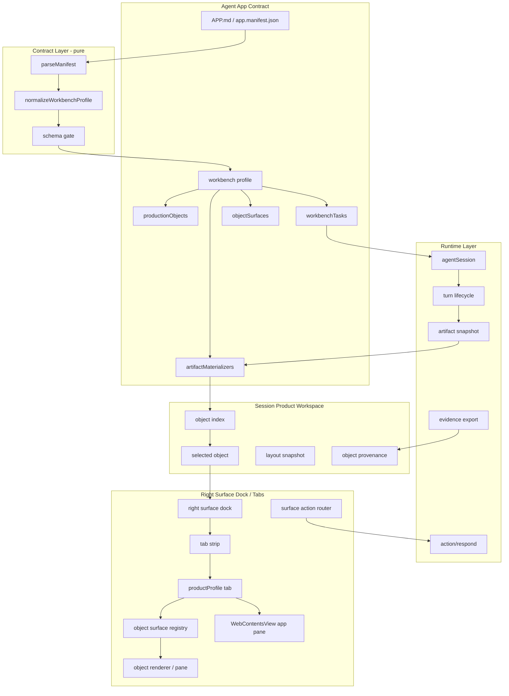
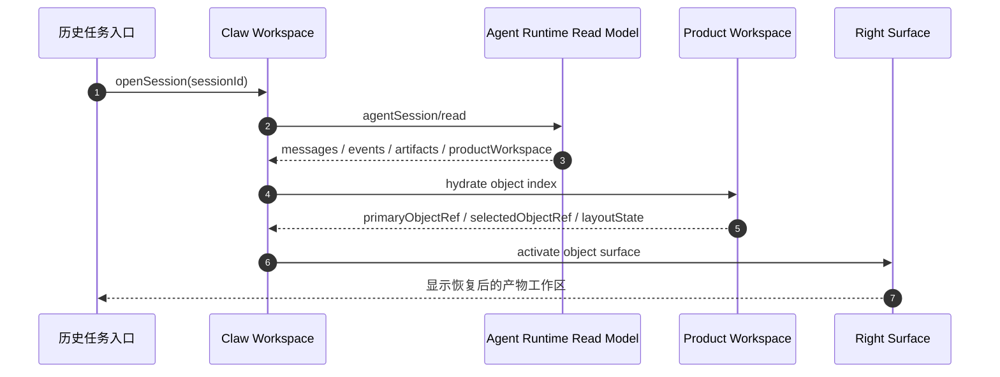
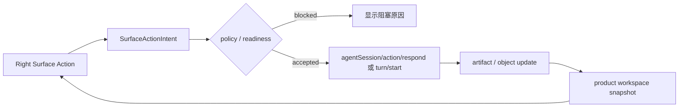

# Agent App v3 架构设计：Workbench Profile

更新时间：2026-06-23
状态：Draft
适用范围：Lime Desktop / Claw / Agent App Workbench Profile

## 1. 设计目标

v3 的架构目标是让生产型 Agent App 进入 Claw 工作台，而不是让每个业务 App 复制工作台。

1. **Claw 统一运行**：对话、任务、审批、runtime facts、artifact、evidence、历史会话继续由 Claw / Agent Runtime 承接。
2. **App 声明业务**：Agent App 声明 production objects、tasks、surfaces、workflow 和 materializer。
3. **Right Surface 渲染对象**：右侧 surface 渲染当前业务对象和结构化动作，不承载完整 App 壳。
4. **历史恢复工作现场**：session read model 恢复 product workspace，而不是只恢复 messages。
5. **副作用回到 Runtime**：surface action 只产生 session/action、workbench task 或 capability request。

## 2. 一句话架构

```text
Agent App Workbench Contract
  -> Claw Agent Session
  -> Artifact Materializer
  -> Session Product Workspace
  -> Right Surface Object Renderer
  -> History Restore
```

## 3. Context



关键约束：

- Agent App package 不 import Claw 内部模块。
- Claw 不内置内容工厂业务逻辑，只消费 contract 和 runtime read model。
- Right Surface 不拥有 runtime 事实，只渲染对象 read model。
- Session Product Workspace 是历史恢复和继续工作的事实源。
- Electron Desktop Host 是 current 桌面承载；旧 Tauri command / iframe-only App 不进入 v3 主路径。

## 4. 分层架构



## 5. 模块边界

| 模块 | 拥有 | 不能做 |
| --- | --- | --- |
| Agent App Contract | 业务对象、任务、surface、materializer、overlay 槽位。 | 依赖 Claw UI 内部实现、保存 secret 明文。 |
| Claw Workspace | 对话、任务启动、运行过程、历史列表、当前工作台布局。 | 硬编码内容工厂业务对象。 |
| Agent Runtime | turn、tool、action、artifact、evidence、read model。 | 直接渲染业务 UI。 |
| Session Product Workspace | session 级产物索引、选中对象、布局和 provenance。 | 承载完整 artifact 大内容或 UI state 细节。 |
| Right Surface Dock / Tabs | 唯一右侧 dock、多 tab 工作区、对象渲染、局部编辑、动作入口；必要时在产物 tab 内挂载受控 WebContentsView App pane。 | 直接调用模型、工具、文件系统或另起聊天；把每个对象做成独立物理右栏。 |
| Electron App Surface Host | 用 WebContentsView / controlled BrowserWindow 承载 App UI，并注入 Capability SDK。 | 暴露 Node、Electron、Tauri、App Server transport、provider key 或 host 文件路径。 |

## 6. 历史恢复拓扑



恢复规则：

1. 如果 session 有 `selectedObjectRef`，优先恢复选中对象。
2. 如果没有 selected object，但有 `primaryObjectRef`，打开主产物。
3. 如果没有 product workspace，回退到 artifact preview。
4. 如果 artifact 也为空，才回退到纯聊天历史。

## 7. Surface Action 回流



禁止路径：

```text
Right Surface -X-> provider API
Right Surface -X-> filesystem write
Right Surface -X-> secret value
Right Surface -X-> legacy desktop facade
Right Surface -X-> mock fallback in production
Right Surface -X-> raw Tauri command
```

## 8. Electron App Surface 承载

Workbench Profile 的右侧产物 Profile 有两种 current renderer：

| Renderer | 说明 |
| --- | --- |
| `host_builtin` | 宿主内置文章、图片组、storyboard、checklist 等 renderer，是内容工厂 MVP 首选。 |
| `app_webcontents_view` | App 提供复杂自定义 UI 时，由 Electron Desktop Host 把 App UI runtime 挂成 WebContentsView，并只注入 Capability SDK。 |

`app_webcontents_view` 不是通用内嵌网页，也不是旧 iframe 路线。宿主必须持有 view 生命周期、bounds、session partition、preload allowlist、window open / download policy 和 App Server bridge；App 只能看到 product object read model、SDK task events 和受控 action 结果。它挂在 `productProfile` tab 的 pane 中，不新开第二个右栏。

## 9. 与 Right Surface 路线图关系

`internal/roadmap/rightsurface/README.md` 负责统一右侧物理 dock、tab strip 和 pane 状态；v3 只定义 Agent App workbench 对象如何进入 `productProfile` tab。

映射关系：

| v3 概念 | Right Surface 概念 |
| --- | --- |
| `objectSurfaces[].surfaceKind` | `productProfile` tab 内部的 object renderer / pane kind |
| `selectedObjectRef` | `productProfile` tab render input |
| `surfaceActions` | conversation bridge / action router |
| `historyRestore.defaultSurface` | `productProfile` tab activation / focus policy |

## 10. 内容工厂架构切片

```text
content.article.generate
  -> articleDraft
  -> documentCanvas surface
  -> revise / continueWriting / generateImages / export

content.image.generate
  -> imageGenerationSet
  -> imageGrid surface
  -> regenerate / createVariant / applyToArticle

content.video.storyboard.generate
  -> videoStoryboard
  -> storyboard surface
  -> rewriteShot / generateVideoTask / export
```

内容工厂业务只作为首个 dogfood；标准不硬编码这些 object kind。
