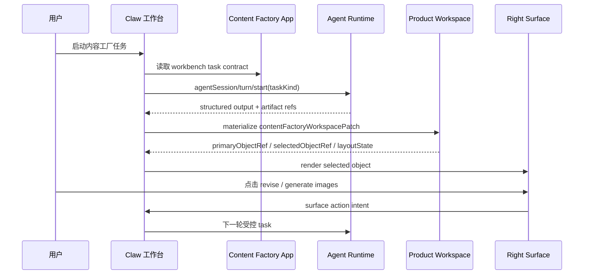

# 内容工厂 App 开发落地指南

更新时间：2026-06-23
状态：Draft

## 1. 目标

内容工厂 App 的开发目标不是复制一个独立内容应用，也不是在 Right Surface 里嵌入完整页面。目标是把内容工厂做成 **Workbench App Profile**：

```text
Agent App 声明业务对象 / 任务 / surface / materializer
Claw 负责对话 / 运行过程 / 审批 / Artifact / Evidence / 历史恢复
Right Surface 渲染当前业务对象和受控动作
Electron Desktop Host 承载 App surface，App Server JSON-RPC 承接 runtime facts
```

## 2. 布局不变量

Lime 的内容工厂布局和截图参考不同：中间不是产物画布，而是 Claw 对话和运行主链；右侧才是产物 Profile。文章、图片组、视频分镜、交付清单都在右侧 Product Profile / Right Surface 渲染。任何实现如果把中间切成主产物画布，或把对话挪到右侧，都偏离当前设计。

Right Surface 参考 Codex 的多 tab 工作区：右侧只有一个物理 dock，但 dock 内可以同时打开内容工厂产物、文件、证据、终端、浏览器和侧边聊天 tab。内容工厂对象默认进入 `productProfile` tab；文章、图片组、分镜、交付检查清单是该 tab 内的对象 renderer / pane，不互相挤掉整个右栏。

首个 MVP 只要求文章、图片组、视频分镜和历史恢复打通，不扩展到完整内容运营平台。

## 2.1 技术底座

内容工厂 App 按 Agent App v3 current 技术基线开发：

| 能力 | current 做法 | 禁止回退 |
| --- | --- | --- |
| App Center 上架 | package / manifest hash、projection、readiness、Workbench Profile、App Server bridge 全部通过后才可安装。 | 旧 Tauri App 继续挂在应用中心里“能打开就行”。 |
| 右侧产物 Profile | MVP 用 `productProfile` tab + host builtin renderer；复杂自定义 UI 才用 WebContentsView App pane。 | iframe-only 工作台、`<webview>`、BrowserView、第二个右栏。 |
| Agent 执行 | `agentSession/start`、`agentSession/turn/start`、`agentSession/event`、`agentSession/read`。 | App 或 surface 直接调用 provider、旧 `agent_app_*` Tauri command 或 mock fallback。 |
| 宿主桥接 | Capability SDK / Host Bridge，App 不感知 Electron IPC 和 App Server transport。 | 暴露 Node、Electron、Tauri、filesystem 或 sidecar 路径。 |

旧内容 App 如果不能迁移到这条链路，应从应用中心下架，不为它们扩展兼容层。

## 3. 开发分工

| 模块 | 责任 |
| --- | --- |
| Content Factory App 仓库 | `/Users/coso/Documents/dev/ai/limecloud/content-factory-app` 是 current 事实源，声明 `APP.md`、`app.workbench.yaml`、`app.runtime.yaml`、schema 和应用中心发布边界。 |
| AgentApp 标准包 | `/Users/coso/Documents/dev/ai/limecloud/agentapp/docs/examples/content-factory-app` 只保留为标准 fixture，用于说明和校验 contract。 |
| Lime manifest loader | 读取 `workbench.config`，解析 Workbench Profile。 |
| Agent App projection | 输出 production objects、workbench tasks、object surfaces、materializers、history restore。 |
| Runtime materializer | 把 `contentFactoryWorkspacePatch` 写成 product workspace read model。 |
| Claw workspace | 将 product workspace 挂到当前 session，负责 selection、layout、history restore。 |
| Right Surface | 使用 host builtin renderer 展示 document / imageGrid / storyboard / checklist。 |
| Surface action router | 把 revise、generate_images、create_variant 等 action 回流为 Runtime task。 |

## 4. 治理分类

| 路径 | 分类 | 后续规则 |
| --- | --- | --- |
| `/Users/coso/Documents/dev/ai/limecloud/content-factory-app` | `current` | 内容工厂唯一产品仓库；应用中心发布、安装、激活和打开都以它为准。 |
| `/Users/coso/Documents/dev/ai/limecloud/agentapp/docs/examples/content-factory-app` | `current-for-standard-fixture` | 只作为 Agent App 标准 fixture 和 contract 示例，不承接真实产品开发。 |
| `/Users/coso/Documents/dev/ai/limecloud/content-studio` | `dead / pending physical deletion` | 只允许作为历史业务参考；不得复用代码、IPC、store、renderer、Electron service 或样式。物理删除需要单独确认。 |
| Content Factory Classic UI / worker | `deprecated fallback` | 只保留应用中心独立打开或历史体验，不作为 Claw Workbench 主路径继续扩展；过不了 current readiness 时下架。 |
| 旧 Tauri Agent App | `deprecated / delist-if-not-migrated` | 不再作为 Lime current 兼容目标；无法迁移到 Electron Desktop Host + App Server bridge 时从应用中心下架。 |

## 5. 最小文件契约

Agent App 包必须至少包含：

| 文件 | 作用 |
| --- | --- |
| `APP.md` | 声明 `profiles: [classic, workbench]`、`workbench.config` 和 `lime.media` 等 capability。 |
| `app.workbench.yaml` | 声明生产对象、任务、surface、materializer 和历史恢复策略。 |
| `app.runtime.yaml` | 声明 `agentRuntime.agentTask.taskRequestSchema` 和 `taskContracts[]`。 |
| `artifacts/content-factory-workspace-patch.schema.json` | 约束 Runtime 输出，确保可物化为 product workspace。 |
| `app.operations.yaml` | 声明生成图片、视频分镜、恢复 product workspace 等操作风险。 |

Classic Profile 的 UI / worker / storage 可以后置；Workbench MVP 先依赖 Claw 和 host builtin renderer。

## 6. 应用中心发布

内容工厂不以内置页面或硬编码入口进入 Lime，而是走应用中心：

1. 独立仓库维护 release。
2. `APP.md` 声明 `distribution.primaryInstallSurface: lime-app-center`。
3. App Center 负责卡片、详情、安装本地应用、激活状态、更新和打开应用。
4. 安装后 Claw 读取 Workbench Profile，进入内容工厂 session。
5. 历史任务通过 session product workspace 恢复右侧产物 Profile。

应用中心卡片显示的是发布包状态；Claw 内显示的是运行态 session 和右侧产物 Profile，两者不要混成一个页面。

## 7. 数据流



关键点：Right Surface 只发 action intent，不直接调用模型、工具、文件系统或 secrets。

## 8. Product Workspace 模型

宿主侧 read model 可以先按以下最小结构实现：

```ts
type ProductObjectRef = {
  kind: string
  id: string
  sessionId?: string
  artifactRef?: string
  version?: string
}

type ProductWorkspace = {
  schemaVersion: 1
  appId: string
  sessionId: string
  primaryObjectRef?: ProductObjectRef
  selectedObjectRef?: ProductObjectRef
  objects: Array<ProductObjectRef & {
    title?: string
    sourceTaskKind?: string
    sourceTurnId?: string
    status?: 'draft' | 'running' | 'ready' | 'needs_review' | 'failed'
  }>
  layoutState?: {
    activeSurfaceKind?: string
    splitMode?: string
  }
}
```

不要把文章正文、图片二进制或大段分镜数据塞进 `ProductWorkspace`。这些内容通过 artifact / storage / read model 读取。

## 9. 宿主实现切片

### P1：Normalizer / Projection

1. 在 Agent App manifest normalizer 中读取 `workbench.config`。
2. 输出 current type：`productionObjects`、`workbenchTasks`、`objectSurfaces`、`artifactMaterializers`、`historyRestore`。
3. 对缺少主对象、surface 或 task contract 的包返回 degraded / blocked。

验收：Content Factory fixture 可以投影出文章、图片组、视频分镜三类核心对象。

### P2：Materializer / Workspace

1. Runtime 收到结构化结果后校验 `content-factory-workspace-patch.schema.json`。
2. 根据 `artifactMaterializers` 写入 `ProductWorkspace`。
3. session 内 selection 改变时更新 `selectedObjectRef`。
4. session 关闭或 artifact 创建时保存 snapshot。

验收：生成文章后同一 session 内可以恢复 `articleDraft` 主对象。

### P3：Right Surface Renderer

1. `documentCanvas`：展示 Markdown 草稿和修订动作。
2. `imageGrid`：展示图片候选、状态、变体动作。
3. `storyboard`：展示镜头表、旁白、素材需求。
4. `checklist`：展示交付检查和审批动作。
5. 复杂自定义 UI 后续通过 WebContentsView App Surface 接入，不通过 iframe 承载完整工作台。

验收：surface action 只能进入 action router，不能直接调用 provider。

### P4：历史恢复

1. 打开历史 session 时先读 product workspace snapshot。
2. 有 `selectedObjectRef` 时恢复选中对象。
3. 无选中对象时恢复 `primaryObjectRef`。
4. 无 product workspace 时回退 artifact preview。
5. Artifact 也没有时回退聊天记录。

验收：历史任务重新打开后默认看到产物，而不是只看到聊天。

## 10. 开发禁区

- 不复用 `/Users/coso/Documents/dev/ai/limecloud/content-studio` 的程序、IPC、store、renderer、Electron service、样式或打包流程。
- 不把 `/Users/coso/Documents/dev/ai/limecloud/agentapp/docs/examples/content-factory-app` 当真实产品仓库；它只是标准 fixture。
- 不在 Right Surface 中嵌完整内容工厂页面。
- 不新建第二套 Claw、第二套聊天、第二套运行过程或第二套 artifact/evidence。
- 不让 App 或 surface 直接访问 provider key、filesystem、secrets 或外部 API。
- 不把 `ProductWorkspace` 当成大内容存储。
- 不为旧 Tauri Agent App 新增兼容入口；无法通过 current readiness 的旧 App 直接下架。

## 11. 验证

Content Factory App 独立仓库：

```bash
cd /Users/coso/Documents/dev/ai/limecloud/content-factory-app
npm run validate:app
```

AgentApp 标准包：

```bash
cd /Users/coso/Documents/dev/ai/limecloud/agentapp
npm run cli -- validate docs/examples/content-factory-app --version 0.11.0
npm run build
```

Lime 宿主实现后：

```bash
npm test -- src/features/agent-app src/components/agent/chat/workspace
npm run test:contracts
npm run verify:gui-smoke
```

GUI smoke 场景：

1. 启动内容工厂文章任务。
2. 生成文章草稿。
3. 触发生成图片组。
4. 切换会话后从历史重新打开。
5. 自动恢复主产物和选中对象。
6. 在 Right Surface 执行一次改写或生成变体动作。
