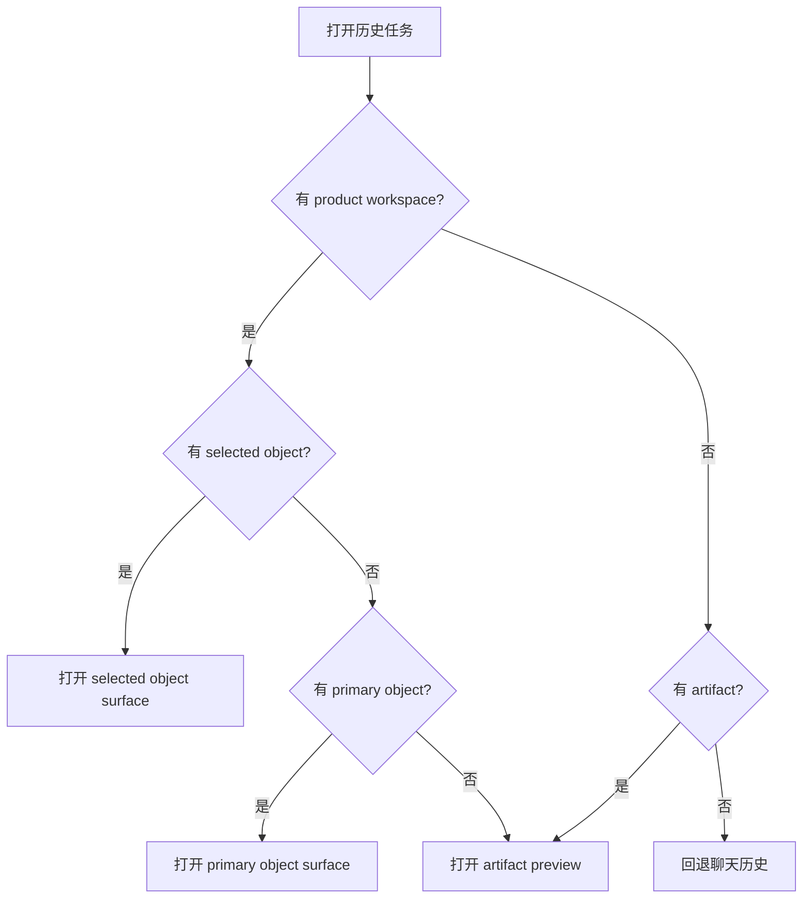

# 历史任务产物工作区恢复

更新时间：2026-06-23
状态：Draft

## 1. 目标

打开历史任务时，用户看到的不是一段孤立聊天，而是当时的工作现场：

```text
历史任务 = 对话 + 运行过程 + 产物工作区 + 当前选中产物 + 下一步动作
```

01Agent 的参考形态只说明“历史任务应能恢复产物现场”这个目标，不代表 Lime 的布局。Lime 的 Claw 设计中，中间始终是对话和运行主链；右侧产物 Profile 负责恢复文章、图片组、分镜等当前业务对象。

## 2. 产品要求

| 要求 | 说明 |
| --- | --- |
| 默认恢复主产物 | 用户打开历史后不需要从消息中翻找 artifact。 |
| 恢复选中对象 | 上次选中的文章、图片或分镜应成为当前对象。 |
| 恢复布局 | 宽屏优先恢复中间对话 + 右侧产物 Profile；窄屏按可用空间折叠右侧 Profile。 |
| 继续工作 | 历史产物可继续改写、生成变体、导出或进入下一阶段。 |
| 保持只读边界 | 旧的历史 action_required 不自动变成当前可提交表单。 |

## 3. 恢复数据

```ts
export interface HistoryProductWorkspaceRestoreSnapshot {
  sessionId: string;
  appId?: string;
  productWorkspace?: SessionProductWorkspace;
  primaryObjectRef?: ProductionObjectRef;
  selectedObjectRef?: ProductionObjectRef;
  artifactRefs: string[];
  layoutState?: ProductWorkspaceLayoutState;
}
```

必须恢复：

1. `sessionId`
2. `primaryObjectRef`
3. `selectedObjectRef`
4. `objects[]`
5. `previewArtifactId`
6. `layoutState.activeSurfaceKind`

可降级恢复：

1. scroll anchor
2. split mode
3. collapsed group state
4. last active action

## 4. 回退策略



## 5. GUI 验收场景

| 场景 | 验收 |
| --- | --- |
| 文章历史任务 | 中间恢复该任务对话，右侧产物 Profile 恢复文章草稿。 |
| 图片历史任务 | 中间恢复该任务对话，右侧产物 Profile 恢复图片组并选中上次图片。 |
| 视频分镜历史任务 | 恢复 storyboard 列表，可继续改写某个镜头。 |
| 无 product workspace 的旧会话 | 回退 artifact preview 或聊天，不报错。 |
| 旧 action_required | 只读回显，不提升到底部当前表单。 |

## 6. 实现注意事项

- 历史恢复不应抢正在运行的当前会话焦点。
- 选中对象更新要节流或按用户动作保存，避免滚动状态频繁写入。
- object workspace snapshot 不保存大正文；正文、图片、分镜内容仍由 artifact / storage read model 提供。
- 恢复失败要显示用户态原因，例如“该历史任务没有可恢复产物”，不要暴露 raw JSON。
