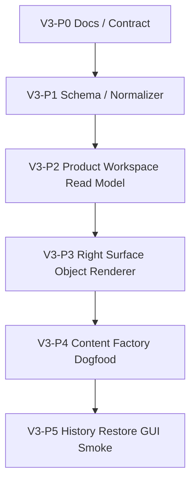

# Agent App v3 实施计划

更新时间：2026-06-23
状态：Draft

## 1. 执行原则

1. **先标准后实现**：先更新 roadmap 和 AgentApp 标准仓，避免实现时重新发明字段。
2. **先 contract 后 UI**：先做 Workbench Profile normalizer、projection 和 read model，再做 Right Surface 渲染。
3. **先历史恢复再增强交互**：能恢复产物工作区是 v3 MVP，复杂编辑器和批量操作后置。
4. **先 host_builtin renderer**：文章、图片网格、storyboard 用 Lime 内置 renderer 首刀，不接任意 App UI bundle。
5. **先内容工厂最小闭环**：文章、图片任务、视频分镜各一条路径，不扩到完整内容运营平台。
6. **Electron-first，不保旧 Tauri 兼容**：旧 Tauri / iframe-only App 过不了 Electron Desktop Host + App Server readiness 就下架，不为它们新增 compat。

## 2. 开发切片总览



## 3. V3-P0：文档与 contract

### 写集

| 仓库 | 文件 |
| --- | --- |
| Lime | `internal/roadmap/agentapp/v3/**` |
| AgentApp 标准仓 | `docs/zh/*`、`docs/en/*`、`docs/examples/content-factory-app/*`、`docs/*/versions/v0.11/*` |

### 验收

- v3 roadmap 文件完整。
- AgentApp 标准仓出现 Classic / Workbench 双 Profile。
- AgentApp 标准仓明确 Electron Desktop Host / WebContentsView / App Server bridge 是 current 上架基线，Tauri 只保留为外部兼容或历史迁移说明。
- App Center 上架规则包含 `needs-migration`、`delisted`、`blocked` 处置。
- content-factory 示例表达 Workbench Profile，不依赖 `content-studio` 程序。

## 4. V3-P1：Schema / Normalizer

### 写集建议

| 模块 | 文件建议 | 说明 |
| --- | --- | --- |
| Types | `src/features/agent-app/types.ts` | 增加 Workbench Profile current type。 |
| Manifest | `src/features/agent-app/manifest/normalizeManifest.ts` | raw workbench -> current type。 |
| Projection | `src/features/agent-app/projection/projectApp.ts` | projection 输出 workbench section。 |
| Readiness | `src/features/agent-app/readiness/checkReadiness.ts` | 缺 required object / surface 时 degraded / blocked。 |

### 验收

- Classic App fixtures 不变。
- 内容工厂 Workbench fixture 输出 production objects、tasks、surfaces。
- 未支持 Workbench Profile 的宿主 fail closed。

## 5. V3-P2：Product Workspace Read Model

### 写集建议

| 模块 | 文件建议 | 说明 |
| --- | --- | --- |
| Runtime adapter | `src/features/agent-app/runtime/*` | 从 artifact / task result 构建 workspace patch。 |
| Claw workspace | `src/components/agent/chat/workspace/*` | 接收 product workspace read model。 |
| Pure model | `src/features/agent-app/workbench/productWorkspace*.ts` | object index、selection、layout reducer。 |

### 验收

- materializer 输出 object index。
- 用户选择对象会更新 selected object snapshot。
- `agentSession/read` 或宿主 read model 能恢复 product workspace。

## 6. V3-P3：Right Surface Object Renderer

### 写集建议

| 模块 | 文件建议 | 说明 |
| --- | --- | --- |
| Right Surface | `src/components/agent/chat/workspace/right-surface/*` | 注册 Agent App object surface。 |
| Renderer | `src/features/agent-app/workbench/renderers/*` | document / imageGrid / storyboard host_builtin renderer。 |
| Action router | `src/features/agent-app/workbench/surfaceAction*.ts` | surface action -> runtime action / turn start。 |

### 验收

- 文章草稿进入 document renderer。
- 图片任务进入 image grid renderer。
- 视频分镜进入 storyboard renderer。
- 这些 renderer 位于 `productProfile` tab 内，不抢占整个右侧 dock；文件、证据、终端、浏览器等 tab 可同时保留。
- action 不直接调用 provider / filesystem。

## 7. V3-P4：内容工厂 dogfood

### 最小闭环

| 任务 | 产物 | Surface | 动作 |
| --- | --- | --- | --- |
| `content.article.generate` | `articleDraft` | documentCanvas | revise / continueWriting / generateImages / export |
| `content.image.generate` | `imageGenerationSet` | imageGrid | regenerate / createVariant / applyToArticle |
| `content.video.storyboard.generate` | `videoStoryboard` | storyboard | rewriteShot / generateVideoTask / export |

### 验收

- 同一 session 内能生成至少一个主产物。
- 产物可在右侧产物 Profile / surface 中查看，中间仍是 Claw 对话和运行过程。
- surface action 能继续创建后续 task。

## 7.1 V3-P4A：App Surface Host 可选切片

内容工厂 MVP 先使用 host builtin renderer。如果后续需要 App 自有复杂 UI，则新增独立切片，不和 P3 renderer 混在一起：

| 模块 | 文件建议 | 说明 |
| --- | --- | --- |
| Electron Host | `electron/agentAppSurfaceHost.ts` | 用 WebContentsView 挂载 App UI runtime，管理 bounds、partition、preload、window open policy。 |
| Frontend API | `src/lib/api/agentAppSurfaces.ts` | 页面只请求 mount / setBounds / destroy，不直接接触 Electron IPC。 |
| Right Surface | `src/components/agent/chat/workspace/right-surface/*` | 在 `productProfile` tab 的 appSurface pane 中渲染 native view placeholder，并同步 DOM bounds。 |
| App Server | 复用 `agentAppShell/prepare`、`agentAppUiRuntime/start` | 不新增垂直 content factory command。 |

验收：

- WebContentsView 按右侧 Profile pane 占位区域定位，切换 tab / pane 时隐藏或暂停。
- App UI 只拿到 Capability SDK / Host Bridge，不拿 Electron、Node、Tauri、App Server transport。
- App Server 不可用时 fail closed。
- `<webview>`、BrowserView、iframe-only runtime 不进入新增主路径。

## 8. V3-P5：历史恢复 GUI smoke

### 场景

1. 创建内容工厂文章任务。
2. 生成文章草稿和图片任务。
3. 切换到其他会话。
4. 从历史任务重新打开。
5. 默认在右侧产物 Profile 恢复主产物和选中对象。
6. 执行一个继续改写或生成变体动作。

### 验收命令建议

```bash
npm test -- src/features/agent-app src/components/agent/chat/workspace
npm run test:contracts
npm run verify:gui-smoke
```

涉及真实 GUI 恢复时补 Playwright / Electron smoke，并保存 `.lime/qc/gui-evidence/**`。
