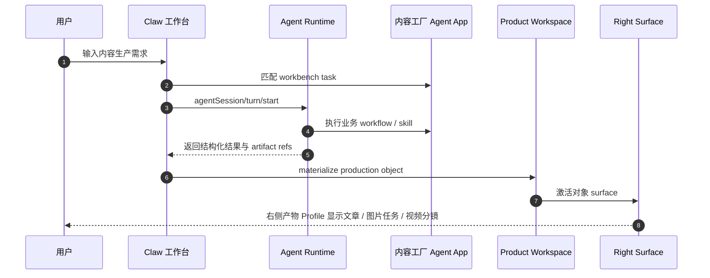
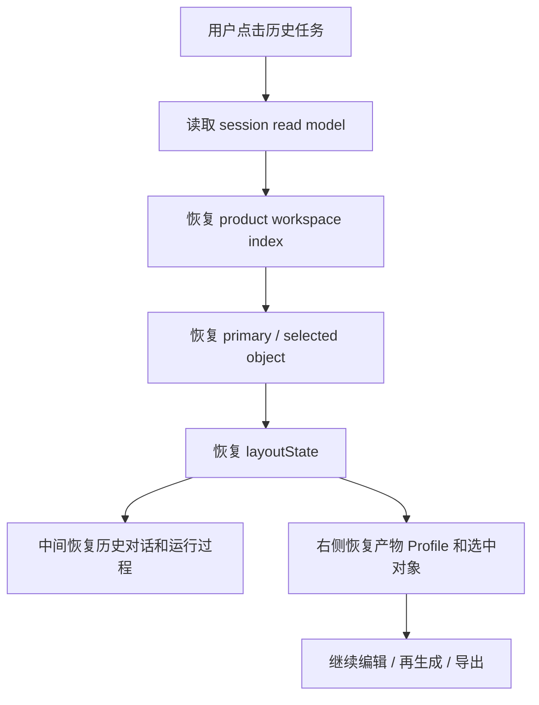

# Agent App v3 PRD：Workbench Profile 与历史产物恢复

更新时间：2026-06-23
状态：Draft
事实源：`internal/roadmap/agentapp/v2/`、`internal/roadmap/rightsurface/README.md`、`/Users/coso/Documents/dev/ai/limecloud/agentapp` v0.11 标准

## 1. 一句话目标

让 Agent App 可以成为 Claw 工作台内的生产型业务应用：App 声明生产任务、业务对象和右侧交互 surface，Claw 负责对话和运行，历史任务能恢复当时的产物工作区并继续编辑。

```text
用户不是回到一段聊天历史
用户是回到一个带产物、状态、上下文和下一步动作的工作现场
```

## 2. 背景与问题

v2 已经把 Agent App 推进到可安装、可独立启动、可复用 Runtime 的产品形态。但内容工厂这类业务不是单纯“打开一个 App 页面”就能解决。用户真实想完成的是：

1. 生成文章、图片、视频脚本、分镜和交付包。
2. 在生成过程中查看依据、过程、风险和审批。
3. 完成后能在历史任务中再次打开产物。
4. 基于历史产物继续改写、派生图片、生成视频任务或导出。

如果仍按 Classic App Profile 处理，容易出现三个问题：

| 问题 | 影响 |
| --- | --- |
| App UI 与 Claw 工作台割裂 | 用户在页面、聊天、运行过程、产物之间来回跳，无法形成一个工作现场。 |
| 产物不是一等对象 | 文章 / 图片 / 视频分镜只混在消息或 artifact 列表里，历史恢复和继续编辑困难。 |
| 右侧面板被误用 | 要么塞完整 App，要么只做简单预览，无法表达业务操作。 |

v3 的目标是补齐 Workbench 型 Agent App 标准，而不是重写 Claw 或迁移旧内容工厂程序。

## 3. 目标与非目标

### 目标

1. 在 Agent App 标准中新增 `Workbench App Profile`，与 Classic Profile 并存。
2. 定义 session scoped product workspace，让每个工作台 session 绑定业务产物索引、主产物、选中对象和布局状态。
3. 定义 production object、workbench task、object surface、artifact materializer 和 surface action contract。
4. 打通历史任务恢复：打开历史对话时，中间保持 Claw 对话 / 运行主链，右侧恢复产物 Profile、当前主产物和选中对象。
5. 以内容工厂为 dogfood，覆盖文章生成、图片生成任务、视频脚本 / 分镜生成的最小闭环。
6. 明确内容工厂作为独立 Agent App 仓库通过 Lime 应用中心发布，不进入 Lime 主仓作为内置业务模块。

### 非目标

- 不复用 `/Users/coso/Documents/dev/ai/limecloud/content-studio` 的代码、IPC、store、renderer、Electron main service 或样式。
- 不重做 Claw，不新增第二套聊天、运行、审批或 artifact/evidence 事实源。
- 不把完整 App page route 塞进 Right Surface。
- 不在第一阶段实现完整视频模型网关、发布平台、多租户协作、计费或素材资产管理后台。
- 不破坏 v2 standalone / runtime-backed / Classic App Profile。
- 不把旧 `content-studio` 或标准 fixture 当作内容工厂 current 实现。

## 4. 用户与场景

| 用户 | 需求 | v3 体验 |
| --- | --- | --- |
| 内容创作者 | 生成一篇文章并配图。 | 在 Claw 中间对话区输入需求并查看运行过程；右侧产物 Profile 显示文章草稿和后续动作。 |
| 短视频运营 | 从主题生成脚本和分镜。 | Agent 生成脚本 / storyboard；Right Surface 允许逐镜头改写和进入视频任务。 |
| 设计 / 运营 | 回到历史任务继续改图。 | 点击历史任务后恢复图片结果网格和上次选中图片，可继续生成变体。 |
| 审核者 | 追溯产物来源和风险。 | 每个产物能看到来源 task、turn、输入、artifact 和 evidence。 |
| App 作者 | 声明业务对象而不是重写工作台。 | 用 manifest 声明 production objects、tasks 和 surfaces，由 Claw 承载运行与展示。 |

## 5. 核心用户路径

### 5.1 创建内容任务



### 5.2 历史任务恢复



## 6. 产品需求

### 6.1 Workbench Profile

| 编号 | 需求 | 验收 |
| --- | --- | --- |
| FR-01 | Agent App 可声明 `workbench.profile = production`。 | normalizer 输出 Workbench Profile；Classic App 不受影响。 |
| FR-02 | App 可声明 production objects。 | 每个 object kind 有 schema、title、artifact kind、默认 surface 和版本策略。 |
| FR-03 | App 可声明 workbench tasks。 | Claw 能把入口、用户意图或 action 映射到 task kind。 |
| FR-04 | App 可声明 object surfaces。 | Right Surface registry 能按 object kind 找到渲染器和 action 列表。 |

### 6.2 Session Product Workspace

| 编号 | 需求 | 验收 |
| --- | --- | --- |
| FR-05 | 每个 Agent App session 维护产物索引。 | session read model 能返回 objects、primaryObjectRef、selectedObjectRef。 |
| FR-06 | 产物有来源关系。 | object ref 能关联 sourceTurnId、taskId、artifactIds、evidenceIds。 |
| FR-07 | 选中对象和布局持久化。 | 关闭再打开 session 后恢复上次工作现场。 |

### 6.3 Right Surface 交互

| 编号 | 需求 | 验收 |
| --- | --- | --- |
| FR-08 | Right Surface 渲染当前业务对象。 | 文章、图片任务、视频分镜分别进入对应 surface。 |
| FR-09 | surface action 回流 runtime。 | `revise`、`regenerate`、`createVariant`、`export` 等动作产生受控 session/action 或业务 task。 |
| FR-10 | Right Surface 不承载完整 App 壳。 | 不出现嵌套导航、第二个聊天系统或完整内容工厂页面。 |

### 6.4 历史恢复

| 编号 | 需求 | 验收 |
| --- | --- | --- |
| FR-11 | 打开历史任务默认恢复主产物。 | 用户不需要从消息里手动找 artifact。 |
| FR-12 | 历史任务可继续工作。 | 用户可基于历史文章继续改写，基于历史图片继续生成变体。 |
| FR-13 | 历史 A2UI / action 只读回显与当前可提交动作区分。 | 旧 action 不被误提交；新 action 基于当前 selected object 创建。 |

## 7. 非功能需求

| 维度 | 要求 |
| --- | --- |
| 安全 | 右侧 surface 不直接调用模型、工具、文件或 secret；所有副作用回到 Runtime / Capability SDK。 |
| 隐私 | 业务对象只保存 ref、摘要和受控 artifact 内容，不写入明文 secret。 |
| 可测试 | object materializer、history restore、surface projection 优先纯函数测试。 |
| 可观测 | 产物、surface action、导出和人工审核必须带 provenance。 |
| UX | 历史任务打开后 5 秒内能看出主对象、当前阶段、下一步动作。 |

## 8. 里程碑

| 阶段 | 目标 | 交付物 |
| --- | --- | --- |
| V3-P0 | 文档与 contract | v3 roadmap、标准仓 Workbench Profile 文档、内容工厂示例 contract。 |
| V3-P1 | Schema / normalizer | Workbench Profile normalizer、projection、readiness。 |
| V3-P2 | Product workspace read model | session scoped product workspace、object index、selection snapshot。 |
| V3-P3 | Right Surface renderer | object surface registry、surface action routing。 |
| V3-P4 | 内容工厂 dogfood | 文章、图片、视频分镜最小闭环。 |
| V3-P5 | 历史恢复 smoke | 打开历史任务时，中间保留对话，右侧恢复产物 Profile 和可继续操作。 |

## 9. 验收标准

v3 MVP 完成时必须满足：

- [ ] Agent App 标准能表达 Classic / Workbench 双 Profile。
- [ ] 内容工厂示例不依赖完整 page route 也能声明生产任务和对象 surface。
- [ ] Claw session read model 能恢复 product workspace。
- [ ] 历史任务打开后默认显示主产物，而不只是聊天记录。
- [ ] 文章 / 图片任务 / 视频分镜至少各有一个 object surface contract。
- [ ] surface action 不绕过 Runtime。
- [ ] GUI smoke 覆盖新建内容任务、生成产物、切换历史任务、继续操作。

## 10. 风险与应对

| 风险 | 应对 |
| --- | --- |
| Workbench Profile 变成万能页面系统 | 只接受 production object / task / surface contract，不复刻 page route。 |
| Right Surface 被塞完整 App | surface contract 限制为对象渲染和动作，禁止嵌套导航和第二聊天。 |
| 历史恢复状态膨胀 | 只保存 object index、selection、layout 和 artifact refs，重内容留在 artifact / storage。 |
| 内容工厂范围膨胀 | v3 dogfood 只做文章、图片任务、视频脚本 / 分镜，不做完整发布平台。 |
