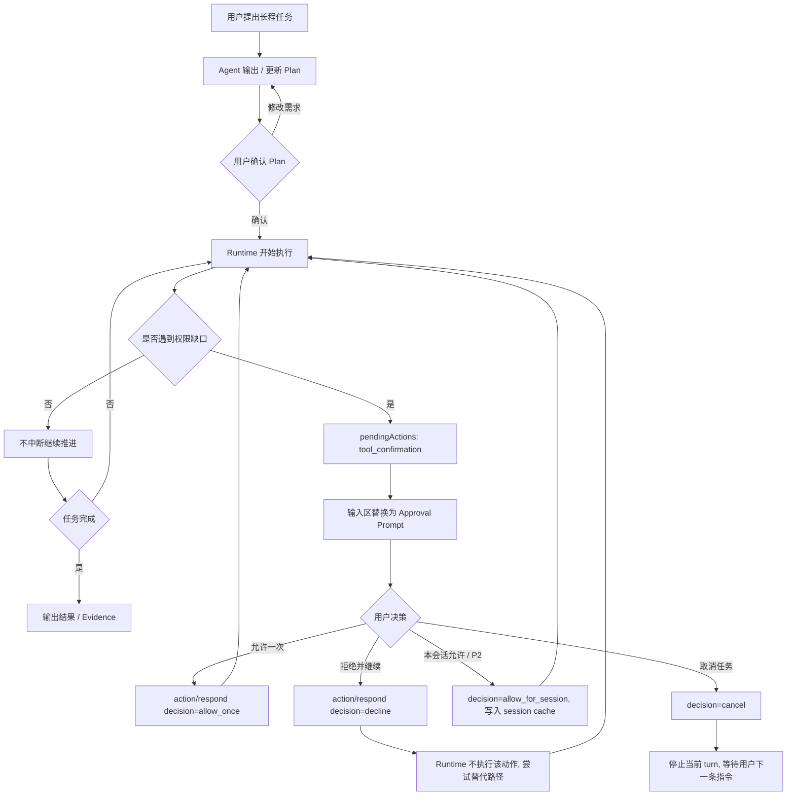
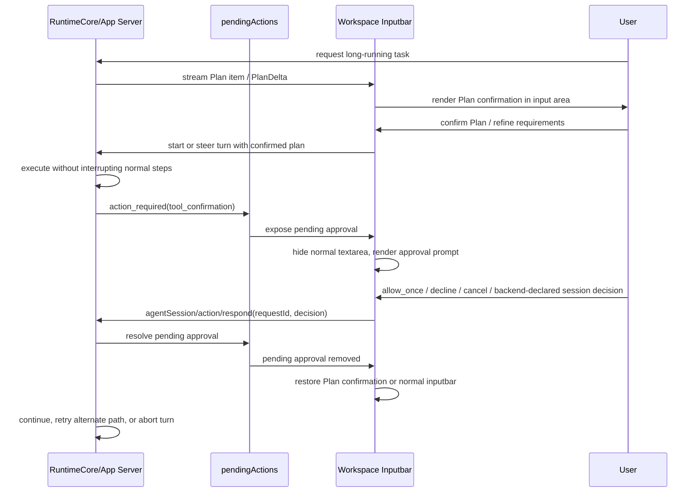
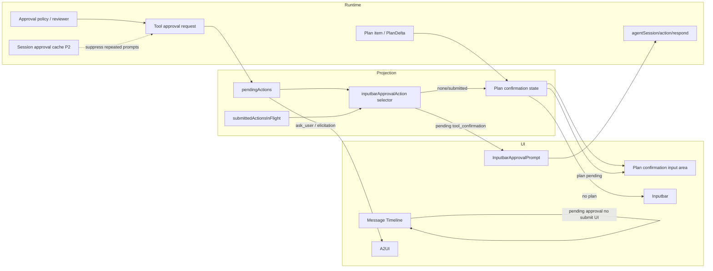

# Approval 输入区确认 PRD

状态：current implementation

更新时间：2026-07-10

## 结论

Approval 场景不需要 A2UI。`tool_confirmation` 是 runtime control plane 的暂停与恢复控制，应在输入框区域展示精简确认 prompt，并在确认期间替换普通输入框；确认提交后普通输入框恢复。A2UI 只保留给 `ask_user`、`elicitation`、Service Skill 补参、结构化表单/产物和历史只读回显。

从 human-in-the-loop 视角看，approval 不是“让用户反复确认 Agent 每一步”的机制，而是长程任务中少数必须由人授权的安全闸门。需求、目标、范围和风险偏好应尽早通过 Plan 态确认；Plan 确认后，运行时应尽量不中断，只有权限不足、越过沙箱/网络/文件边界、或用户主动取消时才暂停。

## 背景

此前 approval 被渲染成消息流里的大卡片或 A2UI 候选表单，造成三个问题：

- 交互位置错误：用户的下一步动作在消息流中，而不是输入区，和 Plan 确认态不一致。
- 双入口风险：消息流卡片、A2UI、输入框可能同时承接同一个 runtime decision。
- 协议语义混淆：`tool_confirmation` 是执行控制，不是模型生成的业务表单。

Codex-rs 的后端口径也支持该判断：

- `/Users/coso/Documents/dev/rust/codex/codex-rs/core/src/session/mod.rs` 的 `request_command_approval` 先把 approval waiter 注册到 turn state，再发出 `ExecApprovalRequest`，随后等待 decision。
- `/Users/coso/Documents/dev/rust/codex/codex-rs/core/src/state/turn.rs` 的 `pending_approvals` 是 turn-scoped waiter map。
- `/Users/coso/Documents/dev/rust/codex/codex-rs/core/src/session/handlers.rs` 通过 `Op::ExecApproval` 把用户 decision 回填给等待中的 runtime。
- `/Users/coso/Documents/dev/rust/codex/codex-rs/app-server-protocol/src/protocol/v2/item.rs` 将 `Plan` 作为独立 thread item，并通过 `PlanDeltaNotification` 流式更新，说明 Plan 是前置意图/需求确认，不是普通 assistant message。
- `/Users/coso/Documents/dev/rust/codex/codex-rs/protocol/src/protocol.rs` 的 `ReviewDecision` 区分 `Approved`、`ApprovedForSession`、`Denied`、`Abort`：拒绝某次动作不等于停止整个长程任务，只有 abort/cancel 才应等待用户下一条命令。
- `/Users/coso/Documents/dev/rust/codex/codex-rs/core/src/tools/sandboxing.rs` 的 `ApprovalStore` / `with_cached_approval` 支持会话级 approval cache，证明“本会话同类授权不再打扰”应进入 Lime 后续协议模型。
- `/Users/coso/Documents/dev/rust/codex/codex-rs/protocol/src/protocol.rs` 的 `ThreadSettingsOverrides` 包含 `approval_policy`、`approvals_reviewer`、`sandbox_policy`、`permission_profile`，说明授权策略属于 thread/session runtime 设置，不属于 A2UI 表单 schema。

外部调研结论：

- WebSearch / OpenAI Codex 手册：Codex approval 与 sandbox 是两层配套控制，sandbox 决定能做什么，approval policy 决定何时必须停下来询问；任务在边界内应继续自主执行，越过文件、网络、工具副作用等边界才进入 approval。来源：https://developers.openai.com/codex/agent-approvals-security、https://developers.openai.com/codex/concepts/sandboxing
- Context7 查询 `/ag-ui-protocol/ag-ui` 当前文档：AG-UI 提供 HITL approvals、interrupts、resume payload 和 frontend tools 的事件协议，但它描述的是 agent/frontend 交互能力，不是 Lime 的 App Server / RuntimeCore 授权事实源。来源：https://github.com/ag-ui-protocol/ag-ui/blob/main/docs/concepts/capabilities.mdx、https://github.com/ag-ui-protocol/ag-ui/blob/main/docs/concepts/interrupts.mdx
- 因此第三方 UI / 事件协议只说明 approval 需要一个承载点和 resume 语义，不说明它应进入 A2UI。Lime 的承载点选输入区，协议事实源仍是 runtime `tool_confirmation` + `agentSession/action/respond` 的 `decision`。

## 目标

1. `tool_confirmation` pending 时，底部输入区替换为精简 approval prompt。
2. 普通输入框在 pending approval 期间隐藏；提交允许/拒绝后恢复。
3. 消息流不再渲染 pending approval 的可提交 DecisionPanel 或 A2UI 表单；Harness 待审批区只展示只读 evidence。
4. `ask_user` / `elicitation` 继续走 A2UI 或原有问答交互，不受 approval 改造影响。
5. 长程任务通过 Plan 态尽早确认目标、范围和风险边界；Plan 确认后执行阶段只在权限缺口处触发 approval。
6. 授权策略演进到可表达“允许一次 / 本会话允许 / 拒绝并继续 / 取消任务”的决策模型。
7. 文档、测试、五语言 i18n 与实现保持一致。

## 非目标

- 不把 approval 作为 A2UI / AG-UI 业务表单协议来实现。
- 不把 `tool_confirmation` 包装成 A2UI schema。
- 不保留旧消息流 approval 大卡或 Harness 待审批区作为主入口。
- 不处理所有历史 imported approval 的视觉重设计；历史已提交记录可以继续只读展示。
- 当前实现不一次性落所有 tool family 的完整 Codex `ApprovalStore`；本轮已接入 decision-based App Server contract，并完成 browser_control permission preflight 的 session-scoped cache、scope/lifecycle、Evidence export first slice、历史只读投影与真实 Electron CDP second-request 证据。后续只按实际 tool policy 继续接入 scope/cache owner，不再扩展旧 UI 或 A2UI approval 面。

## 用户价值

- 用户在输入框区域处理下一步动作，符合聊天工具的输入心智。
- 风险确认更短、更靠近操作区域，不打断消息阅读。
- approval 和业务表单分层清晰，后续不会因为 A2UI 表单能力扩展而污染 runtime control。
- 和 Plan 确认态一致：等待用户决策时，输入区承接决策；决策后恢复正常输入。
- 长程任务更稳：前期通过 Plan 收敛需求，执行中不因为普通确认频繁停住。
- 授权更可控：高风险动作仍必须显式批准，同类低风险重复动作可以通过会话级授权减少打扰。

## 用户故事

- 作为用户，当 Agent 请求执行命令、写文件或访问浏览器时，我希望在输入框位置看到“允许/拒绝”，无需回到消息流寻找按钮。
- 作为用户，当我点击允许或拒绝后，我希望普通输入框恢复，并且 Agent 继续或停止当前工具操作。
- 作为开发者，我希望 `tool_confirmation` 只有一个主交互入口，避免消息流卡片和输入区确认同时提交。
- 作为维护者，我希望 A2UI 只处理结构化输入和生成 UI，不承担 runtime approval 协议事实源。
- 作为长程任务用户，我希望 Agent 在开始前先给出可确认的 Plan，并在我确认后尽量自主推进，除非确实需要新的权限。
- 作为安全敏感用户，我希望“拒绝本次动作”和“取消整个任务”是两个清晰不同的选择，避免误操作让长程任务直接停死。

## 用户用例

| 用例              | 前置条件                         | 用户动作               | 系统结果                                                              |
| ----------------- | -------------------------------- | ---------------------- | --------------------------------------------------------------------- |
| 允许命令执行      | runtime 发出 `tool_confirmation` | 点击输入区 `允许`      | 调用 `agentSession/action/respond`，`decision=allow_once`，输入框恢复 |
| 拒绝命令执行      | runtime 发出 `tool_confirmation` | 点击输入区 `拒绝`      | 调用 `agentSession/action/respond`，`decision=decline`，输入框恢复    |
| 单行确认          | approval prompt 已替换输入框     | 查看摘要并选择决策     | 同一行完成授权，不展开详情卡或参数面板                                |
| ask_user 补充信息 | runtime 发出 `ask_user`          | 在 A2UI/问答控件中提交 | 继续使用 ask/elicitation 原链路                                       |
| 历史回放          | 历史里有已完成 approval          | 查看执行轨迹           | 只读回显或不展示提交按钮，不重新授权                                  |
| 前置 Plan 确认    | 用户提出长程任务                 | 确认或修改 Plan        | 需求和授权边界前置收敛，执行阶段减少打扰                              |
| 本会话允许        | backend 宣告 `allow_for_session` | 选择本会话允许         | P2 first slice 写入 browser_control session-scoped approval cache     |
| 拒绝并继续        | 单次动作不被允许                 | 选择拒绝               | `decision=decline`，runtime 不执行该动作但不 cancel 当前 turn         |
| 取消任务          | 用户不希望任务继续               | 选择取消               | `decision=cancel`，runtime cancel 当前 turn，等待用户下一条指令       |

## HITL 分层模型

Approval 必须放在 human-in-the-loop 的分层里看，而不是单独看成一个 UI 控件：

| 层级                | 主入口                 | 用户意图                           | Lime 分类                                     |
| ------------------- | ---------------------- | ---------------------------------- | --------------------------------------------- |
| Plan / 需求确认     | 输入区 Plan 确认态     | 确认目标、范围、约束、风险偏好     | current，长程任务前置闸门                     |
| Runtime approval    | 输入区 approval prompt | 授权越权动作、命令执行、文件/网络  | current，`tool_confirmation` 唯一提交入口     |
| Ask / elicitation   | A2UI 或问答控件        | 补充缺失业务信息或结构化参数       | current，业务输入，不是权限授权               |
| Interrupt / cancel  | 运行中断/取消入口      | 用户主动停止任务或拒绝继续         | current，终止当前 turn，不等同于普通 deny     |
| 历史回放 / evidence | Timeline / Evidence    | 查看已经发生的授权、拒绝和执行轨迹 | current/read-only，不得重新提交 runtime 决策  |
| Approval A2UI 表单  | 无                     | 无                                 | dead，禁止作为 `tool_confirmation` 主交互入口 |

### 长程任务原则

1. 长程任务开始前，Agent 应优先输出 Plan，把目标、阶段、风险动作和需要的权限边界暴露给用户确认。
2. Plan 确认后，runtime 默认继续推进任务，不因普通步骤、普通状态同步或可自动处理的失败打断用户。
3. Approval 只在权限缺口、安全边界、沙箱/网络/文件写入策略、或用户已声明需要人工确认的动作上触发。
4. `Denied` 表示“不执行这次动作并继续尝试替代方案”；`Abort` / `Cancel` 才表示当前 turn 停止并等待用户下一条命令。
5. 对重复且同质的动作，后续协议必须支持 session-scoped 授权，避免同一长程任务里重复弹同类确认。
6. `ask_user` / `elicitation` 只能用于信息缺口，不能拿来替代授权；授权必须记录为 runtime decision。

### 决策模型

当前已落地的 App Server decision contract 是：

| 当前动作     | 发送字段                     | 语义                                                                                                       |
| ------------ | ---------------------------- | ---------------------------------------------------------------------------------------------------------- |
| 允许一次     | `decision=allow_once`        | 只放行当前 `tool_confirmation`，`confirmed` 仅由 runtime 派生为审计字段                                    |
| 本会话允许   | `decision=allow_for_session` | 仅当 backend `availableDecisions` 宣告时显示；browser_control first slice 已接入 RuntimeCore session cache |
| 拒绝并继续   | `decision=decline`           | 当前动作不执行，runtime 可继续寻找替代路径，不触发 turn cancel                                             |
| 取消当前任务 | `decision=cancel`            | 当前 turn 停止，等待用户下一条命令                                                                         |

Codex decision 对照：

| 目标动作       | Codex 对照                                               | Lime 后续语义                       |
| -------------- | -------------------------------------------------------- | ----------------------------------- |
| 允许一次       | `Approved`                                               | 只放行当前 request                  |
| 本会话允许     | `ApprovedForSession`                                     | 写入 session-scoped cache，减少打扰 |
| 带策略变更允许 | `ApprovedExecpolicyAmendment` / network policy amendment | 修改执行/网络策略后继续             |
| 拒绝并继续     | `Denied` / `decline`                                     | 当前动作不执行，runtime 继续绕路    |
| 取消当前任务   | `Abort` / `cancel`                                       | 当前 turn 停止，等待用户下一条命令  |

因此，`tool_confirmation` 不再接受只靠 `{ confirmed }` 的正向 approval contract；缺少 `decision` 必须 fail closed。`ask_user` / `elicitation` 携带 approval `decision` 也必须 fail closed，避免业务补参伪装成授权。

## 交互设计

输入区 prompt 固定为一行：

- 左侧：一个权限提醒图标。
- 主体：单行截断的 runtime prompt；完整文本只通过原生 tooltip / title 辅助查看。
- 右侧：只渲染 backend `availableDecisions` 宣告的必要动作。
- 窄宽度：动作保留图标、`aria-label` 和 tooltip，隐藏按钮文字，输入区高度不变化。

禁止恢复风险 badge、工具/目录/路径参数 chips、完整 JSON 展开、二级说明、A2UI task card 或多行详情面板。参数和 scope 继续只进入 read model / Evidence，不进入输入区主交互。

输入区阻塞态优先级固定为：

1. `approval pending`：存在未 submitted 的 pending `tool_confirmation` 时，输入区只展示 `InputbarApprovalPrompt`；普通输入框、Plan 确认和业务 A2UI 都不能抢占同一 request。
2. `Plan confirmation`：没有未 submitted approval，且存在 Plan 确认 request 或本地 proposed plan 实施确认时，输入区展示 Plan 确认态。
3. `normal Inputbar`：没有 approval / Plan 阻塞态时，恢复普通输入框；如果 approval 已进入 `submittedActionsInFlight`，即使 read model 尚未清掉旧 pending request，也必须释放输入区，并允许回到 Plan 确认或普通输入。

## 流程图



## 时序图



## 架构图



## A2UI 分类

| 场景                | 分类              | 说明                                                      |
| ------------------- | ----------------- | --------------------------------------------------------- |
| Plan / 需求确认     | non-A2UI current  | 输入区 Plan 确认态，前置收敛长程任务需求                  |
| `tool_confirmation` | dead for A2UI     | 不允许生成 A2UI 表单；输入区 approval prompt 是唯一主入口 |
| runtime permissions | non-A2UI current  | 授权策略和 permission profile 属于 runtime / thread 配置  |
| `ask_user`          | current for A2UI  | 单轮最小问题，可用 A2UI 表单或问答控件                    |
| `elicitation`       | current for A2UI  | schema-driven 结构化补参                                  |
| Service Skill 补参  | current for A2UI  | 业务字段输入，适合表单                                    |
| 结构化产物/预览     | current for A2UI  | 生成 UI 或只读任务卡                                      |
| 历史只读回显        | current/read-only | 可展示已提交内容，不可再次提交                            |

## 清理项

- pending `tool_confirmation` 不再进入 `ActionRequestA2UIPreviewCard`。
- pending `tool_confirmation` 不再从消息流 `DecisionPanel` 提交。
- Harness approvals / runtime status panel 不再展示 inline 允许/拒绝按钮，不再发送 `{ confirmed }` respond；只保留风险、范围、参数和请求 ID 的只读 evidence。
- Workspace 输入区用 `InputbarApprovalPrompt` 替换普通 `Inputbar`。
- `InputbarApprovalPrompt` 删除风险分级、参数 chips 和 JSON 详情，只保留单行 prompt 与决策动作。
- 选择逻辑集中在 `inputbarApprovalAction`，避免父层散落判断。
- 测试断言更新为：approval 不走 A2UI；pending approval 不在消息流渲染 DecisionPanel；提交后输入区恢复。
- PRD 将 HITL 分成 Plan、runtime approval、ask/elicitation、interrupt/cancel，不再把所有人工介入合并成一个 A2UI 面。

## 工程约束

本改造必须遵守仓库 `AGENTS.md` 当前约束：

- 始终中文沟通；用户可见文案必须进入五语言 i18n。
- 先读后写，不回滚用户或并行 Agent 的脏改动。
- Codex-first：approval 语义对齐 Codex-rs turn-scoped pending waiter 与 decision resume，不沿用 Agent 或旧 GUI 临时语义。
- 无兼容包袱时直接替换旧实现，不新增 compat 包装。
- 长程任务默认通过 Plan 前置确认需求；Plan 确认后不因普通执行步骤频繁打断用户。
- 授权策略属于 runtime/thread/session 配置，不能下沉到 A2UI schema 或消息流卡片局部状态。
- UI 主路径改动必须补稳定回归；GUI smoke 是最终交付门槛的一部分。
- 不主动 git commit / branch。

## 验收标准

P0 当前实现验收：

- pending `tool_confirmation` 出现时，输入区展示固定高度单行 approval prompt，普通 textarea 不渲染。
- 单行 prompt 不展示风险 badge、工具/目录/路径参数 chips 或 JSON 详情；窄宽度下动作退为带 `aria-label` / tooltip 的图标按钮。
- 点击 `允许` 发送 `{ requestId, decision: "allow_once", response, actionType: "tool_confirmation" }`。
- 点击 `拒绝` 发送 `{ requestId, decision: "decline", response, actionType: "tool_confirmation" }`。
- 同一 request 进入 `submittedActionsInFlight` 后，prompt 不再占用输入区，普通输入框恢复。
- 输入区阻塞态优先级为 `approval pending > Plan confirmation > normal Inputbar`；approval 提交中释放后，如仍有 Plan 确认态，回到 Plan 而不是继续占用 approval prompt。
- `buildActionRequestA2UI(tool_confirmation)` 返回 `null`。
- pending approval 在消息流不渲染可提交 `DecisionPanel`；Harness 待审批区没有二次提交按钮。
- 历史 completed / failed approval 在 Timeline 和 streaming process 中只渲染一行只读状态，最多展示工具名与终态；不展示原始 prompt、request id、scope、source 或“历史记录只读”提示。
- 完全授权 / full-access 策略（`approval_policy=never` 或 `sandbox_policy=danger-full-access`）下不渲染 approval 记录；这种模式没有用户待确认动作，不能在时间线伪造授权打断。
- `ask_user` / `elicitation` 的 A2UI 行为保持不变。

P1 当前协议验收：

- App Server / RuntimeCore 暴露 decision-based approval response，覆盖 `allow_once`、`allow_for_session`、`decline`、`cancel`。
- `tool_confirmation` 缺少 `decision` 必须 fail closed。
- `ask_user` / `elicitation` 携带 approval `decision` 必须 fail closed。
- `agentSession/action/respond` 必须校验 `decision` 来自 pending action 的 `availableDecisions`；`allow_for_session` 还必须能在 RuntimeCore 生成 session cache entry，否则 fail closed。
- 前端 inputbar prompt 基于 `available_decisions` 渲染精简动作，不把所有场景塞进固定两按钮。
- `decline` 后不触发当前 turn cancel；`cancel` 才停止当前 turn 并等待用户下一条指令。
- Evidence / read model 记录 approval decision、scope、reason；Timeline 只保留一行终态，不提供重复提交入口。

P2 / 后续验收：

- browser_control first slice：session-scoped approval cache 能让同一 session、同一 runtime contract / approval / sandbox policy 的同类授权不重复打扰。
- Gate B second-request first slice：真实 Electron CDP 中第一次选择 `allow_for_session` 后，第二次同 session `browser_control` request 使用 RuntimeCore session cache 自动允许，输入区不再弹 approval prompt，read model 记录 cache 来源的 auto-resolved。
- Evidence export first slice：记录 `approval.session_cache.hit`、自动 `action.resolved source=approval_session_cache`、`decisionScope=session`、source/resolved request ids 与非敏感 cache key；不保存敏感命令输出、response preview 或 secret。
- scope/lifecycle：session cache key 包含 risk class、workspace id、cwd/project root hash、network host；不同 host/path/risk class 不复用；cancel / delete 清理 cache。
- `allow_for_session` 只有在 backend 宣告可用且 cache 已真实接入时作为默认动作展示。
- P4 Timeline / replay：Timeline 能按 approved_for_session、declined、cancelled、expired、failed 只读分类；App Server replay 把 `action.resolved/action.canceled/action.cancelled/action.expired` 都视为 terminal，不会把历史 completed/failed approval 重新变成 pending。
- 更多 tool family first slice：shell / command execution 的 `action.required` 必须先补齐 `actionKind=tool_execution_policy`、`runtime_contract.contract_key=shell_command`、`toolFamily=shell_command`、`approvalScope` 非敏感摘要和 `availableDecisions`，且 contract / scope / decision projection 归属 `tool-runtime::execution_approval`。在 session-scoped cache owner 未接入前，shell 默认只宣告 `allow_once / decline / cancel`；即使错误宣告 `allow_for_session`，App Server 也会因没有 cache owner 拒绝该 response。
- 后续：更多 tool family 的 approval scope 接入后，Evidence / read model 继续只保存非敏感 scope 摘要；Timeline 仍只展示工具名 + 终态的一行状态；只有对应 App Server / RuntimeCore cache 与 Gate B 证据齐备后，才把 `allow_for_session` 加入该 family 的默认 decision 集合。

P3 / Plan 编排验收：

- 长程任务开始前优先通过 Plan 确认目标、范围、阶段和风险动作；确认后执行阶段不因普通状态同步再次打断用户。
- Plan 确认、runtime approval、ask/elicitation 与 cancel 在输入区状态机中互斥；只有 runtime permission gate 可以抢占 Plan 确认。
- Plan request 进入 `submittedActionsInFlight` 后不继续占用输入区；Plan 修改 / steer 不调用 `agentSession/action/respond` 的 approval decision，也不误复用 approval request id。

## 测试用例

测试分三层：常规 deterministic / contract 测试、Electron CDP Gate A、Electron CDP Gate B。Gate A 和 Gate B 都必须完整覆盖；Gate A 不能替代 Gate B，普通 Chrome browser mirror 也不能声明 Gate B。

### 常规测试用例

| ID         | 阶段 | 场景                         | 前置条件                                           | 操作                                                                                              | 期望结果                                                                                                                                  | 证据入口                                                                                                      |
| ---------- | ---- | ---------------------------- | -------------------------------------------------- | ------------------------------------------------------------------------------------------------- | ----------------------------------------------------------------------------------------------------------------------------------------- | ------------------------------------------------------------------------------------------------------------- |
| APR-T-001  | P0   | 输入区替换普通输入框         | 存在 pending `tool_confirmation`                   | 渲染 Workspace inputbar                                                                           | 显示固定高度单行 approval prompt，普通 textarea 不渲染                                                                                    | `useWorkspaceInputbarSceneRuntime.test.tsx`                                                                   |
| APR-T-002  | P0   | 允许本次 approval            | prompt 已展示                                      | 点击 `允许`                                                                                       | 发送 `{ decision: "allow_once", actionType: "tool_confirmation" }`                                                                        | `useWorkspaceInputbarSceneRuntime.test.tsx`                                                                   |
| APR-T-003  | P0   | 拒绝本次 approval            | prompt 已展示                                      | 点击 `拒绝`                                                                                       | 发送 `{ decision: "decline", actionType: "tool_confirmation" }`                                                                           | `useWorkspaceInputbarSceneRuntime.test.tsx`                                                                   |
| APR-T-004  | P0   | 提交后输入框恢复             | request 进入 submitted in-flight                   | 重新渲染 Workspace inputbar                                                                       | approval prompt 释放占位，普通输入框恢复                                                                                                  | `useWorkspaceInputbarSceneRuntime.test.tsx`                                                                   |
| APR-T-004B | P0   | 单行视觉边界                 | prompt 带 tool / command / cwd / risk arguments    | 渲染 `InputbarApprovalPrompt`                                                                     | 只展示单行 prompt 与 backend 决策；无风险文案、工具名、命令、目录、`details` / `pre`                                                      | `InputbarApprovalPrompt.test.tsx`                                                                             |
| APR-T-005  | P0   | approval 不进入 A2UI         | `tool_confirmation` action                         | 调用 A2UI preview builder                                                                         | `buildActionRequestA2UI(tool_confirmation)` 返回 `null`                                                                                   | `actionRequestA2UI.test.ts`                                                                                   |
| APR-T-006  | P0   | 消息流不提供 pending 提交    | Timeline 有 pending approval                       | 渲染消息流 / streaming renderer                                                                   | 不出现可提交 `DecisionPanel`                                                                                                              | `StreamingRenderer.structuredContent.test.tsx`、`AgentThreadTimeline.test.tsx`                                |
| APR-T-006B | P0   | Harness 待审批区只读         | Harness state 有 pending approval                  | 渲染 `HarnessStatusPanel`                                                                         | 显示风险、范围、参数、请求 ID 和输入区提示；不出现允许/拒绝按钮；不调用 respond                                                           | `HarnessStatusPanel.runtime.test.tsx`                                                                         |
| APR-T-007  | P0   | ask / elicitation 不被误伤   | runtime 发出 `ask_user`                            | 渲染 A2UI / 问答控件                                                                              | `ask_user` / `elicitation` 继续原链路                                                                                                     | `actionRequestA2UI.test.ts` 与相关 ask/elicitation 回归                                                       |
| APR-T-008  | P1   | decision 枚举 contract       | App Server 支持 decision payload                   | 发送 `allow_once / allow_for_session / decline / cancel`                                          | RuntimeCore 收到真实 decision；缺 decision fail closed；ask/elicitation 带 decision fail closed                                           | `permission_preflight` Rust test + `npm run test:contracts`                                                   |
| APR-T-009  | P2   | session-scoped 授权缓存      | 同类 request 重复触发                              | 第一次选择本会话允许，第二次触发                                                                  | 同 scope 第二次不再打扰；不同 network host 不复用；Evidence 记录 `scope=session`                                                          | RuntimeCore approval cache unit / integration test                                                            |
| APR-T-009B | P2   | session cache evidence       | 存在 cache hit 与 auto resolve                     | 导出 Evidence Pack coding summary                                                                 | summary 包含 cache hit / auto-resolved request / scope key；不包含敏感 preview / token / 原始路径                                         | `coding_snapshot` Rust evidence export test                                                                   |
| APR-T-009C | P2   | session cache lifecycle      | session cache 已写入                               | cancel turn / delete session                                                                      | cache 被清理，后续同 scope 不自动允许                                                                                                     | `permission_preflight` Rust test                                                                              |
| APR-T-010  | P1   | decline 与 cancel 语义分离   | pending approval                                   | 分别选择 decline、cancel                                                                          | decline 后不触发 turn cancel；cancel 停止当前 turn                                                                                        | approval sandbox runtime transcript                                                                           |
| APR-T-011  | P4   | 历史 approval 单行回溯       | Timeline 有 completed approval                     | 渲染历史 approval                                                                                 | 只展示工具名 + 终态的一行记录；不展示 prompt/request/scope/source/read-only hint；不出现 `DecisionPanel`                                  | `AgentThreadTimeline.test.tsx`、`StreamingRenderer.structuredContent.test.tsx`                                |
| APR-T-012  | P4   | replay 终态不复活            | 历史有 required 后 terminal event                  | replay 同一 request                                                                               | `action.resolved/action.canceled/action.cancelled/action.expired` 后均不返回 pending action                                               | `objectives` Rust replay test                                                                                 |
| APR-T-013  | P4   | full-access 不展示记录       | completed approval 带 full-access policy           | 渲染历史 approval                                                                                 | `approval_policy=never` 或 `sandbox_policy=danger-full-access` 时不生成 `timeline-approval-record`                                        | `itemConverters.unit.test.ts`、`AgentThreadTimeline.test.tsx`、`StreamingRenderer.structuredContent.test.tsx` |
| APR-T-014  | P3   | Plan / approval 输入区互斥   | 同时存在 Plan 确认与 pending approval              | 渲染 Workspace inputbar                                                                           | 优先展示 approval；approval submitted 后释放到 Plan；Plan 继续/修改不调用 approval response                                               | `useWorkspaceInputbarSceneRuntime.test.tsx`、`planComposerDecision.unit.test.ts`                              |
| APR-T-015  | P3   | Plan accept / adjust 接线    | 本地 proposed plan 实施确认                        | 分别提交接受计划、调整计划                                                                        | accept / adjust 均构造普通 `handleSend` 计划；不包含 `agentSession/action/respond` 或 approval decision                                   | `planImplementationDecision.unit.test.ts`                                                                     |
| APR-T-016  | P3   | approval / A2UI 互斥         | pending approval 与 ask_user/A2UI 同时存在         | 渲染 Workspace A2UI runtime                                                                       | approval pending 时暂停 message A2UI、ask_user/elicitation/Service Skill effective A2UI；approval submitted 后恢复业务 A2UI 链路          | `useWorkspaceA2UIRuntime.test.tsx`、`AgentChatWorkspace` inputbar approval selector 接线                      |
| APR-T-017  | P3   | Plan 确认后不重复打断        | 用户已 accept / adjust / ignore 本地 proposed plan | 后端 read model 把同一计划从 message 同步为 thread item / plan state                              | 通过 plan confirmation key 识别同一计划，不再次弹出 Plan 确认；同 revision 但计划内容变化时仍重新确认                                     | `planImplementationDecision.unit.test.ts`                                                                     |
| APR-T-018  | P2   | shell approval scope 形状    | shell command 触发 `action.required`               | `tool-runtime::execution_approval` 生成 projection，再由 `ToolApprovalActionSnapshot` materialize | payload 包含 `tool_execution_policy` / `shell_command` runtime contract / 非敏感 `approvalScope`；默认 decisions 不含 `allow_for_session` | `tool-runtime execution_approval` + `lime-agent tool_lifecycle` Rust unit test                                |
| APR-T-019  | P2   | shell session 授权假入口守卫 | shell command 错误宣告 `allow_for_session`         | 调用 `agentSession/action/respond decision=allow_for_session`                                     | RuntimeCore 因没有 session approval cache owner fail closed；backend resume 不被调用                                                      | `app-server approval_decision_contract` Rust unit test                                                        |

### Electron CDP Gate A 用例

Gate A 证明 renderer / browser projection 在可控环境下稳定，可使用普通 Chrome CDP、DOM evaluate、fixture replay、screenshot 和组件状态断言。Gate A 不要求真实 Electron preload / IPC，但必须明确标记为 `Gate A / browser projection`。

| ID        | 阶段 | 场景                               | 操作                                                                        | 必须断言                                                                                      | 不能声明                                  |
| --------- | ---- | ---------------------------------- | --------------------------------------------------------------------------- | --------------------------------------------------------------------------------------------- | ----------------------------------------- |
| APR-A-001 | P0   | pending approval 投影              | 在 browser projection / fixture 中注入 pending `tool_confirmation`          | inputbar 区域出现单行 approval prompt；textarea 隐藏；窄宽度按钮不改变输入区高度              | 不能声明 Electron IPC / App Server 已闭环 |
| APR-A-002 | P0   | A2UI / Timeline / Harness 回流守卫 | 同一 projection 中渲染 A2UI、消息流与 Harness 待审批区                      | A2UI 不出现 approval 表单；消息流和 Harness 不出现 pending 可提交按钮                         | 不能声明 runtime 已收到 decision          |
| APR-A-003 | P0   | 提交中恢复状态                     | 模拟 submitted in-flight                                                    | inputbar 恢复普通输入；不会被旧 pending request 占住                                          | 不能声明真实 pendingActions 已从后端清除  |
| APR-A-004 | P1   | decision action 可用态渲染         | 注入 `available_decisions=[allow_once, allow_for_session, decline, cancel]` | UI 只显示 backend 宣告可用的精简动作；无 backend 支持时不显示“本会话允许”                     | 不能声明 session cache 已写入             |
| APR-A-005 | P1   | Plan / approval 阻塞态互斥         | 同时存在 Plan 确认和 approval fixture state                                 | 输入区只展示最高优先级阻塞态；Plan 修改不会误调用 approval respond                            | 不能声明真实 long-running turn 编排已闭环 |
| APR-A-006 | P4   | 历史 approval 单行投影             | renderer / fixture 中注入 completed approval                                | `timeline-approval-record` 只有工具名 + 终态；不含 prompt/request/scope/source/read-only hint | 不能声明真实 history hydrate 已闭环       |
| APR-A-007 | P4   | full-access 隐藏投影               | renderer / fixture 中注入 full-access approval record                       | 不生成 `timeline-approval-record`                                                             | 不能声明 runtime 不会产生 approval event  |

### Electron CDP Gate B 用例

Gate B 必须连接真实 Electron renderer，并证明 `window.__LIME_ELECTRON__ === true`、`window.electronAPI.invoke` 存在、trace 中出现 `transport: "electron-ipc"`、`command: "app_server_handle_json_lines"` 和 current JSON-RPC method。普通 Chrome 打开 `127.0.0.1:1420` 只能算 Gate A。

Gate B 推荐命令：

```bash
npm run smoke:claw-chat-current-fixture -- --scenario approval-request-resume --timeout-ms 240000 --cdp-port 9224 --prefix claw-chat-current-fixture-approval-request-resume-cdp --evidence-dir ".lime/qc/gui-evidence/claw-chat-current-fixture"
npm run smoke:claw-chat-current-fixture -- --scenario approval-request-decline --timeout-ms 240000 --cdp-port 9236 --prefix claw-chat-current-fixture-approval-request-decline-cdp-p5 --evidence-dir ".lime/qc/gui-evidence/claw-chat-current-fixture"
npm run smoke:claw-chat-current-fixture -- --scenario approval-request-cancel --timeout-ms 240000 --cdp-port 9237 --prefix claw-chat-current-fixture-approval-request-cancel-cdp-p5 --evidence-dir ".lime/qc/gui-evidence/claw-chat-current-fixture"
npm run smoke:claw-chat-current-fixture -- --scenario approval-request-full-access --timeout-ms 180000 --cdp-port 9235 --prefix claw-chat-current-fixture-approval-request-full-access-cdp-p4 --evidence-dir ".lime/qc/gui-evidence/claw-chat-current-fixture"
```

补充基础链路可用性时使用：

```bash
npm run smoke:agent-session-recovery-cdp-gate -- --cdp-port 9223 --prefix approval-hitl-session-recovery-cdp
```

如果本机 `9223` 已被其它 Electron / CDP 会话占用，允许改用空闲端口重跑；证据等级不由端口号决定，而由真实 Electron renderer、preload bridge、Electron IPC 和 App Server JSON-RPC trace 决定。

| ID        | 阶段 | 场景                           | 操作                                                              | 必须断言                                                                                                                                                                           | 证据输出                                                |
| --------- | ---- | ------------------------------ | ----------------------------------------------------------------- | ---------------------------------------------------------------------------------------------------------------------------------------------------------------------------------- | ------------------------------------------------------- |
| APR-B-001 | P0   | 真实 Electron CDP 连接         | 通过 `chromium.connectOverCDP` attach 到 Electron renderer        | `window.__LIME_ELECTRON__ === true`；`window.electronAPI.invoke` 存在；URL 是真实 Electron 页签                                                                                    | CDP summary，proofLevel=`Gate B CDP controlled fixture` |
| APR-B-002 | P0   | approval pending 可见          | 运行 `approval-request-resume` 场景，等待后端发出 pending request | GUI 输入区显示 approval prompt；普通输入框隐藏；A2UI 和 Timeline 无 pending 提交入口                                                                                               | summary + screenshot + read model pending request       |
| APR-B-003 | P0   | 允许后真实 respond action      | 在真实 Electron 页签点击 approval 允许按钮                        | trace 出现 `app_server_handle_json_lines`；JSON-RPC 包含 `agentSession/action/respond`；backend ledger 收到 action respond                                                         | trace summary + backend ledger                          |
| APR-B-004 | P0   | 允许后恢复输入区并继续 turn    | 等待 approval resolve 后继续场景                                  | pending request 清空；inputbar 恢复；assistant / read model 后续状态完成；无新增 actionable console error                                                                          | GUI summary + read model summary                        |
| APR-B-005 | P2   | 本会话允许真实减少打扰         | 选择 `allow_for_session` 后触发同类第二个 request                 | 第二个同类 request 被 session cache 自动允许；trace / evidence 记录 `scope=session`；不同 scope 不复用                                                                             | approval cache transcript + Evidence summary            |
| APR-B-006 | P1   | 拒绝并继续                     | 在真实 Electron CDP 场景选择 decline                              | 当前动作不执行；runtime 继续替代路径；turn 不进入 abort；inputbar 最终恢复                                                                                                         | runtime transcript + GUI summary                        |
| APR-B-007 | P1   | 取消任务                       | 在真实 Electron CDP 场景选择 cancel / abort                       | 当前 turn 停止；read model 标记 canceled/aborted；inputbar 等待用户下一条命令；不会继续执行被拒绝动作                                                                              | runtime transcript + read model summary                 |
| APR-B-008 | P1   | 历史 evidence 单行只读         | 重开同一 session 或导入历史记录                                   | Timeline 只展示工具名 + 终态的一行记录；不含 prompt/request/scope/source/read-only hint；trace 不产生新的 action/respond                                                           | history hydrate CDP summary / timeline screenshot       |
| APR-B-009 | P4   | full-access 无 approval record | 完全授权 / full-access 会话完成后检查时间线                       | `approvalPolicy=never`、`sandboxPolicy=danger-full-access`；没有 pending approval prompt；没有 `timeline-approval-record`；inputbar 直接可用；不发送 `agentSession/action/respond` | full-access Electron CDP summary / screenshot           |

## 风险与验证

风险：

- 选择器误选历史 pending request，导致输入区被旧 approval 占用。
- 提交中状态和 pending 状态不同步，导致输入区不能恢复。
- 消息流清理过度，导致已完成 approval 无法只读回溯。
- P2 已禁止只在前端新增“本会话允许”按钮；该动作必须由 backend `availableDecisions` 宣告，并写入 App Server / RuntimeCore session cache，否则会形成假授权和假 session cache。
- Plan 确认和 approval 若共用同一 UI 状态，可能导致需求确认与权限授权混淆。
- `Denied` / `Cancel` 语义不分，会让用户拒绝单次动作时错误中断长程任务。

验证：

- `useWorkspaceInputbarSceneRuntime.test.tsx` 覆盖输入区替换、提交、恢复。
- `actionRequestA2UI.test.ts` 覆盖 approval 不进入 A2UI。
- `StreamingRenderer.structuredContent.test.tsx` 覆盖消息流 pending approval 不渲染 DecisionPanel。
- `AgentThreadTimeline.test.tsx` 覆盖执行轨迹保留、pending approval 不提供提交入口、历史 approval 只读记录不提供二次提交入口。
- `itemConverters.unit.test.ts` 覆盖 approval read model 对 `approved_for_session / declined / cancelled` 的只读分类。
- `DecisionPanel.test.tsx` / `HarnessStatusPanel.runtime.test.tsx` 覆盖消息流与 Harness 审批区只读，不再发送 inline `{ confirmed }` respond。
- `objectives` Rust replay 测试覆盖 `action.canceled/action.cancelled/action.expired` 后不会 replay 旧 pending request。
- Gate A 覆盖 renderer / current fixture projection，证明 inputbar、A2UI、Timeline、Plan hydrate 和长程任务输入区队列投影不回流。
- Gate B 使用 Electron CDP 连接真实 Electron renderer，证明 preload、Electron IPC、`app_server_handle_json_lines`、App Server JSON-RPC、RuntimeCore/read model 与 GUI 状态闭环。
- GUI 主路径最终补跑 `npm run verify:gui-smoke`。
- P1 落地时新增 App Server / frontend contract 测试，覆盖 decision 枚举、缺 decision fail closed、拒绝继续和取消停止；P2 已补 RuntimeCore browser_control session cache、scope key、lifecycle 定向测试，Evidence export first slice 已覆盖 cache hit / auto resolve summary，Gate B second-request 已通过；P2 后续 tool family first slice 已补 shell session 授权假入口守卫，并把 shell approval contract/scope projection 收敛到 `tool-runtime::execution_approval`；P4 Timeline / replay 只读分类已落地；P3 Plan / approval / A2UI 输入区编排已补 release 级 Gate A 聚合。

2026-07-10 当前验证记录：

- 单行输入区回归：`InputbarApprovalPrompt` 固定为 `h-11`，只保留权限图标、单行截断 prompt 和 backend `availableDecisions`；删除风险 badge、工具/命令/目录参数 chips、JSON `details/pre` 及五语言废弃文案。Approval/A2UI/Timeline 定向组测通过，`4 files / 50 tests`；fixture 脚本测试通过，`58 tests`；`npm run typecheck`、`npm run i18n:unused -- --check`、Prettier 与 `git diff --check` 均通过。
- Gate A 聚合：`npm run smoke:agent-runtime-current-fixture` 在 2026-07-10 当前工作树通过。最新 approval current fixture summary 中，resume `50` 项、decline `43` 项、cancel `43` 项、full-access `40` 项断言全部为 `true`；resume pending UI 实测高度 `44px`、textarea 隐藏、无 tool/command/details/pre，full-access 无 approval prompt、无 Timeline approval record。
- Gate B CDP：四个真实 Electron CDP 场景全部通过，proof level 均为 `Gate B CDP controlled fixture`，renderer 均满足 `electron=true`、`hasInvokeBridge=true`、`supportsAppServer=true`，且无失败断言：
  - resume：`.lime/qc/gui-evidence/claw-chat-current-fixture/claw-chat-current-fixture-approval-request-resume-cdp-p6-summary.json`，包含 `agentSession/action/respond`，pending 高度 `44px`、单行、无 tool/command/details/pre，并证明同 session 同 scope 第二次 request 自动放行。
  - decline：`.lime/qc/gui-evidence/claw-chat-current-fixture/claw-chat-current-fixture-approval-request-decline-cdp-p6-summary.json`，证明 `decision=decline` 不取消 turn、被拒绝动作不执行、输入区恢复。
  - cancel：`.lime/qc/gui-evidence/claw-chat-current-fixture/claw-chat-current-fixture-approval-request-cancel-cdp-p6-summary.json`，证明 `decision=cancel` 进入 canceled 终态、被拒绝动作不执行、输入区恢复。
  - full-access：`.lime/qc/gui-evidence/claw-chat-current-fixture/claw-chat-current-fixture-approval-request-full-access-cdp-p6-summary.json`，证明 `approvalPolicy=never`、`sandboxPolicy=danger-full-access`、无 approval prompt、Timeline record 数量为 `0`，且不发送 `agentSession/action/respond`。
- GUI / contract 门槛：`npm run verify:gui-smoke` 通过，真实 Electron renderer、preload、App Server sidecar、Claw workbench shell 与 memory settings ready；`npm run test:contracts` 通过，protocol types、App Server client、Electron command、Harness、modality、scripts、release workflow 与 docs boundary 均无漂移。
- 环境处置记录：首次给 Gate B 设置相对隔离 `CARGO_TARGET_DIR=".lime/cargo-target/r4-verification"` 时，sidecar 链接因该 target 缺少 `sherpa-onnx` 预编译库而失败，尚未进入 Electron/CDP 阶段；改回仓库默认 `lime-rs/target` 后四个 Gate B 全部通过。该失败不是 Approval 产品断言失败，也没有通过修改 `agent-compat` 规避。

2026-07-09 基线验证记录：

- Gate A：`CARGO_TARGET_DIR="/tmp/lime-approval-gateb-target" npm run smoke:agent-runtime-current-fixture` 已通过，证明 renderer/current fixture 投影不回流；覆盖 history/cache hydration、turn completed 收尾、Claw GUI current fixture、Inputbar pending steer 队列 / 恢复、Plan revisioned history hydrate、Skills / Multi-Agent / MCP / media contentParts / Expert Skills / 内容工厂 article editor 等场景，`liveProviderUsed=false`。
- Gate A P3 release 级复跑：2026-07-09 13:20 CST，`CARGO_TARGET_DIR="/tmp/lime-approval-gateb-target" npm run smoke:agent-runtime-current-fixture` 再次通过，覆盖真实 Electron 首页首发热路径、Coding Workbench、图片命令、cancel-then-continue、approval allow-for-session resume / decline / cancel / full-access no prompt、Inputbar pending steer 队列 / 恢复、Plan revisioned history hydrate、Skills / Multi-Agent / MCP / media contentParts / Expert Skills / 内容工厂 article editor 等 current fixture，`liveProviderUsed=false`；其中 full-access 场景断言完全授权下无 approval prompt / 无 timeline record，P3 场景断言 Plan / approval / inputbar 队列编排未回流旧面。
- Gate B approval：`npm run smoke:claw-chat-current-fixture -- --scenario approval-request-resume --timeout-ms 240000 --cdp-port 9224 --prefix claw-chat-current-fixture-approval-request-resume-cdp --evidence-dir ".lime/qc/gui-evidence/claw-chat-current-fixture"` 已通过；trace 断言 `agentSession/action/respond` 使用 decision-based contract，且前端 request 不携带 `{ confirmed }`。
- Gate B approval second-request：`CARGO_TARGET_DIR="/tmp/lime-approval-gateb-target" npm run smoke:claw-chat-current-fixture -- --scenario approval-request-resume --timeout-ms 240000 --cdp-port 9231 --prefix claw-chat-current-fixture-approval-request-resume-cdp --evidence-dir ".lime/qc/gui-evidence/claw-chat-current-fixture"` 已通过，summary 写入 `.lime/qc/gui-evidence/claw-chat-current-fixture/claw-chat-current-fixture-approval-request-resume-cdp-summary.json`；证据等级 `Gate B CDP controlled fixture`，trace 为 `transport=electron-ipc` + `agentSession/action/respond` + `decision=allow_for_session` 且前端 request 无 `{ confirmed }`，backend ledger 记录 `decisionScope=session`，第二轮 `browser_control` request 为 `on-request/workspace-write` 并命中 `approval_session_cache`，GUI 无 approval prompt，read model 记录 auto-resolved。
- Gate B recovery：`npm run smoke:agent-session-recovery-cdp-gate -- --cdp-port 9223 --prefix approval-hitl-session-recovery-cdp` 首次因端口占用失败；改用 `--cdp-port 9225` 后通过，证据写入 `.lime/cdp-evidence/approval-hitl-session-recovery-cdp-summary.json`。
- P2 scope/lifecycle：`CARGO_TARGET_DIR="/tmp/lime-approval-gateb-target" cargo test --manifest-path "lime-rs/Cargo.toml" -p app-server permission_preflight --lib -- --nocapture` 已通过，`8 passed`；覆盖 decision-only contract、decline 不 cancel、cancel 停止 turn、browser_control `allow_for_session` 写入 RuntimeCore session cache、scope key 的 risk/workspace/path hash/network host、不同 network host 不复用、cancel 清理 cache、pending request 顶层投影 `availableDecisions`，以及 Timeline/read model approval response 保留 `decision_scope=session`。
- P2 tool family cache-owner guard：`CARGO_TARGET_DIR="/tmp/lime-approval-gateb-target" cargo test --manifest-path "lime-rs/Cargo.toml" -p app-server approval_decision_contract --lib -- --nocapture` 已通过，`1 passed`；覆盖 shell / command execution 即使错误宣告 `allow_for_session`，也会因没有 RuntimeCore session approval cache owner fail closed，且不会调用 backend resume。
- P2 shell approval projection owner：`cargo test --manifest-path "lime-rs/Cargo.toml" -p tool-runtime execution_approval --lib -- --nocapture` 已通过，`2 passed`；`cargo test --manifest-path "lime-rs/Cargo.toml" -p lime-agent tool_lifecycle --lib -- --nocapture` 已通过，`14 passed`；`cargo test --manifest-path "lime-rs/Cargo.toml" -p lime-agent tool_orchestrator --lib -- --nocapture` 已通过，`16 passed`。覆盖 `tool-runtime::execution_approval` 生成 shell / command execution 的 once-only default decisions、非敏感 scope、URL host 归一化，以及运行中 preflight `action.required` 不提前执行工具。
- P2 Evidence export first slice：`CARGO_TARGET_DIR="/tmp/lime-approval-gateb-target" cargo test --manifest-path "lime-rs/Cargo.toml" -p app-server coding_snapshot --lib -- --nocapture` 已通过，`3 passed`；覆盖 `approvalSessionCacheHitCount`、`approvalSessionCacheResolvedCount`、source/resolved request ids、非敏感 scope key，以及敏感 preview 不进入 summary。
- P2 auto-resolve sequence：`cargo test --manifest-path "lime-rs/Cargo.toml" -p app-server approval_session_cache_auto_resolved --lib -- --nocapture` 已通过，`1 passed`；只允许 session cache 自动 `action.resolved` 跳过前置 `action.required` verifier，普通无 request 的 action terminal 仍 fail closed。
- P2 compile boundary：`CARGO_TARGET_DIR="/tmp/lime-approval-gateb-target" cargo check --manifest-path "lime-rs/Cargo.toml" -p app-server` 已通过。
- 边界契约：`npm run test:contracts` 已通过，覆盖 protocol types、App Server client contract、command contracts、harness contracts、modality contracts、scripts governance、Electron release workflow guard、harness cleanup contract 和 docs boundary。
- P4 Timeline / replay：`npm test -- "src/components/agent/chat/components/timeline-utils/itemConverters.unit.test.ts" "src/components/agent/chat/components/AgentThreadTimeline.test.tsx" "src/components/agent/chat/components/StreamingRenderer.structuredContent.test.tsx" "src/components/agent/chat/components/timeline-utils/timelineCopy.test.ts"` 已通过，`41 passed`；`CARGO_TARGET_DIR="/tmp/lime-approval-gateb-target" cargo test --manifest-path "lime-rs/Cargo.toml" -p app-server action_replay --lib -- --nocapture` 已通过，`2 passed`；`npm run typecheck` 已通过；`npm run test:contracts` 已通过；Gate A `CARGO_TARGET_DIR="/tmp/lime-approval-gateb-target" npm run smoke:agent-runtime-current-fixture` 已通过，`liveProviderUsed=false`；Gate B approval CDP `CARGO_TARGET_DIR="/tmp/lime-approval-gateb-target" npm run smoke:claw-chat-current-fixture -- --scenario approval-request-resume --timeout-ms 240000 --cdp-port 9234 --prefix claw-chat-current-fixture-approval-request-resume-cdp-p4 --evidence-dir ".lime/qc/gui-evidence/claw-chat-current-fixture"` 已通过，summary 写入 `.lime/qc/gui-evidence/claw-chat-current-fixture/claw-chat-current-fixture-approval-request-resume-cdp-p4-summary.json`。
- Gate B full-access：`npm run smoke:claw-chat-current-fixture -- --scenario approval-request-full-access --timeout-ms 180000 --cdp-port 9235 --prefix claw-chat-current-fixture-approval-request-full-access-cdp-p4 --evidence-dir ".lime/qc/gui-evidence/claw-chat-current-fixture"` 已通过，summary 写入 `.lime/qc/gui-evidence/claw-chat-current-fixture/claw-chat-current-fixture-approval-request-full-access-cdp-p4-summary.json`；证据等级 `Gate B CDP controlled fixture`，`approvalPolicy=never`、`sandboxPolicy=danger-full-access`，GUI 无 `inputbar-approval-prompt`，`timeline-approval-record` 计数为 `0`，read model 无 pending approval / `action.required` / `action.resolved`，trace 未出现 `agentSession/action/respond` 或旧 `agent_runtime_respond_action`。
- Gate B decline / cancel：已有真实 Electron CDP 证据通过，decline summary 为 `.lime/qc/gui-evidence/claw-chat-current-fixture/claw-chat-current-fixture-approval-request-decline-cdp-p4-final-summary.json`，`checkedAt=2026-07-09T00:08:14.812Z`，`ok=true`，`proofLevel=Gate B CDP controlled fixture`，`43` 个断言全通过；cancel summary 为 `.lime/qc/gui-evidence/claw-chat-current-fixture/claw-chat-current-fixture-approval-request-cancel-cdp-p4-final-rerun-summary.json`，`checkedAt=2026-07-09T00:19:23.817Z`，`ok=true`，`proofLevel=Gate B CDP controlled fixture`，`43` 个断言全通过。断言覆盖 `agentSession/action/respond decision=decline|cancel`、payload 不带旧 `{ confirmed }`、decline 不产生 `turn.canceled` 且继续替代路径、cancel 产生 `turn.canceled`、两者均不执行被拒绝工具、Timeline approval record 为单行 compact 且无旧详情片段。本轮贴边复核：`node --check` 覆盖 approval resume/assertions/gui/read-model 四个模块，`npm test -- "scripts/agent-runtime/claw-chat-current-fixture-smoke.test.mjs" "scripts/agent-runtime/current-fixture-regression-smoke.test.mjs"` 已通过，`55 passed`；重复启动 p5 decline CDP 时被并行 `smoke:electron` / `electron:dev` 的 `app-server` sidecar rebuild 占用构建锁阻塞，未生成新的 p5 summary。
- P3 Plan / approval 输入区互斥、approval / A2UI 互斥、Plan accept / adjust 接线与确认后不重复打断：`npm test -- "src/components/agent/chat/workspace/useWorkspaceInputbarSceneRuntime.test.tsx" "src/components/agent/chat/workspace/planComposerDecision.unit.test.ts"` 已通过，`25 passed`；`npm test -- "src/components/agent/chat/workspace/PlanComposerDecisionPanel.test.tsx"` 已通过，`7 passed`；`npm test -- "src/components/agent/chat/workspace/planImplementationDecision.unit.test.ts"` 已通过，`13 passed`；P3 相关组测 `45 passed`；本轮补跑 `npm test -- "src/components/agent/chat/workspace/useWorkspaceA2UIRuntime.test.tsx" "src/components/agent/chat/workspace/useWorkspaceInputbarSceneRuntime.test.tsx" "src/components/agent/chat/workspace/planComposerDecision.unit.test.ts" "src/components/agent/chat/workspace/planImplementationDecision.unit.test.ts"` 已通过，`49 passed`；本轮新增 confirmation key 后补跑 `npm test -- "src/components/agent/chat/workspace/planImplementationDecision.unit.test.ts" "src/components/agent/chat/workspace/planComposerDecision.unit.test.ts" "src/components/agent/chat/workspace/useWorkspaceInputbarSceneRuntime.test.tsx"` 已通过，`40 passed`；P3 完整贴边组测 `npm test -- "src/components/agent/chat/workspace/useWorkspaceA2UIRuntime.test.tsx" "src/components/agent/chat/workspace/useWorkspaceInputbarSceneRuntime.test.tsx" "src/components/agent/chat/workspace/planComposerDecision.unit.test.ts" "src/components/agent/chat/workspace/PlanComposerDecisionPanel.test.tsx" "src/components/agent/chat/workspace/planImplementationDecision.unit.test.ts"` 已通过，`58 passed`；`npm run typecheck` 已通过；`npm run verify:gui-smoke` 已通过，真实 Electron renderer、App Server sidecar、Claw workbench shell 和 memory settings ready。覆盖 `approval pending > Plan confirmation > normal Inputbar`、approval submitted 后释放到 Plan、approval pending 时暂停 ask_user / elicitation / Service Skill effective A2UI、Plan 继续不调用 approval response、submitted Plan request 不继续占用输入区、本地 proposed plan accept / adjust 只构造普通 `handleSend` 计划、同一 plan message 同步为 thread item / plan state 后不重复弹确认，以及同 revision 内容变化时仍重新确认。
