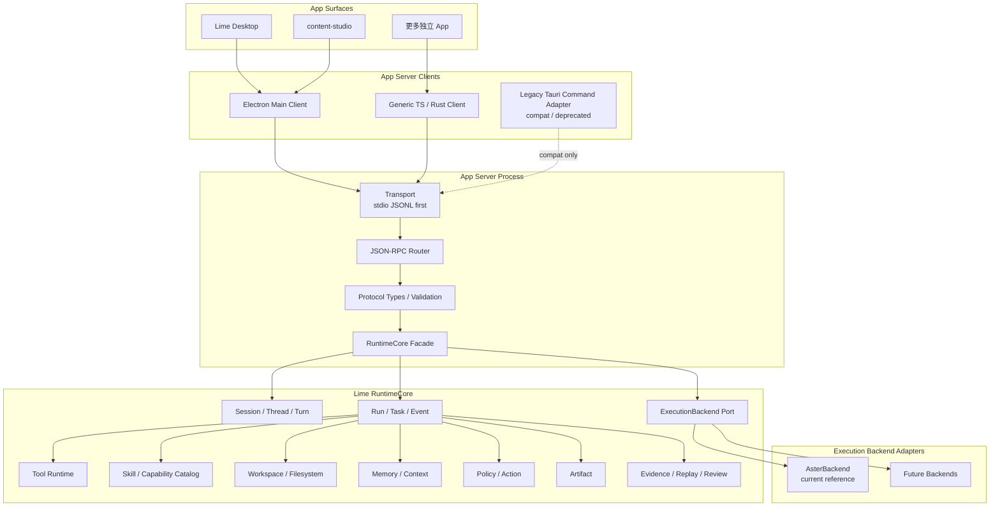
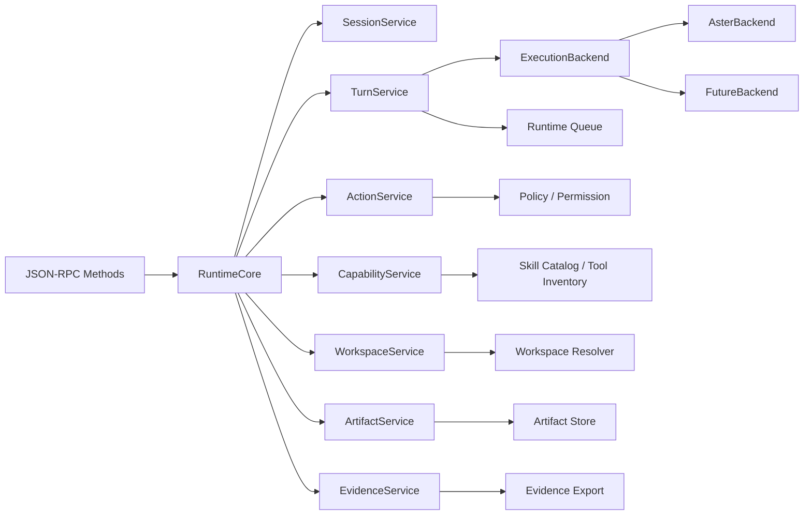

# App Server 架构蓝图

> 状态：current planning source
> 更新时间：2026-06-04
> 作用：定义 App Server 的分层、进程边界、服务抽象、事实源和替换路线。

## 1. 架构目标

1. App Server 成为跨 App 的 Agent runtime 服务边界。
2. RuntimeCore 成为公共事实源，壳层只做 client / adapter。
3. Aster 只是第一个 ExecutionBackend，不再等同于公共 runtime。
4. legacy Tauri command adapter 逐步退回 thin adapter，不继续拥有业务执行逻辑。
5. 独立 App 通过 JSON-RPC client 复用 Agent 能力。
6. Tool / action / artifact / evidence / workspace / skill capability 不在 App 侧复制。

## 2. 总体架构图



## 2.1 公共抽象分层

公共部分必须按三层拆开：

| 层 | 名称 | 负责 | 不负责 |
| --- | --- | --- | --- |
| 协议层 | `app-server-protocol` | JSON-RPC DTO、稳定 wire schema、错误码、事件 envelope | Aster 内部类型、legacy Tauri DTO |
| 服务核心 | `RuntimeCore` | session/thread/turn/task/run/action/event/artifact/evidence 的事实源和调度合同 | 具体模型循环实现、GUI 事件名 |
| 后端适配 | `ExecutionBackend` | 把 core 的 turn/run 请求交给 Aster 或未来后端执行，并回传标准事件 | 定义公共协议、管理 App 生命周期 |

判断规则：

1. 多个 App 都要用的，进入 `RuntimeCore`。
2. 只有某个执行引擎知道的，进入 `ExecutionBackend`。
3. 只有某个壳层知道的，进入 `HostAdapter`。
4. 只有 wire 需要知道的，进入 `app-server-protocol`。

## 3. 分层职责

| 层 | 职责 | 不负责 |
| --- | --- | --- |
| App Surface | 业务 UI、业务对象、用户交互、本地化展示 | Agent 执行事实、工具调度、证据结论 |
| App Server Client | 启动/连接 server、发送 JSON-RPC、订阅事件、重连 | 解析 runtime 内部状态、直接操作数据库 |
| Transport | stdio JSONL、本地 socket、连接生命周期 | 业务语义 |
| JSON-RPC Router | 初始化门禁、方法分发、错误封装、notification | 执行 runtime |
| Protocol | DTO、schema、版本、capability flags | 壳层 UI 模型 |
| RuntimeCore Facade | session、turn、action、capability、artifact、evidence 的统一服务门面 | 具体桌面壳实现、具体后端私有循环 |
| ExecutionBackend | Aster / 未来后端的执行适配 | 公共 facts、App 生命周期 |
| Runtime Services | Tool、Skill、Workspace、Memory、Policy、Artifact、Evidence | App UI 投影 |

## 4. 事实流

```text
App request
  -> JSON-RPC request
  -> RuntimeCore
  -> ExecutionBackend
  -> Runtime services / standard events
  -> Runtime events / snapshots
  -> JSON-RPC notification / response
  -> App projection
```

禁止方向：

1. App UI state 反向成为 runtime truth。
2. 独立 App 直接 import Lime 内部 runtime 模块。
3. legacy Tauri command adapter 和 App Server 各自实现一套 turn execution。
4. Aster 私有 DTO 穿透到 App Server 协议。
5. Artifact / Evidence 在 App 侧重新判定完成状态。

## 5. 进程模型

### 5.1 P1：stdio sidecar

```text
App process
  -> spawn app-server --stdio --backend mock
  -> stdin/stdout JSONL
  -> stderr structured logs
```

选择 stdio 的原因：

1. Electron / legacy Tauri adapter / CLI 都容易启动。
2. 不需要端口管理。
3. 适合本地 sidecar。
4. 容易做 fixture 和 contract test。

当前实现约束：

1. standalone `app-server` binary 只支持 `mock` backend，用于协议、client、packaging 和独立 App 消费链验证。
2. 真实 Aster backend 仍依赖 host state，只能由 Lime Desktop in-process adapter 注入 `AsterBackendHost`，不能通过 standalone CLI 直接开启。
3. `AppServerRuntimeFactory` 是 runtime 组装事实源；不要在 `main.rs`、JSON-RPC router 或 protocol DTO 中直接拼 backend 细节。
4. `--backend aster` 必须失败，直到 Aster host 脱离 legacy Tauri state 并具备独立进程启动条件。

### 5.2 P2：本地控制 socket

```text
App process
  -> connect local socket
  -> one JSON-RPC message per frame
```

适用场景：

1. 多个 App 共享一个本地 server。
2. 需要 server 生命周期独立于单个 App。
3. 需要后台 automation 或 remote ingress。

### 5.3 P3：受控多客户端

多个 client 连接同一 server 时，必须按 `clientId / appId / sessionId` 隔离事件订阅和权限范围。

## 6. 服务抽象图



## 7. legacy Tauri adapter 替换边界

服务化不是一次性替换 Lime Desktop，而是把 runtime owner 从 legacy Tauri command glue 下沉到 service。Electron Desktop Host 是 GUI current，legacy Tauri adapter 只保留兼容委托语境。

```text
legacy compat:
  legacy Tauri command adapter -> Aster runtime glue -> runtime service fragments

target:
  Electron Desktop Host -> App Server client or RuntimeCore facade
  legacy Tauri command adapter -> App Server client or RuntimeCore facade
  App Server -> RuntimeCore facade
  RuntimeCore facade -> ExecutionBackend -> Aster / future backend
```

迁移原则：

1. 先抽 service，后改 legacy adapter。
2. legacy command 保留原命令名和兼容合同，内部只委托。
3. App Server 与 legacy adapter 共享 RuntimeCore，不共享壳层对象。
4. Aster 逻辑先收进 `AsterBackend`，不要上浮成公共协议。
5. 新能力只加到 core / backend / protocol，不再加到 legacy command glue。
6. backend mode 由 runtime factory 声明；standalone binary 默认 `mock`，legacy Tauri adapter 如保留只负责注入 `AsterBackendHost`。

## 8. 独立 App 集成边界

独立 App 必须遵守：

1. App 只持有 `appId`、业务对象、UI state 和本地 projection。
2. Agent session 由 App Server 创建和恢复。
3. 工具、文件、网络、workspace 权限由 runtime policy 决定。
4. Artifact 和 Evidence 由 runtime 写入，App 只展示或引用。
5. App 可以提供 business object refs，但不能伪造 runtime completion。

## 9. Capability 边界

`capability/list` 是独立 App 的能力发现入口。

Capability 只表达：

1. 能力 id。
2. 输入 schema。
3. 输出 schema。
4. 权限需求。
5. 可用状态。
6. 所属 runtime provider。

Capability 不暴露：

1. Rust 模块路径。
2. legacy Tauri command 名。
3. 内部 prompt 拼装细节。
4. 私有文件路径。

## 10. 数据边界

| 数据 | Owner | App 可见性 |
| --- | --- | --- |
| session / thread / turn | Runtime service | 可读 read model |
| tool call | Tool runtime | 可读事件和结果摘要 |
| action / approval | Policy service | 可响应指定 action |
| artifact | Artifact service | 可读 refs / preview |
| evidence | Evidence service | 可读 summary / export refs |
| workspace files | Workspace service | 受权限控制 |
| App business object | App | runtime 只保存 ref 和必要 snapshot |

## 10.1 后端无关事件合同

`ExecutionBackend` 必须把私有执行事件转换为公共事件：

| 公共事件 | Aster 来源示例 | 后续后端要求 |
| --- | --- | --- |
| `turn.started` | runtime turn start | 必须支持 |
| `message.delta` | assistant stream delta | 可流式或批量模拟 |
| `tool.started` | tool runtime start | 有工具能力时必须支持 |
| `tool.result` / `tool.failed` | tool runtime end | 有工具能力时必须支持 |
| `action.required` | permission / input request | 需要人工介入时必须支持 |
| `artifact.changed` | artifact materialization | 有 artifact 时必须支持 |
| `turn.completed` / `turn.failed` | terminal result | 必须支持 |

事件投递只有一个公共协议面：`agentSession/event`。

1. 同步 request 内产生的 events，随 response 后追加 notification。
2. 外部 Query Loop / host listener 产生的异步 events，必须先进入 `RuntimeCore::append_external_runtime_events(...)`，再由 App Server outbound channel 写出 notification。
3. In-process legacy Tauri adapter 只能持有 `AppServerEventBridge` 这类轻量追加出口，不能持有完整 `AppServer`，避免 backend host 与 server 形成强引用环。
4. legacy Tauri event、JSON-RPC notification 和测试 sink 都必须从同一公共 `RuntimeEvent` 派生，不能各自重新解释 Aster 私有事件。

## 11. 架构验收

1. App Server 和 legacy Tauri adapter 可同时调用同一 service。
2. App Server 不依赖 legacy Tauri `AppHandle`、`Emitter`、`State`。
3. 独立 App 不需要链接 Lime Rust crate。
4. JSON-RPC fixture 能覆盖主请求和事件。
5. Tool / action / artifact / evidence 事件能从同一 runtime facts 派生。
