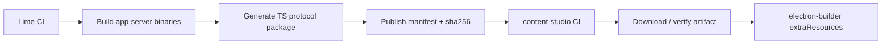

# 独立 App 消费 App Server 方案

> 状态：current planning source
> 更新时间：2026-06-04
> 作用：回答 content-studio 和未来独立 App 如何使用 App Server，避免源码同步、重复 runtime 和依赖边界失控。

## 1. 结论

独立 App 不应该直接同步或嵌入 Lime 源码。

推荐形态：

```text
Lime repo
  owns RuntimeCore / ExecutionBackend / app-server* crates
  builds app-server sidecar binary
  publishes protocol schema + TypeScript client
  publishes release manifest with version / platform / sha256

content-studio / other apps
  depend on app-server-client
  bundle app-server as sidecar binary
  Electron main owns sidecar lifecycle
  renderer only consumes preload IPC projection
```

## 2. 为什么不是源码同步

| 方案 | 判断 | 原因 |
| --- | --- | --- |
| 直接 copy Lime Rust 代码到独立 App | `dead` | 无法治理版本、修复、安全和 runtime facts，会快速分叉。 |
| Git submodule 引入 Lime 源码 | `deprecated for app consumption` | 适合 pin 外部源码，不适合高频演进 runtime SDK；App 会被迫理解 Lime 内部 workspace。 |
| Git subtree / vendor | `dead` | 更像低频 vendoring，会制造双向同步成本。 |
| 独立 App 直接依赖 Lime Rust crate | `not recommended` | Electron App 不应链接内部 Rust workspace；跨平台构建和发布成本过高。 |
| 版本化 TS client + sidecar binary | `current` | App 只依赖稳定协议和可校验二进制；RuntimeCore 仍由 Lime 维护。 |

执行规则：

1. Lime 内部使用 Cargo workspace 管理 `app-server*` Rust crate，保持单一 `Cargo.lock` 和统一构建产物目录。
2. 独立 App 只消费 npm client、protocol schema、sidecar binary 和 release manifest。
3. Git submodule / subtree 只允许作为临时审阅或迁移工具，不允许成为 content-studio 的 runtime 依赖主路径。
4. content-studio 本地开发可以通过 `APP_SERVER_BIN` 指向 Lime debug binary，但生产包必须 pin 到 manifest 版本和 sha256。
5. 独立 App 不应该把 Lime Rust workspace 拉进自己的构建图；否则依赖、锁文件、平台产物和安全修复都会分叉。

## 3. 分发单元

Lime 应只向独立 App 暴露三个稳定产物。

### 3.1 TypeScript client

建议包名：

```text
app-server-client
```

内容：

1. JSON-RPC client。
2. protocol types。
3. sidecar launch helper。
4. release manifest artifact selector。
5. error code constants。
6. version / capability handshake。

当前实现：

1. `packages/app-server-client` 已提供 `app-server-client` workspace package。
2. 已覆盖 initialize / initialized、`agentSession/start/read/turn/start/turn/cancel` request builder。
3. 已覆盖 JSONL encode / decode、stdio sidecar args、platform artifact selector、protocol manifest guard 和 sidecar 文件 sha256 校验 helper。
4. 已提供 `spawnAppServerSidecar(...)` 和 `connectAppServerSidecar(...)`，可完成 stdio sidecar spawn、JSONL 收发、`initialize -> initialized` 握手和 protocol guard。
5. 已提供 `resolveSidecarBinaryPath(...)`，统一 `APP_SERVER_BIN -> packaged resources -> dev fallback` 的 binary path 优先级。
6. 已提供 `resolveSidecarFromReleaseManifest(...)`，可从 manifest + resources path 生成带 sha256 的 stdio sidecar config。
7. 已提供 `npm run app-server:manifest`，可从本地 sidecar binary 生成 release manifest。
8. 已提供 `AppServerConnection`，封装 `startSession / readSession / startTurn / cancelTurn`、request/response 等待、同批 notification 收集和异步 notification 读取。
9. `agentSession/turn/start` 已支持 `queueIfBusy` 与 `skipPreSubmitResume`，独立 App 不需要回退到旧 `agent_runtime_*` 命令来表达排队策略。
10. `agentSession/turn/start` 已支持 caller-supplied `turnId`，Rust protocol、TS client 和 Desktop adapter 均通过同一字段保持 turn id 稳定。
11. 当前 standalone `app-server` binary 仅支持 `mock` backend；它只能验证协议、client、打包和 sidecar lifecycle，不能完成真实 Agent turn。
12. content-studio 生产集成不得依赖 Lime Desktop in-process Tauri adapter；真实 runtime 必须等待 host-agnostic backend sidecar mode。
13. `APP_SERVER_BIN` 只允许本地开发覆盖；生产必须从 manifest 选择 artifact、校验 sha256，并从 packaged resources 启动。`resolveSidecarFromReleaseManifest(...)` 生产调用应传 `allowEnvOverride: false`。
14. P4 完成前，content-studio 只能把该路径视为 integration skeleton；完成标准是真实 sidecar Agent flow、事件投影、cancel/shutdown、stderr 日志、crash/backoff 均跑通。
15. 尚未实现 release artifact 下载、schema 自动生成、重启 backoff 或生产级日志路由。
16. 已补轻量 Rust protocol / TS client drift guard：`node scripts/check-app-server-client-contract.mjs` 会锁定 turn id、queue flags、runtime options 和 host options 字段；后续仍需 schema 自动生成替代手写维护。

不包含：

1. Rust 源码。
2. Aster 私有类型。
3. Lime Desktop Tauri command。
4. App 业务 UI。

### 3.2 Sidecar binary

建议 binary：

```text
app-server
app-server.exe
```

分发维度：

1. `darwin-arm64`
2. `darwin-x64`
3. `win32-x64`
4. `linux-x64`

每个 binary 必须有：

1. version。
2. protocol version。
3. sha256。
4. platform。
5. build provenance。

### 3.3 Release manifest

建议 manifest：

```json
{
  "version": "1.58.0",
  "protocolVersion": "appserver.v0",
  "artifacts": [
    {
      "platform": "darwin-arm64",
      "url": "https://example/app-server-darwin-arm64.tar.gz",
      "sha256": "..."
    }
  ]
}
```

独立 App CI / packaging 只消费 manifest，不猜 binary 路径。

## 4. content-studio 集成形态

content-studio 当前是 Electron + electron-builder。推荐接入点：

```text
content-studio
  src/main/services/appServerClient.ts
  src/main/services/appServerSidecar.ts
  src/main/ipc.ts
  src/preload/index.ts
  src/renderer/src/components/agent/*
```

2026-06-05 只读审阅 content-studio 仓库后的具体接入点：

1. `package.json`：新增 `app-server-client` npm 依赖，不拉 Lime Rust workspace。
2. `electron-builder.yml`：通过 `extraResources` 打包 `app-server.release.json` 与 `app-server/<platform>/app-server(.exe)`；可执行文件不能放进 asar。
3. `src/main/services/appServerSidecarService.ts`：封装 `startPackagedAppServerSidecar`、restart policy、stderr logging、`AppServerAgentEventRouter` 和 `stop()`。
4. `src/main/ipc.ts`：集中注册 `appServer:*` IPC，例如 status、capability list、start session、start turn、cancel turn。
5. `src/preload/index.ts`：只暴露 preload bridge；renderer 不直接 import `app-server-client`。
6. `src/shared/types.ts`：放 content-studio 自有薄 DTO，避免 renderer 依赖 Lime 内部类型。
7. renderer Agent 投影可先接 `src/renderer/src/components/agent/agentRuntimeProjection.ts`、`AgentSessionPanel.tsx`、`useContentStudioApp.ts` 和 `devContentStudioBridge.ts`。

运行时路径：

```text
Renderer
  -> preload IPC
  -> Electron main
  -> AppServerClient
  -> app-server sidecar --stdio
  -> RuntimeCore
  -> ExecutionBackend
```

renderer 禁止：

1. 直接 spawn sidecar。
2. 直接读写 App Server stdout。
3. 直接持有 runtime facts。

Electron main 负责：

1. resolve binary path。
2. spawn sidecar。
3. initialize / initialized。
4. session / turn / action RPC。
5. notification fanout。
6. crash / restart / backoff。
7. stderr log routing。

最小消费示例：

```ts
const { connection, sidecar } = await connectAppServerSidecar(resolved.config, {
  clientInfo: {
    name: "content_studio",
    version: app.getVersion(),
  },
  capabilities: {
    eventMethods: ["agentSession/event"],
  },
});

const session = await connection.startSession({
  appId: "content-studio",
  workspaceId,
  businessObjectRef: {
    kind: "document",
    id: documentId,
    title: documentTitle,
  },
});

const turn = await connection.startTurn({
  sessionId: session.result.session.sessionId,
  input: {
    text: "生成草稿",
  },
  runtimeOptions: {
    capabilityId: "draft.write",
    stream: true,
  },
  queueIfBusy: true,
});

const event = await connection.nextNotification();
```

上面这层应放在 Electron main 或 preload 背后的 service 中；renderer 只拿业务投影，例如 `sessionId / turnId / event payload`。

## 5. 打包方式

content-studio 生产包应通过 `electron-builder` 的 `extraResources` 带上 sidecar。

建议路径：

```text
resources/
  app-server/
    darwin-arm64/app-server
    darwin-x64/app-server
    win32-x64/app-server.exe
    linux-x64/app-server
    manifest.json
```

`electron-builder.yml` 后续示意：

```yaml
extraResources:
  - from: resources/app-server
    to: app-server
```

运行时解析顺序：

```text
1. APP_SERVER_BIN env override
2. Electron packaged resources path
3. dev fallback path from repo-local config
```

独立 App 的 Electron main 应复用 `app-server-client::resolveSidecarBinaryPath(...)`，不要在各 App 内重新拼同一套路径优先级。renderer 仍然只消费 preload IPC projection，禁止直接 spawn sidecar。

禁止把 `/Users/...` 这类绝对路径写入 repo。

## 6. 本地开发机制

本地开发不做源码同步，使用可替换产物。

推荐：

```bash
APP_SERVER_BIN=/Users/coso/Documents/dev/ai/aiclientproxy/lime/lime-rs/target/debug/app-server
```

TS client 本地调试可以用：

1. `npm link app-server-client`
2. `file:../lime/packages/app-server-client`
3. workspace overlay

但 production dependency 必须 pin 到版本：

```json
{
  "dependencies": {
    "app-server-client": "0.1.0"
  }
}
```

## 7. CI / Release 同步机制

同步的是 release artifact，不是源码。



content-studio CI 必须：

1. 读取固定 manifest version。
2. 下载对应平台 sidecar。
3. 校验 sha256。
4. 放入 `resources/app-server`。
5. 跑 smoke：spawn -> initialize -> shutdown。

Lime 当前已提供本地 smoke 入口：

```bash
cargo build --manifest-path "lime-rs/Cargo.toml" -p app-server
npm --prefix "packages/app-server-client" test
npm run smoke:app-server-stdio
npm run app-server:manifest:test
npm run app-server:manifest -- --binary "lime-rs/target/debug/app-server" --url "https://example/app-server-darwin-arm64.tar.gz" --platform "darwin-arm64" --out "/tmp/app-server-manifest.json"
```

该 smoke 使用 `app-server-client` 启动 `app-server --stdio`，验证 `initialize -> initialized -> agentSession/start -> agentSession/turn/start -> agentSession/event`。独立 App 后续应复用同一 client 能力，但把 binary path 解析替换为自己的 packaged resources。

## 8. 协议兼容

client 和 server 通过 `initialize` 握手判断兼容：

```json
{
  "clientInfo": {
    "name": "content_studio",
    "version": "0.17.0"
  },
  "capabilities": {
    "requiredProtocol": "appserver.v0",
    "eventMethods": ["agentSession/event"]
  }
}
```

server 返回：

```json
{
  "serverInfo": {
    "name": "app-server",
    "version": "1.58.0",
    "protocolVersion": "appserver.v0"
  }
}
```

兼容规则：

1. patch version 可以自动升级。
2. minor version 必须通过 capability flags。
3. major / protocol mismatch 必须阻止启动。
4. experimental method 必须显式 opt-in。
5. TS client 的 request builder 必须跟 Rust protocol fixture 对齐，至少覆盖 `sessionId / threadId / turnId / runtimeOptions / queueIfBusy / skipPreSubmitResume`。

## 9. 独立库边界

应该独立管理的是 client package，不是 runtime 源码。

| 代码 | 位置 | 分发 |
| --- | --- | --- |
| RuntimeCore | Lime Rust workspace | 不直接给 App import。 |
| ExecutionBackend / AsterBackend | Lime Rust workspace | 不直接给 App import。 |
| app-server-protocol Rust DTO | Lime Rust workspace | 生成 schema / TS types。 |
| `app-server-client` | Lime 发布的 npm package | 独立 App 依赖。 |
| `app-server` binary | Lime release artifact | 独立 App 打包。 |
| App UI projection | 各 App repo | 自己实现。 |

## 10. 何时考虑 monorepo

只有满足以下条件，才考虑把 Lime 和 content-studio 放进同一个更大的 monorepo：

1. 同一个团队同时提交两个产品。
2. CI 能承受跨产品全量检查。
3. release cadence 接近。
4. 包发布、sidecar 构建和 App 打包都由同一 pipeline 管。

当前更推荐多 repo + versioned artifact：

1. Lime 维护 runtime 和 sidecar。
2. content-studio 维护产品 UI 和业务对象。
3. 两者通过 npm package + binary manifest 协作。

## 11. 参考依据

1. Cargo workspace 官方文档：适合在 Lime 内部统一管理 Rust packages。
   https://doc.rust-lang.org/cargo/reference/workspaces.html
2. electron-builder application contents：`extraResources` 适合打包 app 运行期资源和 sidecar。
   https://www.electron.build/docs/contents/
3. Git submodule 官方文档：submodule 是源码嵌入 / pin commit 机制，不应作为高频 runtime SDK 主分发边界。
   https://git-scm.com/docs/git-submodule
4. npm workspaces 官方文档：适合 TS client 本地开发和发布前联调。
   https://docs.npmjs.com/cli/v8/using-npm/workspaces/

## 12. 完成判定

content-studio 集成完成不是“能找到 Lime 源码”，而是：

1. `app-server-client` 被版本化依赖。
2. `app-server` sidecar 被 manifest pin 住并校验 hash。
3. Electron main 能 spawn / initialize / cancel / shutdown。
4. renderer 只消费业务投影。
5. App 不 import Lime Rust crate。
6. App 不复制 RuntimeCore / ExecutionBackend / AsterBackend。
