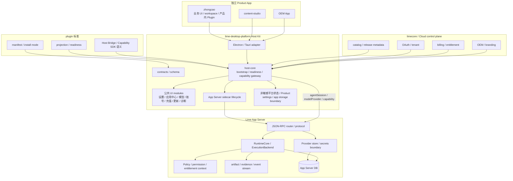
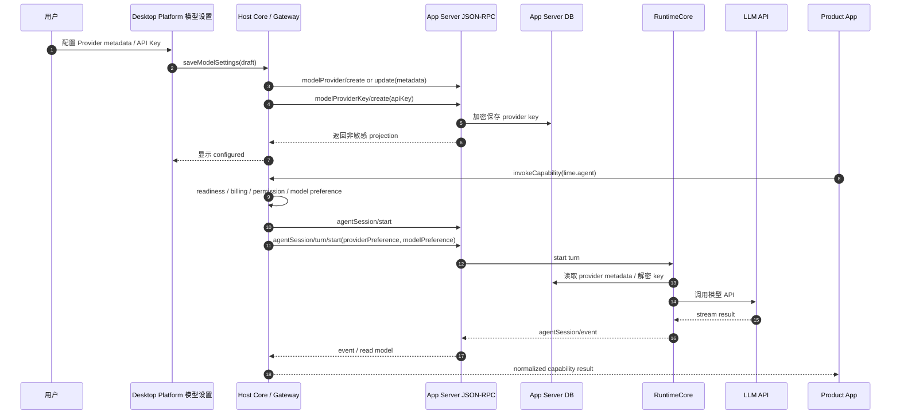
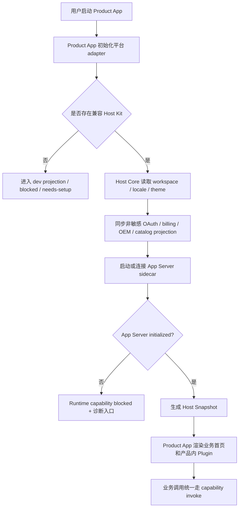
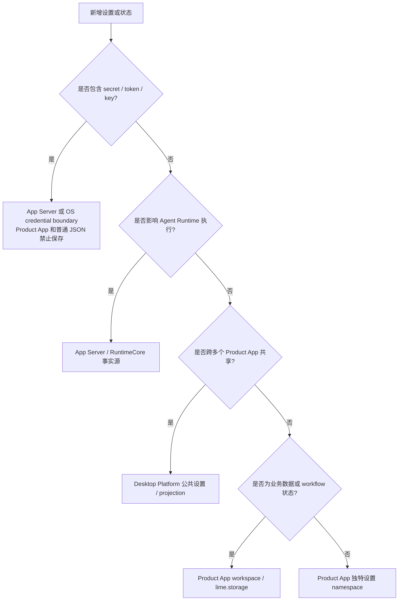

# App Server / Desktop Platform / Product App 边界决策 PRD

## 1. 背景

`lime-desktop-platform` 正在承接 `zhongcao`、`content-studio` 和后续 OEM 桌面 App 的公共桌面能力。与此同时，Lime App Server JSON-RPC 已经成为 Agent Runtime、Provider store、session、turn、tool、artifact 和 evidence 的服务化边界。

这带来一个必须先固定的架构问题：

> `lime-desktop-platform` 是否多余？如果不多余，它和 App Server、Plugin 标准、Product App 的边界是什么？

结论：`lime-desktop-platform` 不多余，但它不能成为第二个 App Server，也不能成为业务 App 宿主大壳。它的正确位置是桌面宿主平台套件：公共设置 UI、应用中心、Host Bridge、Capability Gateway、sidecar lifecycle、Electron / Tauri adapter 和 Product App 接入层。

## 2. 架构决策

### 2.1 选定主线

保留 `lime-desktop-platform`，但把它收敛为 Host Kit / 公共平台 UX。

```text
plugin
  -> 定义应用包、manifest、projection、readiness、Host Bridge / Capability SDK 标准

Lime App Server
  -> 拥有 Agent Runtime、Provider store、runtime DB、session、turn、tool、artifact、evidence

lime-desktop-platform
  -> 拥有桌面宿主体验、公共设置、应用中心、Host Bridge、Capability Gateway、sidecar lifecycle

Product App: zhongcao / content-studio / OEM
  -> 拥有业务页面、业务 workflow、业务 workspace、产品内 Plugin package
```

### 2.2 被拒绝的两条路线

| 路线 | 为什么不选 |
| --- | --- |
| 删除 Desktop Platform，让每个 Product App 直连 App Server | 每个 App 会复制 OAuth、Provider 设置、billing、更新、应用中心、Host Bridge、安全边界，事实源快速分裂。 |
| 把 Product App 重新塞回 Lime Desktop 大壳 | `zhongcao` 不再是真独立 Product App，后续 OEM / standalone 方向被锁死。 |

## 3. 分层架构图



## 4. 职责矩阵

| 层 | current 职责 | 明确不负责 |
| --- | --- | --- |
| `plugin` | 标准、manifest、projection、readiness、Host Bridge 语义 | 具体 DB、token、桌面 UI 实现 |
| Lime App Server | Agent runtime、Provider metadata/key、session/turn、tool、artifact、evidence、runtime DB | Electron/Tauri 壳、设置页、应用中心 UI、业务页面 |
| `lime-desktop-platform` | 公共平台 UX、Host Snapshot、Capability Gateway、sidecar owner、settings orchestration、Product App settings/storage boundary | Agent 执行循环、Provider key 双存、业务 workflow、业务 DB schema |
| Product App | 业务对象、业务 UI、业务 workspace、产品内 Plugin package、业务 artifact 展示 | OAuth、Provider 设置、billing 账本、平台安装表、App Server DB |

## 5. Provider 与 Runtime 时序图



## 6. Product App 启动流程图



## 7. 设置归属判断流程



## 8. App Server 项目需要怎么做

### P0: 固定 App Server 不做桌面 Host

任务：

- App Server 文档、协议和实现继续以 runtime service 为边界。
- 不新增 Electron/Tauri UI、设置页、应用中心页面逻辑。
- `modelProvider*` / `modelProviderKey*`、`agentSession*` 和 runtime DB 继续是 current 主链。

验收：

- 新 Product App 接入时只需要 JSON-RPC client / Host Kit，不需要 import Lime 内部 runtime 模块。

### P1: 支持 Host Kit 显式数据根

任务：

- 支持 `--data-dir` / `APP_SERVER_DATA_DIR`。
- 让 `LocalAppDataSource`、`RuntimeBackend` 和 Provider store 使用同一数据根。
- 空库启动自动创建 schema 和 system providers。

验收：

- `lime-desktop-platform` 使用自己的 `userData/app-server/lime.db`，不污染 Existing Lime 默认 DB。

### P2: 固化 Host-mediated runtime context

任务：

- `agentSession/turn/start` 只接受 provider id、model id、capability context、policy/entitlement context。
- 禁止 runtime payload 传明文 API Key、OAuth token、billing ledger。
- 必要时为 entitlement / readiness 增加非敏感 DTO。

验收：

- Product App 无法通过协议绕过 Host Kit 直接提交 secret。

### P3: 守卫

任务：

- 协议 fixture 覆盖 providerPreference/modelPreference。
- 测试 JSON-RPC payload 中不出现 `apiKey` / `token` / `secret`。
- App Server client contract 覆盖 Product App -> Host Kit -> App Server 的最小闭环。

验收：

- `npm run test:contracts` 或 App Server protocol fixture 能阻断旧路回流。

## 9. 治理分类

- `current`：App Server JSON-RPC、RuntimeCore、ExecutionBackend、Provider store、App Server DB。
- `current`：Desktop Platform 作为 Host Kit / 公共平台 UX / sidecar owner。
- `current`：Product App 通过 Host Bridge / Capability SDK 调用 `lime.agent`。
- `compat`：legacy desktop facade 只能委托 current 主链。
- `deprecated`：Desktop Host 持久化模型 key、Product App dev projection 伪装成生产 runtime。
- `dead`：Pi agent / Claude SDK 后端路线、Product App 自建完整 runtime、App Server 承接桌面 UI。

## 10. 与现有 PRD 的关系

- Provider/key/data root 细节见 [provider-store-data-root-prd.md](./provider-store-data-root-prd.md)。
- App Server 服务化总路线见 [prd.md](./prd.md) 和 [architecture.md](./architecture.md)。
- 本文是跨项目边界决策，不替代具体实现计划。
