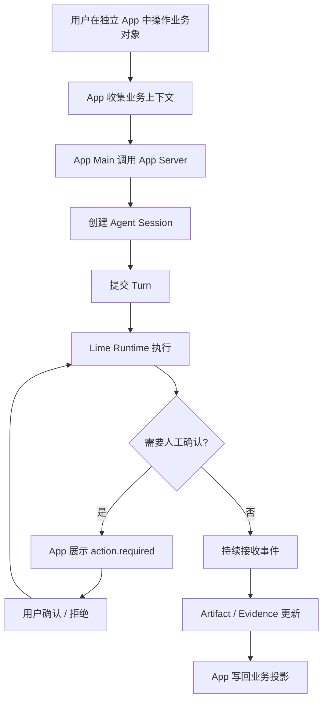
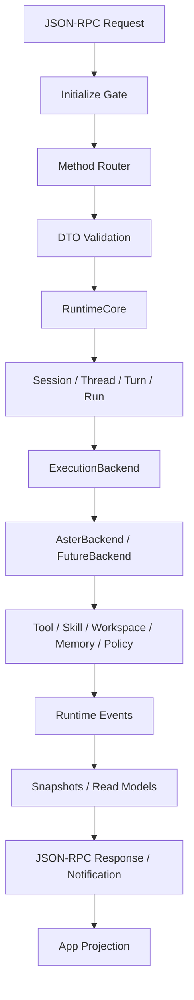
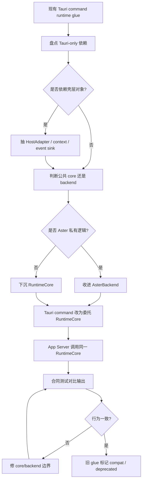
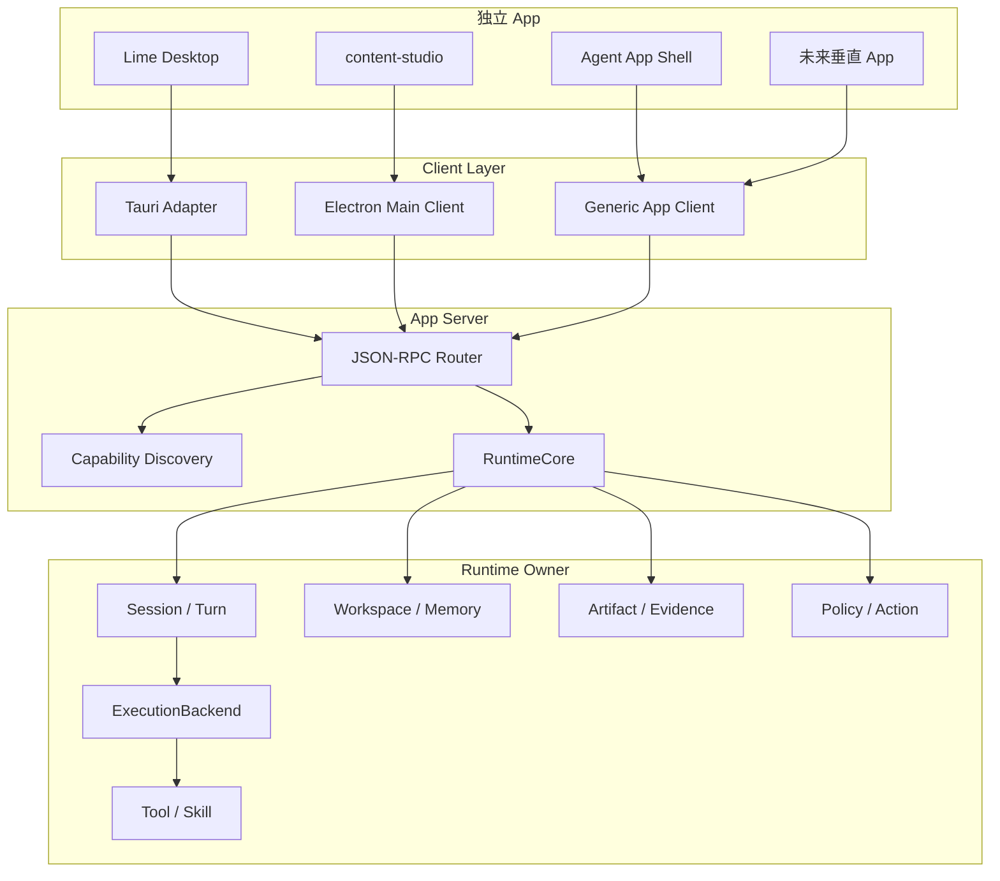
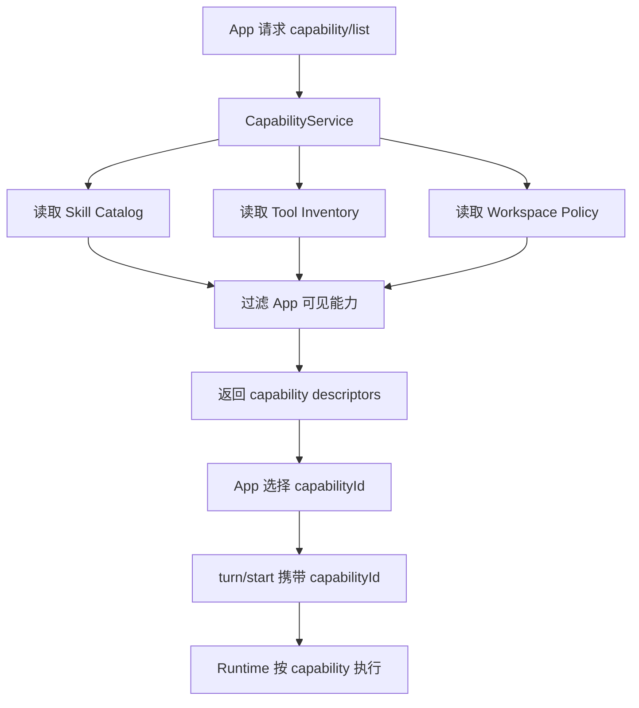
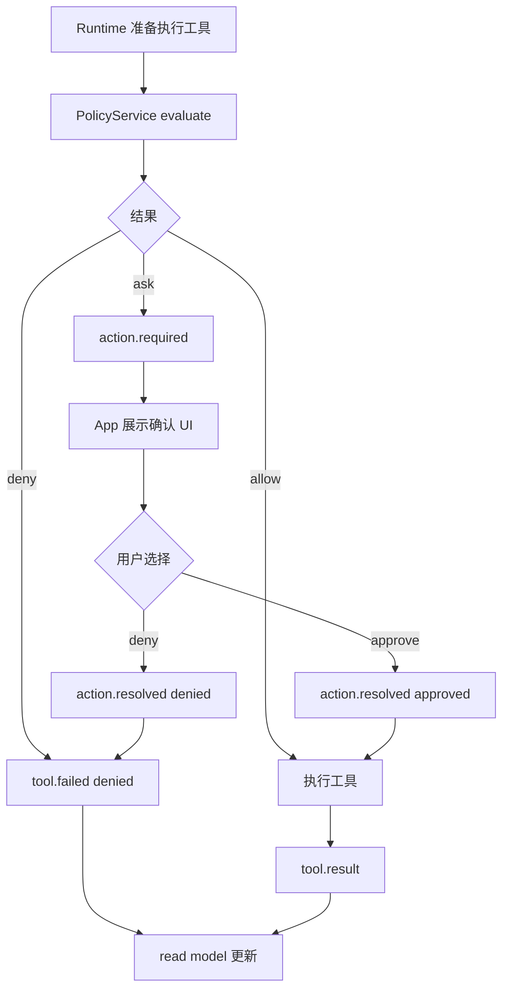
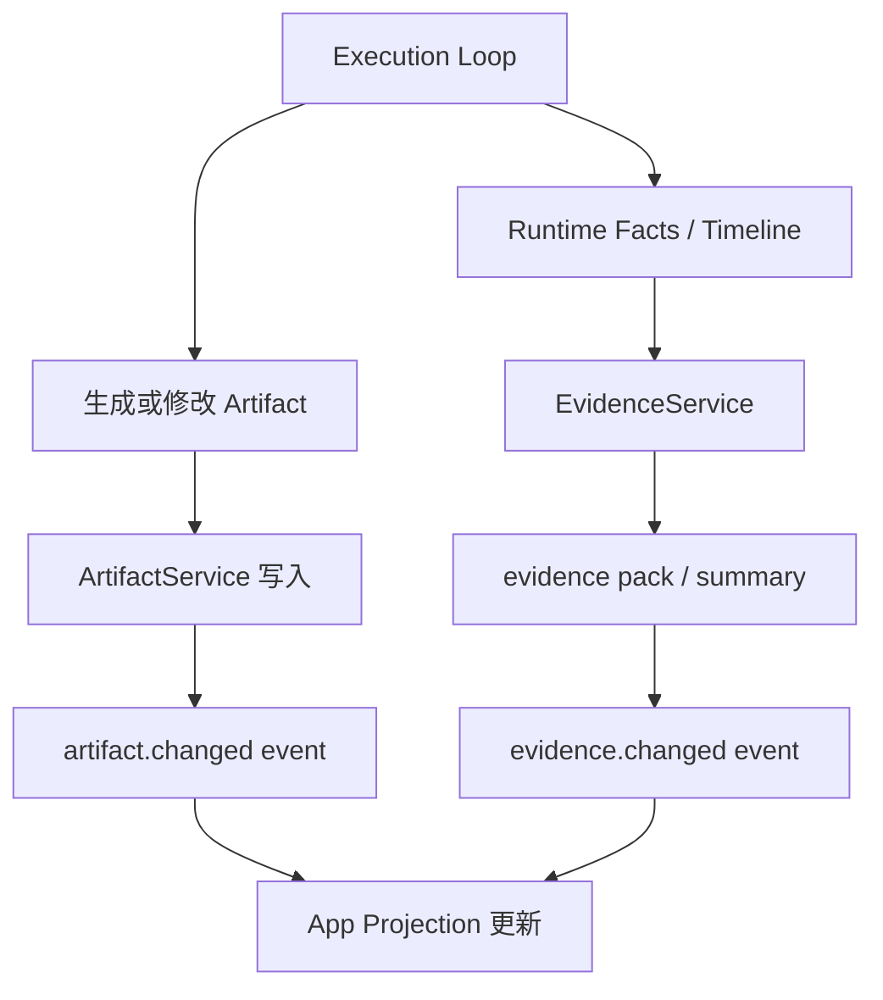
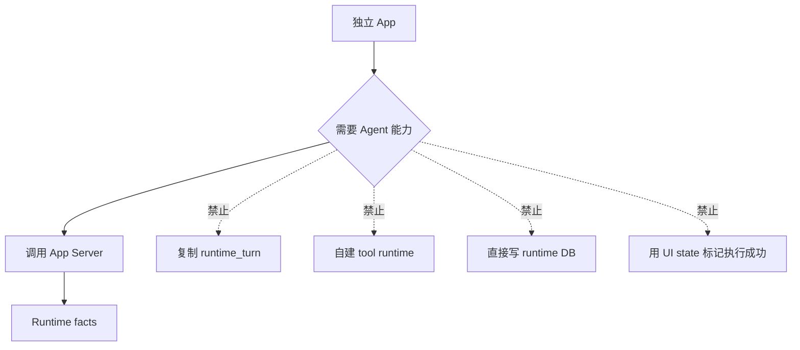

# App Server 流程图

> 状态：current planning source
> 更新时间：2026-06-04
> 作用：用流程图固定 App Server 的用户路径、技术主链、服务抽取、渐进替换和多 App 复用。

## 1. 用户路径：独立 App 内完成 Agent 任务

## 2. 技术主链：Request 到 Runtime Facts

## 3. 服务抽取流程

## 4. 渐进式替换流程

```mermaid
flowchart LR
    P0["P0 公共边界冻结"] --> P1["P1 app-server crate 家族"]
    P1 --> P2["P2 RuntimeCore / ExecutionBackend"]
    P2 --> P3["P3 AsterBackend"]
    P3 --> P4["P4 App Server 接入 core"]
    P4 --> P5["P5 Desktop thin adapter"]
    P5 --> P6["P6 content-studio client"]
    P6 --> P7["P7 tool/action/artifact/evidence"]
    P7 --> P8["P8 多 App capability discovery"]
    P8 --> P9["P9 compat glue 退场审计"]
```

## 5. 多 App 复用图

## 6. Capability 调用流程

## 7. Action / Permission 流程

## 8. Artifact / Evidence 写回流程

## 9. 禁止路径

