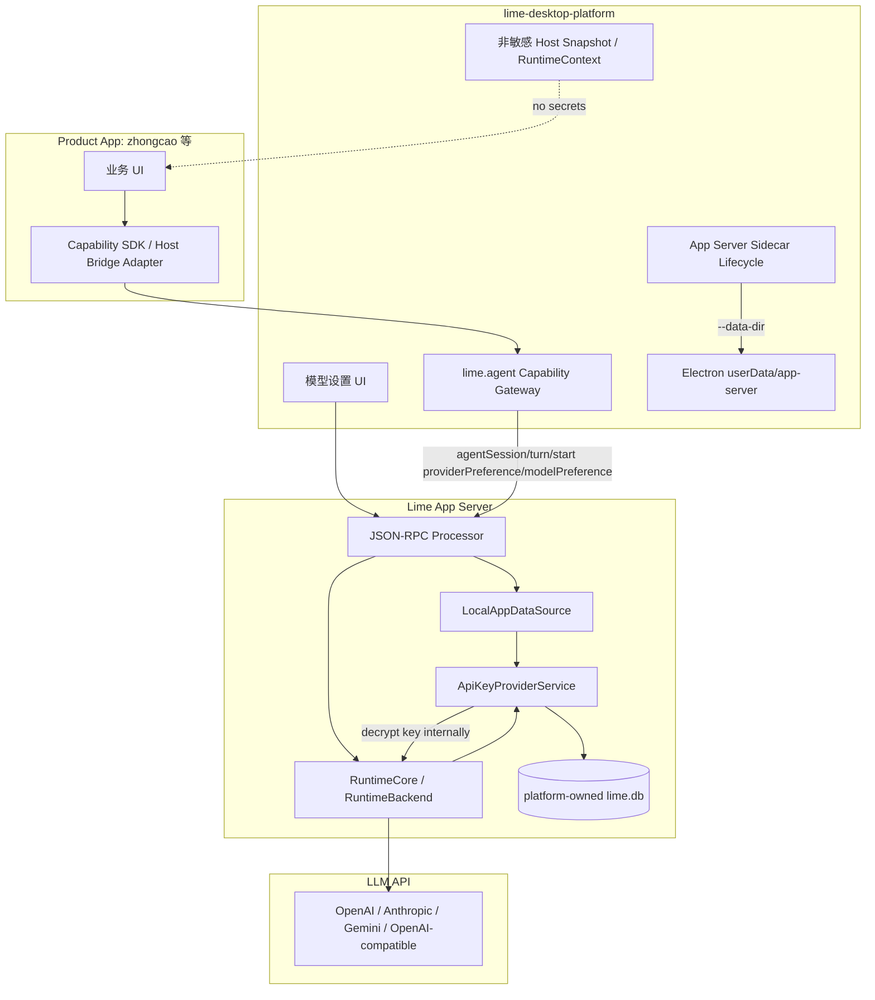
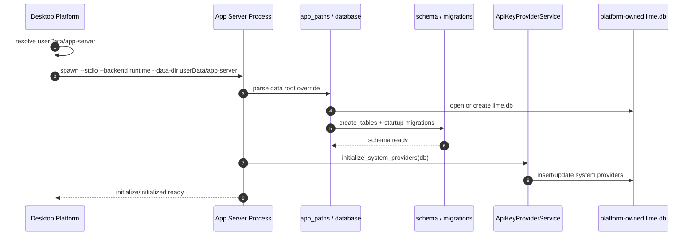
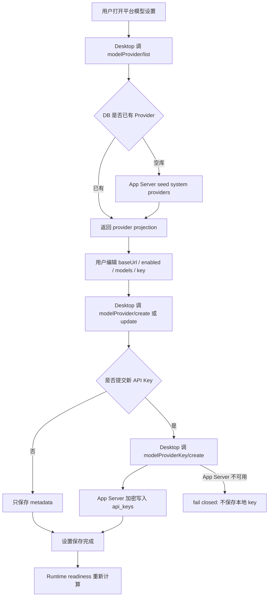
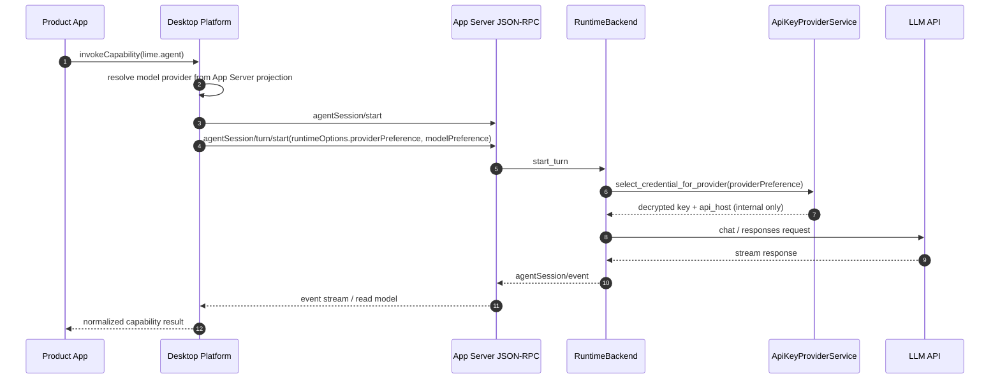

# App Server Provider Store 与数据根架构升级 PRD

## 1. 背景

`lime-desktop-platform` 正在成为 `zhongcao` 等独立 Product App 的应用中心、设置中心和桌面宿主底座。模型 Provider 设置、API Key 和运行时模型选择不能继续在 Desktop Host、Product App 和 App Server 之间形成多份事实源。

当前 App Server 已具备 Provider 主链：

- Provider metadata：`modelProvider/list/read/create/update/delete`
- API Key：`modelProviderKey/create/update/delete/next`
- Runtime 选择：`agentSession/turn/start.params.runtimeOptions.providerPreference` / `modelPreference`
- Runtime 取 key：`RuntimeBackend -> AsterAgentState -> CredentialBridge -> ApiKeyProviderService -> api_key_providers / api_keys`

但现状仍有两个架构风险：

1. `lime-desktop-platform` 的 `CredentialBroker` 曾作为模型 key 的本地存储，并同步一份 key 到 App Server，形成双写。当前目标是新 key 只以短程输入进入 App Server provider store；旧 broker key 只允许一次性迁移，迁移成功后删除本地旧凭证文件。
2. App Server 默认数据根仍指向现有 Lime 用户数据目录；新平台 App 若直接启动 sidecar，可能污染现有 Lime 的 `lime.db`。

本 PRD 定义 App Server 侧目标架构和实施计划：App Server provider store 成为唯一模型凭证事实源，同时支持宿主显式指定数据根，让新 App 首次启动时可自动初始化独立 DB，不影响现有 Lime。

## 2. 目标

### 2.1 产品目标

- 新 App（例如 `zhongcao`）首次运行时不需要预置 `lime.db`。
- Desktop Platform 启动 App Server sidecar 时可指定平台专属数据根，App Server 在该数据根自动创建 DB、schema、基础 seed。
- Provider metadata 和模型 API Key 只在 App Server provider store 持久化一次。
- Product App 不知道 key 存在哪里，也不能读取 key。
- 现有 Lime 默认数据路径和已有用户数据不被新平台 App 影响。

### 2.2 工程目标

- App Server 支持 `--data-dir` 和环境变量 `APP_SERVER_DATA_DIR`。CLI 参数优先级高于 env；两者都没有时保持现有 Lime 默认路径。
- `database::init_database()` 支持显式 data root，或通过进程级 app paths override 解析 DB 路径。
- 空库初始化必须创建 `api_key_providers`、`api_keys`、`model_registry`、`agent_sessions` 等当前 schema，并运行启动迁移。
- `LocalAppDataSource::initialize()` 启动期显式初始化 system providers，避免依赖 `modelProvider/list` 懒触发。
- `RuntimeBackend` 和 `LocalAppDataSource` 使用同一 DB root，不能一个走默认路径、一个走宿主路径。
- 生产 runtime 不接受 Desktop Host 明文 key payload；`modelProviderKey/create` 只属于设置控制面。

## 3. 非目标

- 不把 App Server DB 改成每个业务 App 一份。
- 不让 `zhongcao` 或其他 Product App 直接初始化、读取或迁移 App Server DB。
- 不把 Electron `userData` 路径硬编码进 Rust。
- 不在 App Server 中读取 `lime-desktop-platform` 的 `model-settings.json` 或旧 `CredentialBroker` 文件。
- 不恢复 Pi agent / Claude SDK 作为运行时后端。

## 4. 目标架构

### 4.1 事实源声明

后续 Provider metadata、API Key、Provider UI state、Provider runtime selection 的 current 事实源是 App Server JSON-RPC + App Server DB。Desktop Platform 只是设置 UI、sidecar owner、非敏感 projection 和 capability gateway；Product App 只是业务调用方。

### 4.2 数据所有权

| 数据 | 事实源 | 访问方 | 备注 |
| --- | --- | --- | --- |
| Provider metadata | App Server DB `api_key_providers` | App Server JSON-RPC | 包含 type/name/api_host/enabled/custom_models |
| Provider API Key | App Server DB `api_keys` | App Server 内部服务 | 加密持久化；runtime 内部解密使用 |
| 默认 provider/model 偏好 | App Server 或 Desktop 非敏感偏好投影 | Desktop Platform / App Server | 不包含 key |
| Runtime provider/model handoff | `runtimeOptions.providerPreference/modelPreference` | Desktop Platform -> App Server | 只传 id |
| Product App 业务设置 | Product App / Desktop Platform app settings | Product App | 禁止 token/key |
| Existing Lime user data | Existing Lime 默认数据根 | Existing Lime | 不被新平台 sidecar 默认写入 |

### 4.3 架构图

## 5. 初始化策略

### 5.1 新 App 首次启动

新 App 没有 `lime.db` 是正常状态。初始化责任在 Desktop Platform 启动的 App Server sidecar：

1. Desktop Platform 计算平台专属数据根：`app.getPath('userData')/app-server`。
2. Desktop Platform 启动 App Server：`app-server --stdio --backend runtime --data-dir <platform-app-server-data-dir>`。
3. App Server 解析 `--data-dir`，将 DB 路径解析为 `<data-dir>/lime.db`。
4. `database::init_database_with_root(...)` 打开或创建 DB。
5. `schema::create_tables(...)` 创建全部表。
6. 启动迁移运行。
7. `LocalAppDataSource::initialize()` 显式调用 `ApiKeyProviderService::initialize_system_providers(...)`。
8. `modelProvider/list` 返回系统 Provider 和用户已配置 Provider。
9. 用户在平台模型设置中填 API Key 后，Desktop Platform 调 `modelProviderKey/create`，key 只进入 App Server DB。
10. 如果 App Server provider store 不可用，Desktop Platform 必须拒绝保存包含新 API Key 的设置，不能把 key 写入 Desktop CredentialBroker 或普通 JSON 等待稍后同步。

### 5.2 初始化时序图

## 6. Provider 设置流程

## 7. Runtime 调用流程

## 8. 迁移与兼容

### 8.1 现有 Lime

- 未传 `--data-dir` / `APP_SERVER_DATA_DIR` 时，继续使用现有 `app_paths::resolve_database_path()`。
- Existing Lime 的 `lime.db`、迁移、legacy database recovery 不改变。
- App Server CLI 新参数必须是 additive，不改变默认行为。

### 8.2 Desktop Platform

- Desktop Platform 必须传显式 data root，避免写入 Existing Lime 默认 DB。
- 旧 Desktop `CredentialBroker` 只能作为一次性迁移 source，不再作为新 key 写入 source。
- 迁移成功后 Desktop 删除旧 broker key 文件，普通设置只保留非敏感 projection 和 App Server sync record。
- 保存请求包含新 API Key 但 App Server `modelProviderKey/create` 失败时，Desktop 必须 fail closed；不能先保存本地 key 再标记 pending sync。

### 8.3 Product App

- Product App 不迁移 DB。
- Product App 不读写 Provider/key。
- Product App 的运行态只依赖 capability result、readiness、Host Snapshot projection。

## 9. 开发计划

### P0: 数据根 override 设计

任务：

- 在 App Server CLI 增加 `--data-dir`。
- 增加 `APP_SERVER_DATA_DIR` env fallback。
- 在 `app_paths` / `database` 中提供显式 data root 解析入口。
- 明确 CLI 参数优先级：`--data-dir` > `APP_SERVER_DATA_DIR` > existing Lime default。

验收：

- 未传参数时现有 Lime 默认路径不变。
- 传入临时 data dir 时创建 `<data-dir>/lime.db`。

### P1: 单进程 DB root 贯通

任务：

- `LocalAppDataSource`、`RuntimeBackend`、knowledge builder runtime 等 App Server current 入口使用同一 DB root。
- 避免 `LocalAppDataSource` 用 override、`RuntimeBackend` 又调用默认 `init_database()`。

验收：

- 同一 sidecar 内 `modelProviderKey/create` 写入的 key，后续 `agentSession/turn/start` 能从同一 DB 取到。

### P2: 启动期 seed

任务：

- 在 `LocalAppDataSource::initialize()` 显式调用 `initialize_system_providers()`。
- 保留 `get_all_providers()` 的懒初始化作为兼容补强。

验收：

- 空 DB 启动后 `modelProvider/list` 返回系统 Provider。
- `modelProvider/catalog/list` 与 provider store 行为一致。

### P3: Provider/key 单事实源收口

任务：

- 保持 `modelProviderKey/create` 是设置控制面。
- 确保 `agentSession/turn/start` 不接受明文 key。
- 增加测试覆盖 runtime 从 provider store 按 provider id 取 key。
- Desktop Platform 侧保存新 API Key 时必须先成功写入 `modelProviderKey/create`，再持久化本地非敏感 projection；失败则整个保存失败。
- Desktop Platform 侧旧 CredentialBroker key 迁移成功后必须删除旧 broker key 文件，避免双存。

验收：

- runtime payload 中没有 `apiKey` / token / secret。
- key 只存在 App Server DB 加密字段。
- Desktop 普通 JSON / CredentialBroker 不产生或保留成功迁移后的模型 key。

### P4: 守卫与文档

任务：

- App Server protocol / consumer integration 文档说明 data root 与 provider store 边界。
- 增加 contract 或 unit test 阻止 runtime 明文 key payload。

验收：

- `npm run test:contracts` 通过。
- Rust 定向测试覆盖空库初始化、data root override、runtime provider key resolution。

## 10. 验收标准

- 新 data root 空目录可启动 App Server 并自动生成 DB。
- 空 DB 中 provider tables、agent tables、model registry tables 均存在。
- 空 DB 启动后可列出 system providers。
- 配置 provider key 后，runtime 能按 provider id 调 LLM。
- Desktop Platform 不再需要把 key 存一份再同步一份。
- Existing Lime 默认 DB 路径和迁移行为不变。
- Product App 没有任何 DB 初始化职责。

## 11. 风险与处理

| 风险 | 处理 |
| --- | --- |
| App Server 多处直接调用 `database::init_database()` 绕过 override | P1 统一 DB root 注入，必要时增加进程级 data root guard |
| Desktop Platform 未传 `--data-dir` 污染现有 Lime DB | Desktop sidecar resolver 默认补 `--data-dir userData/app-server`，并加单测 |
| System providers 只懒初始化导致首次 UI 空态 | 启动期 seed |
| 旧 CredentialBroker 残留双写 | Desktop 侧不再写入新 key；旧 key 只迁移一次，成功后删除 broker 文件 |
| App Server 不可用时用户输入的新 key 丢失或被本地双存 | Desktop 保存必须 fail closed，提示用户先修复 App Server/provider store |
| 明文 key 出现在 runtime payload | contract/unit test 禁止 `apiKey` / secret 字段进入 runtimeOptions |

## 12. 治理分类

- `current`：App Server provider store、显式 data root、`modelProvider*` / `modelProviderKey*`、`runtimeOptions.providerPreference/modelPreference`、RuntimeBackend 内部 key resolution。
- `compat`：未传 data root 时使用 Existing Lime 默认路径。
- `compat`：Desktop Platform CredentialBroker 作为旧模型 key 一次性迁移 source；成功后必须删除旧 broker key 文件。
- `deprecated`：Desktop Platform CredentialBroker 作为模型 key 持久源。
- `dead`：Product App 直接保存模型 key、App Server 读取 Desktop JSON / broker 文件、runtime turn payload 携带明文 key。
