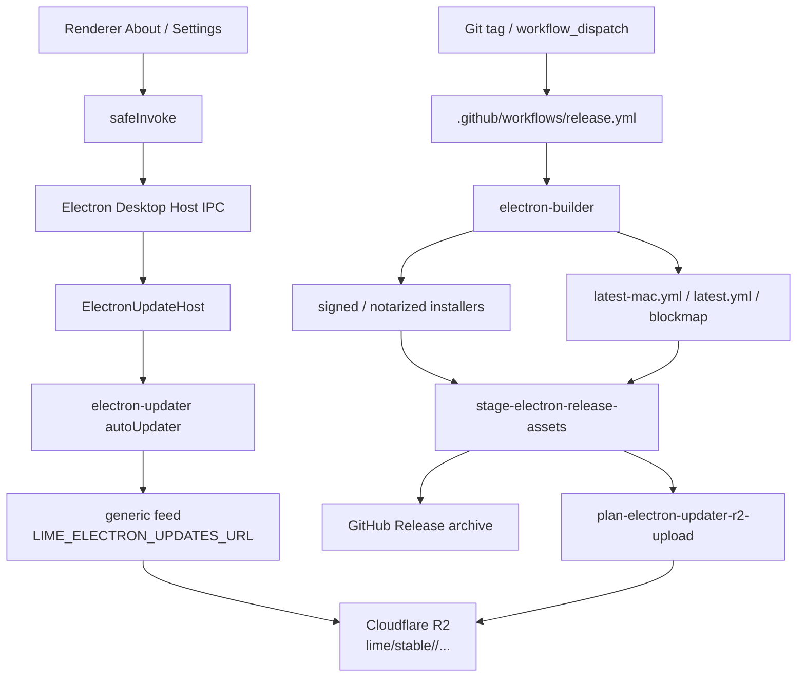

# Electron Release / Updater 边界

> 状态：current planning source
> 更新时间：2026-06-06
> 作用：固定 Lime Desktop 下线上一代前端宿主后的 release、签名、公证、updater feed 与平稳迁移口径。

## 1. 事实源

Lime Desktop 的发布与更新链路由 Electron current 接管：

| 边界             | current 事实源                                  | 负责                                                                                            |
| ---------------- | ----------------------------------------------- | ----------------------------------------------------------------------------------------------- |
| Desktop host     | `electron/main.ts`、`electron/updateHost.ts`    | updater IPC、下载、安装会话、用户可见状态                                                       |
| 打包配置         | `electron-builder.yml`                          | appId、productName、icon、协议、macOS hardened runtime、notarization、installer 与 generic feed |
| 发布 CI          | `.github/workflows/release.yml`                 | 多平台构建、签名、公证、staging、GitHub Release、Cloudflare R2 feed                             |
| 资产 staging     | `scripts/stage-electron-release-assets.mjs`     | 从 `release-electron` 提取 installer、metadata 与 blockmap                                      |
| updater 上传计划 | `scripts/plan-electron-updater-r2-upload.mjs`   | 生成按 feed 与版本隔离的 R2 upload plan                                                         |
| 包资源校验       | `scripts/verify-electron-package-resources.mjs` | 校验 packaged app 内 desktop assets、App Server sidecar 与 release manifest                     |

Codex CLI / `codex-rs` 只作为 App Server protocol / daemon lifecycle / client 分层参考；release、updater、tray、Dock、窗口和桌面产品交互都以 Lime Electron Desktop Host 为事实源，不从 Codex App UI 推断。

## 2. 架构图



更新检查、下载和安装是 Desktop Host 壳能力，不进入 App Server JSON-RPC，也不进入 RuntimeCore。App Server sidecar 只作为 packaged resource 随 Electron 包发布，不能反向承担 updater 或签名职责。

## 3. Feed 与资产

默认更新入口：

```text
https://updates.limecloud.com/lime/stable/<feed>/
```

当前 feed 固定为：

| 平台        | feed           | metadata         | installer                          |
| ----------- | -------------- | ---------------- | ---------------------------------- |
| macOS arm64 | `darwin-arm64` | `latest-mac.yml` | `Lime_<version>_aarch64.dmg` / zip |
| macOS x64   | `darwin-x64`   | `latest-mac.yml` | `Lime_<version>_x64.dmg` / zip     |
| Windows x64 | `win32-x64`    | `latest.yml`     | `Lime_<version>_x64-setup.exe`     |

R2 同时保留 current feed 与版本化路径：

```text
lime/stable/<feed>/<asset>
lime/stable/vX.Y.Z/<feed>/<asset>
```

`latest-mac.yml` / `latest.yml` 使用短缓存；installer、zip、blockmap 使用长缓存。GitHub Release 是归档和人工下载入口，客户端热路径直接读 R2 自域名。

## 4. 签名与公证

macOS 发布使用 Electron Builder 的签名和公证链：

| GitHub secret                | Electron Builder env          | 用途                               |
| ---------------------------- | ----------------------------- | ---------------------------------- |
| `APPLE_CERTIFICATE`          | `CSC_LINK`                    | Developer ID Application 证书      |
| `APPLE_CERTIFICATE_PASSWORD` | `CSC_KEY_PASSWORD`            | 证书解锁                           |
| `APPLE_ID`                   | `APPLE_ID`                    | notarization Apple ID              |
| `APPLE_PASSWORD`             | `APPLE_APP_SPECIFIC_PASSWORD` | notarization app-specific password |
| `APPLE_TEAM_ID`              | `APPLE_TEAM_ID`               | Team 绑定                          |

`.github/workflows/release.yml` 在 macOS matrix 中先校验这些 secret，缺失时直接失败，不等到打包或公证中途才暴露问题。

Windows 当前通过 `electron-builder --win nsis --x64` 生成 NSIS installer；后续若接入 Windows code signing，必须在 `electron-builder.yml`、release workflow、secret preflight 和本文档中成组更新。

## 5. 客户端命令

Renderer 仍通过既有命令名进入更新体验，但实现 owner 已切到 Electron：

| 命令                           | current owner                              |
| ------------------------------ | ------------------------------------------ |
| `check_for_updates`            | `ElectronUpdateHost.checkForUpdates()`     |
| `download_update`              | `ElectronUpdateHost.downloadUpdate()`      |
| `start_update_install_session` | `ElectronUpdateHost.startInstallSession()` |
| `get_update_install_session`   | `ElectronUpdateHost` 内存会话投影          |
| `get_update_check_settings`    | Electron updater 设置投影                  |

开发态默认不启用真实 updater。只有显式设置 `LIME_ELECTRON_ENABLE_DEV_UPDATER=1` 时才允许在开发包里调用 `electron-updater`，避免开发环境误连生产 feed。

## 6. 平稳迁移要求

下个版本发布必须保持以下稳定标识：

1. `electron-builder.yml#appId` 继续为 `com.limecloud.lime`。
2. `electron-builder.yml#productName` 继续为 `Lime`，Dock、菜单、托盘和安装器展示不能退回默认 `Electron`。
3. URL scheme 继续为 `lime`。
4. macOS icon 继续走 `lime-rs/icons/icon.icns`，Windows icon 继续走 `lime-rs/icons/icon.ico`。
5. `extraResources` 必须包含 `app-server.release.json` 与 `app-server/` sidecar，发布包启动后仍能完成 App Server JSON-RPC `initialize`。
6. release workflow 必须拒绝旧 updater 资产进入 Electron 发布物；current workflow 只发布 Electron installer、`latest-mac.yml` / `latest.yml`、blockmap 与 GitHub Release 归档资产。

## 7. 验证入口

涉及发布、签名、updater、App Server packaged resources 或版本号时，最小验证为：

```bash
npm run verify:app-version
npm run typecheck:electron
npm test -- "scripts/release-updater-manifest.test.mjs" "scripts/electron-current-docs-guard.test.mjs"
npm run electron:verify:package
```

GUI 可交付证据仍以 Electron 为准：

```bash
npm run smoke:electron
```

如果本地没有真实 `release-electron` package，先运行：

```bash
npm run electron:package:dir
```
