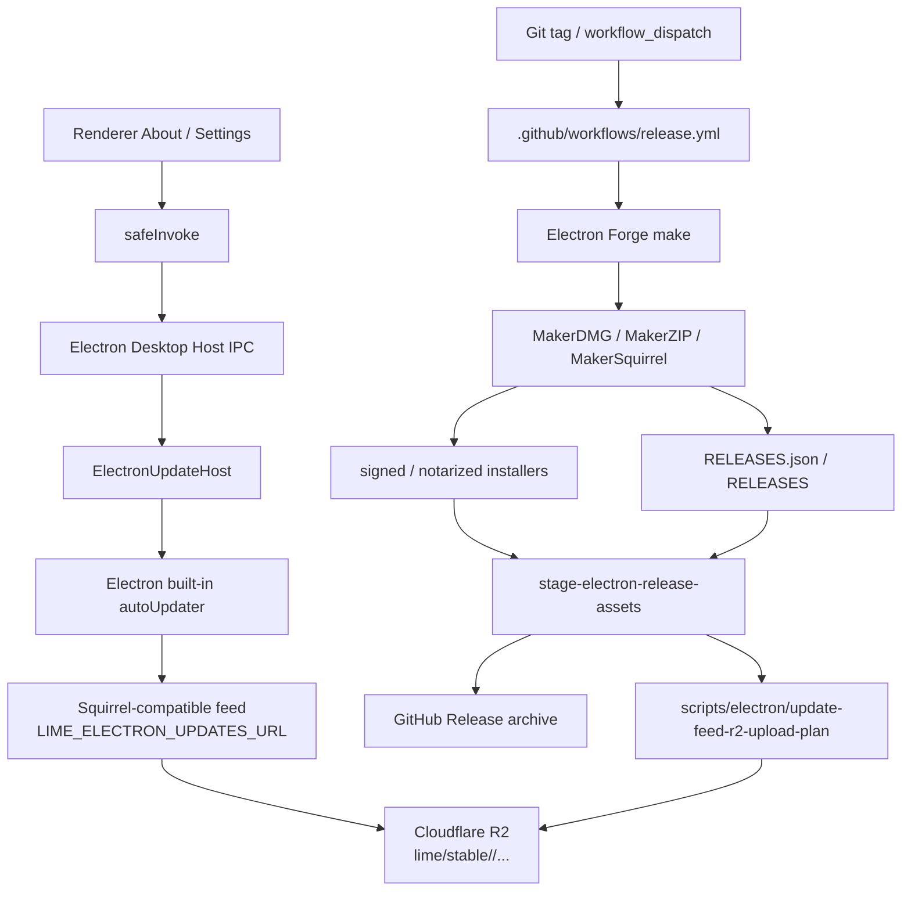

# Electron Release / Updater 边界

> 状态：current planning source
> 更新时间：2026-06-07
> 作用：固定 Lime Desktop 下线上一代前端宿主后的 release、签名、公证、updater feed 与平稳迁移口径。

## 1. 事实源

Lime Desktop 的发布与更新链路由 Electron current 接管：

| 边界             | current 事实源                                    | 负责                                                                                                 |
| ---------------- | ------------------------------------------------- | ---------------------------------------------------------------------------------------------------- |
| Desktop host     | `electron/main.ts`、`electron/updateHost.ts`      | updater IPC、下载、安装会话、用户可见状态                                                            |
| 打包配置         | `forge.config.mjs`                                | Electron Forge package / make、appId、productName、icon、协议、签名、公证、installer 与 generic feed |
| 发布 CI          | `.github/workflows/release.yml`                   | 多平台构建、签名、公证、staging、GitHub Release、Cloudflare R2 feed                                  |
| 资产 staging     | `scripts/electron/stage-release-assets.mjs`       | 从 `release-electron` 提取 installer、updater metadata 与 zip / nupkg                                |
| updater 上传计划 | `scripts/electron/update-feed-r2-upload-plan.mjs` | 生成按 feed 与版本隔离的 R2 upload plan                                                              |
| workflow 守卫    | `scripts/electron/release-workflow-guard.mjs`     | 结构化校验 release workflow 矩阵、Forge make、签名、公证和旧链路拒绝                                 |
| 包资源校验       | `scripts/electron/verify-package-resources.mjs`   | 校验 packaged app 内 desktop assets、App Server sidecar 与 release manifest                          |
| 本地 make 证据   | `scripts/electron/make-zip-local-feed.mjs`        | 用本地 `RELEASES.json` feed 验证 Forge ZIP / macOS updater metadata，不依赖线上 R2 可用性            |

Codex CLI / `codex-rs` 只作为 App Server protocol / daemon lifecycle / client 分层参考；release、updater、tray、Dock、窗口和桌面产品交互都以 Lime Electron Desktop Host 为事实源，不从 Codex App UI 推断。

旧 builder 配置 / CLI、自定义 Windows installer maker 与旧 YAML / blockmap updater metadata 已按 `dead` 处理，不再作为 release、updater、签名、公证、CI、i18n app metadata 或版本同步输入。

官方依据：

- Electron Forge Makers：`https://www.electronforge.io/config/makers`
- Electron Forge DMG maker：`https://www.electronforge.io/config/makers/dmg`
- Electron Forge ZIP maker：`https://www.electronforge.io/config/makers/zip`
- Electron `autoUpdater` API：`https://www.electronjs.org/docs/latest/api/auto-updater`
- Electron Updating Applications：`https://www.electronjs.org/docs/latest/tutorial/updates`

## 2. 架构图



更新检查、下载和安装是 Desktop Host 壳能力，不进入 App Server JSON-RPC，也不进入 RuntimeCore。App Server sidecar 只作为 packaged resource 随 Electron 包发布，不能反向承担 updater 或签名职责。

## 3. Feed 与资产

默认更新入口：

```text
https://updates.limecloud.com/lime/stable/<feed>/
```

当前 feed 固定为：

| 平台        | feed           | metadata        | installer                    |
| ----------- | -------------- | --------------- | ---------------------------- |
| macOS arm64 | `darwin-arm64` | `RELEASES.json` | DMG / ZIP                    |
| macOS x64   | `darwin-x64`   | `RELEASES.json` | DMG / ZIP                    |
| Windows x64 | `win32-x64`    | `RELEASES`      | Setup `.exe` / full `.nupkg` |

Release workflow runner 固定为：

| target triple            | runner           | Forge platform / arch | Forge target |
| ------------------------ | ---------------- | --------------------- | ------------ |
| `aarch64-apple-darwin`   | `macos-15`       | `darwin` / `arm64`    | `dmg,zip`    |
| `x86_64-apple-darwin`    | `macos-15-intel` | `darwin` / `x64`      | `dmg,zip`    |
| `x86_64-pc-windows-msvc` | `windows-2022`   | `win32` / `x64`       | `squirrel`   |

R2 同时保留 current feed 与版本化路径：

```text
lime/stable/<feed>/<asset>
lime/stable/vX.Y.Z/<feed>/<asset>
```

`RELEASES.json` / `RELEASES` 使用短缓存；installer、zip 与 nupkg 使用长缓存。GitHub Release 是归档和人工下载入口，客户端热路径直接读 R2 自域名。

## 4. 打包与签名

发布使用 Electron Forge 的 `package` / `make` 管线：

| 平台        | Forge maker                      | 说明                                          |
| ----------- | -------------------------------- | --------------------------------------------- |
| macOS       | `@electron-forge/maker-dmg`      | 生成 DMG 安装包                               |
| macOS       | `@electron-forge/maker-zip`      | 生成 ZIP updater archive 与 `RELEASES.json`   |
| Windows x64 | `@electron-forge/maker-squirrel` | 生成 Squirrel Setup、full nupkg 与 `RELEASES` |

`forge.config.mjs` 会在 package 阶段把 `app-server.release.json`、`app-server/` 与 `desktop-assets/` 放入 Electron resources。`scripts/electron/stage-release-assets.mjs` 在 staging 阶段复制 Forge 产出的 `RELEASES.json` / `RELEASES`、installer、ZIP 与 nupkg。

macOS 发布签名 / 公证由 release workflow 显式启用：

| GitHub secret                | Forge / packager env          | 用途                               |
| ---------------------------- | ----------------------------- | ---------------------------------- |
| `APPLE_CERTIFICATE`          | 导入临时 keychain             | Developer ID Application 证书      |
| `APPLE_CERTIFICATE_PASSWORD` | 导入临时 keychain             | 证书解锁                           |
| `KEYCHAIN_PASSWORD`          | 临时 keychain password        | GitHub Actions 导入证书            |
| 临时 keychain path           | `LIME_MACOS_KEYCHAIN`         | Forge packager signing keychain    |
| release workflow             | `LIME_ELECTRON_SIGN=1`        | 显式打开签名 / 公证                |
| `APPLE_SIGNING_IDENTITY`     | `APPLE_SIGNING_IDENTITY`      | Developer ID signing identity      |
| `APPLE_ID`                   | `APPLE_ID`                    | notarization Apple ID              |
| `APPLE_PASSWORD`             | `APPLE_APP_SPECIFIC_PASSWORD` | notarization app-specific password |
| `APPLE_TEAM_ID`              | `APPLE_TEAM_ID`               | Team 绑定                          |

`.github/workflows/release.yml` 在 macOS matrix 中先校验这些 secret，缺失时直接失败，不等到打包或公证中途才暴露问题。

Windows 发布签名由 release workflow 按“可选但成对”规则启用，并交给 Forge Squirrel maker：

| GitHub secret                          | Forge / Squirrel env                             | 用途                                                                                 |
| -------------------------------------- | ------------------------------------------------ | ------------------------------------------------------------------------------------ |
| `WINDOWS_SIGNING_CERTIFICATE`          | 写入临时 `LIME_WINDOWS_SIGNING_CERTIFICATE_FILE` | Authenticode PFX 证书                                                                |
| `WINDOWS_SIGNING_CERTIFICATE_PASSWORD` | `LIME_WINDOWS_SIGNING_CERTIFICATE_PASSWORD`      | Squirrel signing certificate 密码                                                    |
| release workflow                       | `LIME_ELECTRON_SIGN=1`                           | Windows 构建允许签名；只有两项 Windows secret 都存在时才传入 Squirrel signing config |

Windows 当前通过 `npx electron-forge make --platform win32 --arch x64 --targets squirrel` 生成 Squirrel installer；两项 Windows signing secret 都存在时，`forge.config.mjs` 将 `certificateFile` / `certificatePassword` 传给 `@electron-forge/maker-squirrel`。如果两项 secret 都未配置，release workflow 继续生成 unsigned Forge Squirrel installer；如果只配置其中一项，则 fail-fast，避免半配置签名在 make 阶段才失败。

macOS ZIP / `RELEASES.json` 的本地确定性验证使用：

```bash
npm run electron:make:zip-local-feed -- --arch arm64
npm run electron:make:zip-local-feed -- --arch x64
```

该入口启动本机临时 HTTP feed，只提供 MakerZIP 需要读取的 `RELEASES.json`，并通过 `LIME_ELECTRON_FORGE_OUT_DIR=.tmp/electron-forge-local-feed` 隔离输出，然后调用 `electron-forge make --skip-package --platform darwin --arch <arch> --targets zip`。它用于证明 Forge ZIP 和 `RELEASES.json` 生成链路，不替代 release workflow 的 DMG、签名、公证、Windows Squirrel 或 R2 发布证据；正式 staging 仍只从 `release-electron` 读取。

## 5. 客户端命令

Renderer 仍通过既有命令名进入更新体验，但实现 owner 已切到 Electron：

| 命令                           | current owner                              |
| ------------------------------ | ------------------------------------------ |
| `check_for_updates`            | `ElectronUpdateHost.checkForUpdates()`     |
| `download_update`              | `ElectronUpdateHost.downloadUpdate()`      |
| `start_update_install_session` | `ElectronUpdateHost.startInstallSession()` |
| `get_update_install_session`   | `ElectronUpdateHost` 内存会话投影          |
| `get_update_check_settings`    | Electron updater 设置投影                  |
| `open_update_window`           | Electron 通知窗口生命周期与定位            |

开发态默认不启用真实 updater。只有显式设置 `LIME_ELECTRON_ENABLE_DEV_UPDATER=1` 时才允许在开发包里调用 Electron 内置 `autoUpdater`，避免开发环境误连生产 feed。

`open_update_window` 允许 renderer 通过前端 gateway 传入侧边栏更新按钮的锚点矩形；Electron Host 只做参数投影和窗口定位，不承接后端业务事实。更新提醒窗口必须贴近侧栏更新入口上方，并保持透明独立窗口内只有一层实体 toast 表面，避免居中弹出或外层背景露出造成双层弹窗观感。

## 6. 平稳迁移要求

下个版本发布必须保持以下稳定标识：

1. `forge.config.mjs#APP_ID` 继续为 `com.limecloud.lime`。
2. `forge.config.mjs#PRODUCT_NAME` 继续为 `Lime`，Dock、菜单、托盘和安装器展示不能退回默认 `Electron`。
3. URL scheme 继续为 `lime`。
4. macOS icon 继续走 `lime-rs/icons/icon.icns`，Windows icon 继续走 `lime-rs/icons/icon.ico`。
5. `extraResources` 必须包含 `app-server.release.json` 与 `app-server/` sidecar，发布包启动后仍能完成 App Server JSON-RPC `initialize`。
6. `stage-electron-release-assets` 必须在 `release-electron` staging 阶段 fail-fast 拒绝旧 updater 资产，不能静默忽略 `*.app.tar.gz`、`*.sig`、旧 YAML metadata 或 blockmap。
7. `stage-electron-release-assets` 必须拒绝 `RELEASES.json` 中的 `localhost` / `127.0.0.1` 更新 URL，防止本地临时 feed 验证产物进入正式发布。
8. `prepare-github-release-assets` 与 release workflow 必须拒绝旧 updater 资产进入 Electron 发布物；current workflow 只发布 Electron installer、`RELEASES.json` / `RELEASES`、ZIP、nupkg 与 GitHub Release 归档资产。

## 7. 验证入口

涉及发布、签名、updater、App Server packaged resources 或版本号时，最小验证为：

```bash
npm run verify:app-version
npm run typecheck:electron
npm test -- "scripts/electron/release-updater-assets.test.mjs" "scripts/electron/current-docs-guard.test.mjs"
npm run governance:electron-release-workflow
npm run electron:verify:package
npm run electron:make:zip-local-feed -- --arch arm64
```

GUI 可交付证据仍以 Electron 为准：

```bash
npm run smoke:electron
```

如果本地没有真实 `release-electron` package，先运行：

```bash
npm run electron:package:dir
```

本地 macOS `electron-forge make --targets dmg,zip` 还依赖 `@electron-forge/maker-dmg` 的 optional DMG 工具链；如果本机 Node / native addon 环境无法安装该 optional dependency，可以先用 `electron:make:zip-local-feed` 验证 updater metadata，再把 DMG、签名与公证留给 GitHub Actions macOS runner 证明。Windows Squirrel 当前必须在 Windows runner 上验证，macOS 本机不作为 Windows installer 实机证据。
