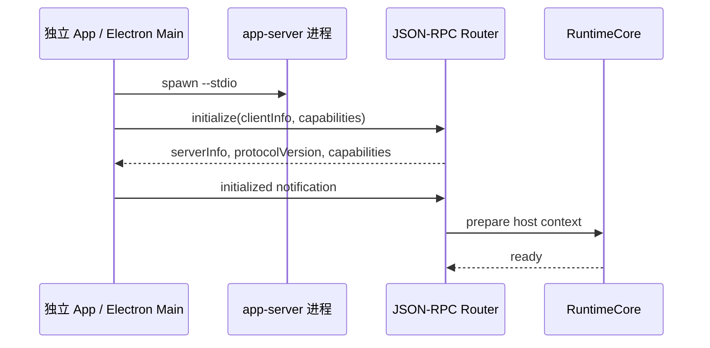
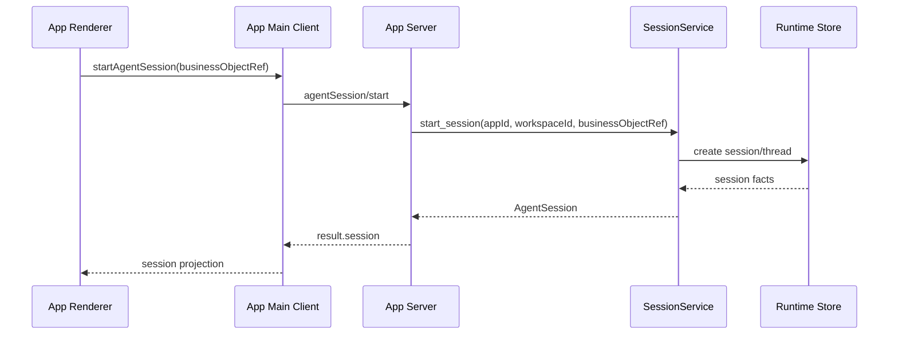
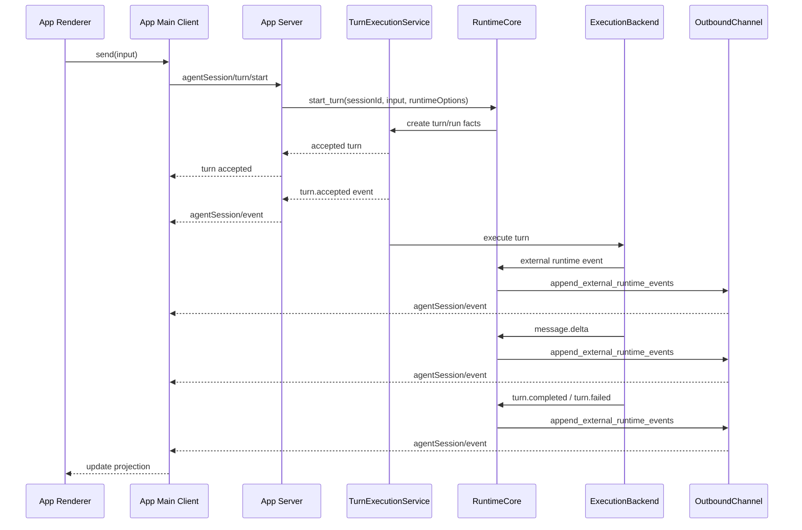
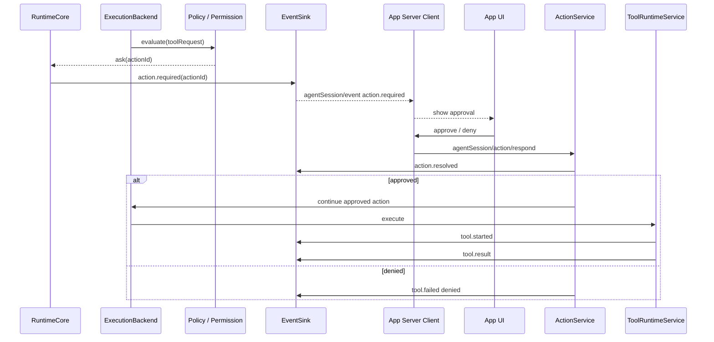
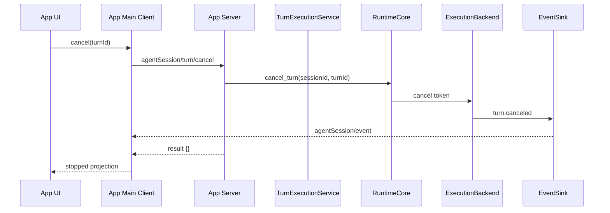
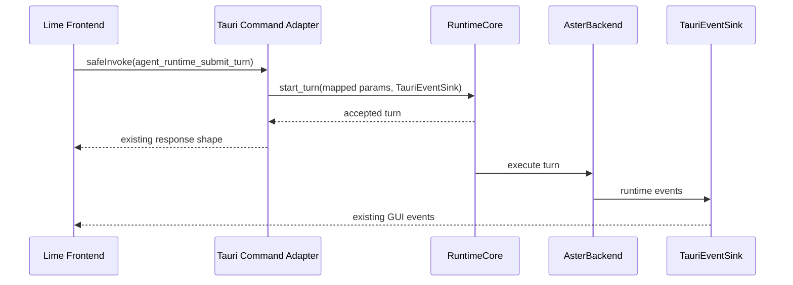
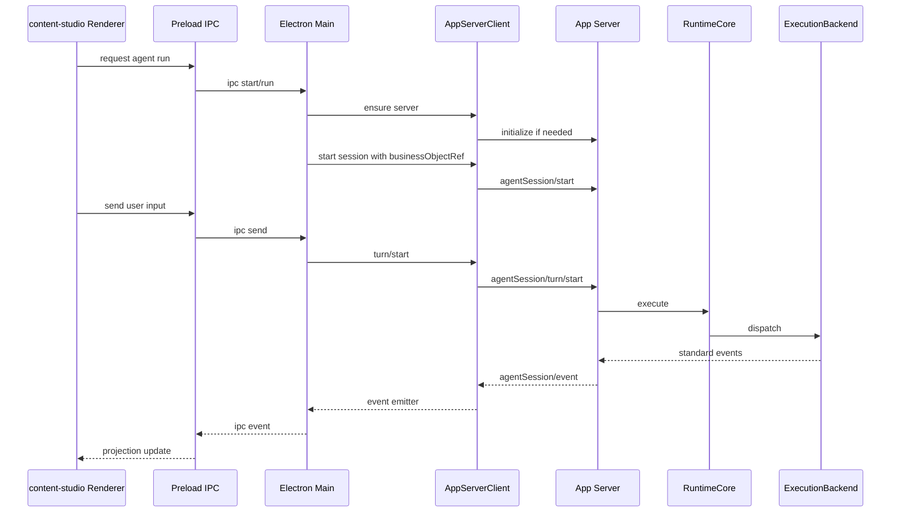
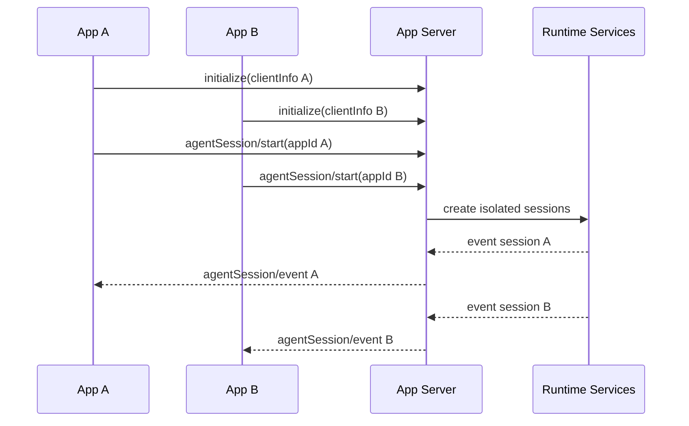
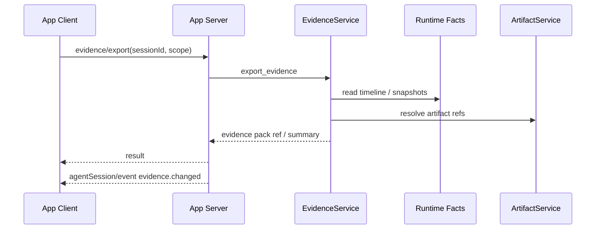

# App Server 时序图

> 状态：current planning source
> 更新时间：2026-06-04
> 作用：固定 App Server 初始化、会话执行、工具审批、Tauri 替换和独立 App 复用的关键时序。

## 1. 独立 App 启动 App Server

## 2. 创建 Agent Session

## 3. 发起 Turn 并接收事件流

## 4. 工具审批 / 人工确认

## 5. 取消 Turn

## 6. Lime Desktop 迁移期时序

目标：前端合同不先大改，command 内部逐步退回 adapter。

## 7. content-studio 复用时序

## 8. 多 App 共享 Server

要求：事件订阅、session 可见性、capability 权限必须按 client / app 隔离。

## 9. Evidence 导出

