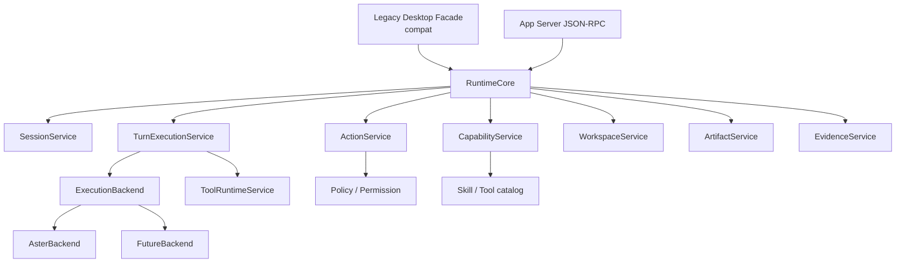

# App Server 服务抽取计划

> 状态：current planning source
> 更新时间：2026-06-08
> 作用：定义如何从现有 Lime runtime 中抽出可被 App Server 和 legacy desktop facade 共用的服务层。

## 1. 抽取原则

1. 先抽公共 RuntimeCore，不先改产品入口。
2. 先定义 backend-neutral 合同，再迁 Aster 主链。
3. Aster 只是第一个 `ExecutionBackend`，不能把 Aster DTO 直接抬成公共 DTO。
4. legacy desktop facade 只允许在迁移期保留参数适配、事件转发和错误映射；不得落回 `lime-rs/src/commands/**` 扩写。
5. App Server 和 legacy desktop facade 必须调用同一个 RuntimeCore。
6. 服务层不能依赖 retired desktop host app handle、event emitter 或 state container。
7. 事件 sink、路径、凭证、workspace、policy 都通过 trait / context 注入。
8. `lime-rs/src/commands/**` 是旧 Tauri command wrapper 清理区，不再承接新的业务逻辑、API adapter、runtime 分支或领域服务实现。

## 2. 当前候选事实源

| 当前区域 | 判断 | 后续方向 |
| --- | --- | --- |
| `RuntimeCore` | `current target` | 公共 session/thread/turn/task/run/action/event/artifact/evidence 事实源。 |
| `ExecutionBackend` | `current target` | 后端适配接口，Aster 和未来后端都走这里。 |
| `AsterBackend` | `current target` | 对现有 Aster runtime_turn/tool_runtime 的适配封装。 |
| `lime-rs/crates/agent` | `current reference` | 当前最接近 core 的 crate，后续继续拆公共模型与服务。 |
| `lime-rs/src/commands/aster_agent_cmd/runtime_turn.rs` | `compat cleanup reference` | Aster backend 历史实现参考，只能用于迁出逻辑；不再作为公共 core 或新 runtime 落点。 |
| `lime-rs/src/commands/aster_agent_cmd/tool_runtime/*` | `compat cleanup reference` | Aster tool execution 历史参考，事件需迁到公共 tool facts；不再新增 tool 业务逻辑。 |
| `lime-rs/src/commands/aster_agent_cmd/command_api/*` | `compat cleanup reference` | legacy desktop command DTO / facade 历史参考；迁出到 RuntimeCore / App Server 后撤注册并删除，不在该目录继续保留委托 facade。 |
| `lime-rs/src/commands/**` | `compat cleanup` | 旧 Tauri wrapper 清理区；只允许迁出核心逻辑、撤注册和删除；删不动登记 blocker。新增后端能力进入 App Server crates / RuntimeCore / services，桌面壳能力进入 Electron Desktop Host。 |
| 前端 `safeInvoke` / `invoke` agent runtime API | `compat client` | Lime Desktop 迁移期继续保留，但可改为 app-server client。 |
| `app-server-protocol` | `current target` | 定义 wire DTO 和 schema。 |
| `app-server` crate 家族 | `current target` | 参考 codex-rs 分层命名，提供 protocol / transport / server / client / daemon / test-client。 |

## 3. 目标服务边界



## 4. 服务接口草案

### 4.1 `RuntimeCore`

职责：

1. 创建 / 读取 session。
2. 启动 / 取消 turn。
3. 响应 action。
4. 读取 capability。
5. 导出 artifact / evidence。
6. 选择并调用 `ExecutionBackend`。

不负责：

1. 直接持有壳层窗口。
2. 直接发送 legacy desktop event。
3. 直接读取 renderer state。
4. 暴露 Aster 私有 DTO。

### 4.2 `ExecutionBackend`

职责：

1. 接收 backend-neutral `ExecutionRequest`。
2. 执行具体后端逻辑。
3. 通过 `RuntimeEventSink` 回传标准事件。
4. 支持 cancel / resume 的最小合同。
5. backend host 返回值必须是公共 `RuntimeEvent`，不能把 `lime_agent::AgentEvent`、`AsterChatRequest` 或 legacy desktop DTO 带回 `app-server` 公共合同。

首批 backend：

1. `AsterBackend`：适配现有 Aster runtime。
2. `MockBackend`：只用于 P1/P2 协议和客户端测试。

### 4.3 `RuntimeEventSink`

App Server、legacy desktop facade、测试 fixture 都应通过统一 event sink 消费事件：

```text
RuntimeEventSink
  -> emit(event)
  -> flush()
  -> close()
```

实现：

1. `JsonRpcEventSink`：发 notification。
2. `DesktopEventSink`：迁移期转发到现有 GUI event。
3. `TestEventSink`：收集 fixture。

### 4.4 `RuntimeHostContext`

服务层需要的壳层上下文必须显式注入：

1. app id
2. workspace roots
3. locale
4. environment
5. credential resolver
6. path resolver
7. permission profile
8. artifact policy
9. evidence policy

不能从全局 legacy desktop host state 隐式读取。

## 5. 迁移映射

| 能力 | 现状 | 目标服务 | 迁移策略 |
| --- | --- | --- | --- |
| submit turn | legacy desktop command 调 runtime_turn | `TurnExecutionService::start_turn` | 先迁出 service，再让 App Server / Electron current 入口调用；旧 command 随后撤注册并删除。 |
| read thread | command_api / session store projection | `SessionService::read_session` | read model 下沉为 service 输出。 |
| cancel turn | command / queue glue | `TurnExecutionService::cancel_turn` | 统一 active turn 状态和取消事件。 |
| respond action | scattered approval bridge | `ActionService::respond_action` | action id 成为协议事实。 |
| tool runtime | `tool_runtime/*` | `ToolRuntimeService` | tool events 前移到 service event sink。 |
| capability list | skill/tool catalog 多入口 | `CapabilityService::list` | 输出 App 可见 capability。 |
| artifact | runtime / command 辅助写入 | `ArtifactService` | artifact changed 统一事件。 |
| evidence | harness export command | `EvidenceService` | evidence export 可通过 App Server 调用。 |

## 5.1 公共 / 后端 / 壳层切分规则

| 问题 | 放在哪里 |
| --- | --- |
| session/thread/turn/task/run/action ids | RuntimeCore |
| JSON-RPC wire DTO | app-server-protocol |
| backend 选择、取消、事件序列 | RuntimeCore |
| Aster prompt / tool orchestration 细节 | AsterBackend；迁移完成前可参考旧 `aster_agent_cmd`，但不得在 `lime-rs/src/commands/**` 新增逻辑 |
| 未来其他执行引擎细节 | 对应 ExecutionBackend |
| 旧 Lime Agent event payload 解析 | Desktop compat facade |
| legacy desktop host handle / window event | DesktopHostBridge |
| Electron sidecar 管理 | Electron Desktop Host / app-server-client / app-server-daemon |
| content-studio 业务对象 | content-studio App surface |

## 6. 分阶段抽取

### P0：只读盘点

输出：

1. runtime command dependency map。
2. legacy desktop-only dependency list。
3. service candidate list。

退出条件：

1. 明确哪些逻辑可直接下沉。
2. 明确哪些依赖需要 trait 化。
3. 不改行为。

### P1：最小 service facade

输出：

1. `RuntimeCore` trait / struct。
2. `start_session`、`start_turn`、`cancel_turn`。
3. `TestEventSink`。

退出条件：

1. legacy desktop command 可通过 service 调用最小 turn。
2. 测试能收集事件。

### P2：App Server 接入 service

输出：

1. JSON-RPC router。
2. stdio transport。
3. protocol DTO。
4. app-server 调用同一 service。

退出条件：

1. stdio fixture 跑通 initialize / start / turn / cancel。
2. 不依赖 retired desktop host crates。

### P3：事件和 action 统一

输出：

1. `RuntimeEventSink` 全面接入。
2. `ActionService` 统一 action required / resolved。
3. legacy desktop event 和 JSON-RPC notification 同源。

退出条件：

1. GUI 和 App Server 看到同源事件。
2. action id 不再由 UI 临时拼装。

### P4：artifact / evidence 统一

输出：

1. `ArtifactService`。
2. `EvidenceService`。
3. App Server artifact/evidence API。

退出条件：

1. artifact changed / evidence changed 事件可跨 App 投影。
2. evidence export 不重新拼 runtime facts。

## 7. retired host 依赖退场

下列依赖在服务层中禁止出现：

1. retired desktop host app handle。
2. retired desktop host event emitter。
3. retired desktop host state container。
4. window label
5. renderer-specific event names
6. frontend-only DTO

允许存在的位置：

1. legacy desktop command facade。
2. legacy desktop event sink。
3. Lime Desktop frontend gateway。

这些允许位置只表示迁移期可读 / 可委托，不表示可以继续写新实现。`lime-rs/src/commands/**` 中的旧 facade 必须随 RuntimeCore / App Server / Electron Host 覆盖逐步删除。

退出条件：

1. service crate 编译不依赖 retired desktop host crates。
2. app-server crate 可独立启动。
3. legacy desktop facade 删除后 service 不受影响。

## 8. 守卫

后续实现应补：

1. 结构测试：service crate 不得依赖 retired desktop host crates。
2. 文本扫描：新 runtime 业务逻辑、API adapter、领域 service 不得落回 `lime-rs/src/commands/**`。
3. contract test：legacy desktop facade 和 App Server 对同一 fixture 产出一致事件。
4. protocol test：JSON-RPC request / response / notification schema 稳定。
5. 边界测试：`app-server` 公共后端 contract 不得重新出现 Lime/Aster 私有事件类型。

## 9. 完成判定

服务抽取完成不是“App Server 能启动”，而是：

1. 至少一个真实 Agent turn 经由 service 被 Lime Desktop 和 App Server 复用。
2. Tool / action / artifact / evidence 至少有同源事件链。
3. legacy desktop command 只做 compat facade。
4. content-studio 这类独立 App 不需要理解 Lime Desktop 内部 command。
