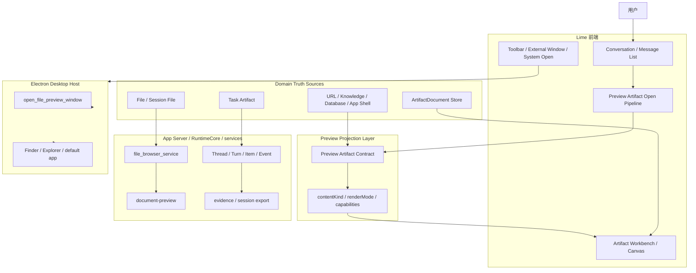

# Artifact 与 Preview 架构蓝图

> 状态：current
> 更新时间：2026-06-18
> 目标：把正式交付物、source-backed 预览、运行时事件和桌面壳能力放回各自边界，避免文件预览、artifact 工作台、独立窗口继续分叉。

## 总体分层

## 责任边界

### Preview Projection Layer

职责：

- 把 file、task、URL、knowledge、session_file、app、database record 投影为普通 `Artifact`。
- 给 UI 提供统一 `id / title / type / content / meta`。
- 标注 `sourceRef / contentKind / renderMode / capabilities / lifecycle`。
- 只决定“如何打开和展示”，不决定 source 的业务语义。

禁止：

- 把临时预览写成正式 `ArtifactDocument`。
- 在组件内重复判断文件类型、窗口打开、系统打开。
- 让二进制或不支持内容直接消失。

### ArtifactDocument Domain

职责：

- 正式交付物的 block tree、source、version、rewrite、diff、export。
- 模型输出 schema 与 validator/repair。
- Workbench inspector 的来源、差异、局部改写。

禁止：

- 接管普通文件浏览器、DOCX 文本抽取、HTML 独立窗口。
- 存储所有 source-backed 临时预览。

### Backend / Services

职责：

- `file_browser_service` 读取文件预览。
- `document-preview` 抽取 DOCX 等文档文本。
- App Server / RuntimeCore 记录真实 thread / turn / item / evidence。

禁止：

- 恢复 `lime-rs/src/**` 或旧 Tauri command wrapper。
- 让 Electron main 承接文件内容解析业务。

### Electron Desktop Host

职责：

- 打开独立预览窗口。
- 定位文件、系统默认应用打开、桌面 shell 能力。
- sidecar 生命周期与 IPC 白名单。

禁止：

- 作为第二套后端读取/解析业务文件。
- 让 renderer 直接 import test-only `WebviewWindow`。

## AG-UI 对照

AG-UI 的启发是“事件/状态/展示扩展分离”：

- lifecycle 对应 Lime `thread / turn / item` 生命周期。
- message snapshot/delta 对应对话 read model。
- tool call/result 对应工具 timeline。
- state snapshot/delta 对应可重建 UI 状态。
- custom/activity 对应 Lime preview projection 或专用工作台组件。

因此 Lime 的实现原则是：

1. 事件流负责可重建过程。
2. domain source 负责业务状态。
3. preview artifact 负责 UI projection。
4. 组件只消费 projection，不反向成为 source。

## 打开流程

1. 用户点击 source。
2. source-specific loader 获取必要预览内容或最小 metadata。
3. `createPreviewArtifactFromSource(...)` 生成 source-backed artifact。
4. `upsertGeneralArtifact(...)` 更新当前工作台 artifact 集合。
5. `openArtifactInWorkbench(...)` 统一选中、设置 view mode、打开右侧画布。
6. 如果目标进入 `CanvasWorkbenchLayout`，必须同步发送 `previewOpenRequest.selectionKey`，例如 `artifact:<previewArtifact.id>`；只更新全局 `selectedArtifactId` 不能作为 workbench 已切换的证据。
7. Workbench 根据 selection context 渲染：普通 Markdown/Code/HTML 保留文档预览模式；`renderMode=media/system_open/unsupported` 与 `source=url/database_record/app` 的 preview artifact 直接委托 `ArtifactRenderer`。
8. `ArtifactRenderer` 对 `system_open / unsupported` 必须渲染明确的 preview fallback surface，展示文件名、来源路径、mime/error 等 metadata；不得继续落回空内容骨架、Markdown 文档渲染或 raw ZIP/OpenXML 文本。
9. `ArtifactRenderer` 对 URL、数据库记录和应用入口必须渲染来源摘要面，展示 source ref、标题和导入时保留的摘要；不得把 URL / record id 当本地文件路径懒加载。
10. 消息工具轨中的 WebSearch / URL 结果点击必须先调用 Workspace 的 `onOpenUrlPreview`，生成 `source=url` preview artifact，并以 `selectionKey=artifact:<id>` 打开右侧工作台；只有没有工作台回调的独立复用场景才允许 fallback 到系统浏览器。
11. 若同一消息或同一过程组里已经存在 URL 匹配的成功 WebFetch，URL preview artifact 可以复用该工具结果的结构化正文作为快照内容；不得因此新增 renderer 侧真实网络抓取器或第二套 URL viewer。
12. 工具栏按 capabilities 决定“独立窗口 / 系统打开 / 定位 / 保存”；fallback surface 和来源摘要面不重复实现打开动作。

## 渲染退化

| contentKind   | artifact.type | renderMode                   | 说明                                       |
| ------------- | ------------- | ---------------------------- | ------------------------------------------ |
| `markdown`    | `document`    | `canvas`                     | Markdown / MDX / 文本报告                  |
| `code`        | `code`        | `canvas`                     | 代码、JSON、YAML、TOML 等                  |
| `html`        | `html`        | `canvas` + `external_window` | 右侧 iframe 与独立窗口                     |
| `image`       | `document`    | `media`                      | 读取 `meta.previewUrl`，由媒体 viewer 渲染 |
| `audio`       | `document`    | `media`                      | 读取 `meta.previewUrl`，由媒体 viewer 渲染 |
| `video`       | `document`    | `media`                      | 读取 `meta.previewUrl`，由媒体 viewer 渲染 |
| `document`    | `document`    | `document_text`              | DOCX 等已抽取文本                          |
| `document`    | `document`    | `system_open`                | PDF / Excel / PPT 等暂无文本抽取的二进制文档；右侧渲染 metadata 兜底面 |
| `binary`      | `document`    | `system_open`                | 不内嵌，给系统打开/定位                    |
| `markdown/text` | `document`  | `inline`                     | URL / database_record 来源摘要；不按文件路径读取 |
| `app_shell`   | `document`    | `inline`                     | Agent App shell entry 来源摘要；动作仍由应用工作台承接 |
| `unsupported` | `document`    | `unsupported`                | 右侧渲染不可预览原因和来源 metadata          |

## 质量门槛

- 前端 projection 必须有纯单测。
- Workspace 文件点击必须有组件/hook 回归。
- Electron 命令新增必须同步 IPC 白名单与 `test:contracts`。
- DOCX 抽取必须有 Rust 定向测试，且要证明不会出现 ZIP 乱码。
- GUI 主路径改动最终需要 `verify:gui-smoke` 或等价 current fixture。
