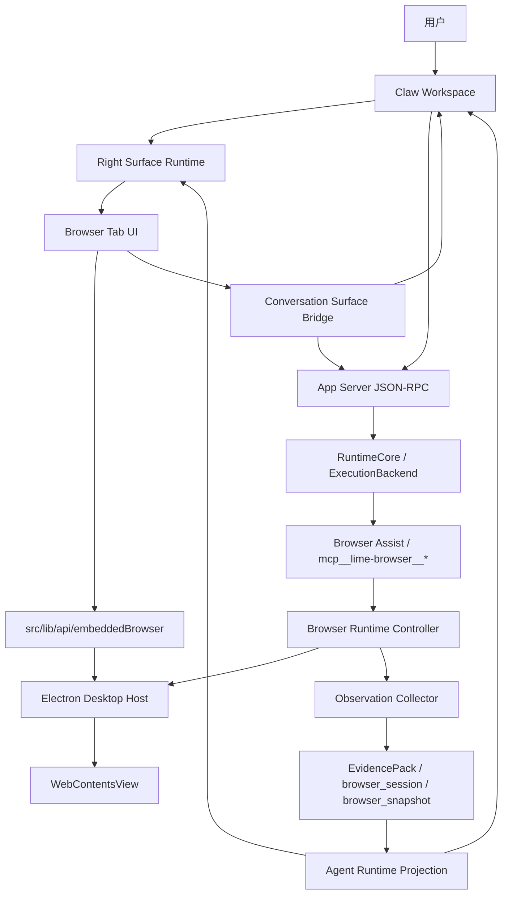
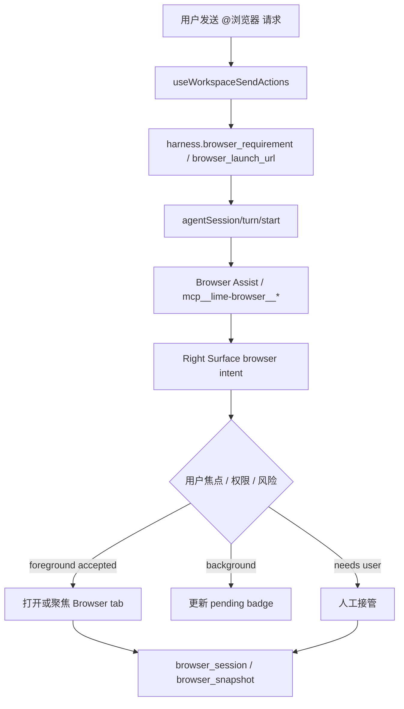
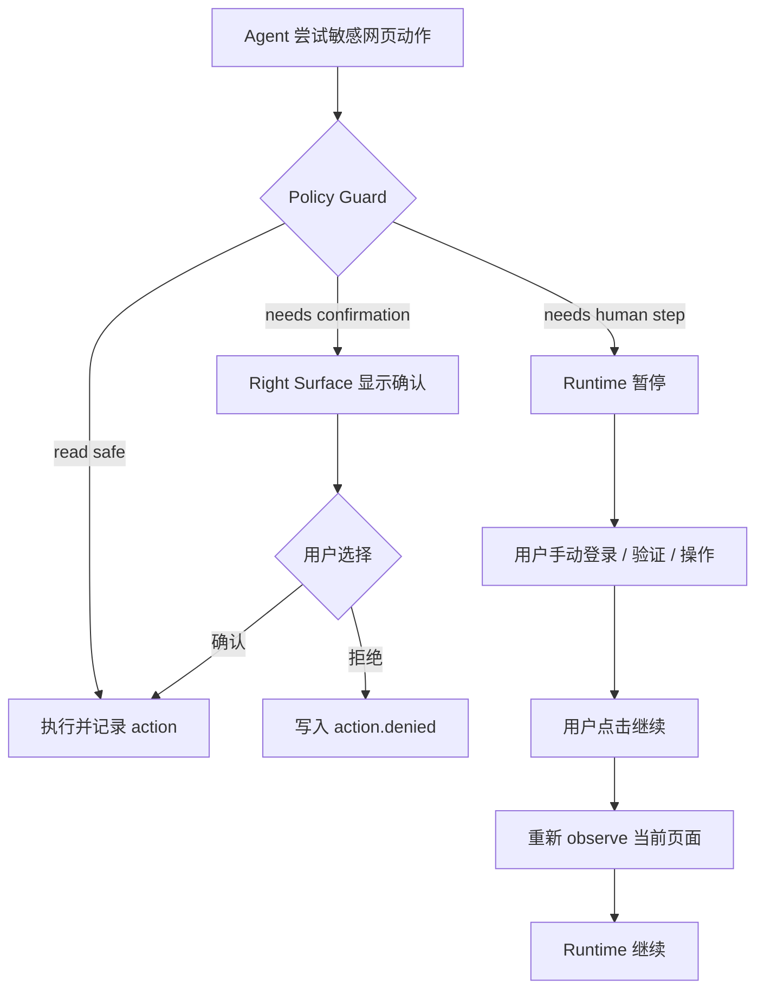
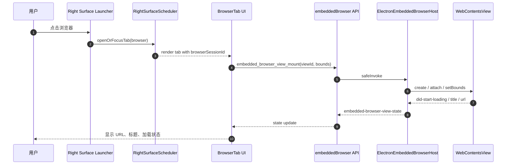
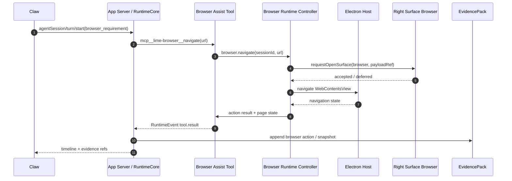
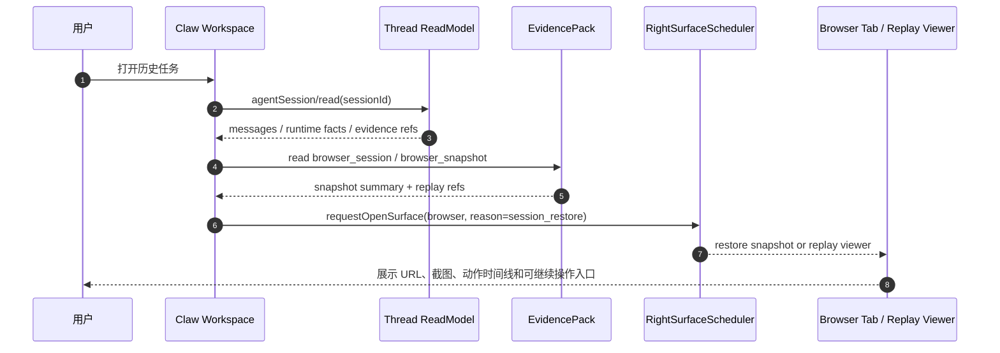

# Browser Runtime / Right Surface Browser PRD

更新时间：2026-06-24

状态：Draft

事实源：

- `internal/roadmap/rightsurface/README.md`
- `internal/roadmap/plugin/README.md`
- `internal/roadmap/plugin/prd.md`
- `internal/roadmap/plugin/architecture.md`
- `internal/roadmap/plugin/interface-contracts.md`
- `internal/roadmap/plugin/technical-baseline.md`
- `internal/roadmap/agentworkbench/README.md`
- `internal/aiprompts/commands.md`
- `internal/aiprompts/quality-workflow.md`
- `internal/develop/traceable-agent-acceptance-methodology.md`
- `internal/exec-plans/browser-runtime-right-surface-plan.md`
- 现有实现：`electron/embeddedBrowserHost.ts`、`src/lib/api/embeddedBrowser.ts`、`src/components/agent/chat/components/canvas-workbench/browser/CanvasWorkbenchBrowserPanel.tsx`
- 本地 Codex 参考：`/Users/coso/Documents/dev/rust/codex/codex-rs/app-server-protocol/src/protocol/v2/item.rs`、`mcp.rs`、`permissions.rs`、`thread_history.rs`，以及 `app-server/src/thread_status.rs`、`request_processors/thread_resume_redaction.rs`

## 1. 一句话目标

把 Lime 里的浏览器从“右侧薄网页控件”升级为 **用户和 Claw 可共同操作、可观察、可恢复、可审计的 Browser Runtime**：它作为 Right Surface 的 `browser` tab 承载网页现场，作为 Browser Assist / `mcp__lime-browser__*` 的可见执行面，所有动作、快照、人工接管和证据都回到 App Server / Runtime facts 主链。

```text
不是弹出系统浏览器
不是 iframe 预览
不是只能打开 URL 的小面板
而是 Claw 工作台里的受控浏览现场
```

## 2. 背景

Browser 是 AI Agent 工作台的核心能力之一。很多任务不能只靠 WebSearch 完成，例如登录后台、查看动态页面、点击筛选器、下载文件、提交表单、复核网页渲染、打开平台发布页、对照页面截图和提取结构化数据。

当前 Lime 已经有几块基础：

| 能力                  | 当前事实                                                                                                               | 缺口                                                                                     |
| --------------------- | ---------------------------------------------------------------------------------------------------------------------- | ---------------------------------------------------------------------------------------- |
| 内嵌浏览器宿主        | `electron/embeddedBrowserHost.ts` 使用 `WebContentsView`，支持 mount、bounds、navigate、reload、back、forward、destroy | 生命周期、profile、权限、下载、窗口打开、观测、证据和 Right Surface 还未形成完整产品合同 |
| 前端浏览器面板        | `CanvasWorkbenchBrowserPanel` 有地址栏、前进后退、刷新、外部打开和错误态                                               | 仍是 CanvasWorkbench 内部 tool tab，未沉到统一 Right Surface `browser` tab               |
| Claw `@浏览器` 入口   | `request_metadata.harness.browser_requirement/browser_launch_url`，并关闭本轮 `webSearch` 偏好                         | Browser Assist 自动拉起、用户接管、可见浏览现场和 evidence 回流仍需统一                  |
| Browser Assist 工具面 | `mcp__lime-browser__*` 聚合 browser runtime tools，已有 `browser_session` / `browser_snapshot` evidence 口径           | 工具调用和右侧可见浏览器之间缺少统一 session/profile/action 合同                         |
| Evidence / Replay     | `snapshotIndex.browserActionIndex`、`browser_replay_viewer` 已有最小复盘口径                                           | 尚未覆盖完整交互回放、DOM/network/console/权限/下载深层展开                              |

用户反馈集中在三个产品问题：

1. 点击浏览器相关入口时，不应跳出系统浏览器，而应打开右侧栏内的浏览器。
2. 打开时不应导致右侧内容下拉、遮挡或刷新错位，交互应该学习 Chrome 的稳定布局和标题反馈。
3. 现有能力太薄，作为 AI Agent 侧边栏浏览器需要支持更多真实网页工作流，并开放给 Claw 使用。

## 3. 路线图约束

### 3.1 Right Surface 约束

Browser 必须进入唯一 Right Surface Dock：

- 作为 `browser` tab 注册到 `RightSurfaceRegistry`。
- 不新增第二个右栏，不使用外层 `rightRailNode` 承接普通浏览器面板。
- 顶部工具按钮只发 `openOrFocusTab(browser)` 或 Browser intent，不拥有独立展开状态。
- 后台 Browser Assist 请求默认进入 pending badge，不抢用户正在使用的 tab。
- Surface 和 Chat 之间只共享 `payloadRef`、`selection` 和 structured action，不拼隐藏 prompt。

### 3.2 Plugin 约束

Browser 的桌面承载必须遵守 Electron-first current 基线：

- 当前承载首选 `WebContentsView`。
- `<webview>` 和 `BrowserView` 不作为新增主路径。
- iframe 只允许低风险静态预览或历史 fixture，不承担 Browser Runtime。
- Electron Desktop Host 负责 native view、bounds、partition、preload、window open、download、permission policy。
- 写动作和业务副作用必须回流 `agentSession/action/respond`、`agentSession/turn/start` 或 App Server current route。

### 3.3 Agent Workbench 约束

Browser Runtime 不能成为第二套 runtime：

- Browser action、snapshot、network、console、download、permission、human takeover 都应进入 RuntimeEvent / ThreadReadModel / TaskSnapshot / EvidencePack。
- UI 只消费 runtime facts 和 projection，不自建工具状态机。
- 产品应用不能复制 browser runtime client、projection reducer 或本地工具状态机。
- Browser Assist 和 `mcp__lime-browser__*` 只是工具 surface，事实源仍是 App Server / RuntimeCore / ExecutionBackend。
- Browser Assist、WebSearch / WebFetch 与 `mcp__lime-browser__*` 的聊天侧展示只消费 Claw streaming `ContentPart[]` 投影；live `Message.contentParts` 已持有结构化过程流时，Right Surface / timeline / read model 只能补 evidence 或 sparse reasoning/commentary，不得完成后重建第二组搜索、读取或浏览器过程 UI。

## 4. 目的

1. 建立 Right Surface `browser` tab 的产品和工程合同。
2. 把用户可见浏览器、Claw 可控工具、浏览器 profile/session、证据和回放统一到一条主链。
3. 让浏览器交互达到桌面浏览器的基本预期：标题、favicon、加载进度、前进后退、停止刷新、地址栏、权限、下载、右键、缩放、查找、错误页、外部打开和多 tab。
4. 让 Claw 能在用户授权下执行浏览器任务，并且每一步可观察、可接管、可复盘。
5. 为发布后台、站点搜索、网页读取、渠道预览、上传发布、App 自定义网页工作流提供统一底座。

## 5. 收益

### 5.1 用户收益

- 不离开 Claw 工作台即可完成网页查看、登录、验证、发布、下载和复核。
- 用户始终能看到 Agent 正在操作哪个网页，必要时可随时接管。
- 历史任务再次打开时能恢复浏览器现场和关键快照，而不是只剩聊天文字。
- 受保护网页、验证码、扫码、二次确认等场景可以自然切换到人工步骤。

### 5.2 Agent 收益

- Claw 不再把真实网页任务退化成 WebSearch 或普通聊天解释。
- Browser Assist 工具调用能绑定可见 session、profile、action trace 和 evidence。
- 工具失败可定位到页面状态、权限、网络、控制台或用户步骤，而不是只返回模糊错误。
- 结果可通过 screenshot / DOM / accessibility / network facts 证明。

### 5.3 工程收益

- 统一 `WebContentsView` 宿主、Right Surface tab、Browser Assist 工具面和 Evidence Pack。
- 移除“Canvas 内部浏览器 tab”和“Right Surface 浏览器 tab”长期双轨风险。
- Browser 能力按 profile/session/action/evidence 分层测试，避免 UI 组件里堆状态机。
- 后续开放给 Claw、Plugin、MCP tool 和外部连接器时只扩展合同，不直接暴露 DOM 或 Electron IPC。

## 6. 目标与非目标

### 6.1 目标

| 编号 | 目标                                                              | 完成信号                                                                                          |
| ---- | ----------------------------------------------------------------- | ------------------------------------------------------------------------------------------------- |
| G-01 | Browser 作为 Right Surface `browser` tab 可打开、聚焦、关闭、恢复 | 不再跳出系统浏览器；不产生第二右栏                                                                |
| G-02 | 浏览器控件达到 Chrome 类基础体验                                  | 标题 / favicon / 进度 / 停止刷新 / 地址栏 / 多 tab / 错误页可用                                   |
| G-03 | Browser profile/session 一等公民                                  | 默认、任务级、临时、持久 profile 可区分；storage 可清理 / 导出 / 恢复                             |
| G-04 | Browser Assist 绑定可见浏览现场                                   | `@浏览器` 和 `mcp__lime-browser__*` 可关联 Right Surface browser session                          |
| G-05 | 支持人工接管                                                      | 登录、验证码、权限、敏感提交可暂停并交给用户                                                      |
| G-06 | 完整观测和证据                                                    | action trace、screenshot、DOM/accessibility、network、console、download、permission 进入 evidence |
| G-07 | 历史恢复和回放                                                    | `browser_session` / `browser_snapshot` 能恢复到 Right Surface 或 replay viewer                    |
| G-08 | 安全边界明确                                                      | 不暴露 Node/Electron/provider key/本地路径；不绕过 App Server current 主链                        |

### 6.2 非目标

- 不做完整 Chrome 替代品，不承诺扩展商店、账号同步、密码管理器、DevTools 全套能力。
- 不绕过网站反爬、验证码、登录、支付、隐私授权或平台风控。
- 不把 Browser Runtime 做成第二套 Claw、第二套任务系统或第二套 evidence owner。
- 不恢复 `<webview>`、BrowserView、旧 Tauri browser runtime wrapper 或 legacy desktop facade。
- 不让 MCP tool / Skill 直接操作前端 DOM、直接调用 Electron IPC 或强行切换用户当前 tab。
- 不把 Playwright 作为用户可见右侧浏览器底座；Playwright 可作为测试、动作语义和 headless 验证参考。

## 7. 用户与场景

| 用户           | 场景                                    | 期望                                                     |
| -------------- | --------------------------------------- | -------------------------------------------------------- |
| 内容运营       | 登录公众号后台，预览、上传、发布文章    | 右侧打开后台；Claw 准备素材；用户确认敏感步骤            |
| 研究员         | 打开多个动态网页，提取表格和引用来源    | Browser 保留多个 tab；每个结论可回到截图和 URL           |
| 开发者         | 用 Claw 打开本地页面或线上控制台排查    | 看到页面、console、network 和截图；可复制失败证据        |
| 设计 / 产品    | 检查网页响应式和视觉状态                | 右侧预览页面，Claw 可截图、比较、生成问题清单            |
| Plugin 作者 | 在 Workbench App 中请求用户完成网页授权 | 只提交 browser intent，不直接嵌完整网页壳                |
| 审核者         | 复盘 Agent 是否正确操作网页             | Evidence Pack 展示 action timeline、截图、来源和人工确认 |

## 8. 用户故事

| 编号  | 用户故事                                                                      | 验收                                                                                              |
| ----- | ----------------------------------------------------------------------------- | ------------------------------------------------------------------------------------------------- |
| US-01 | 作为用户，我点击顶部浏览器按钮，希望右侧打开浏览器 tab，而不是弹出系统浏览器  | Right Surface 展开并聚焦 `browser` tab；中间 Claw 不被挤没；已有 tab 状态保留                     |
| US-02 | 作为用户，我打开 URL 后希望看到页面标题和加载状态                             | tab title 使用 page title，地址栏显示当前 URL，加载中显示进度或 spinner，失败显示错误页           |
| US-03 | 作为用户，我希望浏览器像 Chrome 一样有稳定导航控件                            | 后退、前进、停止、刷新、地址栏、复制链接、外部打开、缩放、查找页面可用                            |
| US-04 | 作为用户，我希望登录态可以按任务隔离                                          | 任务级 profile 不污染默认 profile；临时 profile 可一键清理                                        |
| US-05 | 作为 Claw，我收到 `@浏览器 打开某后台并整理内容`，希望优先启动 Browser Assist | request metadata 写入 `browser_requirement` 和 `browser_launch_url`；本轮不退回 WebSearch         |
| US-06 | 作为用户，我希望 Agent 在遇到登录、验证码、权限或提交表单时暂停               | Browser tab 显示人工接管状态；用户完成后可以继续当前 turn                                         |
| US-07 | 作为 Claw，我需要读取页面结构时，希望得到可验证 facts                         | Browser Runtime 返回 DOM/accessibility/screenshot/network facts，并带 sessionId、turnId、actionId |
| US-08 | 作为审核者，我打开历史任务时，希望看到浏览器证据                              | `browser_session` 和 `browser_snapshot` 可打开复盘；截图、URL、动作、时间和结果可追溯             |
| US-09 | 作为 Plugin 作者，我希望请求浏览器授权，不复制浏览器 UI                    | App surface 只能发 Browser intent；宿主负责打开 Right Surface browser 和权限交互                  |
| US-10 | 作为用户，我在 Browser tab 中选中网页内容，希望带回 Claw                      | Surface selection 生成 context chip 或 structured action，不隐式塞整页进 prompt                   |

## 9. 用户用例矩阵

| 用例           | 触发                             | Browser 行为                                        | Claw / Runtime 行为                                  | Evidence                                         |
| -------------- | -------------------------------- | --------------------------------------------------- | ---------------------------------------------------- | ------------------------------------------------ |
| 打开网页查看   | 用户点击浏览器按钮并输入 URL     | 打开或复用 `browser` tab，加载 URL                  | 不启动 Agent turn                                    | 仅记录本地 UI state，可选保存快照                |
| `@浏览器` 任务 | 用户发送 `@浏览器 ...`           | 根据 launch URL 打开 session，pending 或 foreground | 写入 `browser_requirement`，调用 Browser Assist 工具 | browser_session、browser_snapshot、tool timeline |
| 受保护后台     | Browser Assist 命中登录 / 验证码 | 进入 `humanTakeoverRequired` 状态                   | Runtime 暂停并等待用户完成                           | takeover request、用户恢复时间、后续 snapshot    |
| 页面抽取       | Agent 调用 observe / extract     | 不抢焦点，可展示观测 marker                         | 输出 DOM/accessibility/structured extract            | action trace、extract facts、screenshot          |
| 表单提交       | Agent 准备点击提交按钮           | 高风险动作前确认                                    | `action.required` 或 browser permission request      | approval request、用户确认、提交结果             |
| 下载文件       | 页面触发下载                     | Host download shelf 显示文件、来源、大小、状态      | 只保存 file ref，不直接暴露绝对路径给 Agent          | download fact、artifact ref                      |
| 打开新窗口     | `window.open` / target blank     | 按 policy 转为新 browser tab 或外部打开             | 记录 opener 和目标 URL                               | newTab / externalOpen fact                       |
| 历史复盘       | 用户打开历史任务                 | 恢复 browser snapshot 或 replay viewer              | 读取 EvidencePack / ThreadReadModel                  | browserActionIndex、snapshotIndex                |

## 10. 产品体验需求

### 10.1 Right Surface Browser Tab

Browser tab 是 Right Surface 的一级 tab：

```text
Right Surface Dock
  -> browser tab
      -> browser chrome
      -> WebContentsView viewport
      -> action / evidence / takeover overlay
```

固定行为：

1. `browser` tab 可由用户、route、runtime、restore 或 Browser Assist intent 打开。
2. 用户点击优先级最高；后台工具只更新 pending badge。
3. 关闭 dock 不销毁 browser tab；关闭 tab 才销毁或挂起 session。
4. 支持多 browser tab，但必须有明确 `tabId / sessionId / profileKey`。
5. 恢复历史时优先恢复 browser snapshot；不自动继续执行旧动作。

### 10.2 Chrome 类基础控件

| 控件     | 要求                                                                                     |
| -------- | ---------------------------------------------------------------------------------------- |
| Title    | tab label 使用页面 title；未加载时显示“新标签页”或域名                                   |
| Favicon  | 从页面或 host cache 获取；缺失时显示域名 fallback                                        |
| 地址栏   | 支持 URL / 搜索输入，展示安全状态和当前 origin                                           |
| 加载状态 | 显示 loading progress；导航中可 stop，完成后变 reload                                    |
| 导航     | back / forward / reload / stop，与 webContents history 同步                              |
| 查找     | find in page，支持上一个 / 下一个 / match count                                          |
| 缩放     | per tab zoom in / out / reset                                                            |
| 右键     | copy link、copy image、open external、inspect disabled-by-default、save image 等受控菜单 |
| 下载     | 显示下载 shelf / popover，支持打开文件、显示文件夹、取消                                 |
| 权限     | camera / microphone / geolocation / notifications / clipboard 显式提示和持久策略         |
| 错误页   | DNS、TLS、CSP、load failed、blocked by policy 分类型展示                                 |

### 10.3 用户焦点和人工接管

Browser 必须让用户始终掌握焦点：

1. Agent 自动操作不得覆盖用户刚手动切换的 tab。
2. 敏感动作必须进入确认或人工接管。
3. 人工接管时，Agent 暂停等待；用户完成后显式点击“继续”。
4. 用户可随时点击“暂停 Agent 操作”使 Browser 进入 manual mode。
5. Agent 只读取用户确认后的结果，不偷偷读取未授权输入。

### 10.4 Site Compatibility / Fallback

网页兼容策略：

| 场景                      | 行为                                                                     |
| ------------------------- | ------------------------------------------------------------------------ |
| 普通网页                  | 右侧 `WebContentsView` 直接承载                                          |
| OAuth / SSO / 支付 / 银行 | 默认外部系统浏览器或受控 BrowserWindow，并回写授权状态                   |
| 需要扩展 / 原生协议       | 提示用户打开系统浏览器，不伪造可执行                                     |
| CSP / sandbox 阻止嵌入    | 因使用 `WebContentsView` 规避 iframe 限制；若仍失败，给出可执行 fallback |
| 反自动化 / 验证码         | 停止自动化，进入人工接管，不承诺绕过                                     |
| 下载 / 文件选择           | Host policy 接管，返回 file ref / artifact ref                           |

## 11. 功能需求

### 11.1 Browser Session / Profile

| 编号  | 需求                                                                  | 验收                                                |
| ----- | --------------------------------------------------------------------- | --------------------------------------------------- |
| FR-01 | 每个 Browser tab 绑定 `browserSessionId`                              | 工具调用、UI state 和 evidence 均可追踪同一 session |
| FR-02 | 支持 `default`、`task_scoped`、`temporary`、`persistent` profile      | 登录态和 cache 不被错误混用                         |
| FR-03 | 支持 storage state 导出 / 恢复 / 清理                                 | 历史任务可恢复必要状态；临时 profile 可清理         |
| FR-04 | profile policy 可声明是否允许 cookies、localStorage、cache、downloads | 受保护任务不污染默认浏览环境                        |
| FR-05 | profile 只保存 ref 和受控摘要，不把 secret 明文写入 evidence          | Evidence Pack 不泄漏 cookie、token、密码            |

### 11.2 Browser Host

| 编号  | 需求                                                                                  | 验收                                                                             |
| ----- | ------------------------------------------------------------------------------------- | -------------------------------------------------------------------------------- |
| FR-06 | 统一 Electron `WebContentsView` host                                                  | Browser tab 不使用 `<webview>` / BrowserView / iframe                            |
| FR-07 | Host 负责 bounds、visibility、lifecycle、partition、userAgent、acceptLanguage         | 打开 / 切 tab / 收起 dock 不出现下拉空白或错位                                   |
| FR-08 | Host 负责 window open、downloads、permissions、context menu、certificate / TLS policy | 所有高风险能力有 policy 和事件                                                   |
| FR-09 | Host 输出稳定状态事件                                                                 | URL、title、favicon、loading、canGoBack、canGoForward、zoom、permissions 同步 UI |
| FR-10 | Host 失败 fail closed                                                                 | 不用 mock 或静态 UI 伪造页面成功加载                                             |

### 11.3 Browser Assist Tool Surface

Browser Assist 对 Claw 暴露的是工具能力，不是 DOM 控制权。

建议工具语义：

| 工具语义                | 说明                                               | 风险    |
| ----------------------- | -------------------------------------------------- | ------- |
| `browser.navigate`      | 打开 URL 或搜索入口                                | read    |
| `browser.observe`       | 返回页面标题、URL、可见文本、可交互元素、截图摘要  | read    |
| `browser.click`         | 点击可交互元素                                     | write   |
| `browser.type`          | 输入文本，密码 / token 类输入默认人工接管          | write   |
| `browser.scroll`        | 滚动页面                                           | read    |
| `browser.waitFor`       | 等待元素、URL、network idle、text                  | read    |
| `browser.extract`       | 结构化抽取表格、列表、正文、元信息                 | read    |
| `browser.screenshot`    | 截图并生成 artifact / evidence ref                 | read    |
| `browser.networkRead`   | 读取受控 network 摘要，不暴露 cookie/header secret | read    |
| `browser.downloadRead`  | 读取下载元数据和 artifact ref                      | read    |
| `browser.humanTakeover` | 请求用户手动操作                                   | control |
| `browser.profileRead`   | 读取 profile readiness / storage summary           | read    |

命名落地可继续使用现有 `mcp__lime-browser__*` current surface，不要求一次性改名；PRD 里的 `browser.*` 是语义层。

### 11.4 Observation / Evidence

| 编号  | 需求                                                            | 验收                                                                       |
| ----- | --------------------------------------------------------------- | -------------------------------------------------------------------------- |
| FR-11 | 每个 browser action 生成 action trace                           | trace 包含 actionId、sessionId、tabId、turnId、urlBefore、urlAfter、status |
| FR-12 | 支持 screenshot / DOM / accessibility / network / console facts | Evidence 可解释页面状态和失败原因                                          |
| FR-13 | 支持 browser snapshot artifact                                  | `browser_snapshot` 可从历史任务打开复盘                                    |
| FR-14 | 支持 browser session artifact                                   | `browser_session` 记录 profile、起始 URL、action summary 和状态            |
| FR-15 | Evidence 与 modality task index 对齐                            | 可按 thread、turn、entry、executor、profile 查询                           |

### 11.5 Chat / Surface Bridge

| 编号  | 需求                                               | 验收                                                  |
| ----- | -------------------------------------------------- | ----------------------------------------------------- |
| FR-16 | Chat -> Browser 通过 Right Surface intent          | 不直接调用 BrowserTab 组件方法                        |
| FR-17 | Browser -> Chat 通过 selection / structured action | 不隐式拼“根据右侧网页继续”                            |
| FR-18 | `@浏览器` 保留原始用户文本                         | 聊天区展示用户原文；metadata 承接 browser requirement |
| FR-19 | Browser selection 可生成 context chip              | 选中文本 / 链接 / 截图可显式带回输入框                |
| FR-20 | Browser action 可回流 Runtime                      | 高风险动作走 action.required 或 policy guard          |

## 12. 非功能需求

| 维度     | 要求                                                                                                                        |
| -------- | --------------------------------------------------------------------------------------------------------------------------- |
| 安全     | `nodeIntegration=false`、`contextIsolation=true`、`sandbox=true`、`webSecurity=true`；不暴露 Electron / Node / provider key |
| 隐私     | cookie、token、密码、header secret 默认不进入 evidence；截图可配置脱敏                                                      |
| 稳定性   | Browser view 切 tab / 收起 dock / resize 不闪烁、不下拉、不产生空白占位                                                     |
| 性能     | 后台 tab 可暂停渲染或降低采样；观测频率受 throttle 控制                                                                     |
| 跨平台   | macOS / Windows 路径、下载、权限提示、系统外部打开行为都走 Host policy                                                      |
| 可测试   | 状态机、profile、tool action、evidence materializer 优先纯函数或 host 单测；GUI smoke 覆盖真实 Electron                     |
| 可恢复   | 任务历史能恢复 browser session summary 和关键 snapshot，不自动恢复危险 pending action                                       |
| 可本地化 | 用户可见文案进入五语言资源；稳定 enum / reasonCode 不翻译                                                                   |
| 可审计   | 每个自动动作都有来源、原因、优先级、结果和 evidence ref                                                                     |

## 13. 信息架构

```text
Claw Workspace
  中间：对话 / 运行过程 / 审批 / timeline
  右侧：Right Surface Dock
    tab: productProfile
    tab: file
    tab: evidence
    tab: terminal
    tab: browser
      toolbar: title / favicon / address / navigation / actions
      viewport: WebContentsView placeholder
      overlays: loading / error / permission / download / human takeover
      side panel: optional evidence / action trace / page outline
    tab: sideChat
```

Browser tab 内部不做嵌套大型导航，不复制 Claw，不显示营销式说明。默认首屏是可操作浏览器。

## 14. 架构图



## 15. 分层设计

| 层                | Owner                                   | 负责                                                                                  | 不能做                                         |
| ----------------- | --------------------------------------- | ------------------------------------------------------------------------------------- | ---------------------------------------------- |
| UI Layer          | Right Surface `browser` tab             | 渲染 chrome、viewport placeholder、错误态、人工接管、下载和权限 UI                    | 直接调用 provider、文件系统、secret 或工具执行 |
| Host Layer        | Electron Desktop Host                   | `WebContentsView`、partition、bounds、window open、download、permission、context menu | 暴露 Node/Electron 对象给网页或 Renderer       |
| Runtime Layer     | App Server / RuntimeCore                | browser session、tool lifecycle、approval、read model、action result                  | 直接渲染 React UI                              |
| Tool Layer        | Browser Assist / `mcp__lime-browser__*` | navigate / observe / click / type / extract / screenshot 等工具语义                   | 绕过 policy 或强制抢 UI 焦点                   |
| Observation Layer | Browser Runtime Controller              | screenshot、DOM、accessibility、network、console、download facts                      | 保存 secret 明文                               |
| Evidence Layer    | EvidencePack / Artifact                 | browser_session、browser_snapshot、browserActionIndex、replay facts                   | 作为第二套 task owner                          |
| Projection Layer  | AgentUI Projection                      | 把 runtime facts 投影成 timeline、process、surface pending                            | 自建 runtime facts                             |

## 16. 核心流程图

### 16.1 用户手动打开浏览器

```mermaid
flowchart TD
  Start[用户点击浏览器按钮] --> Intent[openOrFocusTab(browser)]
  Intent --> Scheduler[RightSurfaceScheduler]
  Scheduler --> State[workspaceRightSurfaceState]
  State --> Host[RightSurfaceHost]
  Host --> Tab[BrowserTab]
  Tab --> Mount[embedded_browser_view_mount]
  Mount --> View[WebContentsView 显示]
  View --> Nav[用户输入 URL / 搜索]
  Nav --> StateEvent[URL / title / loading 状态同步]
```

### 16.2 Claw 发起 `@浏览器` 任务



### 16.3 人工接管



## 17. 时序图

### 17.1 Browser tab 挂载与导航



### 17.2 Agent 浏览器动作



### 17.3 历史恢复与复盘



## 18. 合同草案

### 18.1 Browser Profile

```ts
export type BrowserProfileKind =
  | "default"
  | "task_scoped"
  | "temporary"
  | "persistent";

export interface BrowserProfileRef {
  profileKey: string;
  kind: BrowserProfileKind;
  owner?: {
    workspaceId?: string;
    sessionId?: string;
    appId?: string;
  };
  storagePolicy: {
    cookies: "allow" | "block" | "session_only";
    localStorage: "allow" | "block" | "session_only";
    cache: "allow" | "block" | "session_only";
    downloads: "allow" | "ask" | "block";
  };
}
```

### 18.2 Browser Session

```ts
export interface BrowserSessionSnapshot {
  schemaVersion: 1;
  browserSessionId: string;
  profileRef: BrowserProfileRef;
  activeTabId?: string;
  tabs: BrowserTabSnapshot[];
  createdAt: string;
  updatedAt: string;
  source?: {
    threadId?: string;
    turnId?: string;
    entryKey?: string;
    contentId?: string;
    requestId?: string;
  };
}

export interface BrowserTabSnapshot {
  tabId: string;
  url: string;
  title?: string;
  faviconUrl?: string;
  status: "new" | "loading" | "ready" | "failed" | "human_takeover";
  lastSnapshotArtifactId?: string;
  lastActionId?: string;
}
```

### 18.3 Browser Action Trace

```ts
export interface BrowserActionTrace {
  actionId: string;
  browserSessionId: string;
  tabId: string;
  toolCallId?: string;
  threadId?: string;
  turnId?: string;
  action:
    | "navigate"
    | "observe"
    | "click"
    | "type"
    | "scroll"
    | "extract"
    | "screenshot"
    | "download"
    | "human_takeover";
  status: "started" | "completed" | "failed" | "blocked" | "requires_user";
  urlBefore?: string;
  urlAfter?: string;
  startedAt: string;
  finishedAt?: string;
  evidenceRefs?: string[];
  reasonCode?: string;
}
```

### 18.4 Right Surface Browser Intent

```ts
export interface BrowserSurfaceOpenIntent {
  requestId: string;
  source: "user" | "runtime" | "skill" | "mcp_tool" | "restore" | "route";
  priority: "background" | "normal" | "foreground" | "blocking";
  browserSessionId?: string;
  profileKey?: string;
  launchUrl?: string;
  payloadRef?: {
    kind: "browser_session" | "browser_snapshot" | "tool_call" | "url";
    id: string;
  };
  reason:
    | "user_requested"
    | "browser_requirement"
    | "tool_result_detail"
    | "human_takeover"
    | "session_restore"
    | "permission_required";
}
```

## 19. Playwright / CDP / Chrome 设计参考口径

### 19.1 是否应该学习 Playwright

应该学习，但要分清用途：

| 方向                                 | 采用口径                                           |
| ------------------------------------ | -------------------------------------------------- |
| BrowserContext / storageState        | 用于设计 profile、任务隔离、登录态导出和恢复       |
| locator / actionability / auto-wait  | 用于设计 Browser Assist 的点击、输入、等待语义     |
| trace / screenshot / video / network | 用于设计 evidence、replay、失败诊断                |
| Playwright E2E                       | 用于验证 Lime GUI 和网页工作流                     |
| 用户可见内嵌浏览器底座               | 不采用 Playwright；仍用 Electron `WebContentsView` |

### 19.2 CDP 使用边界

CDP 可以作为 Browser Runtime Controller 的观测和控制通道候选，但必须由 Host / Runtime owner 管理：

- 可用于 DOM snapshot、accessibility tree、network、console、screenshot、performance。
- 不直接暴露给 Renderer 或网页。
- 不绕过用户授权和 Runtime policy。
- CDP 事件需要规整为 Runtime facts，再进入 projection。

### 19.3 Chrome 交互参考

需要学习 Chrome 的不是视觉皮肤，而是稳定交互模型：

1. 页签标题来自页面 title，加载中不随意跳动。
2. 地址栏和页面 viewport 是稳定布局，不因为加载错误下拉空白。
3. stop/reload 是同一位置的状态切换。
4. 权限、下载、新窗口、错误页都有明确用户反馈。
5. 后台 tab 不抢焦点，但有状态提示。

### 19.4 本地 Codex 仓库参考结论

`/Users/coso/Documents/dev/rust/codex` 值得参考的是 **App Server / Thread 协议形状**，不是直接复制 UI 或浏览器宿主实现。Codex 当前没有可直接搬用的 Electron `WebContentsView` 右侧浏览器，但它的 runtime item、MCP tool、approval 和 resume redaction 对 Browser Runtime 很有参考价值。

| Codex 设计                                                                                                            | 参考文件                                                         | 对 Browser Runtime 的启发                                                                                             |
| --------------------------------------------------------------------------------------------------------------------- | ---------------------------------------------------------------- | --------------------------------------------------------------------------------------------------------------------- |
| `ThreadItem::McpToolCall` 是一等 timeline item，含 `server / tool / status / arguments / result / error / durationMs` | `app-server-protocol/src/protocol/v2/item.rs`                    | Browser action 不应只落日志；应成为 Thread / Runtime 可读的一等 `browserAction` 或 Browser Assist tool item           |
| `McpToolCallAppContext` 包含 `connectorId / linkId / resourceUri`，且旧 `mcpAppResourceUri` 被标为 deprecated         | `item.rs`、`thread_history.rs`                                   | Browser snapshot / replay / page widget 应通过 `appContext.resourceUri` 类似字段挂接，而不是散落在 tool result meta   |
| `McpToolCallResult` 分 `content / structuredContent / _meta`                                                          | `mcp.rs`                                                         | Browser observe/extract 应区分模型可见摘要、结构化数据和 UI 私有证据，不把截图、DOM、network 全塞进正文               |
| `WebSearchAction` 明确 `Search / OpenPage / FindInPage / Other`                                                       | `item.rs`、`thread_history.rs`                                   | Browser action trace 也应用稳定 action union，例如 `navigate / observe / click / type / findInPage / screenshot`      |
| 权限审批是 request-response，带 `threadId / turnId / itemId / startedAt / reason / permissions`                       | `permissions.rs`、`bespoke_event_handling.rs`                    | Browser 登录、下载、剪贴板、提交表单、跨站跳转应走同类审批/接管协议，而不是 UI 本地弹窗自决                           |
| `ThreadActiveFlag::WaitingOnApproval / WaitingOnUserInput`                                                            | `app-server/src/thread_status.rs`                                | Browser human takeover 应进入 thread active flags，让侧栏、timeline 和恢复都知道当前卡在用户步骤                      |
| `thread_resume_redaction` 对远程客户端裁剪 MCP 参数、结果、图片 payload                                               | `app-server/src/request_processors/thread_resume_redaction.rs`   | Browser resume / evidence 必须有按客户端和场景的 redaction：cookie、token、DOM、截图、network header 默认裁剪         |
| `RemoteControl` 协议使用 enable/disable/status/pairing/client revoke                                                  | `remote_control.rs`                                              | 未来开放给外部 Claw / connector 控制 Browser 时，应先做 pairing / status / revoke，不直接暴露控制通道                 |
| Agent answer streaming 使用 `StreamController`：stable region 进入 scrollback，mutable tail 只在 active cell          | `tui/src/streaming/controller.rs`、`history_cell/messages.rs`    | Claw / Browser 过程流不能把未完成 token 直接提交为普通正文；live tail 必须与已提交 timeline item 分槽显示             |
| tool / WebSearch 开始前先 `flush_answer_stream_with_separator()`，WebSearch 自己是独立 active/history cell            | `tui/src/chatwidget/tool_lifecycle.rs`、`history_cell/search.rs` | Browser / WebSearch 过程项不能追加到上一句正文里；answer、reasoning、tool/search 必须是结构化相邻项，不靠文本拼接     |
| reasoning delta 不写入 answer 流，只更新 thinking/status；reasoning final 才形成 reasoning summary cell               | `tui/src/chatwidget/streaming.rs`、`history_cell/messages.rs`    | Lime 不应把 raw reasoning 当 final answer 或 WebSearch 文案；reasoning lifecycle 必须来自结构化 item / phase / status |
| final 完成后用 raw markdown source consolidation 替换临时 streaming cells                                             | `tui/src/app/agent_message_consolidation.rs`                     | Lime 最终正文应由 completion / final_answer 统一落位，禁止把 process 中间的 legacy 无 phase delta 合成最终正文碎片    |

落到本文档的补充原则：

1. Browser Runtime 的最小事实对象应至少包含 `browserSessionId / tabId / actionId / status / arguments / structuredContent / evidenceRefs / durationMs`。
2. Browser tool result 需要拆成三层：`content` 给模型摘要，`structuredContent` 给抽取结果，`_meta` 给 UI / replay / evidence 私有数据。
3. `resourceUri` 应成为 Browser snapshot、replay viewer、网页截图、DOM snapshot 的统一挂接点，避免在不同字段里重复表达。
4. Human takeover 不只是 overlay 状态，应投影到 thread active flags，和 approval/user input 一起进入 Runtime read model。
5. 历史恢复和远程客户端读取必须默认 redaction，完整 payload 只能由有权限的本地 owner 读取。
6. Claw / Browser 相关过程流必须看齐 Codex 的 cell 分离模型：`answer tail`、`reasoning`、`tool/search/browser action` 是不同结构槽；renderer 不根据正文内容、语言、Markdown 标记或 token 长度推断生命周期。
7. legacy 无 phase `message.delta` 只允许作为最终内容候选 source 暂存；一旦当前 turn 已出现 reasoning/tool/search/browser action boundary，不能再把它合成为 commentary text、process text 或可见 final overlay，必须等待显式 `final_answer` / completion / read model consolidation。
8. 对带 `sequence` 的 legacy 无 phase delta，process boundary 之后默认 fail-closed：不更新 `streamingTextOverlay`、不创建 `agent_message` timeline item、不把孤立 token 追加到工具过程前后；无 sequence 的旧纯文本 provider 只保留为无 process 或低风险兼容兜底。
9. 最终正文的 current 落位只认结构化 source：live 阶段是 `phase=final_answer`，完成阶段是 `turn_completed.text` / read model consolidation；renderer 不用“像不像最终答复”的正文内容判断。
10. Browser / WebSearch E2E 必须覆盖 live 中间态，而不只覆盖 completed read model：至少断言 running process 中不会出现孤立 token 正文、不会把 final markdown 塞进 process group、不会让 reasoning/raw search 文案重复进入普通正文。

## 20. Current / Compat / Deprecated / Dead

| 分类       | 项                                        | 规则                                                   |
| ---------- | ----------------------------------------- | ------------------------------------------------------ |
| current    | Electron Desktop Host + `WebContentsView` | Browser 内嵌承载主路径                                 |
| current    | Right Surface `browser` tab               | 用户可见浏览器工作台目标落点                           |
| current    | App Server / RuntimeCore facts            | Browser action、session、snapshot、evidence 事实源     |
| current    | `mcp__lime-browser__*`                    | Browser Assist 兼容工具面聚合前缀                      |
| current    | `browser_session` / `browser_snapshot`    | Evidence / Replay artifact 口径                        |
| compat     | CanvasWorkbench 内部 browser panel        | 可作为迁移来源；目标是沉到 Right Surface browser tab   |
| compat     | DevBridge 浏览器 fallback                 | 只限开发 / 测试夹具，不作为生产成功路径                |
| deprecated | iframe 承载动态 Browser Runtime           | 只允许低风险静态预览或历史 fixture                     |
| dead       | `<webview>` 新增主路径                    | 不得作为 Browser Runtime 或 Plugin surface 默认承载 |
| dead       | BrowserView 新增主路径                    | 已由 `WebContentsView` 取代，不得新增                  |
| dead       | 旧 Tauri browser wrapper                  | 不得恢复为 current browser owner                       |
| forbidden  | Tool 直接操作 DOM / Electron IPC          | 必须走 Browser intent、Runtime policy 和 Host bridge   |

## 21. 代码目录与 CDP 统一规划

本模块按 KISS / YAGNI 收敛：Browser Runtime 只有一个产品事实源，但允许两个底层 adapter。

- **Embedded adapter**：Electron Desktop Host `WebContentsView`，负责右侧栏可见浏览器。
- **CDP adapter**：`lime-rs/crates/browser-runtime`，负责外部 Chrome / CDP session、自动化动作、观测事件和证据事实。

二者不能继续各自定义一套 session / action / evidence 语义。短期用统一的 `browserSessionId / viewId / profileKey / actionId / resourceUri` 贯通；中长期再把稳定字段提升到 App Server protocol。

### 21.1 目录原则

1. P1 / P2 不新增顶层 package、crate 或第二套 browser backend。
2. Electron `WebContentsView` 继续是内嵌浏览器唯一 host owner；Renderer 只通过 typed API 发 intent。
3. `lime-rs/crates/browser-runtime` 继续承接 CDP / 外部 Chrome session / action runtime，不直接拥有 Right Surface `WebContentsView`。
4. Right Surface 的 browser UI 先放在 Right Surface 目录下；只有被两个以上 current surface 复用时，再抽到共享 `features`。
5. CanvasWorkbench browser panel 只作为迁移来源和短期 compat，不作为新能力落点。
6. 不为未来 extension store、多窗口管理、完整权限中心、replay player 预建目录；等对应阶段进入实施再拆。

### 21.2 当前目录职责

| 层                                  | 当前目录 / 文件                                                                                                               | 职责                                                                          | 本模块规划                                                                                                                    |
| ----------------------------------- | ----------------------------------------------------------------------------------------------------------------------------- | ----------------------------------------------------------------------------- | ----------------------------------------------------------------------------------------------------------------------------- |
| Electron Host                       | `electron/embeddedBrowserHost.ts`                                                                                             | `WebContentsView` 创建、bounds、navigate、reload、history、window open policy | P1 / P2 继续复用；新增 stop、find、zoom、favicon、permission/download/context menu 时优先小步扩展同 owner                     |
| Renderer Host API                   | `src/lib/api/embeddedBrowser.ts`                                                                                              | Renderer 到 Electron Host 的 typed command / event wrapper                    | 继续作为内嵌浏览器唯一前端 API；不在 `webview-api.ts` 再建一套 embedded bridge                                                |
| Right Surface                       | `src/components/agent/chat/workspace/right-surface/**`                                                                        | surface kind、registry、state、runtime adapter、host render                   | 新增 `browser` kind 和最小 browser surface renderer                                                                           |
| Browser Session Ref projection      | `src/components/agent/chat/workspace/workspaceBrowserSessionRef.ts`、`workspaceRightSurfaceBrowserIntent.ts`                  | Right Surface intent / CDP session state 到最小 `BrowserSessionRef` 的投影    | 只承接 `browserSessionId / profileKey / adapterKind / launchUrl / title / sourceRequestId`，不提前做 profile UI               |
| Canvas compat                       | `src/components/agent/chat/components/canvas-workbench/browser/**`                                                            | 现有工作台 browser panel                                                      | 作为迁移参考；P1 后不得新增 Browser Runtime 主能力                                                                            |
| External Chrome Runtime             | `src/features/browser-runtime/**`                                                                                             | profile、CDP session、debug workspace、site adapter                           | 保持外部 Chrome / CDP runtime 职责；不承载 Right Surface 内嵌浏览器 UI                                                        |
| Rust Browser Runtime                | `lime-rs/crates/browser-runtime/src/**`                                                                                       | CDP session manager、event buffer、action execution                           | P4 以后承接 Browser Assist 可见执行、action trace 和 evidence facts 的 runtime 部分                                           |
| App Server Browser Session protocol | `lime-rs/crates/app-server-protocol/src/protocol/v0/browser_session.rs`                                                       | `browserSession/*` params / response / schema                                 | P4 最小 current method：target list、open、read、close、event list、action execute                                            |
| App Server Browser Session runtime  | `lime-rs/crates/app-server/src/runtime/browser_session.rs`、`processor/browser_session.rs`                                    | RuntimeCore 到 `BrowserRuntimeManager` 的 thin owner 和 JSON-RPC dispatch     | 业务逻辑不塞回 `processor/mod.rs`；中心文件只保留最小 dispatch                                                                |
| Rust App Server client              | `lime-rs/crates/app-server-client/src/lib.rs`                                                                                 | Rust typed request helper / protocol re-export                                | 保持和 `app-server-protocol` 同步，供 smoke / sidecar / 后续 Rust consumer 复用                                               |
| npm App Server client               | `packages/app-server-client/src/protocol.ts`、`request-client.ts`、`request-client-methods.ts`、`generated/protocol-types.ts` | Renderer / scripts 可用的 typed method 和 TS schema                           | 由 schema 生成链刷新，不手写平行 DTO                                                                                          |
| Renderer Browser Runtime API        | `src/lib/api/browserRuntime.ts`                                                                                               | 前端进入 `browserSession/*` 的唯一 API 网关                                   | 页面 / Hook 不直接散落 `safeInvoke` 或 `AppServerClient.request`                                                              |
| Contract / governance               | `src/lib/governance/agentCommandCatalog.json`、`scripts/check-app-server-client-contract.mjs`                                 | current method 目录、current smoke 和旧命令回流守卫                           | `launch_browser_session / close_chrome_profile_session` 只能作为历史阻塞证据                                                  |
| App Server Right Surface protocol   | `lime-rs/crates/app-server-protocol/src/protocol/v0/right_surface.rs`                                                         | Right Surface request / pending contract                                      | P1 尽量复用 `metadata` 传 browser intent；字段稳定后再提升为强类型                                                            |
| App Server Right Surface runtime    | `lime-rs/crates/app-server/src/runtime/right_surface.rs`、`processor/right_surface.rs`                                        | pending request 存储、消费、通知                                              | 继续作为 Right Surface 请求事实源；不新增 browser 专用 pending 队列                                                           |
| Smoke migration                     | `scripts/browser-runtime-smoke.mjs`                                                                                           | Browser Runtime CDP current smoke                                             | 已迁到 `app_server_handle_json_lines -> browserSession/*`；运行时必须传入外部 Chrome / Chromium CDP `--remote-debugging-port` |

### 21.3 P1 允许新增的最小文件集

P1 只为 Right Surface browser tab 增加必要 UI 和接线：

```text
src/components/agent/chat/workspace/right-surface/browser/
  RightSurfaceBrowserPanel.tsx
  RightSurfaceBrowserPanel.test.tsx
src/components/agent/chat/workspace/workspaceRightSurfaceBrowserIntent.ts
src/components/agent/chat/workspace/workspaceRightSurfaceBrowserIntent.unit.test.ts
```

同时允许修改以下既有文件：

```text
src/components/agent/chat/workspace/right-surface/rightSurfaceTypes.ts
src/components/agent/chat/workspace/right-surface/rightSurfaceRegistry.ts
src/components/agent/chat/workspace/right-surface/rightSurfaceRuntimeAdapter.ts
src/components/agent/chat/workspace/right-surface/RightSurfaceHost.tsx
src/components/agent/chat/workspace/right-surface/*.unit.test.ts
src/components/agent/chat/workspace/useWorkspaceRightSurfacePendingRuntime.ts
src/components/agent/chat/workspace/useWorkspaceRightSurfacePendingRuntime.unit.test.tsx
src/components/agent/chat/AgentChatWorkspace.tsx
src/components/agent/chat/components/TaskCenterUtilityToolbar.tsx
src/lib/api/embeddedBrowser.ts
electron/embeddedBrowserHost.ts
electron/embeddedBrowserHost.test.ts
src/i18n/resources/{zh-CN,zh-TW,en-US,ja-JP,ko-KR}/agent.json
src/i18n/resources/{zh-CN,zh-TW,en-US,ja-JP,ko-KR}/workspace.json
```

P1 不新增 `src/features/browser/**`、`packages/browser-*`、新的 Rust crate、Playwright production server、或 browser 专用 mock backend。

### 21.4 P4 Browser Session 最小文件集

P4 的目标是把 CDP runtime 接入 App Server current method，不做完整浏览器产品重写。允许新增 / 修改的最小文件集：

```text
lime-rs/crates/app-server-protocol/src/protocol/v0/browser_session.rs
lime-rs/crates/app-server/src/runtime/browser_session.rs
lime-rs/crates/app-server/src/processor/browser_session.rs
src/lib/api/browserRuntime.ts
src/lib/api/browserRuntime.test.ts
```

同时允许同步以下既有事实源：

```text
lime-rs/crates/app-server-protocol/src/protocol/v0.rs
lime-rs/crates/app-server-protocol/src/protocol/v0/method_names.rs
lime-rs/crates/app-server-protocol/src/protocol/v0/catalog.rs
lime-rs/crates/app-server-protocol/src/protocol/v0/schema_types.rs
lime-rs/crates/app-server-protocol/src/schema_export/registry.rs
lime-rs/crates/app-server/Cargo.toml
lime-rs/crates/app-server/src/runtime.rs
lime-rs/crates/app-server/src/processor/mod.rs
lime-rs/crates/app-server-client/src/lib.rs
packages/app-server-client/src/protocol.ts
packages/app-server-client/src/request-client.ts
packages/app-server-client/src/request-client-methods.ts
packages/app-server-client/src/generated/protocol-types.ts
packages/app-server-client/tests/client.test.mjs
src/lib/governance/agentCommandCatalog.json
scripts/check-app-server-client-contract.mjs
scripts/browser-runtime-smoke.mjs
```

P4 不允许为了让 smoke 变绿而恢复 `launch_browser_session`、`close_chrome_profile_session`、旧 Tauri wrapper、`<webview>`、BrowserView 或 browser 专用 production mock。

### 21.5 CDP runtime 重新归位

`lime-rs/crates/browser-runtime` 不删除，也不继续孤立成调试页面专属 runtime。它在统一 Browser Runtime 中承担三类职责：

| 职责                          | owner                                                           | 与内嵌浏览器关系                                                                                              |
| ----------------------------- | --------------------------------------------------------------- | ------------------------------------------------------------------------------------------------------------- |
| CDP session / external Chrome | `lime-rs/crates/browser-runtime`                                | 用于需要真实 Chrome profile、扩展、远程调试或站点适配的场景                                                   |
| Action execution              | `browser-runtime/src/action.rs`                                 | 与 embedded adapter 共享 action union：`navigate / observe / click / type / scroll / findInPage / screenshot` |
| Observation / Evidence facts  | `browser-runtime/src/types.rs`、后续 `trace.rs` / `evidence.rs` | 输出统一 `BrowserActionTrace` / `browser_snapshot`，供 App Server / Runtime facts 消费                        |

Right Surface browser tab 不直接调用 CDP action。它只暴露可见 session 和用户接管界面；Browser Assist 需要自动操作时，由 App Server / Browser Runtime 选择 adapter，并把状态投影回同一个 `browserSessionId`。

当前已知缺口：`npm run smoke:browser-runtime` 已迁到 current Browser Runtime 验收入口，但它只 attach 已启动的 Chrome / Chromium CDP 端口，不负责启动浏览器进程。真实运行示例：`npm run smoke:browser-runtime -- --remote-debugging-port 9222`。P5/P6 如需任务级 profile 自动拉起，必须新增 App Server current profile/session owner，禁止为了让 smoke 变绿而恢复旧 Tauri / legacy host wrapper 或旧 Electron Host browser runtime command。

### 21.6 后续拆分触发条件

| 触发条件                                                                           | 拆分动作                                                                        | 不触发时的规则                     |
| ---------------------------------------------------------------------------------- | ------------------------------------------------------------------------------- | ---------------------------------- |
| `electron/embeddedBrowserHost.ts` 超过 800 行，或新的 Host policy 继续膨胀中心文件 | 继续按职责拆分 `contextMenu`、`downloads`、`permissions`、`policies` 等分域模块 | 当前已拆右键 / 下载 / 权限小模块   |
| Right Surface browser UI 被 Plugin surface 或独立页面复用                       | 抽到 `src/features/embedded-browser/`，Right Surface 保留 thin adapter          | 仅 Right Surface 使用时不抽        |
| Browser intent metadata 被三个以上调用方稳定使用                                   | 在 App Server protocol 中增加 typed `BrowserSurfaceIntent`                      | 早期继续走 `metadata`              |
| Browser action trace 需要进入 EvidencePack / Replay                                | 在 `lime-rs/crates/browser-runtime/src/` 增加 `trace.rs` 或 `evidence.rs`       | 只做可见浏览器时不加 Rust 事实模型 |
| CanvasWorkbench browser panel 不再被 current flow 使用                             | 删除或改成 Right Surface browser 的 thin wrapper                                | 迁移期不双写新能力                 |

### 21.6 明确不做

- 不把 `<webview>`、BrowserView 或 iframe 重新引入主路径。
- 不把所有浏览器按钮都设计成 App Server 命令；本地 view 控制仍走 Electron Host bridge。
- 不把 `src/features/browser-runtime` 改造成混合 UI 大模块；它保留外部 Chrome / CDP runtime 语义。
- 不新增第二套 production mock fallback；测试夹具必须显式隔离。
- 不在 P1 支持完整多窗口、多 profile UI、extension、password manager、download manager。

## 22. 分阶段实施计划

| 阶段 | 目标                          | 交付物                                                                                                                           | 验证                                                                       |
| ---- | ----------------------------- | -------------------------------------------------------------------------------------------------------------------------------- | -------------------------------------------------------------------------- |
| P0   | PRD 与路线图对齐              | 本文档                                                                                                                           | `git diff --check`                                                         |
| P1   | Right Surface Browser Tab MVP | `browser` tab registry、BrowserTab UI、WebContentsView placeholder 迁入 Right Surface、`surfaceKind=browser` pending intent 解析 | unit + component + Electron host 定向测试                                  |
| P2   | Chrome 类基础体验             | title、favicon、progress、stop/reload、find、zoom、context menu、错误页                                                          | component test + GUI smoke                                                 |
| P3   | Profile / Session             | BrowserProfile、BrowserSession、storage policy、临时 profile 清理                                                                | host test + contract test                                                  |
| P4   | Browser Assist 可见执行       | `@浏览器` / `mcp__lime-browser__*` 绑定 visible session、pending badge、human takeover                                           | `browserWorkbenchCommand`、`useWorkspaceSendActions`、contracts、GUI smoke |
| P5   | Observation / Evidence        | screenshot、DOM/accessibility、network、console、download facts，browser_session/snapshot materializer                           | RuntimeCore / Evidence 定向测试                                            |
| P6   | Replay / History Restore      | 历史打开 browser snapshot、action trace、恢复 Right Surface browser 或 replay viewer                                             | smoke:agent-runtime-current-fixture + Playwright 续测                      |
| P7   | Plugin / Claw 开放         | Browser intent SDK、surface action、App Workbench browser authorization                                                          | contract + Plugin smoke                                                 |

## 23. 可追踪验收标准

验收按 `internal/develop/traceable-agent-acceptance-methodology.md` 执行。Browser 不能只靠“页面看起来打开了”或单测通过验收，必须证明用户目标沿 current 主链真实发生，且每个关键节点都有可关联证据。

### 23.1 目标链

```text
用户点击浏览器入口
-> 右侧 Right Surface 打开 browser tab
-> 内嵌 WebContentsView 稳定展示网页
-> title / url / loading / history 状态同步
-> Agent 或 Claw 需要浏览器时绑定同一个 browserSessionId
-> 用户能接管或恢复
-> action / snapshot / evidence 可追踪
-> 历史和 replay 能定位同一次浏览现场
```

不做范围：P1 不验收完整多窗口、完整 profile UI、extension、password manager、download manager。

### 23.2 Evidence Contract

| 节点                | current owner                                   | 可观测证据                                                           | 通过判据                                                                 | 失败分类         |
| ------------------- | ----------------------------------------------- | -------------------------------------------------------------------- | ------------------------------------------------------------------------ | ---------------- |
| 用户打开入口        | TaskCenter / Right Surface controller           | component test、launcher projection、`activeSurface=browser`         | 点击后 active surface 是 `browser`，不触发系统浏览器                     | `projection_gap` |
| Right Surface 挂载  | `RightSurfaceHost` + `RightSurfaceBrowserPanel` | DOM `workspace-right-surface-host[data-surface=browser]`、panel test | browser panel 渲染在右侧 active pane 内                                  | `projection_gap` |
| 内嵌 view 创建      | `electron/embeddedBrowserHost.ts`               | `embedded_browser_view_mount` 调用、host test、state event           | `WebContentsView` 由 Electron Host 创建，返回 `viewId/url/title/loading` | `protocol_gap`   |
| bounds 同步         | Renderer panel + Electron Host                  | component test、host `setBounds` 参数、GUI smoke screenshot          | 打开、切换、resize 后没有下拉空白、遮挡、重复占位                        | `projection_gap` |
| 导航状态            | `src/lib/api/embeddedBrowser.ts` + Host event   | `embedded-browser-view-state` event、panel state                     | title / url / loading / back / forward 与 host state 一致                | `protocol_gap`   |
| Browser Assist 绑定 | App Server / Browser Runtime                    | `browser_requirement` metadata、`browserSessionId`、tool item        | `@浏览器` 进入 Browser Assist，并绑定可见 session 或 pending badge       | `routing_gap`    |
| CDP action          | `lime-rs/crates/browser-runtime`                | `BrowserEvent`、`BrowserActionResult`、event buffer                  | action 有 `actionId/sessionId/status/duration`，失败有 reason            | `evidence_gap`   |
| Human takeover      | Runtime flags + UI overlay                      | thread active flag、panel state、action trace                        | 用户接管可暂停 Agent，释放后同一 session 可继续                          | `policy_gap`     |
| Evidence export     | App Server `evidence/export`                    | `browser_session`、`browser_snapshot`、`resourceUri`                 | evidence 可按 `session/thread/turn/action` join，不含 cookie/token       | `evidence_gap`   |
| Regression asset    | tests / smoke / guard                           | 定向测试、GUI smoke、contract guard                                  | Partial / Evidence Gap / Fail 都有后续资产                               | `eval_gap`       |

没有证据列的节点不能写入 Pass 结论。

### 23.3 分级结论

| 级别         | Browser 表述                                                                                |
| ------------ | ------------------------------------------------------------------------------------------- |
| Pass         | Right Surface 打开、内嵌 view、状态同步、Agent 绑定、接管、evidence 全部有真实 current 证据 |
| Partial      | 例如右侧内嵌打开已证实，但 Browser Assist 绑定或 evidence 尚未证实                          |
| Evidence Gap | 功能可能发生，但缺 `browserSessionId/actionId/evidenceRefs` 等可关联证据                    |
| Fail         | 已有证据证明行为错误，例如点击入口仍打开系统浏览器，或 bounds 导致右侧空白下拉              |

### 23.4 MVP 验收项

- [x] 用户点击浏览器入口时，右侧 Right Surface 打开 `browser` tab，不弹系统浏览器。
- [x] App Server `surfaceKind=browser` foreground pending request 自动打开右侧 `browser` tab，background pending 只进入 launcher badge。
- [x] Browser tab 有稳定 title、地址栏、后退、前进、停止 / 刷新、错误页。
- [x] 打开 / 切换 / 收起 / resize 不出现下拉空白、遮挡或重复占位。
- [x] `@浏览器` 请求写入 browser metadata，并优先进入 Browser Assist 而不是 WebSearch。
- [x] Browser Assist 的 navigate / observe 至少能绑定可见 browser session。
- [x] 用户可暂停 Agent 操作并人工接管。
- [x] 至少生成 `browser_session` 和 `browser_snapshot` evidence。
- [x] 历史任务能打开 browser snapshot 复盘。
- [x] 生产路径不依赖 mock fallback。

MVP 状态：已由 `internal/exec-plans/browser-runtime-right-surface-plan.md` 收口到 current 主链，并通过标准 `npm run verify:gui-smoke`、`npm run test:contracts`、`smoke:browser-runtime`、Right Surface fixture screenshot、Rust / Vitest 定向回归验证。完整产品能力仍以下方 checklist 为准，不把 MVP 通过等同于完整 Chrome 级浏览器完成。

### 23.5 完整产品验收项

- [ ] 多 browser tab、profile 隔离均可用。
- [x] 查找、缩放在单标签 current view 可用。
- [x] 权限请求有受控 Host policy 和最小 UI：页面权限请求默认 fail-closed，发出 `embedded-browser-view-permission-request` fact，Browser 面板显示已阻止状态，不静默授权。
- [x] 右键菜单有受控 Host policy：复制链接 / 图片、当前标签打开、系统浏览器打开、图片另存为，inspect 默认不开放。
- [x] 下载有受控 Host facts 和最小 UI：文件名、来源 URL、状态、进度进入 Browser 面板，不向 Renderer / Agent 暴露本地保存路径。
- [x] DOM/accessibility/network/console facts 可进入 EvidencePack。
- [x] Browser action trace 可按 thread / turn / content / executor 查询：`browser_action_index` 输出 join keys、summary ids / executor counts，前端 `filterBrowserActionIndexItems` 可按这些维度过滤。
- [x] 高风险动作进入 action.required / confirmation / human takeover：`browser-runtime` CDP executor 对点击、输入、表单、上传/下载、脚本等 mutation 动作 fail-closed，不执行页面 mutation，输出 `tool_confirmation / permission_facts / confirmation_request_id`，并进入 `human_controlling / human` evidence。
- [ ] Plugin 可通过 Browser intent 请求网页授权或受控浏览，不复制浏览器 UI。
  - 2026-06-25：`PluginsPage -> PluginRuntimePage -> browserIntentLaunch` 主路径已接通，`lime.browser/open` 的 `requires_agent_task` intent 会转成 `surfaceKind=browser` Right Surface pending request，并只信任宿主 target；完整验收仍需真实网页工作流、GUI/fixture 证据和 Playwright。
- [ ] Playwright 覆盖至少一个真实网页工作流：打开 URL、Agent observe、人工接管、继续执行、生成 evidence。

## 24. 测试策略

| 层级               | 测试                                                                                                          |
| ------------------ | ------------------------------------------------------------------------------------------------------------- |
| Pure model         | browser session/profile/action trace reducer，Right Surface intent priority，URL normalization                |
| Frontend component | BrowserTab chrome、error state、permission/download/takeover overlay、selection -> composer chip              |
| Electron host      | `embedded_browser_view_*`、window open policy、download policy、permission policy、bounds sync                |
| Runtime / contract | Browser Assist tool result、`browser_requirement` metadata、evidence materializer、App Server client protocol |
| GUI smoke          | Right Surface browser open、workspace ready、browser runtime startup、no mock fallback                        |
| Playwright         | 真实页面打开、点击、输入、人工接管、截图和证据回放                                                            |
| Regression guard   | `<webview>` / BrowserView / legacy Tauri wrapper 不回流，production mock fallback 不回流                      |

如果本轮只是修改本文档，最小校验是 `git diff --check -- internal/roadmap/browser/README.md`。后续触达 `@浏览器`、Browser Assist、Right Surface 或 Electron Host 实现时，按 `internal/aiprompts/quality-workflow.md` 追加定向 Vitest、`npm run test:contracts` 和 `npm run verify:gui-smoke`。

## 25. 风险与应对

| 风险                              | 影响           | 应对                                                                        |
| --------------------------------- | -------------- | --------------------------------------------------------------------------- |
| Browser 变成完整 Chrome 重写      | 范围失控       | 只做 Agent 工作台必需能力；高级能力按 workflow 验收                         |
| Agent 自动操作敏感网页            | 安全和信任风险 | 默认 policy guard，高风险动作人工确认                                       |
| 登录态泄漏到 evidence             | 隐私风险       | cookie/token/header/password 永不入 evidence；截图可脱敏                    |
| 多 profile 混用                   | 用户账号污染   | task scoped / temporary profile 默认隔离，UI 明示 profile                   |
| 右侧 view bounds 错位             | 体验崩坏       | Host 统一 bounds sync，resize observer，tab hidden 时显式 setVisible(false) |
| Browser Assist 和 UI browser 双轨 | 工程复杂       | 以 browserSessionId/profileKey/actionId 统一                                |
| 网站阻止自动化                    | 任务失败       | 人工接管、系统浏览器 fallback、官方 API / RSS / 授权数据源                  |
| Evidence 体积过大                 | 性能和存储风险 | snapshot 分级、采样、TTL、用户显式保存                                      |

## 26. 与三条路线图的映射

| 路线图          | Browser PRD 对齐点                                                                                    |
| --------------- | ----------------------------------------------------------------------------------------------------- |
| Right Surface   | Browser 是 `browser` tab；后台请求走 pending badge；用户焦点优先；不出现第二右栏                      |
| Plugin v3    | Browser 使用 Electron Desktop Host + `WebContentsView`；App 只能提交 Browser intent；副作用回 Runtime |
| Agent Workbench | Browser action / snapshot / evidence 进入 Runtime facts；UI 只消费 projection；不复制 runtime client  |

## 27. 下一刀建议

优先顺序：

1. **P3 / P4 Browser Assist 绑定**：把 Browser Assist metadata 接到 `BrowserSessionRef`，让 `@浏览器` / Browser Assist session 和 Right Surface Browser tab 绑定。
2. **P4 可见执行第一刀**：Browser Assist navigate / observe 使用 current session ref，补 pending / human takeover 投影。
3. **P1 / P2 真实截图级复测**：专门复测右侧栏打开后无下拉空白、无系统浏览器弹出或 bounds 错位。
4. **P5 Evidence**：把 browser action trace 和 snapshot materializer 补齐，避免“能操作但不可复盘”。

本 PRD 不要求一次性实现完整浏览器。第一刀必须先让用户点击后在右侧栏稳定打开，并且不再跳出系统浏览器或产生下拉空白。
