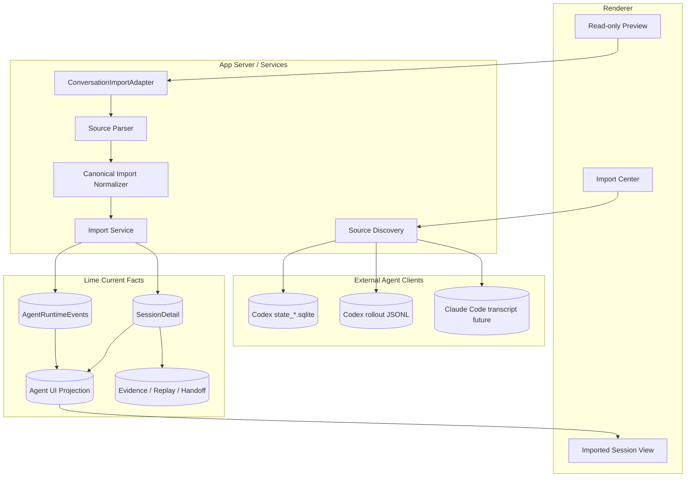
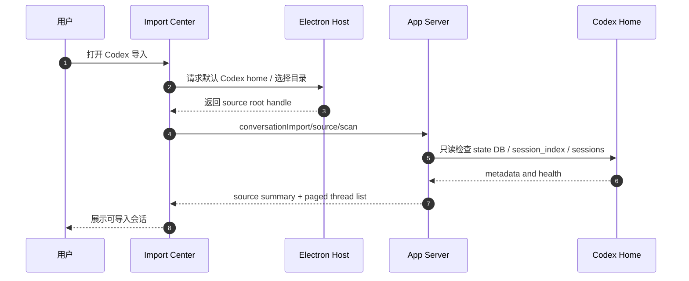
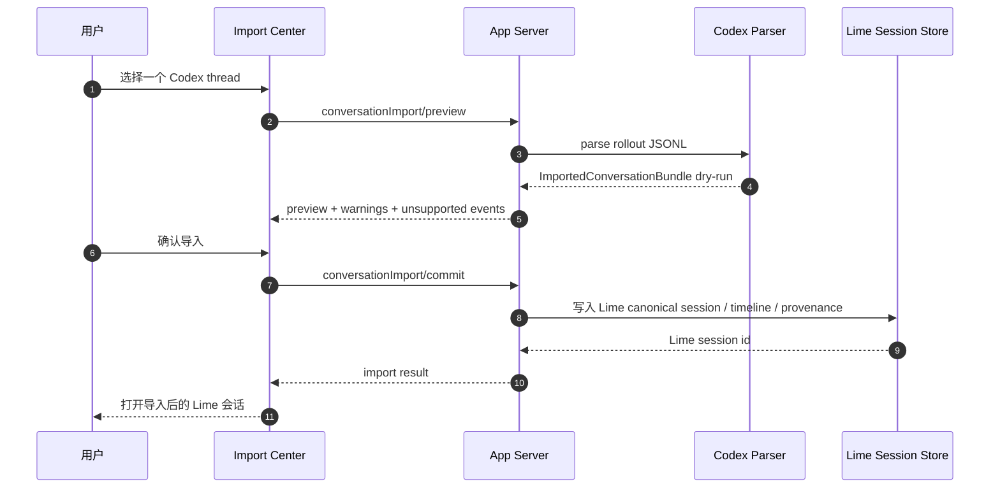
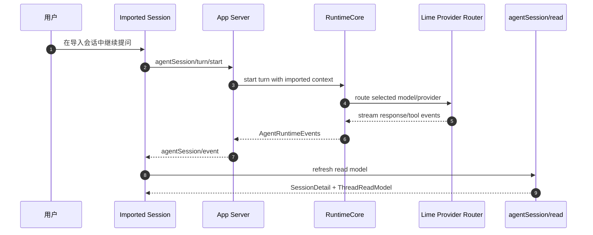
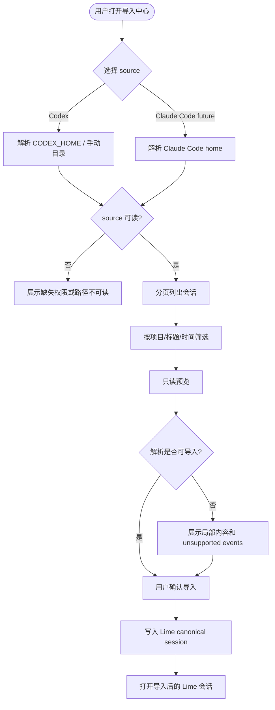
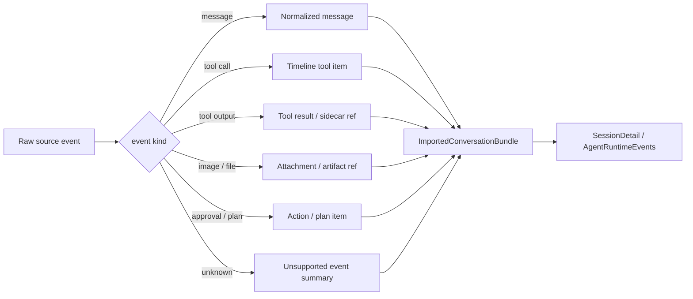

# Lime Codex 对话导入与跨 Agent 客户端兼容 PRD

## 1. 背景

Lime 的长期定位是做一个标准的桌面端 AI Agent 工作台：兼容 Codex 的对话模型与客户端能力，同时在 Lime 内部提供多模型、多模态、Agent UI、Evidence、Replay、Workspace 和 App Server 能力。Codex 是当前最适合作为主对标对象的客户端：其开源仓库可读、可验证，具备 Thread Store、rollout JSONL、SQLite metadata、tool loop、approval、sandbox、subagent、plan 和 App Server 等完整工程实践。

用户本机已经存在大量通过 Codex 处理 Lime 项目的会话。当前可见事实包括：

- Codex 会话索引主要在 `~/.codex/state_5.sqlite` 的 `threads` 表。
- 会话正文主要在 `~/.codex/sessions/**/rollout-*.jsonl` 与 `~/.codex/archived_sessions/**/rollout-*.jsonl`。
- `~/.codex/history.jsonl` 记录 prompt history，不等同于完整 thread transcript。
- 近期 Lime 相关 Codex 会话数量已经足以作为真实 dogfood 样本。

这给 Lime 一个机会：通过导入 Codex 对话，把 Codex 客户端架构中的优秀部分蒸馏成 Lime 的产品能力，而不是只停留在文档研究或手工对照。

同时，用户未来也需要导入 Claude Code 对话。但 Claude Code 不适合作为 Lime 的主架构来源：它不是当前可系统性审计的完整开源客户端内核。Lime 可以兼容 Claude Code 的历史资产和用户迁移路径，但主线仍以 Codex 为主对标对象。

## 2. 一句话目标

让 Lime 支持导入 Codex 对话，并为 Claude Code 等其他 Agent 客户端保留 importer 扩展点；所有外部会话最终统一进入 Lime `SessionDetail / AgentRuntimeEvents / Agent UI projection` 主链，继续享受 Lime 的多模型、多模态和桌面工作台能力。

```text
Codex 是主对标对象
Claude Code 是兼容导入对象
Lime SessionDetail 是唯一内部事实源
```

## 3. 问题陈述

当前 Lime 与 Codex 对齐仍存在几个缺口：

| 问题 | 影响 |
| --- | --- |
| Codex 会话资产在 Lime 外部 | Lime 无法复用用户已经完成的调研、修复、发布、截图分析和 evidence。 |
| 只能靠人工查看 Codex 历史 | 无法按项目、时间、状态、工具调用、artifact 或图片引用检索。 |
| Codex 架构学习缺少产品闭环 | 研究 Thread Store / rollout JSONL 后，无法沉淀为 Lime 可用能力。 |
| 多模型优势没有接到历史会话 | 用户无法把 Codex 会话导入后切换 Claude、Gemini、DeepSeek、Kimi、Qwen 等继续分析。 |
| Claude Code 兼容边界不清 | 若过早对标闭源实现，容易稀释“主对标 Codex”的路线。 |

核心问题不是“读取几个 JSONL 文件”，而是建立一条可治理的跨客户端导入主链：外部 transcript 只作为输入，Lime current read model 才是产品事实源。

## 4. 产品目标

### 4.1 业务目标

1. 让用户在 Lime 内查看、搜索、筛选并导入 Codex 对话。
2. 让用户把 Codex 对话导入为 Lime 会话后继续使用 Lime 的多模型、多模态能力。
3. 让 Codex 会话中的图片、工具调用、文件变更、approval、plan、subagent 和 evidence 信息尽量映射到 Lime timeline。
4. 让 Lime 团队用真实 Codex 会话反向校验 AgentRuntime、AgentUI、Evidence 和 DB 瘦身路线是否足够通用。
5. 为 Claude Code 导入保留 importer 合同，但不改变 Codex-first 的主线。

### 4.2 工程目标

1. 建立 `ConversationImportSource` / `ConversationImportAdapter` 抽象。
2. 首期实现 Codex importer：读取 SQLite `threads` metadata 与 rollout JSONL。
3. 把外部会话转换为 Lime canonical import bundle，再写入或投影为 `SessionDetail`。
4. 保留 provenance：source client、source thread id、source path、imported at、source cwd、provider、model、original event ids。
5. 所有读取走 App Server / services；renderer 不直接读取 `~/.codex` 或 Claude Code 本地目录。
6. 不写回 Codex 或 Claude Code 原始数据。
7. 不新增第二套 transcript truth；导入结果必须进入 `SessionDetail -> agentSession/read -> projection/evidence/export` 主链。

## 5. 非目标

本阶段不做：

1. 不双向同步 Codex / Claude Code 会话。
2. 不修改、归档、删除或重命名 Codex 原始文件。
3. 不复刻 Codex UI。
4. 不把 Codex SQLite 或 rollout JSONL 作为 Lime 的运行时事实源。
5. 不基于 Claude Code 闭源内部假设设计核心架构。
6. 不承诺导入后可恢复原客户端的完整运行时上下文。
7. 不把导入能力做成 renderer 文件扫描。
8. 不把 prompt history `history.jsonl` 当完整会话导入，只可作为搜索建议或辅助线索。

## 6. 用户画像

| 用户 | 诉求 | Lime 应提供的价值 |
| --- | --- | --- |
| Lime 开发者 | 把过去通过 Codex 做过的 Lime 修复、发布、调研找回来。 | 按项目/标题/时间搜索并导入历史会话，形成可复用 evidence。 |
| Agent 产品负责人 | 对齐 Codex 能力并蒸馏架构。 | 用真实 Codex transcript 评估 Lime AgentRuntime 与 AgentUI 缺口。 |
| 重度 AI Coding 用户 | 不想被单一客户端锁定。 | Codex 对话导入后可在 Lime 中用其他模型继续。 |
| 多模型用户 | 希望用 Claude/Gemini/DeepSeek/Kimi/Qwen 复核 Codex 输出。 | 导入后使用 Lime provider router 发起新 turn。 |
| 企业/团队用户 | 需要迁移历史、审计证据和项目上下文。 | 外部对话转为 Lime evidence / replay / handoff 资产。 |

## 7. 用户故事

### 7.1 导入 Codex 项目会话

作为 Lime 开发者，
当我打开 Lime 的“导入 Codex 对话”入口时，
我希望看到当前机器上与 `/Users/coso/Documents/dev/ai/aiclientproxy/lime` 相关的 Codex 会话，
这样我可以快速找回过去围绕 Lime 的修复、发布、截图反馈和路线图讨论。

验收：

1. 列表展示标题、更新时间、cwd、source、model provider、是否 archived。
2. 支持按项目路径、标题、时间、source client 筛选。
3. 不读取或展示 `auth.json`、token、secret 等敏感文件。

### 7.2 预览并选择导入内容

作为用户，
当我点击某个 Codex 会话时，
我希望先看到只读预览，包括消息、工具调用、图片引用、文件变更和关键事件，
这样我能判断是否值得导入。

验收：

1. 预览读取 rollout JSONL，不写入 Lime session。
2. 解析失败的 event 以 `unsupported` 标注，不阻塞其他内容展示。
3. 大输出默认折叠，并保留原始事件引用。

### 7.3 导入为 Lime 会话并继续

作为多模型用户，
当我导入一个 Codex 会话后，
我希望能在 Lime 中继续提问，并选择不同 provider / model，
这样我可以用 Lime 的多模型能力复核、扩展或完成后续工作。

验收：

1. 导入后生成 Lime session id。
2. 原始 Codex 内容标注为 imported history。
3. 新 turn 走 Lime `agentSession/turn/start` 主链。
4. 新 turn 不写回 Codex 原始目录。

### 7.4 导出 evidence / replay

作为开发者，
当我把 Codex 会话导入 Lime 后，
我希望能导出 evidence pack 或 replay case，
这样历史工作可以进入 Lime 的验证、复盘和交接链路。

验收：

1. evidence pack 包含 source provenance。
2. replay case 使用 Lime canonical events，不直接依赖 Codex 文件路径。
3. source 文件缺失时仍保留已导入快照，不影响 Lime session 可读性。

### 7.5 未来导入 Claude Code

作为从 Claude Code 迁移过来的用户，
当 Lime 支持 Claude Code importer 时，
我希望能以相同方式预览、选择和导入历史对话，
这样我的历史资产不会被单一客户端锁住。

验收：

1. Claude Code importer 实现同一 adapter 合同。
2. UI 不新增一套 Claude Code 专属会话模型。
3. 不能因为 Claude Code 私有格式不完整而污染 Lime canonical schema。

## 8. 目标体验

### 8.1 信息架构

```text
设置 / 数据迁移
  -> 对话导入
      -> Codex
          -> 自动发现 CODEX_HOME
          -> 项目会话筛选
          -> 会话预览
          -> 导入为 Lime 会话
      -> Claude Code
          -> 后续 importer
```

### 8.2 列表字段

| 字段 | 来源 | 说明 |
| --- | --- | --- |
| `sourceClient` | importer | `codex` / `claude_code` / future。 |
| `sourceThreadId` | Codex `threads.id` 或 source transcript id | 原客户端会话 id。 |
| `title` | Codex `threads.title` / 首条用户消息 | 列表标题。 |
| `updatedAt` | source metadata | 排序依据。 |
| `cwd` | source metadata | 项目路径筛选依据。 |
| `modelProvider` | source metadata | 原执行 provider。 |
| `rolloutPath` | Codex metadata | 只在 detail / debug 展示。 |
| `importStatus` | Lime import store | `not_imported / imported / updated_source / missing_source`。 |

### 8.3 预览字段

| 区域 | 内容 |
| --- | --- |
| Overview | 标题、source、cwd、时间、provider、事件数、解析状态。 |
| Conversation | user / assistant / system / developer 消息。 |
| Tool Timeline | tool call、approval、shell、apply patch、browser、image reference。 |
| Artifacts | 文件变更、截图、图片、sidecar refs。 |
| Provenance | 原始路径、source event id、import adapter version。 |

## 9. 核心需求

### 9.1 Source discovery

| 编号 | 需求 | 验收 |
| --- | --- | --- |
| FR-01 | 自动发现 Codex home，默认读取 `CODEX_HOME` 或平台默认 `.codex`。 | macOS / Windows 路径通过统一封装解析，不硬编码用户目录。 |
| FR-02 | 支持手动选择 Codex home。 | Electron Desktop Host 只提供目录选择和权限桥接。 |
| FR-03 | 只读取允许的 metadata / rollout / archive 文件。 | 明确排除 auth、config secret、token、credentials。 |
| FR-04 | 支持只读 health check。 | 返回 Codex home 是否存在、state DB 是否可读、rollout 文件数量。 |

### 9.2 Codex index reader

| 编号 | 需求 | 验收 |
| --- | --- | --- |
| FR-05 | 读取 Codex `threads` metadata。 | 能列出 id、title、created/updated、source、model_provider、cwd、archived、rollout_path。 |
| FR-06 | 支持 fallback 到 `session_index.jsonl`。 | SQLite 不可读时仍能列出旧索引中的基础会话。 |
| FR-07 | 支持 archived sessions。 | archived 会话可筛选，不默认隐藏。 |
| FR-08 | 支持项目路径筛选。 | 可按 cwd exact / prefix / contains 筛选。 |

### 9.3 Codex rollout parser

| 编号 | 需求 | 验收 |
| --- | --- | --- |
| FR-09 | 解析 rollout JSONL 基础事件。 | 支持 `session_meta`、user input、assistant output、function call、function call output。 |
| FR-10 | 保留未知事件。 | 未知事件进入 `unsupportedEvents` summary，不丢原始 source ref。 |
| FR-11 | 大输出折叠和 sidecar 化。 | 超过阈值的 output 不直接塞入 UI 全量文本。 |
| FR-12 | 图片引用识别。 | `[Image #n]`、image payload、data URL 或 file ref 尽量映射为 attachment / artifact ref。 |

### 9.4 Canonical import bundle

| 编号 | 需求 | 验收 |
| --- | --- | --- |
| FR-13 | 定义 `ImportedConversationBundle`。 | 包含 source metadata、normalized messages、timeline items、artifacts、unsupported events。 |
| FR-14 | 导入时生成 Lime provenance。 | 每条 imported item 带 source client、source event id、source path hash。 |
| FR-15 | 支持 dry-run。 | dry-run 返回将创建的 session/messages/items 数量，不写库。 |
| FR-16 | 支持幂等导入。 | 同一 source thread 重复导入不重复创建内容，除非用户选择新副本。 |

### 9.5 写入 Lime 主链

| 编号 | 需求 | 验收 |
| --- | --- | --- |
| FR-17 | 导入结果进入 Lime `SessionDetail`。 | `agentSession/read` 可读取导入会话。 |
| FR-18 | 导入 timeline 可被 Agent UI projection 消费。 | 会话详情、tool timeline、artifact refs 可渲染。 |
| FR-19 | 导入后可继续 turn。 | 新 turn 走 Lime runtime，不写回外部 source。 |
| FR-20 | evidence/export 可消费导入会话。 | evidence pack 带 imported source provenance。 |

### 9.6 Claude Code importer extension

| 编号 | 需求 | 验收 |
| --- | --- | --- |
| FR-21 | importer 合同不绑定 Codex。 | `ConversationImportAdapter` 支持 `codex` 与 future `claude_code`。 |
| FR-22 | Claude Code 只作为兼容源。 | PRD、代码和 UI 中不把 Claude Code 私有格式作为 Lime schema 来源。 |
| FR-23 | source-specific parser 隔离。 | Claude Code parser 失败不影响 Codex importer。 |

## 10. 非功能需求

| 类别 | 要求 |
| --- | --- |
| 安全 | 只读外部目录；敏感文件 denylist；不上传原始 transcript；不写回 source。 |
| 隐私 | 导入预览只在本地处理；用户确认前不进入 Lime session store。 |
| 可恢复 | 解析失败要局部降级，不能让整个 source 扫描失败。 |
| 可测试 | Codex fixture、SQLite schema fixture、rollout JSONL fixture、unsupported event fixture。 |
| 跨平台 | CODEX_HOME / Claude home 解析必须走统一路径封装。 |
| 性能 | 大量会话列表分页；rollout detail lazy load；大输出延迟加载。 |
| 可观测 | import dry-run、import commit、parse warnings、unsupported events 有结构化 diagnostics。 |
| 本地化 | 新增 UI 文案必须覆盖 `zh-CN / zh-TW / en-US / ja-JP / ko-KR`。 |

## 11. 架构边界

### 11.1 总体架构图



### 11.2 分层原则

| 层 | 可以做 | 禁止做 |
| --- | --- | --- |
| Renderer | 展示 source 列表、预览、导入确认。 | 直接读 `~/.codex`、解析 rollout、读 SQLite。 |
| Electron Desktop Host | 目录选择、权限桥接、App Server sidecar 生命周期。 | 解析业务 transcript 或写 Lime session。 |
| App Server services | source discovery、parser、normalizer、import commit。 | 写回 Codex / Claude Code 原目录。 |
| Lime runtime | 继续 turn、生成新 events、evidence/replay。 | 把外部 source 文件当 runtime truth。 |
| Import adapters | source-specific parsing。 | 让 source-specific 类型泄露到 Lime canonical schema。 |

### 11.3 事实源边界

导入后的固定主链：

```text
External transcript
  -> ImportedConversationBundle
  -> Lime SessionDetail / AgentRuntimeEvents
  -> agentSession/read
  -> Agent UI projection
  -> evidence/export and agentSession/*/export
```

这条链路必须遵守 `internal/aiprompts/state-history-telemetry.md` 和 `internal/aiprompts/persistence-map.md`：

1. `SessionDetail` 是导入会话可读事实源。
2. `AgentRuntimeThreadReadModel` 是继续执行后的线程状态事实源。
3. Evidence / replay / review 只能消费同源 read model 与 export context。
4. 外部 transcript 只作为 migration/import source，不作为长期产品 fallback。

## 12. 时序图

### 12.1 扫描 Codex 会话



### 12.2 预览并导入



### 12.3 导入后继续对话



## 13. 流程图

### 13.1 导入决策流程



### 13.2 Source event 归一化流程



## 14. 数据模型草案

### 14.1 Import source summary

```ts
export interface ConversationImportSourceSummary {
  sourceClient: "codex" | "claude_code";
  sourceRoot: string;
  readable: boolean;
  detectedVersion?: string;
  threadCount?: number;
  warnings: string[];
}
```

### 14.2 Import thread summary

```ts
export interface ImportedThreadSummary {
  sourceClient: "codex" | "claude_code";
  sourceThreadId: string;
  title: string;
  createdAt?: string;
  updatedAt?: string;
  cwd?: string;
  source?: string;
  modelProvider?: string;
  archived?: boolean;
  sourcePath?: string;
  importStatus: "not_imported" | "imported" | "updated_source" | "missing_source";
}
```

### 14.3 Canonical import bundle

```ts
export interface ImportedConversationBundle {
  source: ImportedThreadSummary;
  adapterVersion: string;
  importedAt?: string;
  messages: ImportedMessage[];
  timelineItems: ImportedTimelineItem[];
  artifacts: ImportedArtifactRef[];
  unsupportedEvents: ImportedUnsupportedEvent[];
  diagnostics: ImportedConversationDiagnostic[];
}
```

这些接口只是 PRD 层草案；正式 schema 应落到 App Server protocol / TypeScript client 的 current schema 文件，并由 contract test 约束。

## 15. 成功指标

| 指标 | 目标 |
| --- | --- |
| Codex 会话发现率 | 能发现 `state_*.sqlite` 中可读 threads 的 95% 以上。 |
| Lime 项目筛选准确率 | cwd 指向 Lime repo 的会话可稳定筛选。 |
| 导入成功率 | 支持基础 message/tool/output 的 Codex rollout 导入成功率 95% 以上。 |
| 预览降级能力 | 未知事件不导致整条会话失败。 |
| 继续对话闭环 | 导入后至少一个会话可通过 Lime `agentSession/turn/start` 继续。 |
| Evidence 闭环 | 导入会话可导出 evidence pack，且包含 source provenance。 |
| 架构对齐收益 | 通过导入样本发现并登记 Lime AgentRuntime / AgentUI 与 Codex 的能力差距。 |

## 16. 验收标准

MVP 完成时必须满足：

- [ ] 新增 Codex source discovery，默认识别 `CODEX_HOME` 或平台默认 `.codex`。
- [ ] 可分页列出 Codex `threads` metadata。
- [ ] 可读取一个 rollout JSONL 并生成 read-only preview。
- [ ] 可 dry-run 显示将导入的 message / timeline / artifact / unsupported event 数量。
- [ ] 可 commit 导入为 Lime 会话，并通过 `agentSession/read` 读取。
- [ ] 导入会话可打开 Agent UI projection。
- [ ] 导入会话可继续新 turn，且新 turn 走 Lime runtime。
- [ ] evidence/export 能包含导入 provenance。
- [ ] renderer 不直接读取外部 source 文件。
- [ ] 结构测试覆盖敏感文件 denylist、unknown event、幂等导入、missing rollout。

## 17. 里程碑

| 阶段 | 目标 | 交付物 |
| --- | --- | --- |
| P0 | 事实源与 PRD 固定 | 本 PRD、Codex source inventory、schema 草案。 |
| P1 | Codex 只读索引 | source discovery、health check、thread list API、基础 UI 列表。 |
| P2 | Codex 预览 | rollout parser、preview API、unsupported event diagnostics。 |
| P3 | Lime 会话导入 | canonical bundle、dry-run、commit、SessionDetail read。 |
| P4 | 继续对话与 evidence | imported session 继续 turn、evidence/export provenance。 |
| P5 | Claude Code importer 准备 | importer contract 固化、Claude Code source inventory、fixture。 |

## 18. 风险与应对

| 风险 | 应对 |
| --- | --- |
| Codex 存储格式演进 | importer 带 adapter version；未知字段保留 diagnostics；优先读 schema 友好的 metadata。 |
| 外部 transcript 含敏感信息 | 默认本地处理；导入前预览；敏感文件 denylist；导出 evidence 时标注来源。 |
| 大会话导致 UI 卡顿 | 列表分页、detail lazy load、大输出 sidecar 或折叠。 |
| 导入后事实源分裂 | 强制导入到 `SessionDetail / AgentRuntimeEvents`；外部 source 只作 provenance。 |
| Claude Code 闭源导致误判 | Claude Code 只作为 importer source；不从闭源行为推导核心 schema。 |
| 过早扩大范围 | Codex importer 先闭环；Claude Code 只在 adapter 合同稳定后进入。 |

## 19. 开放问题

1. 导入后的会话是否默认进入当前项目空间，还是进入单独的“Imported”空间？
2. 原始 rollout 中的 base instructions 是否完整展示，还是默认折叠为 provenance？
3. 大输出阈值和 sidecar 策略沿用 Runtime Event Log 方案，还是先做 UI 折叠？
4. 导入后继续 turn 时，默认上下文窗口包含多少 imported history？
5. 是否提供“导入为只读 archive”和“导入为可继续 session”两种模式？

## 20. 推荐下一刀

第一刀做 P1：Codex 只读索引。

范围：

1. 只实现 `codex` source discovery 与 health check。
2. 只读取 `state_*.sqlite threads`、`session_index.jsonl` 和 rollout path metadata。
3. 只展示列表和筛选，不解析完整 rollout。
4. 不写 Lime session。

主线收益：

1. 立刻证明 Lime 能发现用户真实 Codex 会话资产。
2. 以最小风险固定敏感文件边界和跨平台路径边界。
3. 为 P2/P3 parser 与导入写入提供真实样本。

完成度口径：P1 完成后，Codex import 总体目标约 `25%`；P3 完成后达到 `70%`；P4 完成后达到 `90%`；P5 进入 Claude Code importer 后作为跨客户端兼容扩展，不阻塞 Codex-first 主线完成。
