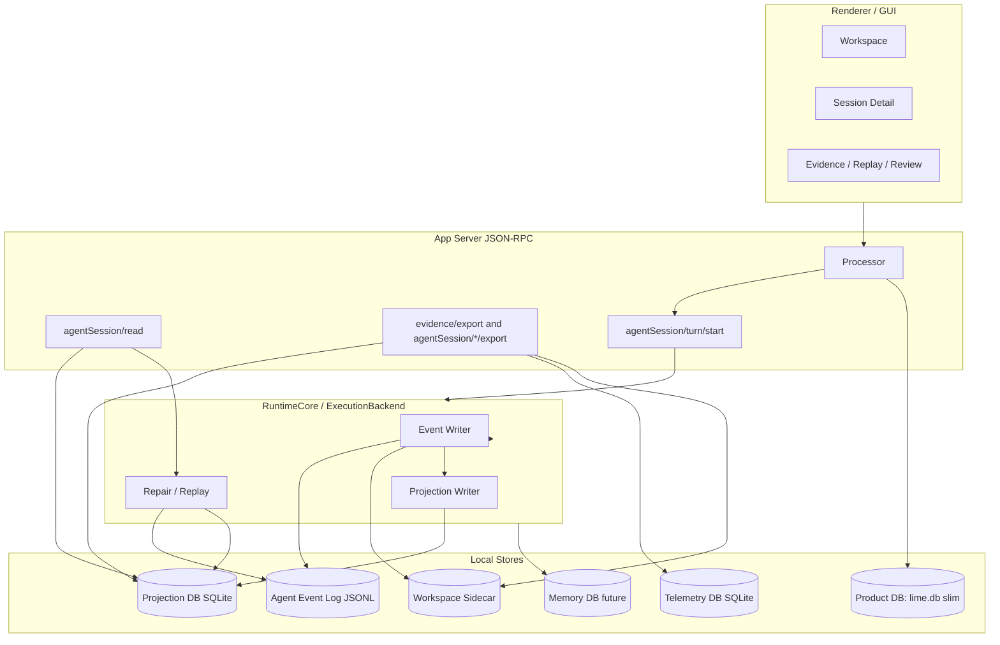
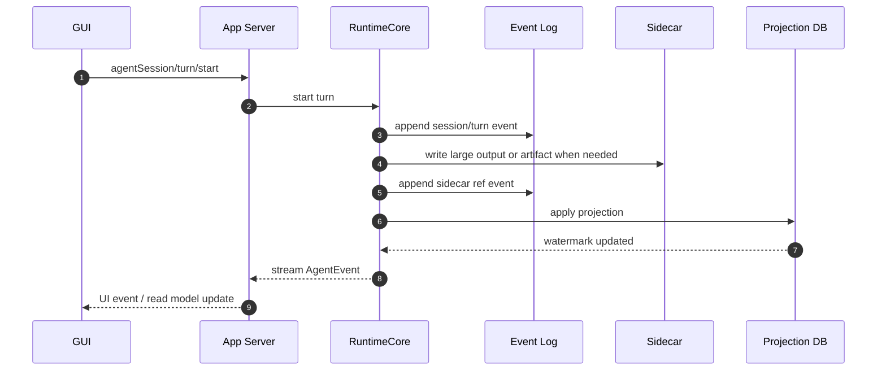
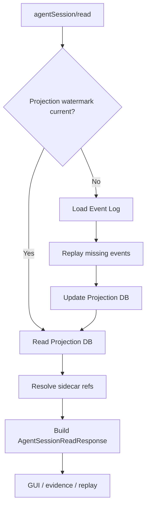
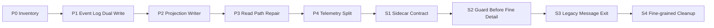
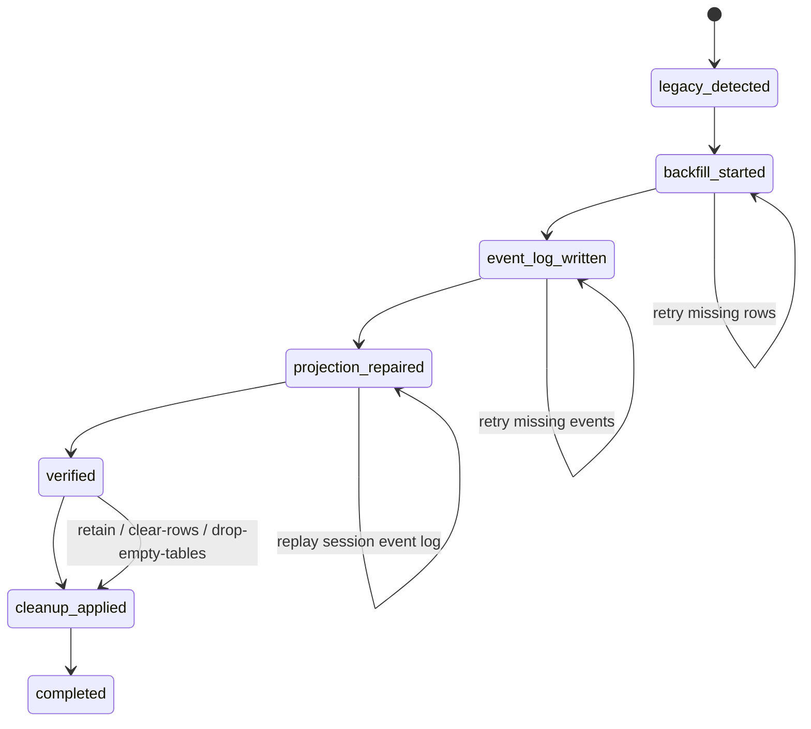

# Lime DB 瘦身与 Codex-aligned 存储架构 PRD

## 1. 背景

Lime 当前的 `lime.db` 已经从产品主库膨胀为多种事实源的混合体：

1. 产品配置：provider、API key、model registry、MCP、plugin、settings。
2. 用户资产：workspace、content、persona、material、browser profile、publish config。
3. Agent 会话：`agent_sessions`、`agent_messages`。
4. Agent timeline：`agent_thread_turns`、`agent_thread_items`。
5. Runtime projection：turn outcome、incident、managed objective、automation job。
6. 旁路统计：usage、request telemetry、history / evidence / replay 的派生查询。

这种结构的问题不在 SQLite 本身，而在主库职责过宽：

1. 高频 Agent event 写入和低频产品设置共用同一个主库。
2. 长 transcript、大输出和 projection 混在同一数据库事实源。
3. `Arc<Mutex<rusqlite::Connection>>` 单连接模型让写入热点和 GUI 查询互相影响。
4. DB 损坏、锁竞争或 schema 迁移失败会扩大到整机产品体验。
5. 旧 Agent / agent message / timeline 多条路径长期并存，事实源不清。

Codex 的路线更适合 Agent runtime：

1. append-only JSONL rollout 是 durable replay。
2. SQLite state DB 是 metadata index，可通过 rollout 修复或重建。
3. logs、goals、memories 拆成独立 DB，降低锁竞争和恢复半径。
4. 读 history 时验证 SQLite 指向的 durable rollout，不能只信索引。

Lime 目标不是照搬 Codex CLI 的文件布局，而是采用同一类存储原则：**transcript 可回放，projection 可重建，主 DB 只保留合理产品数据。**

详细对比见 [codex-comparison.md](./codex-comparison.md)。本 PRD 的固定取舍是：Event log 使用 JSONL；Projection DB 使用独立 SQLite 文件；旧 `agent_messages` 不保留为长期产品 fallback。

## 2. 产品目标

1. `lime.db` 瘦身为产品主库，只保留低频、关系型、需要事务一致性的产品数据。
2. 新 Agent runtime transcript 不再以 `agent_messages` 或 `agent_thread_items.payload_json` 为唯一事实源。
3. Agent history 使用 append-only durable log，支持 replay、repair、export、debug。
4. Session list、timeline、thread read model 使用 SQLite projection，允许删除后重建。
5. Request telemetry、logs、大输出、file checkpoint、artifact content 拆出主库。
6. GUI 体验不因底层瘦身而退化：会话列表、详情、运行态、evidence/replay 继续通过 App Server JSON-RPC 获取。
7. 每一阶段都有守卫，防止继续向 `lime.db` 追加 runtime transcript 事实。
8. 旧 `agent_messages` 迁移后删除旧表读写路径，不保留为产品侧兼容数据库。
9. 用户输入也属于 runtime transcript 事实，必须以 JSONL durable event 持久化；内存 `turn_inputs` 只是运行时缓存。

## 3. 工程目标

1. 建立存储分层：Product DB、Event Log、Projection DB、Telemetry DB、Sidecar、Memory DB。
2. 定义 Agent event envelope、event payload、sidecar ref、projection schema。
3. 新增 event writer / reader / replay / projection writer / repair 检查。
4. 让 `agentSession/read`、`evidence/export`、`agentSession/*/export` 共享同一 load context。
5. 将 `agent_sessions / agent_thread_turns / agent_thread_items` 从事实源降级为 projection。
6. 将 `agent_messages` 降级为 migration source；backfill/export 完成后删除，不保留长期兼容读取。
7. 为 deprecated 存储路径增加治理扫描和 contract guard。
8. 所有路径解析走 `app_paths` 或 App Server data root，不硬编码 macOS / Windows 目录。
9. 新会话 turn start 必须写入 `message.created` durable event，Projection repair / shared load context 必须能从 event log 恢复用户输入。

本轮可交付边界只包含 Product DB、JSONL Event Log、Projection DB、Telemetry DB、Sidecar 和 legacy cleanup。Memory DB / Goals DB 只作为 Codex 对照中的长期方向，不进入本轮实现，不新增 store、API、mock 或假入口。

## 4. 非目标

1. 不把所有产品数据迁出 SQLite。
2. 不引入远程数据库作为本地桌面产品默认依赖。
3. 不让前端直接读 event log 文件。
4. 不恢复 `lime-rs/src/**`、旧 Tauri command 或 legacy wrapper。
5. 不让生产路径依赖 mock backend 保存 runtime history。
6. 不直接丢弃旧会话语义；旧数据必须通过一次性 migration/backfill/export 进入 event log 或用户导出文件后再删除旧 `agent_messages` 读写路径。
7. 不支持多 App Server 进程并发写同一份 Projection / Telemetry DB。当前假设是 Desktop 单实例托管、单 writer；若未来需要多实例，再单独引入 lease / claim 抢占机制（参考 Codex `try_claim_backfill`），不在本轮范围。
8. 独立 Memory DB / Goals DB 不在本轮范围。架构图与目录结构中的 `MemoryDb` / `memory/` 是长期占位，不是本路线图交付物；当前 memory 仍读 `lime.db`（`local_data_source/unified_memory.rs`）。拆独立 store 须另起 roadmap，本轮不得据此新增假入口。

## 5. 一句话架构

后续数据主链固定为：

`Agent append-only log -> Projection writer -> Projection DB -> App Server read/export -> GUI`

产品主库固定为：

`Product DB -> provider / workspace / user assets / app settings`

大对象主链固定为：

`Event ref -> sidecar content -> integrity check -> restore / export`

遥测主链固定为：

`RequestLog -> Telemetry DB -> evidence summary / dashboard projection`

## 6. 数据保留策略

### 6.1 `lime.db` 保留

| 数据                   | 表 / 模块                                               | 保留原因                                   | 备注                                              |
| ---------------------- | ------------------------------------------------------- | ------------------------------------------ | ------------------------------------------------- |
| Provider metadata      | `api_key_providers`                                     | 产品设置与 runtime provider selection 需要 | current                                           |
| API key                | `api_keys`                                              | 本地加密凭证事实源                         | current，后续可独立 credential DB，但不是本轮目标 |
| Model registry         | `model_registry`                                        | 本地模型能力与展示                         | current                                           |
| MCP / prompts / skills | `mcp_servers`、`prompts`、`skills`、`skill_repos`       | 低频配置                                   | current                                           |
| Workspace              | `workspaces`                                            | 产品对象                                   | current                                           |
| Browser profiles       | `browser_profiles`、`browser_environment_presets`       | 产品配置                                   | current                                           |
| User assets            | `contents`、`personas`、`materials`、`outline_nodes` 等 | 创作产品资产                               | current，可后续按领域拆库                         |
| Plugin registry        | `installed_plugins`                                     | 本地安装索引                               | current                                           |
| Settings               | `settings`                                              | 低频 KV 配置                               | current                                           |

### 6.2 从 `lime.db` 迁出或降级

| 数据                        | 当前表 / 路径                                    | 目标                                          | 目标载体                 |
| --------------------------- | ------------------------------------------------ | --------------------------------------------- | ------------------------ |
| Agent transcript            | `agent_messages`                                 | migration source only; no long-term retention | Event log                |
| Agent turn/item timeline    | `agent_thread_turns`、`agent_thread_items`       | projection only                               | Projection DB            |
| Runtime event payload       | `payload_json`                                   | bounded summary only                          | Event log + sidecar      |
| Turn outcome / incident     | `agent_turn_outcomes`、`agent_thread_incidents`  | projection only                               | Projection DB            |
| Request telemetry           | `RequestLog` 相关旁路                            | 独立遥测域                                    | Telemetry DB             |
| File checkpoint content     | `payload_json` / sidecar mixed                   | sidecar truth                                 | Workspace sidecar        |
| Large output                | event payload / DB JSON                          | sidecar ref                                   | Output sidecar           |
| Scheduled runtime job trace | `automation_jobs`、`agent_runs` 中 runtime trace | 产品 job metadata 保留，执行 trace 迁出       | Event log / Telemetry DB |

### 6.3 删除候选

| 数据                                                 | 分类                | 删除条件                                    |
| ---------------------------------------------------- | ------------------- | ------------------------------------------- |
| `provider_pool_credentials`                          | deprecated          | 运行时不再读取，历史迁移完成，守卫通过      |
| general chat legacy tables                           | deprecated / compat | 迁移到 current session 或明确不再支持后删除 |
| Agent session store 直接写 `agent_messages` 的新逻辑 | deprecated          | event log writer 接管新会话                 |
| 文档中的 `lime-rs/src/**` current 锚点               | dead reference      | 文档修正到 `lime-rs/crates/**`              |

## 7. 目标架构图



图中 `Memory DB future` 仅表达长期分层方向；本轮不得因为该节点新增 memory store 或 goals store。当前 memory 事实源仍按现有 `lime.db` 路径运行，后续拆库必须另起路线图。

## 8. 运行时写入时序



原则：

1. 先写 durable log，再写 projection。
2. sidecar 写入必须在引用事件提交前完成。
3. projection 失败不能伪造成 transcript 已保存失败；repair 可以重放 event log。

## 9. 读取与修复流程



读取规则：

1. GUI 永远走 App Server JSON-RPC，不直接读取文件。
2. projection 缺失时 session-scoped repair，不做全库阻塞。
3. sidecar 缺失返回 `contentStatus=missing`，不伪造内容。
4. legacy session 没有 event log 时，只允许迁移工具从 `agent_messages` 做一次性 backfill/export；产品读路径不保留长期 fallback。

## 10. 迁移流程



每一阶段只推进一条主链，不做无关重构。

### 10.1 当前实现与目标对照

本节把 PRD 目标和 2026-06-15 当前实现对齐，避免后续继续围绕已经完成的骨架打转。

| 能力                                 | 当前 owner / 代码路径                                                                                       | 目标 owner                                                      | 当前状态                                                                              | 剩余动作                                                          | 验证入口                                                                                                     |
| ------------------------------------ | ----------------------------------------------------------------------------------------------------------- | --------------------------------------------------------------- | ------------------------------------------------------------------------------------- | ----------------------------------------------------------------- | ------------------------------------------------------------------------------------------------------------ |
| JSONL Event Log                      | `app-server/src/runtime/event_log.rs`、`RuntimeCore` append runtime events                                  | `StorageRoots.event_log_root` 下 per-session JSONL              | `current`，新会话用户输入已写 `message.created` durable event                         | S3 继续承接 legacy backfill；后续补 retention/compression 策略    | `cargo test --manifest-path "lime-rs/Cargo.toml" -p app-server event_log`、`smoke:claw-chat-current-fixture` |
| Projection DB                        | `app-server/src/runtime/projection_store.rs`、`projection_repair.rs`                                        | `<data-root>/runtime/projection_1.sqlite`                       | `current`，独立文件 + session-scoped repair 已落地；中文 UTF-8 截断 panic 已修复      | S5 补统一 pragma open helper 与 corruption recovery               | `cargo test --manifest-path "lime-rs/Cargo.toml" -p app-server projection_store`                             |
| Telemetry DB                         | `infra/src/telemetry/store.rs`、App Server 注入                                                             | `<data-root>/runtime/telemetry_1.sqlite`                        | `current` 最小骨架；真实 provider/request 接线仍是 P4-b 证据项                        | S5 补统一 pragma open helper；P4-b 只基于真实 request source 接线 | `cargo test --manifest-path "lime-rs/Cargo.toml" -p app-server telemetry`、`evidence/export` 定向测试        |
| Sidecar                              | `app-server/src/runtime/sidecar_store.rs`、artifact / file checkpoint writer                                | data root sidecar + workspace `.lime/` sidecar                  | `current` 骨架已完成，大正文不再写回 Product DB truth                                 | S2 继续扫描裸 snapshot file 与缺少 checksum 的 ref                | `npm run governance:legacy-report`、sidecar writer 定向测试                                                  |
| `agent_messages` legacy backfill     | `agent/src/session_store.rs`、`services/src/agent_session_store/legacy_conversation.rs`、历史 smoke fixture | JSONL Event Log + Projection DB                                 | `compat`，只允许 migration/backfill/export/test fixture 输入                          | S3 实现幂等状态机并收窄白名单；S4 清旧 DAO/schema 引用            | `npm run smoke:agent-session-history-electron-fixture`                                                       |
| `agent_messages` 产品 fallback       | 旧 `AgentDao` / `ChatDao` 消息读写 API                                                                      | 无长期 owner                                                    | `dead`，不保留产品侧 fallback；`AgentDao` / `ChatDao` 上层回流已封为 `dead-candidate` | 旧 DAO 物理退场、schema drop migration                            | `npm run governance:legacy-report`、`legacySurfaceCatalog.test.ts` 定向过滤                                  |
| `agent_thread_items.payload_json`    | `core/src/database/dao/agent_timeline_payload.rs` bounded projection                                        | Event Log + Sidecar truth；Product DB 只保留 bounded projection | `compat`，新写入已 bounded，不再承接大正文 truth                                      | S4 处理旧行读取与历史表退场                                       | `cargo test --manifest-path "lime-rs/Cargo.toml" -p lime-core agent_timeline_payload`                        |
| `current_timeline` bridge            | `app-server/src/local_data_source/current_timeline.rs`                                                      | Projection DB reader                                            | `compat`，只保障旧 GUI projection 过渡                                                | S4 切到 projection reader 后删除 bridge                           | App Server read/list 定向测试                                                                                |
| 迁移源 Product DB 清理               | `core/src/product_db_migration_cleanup.rs`、App Server CLI/env                                              | Product DB migration cleanup policy                             | `current`，`retain / clear-rows / drop-tables / delete-file` 已配置化                 | 真实用户库手工删除仍必须另行确认                                  | `cargo test --manifest-path "lime-rs/Cargo.toml" -p app-server parse_args`                                   |
| 运行时路径                           | `StorageRoots`、Electron sidecar `--data-dir`                                                               | Electron userData 派生 App Server data root                     | `current`，runtime durable root 未发现平台路径散落                                    | S2 继续守卫 `dirs::*`、`~/.lime`、repo/temp durable 写入回流      | `npm run governance:legacy-report`                                                                           |
| DB open pragma / corruption recovery | per-call `rusqlite::Connection::open(path)`                                                                 | 统一 `open_connection` helper + recoverable open                | `missing`，已在 §13.8 / §13.9 作为 S5 目标定义                                        | 下一刀可独立实现，不改变数据模型                                  | S5 定向 Rust 测试                                                                                            |
| Event log retention / compression    | 无压缩、无 prune                                                                                            | cold JSONL compression 或显式 no-prune debt                     | `known-debt`，不能误判为已治理                                                        | S5 先登记 no-prune/no-compression debt，再决定是否实现 `.zst`     | 文档守卫 + reader 兼容测试                                                                                   |

## 11. 目标代码目录结构

新增命名不使用 `lime` 品牌前缀，按领域命名。建议结构：

```text
lime-rs/crates/
  core/
    src/
      database/
        schema.rs                         # Product DB schema; runtime projection 表逐步迁出
        product_schema.rs                 # 后续拆分候选：产品主库 schema
        projection_schema.rs              # 迁移期可选：projection 表声明
      app_paths.rs                        # data root / runtime subdir 解析
  app-server/
    src/
      runtime/
        event_log.rs                      # JSONL append/read facade
        projection_store.rs               # event -> read model projection in projection_1.sqlite
        projection_repair.rs              # watermark / session scoped repair
        load_context.rs                   # read/export shared context
      file_checkpoint.rs                  # existing; only consumes sidecar refs
      file_checkpoint_snapshot.rs         # existing; snapshot store
      local_data_source/
        current_timeline.rs               # compat -> projection reader
  agent/
    src/
      session_store.rs                    # migration-only source; no new transcript truth
      event_backfill.rs                   # legacy session -> event log migration, then drop old table
  infra/
    src/
      telemetry/
        request_log_store.rs              # telemetry DB boundary
  memory/
    src/                                  # independent memory DB boundary
```

可选新增 crate：

```text
lime-rs/crates/event-log/                 # 如果 app-server runtime 模块变大，再独立成 crate
lime-rs/crates/projection-store/          # 如果 projection writer 被多个 runtime 复用，再独立
```

新增 crate 时不得添加 `lime-` / `lime_` 品牌前缀，除非 workspace 历史命名强制要求，并在执行计划说明退出条件。

## 12. 平台路径与文件落盘规范

### 12.1 设计依据

1. Codex 本地实现的关键点不是某个固定目录名，而是：启动期解析一个明确的 `codex_home / sqlite_home`，之后 `StateRuntime`、`LocalThreadStore`、rollout reader/writer 都只在该 root 下 `join(...)` 子路径；JSONL rollout 是 durable replay，SQLite 只是 metadata / projection / logs / goals / memories 等分域 DB。
2. Electron 官方 `app.getPath("userData")` 语义是应用级配置与用户数据目录；默认来自 `appData + appName`。官方同时提醒不建议把大文件直接写在 `userData`，并建议应用自己的文件放到 `userData` 子目录，避免和 Chromium 目录冲突。
3. Apple 文件系统指南要求自动生成、由应用管理的支持文件放在 `Application Support`；可重建缓存放 `Caches`；临时文件放 `tmp`，不能依赖其跨启动持久；`Documents` / `Desktop` 只应放用户主动创建和管理的文档。
4. Windows 应通过 Known Folder / Electron / `dirs` 这类系统 API 获取目录。`RoamingAppData` 适合机器无关、需要随用户配置漫游的数据；`LocalAppData` 适合本机状态、缓存、大日志、DB、运行时 event 和临时文件。

结论：Lime 不在业务模块里判断 macOS / Windows 具体目录；只在 Desktop Host / App Server 启动边界解析根目录，并把根目录显式传给 Rust runtime。领域 store 只接受 `data_root`、`workspace_root`、`cache_root` 这类抽象 root。

参考依据：

1. Codex：`codex-rs/state/src/runtime.rs`、`codex-rs/state/src/lib.rs`、`codex-rs/thread-store/src/local/mod.rs`、`codex-rs/thread-store/src/local/read_thread.rs`。
2. Electron：[`app.getPath("userData") / app.getPath("sessionData")`](https://electronjs.org/docs/latest/api/app)。
3. Apple：[`Where to Put Application Files`](https://developer.apple.com/library/archive/documentation/MacOSX/Conceptual/BPFileSystem/Articles/WhereToPutFiles.html)、[`Accessing Files and Directories`](https://developer.apple.com/library/archive/documentation/FileManagement/Conceptual/FileSystemProgrammingGuide/AccessingFilesandDirectories/AccessingFilesandDirectories.html)。
4. Microsoft：[`KNOWNFOLDERID`](https://learn.microsoft.com/en-us/windows/win32/shell/knownfolderid)、[`CSIDL`](https://learn.microsoft.com/en-us/windows/win32/shell/csidl)。
5. Rust：[`dirs::data_dir`](https://docs.rs/dirs/latest/dirs/fn.data_dir.html)、[`dirs::data_local_dir`](https://docs.rs/dirs/latest/dirs/fn.data_local_dir.html)、[`dirs::cache_dir`](https://docs.rs/dirs/latest/dirs/fn.cache_dir.html)。

### 12.2 根目录策略

| 根目录                 | 来源                                                                                                                                                                                  | macOS 语义                                                                    | Windows 语义                                                                      | 可写内容                                                                   |
| ---------------------- | ------------------------------------------------------------------------------------------------------------------------------------------------------------------------------------- | ----------------------------------------------------------------------------- | --------------------------------------------------------------------------------- | -------------------------------------------------------------------------- |
| App data root          | Electron 托管时由 `app.getPath("userData")` 派生并通过 `--data-dir` 传给 App Server；CLI / 测试可用 `--data-dir` 或 `APP_SERVER_DATA_DIR`；否则回落 `app_paths::preferred_data_dir()` | 应落在应用专属 `Application Support` 语义目录下                               | 应优先落在本机用户 `LocalAppData` 语义目录下，避免高频 DB / event 随 Roaming 同步 | `lime.db` 产品主库、runtime event、projection、telemetry、logs、可重建索引 |
| Runtime root           | `<data-root>/runtime/`                                                                                                                                                                | App Support 下的应用托管运行时数据                                            | LocalAppData 下的本机运行时数据                                                   | `events/`、`projection_1.sqlite`、`telemetry_1.sqlite`、repair watermark   |
| Electron host root     | `<userData>/host/` 或现有 `userData` 下受控子目录                                                                                                                                     | Electron host 配置，不和 Chromium `Cache` / `GPUCache` / `Local Storage` 混写 | 同左                                                                              | browser connectors、host config、模型下载索引                              |
| Workspace sidecar root | `<workspace-root>/.lime/`                                                                                                                                                             | 项目随行文件，只写用户选择的 workspace                                        | 同左                                                                              | artifact、file checkpoint、项目级 restore snapshot                         |
| Cache root             | Electron `app.getPath("sessionData")` / `app.getPath("logs")` / 系统 cache API / `dirs::cache_dir()`                                                                                  | `Caches` 语义，必须可重建                                                     | LocalAppData / cache 语义，必须可重建                                             | Chromium session cache、下载缓存、临时索引                                 |
| Temp root              | 系统 temp API                                                                                                                                                                         | `tmp` 语义，不保证持久                                                        | `%TEMP%` 语义，不保证持久                                                         | 单次操作 scratch，不保存 durable fact                                      |

### 12.3 目标文件布局

Electron 启动 App Server 时必须传入显式 data root：

```text
<electron-userData>/
  app-server/
    lime.db
    runtime/
      events/
        sessions/
          session_<session_id>.jsonl
      projection_1.sqlite
      telemetry_1.sqlite
    logs/
    request_logs/                         # compat -> telemetry DB 前的迁移来源
  host/
    config.json
    browser-connectors/
    models/
```

CLI / 测试模式的等价结构：

```text
<APP_SERVER_DATA_DIR or --data-dir>/
  lime.db
  runtime/
    events/
    projection_1.sqlite
    telemetry_1.sqlite
```

Workspace sidecar 只保存项目拥有、可随 workspace 迁移的内容：

```text
<workspace-root>/
  .lime/
    artifacts/
    checkpoints/
    runtime/
      outputs/
```

`<workspace-root>/.lime/` 不保存跨 workspace 的产品主库、API key、provider、全局 telemetry、全局 runtime index。

### 12.4 禁止写法

1. 禁止新代码硬编码 `~/Library/Application Support/...`、`~/Library/Caches/...`、`C:\Users\<user>\AppData\...`、`%APPDATA%`、`%LOCALAPPDATA%`、`~/.lime`、`/tmp/lime`。
2. 禁止生产数据直接写到 repo 根目录、当前工作目录或用户 `Documents` / `Desktop`，除非这是用户显式选择的导出路径。
3. 禁止 event payload 持久化绝对 `data_root`、绝对 sidecar 路径或绝对本机缓存路径。event 只能保存相对路径、logical ref、checksum 和必要的 workspace-relative path。
4. 禁止把 durable fact 写入 temp/cache。cache 只允许保存可从 event log、Product DB、Projection DB 或远端重新生成的数据。
5. 禁止 Rust 领域 store 自行调用 `dirs::home_dir()` 拼 `~/.lime`。路径发现只能集中在 `app_paths` 或 App Server 启动配置层。
6. 禁止 Electron host 与 App Server 各自发现一套 data root。Desktop 托管时，Electron 是平台目录 owner，App Server 接收 `--data-dir` 后把它视为 opaque root。

### 12.5 路径对象设计

App Server 应在启动后生成不可变路径上下文：

```rust
pub struct StorageRoots {
    pub data_root: PathBuf,
    pub product_db_path: PathBuf,
    pub runtime_root: PathBuf,
    pub event_log_root: PathBuf,
    pub projection_db_path: PathBuf,
    pub telemetry_db_path: PathBuf,
}
```

构造规则：

1. `data_root` 只来自 `--data-dir`、`APP_SERVER_DATA_DIR` 或 `app_paths::preferred_data_dir()`。
2. 其他路径只允许从 `data_root.join(...)` 派生。
3. `StorageRoots` 初始化时创建目录并做可写性检查；失败要 fail closed，不回退到 temp 保存 production 数据。
4. 测试必须用 tempdir 显式传入 `--data-dir`，不污染真实用户目录。
5. Electron host 写自己的配置时也必须在 `userData` 的受控子目录内，避免和 App Server product/runtime 文件互相猜路径。

### 12.6 迁移规则

1. 现有 `app_paths::preferred_data_dir()` 与 legacy copy 逻辑继续作为 compat 边界；新 runtime store 不直接读取 legacy root。
2. 旧 `request_logs/`、`sessions/`、`agent/` 目录进入 P0 inventory，分别标记为 `current / compat / deprecated / dead`，不能因为目录还存在就继续承接新 runtime fact。
3. Windows 现有 Roaming 目录如果已经有历史数据，只能作为迁移来源；新高频 DB / event / telemetry 目标应收敛到本机 data root。
4. macOS 历史 `~/.lime` 只允许继续承接明确的跨工具用户 memory / skill 兼容语义；产品主库和 runtime store 不再向 home dotdir 扩展。
5. 迁移完成后写 `.migration_completed` 或等价 marker，业务层不得在多个 service 中重复散落 legacy source fallback。

### 12.7 验收补充

1. P0 inventory 必须输出所有 durable 写入根目录：Product DB、request logs、sessions、Agent、workspace `.lime`、Electron `userData`、cache/temp。
2. P1 event log writer 必须只接受 `StorageRoots.event_log_root`，不能在 writer 内调用平台路径 API。
3. P3 read/export 响应中，除用户 workspace 路径外，不暴露本机绝对 data root。
4. P6 守卫必须扫描硬编码平台路径和 `dirs::home_dir()` 业务层调用，允许白名单只限 `app_paths`、测试 fixture 和迁移代码。

## 13. 数据结构设计

### 13.1 Event log 文件布局

第一版固定为 per-session JSONL，路径由 `StorageRoots.event_log_root` 派生：

```text
<data-root>/runtime/events/
  sessions/
    session_<safe_session_id>.jsonl
```

每行一个 JSON event。文件 append-only，不原地修改。

`safe_session_id` 只允许 ASCII 字母、数字、`-`、`_`，其他字符替换为 `_`；空值回退 `unknown`。Event log writer 不负责发现平台目录，只接受 App Server 启动时注入的 `event_log_root`。

### 13.2 Event envelope

```json
{
  "schemaVersion": "agent-event-log.v1",
  "eventId": "evt_01J...",
  "eventType": "turn.started",
  "sessionId": "sess_01J...",
  "threadId": "thread_01J...",
  "turnId": "turn_01J...",
  "sequence": 12,
  "timestamp": "2026-06-14T12:34:56.789Z",
  "source": "runtime-core",
  "payload": {},
  "refs": [],
  "checksum": "sha256:..."
}
```

字段规则：

| 字段            | 必填 | 说明                                       |
| --------------- | ---- | ------------------------------------------ |
| `schemaVersion` | 是   | event log schema 版本                      |
| `eventId`       | 是   | 全局唯一，projection 幂等 key              |
| `eventType`     | 是   | dotted event type                          |
| `sessionId`     | 是   | session 主键                               |
| `threadId`      | 是   | thread 主键；本地可等于 session            |
| `turnId`        | 否   | session event 可为空，turn event 必填      |
| `sequence`      | 是   | session 内单调递增                         |
| `timestamp`     | 是   | RFC3339 UTC                                |
| `source`        | 是   | `runtime-core / app-server / migration` 等 |
| `payload`       | 是   | bounded JSON                               |
| `refs`          | 否   | sidecar / telemetry / artifact refs        |
| `checksum`      | 是   | envelope canonical JSON checksum           |

### 13.3 Event payload 类型

#### `session.created`

```json
{
  "title": "新对话",
  "workspaceRoot": "/workspace",
  "providerSelector": "openai",
  "model": "gpt-5",
  "createdBy": "user"
}
```

#### `message.created`

```json
{
  "role": "user",
  "content": {
    "kind": "inline_text",
    "text": "请分析这个项目"
  },
  "visibility": "user_visible"
}
```

这是用户输入的 durable transcript fact。它可以直接作为 `turn_inputs` 的恢复来源，不再依赖 `agent_messages` 或纯内存状态。

大正文必须使用 ref：

```json
{
  "role": "assistant",
  "content": {
    "kind": "sidecar_ref",
    "ref": "sidecar://outputs/out_01J...",
    "summary": "生成了项目分析报告",
    "bytes": 245812,
    "sha256": "..."
  },
  "visibility": "user_visible"
}
```

#### `tool.completed`

```json
{
  "toolCallId": "tool_01J...",
  "toolName": "exec_command",
  "status": "completed",
  "outputRef": "sidecar://outputs/out_01J...",
  "exitCode": 0,
  "durationMs": 1234
}
```

#### `artifact.snapshot`

```json
{
  "artifactId": "artifact_report",
  "path": ".lime/artifacts/report.md",
  "title": "Report",
  "sidecarRef": {
    "ref": "sidecar://artifacts/artifact_report/v0001.json",
    "kind": "artifact_snapshot",
    "relativePath": "artifacts/artifact_report/v0001.json",
    "bytes": 123456,
    "sha256": "..."
  },
  "contentBytes": 123456,
  "contentSha256": "...",
  "contentStatus": "available"
}
```

### 13.4 Sidecar ref

```json
{
  "ref": "sidecar://outputs/out_01J...",
  "kind": "tool_output",
  "relativePath": ".lime/runtime/outputs/out_01J.json",
  "bytes": 123456,
  "sha256": "abc",
  "createdAt": "2026-06-14T12:34:56Z"
}
```

Sidecar 文件路径必须是 data root 或 workspace root 下的相对路径，不允许绝对路径写入 event payload。

### 13.5 Projection DB schema

Projection DB 第一版就是独立文件，不复用 `lime.db`：

`<data-root>/runtime/projection_1.sqlite`

已落地第一版最小 schema：

```sql
CREATE TABLE projected_sessions (
  session_id TEXT PRIMARY KEY,
  thread_id TEXT NOT NULL,
  status TEXT NOT NULL,
  created_at TEXT,
  updated_at TEXT NOT NULL,
  last_event_sequence INTEGER NOT NULL DEFAULT 0,
  last_event_id TEXT
);

CREATE TABLE projected_turns (
  turn_id TEXT PRIMARY KEY,
  session_id TEXT NOT NULL,
  thread_id TEXT NOT NULL,
  status TEXT NOT NULL,
  started_at TEXT,
  completed_at TEXT,
  last_event_sequence INTEGER NOT NULL,
  FOREIGN KEY(session_id) REFERENCES projected_sessions(session_id)
);

CREATE TABLE projected_items (
  event_id TEXT PRIMARY KEY,
  session_id TEXT NOT NULL,
  thread_id TEXT NOT NULL,
  turn_id TEXT,
  sequence INTEGER NOT NULL,
  item_type TEXT NOT NULL,
  payload_summary_json TEXT NOT NULL DEFAULT '{}',
  created_at TEXT NOT NULL,
  FOREIGN KEY(session_id) REFERENCES projected_sessions(session_id)
);

CREATE TABLE projection_watermarks (
  session_id TEXT PRIMARY KEY,
  last_sequence INTEGER NOT NULL,
  last_event_id TEXT NOT NULL,
  updated_at TEXT NOT NULL
);
```

索引：

```sql
CREATE INDEX idx_projected_sessions_updated
  ON projected_sessions(updated_at DESC);

CREATE INDEX idx_projected_turns_session_sequence
  ON projected_turns(session_id, last_event_sequence);

CREATE INDEX idx_projected_items_session_sequence
  ON projected_items(session_id, sequence);
```

后续需要 title、workspace、provider、sidecar refs 等字段时，必须从 JSONL event 或 sidecar ref projection 补齐，不得回写到 `lime.db` 当 transcript truth。

### 13.6 Telemetry DB schema

`<data-root>/runtime/telemetry_1.sqlite`

```sql
CREATE TABLE request_logs (
  request_id TEXT PRIMARY KEY,
  session_id TEXT,
  thread_id TEXT,
  turn_id TEXT,
  pending_request_id TEXT,
  provider TEXT NOT NULL,
  model TEXT NOT NULL,
  status TEXT NOT NULL,
  started_at TEXT NOT NULL,
  completed_at TEXT,
  duration_ms INTEGER,
  prompt_tokens INTEGER,
  completion_tokens INTEGER,
  cached_input_tokens INTEGER,
  credential_id TEXT,
  error_category TEXT,
  summary_json TEXT NOT NULL DEFAULT '{}'
);

CREATE INDEX idx_request_logs_session_turn
  ON request_logs(session_id, turn_id, started_at);

CREATE INDEX idx_request_logs_started
  ON request_logs(started_at);
```

### 13.7 Product DB slimming target

迁移完成后，`lime.db` 不应包含新 Agent runtime transcript truth。保留的 session 相关表只允许是产品级 metadata 或 migration marker：

```sql
CREATE TABLE agent_session_metadata (
  session_id TEXT PRIMARY KEY,
  title TEXT,
  workspace_id TEXT,
  created_at TEXT NOT NULL,
  updated_at TEXT NOT NULL,
  archived_at TEXT,
  projection_ref TEXT,
  legacy_source TEXT
);
```

这张表不是第一阶段必须新增；它表达长期目标：产品主库只关心“有哪些会话”和“如何找到 runtime projection”，不承接 transcript。

### 13.8 存储引擎与并发约定

本节固定 Projection DB / Telemetry DB 的连接与并发模型。背景见 §1：当前 `lime.db` 的 `Arc<Mutex<rusqlite::Connection>>` 单连接是锁竞争来源；新独立 DB 必须在落地时就定好并发口径，否则迁出主库只是把同样的问题复制一份。

当前现状（2026-06-15 代码证据）：

1. `app-server/src/runtime/projection_store.rs` 和 `infra/src/telemetry/store.rs` 都是每次方法调用 `rusqlite::Connection::open(path)`，per-call 打开连接。
2. 两者都没有设置 `journal_mode` / `synchronous` / `busy_timeout`，即仍是默认 `rollback journal` + 默认 busy 行为。
3. Codex 侧对照：`state/src/runtime.rs` 用 `SqliteJournalMode::Wal` + `SqliteSynchronous::Normal` + `busy_timeout(5s)` + `SqlitePoolOptions::max_connections`，logs DB 与 state DB 独立文件以降低锁竞争。

目标约定：

| 维度         | 约定                                                                                                                       | 依据                                                  |
| ------------ | -------------------------------------------------------------------------------------------------------------------------- | ----------------------------------------------------- |
| journal mode | Projection / Telemetry DB 打开时设 `PRAGMA journal_mode=WAL`                                                               | 允许读写并发，降低 GUI 查询与 projection 写入互相阻塞 |
| synchronous  | `PRAGMA synchronous=NORMAL`                                                                                                | WAL 下兼顾持久性与吞吐，对齐 Codex                    |
| busy_timeout | `PRAGMA busy_timeout=5000`                                                                                                 | 避免瞬时锁竞争直接报错                                |
| foreign_keys | Projection DB 设 `PRAGMA foreign_keys=ON`                                                                                  | schema 已声明外键，需运行期生效                       |
| 连接模型     | 第一版可保留 per-call open，但 pragma 必须在每次 open 后统一应用；后续若写入热点明显，再收敛为单 writer + 只读连接或连接池 | rusqlite 无内置连接池，先保证 pragma 一致性           |
| writer 假设  | 单 App Server 进程是唯一 writer；Desktop 单实例托管。多实例并发写入是非目标，若未来需要再引入 lease/claim                  | 见 §4 非目标                                          |

落地要求：pragma 应用必须集中在 store 初始化或统一的 `open_connection` helper，不允许各方法各设一套，避免 pragma 漂移。

### 13.9 DB 损坏自愈

Projection DB 与 Telemetry DB 都被定位为“可重建读模型”：Projection DB 可从 JSONL event log session-scoped repair，Telemetry DB 是请求遥测旁路。损坏自愈正是该架构相对单一主库的核心收益，必须显式落地，而不是只在 §1 当动机。

Codex 侧对照：`state/src/runtime/recovery.rs` 检测 SQLite corruption error（`is_sqlite_corruption_error`）→ `backup_runtime_db_for_fresh_start` 备份损坏文件 → fresh start 重建。

目标策略：

1. 打开 Projection DB / Telemetry DB 时若返回 SQLite corruption（`SQLITE_CORRUPT` / `SQLITE_NOTADB` 等）错误，不直接 fail 整个 App Server。
2. 把损坏文件连同 `-wal` / `-shm` 重命名为带时间戳的备份（如 `projection_1.corrupt-<ts>.sqlite`），保留诊断证据。
3. 重新创建空 DB，Projection DB 随后由 event log session-scoped repair 重建；Telemetry DB 直接空表起步，丢失的是可接受的历史遥测。
4. 损坏与备份事件写入诊断日志，便于 evidence/diagnostics 暴露。
5. Product DB（`lime.db`）不在本策略内自动 fresh start——它含不可重建的产品数据，损坏须走人工确认或既有产品备份/迁移路径，不能静默重置。

边界：自愈只允许作用于“可重建”DB；任何含 durable truth 的存储（event log、Product DB）不得自动重置。

### 13.10 Event log 保留与压缩

JSONL event log 是 per-session append-only durable truth，承接全部 transcript。长期运行后这是确定性的磁盘增长点，必须给出策略，即使第一版选择“不动”，也要显式声明为已知债务，不留空白。

Codex 侧对照：`rollout/src/compression.rs` 的 `spawn_rollout_compression_worker` 后台把 cold rollout 压成 `.zst`，fire-and-forget，run marker 防重复，不阻塞启动。

当前现状：Lime event log 无压缩、无保留期、无磁盘上限。

目标策略（分级，可按阶段推进）：

1. 第一版（current）：不压缩、不 prune，显式记为已知债务，不假装已治理。
2. 冷文件压缩：对一段时间内未写入的 session JSONL 后台压成 `.zst`，reader 同时支持读纯文本与压缩文件；压缩 fire-and-forget，失败只记日志，不阻塞 turn。
3. 保留策略：保留期 / 总磁盘上限只能作用于“已成功迁移或已可由其他 durable 源重建”的冷数据；活跃 session 与未迁移历史不得被 prune 误删。
4. 压缩 / prune 必须复用 `StorageRoots.event_log_root`，不在 worker 内重新发现平台目录。

注意：event log 是 durable truth，prune 的判定门槛比 Telemetry DB 的行级保留高；删除前必须确认数据已可重建或已被用户显式导出。

## 14. App Server API 行为

### 14.1 `agentSession/turn/start`

写入顺序：

1. 解析 product metadata 和 runtime options。
2. 创建或打开 event log writer。
3. append `message.created`，记录用户输入。
4. append `turn.started`。
5. 运行模型 / 工具 / artifact。
6. append 对应 runtime events。
7. projection writer apply。
8. stream event 给 GUI。

失败规则：

1. event log 写失败：turn start fail closed。
2. projection 写失败：turn 可继续，但 read path 必须标记 repair needed。
3. sidecar 写失败：引用该 sidecar 的 event 不得提交。

### 14.2 `agentSession/read`

读取顺序：

1. 从 projection DB 读取 session。
2. 检查 watermark。
3. watermark 落后时从 event log repair。
4. 读取 sidecar summary。
5. 组装 `AgentSessionReadResponse`。

### 14.3 `evidence/export`

导出上下文：

1. projection DB：session / turns / items / reliability。
2. event log：correlation spine 和完整 event sequence。
3. telemetry DB：request logs by keys。
4. sidecar：artifact / file checkpoint / large output refs。

不允许 evidence 自己扫描 `lime.db` 拼第二套 truth。

## 15. 兼容与迁移

### 15.1 新会话

新会话从 P1 开始 dual-write：

1. event log 是新事实源。
2. 旧 `agent_sessions / agent_thread_*` 继续写 projection，保障 GUI 不变。
3. `agent_messages` 不再承接新 Agent transcript；只允许 migration/backfill/export 工具读取旧数据。

### 15.2 旧会话

旧会话读取策略：

1. 如果已有 event log，优先读 event log + projection。
2. 如果没有 event log，但有 `agent_messages`，只能进入一次性 migration/backfill/export 流程。
3. backfill event 标记 `source=migration`，保留 legacy message id。
4. backfill 完成后产品读路径只读 event log + Projection DB，不再查询 `agent_messages`。
5. Rust 产品层 `agent_session_repository` / `session_store` 只保留 metadata / timeline-only 读面；同步详情和标题预览不再从 `agent_messages` 返回消息，runtime detail 只从 current runtime conversation 叠加用户可见历史。

### 15.3 旧表处理

阶段性分类：

| 表                       | P0               | P3                        | P7                                                                                                                         |
| ------------------------ | ---------------- | ------------------------- | -------------------------------------------------------------------------------------------------------------------------- |
| `agent_sessions`         | compat metadata  | projection / metadata ref | product metadata only 或归档                                                                                               |
| `agent_messages`         | migration source | backfill/export only      | dropped；先清 legacy rows / message-only session shells，再删旧表读写路径；schema drop 由后续迁移执行，不保留产品 fallback |
| `agent_thread_turns`     | compat           | projection                | projection DB                                                                                                              |
| `agent_thread_items`     | compat           | projection                | projection DB                                                                                                              |
| `agent_turn_outcomes`    | compat           | projection                | projection DB                                                                                                              |
| `agent_thread_incidents` | compat           | projection                | projection DB                                                                                                              |

### 15.4 迁移后清理策略

清理分两层执行，不能混在同一次补丁里：

1. legacy message 删除策略配置：App Server 启动参数 `--legacy-message-cleanup retain|clear-rows|drop-empty-tables` 控制 `agent_messages` backfill 成功后的旧源处理；Electron sidecar 默认显式传 `drop-empty-tables`，并支持 `APP_SERVER_LEGACY_MESSAGE_CLEANUP=retain|clear-rows|drop-empty-tables` 在启动期覆盖，非法值必须 fail fast。
2. 数据行清理：`clear-rows` 在 backfill/export 成功后清 `agent_messages` 旧行、关联 `a2ui_forms` 旧行，以及没有 current timeline 的 message-only `agent_sessions` 旧壳。清理前必须确认 JSONL event log 完整且 Projection DB 已 repair 成功。
3. 表结构 drop：`drop-empty-tables` 只允许在 `agent_messages` / `a2ui_forms` 已空时 drop；若仍有行则 fail closed。默认使用 `drop-empty-tables`，因为当前迁移后主目标已经切到“旧表不再保留”，但 `AgentDao` / `ChatDao` / schema migration / 测试夹具等旧引用尚未全部退场；`agent_session_store` 已收口为 current runtime store 读写，仅保留 migration-only 旧表读取；`agent_session_repository` / `session_store` 产品读面已退出旧表；usage/model 统计已退出 `agent_messages` 产品 fallback。
4. 保留模式：`retain` 只迁移到 JSONL + Projection DB，不清旧源，用于灰度、审计或人工验证窗口；它不是产品读 fallback 许可。
5. Product DB migration cleanup 是第二层独立策略：App Server 启动参数 `--product-db-migration-cleanup retain|clear-rows|drop-tables|delete-file` 与 `APP_SERVER_PRODUCT_DB_MIGRATION_CLEANUP` 只处理从旧 `userData/lime.db` 迁入 current `userData/app-server/lime.db` 后的迁移源库。Electron 默认 `drop-tables`，迁移成功后清空旧源用户 schema/table/data 并保留空 DB 文件；`delete-file` 才删除旧 `lime.db` 与 `-wal/-shm`。

`agent_sessions` 不能整表删除，因为 current timeline 仍在使用；只能删除已完成迁移且没有 `agent_thread_turns` / `agent_thread_items` 的 message-only 旧壳。

### 15.5 S3 legacy migration 状态机

S3 不允许实现成一次性脚本式“读旧表、写新表、顺手删旧表”。它必须是可重复运行、可从中断恢复的状态机，状态写入 migration marker 或等价持久记录。



| 状态                  | 写入条件                                                                       | 可重复动作                                      | 禁止动作                                    |
| --------------------- | ------------------------------------------------------------------------------ | ----------------------------------------------- | ------------------------------------------- |
| `legacy_detected`     | 发现 `agent_messages` 或 message-only `agent_sessions`                         | 记录 legacy row count、session id、旧 source DB | 删除旧行或 drop 表                          |
| `backfill_started`    | 已领取 session 迁移                                                            | 重新扫描缺失 message、补写 migration event      | 让产品读路径 fallback 到 `agent_messages`   |
| `event_log_written`   | per-session JSONL 已写入 `source=migration` event                              | 按 legacy id / sequence 幂等补缺失 event        | 修改已存在 event 内容                       |
| `projection_repaired` | Projection DB 已从 JSONL replay                                                | session-scoped repair，更新 watermark           | 把 Product DB timeline 当新 truth           |
| `verified`            | event count、message role/content summary、projection rows、watermark 校验通过 | 生成迁移摘要或用户导出证据                      | 在校验失败时清旧源                          |
| `cleanup_applied`     | 按配置执行 `retain / clear-rows / drop-empty-tables`                           | 重跑清理；空表 drop 必须先检查 row count        | 删除有 current timeline 的 `agent_sessions` |
| `completed`           | marker 写入完成                                                                | 读路径直接走 JSONL + Projection DB              | 再次把旧表作为产品 fallback                 |

失败恢复规则：

1. 每一步都必须幂等；重启 App Server 后从 marker 和当前文件/DB 状态恢复，不要求人工清半成品。
2. 未进入 `verified` 前禁止 `clear-rows` 或 `drop-empty-tables`。
3. `retain` 只表示保留旧源用于灰度、审计或人工验证，不等于产品读 fallback 许可。
4. `drop-empty-tables` 只允许在 `agent_messages` / `a2ui_forms` 行数为 `0` 时 drop；仍有行必须 fail closed。
5. `agent_sessions` 不能整表 drop；有 `agent_thread_turns` / `agent_thread_items` current timeline 的 session 一律保留。
6. 旧 Product DB 源库清理使用独立 `--product-db-migration-cleanup` 策略，不和 `--legacy-message-cleanup` 混用。
7. 真实用户库的手工 drop/delete 不属于自动迁移状态机，必须单独确认。

## 16. 治理守卫

必须新增或扩展守卫：

1. `rust-agent-messages-production-write-leak`：禁止新增生产代码把新 Agent transcript 直接写入 `agent_messages`；白名单只允许 migration/backfill/export/test fixture。
2. `rust-agent-messages-product-read-fallback-leak`：禁止产品读路径继续把 `agent_messages` 当长期 fallback。
3. `rust-agent-session-direct-record-access`：禁止业务层直接调用旧 `AgentDao` 消息读写 API，包括 `add_message`、`delete_messages`、`update_latest_assistant_message_usage`、`get_message_window_info`、`get_message_timestamp_by_id` 和旧 read API；当前归类为 `dead-candidate` 回流守卫。
4. `rust-chat-dao-agent-messages-product-api-leak`：禁止 `ChatDao::add_message/delete_messages` 以及旧消息读取 API 回到 services / app-server / websocket 产品路径；当前归类为 `dead-candidate` 回流守卫。
5. `rust-agent-thread-items-payload-json-truth-leak`：禁止新增生产代码把大输出写入 `agent_thread_items.payload_json`；旧 timeline 只允许 bounded projection。
6. `rust-runtime-snapshot-sidecar-ref-boundary-leak`：禁止裸 `outputSnapshotFile` / `checkpointSnapshotFile` 成为 truth 字段，除非同一 payload 已有 `sidecarRef.sha256`。
7. `rust-runtime-store-hardcoded-platform-path-leak`：禁止 runtime store 硬编码平台路径或在领域层自行发现 data root。
8. 禁止新增 current 文档引用 `lime-rs/src/**` 作为实现路径。
9. 禁止 App Server export 绕过 shared load context。
10. 禁止 GUI 直接读取 event log 或 sidecar 文件。

候选扫描规则：

```text
INSERT INTO agent_messages
agent_thread_items.*payload_json
lime-rs/src/commands
lime-rs/src/services
read_to_string(.*runtime/events
```

规则要允许 migration / test fixture / retired guard 显式白名单。

## 17. 验收标准

### 17.1 P0 验收

1. 完成 `lime.db` 表级 inventory。
2. 每张表标记 `keep / move / projection / deprecated / dead`。
3. 每个 Agent runtime 写入点标记 owner 和退出条件。
4. `internal/aiprompts/persistence-map.md` 不再引用已删除路径作为 current。

### 17.2 P1 验收

1. 新会话 turn 写入 event log。
2. event log 可 replay 成 turn event sequence。
3. projection 失败可通过 repair 修复。
4. 用户输入可从 JSONL durable event 恢复。
5. GUI 行为不变。

### 17.3 P3 验收

1. `agentSession/read` 对新会话不依赖 `agent_messages`。
2. 删除 projection 后可从 event log 重建同等 read response。
3. evidence/replay/review 共用同一 load context。
4. 用户输入在 read / export 中可从 durable fact 恢复。

### 17.4 P4 验收

1. `TelemetryStore` 使用独立 `<data-root>/runtime/telemetry_1.sqlite`。
2. App Server 启动时初始化并注入 Telemetry DB，不由领域模块自行发现平台目录。
3. `evidence/export` 优先读取 Telemetry DB，并在读取失败时返回空 telemetry summary 而不是回退到旧文件目录。
4. `request_logs/` 文件目录降为 `compat / migration-source`。
5. Production provider/request 级 telemetry 写入接线作为 P4-b 证据项：只有定位到真实 request source 后才能接入，不得伪造 provider/model/duration。

### 17.5 P5 验收

1. 定义并落地 sidecar ref envelope：`kind`、`relativePath`、`bytes`、`sha256`、`contentStatus`、`createdAt`。
2. event payload 只保存 bounded summary + ref，不持久化绝对 `data_root`、绝对 sidecar 路径或大正文。
3. 最小 sidecar store / resolver 支持 data root sidecar 与 workspace `.lime/` 两类 root。
4. 写入顺序是先写 sidecar 文件并校验 sha256，再提交引用事件。
5. tool large output、artifact snapshot、generated artifact content、file checkpoint previous/current snapshot 不再把完整正文写入 event payload 或 Product DB。
6. `outputSnapshotFile` / `checkpointSnapshotFile` 只允许作为 compat 索引暂存，不得新增为 truth 字段。
7. sidecar 缺失时 read/export 返回 `contentStatus=missing`，并保留诊断信息。

### 17.6 P6 验收

1. 新 Agent runtime 存储无法绕过 event log。
2. `agent_messages` 新生产写入被守卫禁止，白名单只保留 migration/backfill/export/test。
3. `AgentDao` / `ChatDao` 旧消息读写 API 在产品层的回流被守卫禁止；现阶段作为 `dead-candidate`，只等旧 DAO/schema 物理退场。
4. `agent_thread_items.payload_json` 大正文写入被守卫禁止；当前新写入已 bounded，剩余风险是旧行兼容读取和 S4 表退场。
5. 裸 `outputSnapshotFile` / `checkpointSnapshotFile` 新写入被守卫禁止，除非同一 payload 已有 `sidecarRef.sha256`。
6. current runtime event 缺少 `sidecarRef.sha256` 的大正文 ref 被守卫禁止。
7. hard-coded platform path 写入被守卫禁止；snapshot/path 复核未发现生产 runtime store 新散落。

### 17.7 S3 验收

1. 旧 `agent_messages` 历史可迁入 per-session JSONL event log，并修复独立 `projection_1.sqlite`。
2. `agentSession/list` 和 `agentSession/read` 能从 Projection DB 读取迁移后的历史会话，不回退产品 DB fallback。
3. 已写过 JSONL 但未清旧 rows 的中断状态可幂等恢复：补齐缺失 event、repair Projection DB、再按配置清 legacy rows 或保留旧源。
4. 默认迁移成功后删除 `agent_messages` 旧行、关联 `a2ui_forms` 旧行和 message-only `agent_sessions` 旧壳，并在空表时 drop `agent_messages` / `a2ui_forms`；显式 `retain` 或 `clear-rows` 仍可保留更保守的清理口径。
5. 有 current timeline 的 `agent_sessions` 不被清理误删。
6. 旧 Product DB 迁移源按配置清理：默认 `drop-tables` 后旧 `userData/lime.db` 不再保留用户 schema；`delete-file` 显式删除旧库文件和 SQLite sidecars；真实用户库手工删除必须另行确认。
7. 表结构 drop 作为 S4/S5 后续项，退出条件是旧 reader / writer / usage / schema / migration 引用清零并由守卫覆盖。
   当前 usage/model 统计已经不再读取 `agent_messages`，剩余退出条件集中在旧 DAO/store/schema/migration 引用。
8. telemetry 和 large output 不再进入主库热路径。
9. Contract、Rust 定向测试、GUI smoke 全部通过。

### 17.8 S5 验收（存储可靠性底座）

1. Projection DB / Telemetry DB 打开时统一应用 `journal_mode=WAL`、`synchronous=NORMAL`、`busy_timeout=5000`；Projection DB 额外 `foreign_keys=ON`；pragma 集中在统一 open helper，定向测试断言 pragma 生效。
2. Projection DB / Telemetry DB 遇 SQLite corruption 时备份损坏文件并 fresh start 重建；Projection DB 重建后可由 event log session-scoped repair 恢复读模型；Product DB 不在自动 fresh start 范围。
3. Event log 保留 / 压缩策略至少落地第一级：显式声明当前不压缩 / 不 prune 为已知债务，或实现 cold 文件 `.zst` 压缩 + 兼容读取；prune 不得误删活跃或未迁移 session。
4. 多实例并发写入作为非目标在文档与守卫层显式声明，不实现 lease/claim。

### 17.9 S5 可执行任务拆分

S5 只处理“独立 DB 可靠性底座”，不顺手扩大数据模型。

| 任务                        | 范围                                                              | 完成条件                                                                                                  | 不做                                                 |
| --------------------------- | ----------------------------------------------------------------- | --------------------------------------------------------------------------------------------------------- | ---------------------------------------------------- |
| S5-A 统一 open helper       | Projection DB / Telemetry DB 的 `rusqlite::Connection::open` 边界 | helper 统一应用 WAL、NORMAL、busy_timeout、foreign_keys；现有 store 改为只走 helper；定向测试读取 pragma  | 不引入连接池，不改 Product DB                        |
| S5-B recoverable DB open    | Projection DB / Telemetry DB 打开 corruption 错误                 | 备份 `.sqlite`、`-wal`、`-shm` 到 timestamp 文件；重建 schema；Projection DB 可由 event log repair 恢复   | 不自动 fresh start `lime.db`                         |
| S5-C Event log retention v1 | JSONL event log 文件策略                                          | 文档和守卫明确 no-prune/no-compression 是已知债务；若实现压缩，reader 必须同时读 `.jsonl` 和 `.jsonl.zst` | 不删除活跃 session，不做未验证 prune                 |
| S5-D 诊断输出               | App Server diagnostics / logs                                     | corruption backup、repair、retention decision 能被日志定位                                                | 不新增 GUI 展示面，除非已有 diagnostics 入口需要字段 |

建议顺序：先 S5-A，再 S5-B；S5-C 第一版可以只登记 known debt 与守卫，不阻塞 S3/S4。

## 18. 验证计划

文档变更：

```bash
npm run harness:doc-freshness
```

命令 / App Server / frontend contract：

```bash
npm run test:contracts
```

Rust 定向测试：

```bash
cargo test --manifest-path "lime-rs/Cargo.toml" -p app-server event_log
cargo test --manifest-path "lime-rs/Cargo.toml" -p app-server projection_store
cargo test --manifest-path "lime-rs/Cargo.toml" -p app-server projection_repair
```

GUI 主路径：

```bash
npm run verify:gui-smoke
```

全量收口前：

```bash
npm run verify:local
```

## 19. 分阶段计划

| 阶段 | 目标                                                      | 关键产物                                                                                                                                                                                | 主风险                                    |
| ---- | --------------------------------------------------------- | --------------------------------------------------------------------------------------------------------------------------------------------------------------------------------------- | ----------------------------------------- |
| P0   | inventory 和边界冻结                                      | 表级分类、写入点地图、文档修正                                                                                                                                                          | 事实源继续混淆                            |
| P1   | event log dual-write                                      | writer/reader/schema/fixtures                                                                                                                                                           | 双写不一致                                |
| P2   | projection writer                                         | 幂等 projection、水位、repair                                                                                                                                                           | projection 成第三事实源                   |
| P3   | shared load context 已有骨架，兼容收尾                    | load context、projection repair                                                                                                                                                         | 旧桥不再决定主线                          |
| P4   | telemetry split 最小骨架已过线，P4-b 后置为真实写入证据项 | Telemetry DB、evidence join、真实 request source 接线                                                                                                                                   | 为补 telemetry 而伪造 request 数据        |
| S1   | 已完成骨架：Sidecar contract completion                   | artifact snapshot、generated artifact content、file checkpoint current snapshot、integrity check                                                                                        | 大正文继续留在 event payload / Product DB |
| S2   | 骨架守卫已基本完成，剩余只做回流封口                      | scans、contract guard、legacy writer whitelist、path guard                                                                                                                              | compat 常驻且继续回流                     |
| S3   | legacy message exit 状态机已落地，清理收尾                | migration marker / optional user export / `agent_messages` 产品路径删除                                                                                                                 | 旧数据未迁移导致用户历史不可读            |
| S4   | fine-grained cleanup                                      | P4-b、current_timeline 收尾、旧 DAO/store/schema 引用清零、历史表 drop migration；usage/model 已退出 `agent_messages` fallback；`AgentDao` / `ChatDao` 旧消息 API 已是 `dead-candidate` | 细节先行导致骨架未封口                    |
| S5   | 存储可靠性底座                                            | DB pragma（WAL/synchronous/busy_timeout/foreign_keys）、corruption fresh-start 重建、event log 保留/压缩策略                                                                            | 迁出主库后复制同样的锁竞争与无自愈问题    |

S5 与 S2/S3 无强依赖：DB pragma 与 corruption 自愈可在独立 DB 落地后任意阶段插入，建议不晚于 Projection / Telemetry DB 进入真实写入热路径前完成 pragma 项。

## 20. 已决策项

1. Event log 后端固定 JSONL，最接近 Codex durable rollout，便于人工修复和 git-like export。
2. Projection DB 第一版固定为独立文件：`<data-root>/runtime/projection_1.sqlite`，不复用 `lime.db`。
3. 旧 `agent_messages` 不长期保留；只作为 migration/backfill/export 输入，完成后删除旧表读写路径。若用户需要审计副本，必须导出为用户文件，不能继续把 `agent_messages` 当产品数据库 fallback。
4. Product DB 可以继续叫 `lime.db`，但文档和代码中必须称为 Product DB，不再称 runtime DB。
5. 旧 `userData/lime.db` 迁移到 `userData/app-server/lime.db` 后默认清旧源 schema，不再让两份 Product DB 长期并存；彻底删文件必须走 `delete-file` 配置或人工确认。

## 21. 下一步

P0 inventory、P1 data root / JSONL event log 底座、P2 最小 Projection DB / session-scoped repair、P3 shared load context、`message.created` durable event、P4 Telemetry DB 最小骨架、P5/S1 Sidecar contract、S2 主要守卫和 S3 legacy migration marker 已完成。下一步不再把 `current_timeline` 旧桥、P4-b shared logger 查找或 evidence 展示 polish 作为主线，执行顺序固定为：

1. S1 已完成：`artifact.snapshot` 和含正文 artifact payload 已统一写入 sidecar，event payload 只保留 `sidecarRef + contentStatus + contentBytes + contentSha256`。
2. S2 已完成主要守卫：`agent_messages` 新写入、`AgentDao` / `ChatDao` 产品层回流、`payload_json` 大正文、snapshot/path 边界都已有 guard 或扫描证据；剩余只处理发现回流时的封口。
3. S3 已落地第一刀：旧历史可迁入 JSONL + Projection DB，并写 `<data-root>/runtime/legacy-message-migration` per-session marker；清理失败时 marker 停在 `verified`，下一次可继续清理，不恢复产品 fallback。
4. S4 下一主刀：`current_timeline` bridge 收口、旧 DAO/store/schema 引用清零和历史表 drop migration；usage/model 统计已退出 `agent_messages` fallback，Telemetry DB 真实 request 接线作为后续证据项。
5. S5 可穿插：优先 S5-A 统一 Projection / Telemetry DB open helper，再做 corruption recovery；event log retention v1 先按 known debt 管理，不阻塞 S4。

P3 已经完成骨架目标；后续只保留兼容收尾，不应继续把 `agent_messages`、`current_timeline` 或 telemetry shared logger 查找当成主要增量面。
