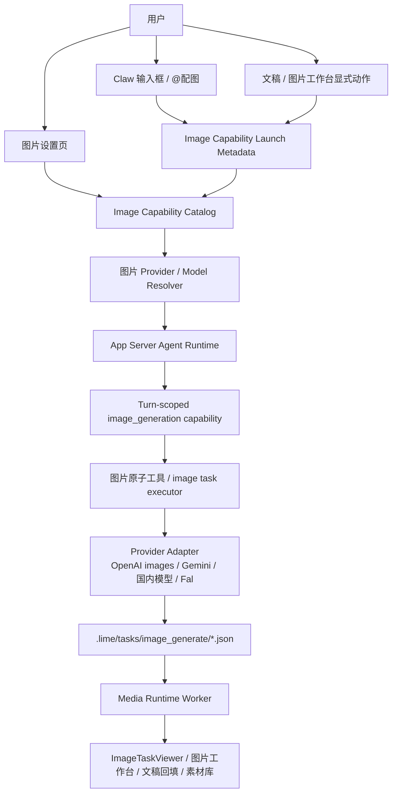
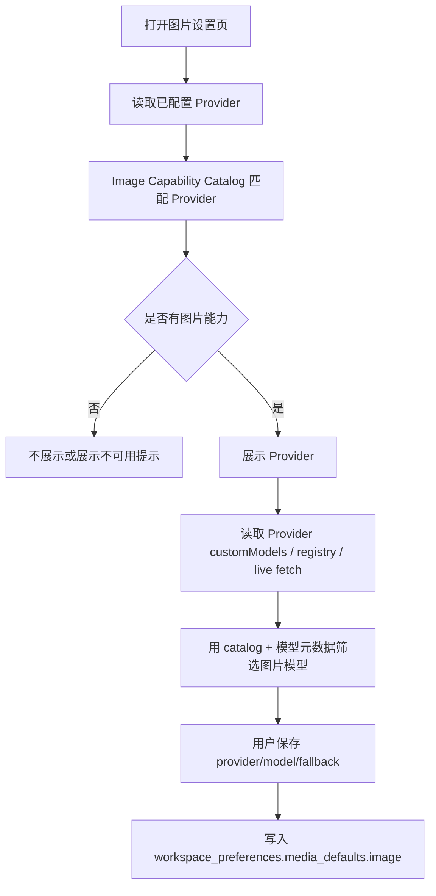
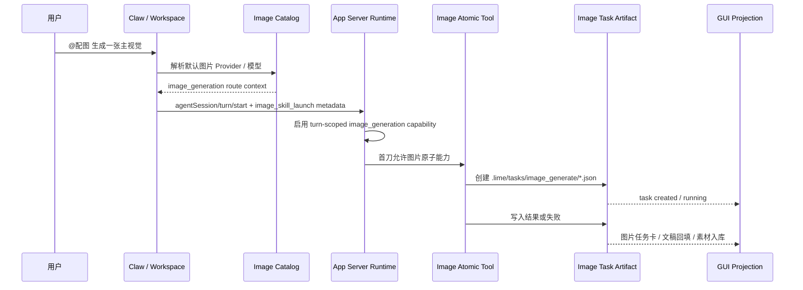
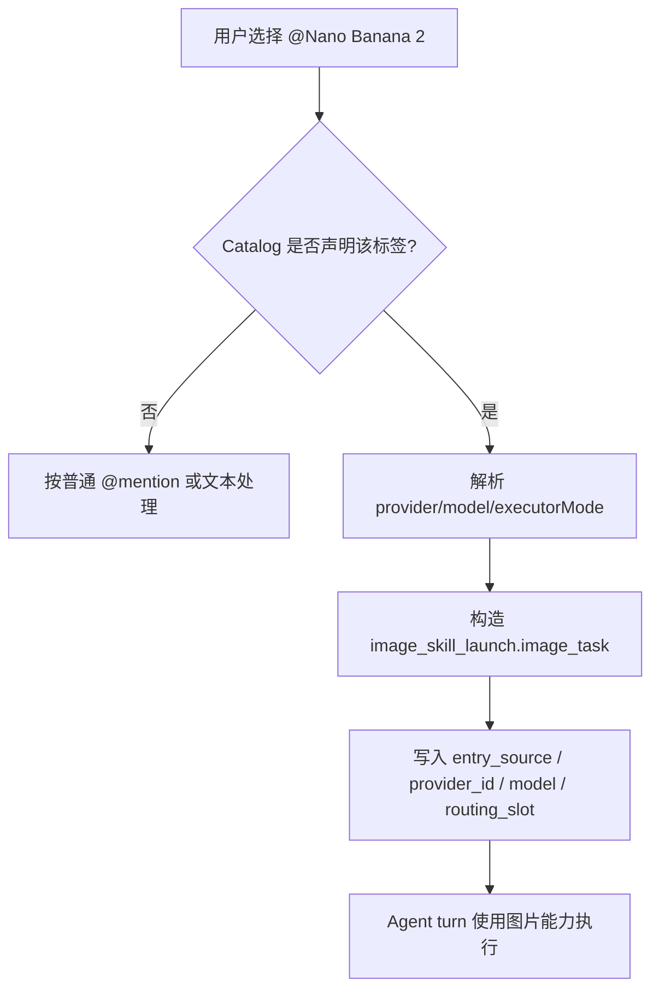
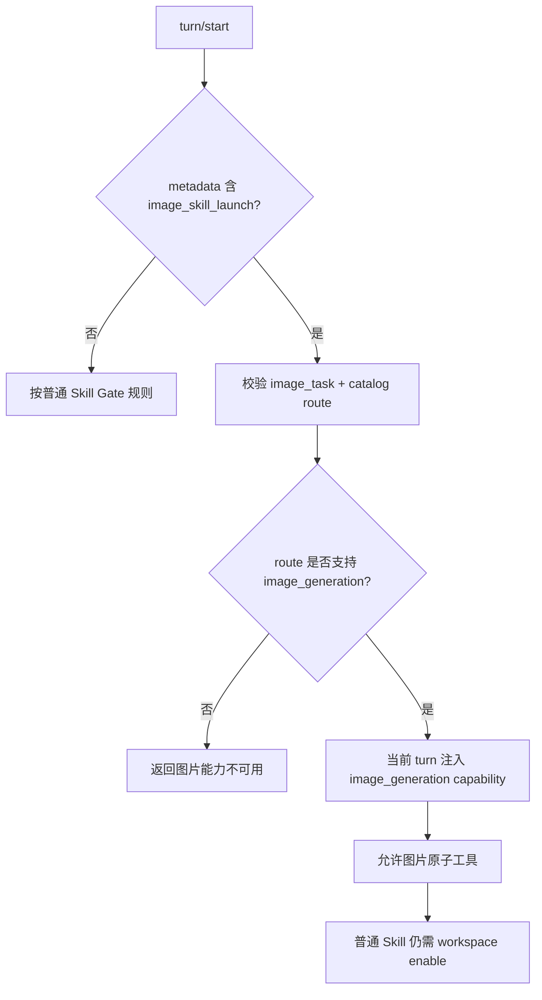
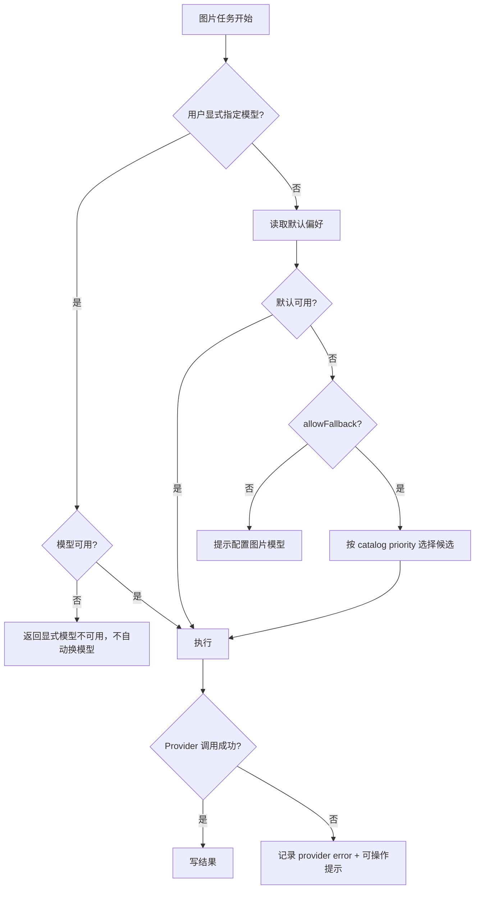

# 图片能力系统路线图

更新时间：2026-06-30
状态：Draft
Owner：Agent Runtime / Media Runtime / Settings / Workspace

对应执行计划：`internal/exec-plans/image-capability-feature-flag-extension-tool-plan.md`
进度记录：`internal/exec-plans/image-capability-feature-flag-extension-tool-progress.md`

## 1. 背景

Lime 的图片生成能力已经从单一“生成一张图”扩展为一条产品主链：

```text
设置图片 Provider / 模型
  -> 输入框 @配图 / @修图 / @重绘 / 图片模型标签
  -> Agent turn 收集上下文
  -> 图片生成能力执行
  -> 标准 image task artifact
  -> 图片工作台 / 文稿 / 素材库回填
```

当前问题不是单个下拉框缺模型，而是事实源分散：

1. 设置页用 `isImageProvider(...)` 和模型名启发式过滤 Provider。
2. `@配图` 走 `image_skill_launch -> Skill(image_generate)`，会被通用 session 级 `skill_tool_gate` 影响。
3. 第三方中转站如 `agnes`、`sub2api`、`new-api` 通常只暴露 OpenAI 兼容接口，不会给 Lime 提供额外能力元数据。
4. 国内生图模型和 Google Nano Banana 系列会持续增加，靠前端硬编码或模型名猜测会不断失效。
5. 用户在设置页“已经选了图片模型”，但运行时仍可能因为 Skill 权限、模型路由或 Provider 识别不一致而失败。

Codex 的图片生成设计给了一个清晰方向：图片生成是 feature-gated 的内建扩展工具，模型选型和权限控制分离。Lime 不需要照搬整套扩展系统，但应把图片生成这类原子能力从通用 Skill allowlist 中解耦。

### 1.1 Lime 当前实现与目标架构对齐

Lime 现在已经有图片主链，但职责还没有完全拆开：

- `src/components/agent/chat/workspace/modelSkillLaunchDescriptors.ts` 把 `@配图` 归到 `image_skill_launch`，并继续沿用 `image_generate` 这个兼容 skill 名称。
- `src/components/agent/chat/workspace/useWorkspaceSendActions.ts` 把 `@配图`、`@修图`、`@重绘` 解析成 launch metadata，而不是独立的图片能力事实源。
- `lime-rs/crates/app-server/src/runtime_backend/skill_runtime_enable.rs` 仍在写 session 级 skill allowlist。
- `lime-rs/crates/agent/src/tools/skill_tool_gate.rs` 仍以会话允许列表决定 `Skill(image_generate)` 能否执行。
- `src/components/image-gen/useImageGen.ts` 仍承担生成调度和 provider 执行，但已经直接消费统一 catalog。
- `lime-rs/resources/default-skills/image_generate/SKILL.md` 仍承担迁移期兼容入口。

2026-06-30 的第一刀已经开始收口：

- `src/lib/imageGen/models.ts` 变成图片模型目录的单一出口。
- `src/components/image-gen/types.ts` 不再承载重复模型表，只转发 `lib` 层目录。
- `src/lib/imageGeneration.ts` 已删除，不再作为 current / compat 入口。
- `src/components/image-gen/useImageGen.ts` 已取消按预设档位兜底的历史路径，并开始按 transport 分流。

对齐 Codex 后，Lime 的目标边界应当是：

1. Settings 只负责从本地 catalog 选择图片 Provider / model。
2. Composer 只负责收集意图、上下文和显式模型标签。
3. App Server / Runtime 只负责当前 turn 的 `image_generation` 放行。
4. 图片原子工具 / task executor 只负责执行和产物写回。
5. `Skill(image_generate)` 只保留兼容 facade，不再作为权限事实源。

## 2. 目的

本路线图定义 Lime 图片能力系统的统一设计，目标是：

1. 建立本地 `image capability catalog`，作为图片 Provider / 模型 / 执行协议的唯一产品事实源。
2. 让设置页、模型选择器、`@配图`、图片 Skill、Media Runtime、任务回填消费同一份能力判断。
3. 将 `@配图` 保留为意图入口和上下文收集入口，但让图片执行走 turn-scoped `image_generation` 原子能力。
4. 保留现有 `.lime/tasks/image_generate/*.json` 标准产物链，不重建图片工作台、素材库和文稿回填。
5. 系统性支持第三方 OpenAI 兼容中转、国内生图模型、Google Nano Banana 系列和 Lime Cloud 下发能力。

## 3. 收益

| 对象 | 收益 |
| --- | --- |
| 用户 | 设置一次图片模型后，`@配图`、文稿配图、修图、重绘都使用同一套默认能力，不再出现“设置可选但运行无权限”。 |
| 产品 | 图片能力可以成为稳定一级能力，而不是散落在 Skill、设置页和模型名启发式里的特例。 |
| 工程 | Provider / model 支持新增只改 catalog 和适配器，减少 UI、runtime、worker 多处补丁。 |
| 生态 | 第三方中转站无需改造服务端，Lime 本地按 Provider / Host / Model 维护能力。 |
| 后续扩展 | 国内模型、Google 模型、Lime Cloud command entry、用户自定义 Provider 可以进入同一能力体系。 |

## 4. 用户故事

### 4.1 创作者配置默认图片模型

作为内容创作者，我希望在设置里选择默认图片 Provider 和模型，例如 Agnes、New API、Google Nano Banana 2 或国内生图模型，这样我在任何工作流里输入 `@配图` 都能使用同一套默认配置。

验收：

- 设置页只展示确认为图片能力的 Provider / 模型。
- 切换 Provider 后，模型列表只显示该 Provider 可执行的图片模型。
- 模型不可用时有明确提示，并可回退到自动选择。

### 4.2 在文章中一键生成配图

作为公众号作者，我希望在文章工作台里选中一段文字后点“生成配图”，系统能把当前段落、小节标题、文稿平台和图片风格一起带入生成任务，并把结果回填到正文占位。

验收：

- 前端显式图片动作仍进入同构 `image_skill_launch` 或图片能力 launch metadata。
- task payload 保留 `usage=document-inline`、`slot_id`、`anchor_section_title`、`anchor_text`。
- 结果以 `.lime/tasks/image_generate` 为事实源回填，不依赖前端临时状态。

### 4.3 用 @Nano Banana 2 指定模型

作为高级用户，我希望在输入框里选择或输入已声明的图片模型标签，如 `@Nano Banana 2`，表示这次图片任务显式使用该模型，而不是当前聊天模型。

验收：

- 只有 catalog 声明的图片模型标签会成为图片能力入口。
- metadata 保留 `entry_source`、`provider_id`、`model`、`executor_mode`、`modality_contract_key`、`routing_slot`。
- 未声明的任意 `@模型名` 不会自动调用图片 API。

### 4.4 使用第三方 OpenAI 兼容中转

作为使用第三方中转站的用户，我希望配置 Agnes、sub2api、new-api 或其他 OpenAI 兼容服务后，Lime 能识别其中的图片模型并调用 `/v1/images/generations` 或对应兼容端点。

验收：

- 不要求第三方中转返回 Lime 专用字段。
- 本地 catalog 可按 `providerId`、`providerType`、`apiHost`、`modelId` 识别能力。
- 运行时错误明确区分：Provider 不可用、模型不支持图片、接口失败、响应格式不兼容。

### 4.5 使用国内生图模型

作为国内用户，我希望在同一套设置里选择即梦、豆包、通义万相、智谱 CogView、硅基流动 Flux 等国内生图模型，不需要为每家 Provider 学习不同入口。

验收：

- 国内模型以 catalog 条目声明模型 ID、显示名、尺寸、输入能力、执行协议。
- UI 展示中文友好名称，但 task 和 runtime 保留稳定机器字段。
- 后续新增国内模型不需要改 `@配图` 主链。

## 5. 用户用例

| 用例 | 触发 | 关键路径 | 结果 |
| --- | --- | --- | --- |
| 设置默认图片模型 | 设置 -> 媒体生成 -> 图片服务模型 | Provider 列表 -> 图片模型列表 -> 保存偏好 | 写入 `workspace_preferences.media_defaults.image` |
| 自动配图 | 输入 `@配图 生成一张青柠插画` | 解析意图 -> 图片能力 launch -> Agent turn -> task artifact | 聊天区图片任务卡进入生成中 |
| 文稿 inline 配图 | 文稿右侧栏点击生成配图 | 构造图片上下文 -> 绑定 session -> task artifact | 正文占位等待回填 |
| 指定模型 | `@Nano Banana 2 生成封面` | catalog 匹配模型标签 -> 绑定 provider/model | 当前图片 turn 使用显式模型 |
| 修图 / 重绘 | `@修图` / `@重绘` 带参考图 | 收集参考图 -> 判断 image edit capability | 创建编辑型 image task |
| Provider 不可用 | 默认模型缺失或 Key 失效 | 能力路由失败 -> fallback 或错误 | 用户看到可操作提示 |

## 6. 系统架构



### 6.1 分层边界

| 层 | 责任 | 不允许 |
| --- | --- | --- |
| Settings UI | 展示可用图片 Provider / 模型，保存用户偏好 | 直接维护模型能力分叉规则 |
| Image Capability Catalog | 声明 Provider、模型、协议、输入输出、标签、fallback | 保存用户密钥或执行网络请求 |
| Composer / Workspace | 收集意图、文稿位置、参考图、显式模型标签 | 绕过 Agent turn 直接创建图片任务 |
| Agent Runtime | 绑定 session / turn，注入图片能力，记录路由事实 | 用通用 Skill allowlist 决定图片原子能力是否存在 |
| Image Atomic Tool | 创建标准 image task，调用 Provider adapter | 变成通用 Skill 编排系统替代品 |
| Media Runtime | 执行任务、保存结果、更新 task artifact | 从聊天 UI 临时状态推断任务完成 |
| UI Projection | 展示任务、图片、回填动作 | 作为图片任务事实源 |

## 7. Image Capability Catalog

首期 catalog 可以是前后端共享的本地静态数据和解析 helper，后续再迁入 App Server 持久事实源。

当前仓库已经把最小目录真值收回到 `src/lib/imageGen/models.ts`；`src/lib/imageGeneration.ts` 的旧兼容壳已经删除，后续只允许在 `catalog.ts` / executor 里继续收口。

建议字段：

```ts
type ImageCapabilityProvider = {
  providerKey: string;
  displayName: string;
  match: {
    providerIds?: string[];
    providerTypes?: string[];
    apiHostIncludes?: string[];
  };
  transport: "openai_images" | "openai_responses_image" | "gemini_image" | "fal_queue" | "custom";
  endpointPath?: string;
  models: ImageCapabilityModel[];
  fallbackPriority?: number;
};

type ImageCapabilityModel = {
  id: string;
  displayName: string;
  aliases?: string[];
  tags?: string[];
  supports: {
    textToImage: boolean;
    imageToImage?: boolean;
    multiImageReference?: boolean;
    transparentBackground?: boolean;
  };
  sizes?: string[];
  executorMode: "images_api" | "responses_image_generation" | "gemini_image_generation" | "provider_native";
};
```

首批应覆盖：

| 类别 | 示例 |
| --- | --- |
| OpenAI 官方 / 兼容 | `gpt-image-1`、`gpt-images-2`、`dall-e-3` |
| 第三方中转 | Agnes `agnes-image-2.0-flash`、sub2api、new-api |
| Google | Nano Banana 系列 / Gemini image generation 模型 |
| 国内模型 | 即梦 / Seedream、通义万相、CogView、Flux、硅基流动等 |
| Fal | `fal-ai/nano-banana-pro`、`fal-ai/flux/schnell` 等 |

注意：Google 和第三方平台的模型命名变化快，落实现时必须以官方文档或当前可调用模型列表为准；catalog 中可以保留用户友好别名，例如 `Nano Banana 2`，但 runtime 必须写入真实 `modelId`。

## 8. 设置页流程



设置页 UX 原则：

1. 不展示纯文本模型作为图片模型。
2. Provider 有图片能力但模型列表为空时，展示“需要在 Provider 配置中声明图片模型 / 拉取模型”。
3. 对 OpenAI 兼容中转，允许 catalog 提供默认图片模型候选。
4. 对登录型云 Provider，允许显示登录引导，但不假装已有模型可用。
5. 保存后偏好只记录稳定 `preferredProviderId`、`preferredModelId`、`allowFallback`，不把 UI 文案写入配置。

## 9. @配图 时序



关键约束：

1. `@配图` 原始文本必须进入 Agent turn。
2. 图片能力由当前 turn 的 `image_generation` capability 放行，不由通用 workspace skill allowlist 决定。
3. `Skill(image_generate)` 首期可以作为兼容 facade 保留，但不能继续成为权限事实源。
4. 任务最终仍写标准 `.lime/tasks/image_generate`，不回到前端直调图片服务。
5. `skill_runtime_enable.rs` 和 `skill_tool_gate.rs` 只保留普通 Skill 的会话级控制，不再承担图片能力的最终判定。

## 10. 显式模型标签流程



显式标签只表示“本次图片任务指定执行模型”，不表示绕过 Agent、Skill、任务文件或权限系统。

## 11. Skill Gate 解耦流程



负向规则：

1. 普通 `Skill(...)` 未授权仍应失败，`skill_tool_gate` 只负责普通 Skill 和 legacy facade。
2. `image_generation` capability 只允许图片任务相关工具。
3. 图片 turn 不应因为 `ToolSearch / WebSearch / Read / Glob / Grep` 空转。
4. 没有 catalog 路由的 `@模型名` 不触发图片能力。

## 12. Provider 执行协议

| 协议 | 用途 | 示例 |
| --- | --- | --- |
| `openai_images` | OpenAI `/v1/images/generations` / `/v1/images/edits` 兼容接口 | OpenAI、Agnes、new-api、sub2api |
| `openai_responses_image` | Responses API image generation tool | 支持 Responses image tool 的模型 |
| `gemini_image` | Google Gemini image generation | Nano Banana / Gemini image models |
| `fal_queue` | Fal queue / poll 模式 | Fal image models |
| `provider_native` | 国内厂商原生协议 | 即梦、通义万相等需要单独 adapter 的模型 |

执行 adapter 必须输出统一 task artifact：

```json
{
  "task_type": "image_generate",
  "status": "completed",
  "provider_id": "agnes",
  "model": "agnes-image-2.0-flash",
  "entry_source": "at_image_command",
  "outputs": []
}
```

## 13. 错误与回退



错误分类：

| 类别 | 用户提示方向 |
| --- | --- |
| Provider 未配置 Key | 去设置页添加或启用 Key |
| 模型不支持图片 | 切换图片模型或更新 catalog |
| 接口路径不兼容 | 检查中转站是否支持图片接口 |
| 响应格式不兼容 | 显示 Provider 原始错误摘要 |
| 显式模型失败 | 不自动 fallback，避免违背用户锁定 |
| 默认模型失败且允许 fallback | 记录 fallback route，并告知实际模型 |

## 14. 实施阶段

### P0：文档和事实源收敛

1. 固定本路线图。
2. 盘点现有 `ImageGenSettings`、`useImageGen`、`image_skill_launch`、Media Runtime 任务链。
3. 明确 `image_generate` 为兼容 facade，`image_generation` 为目标原子能力。

### P1：本地 Image Capability Catalog

1. 新增 catalog 数据结构和 resolver。
2. 迁移 `IMAGE_GEN_MODELS`、`isImageProvider`、`getImageModelIdsForProvider` 到 catalog 消费模式。
3. 覆盖 Agnes、new-api、sub2api、Fal、OpenAI、首批国内模型、Google 模型别名。

### P2：设置页接入

1. `ImageGenSettings` 使用 catalog 过滤 Provider / 模型。
2. `ModelSelector` 的 fallback model 读取 catalog。
3. Provider 不可用、模型不可用、需要声明模型的 UX 文案补齐五语言。

### P3：@配图 图片原子能力

1. `image_skill_launch` metadata 明确携带 `image_generation` turn capability。
2. `skill_runtime_enable.rs` 只处理普通 skill allowlist；图片能力改由 catalog route + turn capability 决定。
3. `skill_tool_gate.rs` 不再作为图片原子能力的最终权限源。
4. `Skill(image_generate)` 保留兼容，但执行落到统一 image task executor。

### P4：统一任务与回填

1. 图片原子工具写标准 `.lime/tasks/image_generate`。
2. 图片工作台、ImageTaskViewer、文稿 inline 占位、素材库继续消费 task artifact。
3. 增加 task payload 中 provider/model/executorMode/routingSlot 的可观测字段。

### P5：治理与收口

1. 禁止新增前端直调图片 Provider 的旁路。
2. 清理设置页、runtime、worker 里重复的模型名启发式。
3. 建立 catalog regression，防止新模型只改 UI 不改 runtime。

> 具体执行顺序、写集和退出条件，以 `internal/exec-plans/image-capability-feature-flag-extension-tool-plan.md` 为准。

## 15. 验收标准

### 功能验收

1. 设置页能展示 Agnes / OpenAI 兼容中转 / 国内图片模型 / Google 图片模型。
2. 保存默认图片模型后，`@配图` 默认使用同一 Provider / model。
3. `@Nano Banana 2` 这类已声明标签能进入同一图片任务主链。
4. 文稿 inline 配图和图片工作台显式动作不绕过 Agent turn。
5. 普通 Skill 未授权仍失败，图片能力不打开整个 Skill 面。

### 技术验收

1. `imageGeneration` catalog resolver 单测覆盖 Provider / Host / Model / Alias。
2. `ImageGenSettings` 测试覆盖 Provider 和模型过滤。
3. `useWorkspaceSendActions` 测试覆盖 `image_skill_launch` metadata。
4. App Server runtime 测试覆盖图片 turn 不依赖 workspace skill enable。
5. 负向测试覆盖未声明 `@模型名` 不触发图片能力。
6. GUI smoke 覆盖最小 `@配图` 主链。

## 16. 风险与约束

| 风险 | 约束 |
| --- | --- |
| catalog 变成第二套模型注册表 | catalog 只声明图片执行能力和路由，不复制完整模型注册表。 |
| 过度绕开 Skill 体系 | 只对图片生成这类原子能力解耦，复杂工作流继续走 Skill。 |
| 第三方中转模型名变化 | 支持用户自定义模型和 host/provider 匹配，错误提示引导更新本地声明。 |
| Google / 国内模型接口差异 | 通过 `transport` 和 adapter 隔离协议差异，task artifact 保持统一。 |
| UI 展示和 runtime 不一致 | 设置页和 runtime 必须消费同一 catalog resolver。 |
| 显式模型被自动 fallback | 显式模型锁定失败时默认不 fallback，避免用户意图被覆盖。 |

## 17. 非目标

1. 不重写完整 Skill 系统。
2. 不把所有媒体能力一次性迁到内建工具。
3. 不要求第三方中转站实现 Lime 专用能力 API。
4. 不废弃 `.lime/tasks/image_generate` 当前任务事实源。
5. 不在 UI 中硬编码某个 Provider 的临时特殊逻辑。

## 18. 术语

| 术语 | 含义 |
| --- | --- |
| Image Capability Catalog | Lime 本地图片能力目录，描述 Provider / model / transport / 支持能力。 |
| Image Atomic Tool | 只负责图片生成 / 编辑的原子执行工具，不代表通用 Skill。 |
| `image_skill_launch` | 前端到 Agent Runtime 的图片任务上下文 metadata。 |
| `image_generation` capability | 当前 turn 允许执行图片原子能力的稳定机器语义。 |
| `image_generate` task artifact | `.lime/tasks/image_generate/*.json` 标准图片任务文件。 |
| 显式模型标签 | catalog 声明的 `@Nano Banana 2`、`@GPT Images 2` 等图片模型入口。 |

## 19. Lime 重构切入口

| 领域 | 当前事实源 | 重构动作 |
| --- | --- | --- |
| 设置与模型选择 | `src/lib/imageGen/catalog.ts`、`src/components/image-gen/useImageGen.ts` | 抽出统一 catalog resolver，统一 provider / model / alias / fallback / 错误分类。 |
| 图片意图入口 | `src/components/agent/chat/workspace/modelSkillLaunchDescriptors.ts`、`src/components/agent/chat/workspace/useWorkspaceSendActions.ts` | 保留 `image_skill_launch`，补齐 `image_generation` capability hint 和 route metadata。 |
| 运行时授权 | `lime-rs/crates/app-server/src/runtime_backend/skill_runtime_enable.rs`、`lime-rs/crates/agent/src/tools/skill_tool_gate.rs` | 图片能力不再由 session allowlist 决定，只保留普通 Skill gate。 |
| 兼容 skill | `lime-rs/resources/default-skills/image_generate/SKILL.md` | 作为迁移期 facade 保留，最终不再承担权限事实源。 |
| 任务与回填 | `.lime/tasks/image_generate`、图片工作台、文稿回填 projection | 继续复用统一 task artifact，不新增直连 Provider 旁路。 |
