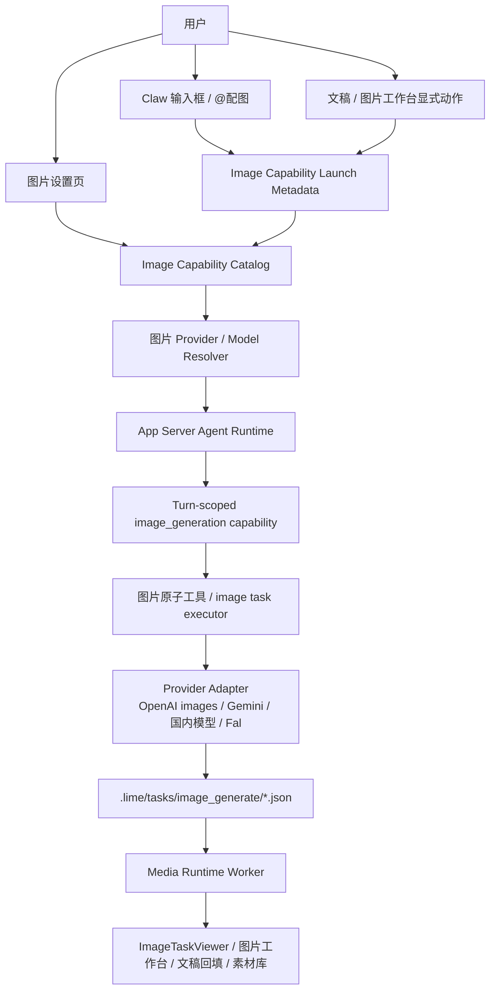
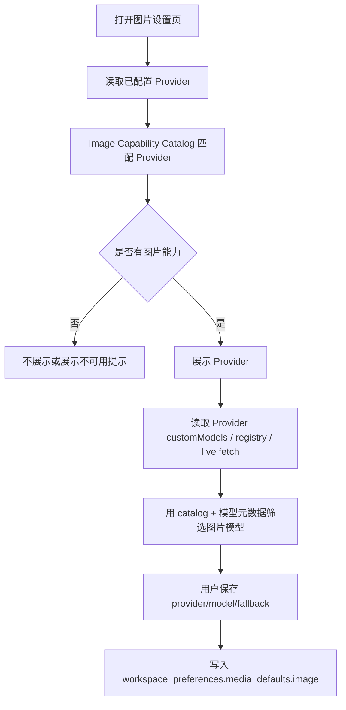
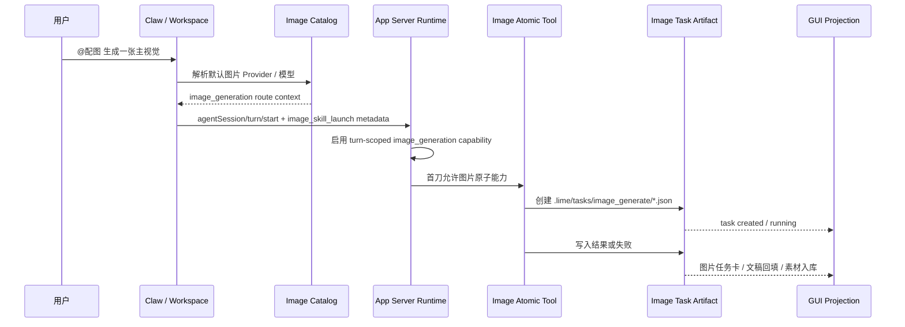
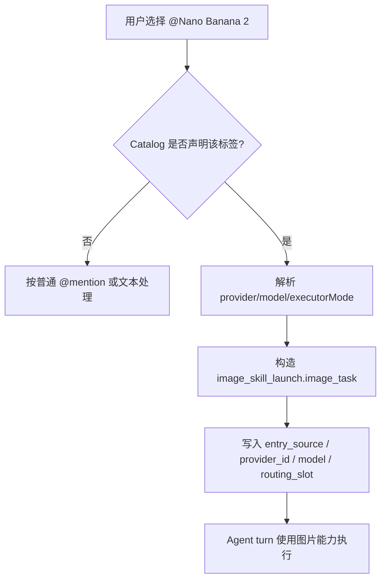
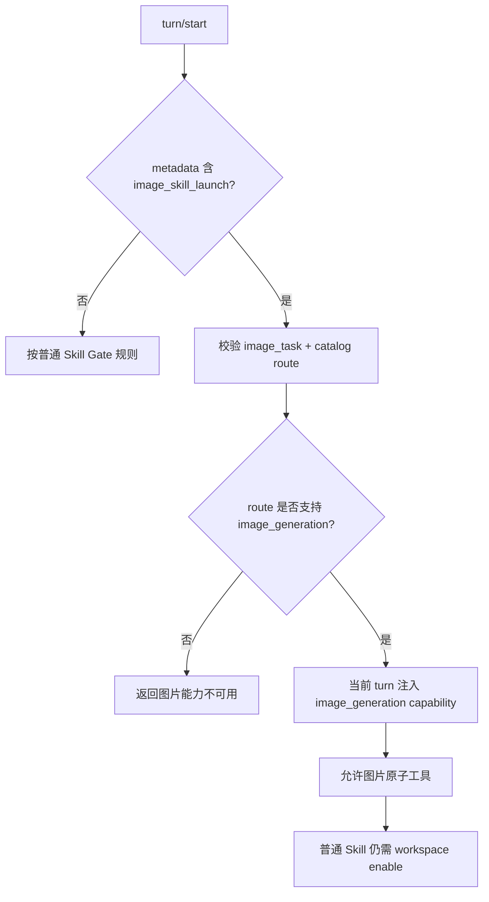
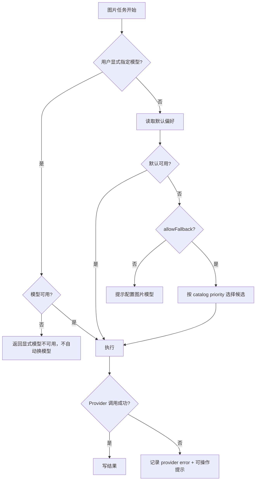

# 图片能力系统路线图

更新时间：2026-07-02
状态：进行中，App Server / Media Runtime worker 常驻调度骨架已接入；图片默认模型占位污染已收口，Provider adapter 细节仍在推进
Owner：Agent Runtime / Media Runtime / Settings / Workspace

对应执行计划：`internal/exec-plans/image-capability-feature-flag-extension-tool-plan.md`
进度记录：`internal/exec-plans/image-capability-feature-flag-extension-tool-progress.md`

## 1. 背景

Lime 的图片生成能力已经从单一“生成一张图”扩展为一条产品主链：

```text
设置图片 Provider / 模型
  -> 输入框 @配图 / @修图 / @重绘 / 图片模型标签
  -> Agent turn 收集上下文
  -> 图片生成能力执行
  -> 标准 image task artifact
  -> 图片工作台 / 文稿 / 素材库回填
```

当前问题不是单个下拉框缺模型，而是事实源分散：

1. 设置页用 `isImageProvider(...)` 和模型名启发式过滤 Provider。
2. `@配图` 走 `image_skill_launch -> Skill(image_generate)`，会被通用 session 级 `skill_tool_gate` 影响。
3. 第三方中转站如 `agnes`、`sub2api`、`new-api` 通常只暴露 OpenAI 兼容接口，不会给 Lime 提供额外能力元数据。
4. 国内生图模型和 Google Nano Banana 系列会持续增加，靠前端硬编码或模型名猜测会不断失效。
5. 用户在设置页“已经选了图片模型”，但运行时仍可能因为 Skill 权限、模型路由或 Provider 识别不一致而失败。

Codex 的图片生成设计给了一个清晰方向：图片生成是 feature-gated 的内建扩展工具，模型选型和权限控制分离。Lime 不需要照搬整套扩展系统，但应把图片生成这类原子能力从通用 Skill allowlist 中解耦。

### 1.1 Lime 当前实现与目标架构对齐

Lime 现在已经有图片主链，但职责还没有完全拆开：

- `src/components/agent/chat/workspace/modelSkillLaunchDescriptors.ts` 把 `@配图` 归到 `image_skill_launch`，并继续沿用 `image_generate` 这个兼容 skill 名称。
- `src/components/agent/chat/workspace/useWorkspaceSendActions.ts` 把 `@配图`、`@修图`、`@重绘` 解析成 launch metadata，而不是独立的图片能力事实源。
- `lime-rs/crates/app-server/src/runtime_backend/skill_runtime_enable.rs` 仍在写 session 级 skill allowlist。
- `lime-rs/crates/agent/src/tools/skill_tool_gate.rs` 仍以会话允许列表决定 `Skill(image_generate)` 能否执行。
- `src/components/image-gen/useImageGen.ts` 仍承担生成调度和 provider 执行，但已经直接消费统一 catalog。
- `lime-rs/resources/default-skills/image_generate/SKILL.md` 仍承担迁移期兼容入口。

2026-06-30 的第一刀已经开始收口：

- `src/lib/imageGen/models.ts` 变成图片模型目录的单一出口。
- `src/components/image-gen/types.ts` 不再承载重复模型表，只转发 `lib` 层目录。
- `src/lib/imageGeneration.ts` 已删除，不再作为 current / compat 入口。
- `src/components/image-gen/useImageGen.ts` 已取消按预设档位兜底的历史路径，并开始按 transport 分流。

对齐 Codex 后，Lime 的目标边界应当是：

1. Settings 只负责从本地 catalog 选择图片 Provider / model。
2. Composer 只负责收集意图、上下文和显式模型标签。
3. App Server / Runtime 只负责当前 turn 的 `image_generation` 放行。
4. 图片原子工具 / task executor 只负责执行和产物写回。
5. `Skill(image_generate)` 只保留兼容 facade，不再作为权限事实源。

## 2. 目的

本路线图定义 Lime 图片能力系统的统一设计，目标是：

1. 建立本地 `image capability catalog`，作为图片 Provider / 模型 / 执行协议的唯一产品事实源。
2. 让设置页、模型选择器、`@配图`、图片 Skill、Media Runtime、任务回填消费同一份能力判断。
3. 将 `@配图` 保留为意图入口和上下文收集入口，但让图片执行走 turn-scoped `image_generation` 原子能力。
4. 保留现有 `.lime/tasks/image_generate/*.json` 标准产物链，不重建图片工作台、素材库和文稿回填。
5. 系统性支持第三方 OpenAI 兼容中转、国内生图模型、Google Nano Banana 系列和 Lime Cloud 下发能力。

## 3. 收益

| 对象     | 收益                                                                                                    |
| -------- | ------------------------------------------------------------------------------------------------------- |
| 用户     | 设置一次图片模型后，`@配图`、文稿配图、修图、重绘都使用同一套默认能力，不再出现“设置可选但运行无权限”。 |
| 产品     | 图片能力可以成为稳定一级能力，而不是散落在 Skill、设置页和模型名启发式里的特例。                        |
| 工程     | Provider / model 支持新增只改 catalog 和适配器，减少 UI、runtime、worker 多处补丁。                     |
| 生态     | 第三方中转站无需改造服务端，Lime 本地按 Provider / Host / Model 维护能力。                              |
| 后续扩展 | 国内模型、Google 模型、Lime Cloud command entry、用户自定义 Provider 可以进入同一能力体系。             |

## 4. 用户故事

### 4.1 创作者配置默认图片模型

作为内容创作者，我希望在设置里选择默认图片 Provider 和模型，例如 Agnes、New API、Google Nano Banana 2 或国内生图模型，这样我在任何工作流里输入 `@配图` 都能使用同一套默认配置。

验收：

- 设置页只展示确认为图片能力的 Provider / 模型。
- 切换 Provider 后，模型列表只显示该 Provider 可执行的图片模型。
- 模型不可用时有明确提示，并可回退到自动选择。

### 4.2 在文章中一键生成配图

作为公众号作者，我希望在文章工作台里选中一段文字后点“生成配图”，系统能把当前段落、小节标题、文稿平台和图片风格一起带入生成任务，并把结果回填到正文占位。

验收：

- 前端显式图片动作仍进入同构 `image_skill_launch` 或图片能力 launch metadata。
- task payload 保留 `usage=document-inline`、`slot_id`、`anchor_section_title`、`anchor_text`。
- 结果以 `.lime/tasks/image_generate` 为事实源回填，不依赖前端临时状态。

### 4.3 用 @Nano Banana 2 指定模型

作为高级用户，我希望在输入框里选择或输入已声明的图片模型标签，如 `@Nano Banana 2`，表示这次图片任务显式使用该模型，而不是当前聊天模型。

验收：

- 只有 catalog 声明的图片模型标签会成为图片能力入口。
- metadata 保留 `entry_source`、`provider_id`、`model`、`executor_mode`、`modality_contract_key`、`routing_slot`。
- 未声明的任意 `@模型名` 不会自动调用图片 API。

### 4.4 使用第三方 OpenAI 兼容中转

作为使用第三方中转站的用户，我希望配置 Agnes、sub2api、new-api 或其他 OpenAI 兼容服务后，Lime 能识别其中的图片模型并调用 `/v1/images/generations` 或对应兼容端点。

验收：

- 不要求第三方中转返回 Lime 专用字段。
- 本地 catalog 可按 `providerId`、`providerType`、`apiHost`、`modelId` 识别能力。
- 运行时错误明确区分：Provider 不可用、模型不支持图片、接口失败、响应格式不兼容。

### 4.5 使用国内生图模型

作为国内用户，我希望在同一套设置里选择即梦、豆包、通义万相、智谱 CogView、硅基流动 Flux 等国内生图模型，不需要为每家 Provider 学习不同入口。

验收：

- 国内模型以 catalog 条目声明模型 ID、显示名、尺寸、输入能力、执行协议。
- UI 展示中文友好名称，但 task 和 runtime 保留稳定机器字段。
- 后续新增国内模型不需要改 `@配图` 主链。

## 5. 用户用例

| 用例             | 触发                             | 关键路径                                                   | 结果                                              |
| ---------------- | -------------------------------- | ---------------------------------------------------------- | ------------------------------------------------- |
| 设置默认图片模型 | 设置 -> 媒体生成 -> 图片服务模型 | Provider 列表 -> 图片模型列表 -> 保存偏好                  | 写入 `workspace_preferences.media_defaults.image` |
| 自动配图         | 输入 `@配图 生成一张青柠插画`    | 解析意图 -> 图片能力 launch -> Agent turn -> task artifact | 聊天区图片任务卡进入生成中                        |
| 文稿 inline 配图 | 文稿右侧栏点击生成配图           | 构造图片上下文 -> 绑定 session -> task artifact            | 正文占位等待回填                                  |
| 指定模型         | `@Nano Banana 2 生成封面`        | catalog 匹配模型标签 -> 绑定 provider/model                | 当前图片 turn 使用显式模型                        |
| 修图 / 重绘      | `@修图` / `@重绘` 带参考图       | 收集参考图 -> 判断 image edit capability                   | 创建编辑型 image task                             |
| Provider 不可用  | 默认模型缺失或 Key 失效          | 能力路由失败 -> fallback 或错误                            | 用户看到可操作提示                                |

## 6. 系统架构



### 6.1 分层边界

| 层                       | 责任                                                | 不允许                                          |
| ------------------------ | --------------------------------------------------- | ----------------------------------------------- |
| Settings UI              | 展示可用图片 Provider / 模型，保存用户偏好          | 直接维护模型能力分叉规则                        |
| Image Capability Catalog | 声明 Provider、模型、协议、输入输出、标签、fallback | 保存用户密钥或执行网络请求                      |
| Composer / Workspace     | 收集意图、文稿位置、参考图、显式模型标签            | 绕过 Agent turn 直接创建图片任务                |
| Agent Runtime            | 绑定 session / turn，注入图片能力，记录路由事实     | 用通用 Skill allowlist 决定图片原子能力是否存在 |
| Image Atomic Tool        | 创建标准 image task，调用 Provider adapter          | 变成通用 Skill 编排系统替代品                   |
| Media Runtime            | 执行任务、保存结果、更新 task artifact              | 从聊天 UI 临时状态推断任务完成                  |
| UI Projection            | 展示任务、图片、回填动作                            | 作为图片任务事实源                              |

## 7. Image Capability Catalog

首期 catalog 可以是前后端共享的本地静态数据和解析 helper，后续再迁入 App Server 持久事实源。

当前仓库已经把最小目录真值收回到 `src/lib/imageGen/models.ts`；`src/lib/imageGeneration.ts` 的旧兼容壳已经删除，后续只允许在 `catalog.ts` / executor 里继续收口。
2026-06-30 还补了一层 Rust 共享 matcher：`lime_core::image_generation_matcher` 已成为图片模型 / 搜索文本的共同事实源，`lime-services` 与 `lime-server` 不再各自维护图片关键词表。
2026-07-01 智谱图片 Provider 已拆出 native 分支：`provider_routing.rs` 先识别 `zhipu` / `glm` / `bigmodel.cn/api/paas`，再由 `request_zhipu_images` 直连 `https://open.bigmodel.cn/api/paas/v4/images/generations`；`glm-image` 默认收敛为单图、`quality=hd`、`size=1280x1280`，并保留 URL 结果归一化。
2026-07-01 `@命令` 面板已关闭 cmdk 内部二次过滤，搜索 `配图` 时不再把外层 catalog 已命中的 `@配图` 结果隐藏；回归覆盖完整输入 `@配图` 后仍展示可选择命令，`verify:gui-smoke` 已确认 Electron / renderer 主壳仍可启动。
2026-07-01 `@配图` task 轻卡已兼容 `metadata`、`structuredContent`、`structured_content`、JSON `output` 与嵌套 `record/payload/progress/result`，避免 App Server 工具结果形态变化时丢失图片任务卡。
2026-07-01 已补图片 task 最小执行骨架：`@配图 -> Skill(image_generate) -> lime_create_image_generation_task -> .lime/tasks/image_generate/*.json` 后，先由 `useWorkspaceImageTaskExecutorRuntime` 验证 renderer-side 读取 task artifact、本机 `/v1/images/generations` 执行和终态写回可跑通。发送边界会在图片 Provider/model 未就绪时 fail closed，不再创建 `provider_id/model/executor_mode` 为空且永远 `pending_submit` 的假任务；本机图片服务请求失败、返回空图片或旧任务缺少 runtime config 时，也会写回 `last_error/progress/result.failures`，避免 task 永远停留在 pending。
2026-07-01 App Server 图片 worker 骨架已接管 current 执行链：`media_task_worker.rs` 在 `mediaTaskArtifact/image/create` 创建 `image_generate` 且非 reused task 后触发 `lime_media_runtime::execute_image_generation_task`，worker id 固定为 `lime-image-api-worker`；renderer 的 `useWorkspaceImageTaskExecutorRuntime` 已收缩为观察 task artifact / read model，不再直连本机图片服务或调用 `mediaTaskArtifact/image/complete`，避免前后端双执行。
2026-07-01 真实 Electron `image-command` fixture 已跑通后端 worker 闭环：GUI 输入 `@配图` 后，断言 current `mediaTaskArtifact/image/create/get/list`、同一 task artifact 由 `media_runtime_worker` 推进终态、聊天轻卡终态、read model 完成态和 reload 后恢复都成立；fixture 还会创建本地图片 Provider stub，并断言 `x-provider-id` 与请求体 `model=gpt-image-1` 实际进入 `/v1/images/generations`，防止“设置有最新图片模型但运行时没用上”的回归。summary 记录在 `.lime/qc/gui-evidence/claw-chat-current-fixture/claw-chat-current-fixture-summary.json`。
2026-07-01 App Server 图片完成态补了 `preview_slots[].slot_id` fallback：图片执行结果缺少 `slotId` 时生成 `image-slot-{slot_index}`，避免 successful complete 因 `slot_id=null` 反序列化失败而把 task 错写成 failed。
2026-07-01 真实用户 `@配图` 失败根因已定位为配置事实源分叉：Electron Host 当前 `get_config/save_config` 写 `config.json`，而 App Server / worker 优先读 `config.yaml`，导致设置页已保存的 `workspace_preferences.media_defaults.image.preferredProviderId/preferredModelId` 没进入真实图片 task，落盘 payload 出现 `provider_id=null/model=null/executor_mode=direct`，随后 worker 去撞未监听的 `127.0.0.1:8999/v1/images/generations`。
2026-07-01 已把配置事实源收敛到 current `config.yaml`：Electron Host `get_config/save_config` 只读写 `config.yaml`，App Server 图片任务默认值也只读取 `ConfigManager::default_config_path()` 指向的 YAML；旧 `config.json` 在图片默认模型链路中判为 `dead`，不再读取或双写。仍缺 Provider 或模型时继续 fail closed，避免继续落空模型假任务；非法 `executor_mode=direct` 会被清洗为空，由 route/protocol 或 worker 默认执行模式决定。
2026-07-01 App Server 图片 worker 新增 created-task 直接执行骨架：新建图片 task 会携带 `ImageTaskWorkerContext` 访问 App Server Provider DB，worker 优先从 `resolved_route` 读取 provider/model/protocol/base_url 和 API Key 执行；route 不完整时回退 task payload 的 provider/model 与 Provider store，覆盖 OpenAI-compatible / NewApi / Gateway / OpenAI Responses / Codex / Fal 这类图片 endpoint，不再只依赖外部手工启动的旧本机图片 HTTP 服务。
2026-07-01 workspace recovery 已接回同一 Provider DB route：`workspace/default/ensure`、`workspace/ensure`、`workspace/ensureReady` 触发的 pending / retryable failed 图片任务恢复会携带 `ImageTaskWorkerContext`，复用 `resolved_route` 或 task provider/model 读取 Provider store；worker 主执行路径缺少 Provider route 时直接写 failed，不再回退到旧 local gateway / `config.server`。
2026-07-01 worker route resolution 已拆到 `media_task_worker/route.rs`，父模块回到 spawn / recovery / 执行编排职责；`media_task_worker.rs` 从约 `970` 行降到约 `820` 行，解除本轮继续推进前的体量阻塞。
2026-07-01 stale running lease 最小骨架已接入：workspace recovery 发现由 `lime-image-api-worker` 接手且运行超过 `10` 分钟的 running image task，会先写入 retryable `image_worker_stale_running_recovered` failed attempt，再复用同一 retry 机制追加新 attempt 并回到 pending；fresh running 或非本 worker running 不会被恢复。
2026-07-01 App Server 图片 worker 常驻调度骨架已接入：`main.rs` 启动 App Server 时会启动后台 scheduler，每 `30` 秒从 Product DB 读取未归档 workspace root，复用同一 `spawn_pending_image_task_workers_for_workspace` 扫描 `.lime/tasks/image_generate` 的 pending / retryable failed / stale running 任务；调度职责已拆到 `media_task_worker/scheduler.rs`，父模块降到约 `725` 行。
2026-07-01 普通自然语言画图入口已接回同一 current 主链：输入 `画一张广州夏天的图` 会在发送边界补齐为 `@配图 画一张广州夏天的图`，并继续走 `image_skill_launch -> Skill(image_generate) -> lime_create_image_generation_task -> mediaTaskArtifact/image/create -> lime-image-api-worker`，不会再落入普通文本 Agent 回复。新增 `plain-image-intent` Electron fixture 覆盖 GUI 输入、App Server `agentSession/turn/start` routed prompt、task payload `entrySource=plain_image_intent`、worker 终态和聊天轻卡终态。
2026-07-02 图片 task 提交链路已清掉 `default / auto / automatic / system_default / __default__` 等占位值：前端 `image_skill_launch` 不再把工作台占位 model 写进 `image_task`，App Server `mediaTaskArtifact/image/create` 会在 route assessment 前用 current `config.yaml` 中的 `workspace_preferences.media_defaults.image` 补齐真实 Provider / model；仍缺默认值时 fail closed，不再落 `model=default` 的假任务。
2026-07-02 图片 fixture Provider 已限定为 media/image defaults：`smoke:agent-runtime-current-fixture` 与独立 `expert-panel-skills-runtime` fixture 均验证普通 Expert Panel 文本 follow-up 不再继承图片 Provider / `gpt-image-1`，`liveProviderUsed=false`，图片 Provider 只在图片 task / media default 链路中生效。
2026-07-02 Media Runtime Provider adapter 细节继续收口：`media-runtime/src/lib.rs` 拆出 `image_request.rs`、`image_postprocess.rs`、`image_references.rs`，其中请求层继续按协议拆到 `image_request/{openai_images,responses,gemini,zhipu}.rs`，让 Provider wire request / Responses SSE / Gemini generateContent / 智谱原生同步图片 / edit endpoint、图层设计 chroma-key 后处理、参考图 payload 解析分别独立；OpenAI-compatible 图片任务带 `reference_images` 时会改走 `/v1/images/edits` 并把 `images[].image_url` 传给 Provider，Responses `image_generation` executor 会把参考图放入 `input[].content` 的 `input_image`，Gemini executor 会使用 `x-goog-api-key` 与 `inlineData/fileData` 参考图结构，不再在 worker 请求体里丢参考图。
2026-07-02 `lime_media_runtime` 根模块已按 current 职责拆成 facade：`lib.rs` 从 5k+ 行降到 31 行，只保留模块声明和 public re-export；通用 task artifact 拆到 `task_artifact/{types,record,store}.rs`，图片 payload / storyboard / reference 准备拆到 `image_task_input.rs`，图片执行编排拆到 `image_worker.rs`，video worker 内联测试已外置到 `tests/video_worker.rs`，运行时代码文件降到约 593 行；测试按 `tests/{task_artifact,image_postprocess,image_worker,image_worker_gemini,image_worker_responses,image_worker_zhipu,video_worker}.rs` 分组，Provider adapter 和测试单文件均低于 800 行。`cargo test --manifest-path "lime-rs/Cargo.toml" -p lime-media-runtime -- --nocapture` 已通过，后续 Provider adapter 不再往根 `lib.rs` 追加逻辑。
2026-07-02 智谱图片原生 adapter 已接入 current App Server / Media Runtime 主链：前端 catalog 的 Zhipu `provider_native` endpoint 对齐 `/api/paas/v4/images/generations`，App Server `media_task_worker/route.rs` 会把 `zhipuai` / `bigmodel.cn/api/paas` / `glm-image` / `cogview-*` 图片路由写成 `executor_mode=zhipu_images`，Media Runtime `image_request/zhipu.rs` 使用 Bearer Key 调用智谱同步图片接口、默认 `glm-image` 为 `1280x1280 + hd`、归一化 URL / b64 图片结果，并对参考图 / 修图 fail closed，避免错误回落 OpenAI-compatible `/v1/images/generations` 假路径。
2026-07-02 Media Runtime Provider HTTP 错误分类已补第一层：`image_request/error.rs` 统一把 `401/403` 归为 `auth_failed`、`429` 归为 `rate_limited`、`5xx` 归为 `provider_unavailable`、其余非 2xx 归为 `provider_request_failed`，并把上游错误码写入 `TaskErrorRecord.provider_code`；OpenAI-compatible、Responses、Gemini、智谱 adapter 已接入该 helper，非 2xx 的 HTML / 纯文本错误不再被误归类为响应 JSON 解析失败，Responses endpoint-not-found fallback 仍保留特殊 code。
2026-07-02 DashScope / 通义万相图片原生 adapter 已接入 current 主链：前端 catalog 新增 `dashscope` provider entry 与 `qwen-image-*` / `wan2.6-image` 模型，统一图片 matcher 同步识别 `qwen-image`；App Server `media_task_worker/route.rs` 会把 `alibaba` / `dashscope` / `qwen` / `tongyi` 且模型为 `qwen-image-*` 或 `wanx/wan2.*` 的图片任务写成 `executor_mode=dashscope_images`，endpoint 从 compatible-mode host 归一到 `/api/v1/services/aigc/multimodal-generation/generation`；Media Runtime `image_request/dashscope.rs` 使用 Bearer Key 调用 DashScope 同步 multimodal generation 接口、归一化 `output.choices[].message.content[].image` 等结果，并沿用 Provider HTTP 错误分类，避免通义图片模型误走 `/v1/images/generations` 假路径。

建议字段：

```ts
type ImageCapabilityProvider = {
  providerKey: string;
  displayName: string;
  match: {
    providerIds?: string[];
    providerTypes?: string[];
    apiHostIncludes?: string[];
  };
  transport:
    | "openai_images"
    | "openai_responses_image"
    | "gemini_image"
    | "fal_queue"
    | "custom";
  endpointPath?: string;
  models: ImageCapabilityModel[];
  fallbackPriority?: number;
};

type ImageCapabilityModel = {
  id: string;
  displayName: string;
  aliases?: string[];
  tags?: string[];
  supports: {
    textToImage: boolean;
    imageToImage?: boolean;
    multiImageReference?: boolean;
    transparentBackground?: boolean;
  };
  sizes?: string[];
  executorMode:
    | "images_api"
    | "responses_image_generation"
    | "gemini_image_generation"
    | "provider_native";
};
```

首批应覆盖：

| 类别               | 示例                                                 |
| ------------------ | ---------------------------------------------------- |
| OpenAI 官方 / 兼容 | `gpt-image-1`、`gpt-images-2`、`dall-e-3`            |
| 第三方中转         | Agnes `agnes-image-2.0-flash`、sub2api、new-api      |
| Google             | Nano Banana 系列 / Gemini image generation 模型      |
| 国内模型           | 即梦 / Seedream、通义万相、CogView、Flux、硅基流动等 |
| Fal                | `fal-ai/nano-banana-pro`、`fal-ai/flux/schnell` 等   |

注意：Google 和第三方平台的模型命名变化快，落实现时必须以官方文档或当前可调用模型列表为准；catalog 中可以保留用户友好别名，例如 `Nano Banana 2`，但 runtime 必须写入真实 `modelId`。

## 8. 设置页流程



设置页 UX 原则：

1. 不展示纯文本模型作为图片模型。
2. Provider 有图片能力但模型列表为空时，展示“需要在 Provider 配置中声明图片模型 / 拉取模型”。
3. 对 OpenAI 兼容中转，允许 catalog 提供默认图片模型候选。
4. 对 Provider live fetch / registry 返回且声明 `image_generation` task family 的最新模型，设置页按同一 catalog/matcher 接受，不要求模型 ID 预先写进内置表。
5. 对登录型云 Provider，允许显示登录引导，但不假装已有模型可用。
6. 保存后偏好只记录稳定 `preferredProviderId`、`preferredModelId`、`allowFallback`，不把 UI 文案写入配置。

## 9. @配图 时序



关键约束：

1. `@配图` 原始文本必须进入 Agent turn。
2. 图片能力由当前 turn 的 `image_generation` capability 放行，不由通用 workspace skill allowlist 决定。
3. `Skill(image_generate)` 首期可以作为兼容 facade 保留，但不能继续成为权限事实源。
4. 任务最终仍写标准 `.lime/tasks/image_generate`，不回到前端直调图片服务。
5. `skill_runtime_enable.rs` 和 `skill_tool_gate.rs` 只保留普通 Skill 的会话级控制，不再承担图片能力的最终判定。

## 10. 显式模型标签流程



显式标签只表示“本次图片任务指定执行模型”，不表示绕过 Agent、Skill、任务文件或权限系统。

## 11. Skill Gate 解耦流程



负向规则：

1. 普通 `Skill(...)` 未授权仍应失败，`skill_tool_gate` 只负责普通 Skill 和 legacy facade。
2. `image_generation` capability 只允许图片任务相关工具。
3. 图片 turn 不应因为 `ToolSearch / WebSearch / Read / Glob / Grep` 空转。
4. 没有 catalog 路由的 `@模型名` 不触发图片能力。

## 12. Provider 执行协议

| 协议                     | 用途                                                          | 示例                                    |
| ------------------------ | ------------------------------------------------------------- | --------------------------------------- |
| `openai_images`          | OpenAI `/v1/images/generations` / `/v1/images/edits` 兼容接口 | OpenAI、Agnes、new-api、sub2api         |
| `openai_responses_image` | Responses API image generation tool                           | 支持 Responses image tool 的模型        |
| `gemini_image`           | Google Gemini image generation                                | Nano Banana / Gemini image models       |
| `fal_queue`              | Fal queue / poll 模式                                         | Fal image models                        |
| `provider_native`        | 国内厂商原生协议                                              | 即梦、通义万相等需要单独 adapter 的模型 |

执行 adapter 必须输出统一 task artifact：

```json
{
  "task_type": "image_generate",
  "status": "completed",
  "provider_id": "agnes",
  "model": "agnes-image-2.0-flash",
  "entry_source": "at_image_command",
  "outputs": []
}
```

## 13. 错误与回退



错误分类：

| 类别                        | 用户提示方向                        |
| --------------------------- | ----------------------------------- |
| Provider 未配置 Key         | 去设置页添加或启用 Key              |
| 模型不支持图片              | 切换图片模型或更新 catalog          |
| 接口路径不兼容              | 检查中转站是否支持图片接口          |
| 响应格式不兼容              | 显示 Provider 原始错误摘要          |
| 显式模型失败                | 不自动 fallback，避免违背用户锁定   |
| 默认模型失败且允许 fallback | 记录 fallback route，并告知实际模型 |

## 14. 实施阶段

### P0：文档和事实源收敛

1. 固定本路线图。
2. 盘点现有 `ImageGenSettings`、`useImageGen`、`image_skill_launch`、Media Runtime 任务链。
3. 明确 `image_generate` 为兼容 facade，`image_generation` 为目标原子能力。

### P1：本地 Image Capability Catalog

1. 新增 catalog 数据结构和 resolver。
2. 迁移 `IMAGE_GEN_MODELS`、`isImageProvider`、`getImageModelIdsForProvider` 到 catalog 消费模式。
3. 覆盖 Agnes、new-api、sub2api、Fal、OpenAI、首批国内模型、Google 模型别名。

### P2：设置页接入

1. `ImageGenSettings` 使用 catalog 过滤 Provider / 模型。
2. `ModelSelector` 的 fallback model 读取 catalog。
3. Provider 不可用、模型不可用、需要声明模型的 UX 文案补齐五语言。

### P3：@配图 图片原子能力

1. `image_skill_launch` metadata 明确携带 `image_generation` turn capability。
2. `skill_runtime_enable.rs` 只处理普通 skill allowlist；图片能力改由 catalog route + turn capability 决定。
3. `skill_tool_gate.rs` 不再作为图片原子能力的最终权限源。
4. `Skill(image_generate)` 保留兼容，但执行落到统一 image task executor。

当前状态：已完成最小骨架，并已由真实 Electron `image-command` 和 `plain-image-intent` fixture 证明显式 `@配图` 与普通“画一张...”请求都可进入 current task artifact 主链。

### P4：统一任务与回填

1. 图片原子工具写标准 `.lime/tasks/image_generate`。
2. 图片工作台、ImageTaskViewer、文稿 inline 占位、素材库继续消费 task artifact。
3. 增加 task payload 中 provider/model/executorMode/routingSlot 的可观测字段。

当前状态：标准 task artifact、聊天轻卡终态、read model 完成态、reload 后恢复和后端 worker 执行链已跑通；fixture 已证明 provider/model 会进入 worker 请求。workspace ensure 触发的 pending task 启动恢复、cancel 跳过、一次 retryable failed 恢复和 stale running lease 恢复已接入 Provider DB route，不再回退旧 local gateway；App Server 启动时也会常驻调度 Product DB 中登记 workspace 的图片任务。后续重点转为 Provider adapter 细化和更多图片形态。

### P5：治理与收口

1. 禁止新增前端直调图片 Provider 的旁路。
2. 清理设置页、runtime、worker 里重复的模型名启发式。
3. 建立 catalog regression，防止新模型只改 UI 不改 runtime。

> 具体执行顺序、写集和退出条件，以 `internal/exec-plans/image-capability-feature-flag-extension-tool-plan.md` 为准。

## 15. 验收标准

### 功能验收

1. 设置页能展示 Agnes / OpenAI 兼容中转 / 国内图片模型 / Google 图片模型。
2. 保存默认图片模型后，`@配图` 默认使用同一 Provider / model。
3. `@Nano Banana 2` 这类已声明标签能进入同一图片任务主链。
4. 文稿 inline 配图和图片工作台显式动作不绕过 Agent turn。
5. 普通 Skill 未授权仍失败，图片能力不打开整个 Skill 面。

### 技术验收

1. `imageGeneration` catalog resolver 单测覆盖 Provider / Host / Model / Alias。
2. `ImageGenSettings` 测试覆盖 Provider 和模型过滤。
3. `useWorkspaceSendActions` 测试覆盖 `image_skill_launch` metadata。
4. App Server runtime 测试覆盖图片 turn 不依赖 workspace skill enable。
5. 负向测试覆盖未声明 `@模型名` 不触发图片能力。
6. GUI smoke 覆盖最小 `@配图` 主链，并覆盖普通自然语言画图请求不会退回文本流。

## 16. 风险与约束

| 风险                         | 约束                                                                |
| ---------------------------- | ------------------------------------------------------------------- |
| catalog 变成第二套模型注册表 | catalog 只声明图片执行能力和路由，不复制完整模型注册表。            |
| 过度绕开 Skill 体系          | 只对图片生成这类原子能力解耦，复杂工作流继续走 Skill。              |
| 第三方中转模型名变化         | 支持用户自定义模型和 host/provider 匹配，错误提示引导更新本地声明。 |
| Google / 国内模型接口差异    | 通过 `transport` 和 adapter 隔离协议差异，task artifact 保持统一。  |
| UI 展示和 runtime 不一致     | 设置页和 runtime 必须消费同一 catalog resolver。                    |
| 显式模型被自动 fallback      | 显式模型锁定失败时默认不 fallback，避免用户意图被覆盖。             |

## 17. 非目标

1. 不重写完整 Skill 系统。
2. 不把所有媒体能力一次性迁到内建工具。
3. 不要求第三方中转站实现 Lime 专用能力 API。
4. 不废弃 `.lime/tasks/image_generate` 当前任务事实源。
5. 不在 UI 中硬编码某个 Provider 的临时特殊逻辑。

## 18. 术语

| 术语                           | 含义                                                                  |
| ------------------------------ | --------------------------------------------------------------------- |
| Image Capability Catalog       | Lime 本地图片能力目录，描述 Provider / model / transport / 支持能力。 |
| Image Atomic Tool              | 只负责图片生成 / 编辑的原子执行工具，不代表通用 Skill。               |
| `image_skill_launch`           | 前端到 Agent Runtime 的图片任务上下文 metadata。                      |
| `image_generation` capability  | 当前 turn 允许执行图片原子能力的稳定机器语义。                        |
| `image_generate` task artifact | `.lime/tasks/image_generate/*.json` 标准图片任务文件。                |
| 显式模型标签                   | catalog 声明的 `@Nano Banana 2`、`@GPT Images 2` 等图片模型入口。     |

## 19. Lime 重构切入口

| 领域           | 当前事实源                                                                                                                             | 重构动作                                                                               |
| -------------- | -------------------------------------------------------------------------------------------------------------------------------------- | -------------------------------------------------------------------------------------- |
| 设置与模型选择 | `src/lib/imageGen/catalog.ts`、`src/components/image-gen/useImageGen.ts`                                                               | 抽出统一 catalog resolver，统一 provider / model / alias / fallback / 错误分类。       |
| 图片意图入口   | `src/components/agent/chat/workspace/modelSkillLaunchDescriptors.ts`、`src/components/agent/chat/workspace/useWorkspaceSendActions.ts` | 保留 `image_skill_launch`，补齐 `image_generation` capability hint 和 route metadata。 |
| 运行时授权     | `lime-rs/crates/app-server/src/runtime_backend/skill_runtime_enable.rs`、`lime-rs/crates/agent/src/tools/skill_tool_gate.rs`           | 图片能力不再由 session allowlist 决定，只保留普通 Skill gate。                         |
| 兼容 skill     | `lime-rs/resources/default-skills/image_generate/SKILL.md`                                                                             | 作为迁移期 facade 保留，最终不再承担权限事实源。                                       |
| 任务与回填     | `.lime/tasks/image_generate`、图片工作台、文稿回填 projection                                                                          | 继续复用统一 task artifact，不新增直连 Provider 旁路。                                 |

## 20. 当前下一刀

1. 主线骨架已完成：App Server / Media Runtime worker 现在同时具备 created-task 触发、workspace ensure 恢复和常驻 scheduler 周期扫描，均保留同一 `.lime/tasks/image_generate` artifact，不再回退旧 local gateway。
2. 下一刀回头补细节：reference image / edit 的 OpenAI-compatible 与 Responses worker 请求体已补第一层闭环，Gemini 与智谱 adapter 已进入 current worker，Provider HTTP 错误分类已统一到 `TaskErrorRecord.code/provider_code/retryable`；继续细化更多国内 Provider 原生协议。新增模型支持限制在 catalog + worker/server adapter，不新增前端直连旁路。
3. 配置事实源已收敛：Electron `get_config/save_config` 与 App Server 图片默认值只认 current `config.yaml`，旧 `config.json` 不再作为图片默认模型 fallback；`default/auto` 这类 UI 占位值只表示“让后端读取 media default”，不会再写成真实 task model。
4. 图片 projection / task viewer 最新模型显示已收口：聊天轻卡和工作台状态同步优先采用 task / runtime contract 的最新模型，不再让旧 `preview.modelName` 抢占；后续只在发现新的重复事实源时继续收口。
5. 继续观察 `.lime/tasks/image_generate` artifact 的 provider/model/result 字段是否还存在运行时与 UI 展示不一致的边缘样本；若出现，只在 artifact 解析层补事实源优先级，不新增旁路。
6. 维持 `image-command` 和 `plain-image-intent` 作为 current fixture regression 的稳定项，后续只扩展样本，不再把它们从日常矩阵里拆出去。
7. `@配图` 搜索缺口已定位为输入能力面板二次过滤，不是 catalog 缺失；后续若再扩展命令搜索，过滤事实源继续放在 `filterBuiltinCommands / buildInputCapabilitySections`，不要让 UI command primitive 再维护一套隐藏规则。
8. AgentChat 普通文本 turn 的 provider/model 事实源仍归 `agentSession/turn/start` 与 workspace runtime selection；图片默认值只服务 `image_skill_launch -> image task`，后续不要把 media default 注入 Expert Panel、普通 Claw 文本或 session provider selection。
9. `media_task_worker.rs` 当前约 `725` 行，`route.rs` 和 `scheduler.rs` 已承接 route / 调度职责；`media-runtime/src/lib.rs` 已收敛为 31 行 facade，Provider 请求层按 `image_request/{openai_images,responses,gemini}.rs` 分治，下一次继续扩 Provider adapter 时继续优先拆协议子模块，避免重新逼近 `800` 行预警和 `1000` 行硬边界。
