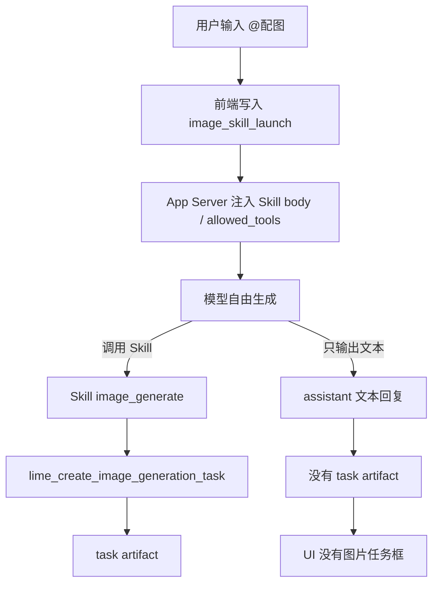
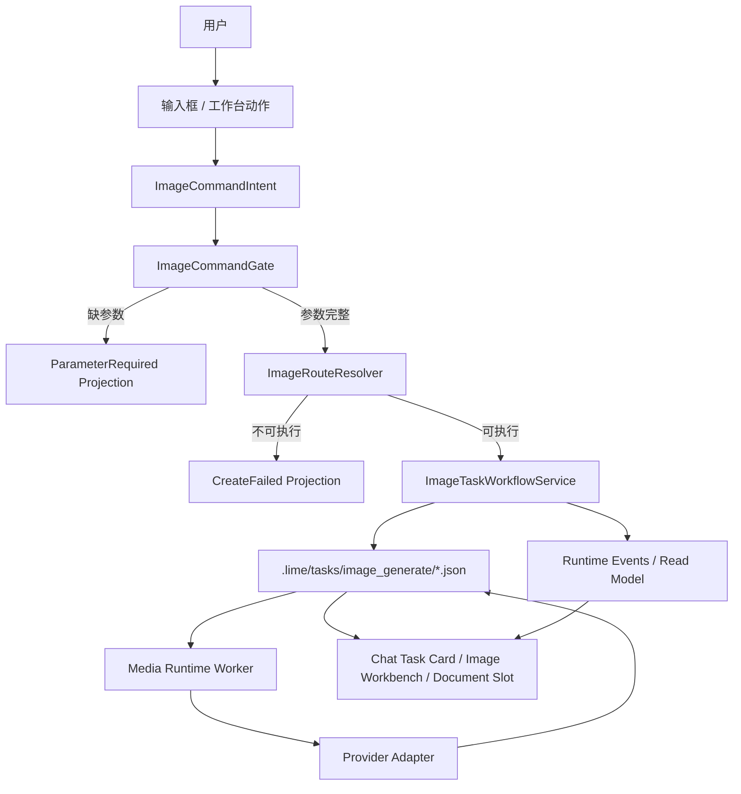
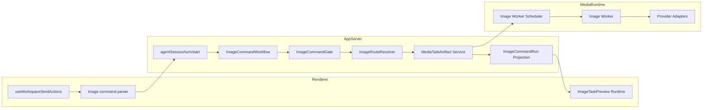
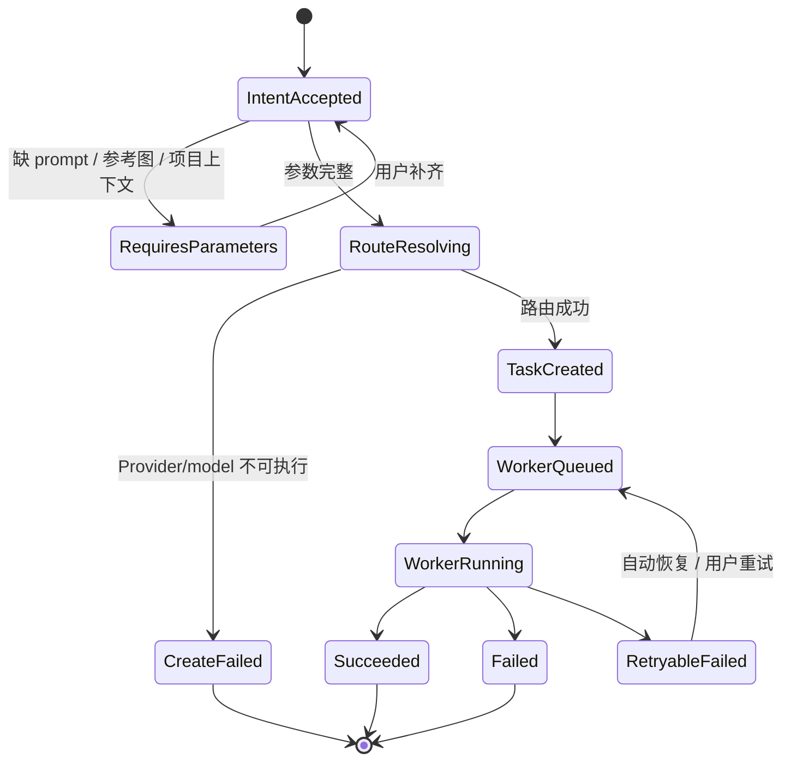
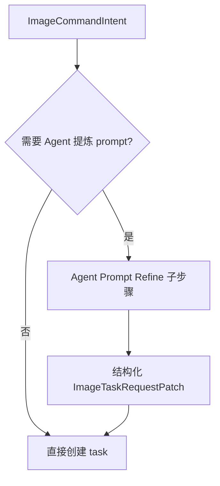

# 图片能力 v2 架构方案

更新时间：2026-07-02
状态：设计中

## 架构决策

图片能力 v2 采用确定性 workflow，而不是 prompt-driven Agent tool calling。

核心决策：

1. `@配图` 是产品命令，不是普通聊天。
2. 创建图片 task 是业务状态写入，必须由 App Server workflow 执行。
3. Agent / chat provider 只参与全局 SOUL 约束下的 presentation JSON、prompt refinement、补参和过程解释，不决定是否创建 task。
4. `Skill(image_generate)` 从 current 首发链路退场。
5. 旧实现不做长期兼容；开发期直接清理双轨和误导命名。

## 当前反模式



问题：

- 成功依赖模型行为，不依赖产品状态机。
- prompt、Skill、tool_scope、fast-response、provider selection 任意一层变化都会导致任务不创建。
- UI 无法区分“正在生成”和“模型只是说要生成”。
- 继续补 prompt 会形成更多兼容分支。

## 目标架构



## 分层职责

| 模块 | 目标职责 | 需要清理的旧职责 |
| --- | --- | --- |
| Composer | 解析用户显式入口，构造 `ImageCommandIntent` draft | 不直接创建 task，不假装 worker |
| App Server Command Workflow | 参数校验、路由、创建 task、发事件 | 不把图片创建交给模型自选工具 |
| Agent Runtime | 记录 turn、可选 prompt refinement、补参、生成结构化 presentation JSON | 不作为图片命令执行 owner，不用模板伪造寒暄 |
| ImageTaskWorkflowService | 复用 `mediaTaskArtifact/image/create` 创建 artifact | 不复制 worker / provider 逻辑 |
| Media Runtime Worker | 执行 Provider 请求、写回结果 | 不从聊天文本推断任务 |
| Workflow Projection | 维护父级运行、阶段步骤和结果分支 | 不把多个图片结果拆成不可追踪的散点消息 |
| Audit Projection | 把 run / step / branch / route / worker attempt 写入 JSONL / evidence | 不把审计细节暴露到普通 UI |
| UI Projection | 只展示自然铺垫、图片轻卡、图片结果和 caption | 不从 assistant 文本伪造任务框，不展示 raw JSON / workflow chrome |
| Skill(image_generate) | 退场 guard / 手工兼容短期入口 | 不再作为 current 首发路径 |

## 逻辑组件图



### ImageTaskPresentation

`ImageTaskPresentation` 是 UI 文案合同，不是 workflow 状态合同。它由 App Server 在 `ImageCommandWorkflow` 内部调用当前 chat provider 生成，system prompt 继承全局 `memory.soul`，输出必须是结构化 JSON。

```ts
type ImageTaskPresentation = {
  schema: "image_task_presentation.v1";
  source: "model_generated";
  assistantIntro?: string;
  assistant_intro?: string;
  completionCaption?: string;
  completion_caption?: string;
  result_captions?: {
    complete?: string;
    partial?: string;
    failed?: string;
    cancelled?: string;
  };
};
```

固定规则：

- `assistant_intro` 可以作为当前 turn 的 `message.delta` 持久化到 read model。
- `completion_caption` / `result_captions.complete` 写入 image task payload，图片完成后由轻卡消费。
- 前端没有 presentation 字段时只显示任务卡和状态，不本地拼模板。
- workflow/run/step/branch/task path/provider/model 仍只进入 JSONL / evidence / read model 审计，不进入右侧 viewer。

## 数据模型

### ImageCommandIntent

```ts
type ImageCommandIntent = {
  kind: "image_command";
  command: "generate" | "edit" | "variation";
  entrySource:
    | "at_image_command"
    | "model_command_tag"
    | "document_inline"
    | "image_workbench";
  rawText: string;
  sessionId: string;
  threadId: string;
  turnId: string;
  workspaceId?: string;
  projectRootPath?: string;
  task: ImageTaskRequestDraft;
};
```

### ImageTaskRequestDraft

```ts
type ImageTaskRequestDraft = {
  prompt: string;
  mode: "generate" | "edit" | "variation";
  title?: string;
  providerId?: string;
  model?: string;
  executorMode?: string;
  size?: string;
  aspectRatio?: string;
  count?: number;
  usage?: "claw-image-workbench" | "document-inline" | "cover";
  referenceImages?: string[];
  slotId?: string;
  anchorSectionTitle?: string;
  anchorText?: string;
  runtimeContract?: {
    contractKey: "image_generation";
    modality: "image";
    routingSlot: "image_generation_model";
    requiredCapabilities: string[];
  };
};
```

### ImageCommandDecision

```ts
type ImageCommandDecision =
  | {
      status: "requires_parameters";
      missing: ImageCommandMissingParameter[];
      intent: ImageCommandIntent;
    }
  | {
      status: "not_executable";
      reasonCode: ImageCommandFailureCode;
      userAction?: "open_settings" | "choose_model" | "attach_reference_image";
      intent: ImageCommandIntent;
    }
  | {
      status: "ready";
      request: MediaTaskArtifactImageCreateParams;
      route: ImageRouteDecision;
    };
```

### ImageCommandRunSnapshot

`ImageCommandIntent` 是输入合同，`ImageCommandRunSnapshot` 是 read model、JSONL 审计和 evidence 的消费合同。参考图里可借鉴的是这个 run 结构：一个父级任务下挂多个步骤和结果分支；这些结构不直接渲染到聊天区或右侧。

```ts
type ImageCommandRunSnapshot = {
  runId: string;
  sessionId: string;
  threadId: string;
  turnId: string;
  title: string;
  summary: string;
  requestedCount: number;
  status: "requires_parameters" | "queued" | "running" | "succeeded" | "partial" | "failed";
  steps: ImageCommandRunStep[];
  branches: ImageGenerationBranch[];
  nextActions: ImageCommandNextAction[];
};

type ImageCommandRunStep = {
  id: "intent" | "route" | "create_tasks" | "generate" | "persist_outputs";
  title: string;
  status: "pending" | "running" | "succeeded" | "failed";
  detail?: string;
};

type ImageGenerationBranch = {
  branchId: string;
  title: string;
  prompt: string;
  taskId?: string;
  artifactPath?: string;
  status: "queued" | "running" | "succeeded" | "failed" | "retryable";
  previewUrl?: string;
  failureReason?: string;
};

type ImageCommandNextAction =
  | { type: "retry_branch"; branchId: string }
  | { type: "generate_more"; branchId?: string }
  | { type: "open_result_viewer"; taskId?: string }
  | { type: "apply_to_document"; slotId: string };
```

设计约束：

- 父级 run 表示“这次图片命令”，不是某个 Provider 请求。
- branch 表示“一个结果方向”，可以映射到一个 task，也可以映射到同一个 task 的一个 output slot。
- JSONL / read model / evidence 消费 run snapshot；聊天区和右侧只消费 task/read model 中适合展示的轻量图片状态和结果。
- 多图请求不能只创建多条互不关联的 tool result。

## 状态机



## App Server 主链

`agentSession/turn/start` 收到请求后应先做 intent classification：

```text
1. 从 request metadata 读取 ImageCommandIntent。
2. 如果没有 intent，走普通 Agent Chat。
3. 如果有 intent，进入 ImageCommandWorkflow。
4. workflow 输出 parameter request / create failed / task created。
5. 对 task created：
   - 写入 task artifact。
   - 写入 read model projection。
   - 发出 tool-like process events，保持 GUI timeline 可见。
   - 可选启动 worker。
6. turn 可以结束为 completed，但 completed 的依据是 task artifact 已创建，不是模型文本。
```

## Agent 的位置

v2 保留 Agent，但改变职责：

允许 Agent 做：

- 从自然语言提取更好的 prompt。
- 在缺参数时生成补参问题。
- 解释 Provider 不支持的原因。
- 在 task 创建后总结“已创建任务，正在生成”。

不允许 Agent 做：

- 决定是否创建图片任务。
- 用普通文本替代 task artifact。
- 通过 ToolSearch / WebSearch / Read / Grep 寻找图片能力。
- 把图片模型污染到普通文本 follow-up。

可选实现路径：



首期可以不做 prompt refine，先保证确定性创建任务。

## 事件设计

v2 可以复用现有 `tool.started` / `tool.result` / `artifact.snapshot` 投影，但语义上必须有图片 workflow 事件。

建议投影：

| 语义 | 可复用事件 | payload 要求 |
| --- | --- | --- |
| intent accepted | `runtime.status` | `status=image_command_intent_accepted` |
| 缺参数 | `action.required` 或 dedicated event | missing fields / user action |
| task 创建开始 | `tool.started` | `toolName=lime_create_image_generation_task`，source=`image_command_workflow` |
| task 创建成功 | `tool.result` | task metadata 完整 |
| task 创建失败 | `tool.failed` | reason code / user action |
| worker 状态 | 现有 task artifact projection | attempt / status / progress |

## 与参考图的对应关系

| 参考图里的结构 | Lime 中的正确抽象 | 不采用的部分 |
| --- | --- | --- |
| 用户说“基于这张图做两张图” | `ImageCommandIntent` + `requestedCount=2` | 不复刻移动端输入气泡 |
| assistant 解释生成方向 | 自然铺垫 + JSONL run summary | 不把长说明作为唯一状态，不展示 run summary chrome |
| “提交生图任务” | run step: `create_tasks` | 不展示报价/扣费，不展示步骤卡 |
| “生成图片 1 / 2” | `ImageGenerationBranch[]` | 不拆成无父级关系的消息，也不展示分支导轨 |
| 图片结果卡 | task output preview / ImageWorkbench output | 不渲染成通用文件 artifact 卡 |
| 后续可补版本 | `nextActions` | 不在主流程里堆长段营销建议，不打开 workflow 面板 |

## Provider / Model 路由

路由顺序：

```text
explicit image command model
  -> image workbench selected model
  -> workspace media defaults image
  -> global media defaults image
  -> fail closed
```

禁止：

- 回退到聊天模型。
- 从普通 text generation provider 猜图片能力。
- 使用 `default` / `auto` 占位创建可执行 task。

## 目录与命名清理

开发期无用户，v2 允许直接清理误导命名。

建议命名：

| 当前 / 旧名 | v2 名称 | 处理 |
| --- | --- | --- |
| `image_skill_launch` | `image_command_intent` | metadata 过渡读，写入新名 |
| `modelSkillLaunchDescriptors` | `commandIntentDescriptors` 或 `imageCommandIntent` | 拆分图片命令语义 |
| `Skill(image_generate)` | `image command workflow` | current 首发退场 |
| `lime_create_image_generation_task` | `create_image_generation_task` / 保留 tool display | 内部 workflow 可复用同一 create 逻辑 |
| `useWorkspaceImageTaskExecutorRuntime` | `useWorkspaceImageTaskProjectionRuntime` | 已不执行，只观察 |

## 与现有 worker 的关系

v2 不重建 Media Runtime。

沿用：

- `.lime/tasks/image_generate/*.json`
- `mediaTaskArtifact/image/create`
- `media_task_worker`
- `lime-media-runtime`
- Provider adapters：OpenAI Images、Responses、Gemini、Zhipu、DashScope 等
- stale running recovery / scheduler

替换：

- `@配图 -> Skill(image_generate) -> tool` 首发触发。

## 风险与约束

| 风险 | 处理 |
| --- | --- |
| 破坏现有 image fixture | 先补 v2 fixture，再替换旧断言 |
| 文稿 inline 场景丢 slot | gate 必须验证 slot context |
| 普通聊天误判图片 | plain intent detection 只做高置信短语 |
| UI 短期仍依赖 tool.result | workflow 发 tool-like projection 保持 timeline |
| 删除 Skill 影响手工路径 | 短期保留 test-only / manual compat，current 不引用 |
