# 图片能力 v2 流程与时序

更新时间：2026-07-02
状态：设计中

## 总流程

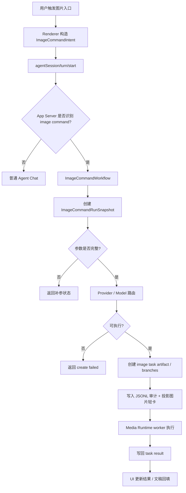

## 明确 @配图 时序

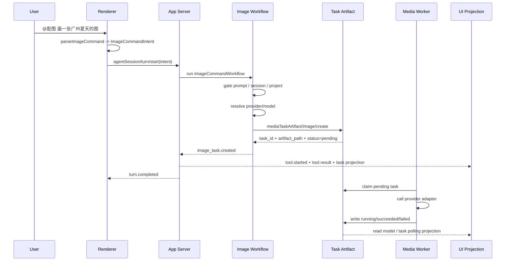

关键要求：

- `turn.completed` 不能早于 task 创建成功或明确失败。
- 如果模型没有参与，也必须能创建 task。
- UI 看到的是轻量 task/read model projection，不是 assistant 文本猜测；workflow/run/step/branch 写入 JSONL 审计。

## 多结果图片 workflow

参考图应抽象为这个流程：一次用户请求产生一个父级运行，父级运行下面挂多个结果分支。

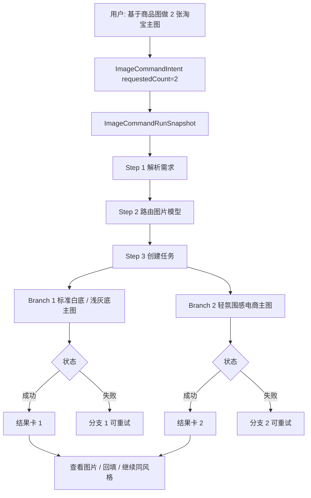

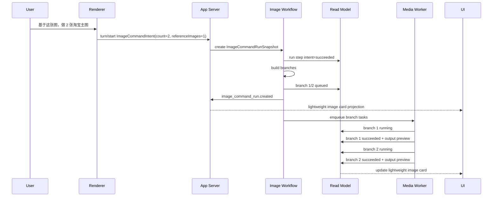

Lime 桌面端展示建议：

- 聊天区：自然 assistant 铺垫 + 轻量图片卡 + 最终图片和 caption。
- 右侧区：不展示 workflow 步骤、分支状态、task id、artifact path 或原始 JSON。
- JSONL：记录 run、step、branch、route、worker attempt、错误码，供未来审计。
- 不使用参考图里的移动端顶部 tab、紫色气泡和大段建议文案作为主 UI。

## 普通自然语言图片意图

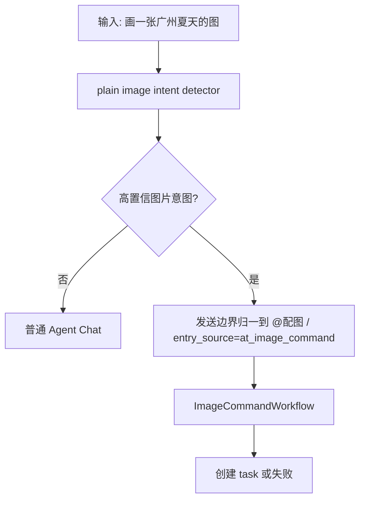

高置信规则示例：

- 包含“画一张 / 生成一张图 / 做一张封面 / 配图 / 修图 / 重绘”。
- 不包含明显非图片目标，例如“画一下流程图代码”除非命令入口明确为图片。
- 如果存在歧义，优先普通 Agent Chat 或补参确认，不创建假任务。

## 图片模型标签

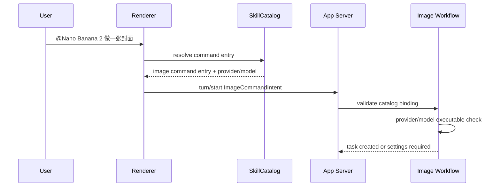

约束：

- 未在 catalog 声明的 `@xxx` 不会自动变成图片模型。
- model tag 只影响图片任务，不影响当前聊天模型。
- App Server 必须再次校验 provider/model，不信任 renderer。

## 文稿 inline 配图

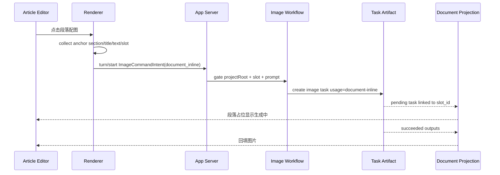

必须写入 task payload：

- `usage=document-inline`
- `slot_id`
- `anchor_section_title`
- `anchor_text`
- `content_id`
- `project_id`

## 修图 / 重绘

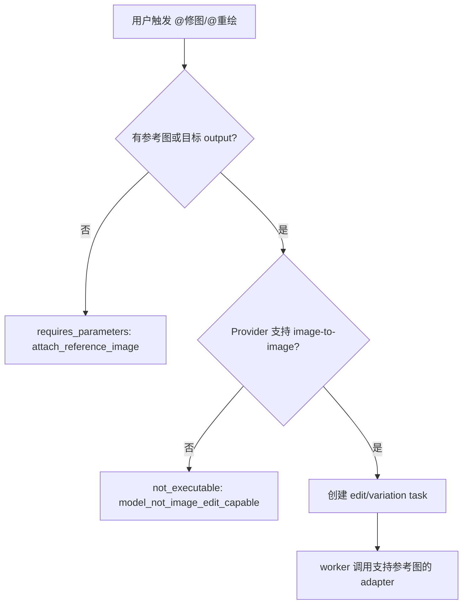

## Provider 缺失 / 不可执行

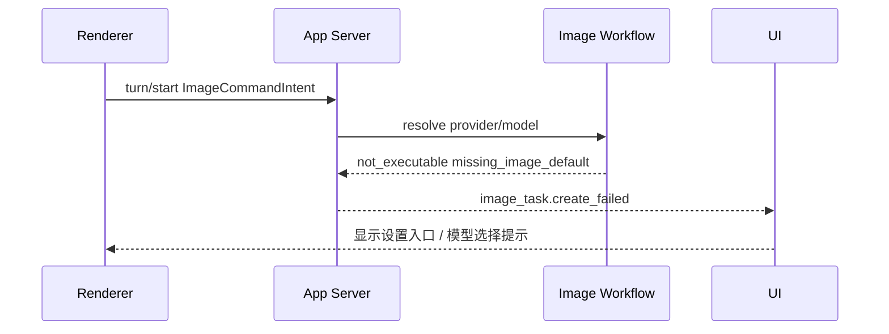

失败时禁止：

- 创建 provider/model 为空的 pending task。
- 回退聊天模型。
- 输出“我来帮你生成”后结束。

## task 创建成功但 worker 失败

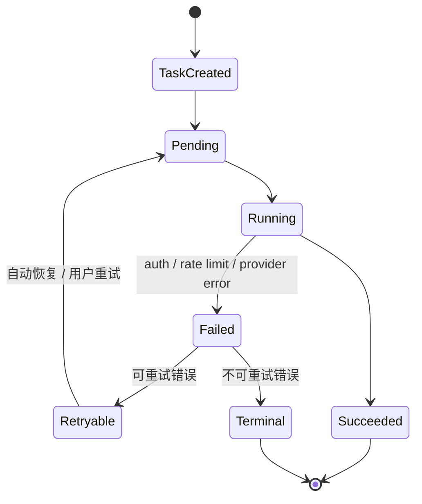

UI 规则：

- task 创建成功后，即使 worker 失败，也保留任务卡。
- 错误展示来自 task artifact 的 `last_error` / `result.failures`。
- 用户可执行动作包括打开设置、切换模型、重试、复制错误信息。

## 会话恢复

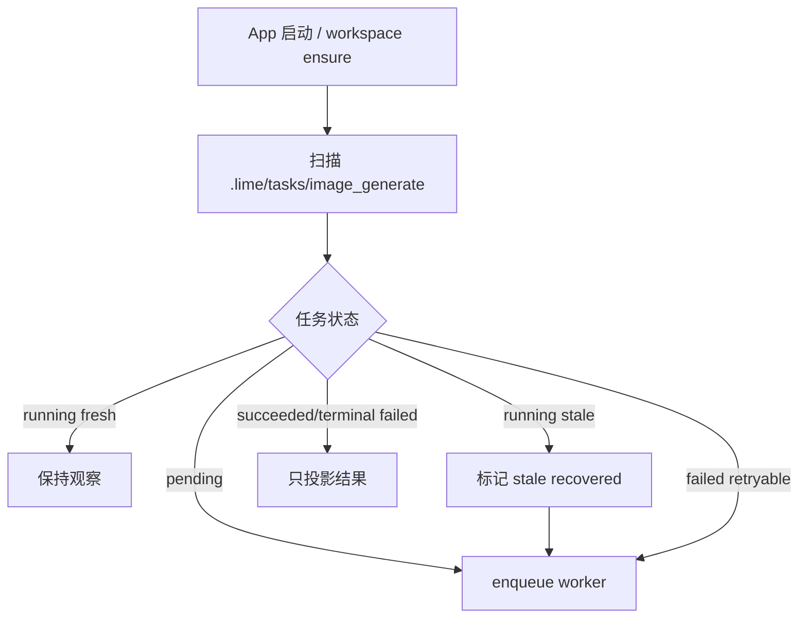

## GUI 状态矩阵

| 后端状态 | 聊天区 | 右侧区 | 文稿 |
| --- | --- | --- | --- |
| `requires_parameters` | 补参卡 | 不打开 | 保留原位 |
| `create_failed` | 错误卡 + 操作按钮 | 不打开 | 保留原位 |
| `task_created/pending` | 图片轻卡 running 占位 | 不展示 workflow | slot 显示等待 |
| `running` | 保持图片轻卡 running | 不展示 attempt | slot 显示生成中 |
| `succeeded` | 显示图片和 caption | 仅可做图片查看 / 回填，不展示 workflow | 回填 |
| `failed retryable` | 失败 + 重试 | 不展示错误详情字段 | slot 显示失败 |
| `failed terminal` | 失败 + 设置入口 | 不展示错误详情字段 | slot 显示失败 |

## Evidence 必须记录

每次图片命令 fixture 至少记录：

- input text
- parsed `ImageCommandIntent`
- provider/model route decision
- task id
- artifact path
- worker attempt id
- provider adapter mode
- final task status
- UI task card visible
- UI raw JSON absent
- UI workflow chrome absent
- live provider used = false
