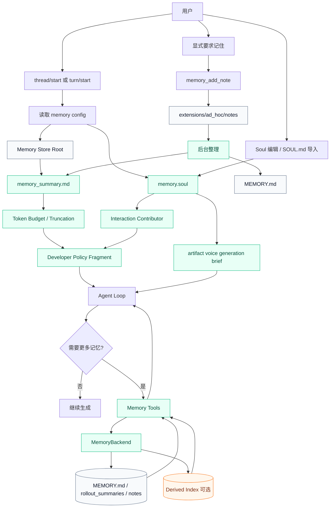
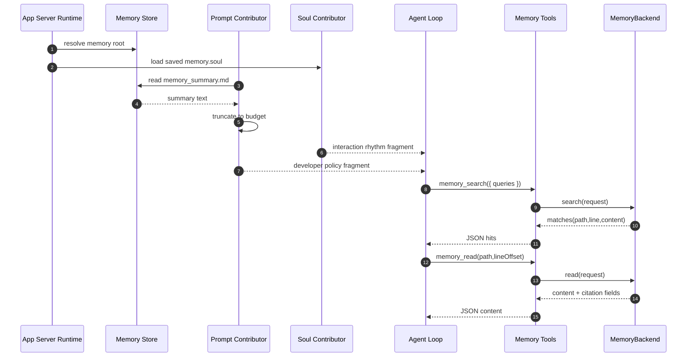
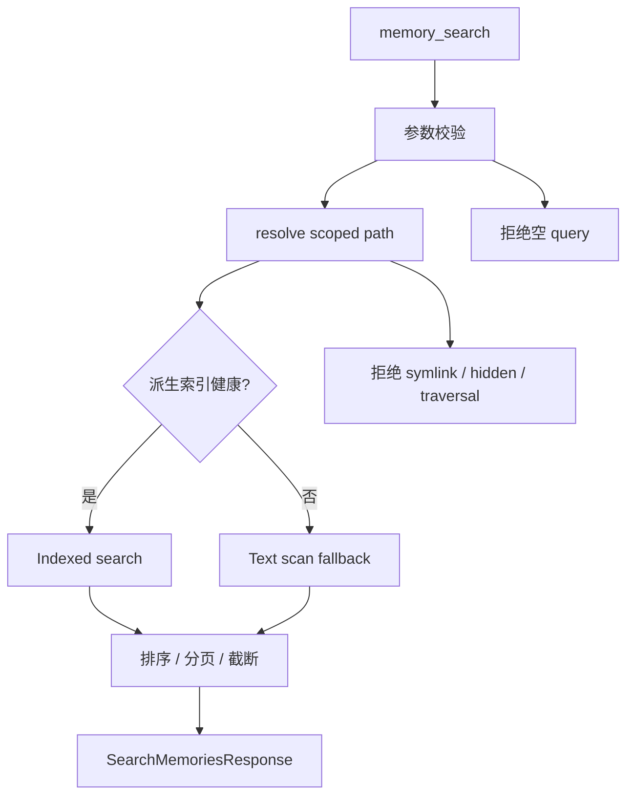
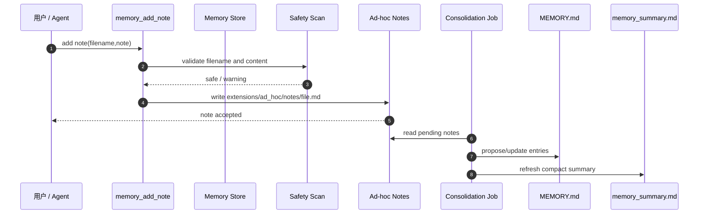
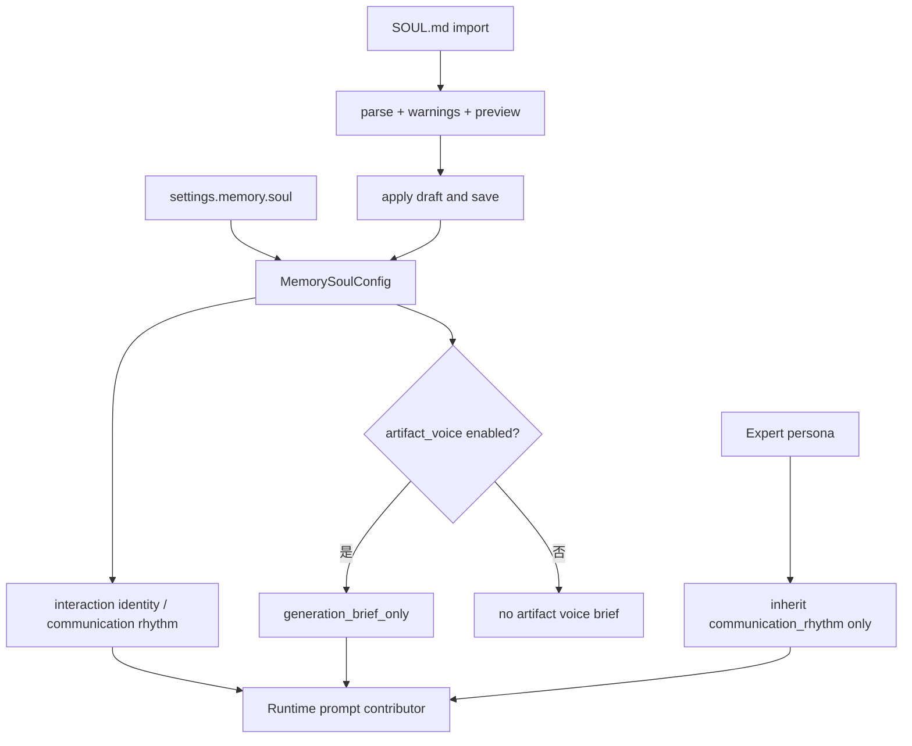
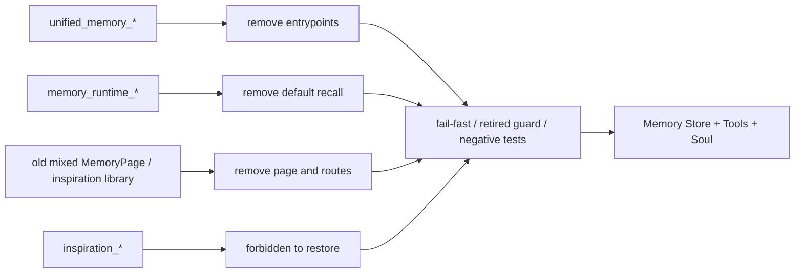
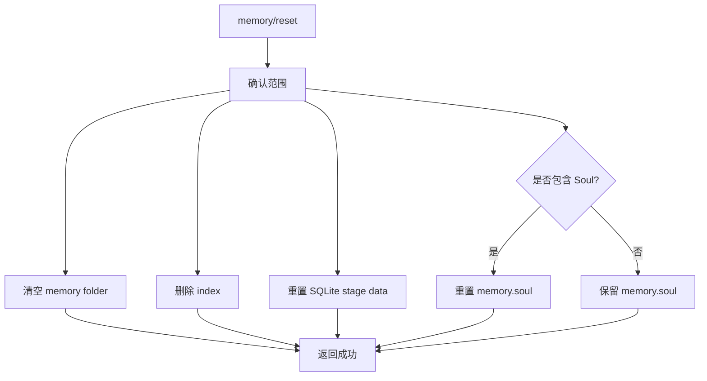

# Lime 文件化记忆图谱

> 状态：current diagrams
> 更新时间：2026-06-18
> 目标：用图固定文件化记忆、summary 注入、工具读取、Soul 配置、后台整理和旧路径清理边界。

## 1. 总体架构

固定判断：

1. 默认 prompt 只注入 summary 和受控 Soul 片段。
2. 原文记忆只通过工具按需读取。
3. Soul 是交互配置，不是 memory store 文件本体。
4. 派生索引可选，不能替代文件事实源。

## 2. Read Path

验收重点：

1. summary 读取失败不阻塞 turn。
2. search/read 输出必须可引用。
3. 工具不能返回绝对路径。
4. Soul 缺失或关闭时不影响 memory tools。

## 3. Search Path

P0 固定：

1. 文本扫描是 baseline。
2. 派生索引只是优化。
3. 索引坏了不影响读取记忆。

## 4. Write Path

固定判断：

1. 写 note 不等于立即改 summary。
2. 后台整理失败不应让当前 turn 失败。
3. 敏感内容必须停在待审状态。

## 5. Soul Path

固定判断：

1. `SOUL.md` 是导入 / 复制快照，运行时事实源是保存后的 `memory.soul`。
2. 导入 warning 不能被跳过。
3. artifact voice 只进入 generation brief，不写 `MEMORY.md` / `memory_summary.md`。
4. expert persona 不回写全局 Soul。

## 6. Old Path Shutdown

清理规则：

1. 旧数据不批量导入为 canonical truth。
2. 旧 embedding 不进入 canonical truth。
3. 旧入口只允许删除、fail-fast 或 retired guard，不允许只读续命。
4. 旧灵感库不再作为产品入口或旁路事实源。

## 7. Reset Path

要求：

1. reset 必须明确全局 / workspace 范围。
2. reset 不应误删线程历史。
3. reset 后下一轮不再注入旧 summary。
4. Soul 是否重置必须由用户选择的范围决定，不能被 memory folder 清空隐式删除。
