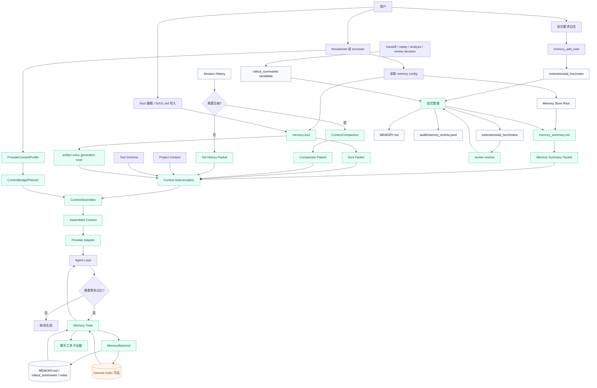
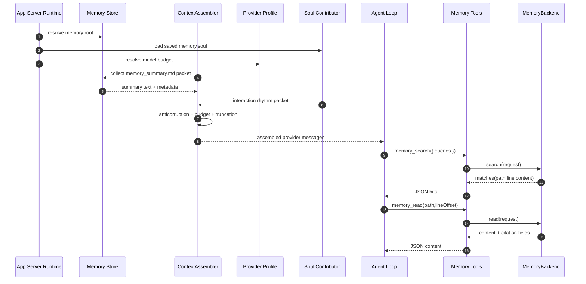
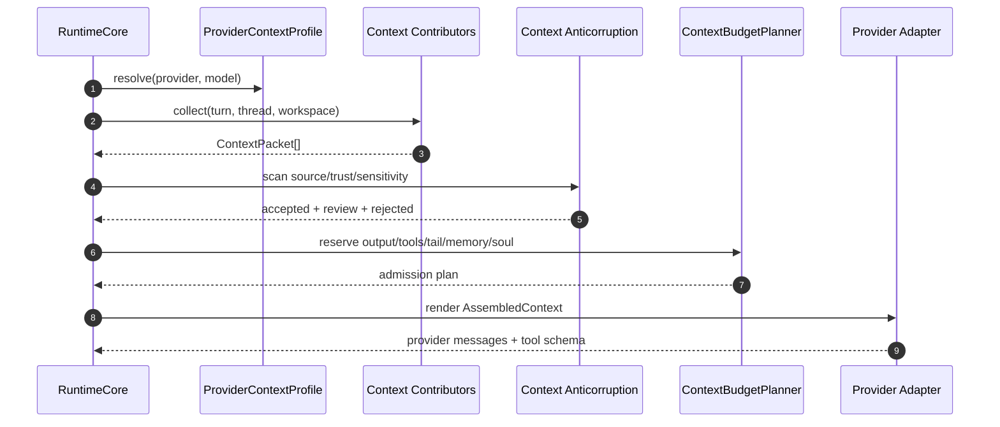
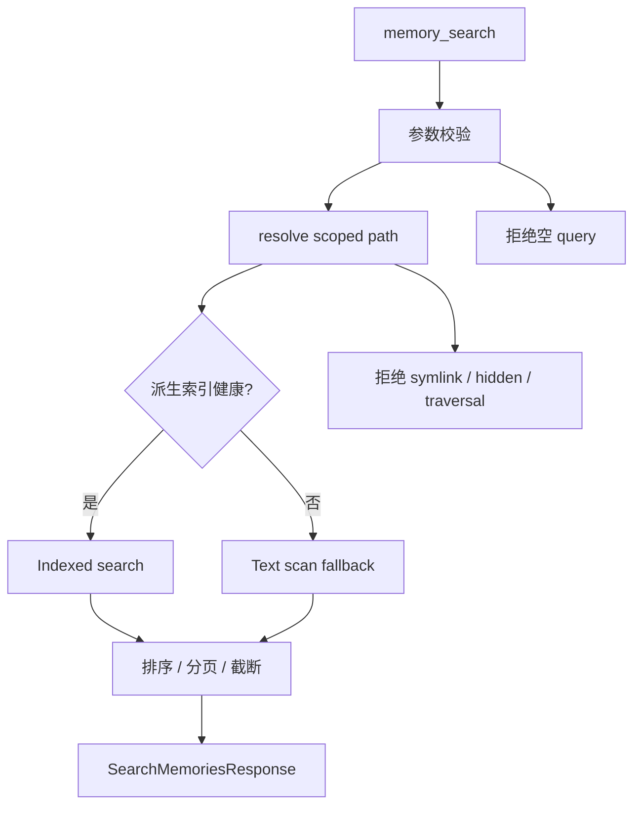
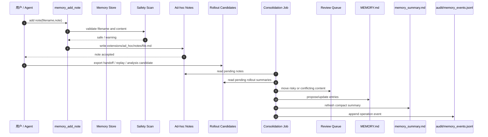
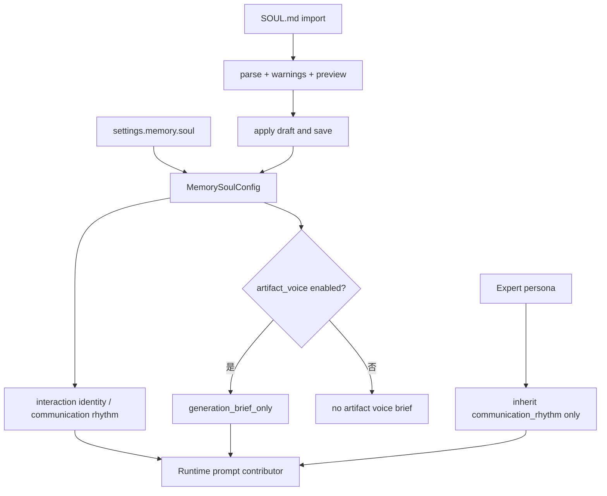
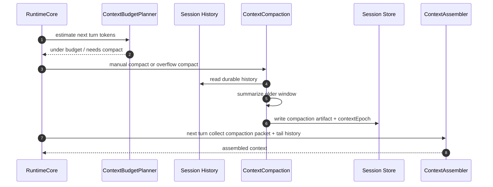
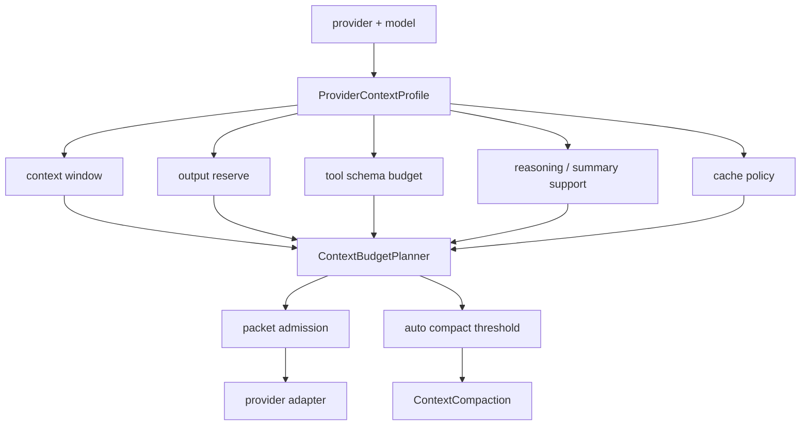
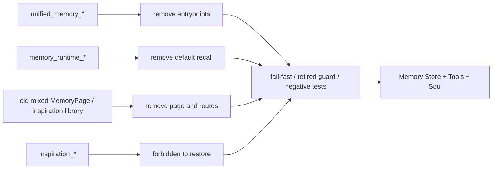
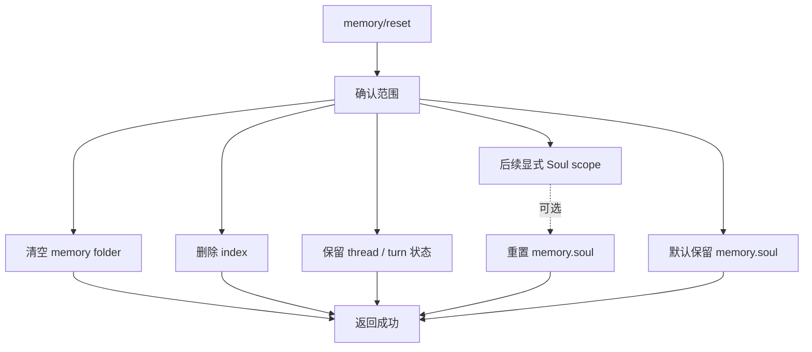

# Lime 记忆与上下文治理图谱

> 状态：current diagrams
> 更新时间：2026-06-19
> 目标：用图固定文件化记忆、上下文防腐、上下文压缩、多模型预算、summary 注入、工具读取、Soul 配置、显式整理和旧路径清理边界。

## 1. 总体架构

固定判断：

1. 默认 prompt 只注入经过 packet 化和防腐检查的 summary、Soul、压缩摘要、项目上下文和尾部历史。
2. 原文记忆只通过工具按需读取。
3. Soul 是交互配置，不是 memory store 文件本体。
4. 派生索引可选，不能替代文件事实源。
5. 运行导出只先形成候选，显式整理后才进入长期记忆正文。
6. provider adapter 只渲染 `AssembledContext`，不重新选择业务上下文。

## 2. Read Path

验收重点：

1. summary 读取失败不阻塞 turn。
2. search/read 输出必须可引用。
3. 工具不能返回绝对路径。
4. Soul 缺失或关闭时不影响 memory tools。
5. packet admission / rejection / truncation 必须可审计。

## 3. Context Assemble Path

固定规则：

1. contributor 只产出 packet，不拼 provider 消息。
2. 防腐层先于预算 admission，不能用截断掩盖敏感内容。
3. provider adapter 不得读取 memory store 或 session DB。
4. 所有 rejected packet 都必须有机器可读原因。

## 4. Search Path

P0 固定：

1. 文本扫描是 baseline。
2. 派生索引只是优化。
3. 索引坏了不影响读取记忆。

## 5. Write Path

固定判断：

1. 写 note 不等于立即改 summary。
2. consolidation 失败不应让当前 turn 失败。
3. 敏感内容必须停在待审状态。
4. review reject 不更新 summary。
5. audit 日志不参与 search / index source。

## 6. Soul Path

固定判断：

1. `SOUL.md` 是导入 / 复制快照，运行时事实源是保存后的 `memory.soul`。
2. 导入 warning 不能被跳过。
3. artifact voice 只进入 generation brief，不写 `MEMORY.md` / `memory_summary.md`。
4. expert persona 不回写全局 Soul。

## 7. Context Compaction Path

固定判断：

1. 压缩生成 artifact，不改写历史消息。
2. 压缩摘要只作为 session context packet 注入。
3. 最近 tail history 保留原文窗口。
4. 压缩摘要如要长期保存，必须先转 rollout candidate，再显式 consolidation。

## 8. Multi-Model Budget Path

固定判断：

1. 切模型只改变 profile 和 admission 计划。
2. memory store、Soul 和 session history 不随 provider 分叉。
3. 小窗口模型触发压缩或降级，大窗口模型也不能无界注入。

## 9. Old Path Shutdown

清理规则：

1. 旧数据不批量导入为 canonical truth。
2. 旧 embedding 不进入 canonical truth。
3. 旧入口只允许删除、fail-fast 或 retired guard，不允许只读续命。
4. 旧灵感库不再作为产品入口或旁路事实源。

## 10. Reset Path

要求：

1. reset 必须明确全局 / workspace 范围。
2. reset 不应误删线程历史。
3. reset 后下一轮不再注入旧 summary。
4. 当前默认 reset 保留 Soul；如后续增加 Soul reset，必须由用户显式选择范围，不能被 memory folder 清空隐式删除。
