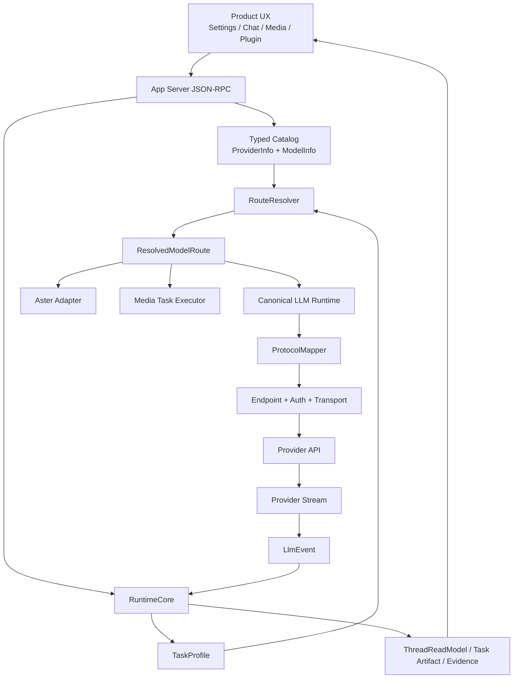
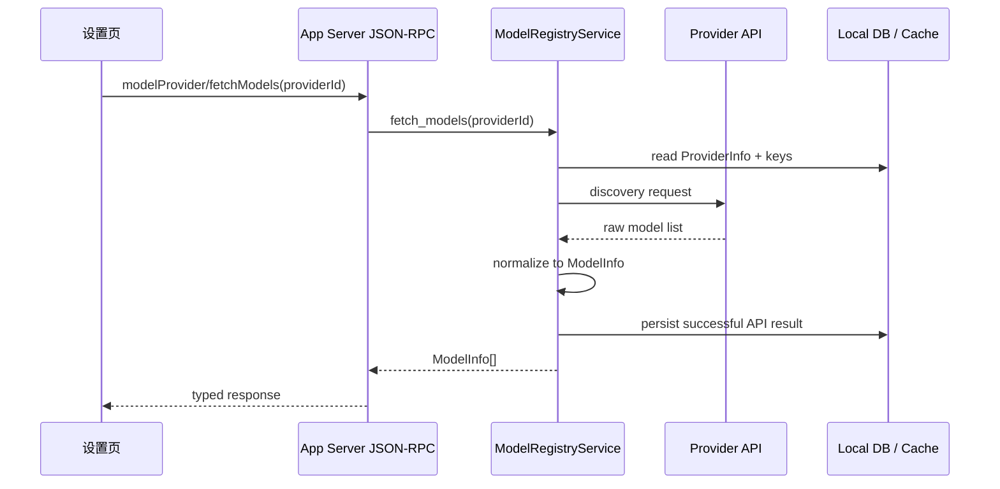
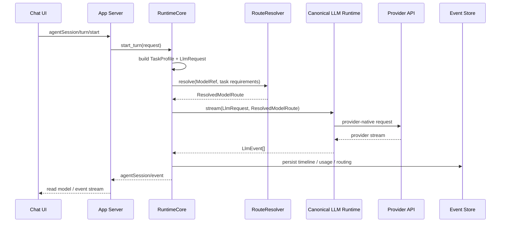
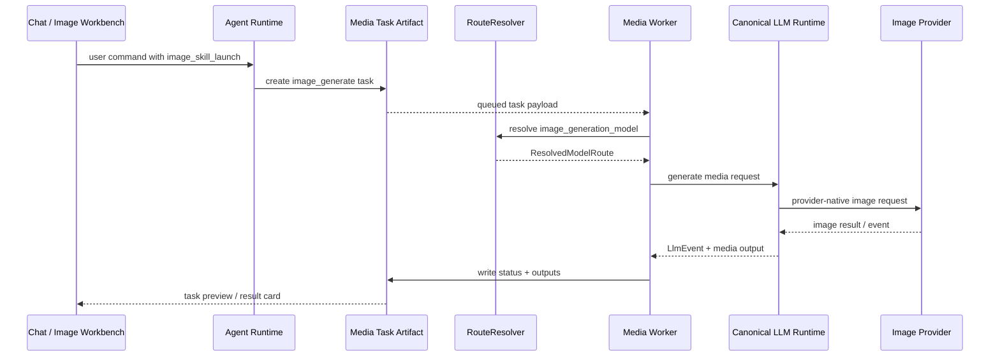
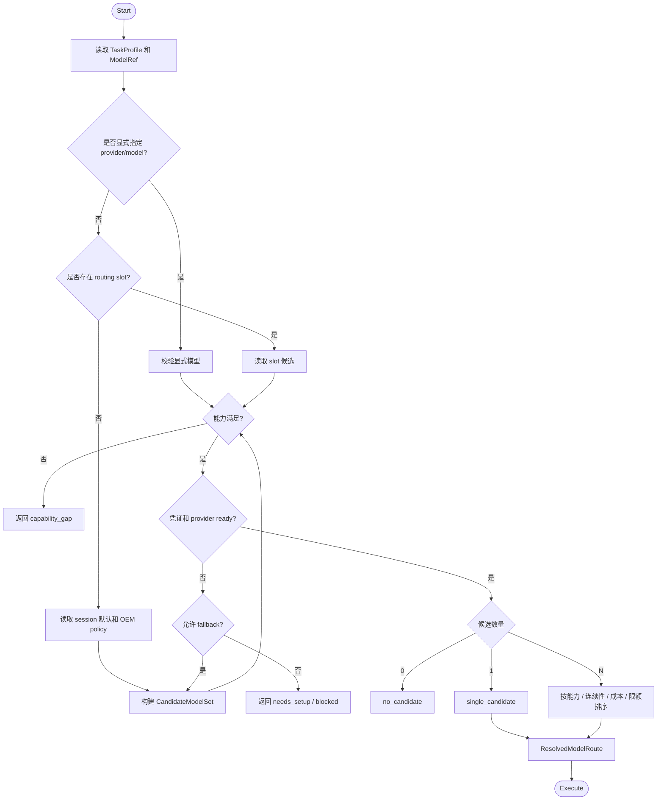

# Lime 多模型多模态统一运行时 PRD

> 状态：current planning source
> 更新时间：2026-06-17
> Owner：Lime Runtime / Model Registry / App Server / Media Task 主链
> 参考项目：`/Users/coso/Documents/dev/rust/codex`、本地多协议 LLM runtime 参考实现
> 关联主链：App Server JSON-RPC、RuntimeCore、`lime-rs/crates/core/src/models/model_registry.rs`、`ModelRegistryService`、media task artifact、Aster adapter

## 1. 背景

Lime 已经具备多模型和多模态能力，但这些能力没有被一条统一的模型运行时主链贯穿。

当前已有基础包括：

1. 模型注册表已经包含能力、任务族、输入输出模态、运行时特性、定价和限制。
2. Provider 配置、API Key、连接测试、模型实时拉取已经收敛到 App Server `modelProvider*` / `modelProviderKey*` / `model/list` 主链。
3. Agent 对话链路可以通过 Aster 访问 OpenAI、Anthropic、Gemini、Ollama 等 provider。
4. Aster message model 已支持文本、图片输入、tool call、reasoning / thinking 等内容形态。
5. 图片、视频、播报、转写等媒体任务已经通过 `.lime/tasks/<task_type>/*.json` artifact 和 worker 执行链形成任务事实源。
6. `mediaTaskArtifact/*` 已经包含 `modality_contract_key`、`routing_slot`、`runtime_contract` 等路由上下文。

问题不在于 Lime 没有多模型或多模态，而在于：

1. 管理面、运行时、媒体任务、前端类型和执行协议没有同一个强类型事实源。
2. 模型选择仍主要依赖 provider/model 字符串、`serde_json::Value`、metadata JSON pointer 和兼容字段。
3. Aster `CredentialBridge` 仍承担过多 provider 映射职责，容易继续长成第二个 runtime。
4. 多模态执行存在两套心智：聊天 runtime 支持 image part，媒体任务 runtime 独立拼 provider HTTP 请求。
5. 新增 provider、新增模态、新增执行协议时，容易在 Provider service、Aster adapter、media worker、前端类型里重复补特判。

因此需要一条统一的 **Canonical LLM Layer**，把模型目录、路由决策、协议映射、传输、事件流和媒体任务执行收敛到同一套可扩展架构。

## 2. 外部项目借鉴

### 2.1 Codex 可借鉴点

Codex 的价值不在多协议扩展，而在工程治理：

1. 会话、回合、事件、账号和认证边界清晰。
2. Provider 作为运行时对象时，会显式暴露能力上限、认证状态、account state、continuation 等信息。
3. 模型执行链路和配置链路受 schema、协议和 CI 守卫约束。
4. 不把 UI 层选择直接当作最终执行事实，而是进入 runtime 决策。

但 Codex 不适合作为 Lime 多模型协议抽象模板。它当前 provider wire protocol 基本锁定在 OpenAI Responses API，`chat` wire API 已被拒绝。Lime 不能复制这种单协议模型，否则会牺牲 Anthropic、Gemini、Ollama、OpenAI-compatible、图片、音频、视频等现实需求。

结论：

- 借 Codex 的 runtime discipline、auth/account/continuation、session/turn lifecycle。
- 不借 Codex 的单 Responses wire protocol 假设。

### 2.2 多协议 LLM runtime 可借鉴点

本地多协议 LLM runtime 更适合作为 Lime 多模型抽象参考。核心思想是把协议语义和部署信息拆开：

```text
Protocol
  common LLMRequest -> provider-native body
  provider stream frame -> common LLMEvent

Route
  Protocol + Endpoint + Auth + Framing / Transport + Defaults
```

这个拆法的价值是：

1. OpenAI-compatible provider 可以复用同一个 OpenAI Chat protocol。
2. Responses、Anthropic Messages、Gemini generateContent、Bedrock Converse 可以各自拥有 protocol mapper。
3. Endpoint、Auth、Header、Framing、Defaults 不污染 protocol 本身。
4. 上层只消费 canonical request / event，不需要知道 provider event shape。
5. 新 provider 优先选择既有 protocol 和新 endpoint/auth，而不是复制一整套执行器。

结论：

- Lime 应借鉴 `Protocol + Route + canonical LLMRequest / LLMEvent` 的分层。
- Lime 需要结合自身 App Server、RuntimeCore、media task、Aster adapter 逐步落地，而不是直接搬 TypeScript 实现。

## 3. 一句话目标

把 Lime 的多模型、多模态能力统一到 App Server / RuntimeCore 下的 typed model catalog、route resolver 和 canonical LLM runtime，让聊天、Agent、图片、视频、音频、转写、embedding 等任务都通过同一套模型能力、路由决策、协议映射和事件流演进。

## 4. 目标与收益

### 4.1 用户目标

1. 用户可以清楚知道当前任务为什么选择某个 provider/model。
2. 用户指定图片、视频、音频模型时，系统不会误用聊天模型。
3. 用户上传图片、文件、音频或选择多模态任务时，系统能按能力选择合适模型。
4. provider 缺凭证、模型不支持、额度不足、协议不支持时，用户看到明确可行动原因。
5. 切换 provider 或模型后，聊天、Agent、媒体任务和自动化行为一致，不出现某些入口成功、某些入口失败。

### 4.2 产品收益

1. 支持更多 provider 和模型时，不需要为每个入口单独接一遍。
2. 模型设置页、Agent Chat、媒体工作台、Plugin 和自动化任务能共享模型目录。
3. Lime Cloud 下发模型绑定、OEM managed provider、本地自定义 provider 可以进入同一路由链。
4. 多模态模型能力可解释，减少“看起来能选但实际不能跑”的假入口。
5. 后续模型经济调度、成本控制、fallback、限额和 continuation 可以统一落在 runtime facts。

### 4.3 工程收益

1. 消除 Rust protocol、前端 TS 类型、runtime JSON、media worker contract 平行维护。
2. 把 `serde_json::Value` 从模型核心协议中逐步清退到兼容边界。
3. 把 provider-specific HTTP 拼装收进 protocol mapper。
4. 把 Aster `CredentialBridge` 降级为 adapter，避免继续承接新业务逻辑。
5. 用 `ResolvedModelRoute` 替代散落的 provider/model 字符串。
6. 让 event store、UI、evidence、usage、media task 消费同一套 `LlmEvent`。

## 5. 非目标

本阶段不做：

1. 不一次性重写所有 provider。
2. 不废弃 Aster 当前执行链，而是先把它降级为 compat adapter。
3. 不恢复旧 Tauri Provider facade、旧本地模型 catalog 或旧 `get_api_key_providers` 命令族。
4. 不新增与 App Server JSON-RPC 平级的模型后端。
5. 不让 Electron main 承接 provider 业务逻辑；Electron 仍只做 Desktop Host bridge。
6. 不把 media task artifact 从 `.lime/tasks` 迁走。
7. 不把所有多模态能力都塞进聊天消息协议；任务型 image/video/audio 仍保留 task artifact，但执行模型能力和协议 mapper 需要复用统一 runtime。
8. 不承诺首期支持所有 provider-native 高级参数，未知能力必须显式 `unsupported` 或进入 provider options 兼容区。

## 6. 用户与角色

### 6.1 普通创作者

关注内容结果，不关心 provider 协议。需要：

1. 可用模型列表准确。
2. 图片、视频、音频任务自动走正确模型。
3. 错误提示能说明缺少 API Key、模型不支持、额度不足还是连接失败。

### 6.2 专业创作者 / 运营

会主动配置多个 provider 和任务模型。需要：

1. 对不同任务指定不同模型槽位。
2. 在聊天、图片、视频、播报等入口复用配置。
3. 能看懂为什么系统没有使用首选模型。

### 6.3 App / Skill 开发者

为 Lime 创建 Plugin、Skill、场景或自动化。需要：

1. 声明任务所需能力，而不是直接硬编码 provider/model。
2. 调用统一 runtime 后拿到标准事件和错误。
3. 通过 typed contract 接入多模态输入和输出。

### 6.4 Lime Runtime 维护者

维护 App Server、RuntimeCore、Aster adapter、media runtime。需要：

1. 新 provider 接入路径明确。
2. 新协议 mapper 可测试。
3. 模型选择和能力判断能被 fixture 覆盖。
4. compat / deprecated / dead 边界不会回流。

## 7. 用户故事

### 7.1 选择正确模型

作为普通用户，
当我在聊天里上传一张图片并询问“帮我分析这张海报哪里不好”时，
我希望 Lime 自动选择支持视觉输入的聊天模型，
这样我不会得到“模型看不到图片”的无效回答。

验收：

1. runtime 根据 `ContentPart.media` 推导 `required_capabilities = [vision, text_output]`。
2. RouteResolver 只选择具备 image input 的候选模型。
3. 如果当前模型不支持视觉，UI 展示可切换模型或配置 provider 的原因。

### 7.2 图片模型绑定

作为创作者，
当我在设置里把 `@GPT Images 2` 绑定到某个图片模型后，
我希望在聊天里使用这个标签时一定走图片生成模型，
这样不会被当前聊天模型或默认 provider 覆盖。

验收：

1. mention catalog 下发或本地配置携带 `provider_id / model / executor_mode / modality_contract_key / routing_slot`。
2. 发送边界把这些字段写入 `image_skill_launch`。
3. RouteResolver 以 `routing_slot=image_generation_model` 解析图片生成 route。
4. 任务 artifact 保留显式 provider/model，不从聊天模型推断。

### 7.3 新增 OpenAI-compatible provider

作为高级用户，
当我添加一个兼容 OpenAI Chat Completions 的自定义 provider 时，
我希望只填写 base URL、API Key 和 provider 类型，
这样 Lime 能复用已有 OpenAI Chat protocol，而不是要求开发者为这个 provider 写新执行器。

验收：

1. provider catalog 记录 endpoint、auth、protocol hint。
2. 模型拉取结果转成 typed `ModelInfo`。
3. RouteResolver 生成 `Protocol=openai_chat`、Endpoint=用户 base URL、Auth=Bearer。
4. 执行事件统一输出 `LlmEvent`。

### 7.4 Provider 不支持任务能力

作为用户，
当我用只支持文字的本地模型执行图片生成时，
我希望系统阻断并告诉我“当前模型不支持 image_generation”，
这样我可以切换模型，而不是等待一个永远失败的任务。

验收：

1. Candidate resolution 返回 `no_candidate` 或 `capability_gap=image_generation`。
2. 不创建伪成功任务。
3. UI 提供设置入口或模型切换提示。

### 7.5 多模态 Plugin

作为 Plugin 开发者，
当我的 App 需要分析图片、生成文案、再生成配图时，
我希望只声明不同 step 的能力需求，
这样 App 不需要自己管理 provider API、凭证、HTTP 协议和事件解析。

验收：

1. App 通过 App Server `agentSession/turn/start` 或 task artifact 传入能力需求。
2. RuntimeCore 为每个 step 解析 `ResolvedModelRoute`。
3. 事件、usage、错误和 artifact 回写保持统一。

## 8. 用户用例

### UC-01 配置 Provider 并实时拉取模型

前置条件：

1. 用户打开设置中的 AI 服务商。
2. 用户填写 provider base URL 和 API Key。

主流程：

1. 前端调用 `modelProvider/create` 或 `modelProvider/update`。
2. App Server 保存 ProviderInfo 和凭证引用。
3. 用户触发 `modelProvider/fetchModels`。
4. `ModelRegistryService` 调用上游 `/models` 或 provider-specific discovery。
5. 返回结果规范化为 typed `ModelInfo`。
6. 前端显示可用模型、能力、模态、状态和来源。

异常：

1. 上游不支持 `/models`：返回 structured error 或 declared model hint。
2. API Key 错误：返回 auth error，不落缓存。
3. 模型能力不完整：允许以 `source=inferred` 标记，但不能伪装成 API 明确声明。

### UC-02 聊天 turn 选择模型

前置条件：

1. 当前 session 有默认 provider/model。
2. 用户发送包含文本、图片或文件的消息。

主流程：

1. 前端通过 App Server `agentSession/turn/start` 提交 turn。
2. RuntimeCore 生成 `TaskProfile` 和 `LlmRequest`。
3. RouteResolver 根据 session、显式选择、任务能力、ProviderInfo、ModelInfo、凭证、限额生成 `ResolvedModelRoute`。
4. Canonical LLM runtime 调用对应 ProtocolMapper 和 Transport。
5. provider stream 被解析成 `LlmEvent`。
6. RuntimeCore 把事件写入 timeline、read model、usage 和 evidence。

异常：

1. 当前模型能力不足：返回 `routing_not_possible` 或要求用户切换。
2. provider 不可用：进入 fallback 链或阻断。
3. stream event 解析失败：返回 provider protocol error，并保留可诊断 metadata。

### UC-03 图片生成任务

前置条件：

1. 用户通过 `@配图`、图片工作台或图片模型绑定发起任务。
2. 发送边界已写入 `image_skill_launch` 或 task artifact payload。

主流程：

1. Agent turn 首刀调用 `Skill(image_generate)`。
2. Skill 创建标准 `image_generate` task artifact。
3. task payload 携带 `modality_contract_key=image_generation`、`routing_slot=image_generation_model`、显式 provider/model 或 slot。
4. worker 请求 RouteResolver 解析图片模型 route。
5. ProtocolMapper 构建 Responses image、Images API、provider-native image API 或兼容 route 请求。
6. 结果写回标准 task file。
7. 聊天轻卡和图片工作台从 `.lime/tasks` 读取状态和结果。

异常：

1. 图片 binding 不存在：fail closed，不回退聊天模型。
2. provider endpoint 不支持当前图片协议：返回 `unsupported_endpoint`。
3. 图片任务 worker 失败：task artifact 写入 failed 状态和 provider error。

### UC-04 Plugin 使用模型生成能力

前置条件：

1. Plugin 已通过 App Server current 主链接入 runtime。
2. App 声明 task capability。

主流程：

1. App 发起 `agentSession/turn/start` 或标准 task artifact。
2. RuntimeCore 从 App metadata 读取 `task_family` 和 modality requirements。
3. RouteResolver 选择 route。
4. 执行结果以 `LlmEvent`、artifact、task output 回传。

约束：

1. Plugin UI runtime 不接收上游 provider API Key。
2. App 不直接调用 provider endpoint。
3. App 只消费 scoped token 或 App Server 协议。

### UC-05 Provider 连接测试

前置条件：

1. 用户新增或编辑 provider。

主流程：

1. 前端调用 `modelProvider/testConnection` 或 `modelProvider/testChat`。
2. App Server 通过 RouteResolver 生成测试 route。
3. 测试只使用最小请求和只读能力。
4. 返回 latency、成功状态、错误分类和建议动作。

约束：

1. 连接测试不能把 provider-specific 执行细节继续塞进 API Key CRUD service。
2. 测试结果不能被写成模型能力真相，除非来自明确 discovery 或 typed probe。

## 9. 产品范围

### 9.1 P0 范围

1. 模型与 Provider protocol 强类型化设计。
2. `ModelInfo / ProviderInfo / EndpointKind / AuthKind / ProtocolKind` schema。
3. Runtime route resolver 合同。
4. Canonical `LlmRequest / ContentPart / LlmEvent` 合同。
5. Aster adapter 边界定义。
6. media task `TaskExecutionContract` 合同。
7. 守卫规则与迁移路线。

### 9.2 P1 范围

1. OpenAI Chat、OpenAI Responses、Anthropic Messages、Gemini 的 protocol mapper。
2. 文本、图片输入、tool calling、reasoning、usage 事件统一。
3. 聊天 turn 主链消费 `ResolvedModelRoute`。
4. 前端模型设置页读取 typed schema。

### 9.3 P2 范围

1. 图片生成 route 接入统一 resolver。
2. `responses_image_generation`、Images API、provider-native image API mapper 收敛。
3. `image_generate` task worker 不再直接拼 provider-specific HTTP。
4. 图片模型 binding 和聊天模型选择解耦。

### 9.4 P3 范围

1. 音频、视频、转写、TTS、embedding、rerank 等任务族接入同一 route 合同。
2. 模型成本、限额、fallback、continuation 进入 routing facts。
3. Plugin 和自动化任务复用统一模型 route。

## 10. 事实源分类

### 10.1 current

后续继续演进的事实源：

1. App Server JSON-RPC。
2. RuntimeCore。
3. `lime-rs/crates/core/src/models/model_registry.rs`。
4. `ModelRegistryService`。
5. `lime-rs/crates/app-server-protocol` typed model protocol。
6. `packages/app-server-client` generated / maintained client types。
7. `.lime/tasks/<task_type>/*.json` media task artifact。
8. `src/lib/api/modelRegistry.ts`、`src/lib/api/apiKeyProvider.ts`、`src/lib/api/mediaTasks.ts` 作为前端 API 网关。

### 10.2 compat

只允许委托、适配、投影，不允许继续长新业务逻辑：

1. Aster provider adapter。
2. `CredentialBridge -> AsterProviderConfig`。
3. `runtimeOptions.hostOptions.asterChatRequest.provider_config`。
4. 旧 session metadata 中的 provider/model 字段。
5. 前端 `src/lib/api/agentRuntime.ts` compat barrel。

### 10.3 deprecated

只允许迁移和下线：

1. runtime 中散落的 provider/model JSON pointer 解析。
2. media worker 中 provider-specific HTTP 拼装。
3. `serde_json::Value` 形式的模型 protocol 返回。
4. 只靠 provider type 字符串判断能力的逻辑。

### 10.4 dead

不得恢复或重新接回主链：

1. 旧 Tauri Provider facade 命令族。
2. `lime-rs/resources/models` 本地模型 catalog。
3. 旧 `get_api_key_providers`、`fetch_provider_models_auto`、`test_api_key_provider_connection` 等 Provider facade 命令。
4. `lime-rs/src/**` 和 `lime-rs/src/commands/**` 旧 Rust 主 crate / wrapper。
5. 生产路径中的 mock fallback。

## 11. 目标架构

### 11.1 总体架构图

```text
┌─────────────────────────────────────────────────────────────────────┐
│                          Product / UX                               │
│ Settings / Chat / Plugin / Media Workbench / Automation          │
└───────────────────────────────┬─────────────────────────────────────┘
                                │ App Server JSON-RPC
                                ▼
┌─────────────────────────────────────────────────────────────────────┐
│                         App Server Protocol                         │
│ ProviderInfo / ModelInfo / TaskExecutionContract / LlmRequest       │
└───────────────────────────────┬─────────────────────────────────────┘
                                │ typed structs
                                ▼
┌─────────────────────────────────────────────────────────────────────┐
│                            RuntimeCore                              │
│ TaskProfile -> CandidateModelSet -> RoutingDecision                 │
└───────────────────────────────┬─────────────────────────────────────┘
                                │ ResolvedModelRoute
                                ▼
┌─────────────────────────────────────────────────────────────────────┐
│                      Canonical LLM Runtime                          │
│ ContentPart[] -> ProtocolMapper -> Transport -> LlmEvent[]          │
└───────────────┬──────────────────────────────┬──────────────────────┘
                │                              │
                ▼                              ▼
┌─────────────────────────────┐   ┌───────────────────────────────────┐
│ Provider Protocol Mappers   │   │ Adapters                          │
│ openai_chat / responses     │   │ Aster adapter / Media executor    │
│ anthropic / gemini / ...    │   │ Legacy compat projections         │
└───────────────┬─────────────┘   └───────────────────────────────────┘
                │
                ▼
┌─────────────────────────────────────────────────────────────────────┐
│ Provider Endpoint / Auth / Transport                                │
│ OpenAI-compatible / Anthropic / Gemini / Ollama / Gateway / OEM      │
└─────────────────────────────────────────────────────────────────────┘
```

### 11.2 Mermaid 架构图



## 12. 核心数据合同

### 12.1 ProviderInfo

```text
ProviderInfo
  id: ProviderId
  display_name: string
  enabled: bool
  provider_type: ProviderType
  endpoint: EndpointInfo
  auth: AuthDescriptor
  supported_protocols: ProtocolKind[]
  management_plane: local_settings | oem_control_plane | hybrid
  status: ready | needs_key | disabled | error
  source: user | oem | system | imported
```

### 12.2 ModelInfo

```text
ModelInfo
  provider_id: ProviderId
  model_id: ModelId
  display_name: string
  canonical_model_id?: string
  provider_model_id?: string
  task_families: ModelTaskFamily[]
  input_modalities: ModelModality[]
  output_modalities: ModelModality[]
  capabilities: ModelCapabilities
  runtime_features: ModelRuntimeFeature[]
  limits: ModelLimits
  pricing?: ModelPricing
  status: available | deprecated | unavailable | unknown
  source: api | registry | inferred | custom
```

### 12.3 ModelRef

```text
ModelRef
  provider_id: ProviderId
  model_id: ModelId
  variant?: string
  routing_slot?: string
  source: explicit | session | task | oem | fallback
```

### 12.4 ContentPart

```text
ContentPart
  text
  media
  file
  tool_call
  tool_result
  reasoning
  provider_metadata
```

### 12.5 LlmRequest

```text
LlmRequest
  model_ref: ModelRef
  task_profile: TaskProfile
  system: ContentPart[]
  messages: Message[]
  tools: ToolDefinition[]
  tool_choice?: ToolChoice
  generation: GenerationOptions
  provider_options?: ProviderOptions
  continuation?: ProviderContinuationState
```

### 12.6 LlmEvent

```text
LlmEvent
  message_start
  text_delta
  reasoning_delta
  media_delta
  tool_input_start
  tool_input_delta
  tool_call
  tool_result
  usage
  provider_error
  finish
```

### 12.7 ResolvedModelRoute

```text
ResolvedModelRoute
  model_ref: ModelRef
  provider: ProviderInfo
  model: ModelInfo
  protocol: ProtocolKind
  endpoint: EndpointInfo
  auth: AuthMaterialRef
  transport: TransportKind
  framing: FramingKind
  defaults: RouteDefaults
  capability_snapshot: CapabilitySnapshot
  decision: RoutingDecision
```

### 12.8 TaskExecutionContract

```text
TaskExecutionContract
  task_type: image_generate | video_generate | voice_generate | transcription_generate | embedding | chat
  modality_contract_key: string
  routing_slot: string
  required_task_families: ModelTaskFamily[]
  required_input_modalities: ModelModality[]
  required_output_modalities: ModelModality[]
  executor_policy: direct_llm | task_worker | adapter
  fallback_policy: none | same_protocol | compatible_provider | user_override_required
```

## 13. 运行时流程

### 13.1 Provider 模型拉取时序图



### 13.2 聊天 turn 模型执行时序图



### 13.3 图片生成任务时序图



## 14. 路由决策流程图



## 15. 关键功能需求

### 15.1 typed model protocol

要求：

1. `model/list` 返回 typed `ModelInfo[]`，不再长期返回 `serde_json::Value[]`。
2. `modelProvider/list` 返回 typed `ProviderInfo[]`。
3. `modelProvider/catalog/list` 返回 typed provider catalog。
4. create/update patch 需要有 typed schema 和受控 extension 字段。
5. TypeScript 类型从 App Server protocol 生成或由协议 crate 作为唯一来源维护。

验收：

1. 前端模型设置页不再维护独立能力 union。
2. Rust `EnhancedModelMetadata` 与 App Server protocol 不再平行漂移。
3. 新增模型能力字段必须同步 schema、前端类型、service normalizer 和 contract test。

### 15.2 RouteResolver

要求：

1. 输入 `ModelRef + TaskProfile + CapabilityRequirement + Context`。
2. 输出 `ResolvedModelRoute` 或 structured routing error。
3. 支持显式模型、session 默认、profile slot、media routing slot、OEM policy、fallback chain。
4. 不把 provider/model 字符串直接传给执行器。
5. 所有 route decision 写入 runtime event / read model。

验收：

1. `providerPreference/modelPreference` 只作为 compat 输入。
2. 新增 route 来源必须扩展 enum，不允许继续加 JSON pointer。
3. `routing_not_possible`、`capability_gap`、`needs_setup`、`unsupported_protocol` 可被 UI 展示。

### 15.3 ProtocolMapper

要求：

1. 每个 mapper 只负责 common request 到 provider body，以及 provider event 到 `LlmEvent`。
2. mapper 不持有 API Key，不决定 base URL，不读取用户设置。
3. mapper 有独立 fixture 和 parser test。
4. provider-specific 参数进入 `provider_options`，但核心能力必须 typed。

首批 mapper：

1. `openai_chat`
2. `openai_responses`
3. `anthropic_messages`
4. `gemini_generate_content`
5. `ollama_chat`

后续 mapper：

1. `openai_images`
2. `responses_image_generation`
3. `fal`
4. `bedrock_converse`
5. `vertex_gemini`

### 15.4 Canonical LlmEvent

要求：

1. 支持 text delta。
2. 支持 reasoning / thinking delta。
3. 支持 tool input delta、tool call、tool result。
4. 支持 media output event。
5. 支持 usage、cache usage、provider metadata。
6. 支持 provider error structured payload。
7. 能投影到 Agent timeline、UI 轻卡、evidence、media task status。

验收：

1. 不同 provider 的 reasoning 不再散在 `reasoning_content`、`thinking_delta`、metadata 文本里。
2. usage 统一记录，不靠 UI 或 worker 各自解析。
3. media task worker 可以消费 `LlmEvent` 而不是 provider raw JSON。

### 15.5 多模态任务合同

要求：

1. `runtime_contract: serde_json::Value` 升级为 typed `TaskExecutionContract`。
2. image/video/audio/transcription task 都声明 required capabilities。
3. `routing_slot` 成为 route resolver 输入，而不是 worker 自己猜模型。
4. task artifact 继续作为任务状态事实源。
5. worker 不再新增 provider-specific HTTP 分支，新增协议必须走 ProtocolMapper。

验收：

1. `image_generation_model`、`video_generation_model` 都能解析到可执行 route；`voice_generation_model` 在没有 audio worker / RuntimeCore provider protocol mapper 前只能写入 `ModelTaskRequest` 和能力 evidence，不得伪装为已接入执行 route。
2. 显式图片模型绑定不会被聊天模型覆盖。
3. unsupported route fail closed，不伪造 task submitted。

### 15.6 Aster adapter 降级

要求：

1. `CredentialBridge` 只做 `ResolvedModelRoute/AuthMaterial -> AsterProviderConfig` 投影。
2. 新 provider 能力不再直接加到 `CredentialBridge`。
3. `force_responses_api` 被 `ProtocolKind=openai_responses` 替代。
4. provider continuation 能力从 route/model capability 来，不再靠 provider_name/model_name 启发式。

验收：

1. Aster adapter 可以继续承接当前 Agent 对话执行。
2. 新 protocol mapper 不需要改 Aster provider factory。
3. compat 字段有退出条件。

## 16. 非功能需求

| 类别     | 要求                                                                          |
| -------- | ----------------------------------------------------------------------------- |
| 可扩展性 | 新 provider 优先复用现有 protocol，只新增 endpoint/auth/catalog 映射。        |
| 可测试性 | 每个 ProtocolMapper 必须有 request fixture 和 stream fixture。                |
| 可解释性 | 每次 routing decision 都有 source、reason、fallback_chain 和 capability_gap。 |
| 安全     | Provider API Key 不下发给 Plugin UI runtime 或 renderer。                  |
| 稳定性   | provider discovery 失败不覆盖上一次成功缓存。                                 |
| 兼容性   | 旧字段只在边界投影，不进入新事实源。                                          |
| 可观测   | usage、error、latency、route id、protocol id 写入 telemetry。                 |
| 跨平台   | 路径和任务 artifact 继续使用统一 workspace / app path 封装。                  |

## 17. 验收标准

### 17.1 P0 验收

1. PRD 中的 `ProviderInfo / ModelInfo / LlmRequest / LlmEvent / ResolvedModelRoute / TaskExecutionContract` 有设计落点。
2. 明确 current / compat / deprecated / dead 分类。
3. 明确 App Server JSON-RPC 是唯一新增模型能力入口。
4. 明确 Aster 和 media worker 的 adapter 边界。

### 17.2 P1 验收

1. `model/list` 和 `modelProvider/list` 返回 typed schema。
2. 前端模型设置页消费 typed schema。
3. OpenAI Chat、Responses、Anthropic、Gemini 至少一条主链能通过 ProtocolMapper fixture。
4. 聊天 turn 通过 `ResolvedModelRoute` 执行。

### 17.3 P2 验收

1. `image_generate` task 使用 RouteResolver。
2. `responses_image_generation` 从 media worker 中拆成 protocol mapper。
3. 图片模型 binding 可端到端执行。
4. 不支持图片生成的模型会明确阻断。

### 17.4 P3 验收

1. video/audio/transcription 至少一种任务接入 typed `TaskExecutionContract`。
2. continuation 能力不再靠 OpenAI/Codex 字符串启发式。
3. route decision 出现在 session read model 和 evidence export。

## 18. 成功指标

1. 新增 OpenAI-compatible provider 不需要新增执行器代码。
2. 新增 provider-specific protocol 只需要新增 ProtocolMapper 和 catalog mapping。
3. `model.rs` 中核心模型返回不再使用裸 `serde_json::Value`。
4. media runtime 中 provider-specific HTTP 拼装逐步下降。
5. 用户看到的模型能力和实际 runtime 能力一致。
6. 图片、视频、音频任务的模型选择不再依赖聊天模型默认值。
7. provider/model 路由错误能被 UI、evidence 和 telemetry 同时解释。

## 19. 风险与缓解

| 风险                                  | 影响                 | 缓解                                                           |
| ------------------------------------- | -------------------- | -------------------------------------------------------------- |
| 一次性重写过大                        | 破坏现有 Agent 对话  | 先让 Aster 成为 adapter，逐协议迁移。                          |
| typed schema 不覆盖所有 provider 参数 | 自定义 provider 受限 | 核心字段 typed，provider_options 保留受控 extension。          |
| 能力推断不准                          | 错误路由或错误阻断   | 明确 `source=api/registry/inferred/custom`，UI 展示置信来源。  |
| media worker 巨型文件继续膨胀         | 难维护               | 先拆 image protocol mapper，新增 provider 禁止进 worker 分支。 |
| 前端仍使用旧 TS 类型                  | 类型漂移             | schema export + contract test + 禁止新增平行类型。             |
| fallback 过度自动化                   | 用户困惑或成本失控   | fallback 必须带 policy、reason 和 user override 规则。         |

## 20. 治理守卫

建议新增或扩展以下守卫：

1. 禁止 `app-server-protocol/src/protocol/v0/model.rs` 新增核心模型 `serde_json::Value` 返回。
2. 禁止前端新增与 `ModelInfo / ProviderInfo` 平行的模型能力类型。
3. 禁止 RuntimeCore 新增 provider/model JSON pointer 解析。
4. 禁止 media worker 新增 provider-specific HTTP 拼装。
5. 禁止旧 Provider facade 命令回到 `safeInvoke`、DevBridge truth、mock priority 或 App Server current 主链。
6. 禁止生产路径从 mock fallback 获取模型列表或 provider readiness。

最低验证：

```bash
npm run test:contracts
npm run governance:legacy-report
```

触达 GUI 或模型设置页时补：

```bash
npm run verify:local
npm run verify:gui-smoke
```

触达 Rust runtime 时补：

```bash
cargo test --manifest-path "lime-rs/Cargo.toml" -p <affected-crate>
```

## 21. 分阶段路线

### Phase 0：合同冻结

目标：

1. 冻结 PRD 和核心类型名。
2. 标注 current / compat / deprecated / dead。
3. 明确 schema export 和测试入口。

产物：

1. 本 PRD。
2. 后续 OpenSpec change。
3. 执行计划。

### Phase 1：模型协议强类型化

目标：

1. App Server model protocol 返回 typed `ModelInfo / ProviderInfo`。
2. 前端模型设置页消费统一类型。
3. `ModelRegistryService` 输出成为协议事实源。

关键退出条件：

1. 不再需要前端手写能力类型来解释模型列表。
2. contract test 能覆盖模型列表 shape。

### Phase 2：RouteResolver 与 LlmEvent

目标：

1. RuntimeCore 使用 `ResolvedModelRoute`。
2. 建立 canonical `LlmEvent`。
3. Aster adapter 只做投影。

关键退出条件：

1. 聊天主链不再直接依赖 provider/model 字符串执行。
2. route decision 可写入 read model。

### Phase 3：协议 mapper 首批迁移

目标：

1. OpenAI Chat、Responses、Anthropic、Gemini mapper 接入。
2. stream parser 输出 `LlmEvent`。
3. usage、reasoning、tool call 统一。

关键退出条件：

1. 每个 mapper 有 fixture。
2. provider-specific stream event 不泄漏到 UI。

### Phase 4：媒体任务并轨

目标：

1. image task worker 使用 RouteResolver。
2. `responses_image_generation` 拆成 mapper。
3. `TaskExecutionContract` typed。

关键退出条件：

1. 图片模型 binding 端到端可用。
2. worker 不新增 provider-specific HTTP 分支。

### Phase 5：经济调度与高级能力

目标：

1. cost / limit / continuation 进入 route decision。
2. video/audio/transcription/embedding 接入。
3. Plugin 和 automation 复用模型 runtime。

关键退出条件：

1. 多任务族共享候选解析。
2. fallback 和阻断原因可解释。

## 22. 开放问题

1. `ProviderInfo` 是否需要同时支持多个 endpoint，例如 chat endpoint、responses endpoint、images endpoint。
2. `provider_options` 的 extension schema 如何限制，避免重新变成万能 JSON。
3. image/audio/video provider 的输出 artifact 是否全部通过 `LlmEvent.media_output` 投影，还是保留 task-specific output projection。
4. 模型能力推断的置信度是否需要进入 UI。
5. continuation state 是否按 protocol 定义，还是按 model runtime feature 定义。
6. App Server protocol 是否要为 `ProtocolKind` 引入版本号，例如 `openai_chat.v1`。
7. 本地 Ollama 模型能力探测是否需要独立 probe，还是只依赖 registry + 用户声明。

## 23. 文档关系

本 PRD 与现有文档的关系：

1. `internal/aiprompts/commands.md` 继续定义命令边界和 current App Server 主链。
2. `internal/aiprompts/governance.md` 继续定义 current / compat / deprecated / dead 分类。
3. `internal/roadmap/task/model-routing.md` 继续作为任务层模型路由规则参考。
4. `internal/roadmap/appserver/prd.md` 继续作为 App Server 进程和 JSON-RPC 主链参考。
5. 本 PRD 只负责模型 catalog、route resolver、canonical LLM runtime、多模态执行合同。

## 24. 一句话原则

新增模型能力时，不要问“这个 provider 在哪里加特判”，而要问：

```text
它复用哪个 Protocol？
它的 Endpoint/Auth 从哪里来？
它声明哪些 ModelInfo capabilities？
RouteResolver 如何解释这个任务？
最终 LlmEvent 写回哪条 current 主链？
```

只有能回答这五个问题，新增模型或模态才算进入了 Lime 的可扩展架构。
