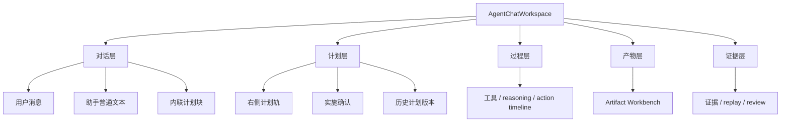
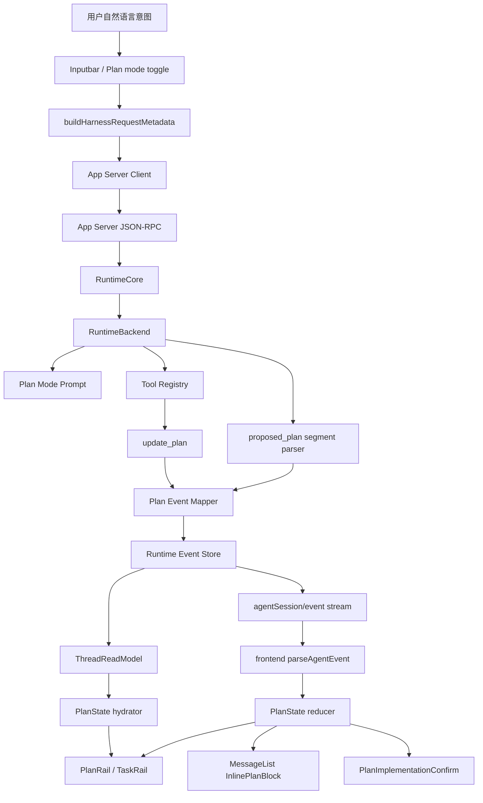
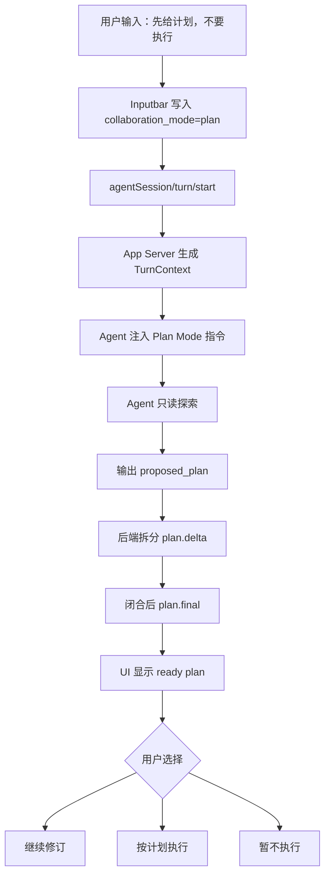
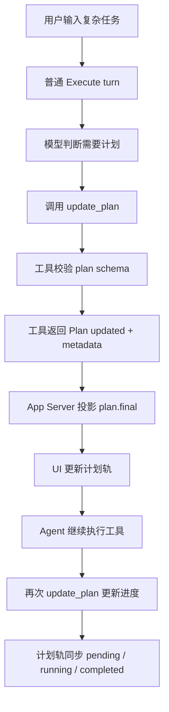
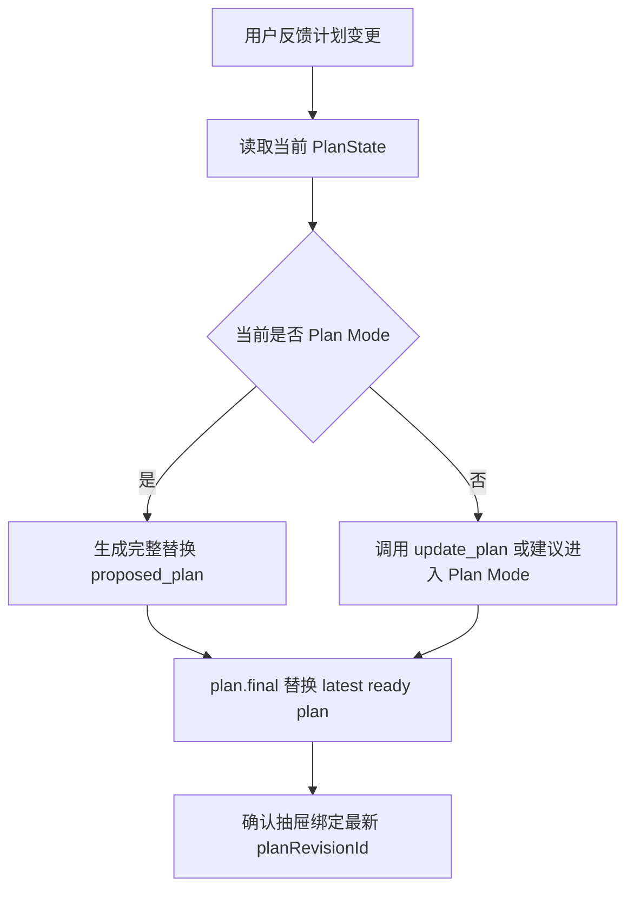
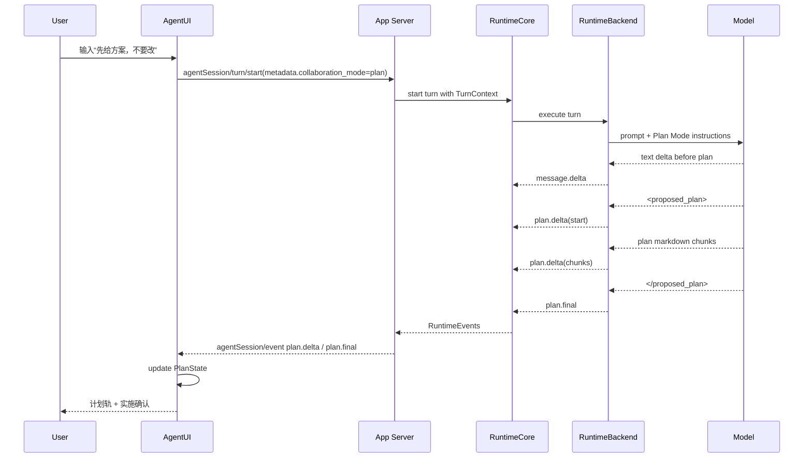
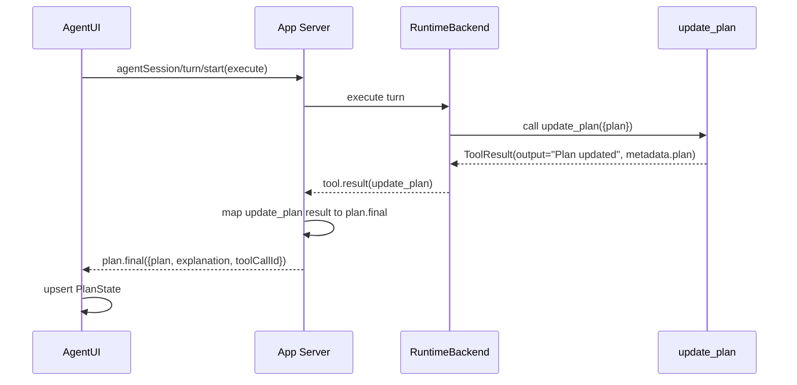
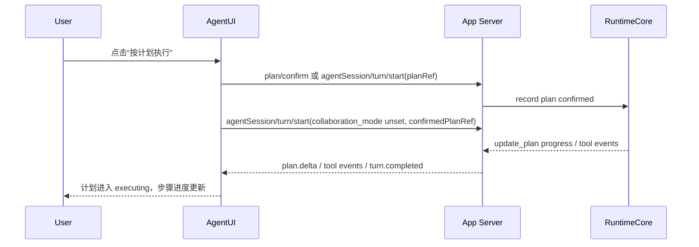

# Lime Plan PRD

> 状态：current planning source
> 更新时间：2026-06-23
> Owner：Lime Agent Runtime / AgentUI / App Server
> 参考对象：Codex Plan Mode、`update_plan`、`<proposed_plan>`、PlanDelta / PlanItem、Turn Plan Updated UI、opencode multi-provider request / reasoning event / todo dock

## 1. 背景

Codex 的计划体验有一个关键特点：用户输入一句自然语言意图后，Agent 不需要显式展示“thinking”，也不需要用户理解内部工具，就能很自然地把执行计划更新到 UI 中。截图里的“Updated Plan”不是普通 Markdown 列表，而是模型通过计划协议或计划工具产生的结构化状态。

Lime 当前已经具备多块基础能力：

1. 输入栏可以把计划模式写入 request metadata：`harness.collaboration_mode.mode = plan`。
2. App Server 能把 metadata 投影到 turn context。
3. Agent prompt manager 已有 Plan Mode 指令，要求输出 `<proposed_plan>`。
4. Agent 已有 Codex-compatible `update_plan` 工具。
5. Runtime / read model 已有 `plan.delta` / `plan.final` thread item 投影。
6. AgentUI 已有计划轨、任务 rail、`<proposed_plan>` 展示和本地实施确认雏形。

但这些能力还没有形成 Codex 那种完整闭环。主要问题是：计划事件不是一等流式事件，`update_plan` 结果和 `<proposed_plan>` 计划块没有稳定汇聚为同一个 live plan state，前端协议也未把 `plan.delta / plan.final` 当成可直接驱动 UI 的 streaming event。

同时，Lime 不是单模型产品。计划能力必须在 OpenAI / Codex、Anthropic、Gemini、OpenAI-compatible、OpenRouter / Gateway、本地或第三方兼容模型之间保持一致体验。不同模型对 reasoning / thinking 的支持差异很大：有的能返回独立 reasoning block，有的只返回 reasoning summary，有的需要 provider options 显式打开 thinking，有的完全不支持。这意味着 Lime 不能把“计划”绑定到某个模型私有字段，也不能把 thinking 当作普通 assistant 正文混进去。

因此，Plan PRD 需要同时解决两层问题：

1. **Codex 主架构对齐**：自然语言意图 -> Plan Mode / `update_plan` / `<proposed_plan>` -> plan events -> UI 计划轨。
2. **多模型横切能力**：provider / model capability -> reasoning policy -> request options -> reasoning events -> UI 过程展示。

本 PRD 的目标是把 Lime Plan 能力收敛为 current 主链能力，而不是新增平行 planner。

## 2. 一句话目标

让 Lime 像 Codex 一样：用户只要表达“先规划 / 调整计划 / 继续按计划执行 / 这个计划改一下”，Agent 就能通过 `Plan Mode + update_plan + proposed_plan + plan events` 自然更新 GUI 计划轨，并在用户确认后进入实施。

## 3. 核心收益

### 3.1 对用户

- 多步骤任务一开始就能看到清晰计划，不必从长段回复里找执行路线。
- 计划可以在对话中自然被修订，用户不需要学习特殊命令。
- “计划阶段”和“实施阶段”清楚分离，降低误改文件、误执行命令的风险。
- 计划完成后有明确实施确认，不再依赖一句“要继续吗”的普通文本。
- 历史会话恢复后仍能看到当时的计划、进度和实施状态。

### 3.2 对产品

- 把 Lime 从“聊天输出一段计划”升级为“计划是 Agent 工作台的一等对象”。
- 让计划轨成为复杂任务的主对象带，连接对话、工具、产物、证据和下一步动作。
- 为后续多 Agent、目标管理、长期任务和自动化任务提供统一计划语义。
- 复用 Codex 用户已经熟悉的交互模式，降低用户迁移成本。

### 3.3 对工程

- 计划事实源统一到 App Server / RuntimeCore / AgentEvent，不在前端散落文本解析。
- `update_plan`、`<proposed_plan>`、历史导入计划统一投影到 `PlanState`。
- GUI、read model、evidence、replay 可以消费同一个计划事实源。
- 测试可通过 fixture 验证计划从输入到 UI 的完整闭环。

## 4. 产品原则

1. **计划是一等运行事实**：计划不只是 assistant 正文里的 Markdown，而是 RuntimeEvent / ThreadItem / UI state。
2. **Plan Mode 不等于 update_plan**：Plan Mode 是协作模式；`update_plan` 是非 Plan Mode 下的执行进度工具。
3. **用户不需要学习协议**：用户说“先给方案”“第三步改一下”“继续执行”即可触发合适行为。
4. **默认不误执行**：处于 Plan Mode 时禁止写文件、apply patch、运行迁移或执行实际实施动作。
5. **计划可修订、可确认、可恢复**：计划不是一次性消息，必须支持更新、替换、确认、忽略和历史恢复。
6. **UI 信息优先**：计划轨服务任务主线，不做营销式 hero，不把内部实现词暴露给普通用户。
7. **只走 current 主链**：新增能力进入 App Server / RuntimeCore / AgentUI，不回流旧命令或 mock fallback。
8. **模型无关，能力感知**：PlanState 语义与 Provider 私有字段解耦；模型差异由 ModelCapabilityResolver / ProviderAdapter 吸收。
9. **reasoning 与 plan 分层**：reasoning / thinking 是过程证据，不是计划事实；plan event 才驱动 PlanRail。
10. **不伪造 thinking**：模型不支持 reasoning 时不合成假 thinking，只显示普通进度和工具轨迹。

## 5. 范围

### 5.1 本阶段范围

- Plan Mode 行为完整对齐 Codex。
- `update_plan` 工具作为结构化计划 / 进度更新工具。
- `<proposed_plan>` 流式解析为 `plan.delta / plan.final`。
- AgentEvent 前端协议支持 live plan event。
- AgentUI 计划轨、对话内计划块、实施确认统一消费同一个 `PlanState`。
- 历史会话、导入 Codex 会话、ThreadReadModel 恢复计划。
- 最小 GUI smoke 覆盖从输入到计划显示。
- 多模型能力矩阵：provider、model、reasoning 支持、tool streaming 支持、计划协议支持。
- thinking / reasoning 事件链：后端保留 reasoning start / delta / end，前端以可展开过程呈现。
- 模型选择与 reasoning strength：输入栏或会话头部显示当前模型、reasoning 档位、降级原因。
- Provider request options：按模型能力注入 reasoning / thinking / prompt cache / encrypted reasoning 相关配置。

### 5.2 非目标

- 不新增独立 Planner 服务。
- 不把计划能力做成项目管理系统或甘特图。
- 不支持多人协作编辑计划。
- 不让用户手动编辑复杂 JSON plan schema。
- 不一次性重写 `AgentChatWorkspace`。
- 不恢复 `lime-rs/src/**` 或旧 Tauri command wrapper。
- 不把生产计划链路降级到 mock。
- 不保证所有模型都有 thinking；能力缺失时只降级计划体验，不伪造 reasoning。
- 不暴露供应商明确不返回的隐藏 chain-of-thought；只展示可用的 reasoning summary / thinking block / 过程状态。
- 不照搬 opencode 的 plan file / plan_exit 文件工作流；Lime 以 GUI PlanRail 和 App Server plan events 为事实源。
- 不把 Provider catalog 回退到已下线本地 `lime-rs/resources/models`。

## 6. 用户画像

| 用户 | 需求 | 成功判断 |
| --- | --- | --- |
| 普通创作用户 | 想先看方案再生成内容 | 计划清晰、能改、确认后执行 |
| 开发者用户 | 想让 Agent 改代码前先列实施步骤 | Plan Mode 不误写文件，计划可交给执行 |
| 运营用户 | 想把复杂任务拆成阶段 | 计划轨能展示当前步骤和下一步 |
| 高级用户 | 想在执行中更新计划 | `update_plan` 能即时反映进度 |
| 复盘用户 | 想回看为什么这样做 | 历史会话保留计划和确认记录 |

## 7. 用户故事

### 7.1 先规划，不直接执行

作为用户，
当我输入“先帮我分析一下怎么改，不要直接改代码”时，
我希望 Lime 进入计划模式，只读仓库并输出可实施计划，
这样我可以先确认方向再允许修改。

验收：

1. request metadata 写入 `collaboration_mode=plan`。
2. 后端注入 Plan Mode 指令。
3. Agent 不执行写文件、apply patch、迁移等动作。
4. UI 显示计划卡和计划轨。
5. 计划完成后出现实施确认入口。

### 7.2 自然开始复杂任务

作为用户，
当我输入“帮我把这个功能做完整”时，
我希望 Agent 自动先用 `update_plan` 建立任务清单，
这样我能看到它接下来要做什么。

验收：

1. 默认执行模式下模型可以调用 `update_plan`。
2. `update_plan` 工具结果转换为结构化 `plan.final` 或等价 plan state。
3. 计划轨即时显示 pending / in_progress / completed。
4. 同一时刻最多一个 in_progress。

### 7.3 修订刚生成的计划

作为用户，
当我说“第三步不要做兼容，直接删旧实现”时，
我希望 Lime 修改已有计划而不是重新开始一段无关回复，
这样计划始终反映最新共识。

验收：

1. 当前 plan state 进入下一轮上下文。
2. Agent 输出替换后的 `<proposed_plan>` 或调用 `update_plan`。
3. UI 用新计划替换旧计划，并保留历史计划事件。
4. 实施确认指向最新计划。

### 7.4 确认计划后实施

作为用户，
当计划已经可执行时，
我希望点击“按计划执行”或输入“按这个做”，
这样 Agent 退出 Plan Mode 并开始实际修改。

验收：

1. 确认动作生成可追踪事件。
2. 下一轮 request 不再带 `collaboration_mode=plan`。
3. 执行态可以使用 `update_plan` 更新进度。
4. UI 把计划从 ready 切到 executing。

### 7.5 历史恢复计划

作为用户，
当我打开历史会话时，
我希望看到当时的计划和执行进度，
这样我能继续任务而不是重新读长对话。

验收：

1. ThreadReadModel 包含 plan thread items。
2. 前端从 thread items 恢复结构化计划。
3. Codex import 的 `update_plan` 和 `<proposed_plan>` 也能投影为计划轨。

### 7.6 多模型下保持计划体验

作为用户，
当我从 Codex / OpenAI 切到 Anthropic、Gemini 或 OpenAI-compatible 模型时，
我希望计划轨仍然能正常生成、修订和执行，
这样计划能力不是某个模型专属功能。

验收：

1. 会话请求带上明确的 `providerId / modelId / modelVariant`。
2. Runtime 根据模型能力选择 Plan Mode prompt、`update_plan` tool、reasoning options。
3. 支持 tool calling 的模型优先使用 `update_plan`；不稳定或不支持工具的模型仍可用 `<proposed_plan>`。
4. UI 显示当前模型和 reasoning 档位；降级时给出简短原因。

### 7.7 thinking 作为过程，而不是计划本身

作为用户，
当模型支持 thinking / reasoning summary 时，
我希望能在需要时展开查看“它正在分析什么”，
但默认仍以计划步骤和下一步动作作为主界面，
这样界面不被长 reasoning 淹没。

验收：

1. 后端把 reasoning start / delta / end 保存为独立 runtime event。
2. 前端 timeline 可显示“正在分析”和可展开 reasoning summary。
3. PlanRail 不从 reasoning 文本解析计划，只消费 `plan.delta / plan.final`。
4. 模型不支持 reasoning 时，UI 不显示假 thinking，只显示计划和工具进度。

## 8. 关键用例

| 用例 | 入口 | 运行模式 | 输出 | UI |
| --- | --- | --- | --- | --- |
| 显式计划 | “先给方案，不要改” | Plan Mode | `<proposed_plan>` | 计划轨 + 实施确认 |
| 默认复杂任务 | “完成这个功能” | Execute | `update_plan` + 工具执行 | 计划进度 + timeline |
| 计划修订 | “第三步改成...” | Plan Mode 或 Execute | 新 plan event | 替换当前 ready plan |
| 继续执行 | “按计划做” | Execute | `update_plan` 进度 | 计划轨 running |
| 中途调整 | “先停，改一下计划” | Plan Mode | 新 proposed_plan | 计划轨回到 ready |
| 历史恢复 | 打开旧会话 | Read model | plan thread items | 恢复计划轨 |
| Codex 导入 | 导入 Codex 会话 | Import projection | plan.final | 内联计划块 |
| 切换模型 | 会话头部选择模型 | Execute / Plan | capability-aware request | 模型标签 + 计划轨保持 |
| 调整 reasoning | 选择 low / medium / high | Execute / Plan | providerOptions reasoning | 过程抽屉显示档位 |
| 无 thinking 模型 | 使用普通兼容模型 | Execute / Plan | text + plan events | 不显示 thinking，计划不降级 |
| 有 thinking 模型 | 使用 Codex / Claude / Gemini reasoning 模型 | Execute / Plan | reasoning events + plan events | thinking 行 + PlanRail |

## 9. Codex 对齐矩阵

| Codex 能力 | 行为 | Lime 对齐方案 |
| --- | --- | --- |
| Plan Mode | 协作模式，禁止 mutation，最终输出 `<proposed_plan>` | 使用 `collaboration_mode=plan`，由 Agent prompt 注入严格规则 |
| `update_plan` | checklist/progress 工具，最多一个 `in_progress` | 保留现有 `UpdatePlanTool`，补工具结果到 plan state 的 live 投影 |
| `<proposed_plan>` | 模型正文中的计划协议块 | 后端流式 parser 拆分 normal text 与 plan text |
| PlanDelta | 计划内容可流式显示 | 新增 / 补齐 `plan.delta` streaming event |
| Plan item | 完整计划成为 thread item | `plan.final` 写入 read model 与 thread items |
| Turn plan updated | 客户端收到结构化计划更新 | 前端 `AgentEventPlanDelta/Final` + reducer 更新 `PlanState` |
| UI Updated Plan | 状态化计划卡，不是普通文本 | AgentUI 计划轨、对话内计划块、实施确认统一显示 |

### 9.1 Codex 主架构与 opencode 横切参考

Lime 的 Plan 主架构以 Codex 为准，opencode 只作为多 Provider、reasoning event 和任务 dock 的横切参考。

| 维度 | Codex 参考 | opencode 参考 | Lime 决策 |
| --- | --- | --- | --- |
| 计划事实源 | `update_plan` 工具 + `<proposed_plan>` + UI Updated Plan | Plan Mode 写 plan file，`plan_exit` 切换 build agent；`todowrite` 更新 todo dock | 以 Codex plan events / PlanRail 为主，不照搬 plan file；可吸收 todo dock 的紧凑进度 UI |
| 协作模式 | Plan Mode 是只读规划状态 | Plan Mode 通过 system reminder 强制只读，只允许编辑计划文件 | Lime Plan Mode 只读，不编辑业务文件；计划事实写 App Server event / ThreadReadModel |
| 多模型请求 | Codex 主要围绕 OpenAI/Codex 模型优化 | `ProviderTransform.options / variants / providerOptions` 按 provider 注入 reasoning、thinking、cache、headers | Lime 增加 ModelCapabilityResolver 和 ProviderRequestAdapter，不把 Plan 绑死在 OpenAI 字段 |
| reasoning 表示 | Codex UI 不要求暴露完整 thinking，重点是 plan 更新自然出现 | `LLMEvent.reasoningStart / delta / end`，SessionMessage 中 reasoning 是独立 content part | Lime 增加 `reasoning.delta/final` 或等价 AgentEvent，timeline 可展开，PlanRail 不依赖 reasoning 文本 |
| 历史回放 | plan item 可恢复 | reasoning、text、tool 都进入 session event / message projector | Lime ThreadReadModel 同时恢复 plan facts 与 reasoning facts |
| UI 呈现 | Updated Plan 卡 / 计划进度 | Thinking row、Todo dock、model variant command | Lime 采用计划轨 + thinking 过程行 + 模型/推理档位控制 |

### 9.2 opencode 可复用结论

1. **请求准备必须集中**：opencode 的 request prep 把 system、messages、tools、params、headers、provider options 合并到一个边界，避免组件层关心 provider 差异。Lime 应把同类职责放在 RuntimeCore / RuntimeBackend 的 request builder 或 provider adapter，不让前端拼私有字段。
2. **reasoning 必须是一等 part/event**：opencode 把 AI SDK 的 `reasoning-start / reasoning-delta / reasoning-end` 映射成 LLMEvent，再投影到 session event 和 message content。Lime 也要让 reasoning 走独立事件，而不是混到 `message.delta`。
3. **providerOptions 是适配层，不是业务协议**：OpenAI 的 `reasoningEffort / reasoningSummary / include`、Anthropic 的 `thinking`、Gemini 的 `thinkingConfig`、OpenAI-compatible 的 `enable_thinking` 都应由 adapter 生成；PlanState 只看到标准化 capability 和 event。
4. **模型变体即 reasoning 档位**：opencode 用 model variant 表示 low / medium / high / max 等档位。Lime 可以把 reasoning strength 作为 model runtime option，但 UI 要显示“该模型支持哪些档位”和“当前实际使用哪个档位”。
5. **任务 dock 适合作为紧凑计划入口**：opencode 的 todo dock 在输入区上方展示完成数、当前项和折叠列表。Lime 可把类似设计用于窄屏或右侧工作台被 artifact 占用时的 PlanRail capsule。

## 10. Lime 现状与缺口

### 10.1 已具备

1. 输入栏计划模式 metadata builder。
2. App Server `collaboration_mode_from_request`。
3. Agent `PLAN_COLLABORATION_INSTRUCTION`。
4. Agent `UpdatePlanTool`。
5. Agent 完整 `<proposed_plan>` 提取。
6. App Server `thread_item_projection/plan.rs`。
7. 前端 `proposedPlan` 工具函数与计划轨恢复。
8. `planImplementationDecision` / `planComposerDecision` 本地确认逻辑。
9. Codex import 中 `update_plan` 到 `plan.final` 的投影。

### 10.2 主要缺口

| 缺口 | 影响 | 处理方式 |
| --- | --- | --- |
| `<proposed_plan>` 只有完整闭合后才提取 | 计划不能像 Codex 一样边输出边出现 | 后端引入 segment parser，输出 `plan.delta` |
| 前端 `AgentEvent` 未一等支持 `plan.delta/final` | live 计划事件进不到统一 reducer | 补类型、parser、projection、stream handler |
| `update_plan` 工具结果未统一成为 live plan state | 工具进度和计划轨可能脱节 | 工具 terminal event 转 `plan.final` 或更新 PlanState |
| 普通 assistant 文本可能重复展示计划块 | UI 噪声高 | normal text 与 plan text 分流 |
| 实施确认仍偏本地推断 | 难以恢复和复盘 | 确认/忽略写入 runtime event 或 thread metadata |
| 历史与 live plan state 入口不一致 | 继续任务时状态漂移 | 统一 `PlanState` selector |
| 多模型 reasoning 能力未进入 Plan 设计 | 只有 Codex/OpenAI 体验完整，其他模型易降级成普通文本 | 增加 ModelCapabilityResolver 与 ProviderRequestAdapter |
| thinking 与 plan 混层 | UI 可能把 reasoning 当计划，或重复展示长过程 | reasoning 独立事件，PlanRail 只消费 plan facts |
| 模型切换后 plan 上下文不稳定 | 不同 provider 历史 reasoning / tool-call 格式不兼容 | 历史 lowering 时按 same-model 保留 provider metadata，跨模型降为普通文本 |
| reasoning 档位无 UI 反馈 | 用户不知道当前 high/low 是否生效 | 模型标签显示 requested / effective reasoning level 和降级原因 |

## 11. 产品体验设计

### 11.1 UI 类型

本能力属于 Agent 工作台主路径，不是独立营销页，也不是单个弹窗功能。UI 应遵循 Lime 真实业务系统结构：

- 主对象：当前 turn / 当前计划。
- 当前阶段：planning、ready、executing、completed、blocked。
- 下一步动作：修订计划、按计划执行、忽略计划、查看过程。
- 辅助信息：计划来源、更新时间、关联 turn、执行进度。

### 11.2 页面结构

```text
AgentChatWorkspace
  ConversationPane
    MessageList
      Assistant normal text
      InlinePlanBlock
    Inputbar
      Plan mode toggle
      Send / Stop / Continue

  Workbench / Right Surface
    PlanRail
      PlanHeader
      PlanStepList
      PlanRevisionMeta
      PlanActionBar
    RuntimeTimeline
    Artifact / Evidence panels

  Bottom / Drawer
    PlanImplementationConfirm
      Plan summary
      Execute / Revise / Dismiss
```

### 11.3 计划轨状态

| 状态 | 触发 | UI 表现 | 主动作 |
| --- | --- | --- | --- |
| idle | 无计划 | 不抢占主界面 | 无 |
| planning | 收到 `plan.delta` | 计划轨显示“正在整理计划”与逐步内容 | 等待完成 |
| ready | 收到 `plan.final` 且未确认 | 高优先级 CTA | 按计划执行 / 继续修订 |
| executing | 用户确认后进入执行态 | 显示进度状态和当前步骤 | 停止 / 查看详情 |
| completed | 所有步骤完成或 turn completed | 收起为摘要 | 查看过程 / 复盘 |
| blocked | 计划需要用户决策或工具失败 | 显示阻塞原因 | 回答问题 / 修改计划 |

### 11.4 对话内展示规则

1. 普通解释文本留在 MessageList。
2. `<proposed_plan>` 内容渲染成 InlinePlanBlock，不作为普通正文重复出现。
3. 计划最终版进入右侧 PlanRail。
4. 若计划很短，MessageList 可以内联显示摘要；完整步骤仍以 PlanRail 为准。
5. 历史会话中，计划块按 turn 顺序穿插在 reasoning 和工具之间。

### 11.5 输入栏计划模式

输入栏保留显式计划模式 toggle：

- 图标 + 文案：`计划模式`。
- 勾选后本轮 request 写入 `collaboration_mode=plan`。
- 状态栏显示“仅整理方案，不执行修改”。
- 发送后自动保持还是关闭：默认本轮生效，不长期粘滞；后续可以加用户偏好。

自然语言识别只做轻量辅助，不做不可解释的强分类：

- “先规划 / 先给方案 / 不要直接改 / 只分析”可以建议或自动开启 Plan Mode。
- “按计划做 / 继续执行 / 开始改”应退出 Plan Mode。
- 默认复杂任务不强制 Plan Mode，而是允许模型调用 `update_plan`。

### 11.6 实施确认

Plan Mode 最终计划完成后出现实施确认：

- 主按钮：按计划执行。
- 次按钮：继续修订。
- 次按钮：暂不执行。
- 展示计划标题、步骤数、风险提示、最近更新时间。

确认后写入 `plan.confirmed` 或等价 runtime fact，下一轮执行态 request 带上 confirmed plan reference，不再带 `collaboration_mode=plan`。

### 11.7 模型与 reasoning 控制

Plan UI 需要让用户知道“当前由哪个模型生成计划、是否启用了 reasoning、实际档位是什么”，但不能把 Provider 私有字段暴露成主流程。

位置：

- 输入栏左侧或会话头部：当前模型 selector。
- 模型 selector 旁：reasoning strength segmented control，值来自 capability resolver。
- PlanRail header：显示模型名、有效 reasoning 档位、计划来源。
- Timeline / 过程抽屉：显示 thinking / reasoning summary，不默认展开长文本。

交互：

1. 切换模型后，下一轮 request 使用新 `providerId / modelId / variant`。
2. 选择 reasoning 档位后，request metadata 写入标准化 `reasoning.level`，不是 provider 私有参数。
3. 后端 resolver 返回 `effectiveReasoningLevel` 和 `downgradeReason`。
4. 若模型不支持 reasoning，UI 只显示“该模型不支持过程摘要”，不影响 Plan Mode 和 `update_plan`。
5. 若模型不支持 tool calling，UI 保留 Plan Mode `<proposed_plan>`，但默认执行态不承诺 `update_plan` 工具进度。

### 11.8 thinking / reasoning 展示规则

reasoning 是过程层，不是计划层：

1. `reasoning.delta` 只进入 timeline / process drawer。
2. `plan.delta / plan.final` 才进入 PlanRail。
3. 如果 reasoning 中出现 Markdown 标题，可提取为 thinking row 的短标题；完整内容放折叠区。
4. 如果模型返回的是供应商签名 / redacted reasoning metadata，只保留 metadata，不把不可读内容展示成空块。
5. 历史恢复时，same provider/model 的 reasoning part 可作为 provider context 回传；跨模型继续时降为普通文本摘要或不回传 provider metadata。
6. 普通用户文案避免“Token / ProviderOptions / encrypted reasoning”等实现词；诊断面板可展示技术字段。

## 12. 信息架构



## 13. 总体架构



## 14. 运行流程

### 14.1 显式 Plan Mode 流程



### 14.2 默认执行模式流程



### 14.3 计划修订流程



## 15. 时序图

### 15.1 Plan Mode 到 UI 即时计划



### 15.2 update_plan 到计划轨



### 15.3 确认实施



## 16. 数据与协议设计

### 16.1 PlanState

```ts
type PlanPhase =
  | "idle"
  | "planning"
  | "ready"
  | "executing"
  | "completed"
  | "blocked";

interface PlanStep {
  id: string;
  step: string;
  status: "pending" | "in_progress" | "completed";
}

interface PlanState {
  phase: PlanPhase;
  planId: string;
  revisionId: string;
  turnId: string;
  source: "proposed_plan" | "update_plan" | "imported" | "history";
  modelRef?: ModelRef;
  reasoning?: ReasoningRunSummary;
  text: string;
  steps: PlanStep[];
  explanation?: string;
  sourceItemId?: string;
  sourceToolCallId?: string;
  confirmedAt?: string;
  dismissedAt?: string;
  updatedAt: string;
}

interface ModelRef {
  providerId: string;
  modelId: string;
  variant?: string;
}

interface ReasoningRunSummary {
  requestedLevel?: "none" | "low" | "medium" | "high" | "max" | "xhigh";
  effectiveLevel?: "none" | "low" | "medium" | "high" | "max" | "xhigh";
  supported: boolean;
  downgradeReason?: string;
}
```

### 16.2 Runtime events

首期建议稳定以下 event class：

| Event | 用途 | Payload |
| --- | --- | --- |
| `plan.delta` | 计划流式增量 | `text / delta / sourceItemId / revisionId` |
| `plan.final` | 完整计划 | `text / plan / explanation / sourceItemId / toolCallId` |
| `plan.confirmed` | 用户确认实施 | `planId / revisionId / turnId` |
| `plan.dismissed` | 用户暂不执行 | `planId / revisionId / reason` |
| `reasoning.delta` | reasoning / thinking 流式增量 | `reasoningId / delta / providerMetadata / modelRef` |
| `reasoning.final` | reasoning / thinking 完整块 | `reasoningId / text / providerMetadata / modelRef` |
| `model.effective` | 本轮实际模型与能力结果 | `modelRef / reasoning / toolCalling / downgradeReason` |

如果短期不新增 `plan.confirmed / dismissed` App Server method，可先作为 `action.resolved` 或 thread metadata 兼容投影，但 PRD 完成态应收敛为显式 plan facts。

### 16.3 Frontend AgentEvent

新增：

```ts
interface AgentEventPlanDelta {
  type: "plan_delta";
  text: string;
  delta?: string;
  plan?: Array<{ step: string; status: string }>;
  explanation?: string;
  sourceItemId?: string;
  toolCallId?: string;
}

interface AgentEventPlanFinal {
  type: "plan_final";
  text: string;
  plan?: Array<{ step: string; status: string }>;
  explanation?: string;
  sourceItemId?: string;
  toolCallId?: string;
}

interface AgentEventReasoningDelta {
  type: "reasoning_delta";
  reasoningId: string;
  delta: string;
  model?: ModelRef;
  providerMetadata?: Record<string, unknown>;
}

interface AgentEventReasoningFinal {
  type: "reasoning_final";
  reasoningId: string;
  text: string;
  model?: ModelRef;
  providerMetadata?: Record<string, unknown>;
}
```

`parseAgentEvent` 需要接受：

- `plan.delta`
- `plan.final`
- `reasoning.delta`
- `reasoning.final`
- `turn/plan/updated` 兼容输入，若未来引入 Codex 风格 server notification。

### 16.4 proposed_plan 解析规则

后端 parser 采用状态机，不用简单一次性正则：

| 状态 | 输入 | 输出 |
| --- | --- | --- |
| Normal | 普通文本 | `message.delta` |
| SeenOpenPartial | `<proposed_plan>` 未完整 | 暂存 |
| InPlan | 计划内容 chunk | `plan.delta` |
| SeenClosePartial | `</proposed_plan>` 未完整 | 暂存 |
| PlanCompleted | 完整闭合 | `plan.final` |

要求：

1. tag 必须大小写固定。
2. opening / closing tag 不进入用户可见 plan text。
3. 普通文本与计划文本分流，避免重复展示。
4. 未闭合计划在 turn failed / canceled 时保留为 `plan.delta`，但不进入 ready。
5. 完整 plan 以 final 文本为准，delta 只服务实时 UI。

### 16.5 模型能力协议

Plan runtime 需要一个标准化能力对象，屏蔽 provider 私有字段：

```ts
interface ModelCapability {
  providerId: string;
  modelId: string;
  supportsToolCalling: boolean;
  supportsToolStreaming: boolean;
  supportsReasoning: boolean;
  supportsReasoningSummary: boolean;
  supportsEncryptedReasoningState: boolean;
  supportsPromptCacheKey: boolean;
  supportedReasoningLevels: Array<"none" | "low" | "medium" | "high" | "max" | "xhigh">;
  planStrategy: "update_plan" | "proposed_plan" | "hybrid";
}

interface ReasoningPolicy {
  requestedLevel?: string;
  effectiveLevel?: string;
  visibleMode: "hidden" | "summary" | "full";
  providerOptions: Record<string, unknown>;
  downgradeReason?: string;
}
```

能力来源：

1. App Server current `model/list`、`modelProvider/list`、`modelProvider/catalog/list`、`modelProvider/fetchModels`。
2. Provider adapter 内置规则：OpenAI / Codex、Anthropic、Gemini、OpenAI-compatible、OpenRouter / Gateway、Bedrock 等。
3. 用户会话选择：`providerId / modelId / variant`。
4. 运行时降级结果：上游返回不支持字段、tool calling 不可用、reasoning disabled。

禁止来源：

- 不读取已下线本地 `lime-rs/resources/models` catalog。
- 不从前端硬编码“看起来像 Claude / GPT / Gemini”来推断最终能力。
- 不用 mock provider 成功结果作为生产降级依据。

### 16.6 Provider options 标准化

不同 Provider 的 thinking/reasoning 参数不能进入 PlanState，只能停留在 request adapter：

| Provider / 协议族 | 典型字段 | 标准化策略 |
| --- | --- | --- |
| OpenAI / Codex Responses | `reasoningEffort`、`reasoningSummary`、`include=reasoning.encrypted_content`、`store=false` | `ReasoningPolicy.effectiveLevel -> providerOptions.openai` |
| Anthropic | `thinking.type`、`budgetTokens`、`effort`、`display=summarized` | 按模型 output limit 裁剪预算，返回 reasoning summary |
| Gemini / Vertex | `thinkingConfig.includeThoughts`、`thinkingBudget`、`thinkingLevel` | 只在 capability 支持时开启，避免不支持模型报错 |
| OpenAI-compatible | `reasoningEffort`、`enable_thinking`、`reasoning_content`、`reasoning_details` | adapter 按 provider id 决定字段，不让 UI 猜 |
| OpenRouter / Gateway | `reasoning.effort`、`usage.include`、gateway routing/caching | gateway options 与 upstream options 分命名空间 |
| Bedrock / Anthropic-compatible | `reasoningConfig`、`thinking`、`cachePoint` | 由 adapter 做协议映射 |
| 无 reasoning 模型 | 无 | `supported=false`，不发送私有字段 |

request builder 合并顺序：

1. Provider catalog default options。
2. Model capability default options。
3. 用户选择的 reasoning variant。
4. Agent / session runtime options。
5. 安全过滤与 provider-specific sanitizer。

最终输出：

- `model.effective` runtime event 记录实际模型、reasoning 档位和降级原因。
- `reasoning.delta/final` 只在上游真实返回 reasoning 时产生。
- `plan.delta/final` 与 provider options 解耦。

## 17. 代码结构规划

### 17.1 Rust 后端

```text
lime-rs/crates/agent-rust/crates/agent/src/
  agents/
    prompt_manager.rs              # Plan Mode 指令注入，保持轻量
    agent.rs                       # 只保留 dispatch，不继续膨胀 parser
    plan/
      mod.rs
      proposed_plan_parser.rs      # 流式 tag parser
      plan_event_builder.rs        # Plan delta/final event 构造
  tools/
    plan_tool.rs                   # update_plan schema / validation / metadata

lime-rs/crates/app-server/src/
  runtime_backend/
    plan_events.rs                 # raw backend event -> RuntimeEvent plan mapping
    reasoning_events.rs            # raw backend reasoning -> RuntimeEvent reasoning mapping
    model_capability.rs            # provider/model capability resolver
    provider_request_options.rs    # reasoning / thinking / cache provider options
  runtime/
    thread_item_projection/
      plan.rs                      # plan thread item / metadata 投影
      reasoning.rs                 # reasoning thread item / message content 投影
    plan_read_model.rs             # 可选：PlanState read model selector
```

设计原则：

- `agent.rs` 不继续追加复杂 parser；新增 `agents/plan/*` 子模块。
- `plan_tool.rs` 只负责工具 schema、校验、结果 metadata，不负责 UI 投影。
- App Server 负责 runtime event normalization，不让前端猜测 tool result 形状。
- ThreadReadModel 只保存 stable facts，不保存本地化文案。
- Model capability resolver 只输出标准能力，不输出 UI 文案。
- Provider request options 只在后端构造请求，不能泄漏到前端业务组件。

### 17.2 TypeScript 协议层

```text
src/lib/api/
  agentProtocol.ts                 # AgentEventPlanDelta/Final + parseAgentEvent
  agentProtocol.test.ts            # plan.delta/final parser tests
  modelRegistry.ts                 # current model/provider facts，不新增平行入口

src/components/agent/chat/projection/
  agentUiEventProjection.ts        # plan event -> AgentUI projection
  planProjection.ts                # 可选：独立 plan projection
  reasoningProjection.ts           # reasoning event -> timeline/process projection

src/components/agent/chat/hooks/
  agentStreamEventProcessor.ts     # live plan event upsert threadItems / PlanState
  agentStreamRuntimeHandler.ts     # 保持流式状态机，不塞业务格式化
```

### 17.3 UI 组件层

```text
src/components/agent/chat/components/
  PlanRail.tsx                     # 右侧计划轨
  InlinePlanBlock.tsx              # 对话内计划块
  PlanImplementationConfirm.tsx    # 实施确认抽屉 / 底部确认
  PlanStepList.tsx                 # 计划步骤列表
  ReasoningProcessRow.tsx          # thinking / reasoning 过程行
  ModelReasoningControl.tsx        # 模型 + reasoning 档位控制

src/components/agent/chat/workspace/
  planImplementationDecision.ts    # 保留决策 selector，接入 PlanState
  planComposerDecision.ts          # 计划撰写/修订入口

src/components/agent/chat/utils/
  planState.ts                     # ThreadItem + live event -> PlanState
  proposedPlan.ts                  # 仅保留前端展示/历史兜底解析
```

设计原则：

- 纯逻辑进入 `utils` / selector，用 `*.unit.test.ts` 覆盖。
- React 组件只负责渲染与事件接线。
- 计划轨和内联计划块复用同一个 `PlanStepList`，避免展示逻辑重复。
- 用户可见文案走 i18n 五语言资源，不在组件硬编码。
- 模型 / reasoning 控制复用 current `modelRegistry` API，不新增本地 catalog。
- reasoning 展示只读 runtime events，不从 assistant text 里二次解析。

### 17.4 多模型适配结构

```text
lime-rs/crates/app-server/src/runtime_backend/model_capability/
  mod.rs
  resolver.rs                      # provider/model -> ModelCapability
  reasoning_policy.rs              # requested -> effective reasoning policy
  provider_options/
    mod.rs
    openai.rs
    anthropic.rs
    gemini.rs
    openai_compatible.rs
    gateway.rs

src/components/agent/chat/utils/
  modelReasoningState.ts           # UI selector: model + requested/effective reasoning
  reasoningState.ts                # reasoning live event + history hydrator
```

设计约束：

- `resolver.rs` 不直接发网络请求，只消费 current model registry facts。
- provider-specific options 通过 trait / enum dispatch 分文件，避免中心文件膨胀。
- 新 provider 首先补 resolver 测试，再补 UI 能力显示测试。
- 前端 selector 不接收 provider 私有字段，只接收标准 `ModelCapability / ReasoningRunSummary`。

### 17.5 测试结构

```text
lime-rs/crates/agent-rust/crates/agent/src/agents/plan/*_tests.rs
lime-rs/crates/app-server/src/runtime_backend/plan_events_tests.rs
lime-rs/crates/app-server/src/runtime_backend/model_capability/*_tests.rs
lime-rs/crates/app-server/src/runtime_backend/reasoning_events_tests.rs
src/lib/api/agentProtocol.test.ts
src/components/agent/chat/utils/planState.unit.test.ts
src/components/agent/chat/utils/modelReasoningState.unit.test.ts
src/components/agent/chat/utils/reasoningState.unit.test.ts
src/components/agent/chat/components/PlanRail.test.tsx
src/components/agent/chat/components/ModelReasoningControl.test.tsx
src/components/agent/chat/components/ReasoningProcessRow.test.tsx
src/components/agent/chat/hooks/agentStreamRuntimeHandler.unit.test.ts
```

## 18. 设计模式与工程原则

| 问题 | 推荐模式 | 原因 |
| --- | --- | --- |
| 流式 tag 解析 | State Machine | 比正则更适合跨 chunk parser |
| plan facts 聚合 | Reducer / Selector | UI 与 runtime event 解耦 |
| 工具结果投影 | Adapter | `tool.result(update_plan)` 适配为 plan fact |
| UI 组件 | Presentational + ViewModel | 保持 React 组件薄 |
| 历史恢复 | Hydrator | live event 和 read model 统一入口 |
| 计划确认 | Command/Event fact | 确认可复盘，不只存在 localStorage |
| 模型能力解析 | Strategy / Resolver | Provider 差异集中在 adapter，不污染 PlanState |
| reasoning 事件投影 | Event Sourcing | live 和 history 都可复盘 |
| Provider options | Adapter + Sanitizer | 私有字段只存在请求边界 |

原则落地：

- KISS：首期只支持 checklist-style plan，不扩展树状依赖和甘特图。
- YAGNI：不做多人编辑、不做复杂计划 DSL。
- DRY：`update_plan`、`proposed_plan`、imported plan 共用 `PlanState`。
- SOLID：parser、tool、event mapper、UI projection 分别单一职责。
- Current-first：所有实现走 App Server / RuntimeCore / AgentUI current 主链。
- Capability-first：新模型先声明能力，再决定 plan / reasoning 策略。

## 19. 安全与权限

1. Plan Mode 禁止 mutation：写文件、apply patch、迁移、codegen、执行高风险命令都不允许。
2. Plan Mode 允许只读探索：读文件、搜索、静态检查、非写入 dry run。
3. `update_plan` 不需要权限审批，因为它只更新计划事实。
4. “按计划执行”只是退出计划模式，不绕过正常工具审批、沙箱和危险操作确认。
5. 计划文本不得携带密钥、token、完整凭证或生产 API 参数。
6. reasoning / provider metadata 不得泄露 encrypted reasoning state、签名、redacted data 或上游内部 request id 到普通 UI。
7. provider options 中的 API key、baseURL、headers 只允许在后端请求边界使用，不进入 ThreadReadModel。

## 20. 本地化

协议事实不本地化：

- `phase`
- `status`
- `source`
- `event.type`
- `toolName`
- `reasonCode`

用户可见文案必须覆盖：

- `zh-CN`
- `zh-TW`
- `en-US`
- `ja-JP`
- `ko-KR`

文案范围：

- 输入栏计划模式标签。
- 计划轨标题、状态、空态。
- 实施确认按钮。
- 计划失败 / 未闭合 / 需要修订提示。
- aria/title/tooltip。

## 21. 可观测与证据

Plan events 需要进入：

1. ThreadReadModel。
2. runtime event detail。
3. evidence export 的 timeline。
4. Codex import fidelity report。
5. GUI smoke fixture ledger。
6. reasoning event replay。
7. model.effective capability audit。

关键诊断字段：

- `planId`
- `revisionId`
- `source`
- `sourceItemId`
- `sourceToolCallId`
- `turnId`
- `phase`
- `stepCount`
- `confirmedAt`
- `providerId`
- `modelId`
- `requestedReasoningLevel`
- `effectiveReasoningLevel`
- `reasoningDowngradeReason`
- `supportsToolCalling`

## 22. 验收标准

### 22.1 P0 最小闭环

1. 输入栏显式 Plan Mode 能进入 `collaboration_mode=plan`。
2. Agent 输出 `<proposed_plan>` 时，后端产生 `plan.delta` 和 `plan.final`。
3. 前端 `parseAgentEvent` 能解析 `plan.delta/final`。
4. UI live 显示计划轨。
5. `plan.final` 后出现实施确认。
6. 历史 read model 能恢复 plan item。
7. 受影响测试通过。

### 22.2 P1 Codex 体验对齐

1. 普通执行态模型调用 `update_plan` 后，UI 显示 “Updated Plan” 等价体验。
2. `update_plan` 进度更新能即时更新步骤状态。
3. Plan Mode 下调用 `update_plan` 被拒绝，并提示输出 `<proposed_plan>`。
4. 普通 assistant 正文不重复显示 `<proposed_plan>` 原始标签。
5. 用户修订计划后，实施确认绑定最新 revision。

### 22.3 P2 产品级闭环

1. 计划确认、忽略、修订都有可恢复 fact。
2. 计划事件进入 evidence / replay。
3. GUI smoke 覆盖显式 Plan Mode 和默认 `update_plan`。
4. 五语言文案覆盖。
5. Codex import 的 plan fidelity 通过。

### 22.4 P3 多模型与 thinking 闭环

1. OpenAI / Codex 模型：reasoning effort、summary、encrypted reasoning state options 能正确进入 request adapter，UI 显示 effective reasoning level。
2. Anthropic 模型：thinking budget / adaptive thinking 能按模型能力注入，reasoning summary 进入独立事件。
3. Gemini 模型：thinkingConfig 只在支持模型上启用，不支持模型无报错降级。
4. OpenAI-compatible 模型：`enable_thinking / reasoning_content / reasoning_details` 等 provider 差异由 adapter 处理。
5. 无 thinking 模型：Plan Mode 和 `<proposed_plan>` 正常工作，UI 不显示伪 thinking。
6. 切换模型后，历史 reasoning provider metadata 不错误回放到不兼容模型。
7. `model.effective`、`reasoning.delta/final`、`plan.delta/final` 都能被 live UI 和历史 read model 恢复。

## 23. 实施路线

### Phase 0：事实源对齐

- 盘点现有 `update_plan`、`proposed_plan`、plan thread item、PlanRail 入口。
- 补本 PRD 与 README。
- 明确不新增旧命令或平行 planner。

### Phase 1：后端 plan event 化

- 新增 Agent proposed plan streaming parser。
- 输出 `plan.delta` / `plan.final`。
- 把 `tool.result(update_plan)` 投影为 plan fact。
- Rust 定向测试覆盖跨 chunk tag、未闭合 tag、完整 final、工具 plan metadata。

### Phase 2：前端协议与 reducer

- `AgentEvent` 新增 plan delta/final。
- `parseAgentEvent` 支持 `plan.delta/final`。
- 新增 `PlanState` selector / reducer。
- live event 与 ThreadReadModel hydrating 共用同一 PlanState。

### Phase 3：多模型与 reasoning 适配

- 新增 ModelCapabilityResolver。
- 新增 ProviderRequestAdapter / ReasoningPolicy。
- 标准化 OpenAI / Codex、Anthropic、Gemini、OpenAI-compatible、OpenRouter / Gateway 的 reasoning options。
- 输出 `model.effective` 和 `reasoning.delta/final`。
- 定向测试覆盖支持 thinking、无 thinking、档位降级、跨模型历史 lowering。

### Phase 4：UI 对齐 Codex

- 右侧 PlanRail 显示 live updated plan。
- MessageList 内联计划块去重。
- PlanImplementationConfirm 绑定 latest plan revision。
- 输入栏 Plan Mode 状态清晰可见。
- 用户可见文案五语言覆盖。
- 模型 selector 与 reasoning strength 控制显示 requested / effective 状态。
- Timeline 增加 reasoning process row，默认不压过 PlanRail。

### Phase 5：验证与证据

- `smoke:agent-runtime-current-fixture` 覆盖 plan。
- `test:contracts` 覆盖 App Server / client 事件协议。
- `verify:gui-smoke` 验证 GUI 主路径。
- evidence export 包含 plan timeline。
- 增加多 provider fixture：Codex/OpenAI、Anthropic、Gemini、OpenAI-compatible、无 reasoning 模型。

## 24. 风险与对策

| 风险 | 表现 | 对策 |
| --- | --- | --- |
| 模型不输出 tag | Plan Mode 只有普通文本 | prompt 强化 + fallback 前端提取完整块 |
| 跨 chunk tag 解析错误 | UI 漏 plan 或重复文本 | 状态机 parser + 定向测试 |
| 工具计划和 proposed plan 双轨 | 计划轨显示两份计划 | 统一 PlanState source 优先级 |
| 实施确认误触发旧计划 | 执行过期计划 | revisionId 绑定 latest plan |
| UI 过度占屏 | 计划轨抢正文焦点 | ready/executing 才高优先级，completed 收起 |
| 生产路径 mock 成功 | GUI smoke 假通过 | 禁止 mock fallback，fixture 明确 external backend |
| Provider reasoning 字段漂移 | 某些模型报 400 或不返回 thinking | capability resolver + provider adapter 定向测试 |
| thinking 泄露敏感 provider metadata | UI 展示 encrypted / signed / redacted 内容 | metadata sanitizer + 普通 UI 只展示 summary |
| 无 thinking 模型体验变差 | 用户以为计划功能不可用 | Plan Mode 与 plan events 独立于 reasoning |
| 跨模型历史回放错误 | providerMetadata 被发给不兼容模型 | same-model 才保留 provider metadata，跨模型降级 |

## 25. 成功指标

1. 显式 Plan Mode 首次计划可见时间小于首个完整 assistant final message。
2. 默认复杂任务中 `update_plan` 计划轨出现率提升。
3. 用户二次修订计划后，最新计划执行误差降低。
4. 历史会话中计划恢复成功率接近 100%。
5. plan 相关 GUI smoke 和 contracts 成为稳定门禁。
6. 多模型计划生成成功率不低于现有聊天成功率。
7. 支持 reasoning 的模型中，reasoning event 与 plan event 顺序稳定可回放。
8. 无 reasoning 模型没有伪 thinking、无 provider option 报错。

## 26. Open Questions

1. 是否新增显式 `plan/confirm` App Server method，还是首期复用 `agentSession/turn/start` metadata 携带 confirmation？
2. Plan Mode 是否应本轮一次性自动关闭，还是保留 thread-level sticky 状态？
3. 默认复杂任务触发 `update_plan` 是纯 prompt 驱动，还是在 system prompt 中增加更强的工具使用准则？
4. 计划轨默认放右侧 Workbench，还是在没有 artifact 时占用主右侧、有 artifact 时折叠为顶部 capsule？
5. reasoning strength 默认是否按用户偏好 sticky，还是每轮随模型默认值重置？
6. thinking / reasoning summary 是否默认展示首行标题，还是默认完全折叠？
7. OpenAI-compatible Provider 的能力是否允许用户手动覆盖，还是必须由连接测试 / model fetch 写入？

推荐默认：

1. P0 先不新增独立 method，用 `agentSession/turn/start` metadata 记录 confirmation；P2 再补显式 method。
2. Plan Mode 首期按 turn 生效，避免用户误以为已经进入执行态。
3. 默认复杂任务先 prompt 驱动，不做硬正则分类。
4. 右侧 Workbench 优先，窄屏折叠为 capsule。
5. reasoning strength 首期按 session sticky；切模型时若新模型不支持则显式降级。
6. reasoning 默认只显示“正在分析”与可选短标题，完整内容折叠。
7. OpenAI-compatible 首期允许高级设置手动覆盖能力，但必须在 `model.effective` 记录来源。
