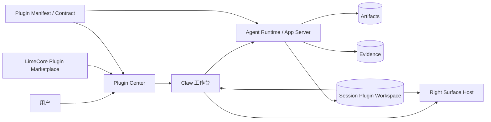
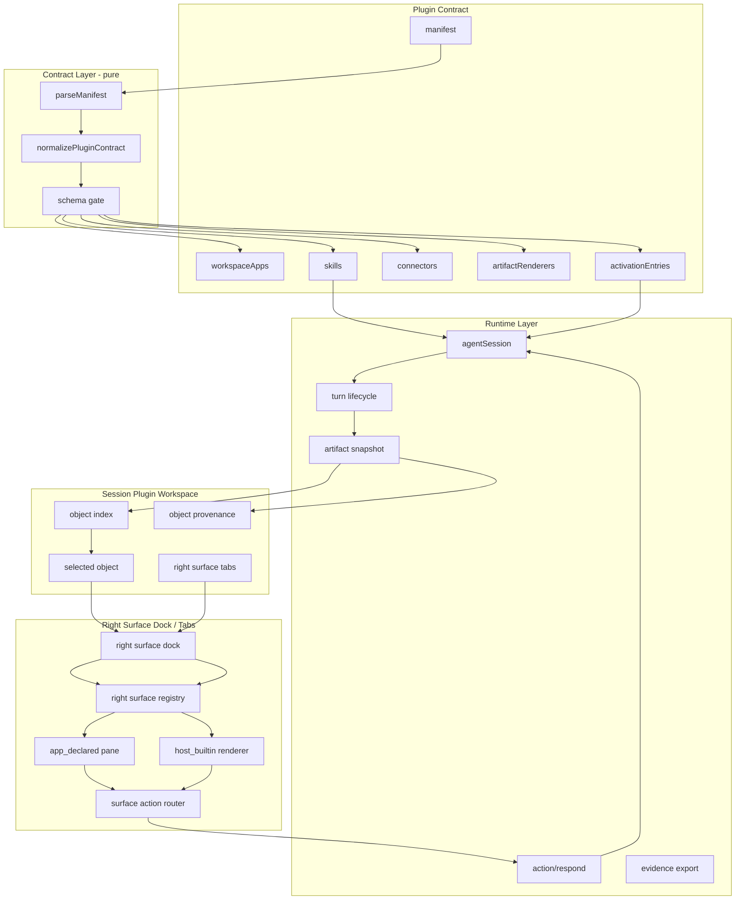
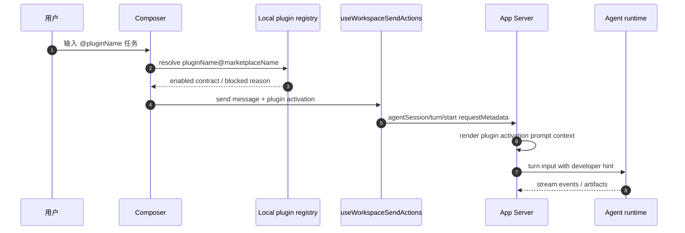
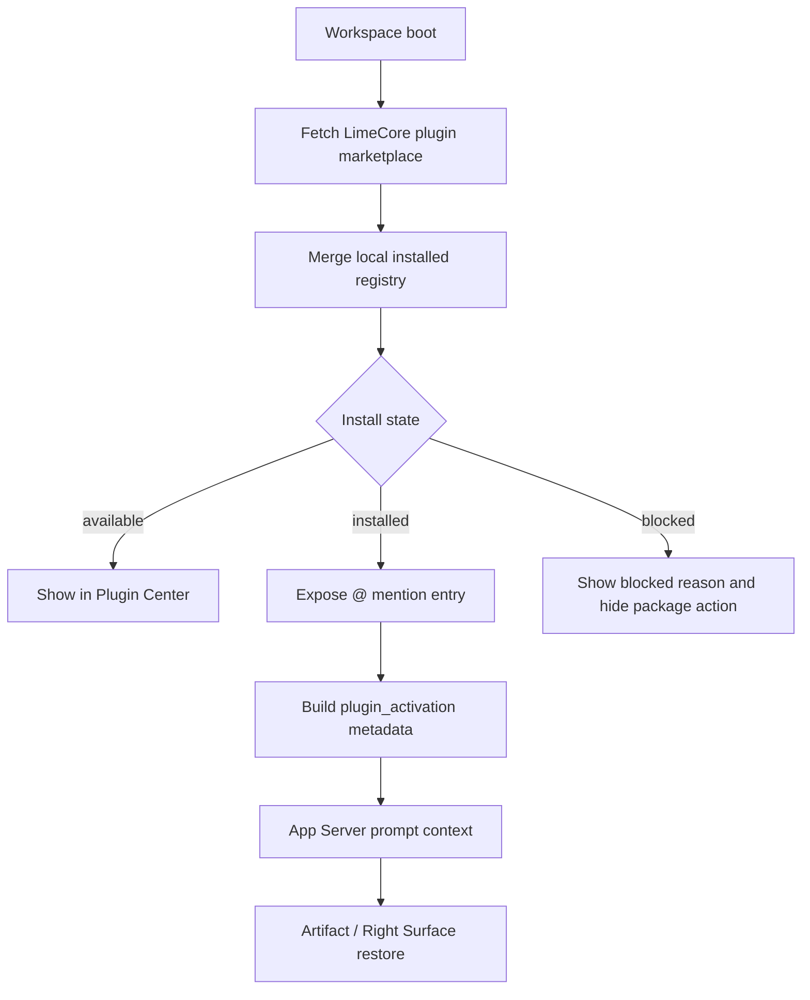
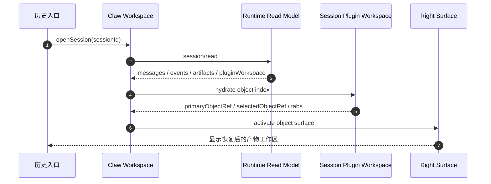
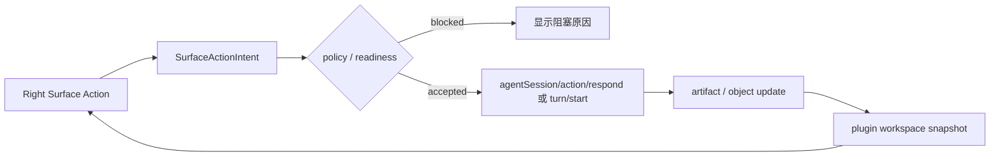

# Lime 插件架构设计

更新时间：2026-06-25  
状态：Draft  
适用范围：Lime Desktop / Claw / Plugin Center / Right Surface / 插件工作区能力

## 1. 设计目标

1. 插件作为分发与授权根对象。
2. `插件工作区能力` 作为插件内部可选 UI 能力。
3. Claw 继续负责对话、运行、审批和事实链。
4. Right Surface 作为 Host 管理的唯一右栏。
5. 产物渲染足够强，但不把业务逻辑塞进 UI 壳。
6. 显式激活优先，不能再依赖语义猜测。

## 2. 一句话架构

```text
LimeCore Plugin Marketplace
  -> Plugin Manifest Summary
  -> Local Installed Registry
  -> Activation Context
  -> Claw Session
  -> Runtime / Artifact / Evidence
  -> Session Plugin Workspace
  -> Right Surface Dock / Tabs / Panes
```

## 3. Context



## 3.1 跨仓职责图

```mermaid
flowchart TD
  subgraph LimeCore[LimeCore]
    CloudMarket[Plugin Marketplace API]
    CloudPolicy[Install / auth / tenant policy]
    PackageRef[Package URL / hash / manifest summary]
  end

  subgraph Lime[Lime Desktop]
    ClientMarket[Marketplace client]
    LocalInstall[Local installed registry]
    Mention[@plugin explicit mention]
    SessionMeta[requestMetadata.harness.plugin_activation]
    RightSurface[Right Surface tabs / panes]
  end

  subgraph Runtime[App Server / RuntimeCore]
    Prompt[Prompt context only]
    Turn[agentSession turn]
    Artifact[Artifact / evidence read model]
  end

  CloudPolicy --> CloudMarket
  PackageRef --> CloudMarket
  CloudMarket --> ClientMarket
  ClientMarket --> LocalInstall
  LocalInstall --> Mention
  Mention --> SessionMeta
  SessionMeta --> Prompt
  Prompt --> Turn
  Turn --> Artifact
  Artifact --> RightSurface

  CloudMarket -.does not execute.-> Turn
  RightSurface -.does not call provider directly.-> CloudMarket
```

关键约束：

- Plugin Marketplace 服务端在 LimeCore control-plane；Lime App Server 不实现 marketplace 查询、安装或发布。
- Plugin package 不 import Claw 内部实现。
- Claw 不内置内容工厂或任何单个业务插件逻辑，只消费 contract 和 runtime read model。
- Right Surface 不拥有 runtime 事实，只渲染对象 read model。
- Session Plugin Workspace 是历史恢复和继续工作的事实源。
- 现有 [`rightsurface`](../rightsurface/README.md) 作为唯一右栏基座，plugin 路线只定义该基座如何承载插件产物。

## 4. 分层架构



## 5. Current / Deprecated / Dead

| Surface | 分类 | 规则 |
| --- | --- | --- |
| Plugin Center | `current` | 插件的安装、启用、停用、授权和发布入口。 |
| LimeCore Plugin Marketplace | `current` | 云端只读目录、安装策略、认证策略和 package metadata；不执行插件。 |
| Plugin Manifest / Contract | `current` | 插件、工作区能力、skills、renderers 和 activation entries 的事实源。 |
| 插件工作区 UI | `current` | 作为插件内部 UI 能力，可以有独立页面或 workbench shell，但不是根产品。 |
| Right Surface Dock / Tabs | `current` | 右侧唯一物理 dock，承载插件产物和局部编辑。 |
| Host builtin renderer | `current` | 文章、图片、storyboard、checklist 等标准对象首选渲染方式。 |
| App declared pane | `current` | 复杂插件 UI 的受控挂载方式，只能作为右侧 pane。 |
| Semantic guessing activation | `deprecated` | 不能作为新激活机制，只允许历史兼容说明。 |
| Agent App / 工作台应用 marketplace as design source | `deprecated` | 旧目录只可作为迁移输入；插件中心 current 数据源是 LimeCore `client/plugins/marketplace` 与本地插件安装态。 |
| 独立第二右栏 | `dead for new work` | 不允许把插件 UI 再做成一个完整右栏。 |
| 旧 旧内容工作台 代码 | `dead` | 只允许作为业务参考，不得复用代码、IPC、store 或 renderer。 |
| 旧 Agent App / 工作台应用同级产品名 | `deprecated` | 用户侧不再把它作为独立市场入口；历史文案只能解释为插件内部工作区能力。 |

## 6. 右侧 Renderer 怎么做强

右侧要强，不是靠一个超大组件，而是靠三件事：

1. **Host 壳子强**：tab、布局、恢复、权限、错误边界、尺寸和兜底统一由 Host 提供。
2. **Renderer 协议强**：插件只声明 object kind、surface kind、actions 和 data schema。
3. **通用渲染器强**：文档、图集、storyboard、checklist、diff、版本等先用 Host builtin renderer。

复杂场景再让插件提供专属 UI，但它只能挂在受控 pane 里，不能接管整个右栏。

## 7. 显式激活

允许的激活入口：

- 插件中心点击打开
- composer 的插件选择 chip
- `@插件`
- 历史会话恢复
- 固定到当前 session 的 tab

禁止：

- 每次发送消息全量扫描插件并猜测意图
- 普通对话自动切换插件
- 右侧 renderer 自己决定激活别的插件

### 显式激活时序图



### Marketplace 消费流程图



## 8. 历史恢复拓扑



恢复规则：

1. 如果 session 有 `selectedObjectRef`，优先恢复选中对象。
2. 如果没有 selected object，但有 `primaryObjectRef`，打开主产物。
3. 如果没有 plugin workspace，回退到 artifact preview。
4. 如果 artifact 也为空，才回退到纯聊天历史。

## 9. Surface Action 回流



禁止路径：

```text
Right Surface -X-> provider API
Right Surface -X-> filesystem write
Right Surface -X-> secret value
Right Surface -X-> legacy desktop facade
Right Surface -X-> mock fallback in production
Right Surface -X-> raw Tauri command
```

## 10. Content Factory 位置

内容工厂是插件系统里的高价值复杂插件，它说明：

- 一个插件可以有插件工作区 UI。
- 同一个插件可以同时贡献多个产物 renderer。
- 右侧 tab 可以承载多个业务对象。
- 中间对话和右侧产物是同一 session 的两个视角。
- 复杂场景不必把整个工作台 UI 复制进插件本身。

## 11. 与 Right Surface 路线图关系

| v4 概念 | Right Surface 概念 |
| --- | --- |
| `artifactRenderers[].surfaceKind` | `productProfile` tab 内部的 object renderer / pane kind |
| `selectedObjectRef` | `productProfile` tab render input |
| `surfaceActions` | conversation bridge / action router |
| `historyRestore.defaultSurface` | `productProfile` tab activation / focus policy |

## 12. 设计结论

1. 插件负责“是什么”和“能做什么”。
2. Right Surface 负责“怎么摆”和“怎么恢复”。
3. 插件工作区能力负责“一个插件是否需要自己的独立 UI”。
4. 内容工厂验证的是插件体系和产物工作区，不是再造一套 App Shell。
