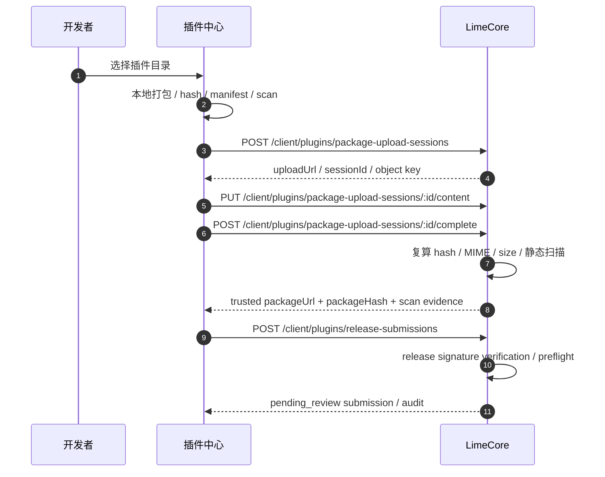
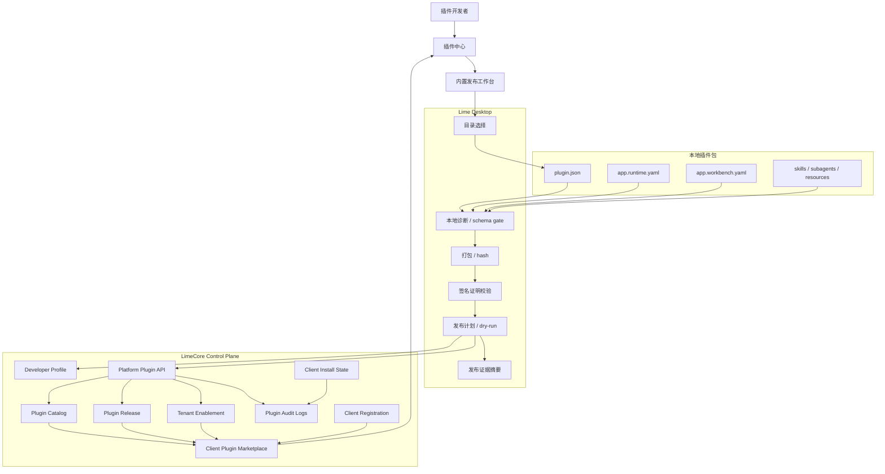
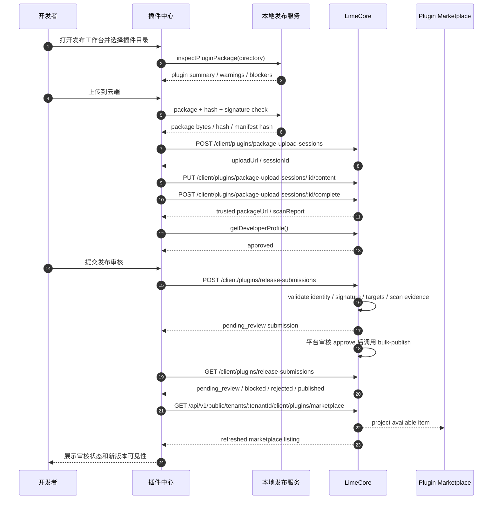
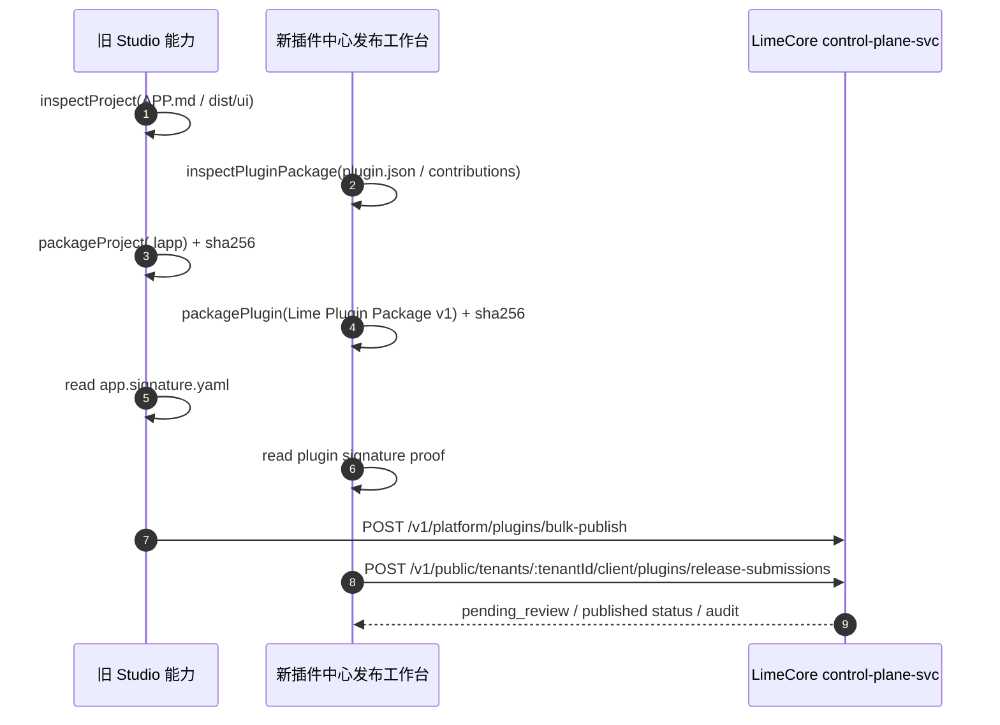
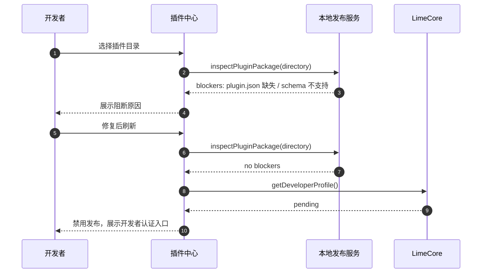
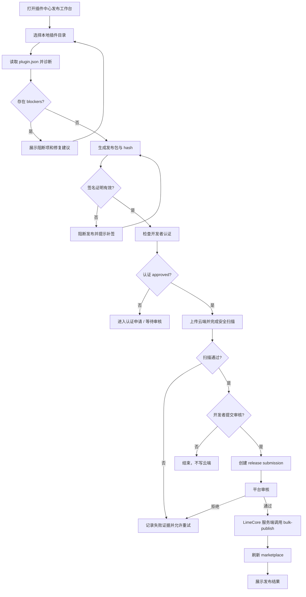
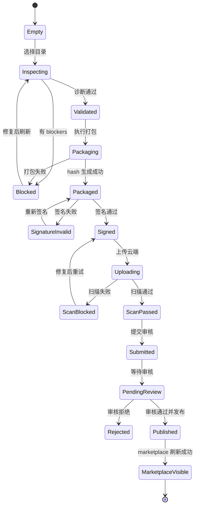
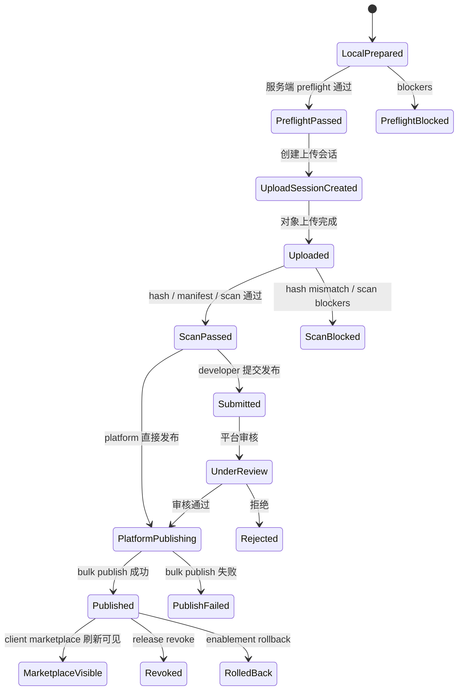

# 插件中心内置发布工作台 PRD

更新时间：2026-07-06  
状态：MVP 工程闭环已实现并完成定向验证；Desktop 开发者云端 preflight、平台审核工作台与提交状态面板已接入；LimeCore console 运营后台 UI 仍待后续阶段  
适用范围：Lime Desktop / 插件中心 / 插件开发者发布流 / LimeCore Plugin Marketplace

事实源：

- `internal/roadmap/plugin/prd.md`
- `internal/roadmap/plugin/architecture.md`
- `internal/roadmap/plugin/implementation-plan.md`
- 服务端专项规划：`internal/roadmap/plugin/deverlop/plugin-publish-limecore-server-plan.md`
- `internal/tech/plugin/lime-plugin-package-v1.md`
- 旧参考：`/Users/coso/Documents/dev/ai/limecloud/lime-agent-app-studio`
- Desktop current 主链：`src/lib/api/plugins.ts -> App Server JSON-RPC`
- Desktop 发布 / 审核 current 主链：
  - `src/lib/api/oemCloudPluginPublish.ts`
  - `src/features/plugin/publish/PluginPublishWorkbench.tsx`
  - `src/features/plugin/publish/PluginReleaseReviewWorkbench.tsx`
  - `src/features/plugin/publish/PluginReleaseSubmissionStatusPanel.tsx`
  - `src/features/plugin/ui/PluginsPage.tsx`
- LimeCore current 主链：`control-plane-svc Plugin catalog / release / enablement / upload broker`
- 服务端事实源：`/Users/coso/Documents/dev/ai/limecloud/limecore`
  - `services/control-plane-svc/internal/controller/plugin.go`
  - `services/control-plane-svc/internal/controller/public_client.go`
  - `services/control-plane-svc/internal/service/control_plane_authorization.go`
  - `services/control-plane-svc/internal/service/control_plane_plugin_catalog_service.go`
  - `services/control-plane-svc/internal/service/control_plane_plugin_bulk_publish_validation.go`
  - `services/control-plane-svc/internal/service/control_plane_plugin_signature_verifier.go`
  - `services/control-plane-svc/internal/service/control_plane_plugin_metadata_helpers.go`
  - `services/control-plane-svc/internal/service/control_plane_plugin_publish_preflight_service.go`
  - `services/control-plane-svc/internal/repo/inmemory_control_plane_repo_plugin_bulk_publish.go`
  - `packages/types/index.ts`
  - `packages/api-client/index.ts`
  - `contracts/openapi/control-plane-svc/*`
  - `internal/roadmap/plugin/implementation-plan.md`
  - `internal/roadmap/plugin/operations-runbook.md`

## 1. 一句话目标

把旧 `lime-agent-app-studio` 的 Agent App 发布能力收敛为插件中心内置的“插件发布工作台”：开发者在 Lime 插件中心完成本地诊断、打包预检、签名校验、dry-run 和云端发布，不再通过独立 Agent App 发布插件。

```text
旧时代：安装一个发布应用，再用它发布 Agent App
新时代：插件中心内置开发者发布流，直接发布 Lime Plugin Package v1
```

## 2. 背景

旧 `lime-agent-app-studio` 是 Agent App 时代的开发者工具，核心能力包括：

- 读取 `APP.md` / `app.capabilities.yaml` / `dist/ui`，诊断本地 Agent App 项目。
- 打包 `.lapp`，生成 package hash 与 manifest hash。
- 生成 dry-run 发布计划。
- 校验开发者认证、读取签名证明，并调用 LimeCore plugin bulk publish。
- 通过独立可视化工作台和 npm CLI 提供发布入口。

旧 Studio 不是纯本地 demo，它已经打通了 LimeCore 发布链：

1. `getDeveloperProfile(...)` 调用 `GET /api/v1/public/tenants/{tenantId}/client/developer-profile`。
2. `publishProject(...)` 要求正式发布必须提供 HTTPS `packageUrl`，并生成 `packageHash`、`manifestHash`、`signatureRef`、`signatureProof`。
3. `bulkPublishPlugin(...)` 调用 `POST /api/v1/platform/plugins/bulk-publish`，一次提交 `catalog`、`release` 和 `targets`。
4. LimeCore 服务端把请求写成 Plugin catalog、release、tenant enablement，并由客户端 marketplace 投影给插件中心消费。

这些能力在旧 Agent App 产品形态下成立，但和当前插件路线存在冲突：

| 冲突点     | 旧形态                         | 新插件路线                                            |
| ---------- | ------------------------------ | ----------------------------------------------------- |
| 产品入口   | 独立 Agent App Studio          | 插件中心内置发布工作台                                |
| 机器事实源 | `APP.md` frontmatter           | `plugin.json`                                         |
| 发布包语义 | `.lapp` Agent App 包           | Lime Plugin Package v1                                |
| 用户心智   | 先安装发布应用，再发布应用     | 在插件中心管理、开发和发布插件                        |
| 运行边界   | Agent App runtime package      | Plugin manifest / runtime / workbench contract        |
| 市场事实源 | Agent App marketplace 历史形态 | LimeCore Plugin catalog / release / tenant enablement |

当前插件路线已经明确：

1. 插件是分发、授权和运行的根对象。
2. `plugin.json` 是插件包唯一机器入口。
3. 插件中心是用户侧安装、启用、打开和管理入口。
4. LimeCore control-plane 承担云端 plugin catalog / release / enablement。
5. Lime App Server 不新增 marketplace 发布 JSON-RPC。
6. LimeCore 已有原生 Plugin 发布控制面，不需要 Lime Desktop 再发明独立发布后端。

因此，发布能力应内置到插件中心，而不是继续发布一个“发布应用”。

## 3. 目的

1. 统一开发者发布入口，让插件中心同时承接“使用插件”和“发布插件”。
2. 把发布事实源从 `APP.md` / `.lapp` 迁到 Lime Plugin Package v1。
3. 复用旧 Studio 中已经验证过的诊断、打包、dry-run、签名和 LimeCore 发布经验。
4. 消除独立 App Studio 带来的安装成本、入口分裂和旧 Agent App 心智。
5. 为后续插件审核、灰度、注册码、租户启用和发布回滚提供统一工作台。

## 4. 收益

| 角色       | 收益                                                                                       |
| ---------- | ------------------------------------------------------------------------------------------ |
| 插件开发者 | 不需要先安装发布应用；在插件中心即可完成项目检查、发布预览和发布。                         |
| 平台运营   | 发布、审核、灰度、revoke 和租户 enablement 有统一后台事实链。                              |
| 租户管理员 | 可从插件中心理解插件来源、版本、权限和发布状态。                                           |
| Lime 产品  | 移除 Agent App 与 Plugin 双市场心智，降低文档、UI 和支持成本。                             |
| 工程团队   | 发布链路收敛到 `plugin.json`、插件包标准和 LimeCore current API，不再维护独立 App 发布壳。 |

## 5. Current / Deprecated / Dead 分类

| Surface                                                    | 分类                | 规则                                                                                          |
| ---------------------------------------------------------- | ------------------- | --------------------------------------------------------------------------------------------- |
| 插件中心内置发布工作台                                     | `current`           | 后续发布 UX、开发者认证、dry-run、发布结果和发布历史都向这里收敛。                            |
| Lime Plugin Package v1                                     | `current`           | 插件包、运行、工作区、skills、resources 和验证的机器事实源。                                  |
| `plugin.json`                                              | `current`           | 插件包唯一入口；插件中心、本地校验和云端 manifest summary 均从这里投影。                      |
| LimeCore Plugin catalog / release / enablement             | `current`           | 云端发布、版本、租户可见性和 marketplace 列表事实源。                                         |
| LimeCore `POST /api/v1/platform/plugins/bulk-publish`      | `current`           | 已打通 catalog、release、targets 的原子发布入口；新工作台必须复用。                           |
| LimeCore client marketplace / registration / install-state | `current`           | 插件发布后的客户端可见性、注册码激活和本地安装态审计入口。                                    |
| 旧 `lime-agent-app-studio` 诊断 / 打包 / dry-run 经验      | `compat`            | 只作为能力参考或迁移输入，不作为用户主入口。                                                  |
| 旧 npm CLI                                                 | `deprecated`        | 仅可作为 CI/headless 自动化候选，不是 v1 产品入口；若保留，必须委托插件中心同一发布服务契约。 |
| `APP.md` frontmatter 作为机器事实源                        | `dead for new work` | 新插件发布不得依赖；文档说明可保留给历史迁移。                                                |
| `.lapp` 作为新插件主发布格式                               | `dead for new work` | 新发布流使用 Lime Plugin Package v1 的受控插件包。                                            |
| 独立 Agent App Studio 可视化应用                           | `dead for new work` | 不再作为发布插件的产品入口。                                                                  |

## 6. 用户与角色

| 角色       | 诉求                                                 | v1 能力                                            |
| ---------- | ---------------------------------------------------- | -------------------------------------------------- |
| 插件开发者 | 把本地插件发布到组织或 marketplace。                 | 选择插件目录、诊断、dry-run、发布。                |
| 插件维护者 | 更新版本、查看发布状态和回滚风险。                   | 查看版本、发布结果、阻断原因和 release metadata。  |
| 平台运营   | 管理 catalog、release、租户 enablement、注册码策略。 | 通过 LimeCore current API 承接，插件中心展示结果。 |
| 租户管理员 | 判断插件是否可信、是否可启用。                       | 查看发布者、版本、权限、认证状态和安装策略。       |
| 审核者     | 追踪包内容、签名、hash 和发布证据。                  | 查看发布证据、hash、签名证明和 dry-run 报告。      |

## 7. 用户故事

| 编号  | 用户故事                                                                   | 验收                                                                         |
| ----- | -------------------------------------------------------------------------- | ---------------------------------------------------------------------------- |
| US-01 | 作为插件开发者，我希望在插件中心选择本地插件目录并立即看到是否可发布。     | 选择目录后展示 `plugin.json`、版本、能力、错误和警告。                       |
| US-02 | 作为插件开发者，我希望正式发布前先 dry-run，知道会创建或更新哪些云端对象。 | dry-run 展示 catalog、release、tenant enablement 和 package metadata 计划。  |
| US-03 | 作为插件开发者，我希望发布前看到签名和 hash 校验结果。                     | 发布前必须展示 package hash、manifest hash、signature proof 状态。           |
| US-04 | 作为已认证开发者，我希望把新版本提交到平台审核。                           | 认证通过、云端扫描通过、服务端预检通过后生成 `pending_review` 审核单。       |
| US-05 | 作为未认证开发者，我希望知道为什么不能发布以及如何补齐。                   | 发布按钮 fail closed，展示开发者认证状态和下一步。                           |
| US-06 | 作为插件维护者，我希望发布失败时能定位是哪一层失败。                       | 错误分类到本地项目、打包、签名、认证、网络、云端策略或权限。                 |
| US-07 | 作为租户管理员，我希望插件发布后能在插件中心看到新版本。                   | 发布成功后 marketplace 列表刷新，展示版本、来源和安装策略。                  |
| US-08 | 作为审核者，我希望发布过程留下可追踪证据。                                 | 每次 dry-run / publish 生成发布证据摘要，可关联 package hash 和 release id。 |

## 8. 用户用例

### 8.1 首次发布插件

1. 开发者打开插件中心。
2. 切换到“开发者 / 发布”视图。
3. 选择本地插件目录。
4. 系统读取 `plugin.json` 并运行本地诊断。
5. 开发者修复阻断问题。
6. 开发者执行 dry-run。
7. 系统生成发布计划和风险提示。
8. 开发者提交发布审核。
9. LimeCore 创建 `pending_review` 审核单并写入 audit。
10. 平台审核通过后，LimeCore 调用 `bulk-publish` 创建 catalog / release / tenant enablement。
11. 插件中心刷新 submission / marketplace 状态。

### 8.2 发布新版本

1. 开发者选择已发布插件。
2. 系统识别本地版本高于云端 latest version。
3. 系统检查 package hash、manifest hash 和签名证明。
4. dry-run 展示将新增 release 并更新 latest version。
5. 平台审核通过并发布成功后，租户可见版本更新。

### 8.3 发布被阻断

1. 开发者选择插件目录。
2. 本地诊断发现缺少 `plugin.json`、版本号无效或路径越界。
3. 系统阻断打包和发布。
4. UI 展示具体文件、字段、原因和修复建议。
5. 开发者修复后重新诊断。

### 8.4 开发者未认证

1. 开发者打开发布工作台。
2. 系统读取当前 Lime cloud session。
3. LimeCore 返回 developer profile 非 `approved`。
4. 发布动作禁用。
5. UI 提供认证申请入口或说明，不缓存敏感 token。

### 8.5 注册码 / 受限发布

1. 开发者发布需要 registration 的插件。
2. dry-run 展示认证策略、可见性和 blocked-before-registration 状态。
3. 发布成功后 marketplace 可见但安装前需要注册码。
4. 用户提交注册码后，LimeCore 返回刷新后的 marketplace item。

### 8.6 复用旧 Studio 已打通发布链

1. 插件中心读取本地插件包并生成发布计划。
2. 发布计划保留旧 Studio 已验证的 payload 分层：`catalog`、`release`、`targets`。
3. `catalog` 承载 pluginName、marketplaceName、displayName、description、latestVersion、status、categories、capabilities、manifestSummary。
4. `release` 承载 version、packageUrl、packageHash、manifestHash、signatureRef、signatureProof、manifestSummary、status。
5. `targets` 承载 tenantId、enablementStatus、visibility、rolloutPercent、licenseState、registrationRequired、registrationHint、displayOrder；developer submission 禁止保存 `registrationCode` 明文。
6. 插件中心提交审核时调用 LimeCore public developer submission；平台审核通过时由 LimeCore 服务端调用 `bulk-publish`，不新增第二套最终发布 API。
7. 发布成功后调用 client marketplace 刷新插件中心展示，并按需上报本地 install-state。

## 9. 功能需求

### 9.1 发布工作台入口

| 编号  | 需求                         | 验收                                                                 |
| ----- | ---------------------------- | -------------------------------------------------------------------- |
| FR-01 | 插件中心提供开发者发布入口。 | 入口只在开发者模式或有权限账号下展示。                               |
| FR-02 | 支持选择本地插件目录。       | 选择后只读取目录内相对路径，不接受用户机器绝对路径写入 manifest。    |
| FR-03 | 展示插件身份摘要。           | 展示 id、name、version、displayName、publisher、capabilities、icon。 |
| FR-04 | 支持刷新当前目录诊断。       | 修复文件后可重新读取并更新诊断结果。                                 |

### 9.2 本地诊断

| 编号  | 需求                                                 | 验收                                                          |
| ----- | ---------------------------------------------------- | ------------------------------------------------------------- |
| FR-05 | 校验 `plugin.json` 是否存在且 schemaVersion 合法。   | 缺失或版本不支持时 fail closed。                              |
| FR-06 | 校验 contributions 路径。                            | 只允许插件包内相对路径；越界路径阻断发布。                    |
| FR-07 | 校验 runtime / workbench / skills / resources 索引。 | 缺少必需文件时展示错误；可选能力缺失只给 warning。            |
| FR-08 | 校验版本号和 release channel。                       | 版本不能低于或等于已发布 latest version，除非是明确重发策略。 |
| FR-09 | 展示 warnings 与 blockers。                          | blockers 阻断打包和发布；warnings 不阻断但必须可见。          |

### 9.3 打包与 hash

| 编号  | 需求                   | 验收                                                                  |
| ----- | ---------------------- | --------------------------------------------------------------------- |
| FR-10 | 生成受控插件发布包。   | 默认排除 `.git`、`node_modules`、本地缓存、测试覆盖率和发布输出目录。 |
| FR-11 | 生成 package hash。    | hash 使用 `sha256:<hex>` 格式。                                       |
| FR-12 | 生成 manifest hash。   | 以 `plugin.json` 及必要 manifest projection 作为 hash 来源。          |
| FR-13 | 展示包大小和文件数量。 | dry-run 和正式发布前均可见。                                          |

### 9.4 签名与认证

| 编号  | 需求                       | 验收                                                                   |
| ----- | -------------------------- | ---------------------------------------------------------------------- |
| FR-14 | 校验开发者认证状态。       | 非 approved 状态不能正式发布。                                         |
| FR-15 | 支持读取签名证明。         | signatureRef、publicKeyId、algorithm、payloadHash、signedAt 必须完整。 |
| FR-16 | 发布时不持久化明文 token。 | 使用当前 cloud session 或一次性输入，不能写入插件目录。                |
| FR-17 | 签名失败时阻断发布。       | 错误明确区分缺失、算法不支持、payload hash 不匹配。                    |

### 9.5 Dry-run

| 编号  | 需求                       | 验收                                                                  |
| ----- | -------------------------- | --------------------------------------------------------------------- |
| FR-18 | dry-run 生成发布计划。     | 展示 catalog、release、target tenant enablement 将发生的变化。        |
| FR-19 | dry-run 不产生云端写入。   | 所有写动作必须等待用户确认正式发布。                                  |
| FR-20 | dry-run 报告可复制或导出。 | 报告包含 package hash、manifest hash、目标租户、channel、visibility。 |

### 9.6 正式发布

| 编号  | 需求                                                                 | 验收                                                                                                    |
| ----- | -------------------------------------------------------------------- | ------------------------------------------------------------------------------------------------------- |
| FR-21 | 正式发布走 LimeCore current Plugin API。                             | 平台账号可调用 platform `bulk-publish`；普通开发者必须走 public developer submission。                  |
| FR-22 | 支持 channel / visibility / license state。                          | 参数进入 release 和 tenant enablement 计划。                                                            |
| FR-23 | 发布成功后刷新 marketplace。                                         | 插件中心展示新版本、状态和安装入口。                                                                    |
| FR-24 | 发布失败时保留失败证据。                                             | 不生成半成功 UI；错误可关联 request id / release plan。                                                 |
| FR-25 | 正式发布 payload 必须沿用 LimeCore `BulkPublishPluginPayload` 分层。 | UI / view model 输出 `catalog`、`release`、`targets`，由服务层统一提交。                                |
| FR-26 | 注册码插件通过 target enablement 设置。                              | Developer submission 不保存 `registrationCode` 明文；注册码由平台审核或运营配置补齐。                   |
| FR-27 | 发布后上报本地安装态。                                               | 本地安装、启用、禁用、卸载、失败使用 `client/plugins/:pluginName/install-state`，不改变云端发布配置。   |
| FR-28 | 区分平台发布和开发者提交。                                           | platform/admin 可直接 bulk publish；普通 approved developer 只能创建 release submission，不能绕权发布。 |

### 9.7 发布历史与证据

| 编号  | 需求                                                    | 验收                                                                                                                                                                   |
| ----- | ------------------------------------------------------- | ---------------------------------------------------------------------------------------------------------------------------------------------------------------------- |
| FR-29 | 展示开发者最近发布审核单状态。                          | 当前已展示最近 5 条 LimeCore developer release submissions，包含插件 id、版本、payload hash、scan evidence、更新时间、审核备注和状态；不展示 `registrationCode` 明文。 |
| FR-30 | 展示云端 release 列表。                                 | 可区分 ready、revoked、blocked 等状态。                                                                                                                                |
| FR-31 | 支持发布证据摘要。                                      | 审核者可看到 dry-run / publish 的输入摘要和输出状态。                                                                                                                  |
| FR-32 | 展示 LimeCore plugin audit。                            | 可按 tenant、pluginName、marketplaceName、action 查询 catalog / release / enablement / registration / install-state 证据。                                             |
| FR-33 | 支持 release revoke 和 enablement rollback 的只读呈现。 | v1 至少展示已有状态和操作入口占位；写操作需要平台权限。                                                                                                                |

### 9.8 平台审核工作台

| 编号  | 需求                                         | 验收                                                                                                        |
| ----- | -------------------------------------------- | ----------------------------------------------------------------------------------------------------------- |
| FR-34 | 插件中心提供平台发布审核入口。               | 入口打开 `PluginReleaseReviewWorkbench`，默认加载 LimeCore platform release submissions。                   |
| FR-35 | 审核者可按状态查看审核单。                   | 支持 `pending_review / blocked / rejected / published / all` 筛选和计数。                                   |
| FR-36 | 审核详情展示包安全证据。                     | 展示 package hash、manifest hash、payload hash、scan evidence、preflight blockers / warnings。              |
| FR-37 | 审核通过必须调用 LimeCore platform approve。 | 前端只调用 `POST /platform/plugins/release-submissions/:submissionId/approve`；发布写库仍由 LimeCore 完成。 |
| FR-38 | 驳回必须填写原因。                           | 空理由 fail closed；有效理由调用 `POST /platform/plugins/release-submissions/:submissionId/reject`。        |
| FR-39 | 审核 UI 不展示 `registrationCode` 明文。     | 只展示 `registrationRequired` 与 `registrationHint`；不 dump 原始 payload。                                 |
| FR-40 | 平台权限失败直接暴露云端错误。               | 401 / 403 等错误显示在审核工作台并 toast，不降级到 mock 或本地发布。                                        |

## 10. 非功能需求

| 维度   | 要求                                                                                 |
| ------ | ------------------------------------------------------------------------------------ |
| 安全   | 不把 provider key、LimeCore token、文件系统句柄或 Electron IPC 能力写入插件包。      |
| 隔离   | 本地扫描只能访问用户选择的插件目录及必要系统文件选择器能力。                         |
| 可观测 | dry-run、publish、失败和 revoke 都必须有可追踪 evidence。                            |
| 可测试 | manifest projection、package file collection、publish plan、状态机优先做纯函数测试。 |
| 性能   | 本地诊断应增量刷新；大包扫描需要进度与取消。                                         |
| 可靠性 | 网络失败、认证过期、云端策略失败必须可重试，不产生重复 release。                     |
| 跨平台 | 路径处理必须兼容 macOS / Windows，manifest 内只写 `/` 相对路径。                     |
| 可维护 | 发布 UX 只消费统一 view model，不在组件中重复拼装 LimeCore payload。                 |

### 10.1 安全设计

插件发布是供应链入口，安全目标不是“发布时多一个确认框”，而是把本地包、上传资产、release metadata、租户启用、客户端安装和运行权限全部做成可验证链路。

#### 10.1.1 威胁模型

| 风险                  | 攻击面                                         | 必须防住的结果                                                             |
| --------------------- | ---------------------------------------------- | -------------------------------------------------------------------------- |
| 恶意包上传            | 插件包 ZIP / bundle / scripts / hooks / worker | 不能把未校验包发布成 marketplace 可安装项。                                |
| 包被替换              | packageUrl 指向的对象被覆盖或 CDN 缓存污染     | Desktop 安装时必须用 packageHash / signature fail closed。                 |
| manifest 注入敏感信息 | `manifestSummary` / release metadata           | access token、secret、customer data、private content 不能进云端 metadata。 |
| 权限绕过发布          | 普通 developer 直接调用 platform bulk publish  | route auth 阻断；普通 developer 只能创建 release submission。              |
| 注册码泄露            | `registrationCode`、发布历史、日志             | Developer submission 不保存明文；最终运营配置和 activation 只保存 hash。   |
| 对象存储凭证泄露      | 上传包到 R2 / OSS / CDN                        | 桌面端不得获得长期对象存储 Access Key。                                    |
| Zip Slip / 路径越界   | 插件包内路径、symlink、绝对路径                | 安装和扫描时不能写出插件目录。                                             |
| 运行权限膨胀          | 插件声明 capabilities、hooks、connectors       | 权限必须显式展示、授权、最小化，不能从 manifestSummary 直接授予。          |
| 审计缺失              | 失败、撤销、回滚、安装态                       | 任一云端写入和客户端安装态都必须可追踪。                                   |

#### 10.1.2 安全门禁

| 阶段             | 门禁                                                                                 | 失败处理                                  |
| ---------------- | ------------------------------------------------------------------------------------ | ----------------------------------------- |
| 本地选择目录     | 只读用户选择目录；拒绝绝对路径、`..` 越界、危险 symlink。                            | fail closed，展示具体路径。               |
| 本地打包         | 默认排除 `.git`、`node_modules`、缓存、测试、旧产物；限制单文件和总包大小。          | 不生成 package。                          |
| 静态扫描         | 校验 `plugin.json`、contributions、权限声明、hook/worker 入口、可执行文件清单。      | blocker 进入发布计划。                    |
| 发布摘要生成     | Desktop 在组装 `manifestSummary` 前预检明显 token、secret、credential 和私钥模式。   | 本地 blocker 阻断提交审核。               |
| 云端上传         | 只能使用短时预签名 URL 或受控上传 broker；不下发长期云存储凭证。                     | 上传失败不生成 release。                  |
| 上传后校验       | 上传完成后必须复算 package hash；hash 与本地计划不一致时作废对象。                   | 删除或隔离对象，阻断发布。                |
| release 创建     | `packageUrl` 必须 HTTPS；`packageHash` / `manifestHash` 必须完整 `sha256:<64 hex>`。 | LimeCore 返回 400，前端归类为安全阻断。   |
| 签名验证         | `signatureProof` 必填；绑定 packageHash 与 manifestHash；算法只允许服务端白名单。    | LimeCore 不写 catalog / release。         |
| 透明日志         | 生产可配置 external verifier 与 `requireTransparencyLog=true`。                      | 未返回 transparencyLogRef 时阻断。        |
| marketplace 下发 | 注册码未激活时不下发 packageUrl / packageHash / manifestHash。                       | 客户端只能看到 blocked 状态。             |
| 安装校验         | Desktop 下载后复算 hash、校验签名和 trust root，再解包。                             | 删除下载缓存，install-state 上报 failed。 |
| 运行授权         | 安装成功不等于运行授权；capability、connector、filesystem、network 均需宿主 gate。   | 禁用相关 action，展示权限缺口。           |

#### 10.1.3 上传安全

当前 LimeCore release 控制面只记录 `packageUrl`、`packageHash`、`manifestHash`、签名和验证证据；插件中心内置“上传到云端”时必须先走 LimeCore 受控 upload session，由服务端复算 hash 和静态扫描，再把可信资产绑定到 developer submission：



固定规则：

- 不允许 Desktop 持有 R2 / OSS / S3 长期 Access Key。
- 预签名 URL 必须短时有效、限定 object key、限定大小、限定 content type。
- `packageUrl` 必须来自 upload complete 返回的可信 URL；不接受开发者任意 HTTP URL 或手填 HTTPS URL 进入 developer submission。
- LimeCore upload complete 必须复算 hash；不能只信任 Desktop 上报的 hash。
- 对象 key 应包含 publisher / pluginName / version / hash，避免覆盖同名版本。
- 失败或撤销的对象进入隔离或清理队列，不作为 marketplace 可安装资产。
- 上传 evidence 要进入发布证据摘要，但不写入 secret、token 或本地绝对路径。

#### 10.1.4 签名与信任根

LimeCore 已有签名验证事实源：

- `signatureProof.schemaVersion` 固定为 `plugin-cloud-release-signature/v1`。
- 支持算法：`RSASSA-PKCS1-v1_5-SHA256`、`RSA-PSS-SHA256`、`ECDSA-P256-SHA256`、`Ed25519`。
- `signatureRef` 必须使用 `sigstore:` 或 `cosign://` 证据引用。
- 签名证据必须同时绑定不同的 `packageHash` 与 `manifestHash`。
- `plugin.releaseSignature.mode=external` 时，服务端向外部证据服务验证；`requireTransparencyLog=true` 时必须返回 `transparencyLogRef`。
- `plugin.signatureTrustRoots[]` 由 LimeCore bootstrap 下发给 Desktop；生产环境通过 `PLUGIN_SIGNATURE_TRUST_ROOTS_JSON` 注入公钥根，不能写私钥或生产密钥。

客户端安装必须二次验证：

1. marketplace item 下发 packageRef。
2. Desktop 下载 packageUrl。
3. Desktop 复算 package hash。
4. Desktop 读取并校验 `plugin.json` / manifest hash。
5. Desktop 校验 signature proof、signature verification 和 trust root。
6. 只有全部通过才进入本地 installed registry。

#### 10.1.5 权限与数据最小化

- `manifestSummary` 只放展示、分类、能力摘要和安装预检需要的字段。
- Desktop 发布工作台已在生成 payload 前对 `manifestSummary` 值做明显敏感值预检；该检查只负责提前阻断，LimeCore metadata 拦截仍是权威门禁。
- LimeCore 已拦截敏感 metadata key：`apiKey`、`accessToken`、`refreshToken`、`secret`、`token`、`credential`、`customerData`、`workspaceData`、`storageData`、`knowledgeContent`、`privateContent` 等。
- LimeCore 已拦截禁止字段：`bypassPermissions`。
- 插件包内不得包含 provider key、LimeCore token、对象存储凭证、用户数据样本或私有知识库正文。
- Developer submission 不接收 `registrationCode` 明文；最终运营配置和 activation 只保存 hash，发布历史和 audit 只展示状态与 hint。
- 本地日志、发布证据和 GUI 错误消息不得输出完整 token、注册码、签名私钥、本机绝对路径或用户文件内容。

#### 10.1.6 审计、撤销与回滚

- catalog create / update、release create / update / revoke、tenant enablement create / update / rollback、registration activated / failed、client install-state reported 都必须进入 LimeCore plugin audit。
- 发布工作台要展示 request id / release id / package hash / manifest hash / signature evidence ref，方便定位问题。
- release revoke 后，client marketplace 不应继续下发该 release 的可安装 packageRef。
- enablement rollback 必须保留 previousReleaseIds 和变更 metadata。
- install-state failed 必须包含安全失败原因类别，例如 `hash_mismatch`、`signature_failed`、`manifest_invalid`、`permission_denied`。

## 11. 架构设计

### 11.1 系统架构图



### 11.2 分层职责

| 层                        | 职责                                                                                                         | 不做什么                                       |
| ------------------------- | ------------------------------------------------------------------------------------------------------------ | ---------------------------------------------- |
| 插件中心 UI               | 入口、状态展示、发布向导、错误呈现。                                                                         | 不拼 LimeCore payload 细节。                   |
| 发布 View Model           | 目录状态、诊断结果、dry-run 计划、按钮可用性。                                                               | 不直接读取 provider key 或运行插件 worker。    |
| 本地发布服务              | 读取插件包、校验、打包、hash、签名证明。                                                                     | 不持久化明文 token。                           |
| LimeCore client           | developer profile、package upload、release submission、platform review、marketplace refresh。                | 不通过 Lime App Server 中转 marketplace 发布。 |
| LimeCore control-plane    | catalog / release / enablement / registration policy。                                                       | 不执行插件 runtime。                           |
| LimeCore audit / rollback | 记录 catalog、release、enablement、registration、install-state；支持 release revoke 与 enablement rollback。 | 不替代插件本地安装或运行态。                   |

### 11.3 LimeCore 服务端 current 能力

| 能力                  | 路由                                                                                                | 服务端事实源                                                                                                   | 说明                                                                                        |
| --------------------- | --------------------------------------------------------------------------------------------------- | -------------------------------------------------------------------------------------------------------------- | ------------------------------------------------------------------------------------------- |
| Developer profile     | `GET /api/v1/public/tenants/:tenantId/client/developer-profile`                                     | `public_client.go`                                                                                             | 发布前认证 gate；状态包括 `not_requested`、`pending`、`approved`、`suspended`、`rejected`。 |
| Developer apply       | `POST /api/v1/public/tenants/:tenantId/client/developer-profile/apply`                              | `public_client.go`                                                                                             | 未认证开发者申请入口。                                                                      |
| Bulk publish          | `POST /api/v1/platform/plugins/bulk-publish`                                                        | `plugin.go` / `control_plane_plugin_catalog_service.go` / `inmemory_control_plane_repo_plugin_bulk_publish.go` | 一次性写入或更新 catalog、release、tenant enablement；要求平台角色。                        |
| Package upload        | `POST/PUT/POST complete /api/v1/public/tenants/:tenantId/client/plugins/package-upload-sessions...` | `public_client.go` / `control_plane_plugin_package_upload_service.go`                                          | approved developer 受控上传、服务端复算 hash、静态扫描并生成 trusted packageUrl。           |
| Release submission    | `POST/GET /api/v1/public/tenants/:tenantId/client/plugins/release-submissions...`                   | `public_client.go` / `control_plane_plugin_release_submission_service.go`                                      | 普通 developer 创建和查询自己的发布审核单。                                                 |
| Platform review       | `GET/POST approve/reject /api/v1/platform/plugins/release-submissions...`                           | `plugin.go` / `control_plane_plugin_release_submission_service.go`                                             | 平台审核通过后重新 preflight 并调用既有 `bulk-publish`。                                    |
| Catalog CRUD          | `GET/POST/PUT /api/v1/platform/plugins...`                                                          | `plugin.go`                                                                                                    | 平台 Plugin 目录管理。                                                                      |
| Release CRUD / revoke | `GET/POST/PUT/POST revoke /api/v1/platform/plugins/:pluginName/releases...`                         | `plugin.go`                                                                                                    | 版本列表、创建、更新、撤销。                                                                |
| Tenant enablement     | `/api/v1/partners/:partnerId/tenants/:tenantId/plugins/enablements`                                 | `plugin.go`                                                                                                    | 租户启用、灰度、可见性、license、注册码策略。                                               |
| Enablement rollback   | `POST .../enablements/:enablementId/rollback`                                                       | `plugin.go`                                                                                                    | 回滚租户启用配置或 release 绑定。                                                           |
| Platform audit        | `GET /api/v1/platform/plugins/audit-logs`                                                           | `plugin.go`                                                                                                    | 平台跨租户审计查询。                                                                        |
| Tenant audit          | `GET /api/v1/partners/:partnerId/tenants/:tenantId/plugins/audit-logs`                              | `plugin.go`                                                                                                    | 租户维度插件审计。                                                                          |
| Client marketplace    | `GET /api/v1/public/tenants/:tenantId/client/plugins/marketplace`                                   | `public_client.go`                                                                                             | 插件中心云端目录 current 消费入口。                                                         |
| Client registration   | `POST /api/v1/public/tenants/:tenantId/client/plugins/:pluginName/registration`                     | `public_client.go`                                                                                             | 用户提交注册码，成功后 marketplace item 变为 available。                                    |
| Client install-state  | `POST /api/v1/public/tenants/:tenantId/client/plugins/:pluginName/install-state`                    | `public_client.go`                                                                                             | 记录 installed / enabled / disabled / uninstalled / failed 审计，不改变租户发布配置。       |

### 11.4 发布执行身份

旧 Studio 已经打通 `bulk-publish`，但当前 LimeCore 路由权限需要明确分层：

| 场景                   | 身份                                  | 行为                                                                                                          |
| ---------------------- | ------------------------------------- | ------------------------------------------------------------------------------------------------------------- |
| 官方 / 平台运营发布    | `platform_operator` 或 `admin`        | 直接调用 `POST /api/v1/platform/plugins/bulk-publish`。                                                       |
| 代理运营管理租户启用   | `partner_operator` 或 `partner-admin` | 管理 partner scope 内 tenant enablement、audit、rollback。                                                    |
| 普通插件开发者查看资格 | client session user                   | 调用 developer profile / apply，只判断认证状态。                                                              |
| 普通插件开发者正式发布 | approved developer client session     | 只能创建 release submission；审核通过后由 LimeCore 服务端调用 `bulk-publish`，Desktop 不持有 platform token。 |

因此，插件中心 v1 发布实现必须先区分“平台发布模式”和“开发者提交模式”：

- 平台发布模式：沿用旧 Studio 已打通的 `bulk-publish`，适合官方插件或平台运营账号。
- 开发者提交模式：完成本地诊断、打包、云端上传扫描和签名输入后创建 release submission；正式写云端只发生在平台审核通过后的 LimeCore 服务端。

## 12. 发布时序图

### 12.1 Happy Path



### 12.2 旧 Studio 到新插件中心的发布映射



### 12.3 发布阻断



## 13. 流程图



## 14. 状态机



## 15. 数据与接口边界

### 15.1 输入

| 输入                           | 来源                                  | 规则                                    |
| ------------------------------ | ------------------------------------- | --------------------------------------- |
| 插件目录                       | 用户选择                              | 仅作为本次发布上下文，不写入 manifest。 |
| `plugin.json`                  | 插件包                                | 唯一机器入口。                          |
| `app.runtime.yaml`             | `plugin.json#contributions.runtime`   | 运行能力声明。                          |
| `app.workbench.yaml`           | `plugin.json#contributions.workbench` | 产物、surface、action、历史恢复声明。   |
| skills / subagents / resources | `plugin.json#contributions`           | 必须在插件包目录内。                    |
| 签名证明                       | 插件包或用户选择                      | 只读取签名结果，不生成私钥。            |
| cloud session                  | Lime 宿主                             | 仅用于认证和发布请求，不写入插件包。    |

### 15.2 本地输出

| 输出             | 用途                                  |
| ---------------- | ------------------------------------- |
| publish plan     | dry-run 展示和正式发布确认。          |
| package hash     | 云端 release package metadata。       |
| manifest hash    | release 校验和 marketplace 安装匹配。 |
| signature proof  | 发布可信证明。                        |
| evidence summary | 审核、失败排查和历史追踪。            |

### 15.3 云端接口边界

| 能力                      | current owner                   | 说明                                                                                                             |
| ------------------------- | ------------------------------- | ---------------------------------------------------------------------------------------------------------------- |
| developer profile         | LimeCore client API             | 判断开发者认证状态。                                                                                             |
| plugin package upload     | LimeCore public developer API   | 创建上传会话、上传包、complete 后生成 trusted packageUrl。                                                       |
| plugin release submission | LimeCore public developer API   | 普通开发者创建和查询自己的发布审核单。                                                                           |
| plugin release status     | LimeCore public developer API   | 插件中心提交后通过 `GET /client/plugins/release-submissions` 展示最近审核状态，不展示原始 payload 和注册码明文。 |
| plugin platform review    | LimeCore platform API           | 审核 approve / reject；approve 后调用 bulk publish。                                                             |
| plugin bulk publish       | LimeCore platform API           | 平台账号或审核通过后的服务端最终写 catalog、release、tenant enablement。                                         |
| client plugin marketplace | LimeCore public tenant API      | 发布后刷新插件中心列表。                                                                                         |
| plugin registration       | LimeCore public tenant API      | 注册码插件的客户端解锁。                                                                                         |
| plugin install-state      | LimeCore public tenant API      | 本地安装态审计，不改变发布配置。                                                                                 |
| plugin audit / rollback   | LimeCore platform / partner API | 发布证据、release revoke、enablement rollback。                                                                  |

### 15.4 LimeCore payload contract

新发布工作台正式发布时必须输出与 LimeCore `BulkPublishPluginPayload` 对齐的结构：

```json
{
  "catalog": {
    "pluginName": "content-factory-app",
    "marketplaceName": "limecloud",
    "displayName": "内容工厂",
    "description": "内容生产插件",
    "latestVersion": "2.0.0",
    "status": "active",
    "categories": ["content"],
    "capabilities": ["workflow", "article"],
    "manifestSummary": {}
  },
  "release": {
    "version": "2.0.0",
    "packageUrl": "https://example.com/plugins/content-factory-app-2.0.0.zip",
    "packageHash": "sha256:...",
    "manifestHash": "sha256:...",
    "signatureRef": "sigstore:rekor:entry-1",
    "signatureProof": {
      "schemaVersion": "plugin-cloud-release-signature/v1",
      "publicKeyId": "publisher-key-1",
      "algorithm": "Ed25519",
      "signature": "...",
      "payloadHash": "sha256:...",
      "signedAt": "2026-07-05T00:00:00Z"
    },
    "manifestSummary": {},
    "status": "ready"
  },
  "targets": [
    {
      "tenantId": "tenant-0001",
      "enablementStatus": "published",
      "visibility": "all_users",
      "enabled": true,
      "licenseState": "active",
      "registrationRequired": false,
      "displayOrder": 0
    }
  ]
}
```

服务端约束必须进入前端发布计划：

- `catalog.status` 必须是 `active`。
- `release.status` 必须是 `ready`。
- `targets` 不能为空，且不能有重复 `tenantId`。
- `pluginName` / `marketplaceName` 必须符合 LimeCore marketplace segment 规则。
- `manifestSummary` 不能包含敏感或禁用字段。
- `signatureProof` 必填并由 LimeCore 验证；失败时不能写 catalog / release。
- `registrationState=active` 只能由客户端注册码激活产生，发布端不能直接写 active。
- Developer submission 不允许携带 `registrationCode` 明文；需要注册码时只提交 `registrationRequired` 和 `registrationHint`，由云端审核或运营配置管理。

### 15.5 Marketplace response contract

发布成功后，插件中心通过 `GET /api/v1/public/tenants/:tenantId/client/plugins/marketplace` 刷新云端目录。核心字段：

| 字段                            | 用途                                                                   |
| ------------------------------- | ---------------------------------------------------------------------- |
| `schemaVersion`                 | 当前为 `plugin-marketplace/v1`。                                       |
| `items[].pluginKey`             | marketplace + plugin 的稳定 key。                                      |
| `items[].sourceKind`            | current 原生插件目录为 `plugin_catalog`。                              |
| `items[].installState`          | `available` 或 `blocked`。                                             |
| `items[].activationState`       | `activatable` 或 `blocked`。                                           |
| `items[].policy.installation`   | `NOT_AVAILABLE`、`AVAILABLE`、`INSTALLED_BY_DEFAULT`。                 |
| `items[].policy.authentication` | `ON_INSTALL` 或 `ON_USE`。                                             |
| `items[].package`               | releaseId、packageUrl、packageHash、manifestHash、签名引用和验证结果。 |
| `items[].manifestSummary`       | 插件中心展示和本地安装预检输入。                                       |

禁止新增：

- Lime App Server marketplace 发布 JSON-RPC。
- Electron Desktop Host 私有发布命令作为云端事实源。
- `APP.md` 到 cloud payload 的新主链。
- 独立 Agent App Studio 发布 UI。

### 15.6 LimeCore 服务端实施规划

LimeCore 不是“后续再考虑”的外围系统，而是插件发布的云端事实源。服务端规划必须和插件中心同一轮设计，避免 Desktop 把上传、签名、审核或权限绕成私有链路。

#### 15.6.1 服务端目标

1. 复用现有 Plugin control-plane：catalog、release、tenant enablement、marketplace、registration、install-state、audit、rollback。
2. 补齐插件发布缺口：package upload broker、服务端 preflight、approved developer submission / review、安全扫描证据。
3. 保持服务端职责边界：LimeCore 只做控制面、发布资产、策略、证据和审计，不执行插件 runtime / worker / renderer。
4. 所有客户端可见 API 必须同步 OpenAPI source fragments、`packages/types`、`packages/api-client` 和 JS 镜像。

#### 15.6.2 已有能力与缺口

| 能力                                    | 当前状态              | 服务端规划                                                                                                     |
| --------------------------------------- | --------------------- | -------------------------------------------------------------------------------------------------------------- |
| `client/plugins/marketplace`            | 已实现                | 继续作为插件中心云端目录唯一入口。                                                                             |
| platform catalog / release / enablement | 已实现                | 继续作为平台运营 current 控制面。                                                                              |
| `platform/plugins/bulk-publish`         | 已实现                | 继续作为最终写入 catalog / release / targets 的唯一发布写入口。                                                |
| release revoke / enablement rollback    | 已实现                | 接入插件中心发布历史和运营补偿视图。                                                                           |
| registration / install-state            | 已实现                | 接入插件中心安装授权、安装态审计和失败归因。                                                                   |
| release signature verifier              | 已实现                | 生产配置 external verifier + transparency log；Desktop 消费 trust roots。                                      |
| package upload                          | LC-P2 current         | 受控 upload broker；禁止 Desktop 持有长期对象存储凭证。                                                        |
| 服务端 dry-run / preflight              | LC-P1 / LC-P3 current | platform `bulk-publish/preflight` 与 developer `release-submissions/preflight`，均复用最终 bulk publish 校验。 |
| approved developer 发布桥接             | LC-P3 current         | developer preflight / submission / review / approve / reject。                                                 |
| package 安全扫描                        | LC-P2 current         | scan evidence，不执行包内代码，只做结构、路径、hash、权限和敏感内容检查。                                      |

#### 15.6.3 服务端 API 规划

第一阶段只新增服务端发布链路缺口，不改变现有 marketplace / bulk publish contract。

| 阶段  | API                                                                                                | 角色               | 说明                                                                                                         |
| ----- | -------------------------------------------------------------------------------------------------- | ------------------ | ------------------------------------------------------------------------------------------------------------ |
| LC-P1 | `POST /api/v1/platform/plugins/bulk-publish/preflight`                                             | platform/admin     | 服务端 authoritative dry-run：校验 payload、签名字段、targets、敏感 metadata、权限和影响摘要；不写入数据库。 |
| LC-P2 | `POST /api/v1/platform/plugins/package-upload-sessions`                                            | platform/admin     | 创建短时上传会话，返回 upload URL / object key / expiresAt。                                                 |
| LC-P2 | `POST /api/v1/public/tenants/:tenantId/client/plugins/package-upload-sessions`                     | approved developer | 开发者创建绑定当前租户和用户的短时上传会话。                                                                 |
| LC-P2 | `PUT /api/v1/public/tenants/:tenantId/client/plugins/package-upload-sessions/:sessionId/content`   | approved developer | 开发者上传包内容，服务端校验 session owner。                                                                 |
| LC-P2 | `POST /api/v1/public/tenants/:tenantId/client/plugins/package-upload-sessions/:sessionId/complete` | approved developer | 上传完成后服务端复算 hash、静态扫描，并返回受信任 packageUrl。                                               |
| LC-P3 | `POST /api/v1/public/tenants/:tenantId/client/plugins/release-submissions/preflight`               | approved developer | 普通开发者云端 dry-run；校验 upload evidence、hash、签名、targets 和敏感字段，不创建审核单。                 |
| LC-P3 | `POST /api/v1/public/tenants/:tenantId/client/plugins/release-submissions`                         | approved developer | 普通开发者提交 release plan；写入 `pending_review` submission，不直接 bulk publish。                         |
| LC-P3 | `GET /api/v1/public/tenants/:tenantId/client/plugins/release-submissions`                          | approved developer | 开发者查看自己的提交、审核状态和失败原因。                                                                   |
| LC-P3 | `GET /api/v1/public/tenants/:tenantId/client/plugins/release-submissions/:submissionId`            | approved developer | 开发者查看自己的单个审核单详情。                                                                             |
| LC-P3 | `GET /api/v1/platform/plugins/release-submissions`                                                 | platform/admin     | 平台审核开发者提交。                                                                                         |
| LC-P3 | `POST /api/v1/platform/plugins/release-submissions/:submissionId/approve`                          | platform/admin     | 审核通过后由服务端调用既有 bulk publish 写入。                                                               |
| LC-P3 | `POST /api/v1/platform/plugins/release-submissions/:submissionId/reject`                           | platform/admin     | 拒绝并写入审计原因。                                                                                         |

命名原则：

- `bulk-publish` 仍是最终发布写入口；preflight / submission 不得复制写逻辑。
- upload session 只产生可信资产，不产生 release。
- developer submission 只表达发布请求，不授予 platform 权限。
- 如果后续选择“approved developer 直发”而非审核流，也必须由 LimeCore 服务端桥接权限，不允许 Desktop 直接持有 platform token。

#### 15.6.4 服务端数据模型规划

新增数据只服务发布资产和审核，不替代现有 catalog / release / enablement：

| 模型                         | 核心字段                                                                                                                                                                                                                                                                            | 说明                               |
| ---------------------------- | ----------------------------------------------------------------------------------------------------------------------------------------------------------------------------------------------------------------------------------------------------------------------------------- | ---------------------------------- |
| `PluginPackageUploadSession` | `id`、`tenantId`、`developerUserId`、`pluginName`、`marketplaceName`、`version`、`expectedPackageHash`、`expectedManifestHash`、`objectKey`、`uploadUrl`、`sizeBytes`、`contentType`、`status`、`expiresAt`                                                                         | 短时上传会话；不保存对象存储密钥。 |
| `PluginPackageScanReport`    | `id`、`uploadSessionId`、`packageHash`、`manifestHash`、`fileCount`、`sizeBytes`、`blockers`、`warnings`、`evidenceRef`                                                                                                                                                             | 上传后安全扫描证据；不保存包内容。 |
| `PluginReleaseSubmission`    | `id`、`tenantId`、`developerUserId`、`developerId`、`pluginName`、`marketplaceName`、`version`、`uploadSessionId`、`packageUrl`、`packageHash`、`manifestHash`、`payload`、`payloadHash`、`preflight`、`scanEvidenceRef`、`status`、`reviewer`、`reviewNotes`、`publishedReleaseId` | 普通开发者发布提交和审核状态。     |

状态枚举：

- Upload session：`created / uploaded / verified / rejected / expired`
- Scan report：`passed / blocked / warning_only`
- Release submission：`pending_review / blocked / rejected / published`

数据最小化：

- `payload` snapshot 必须脱敏，不保存明文 `registrationCode`、token、私钥、本地路径或包内容。
- 需要注册码时，developer submission 只保存 `registrationRequired` 和 `registrationHint`。
- package content 存对象存储，control-plane 只存 URL、hash、scan evidence 和 metadata。

#### 15.6.5 服务端模块规划

| 模块                                              | 职责                                                                                           |
| ------------------------------------------------- | ---------------------------------------------------------------------------------------------- |
| `control_plane_plugin_publish_preflight_service`  | 复用 `BulkPublishPlugin` 的校验规则，输出 blockers、warnings、target impact、audit preview。   |
| `control_plane_plugin_package_upload_service`     | 创建 upload session、生成短时上传凭证、完成后复算 hash、生成 scan report。                     |
| `control_plane_plugin_release_submission_service` | 管理 developer submission、审核、approve 后调用既有 bulk publish。                             |
| `control_plane_plugin_security_scan`              | 只做静态检查：路径越界、包大小、文件数量、manifest schema、敏感 metadata、签名字段、权限摘要。 |
| `control_plane_plugin_audit_service`              | 统一追加 upload、scan、submission、approve/reject、publish、rollback 审计。                    |

禁止模块：

- 不新增 `plugin_runtime` / `worker` / `renderer` 服务端执行模块。
- 不新增 Lime App Server marketplace JSON-RPC。
- 不在 control-plane 中执行包内 JS / shell / worker / hook。

#### 15.6.6 服务端发布状态机



#### 15.6.7 服务端分期

| 阶段  | 服务端目标              | 交付物                                                                                                        | 验证                                                                                    |
| ----- | ----------------------- | ------------------------------------------------------------------------------------------------------------- | --------------------------------------------------------------------------------------- |
| LC-P0 | 事实源对齐              | 更新 LimeCore roadmap / OpenAPI 草案 / 本 PRD 回链                                                            | 文档 diff、接口清单复核                                                                 |
| LC-P1 | authoritative preflight | `bulk-publish/preflight` service + route + SDK                                                                | Go service/controller 定向测试已通过；完整 `make verify-contracts` 待发版前执行         |
| LC-P2 | package upload broker   | upload session / complete / scan report / object key 策略                                                     | hash mismatch、expired session、MIME / archive invalid、oversize、path traversal tests（已通过） |
| LC-P3 | developer submission    | client developer submission + platform review / approve / reject                                              | role auth tests、submission state tests、audit tests（已通过）                          |
| LC-P4 | 安全审计证据            | upload / scan / submission / publish audit 聚合；Desktop 审核工作台已展示关联 LimeCore audit action            | platform audit query tests、Desktop audit API / review workbench tests；CSV/export view model tests 仍是后续项 |
| LC-P5 | 运营后台产品化          | platform / partner web 接入 preflight、upload、submission、review；Desktop 已先提供 platform review workbench | `make verify-web-fast`、关键页面 typecheck；Desktop 定向 Vitest / contracts / GUI smoke |
| LC-P6 | Lime Desktop E2E        | 插件中心端到端走 upload -> publish -> marketplace -> install-state；Desktop 已在提交 / 审核发布成功后触发插件中心刷新 | Desktop publish / review 定向 Vitest + LimeCore route tests；完整 Lime GUI smoke 仍走发版前门禁 |

#### 15.6.8 服务端验收标准

- [x] `bulk-publish` 仍是唯一最终发布写入口；preflight / upload / submission 不复制写入逻辑。
- [x] 服务端 preflight 与 `BulkPublishPlugin` 最终校验共享规则，不能出现预览通过、提交因同类字段失败。
- [x] package upload 不下发长期对象存储凭证；上传会话过期后不可完成。
- [x] upload complete 由服务端复算 package hash；hash mismatch 不能生成 packageUrl。
- [x] upload session 过期、MIME / archive 结构不合法或 scan blocked 时不能生成 packageUrl，也不能创建 developer submission / release。
- [x] scan report 不执行包内代码，只做静态检查和 evidence。
- [x] developer submission 不能直接写 catalog / release；必须经审核或服务端授权桥接。
- [ ] approve/reject/publish/revoke/rollback/install-state 都进入 plugin audit。
- [x] OpenAPI、`packages/types`、`packages/api-client`、JS 镜像与服务端实现同步。
- [x] LimeCore 本轮验证已覆盖 Go service/controller 定向测试与 route auth 测试；完整 `make verify-contracts` / 发布门禁仍需发版前单独执行。

#### 15.6.9 Desktop 与 LimeCore 联合交付边界

插件中心发布工作台不能把服务端缺口伪装成本地能力。跨仓库落地按以下边界收口：

| 场景                | Desktop 可先做                                                                                                                  | LimeCore 必须提供                                                                       | 未满足时的产品处理                                                      |
| ------------------- | ------------------------------------------------------------------------------------------------------------------------------- | --------------------------------------------------------------------------------------- | ----------------------------------------------------------------------- |
| 本地诊断 / 打包     | 读取 `plugin.json`、生成 package hash / manifest hash、展示本地 blockers。                                                      | 无。                                                                                    | 可交付。                                                                |
| 权威 dry-run        | 已接入 developer public preflight；组装 `BulkPublishPluginPayload` 后必须先拿到服务端 `preflight.valid === true` 才能提交审核。 | `bulk-publish/preflight` / `release-submissions/preflight` 复用最终校验并返回影响摘要。 | 未拿到服务端 preflight 时禁用正式提交；详细对象 diff 仍需后续补全。     |
| 上传到云端          | 生成 package、计算 hash、发起 upload session。                                                                                  | 短时上传凭证、上传完成复算 hash、可信 packageUrl、scan report。                         | 禁用内置上传，只允许手工填写已托管 HTTPS packageUrl，并标记为临时模式。 |
| 普通 developer 发布 | 提交发布计划、展示审核状态。                                                                                                    | developer submission / review / approve / reject，或受控 developer publish bridge。     | 普通 developer 不能直接发布，只能导出发布计划。                         |
| 提交后状态追踪      | 已展示最近 developer release submissions、scan evidence、payload hash、review notes 和状态；提交成功后合并最新审核单。          | LC-P3 developer submission list 已提供；LC-P4 仍需 audit 聚合和证据导出。               | 可交付开发者状态面板；不能声明完整云端审计闭环。                        |
| 平台 direct publish | 调用 current `bulk-publish`，刷新 marketplace。                                                                                 | platform/admin 鉴权、签名验证、metadata 拦截、audit。                                   | 鉴权不满足时 fail closed。                                              |
| 发布后审计          | 展示本地发布记录、release id、install-state。                                                                                   | upload / scan / publish / rollback / install-state audit 查询。                         | 只能展示本地记录，不声明云端审计闭环完成。                              |

## 16. 体验要求

1. 发布工作台使用向导式流程：选择目录、诊断、打包签名、dry-run、发布结果。
2. 每一步展示明确状态：未开始、进行中、通过、warning、blocked、失败。
3. 阻断原因必须落到具体字段或文件，避免只显示“发布失败”。
4. dry-run 必须先于正式发布；正式发布前展示会写入的云端对象摘要。
5. 发布成功后展示下一步动作：查看 marketplace item、复制 release 信息、打开插件详情。
6. 对注册码、租户限制、license inactive、release revoked 等状态使用统一 blocker 文案。

## 17. 迁移策略

### 17.1 从旧 Studio 继承的能力

| 旧能力                                     | 新落点                                                |
| ------------------------------------------ | ----------------------------------------------------- |
| `project inspect`                          | 插件中心本地诊断服务。                                |
| `.lapp` 打包和 hash                        | Lime Plugin Package v1 打包和 hash。                  |
| `publish --dry-run`                        | 插件中心 dry-run 发布计划。                           |
| developer profile 检查                     | 插件中心发布前认证 gate。                             |
| signature proof 读取                       | 插件发布签名校验步骤。                                |
| `bulkPublishPlugin`                        | LimeCore current Plugin publish API client。          |
| `client/plugins/marketplace` 刷新          | 发布后插件中心 current 目录刷新。                     |
| `client/plugins/:pluginName/registration`  | 注册码插件安装前解锁。                                |
| `client/plugins/:pluginName/install-state` | 本地安装态审计回传。                                  |
| release revoke / enablement rollback       | 平台运营和发布历史的回滚能力。                        |
| Logo 工坊                                  | 后续作为插件中心资源生成能力，不作为独立 App 主路径。 |

### 17.2 不迁移的旧形态

| 旧形态                              | 处理                                                  |
| ----------------------------------- | ----------------------------------------------------- |
| 独立可视化 Studio App               | `dead for new work`，不再作为发布入口。               |
| 用户安装发布应用                    | 删除该用户路径。                                      |
| `APP.md` frontmatter 作为机器事实源 | 只作为历史迁移输入，不进入新发布主链。                |
| `.lapp` 作为插件主格式              | 新插件不采用。                                        |
| Studio 自己维护发布状态             | 改由插件中心 view model + LimeCore release 状态承接。 |

### 17.3 兼容读取原则

如果需要辅助旧项目迁移，可以做一次性导入：

1. 读取旧 `APP.md`。
2. 生成 `plugin.json` 草案。
3. 展示差异和缺失能力。
4. 由开发者确认写入新插件包。

该迁移工具只允许作为显式迁移动作，不得让发布主链继续双读 `APP.md` 和 `plugin.json`。

## 18. 验收标准

服务端验收以 `15.6.8` 为必要门槛；下列整体验收只有在 Lime Desktop 与 LimeCore 两侧都满足时才算完成。

- [x] 插件中心存在内置发布工作台入口。
- [x] 插件中心存在平台发布审核工作台入口。
- [x] 用户可选择本地 Lime Plugin Package v1 目录。
- [x] `plugin.json` 缺失、schema 不支持、路径越界时 fail closed。
- [x] 发布前展示 blockers、warnings、package hash、manifest hash、签名状态。
- [x] dry-run 能展示 catalog / release / target impact 摘要；完整 tenant enablement 字段级 diff 仍是后续项。
- [x] 云端 dry-run 必须来自 LimeCore `bulk-publish/preflight` / `release-submissions/preflight` 或同等权威服务端校验；本地预检不能冒充服务端通过。
- [x] 正式发布只调用 LimeCore current Plugin API。
- [x] 正式发布 payload 与 LimeCore `BulkPublishPluginPayload` 字段对齐。
- [x] 平台发布模式检查 token 角色；普通 developer 不能直接调用 platform bulk publish，LimeCore route guard 已覆盖。
- [x] 普通 developer 发布必须走 LimeCore developer submission / review / approve；Desktop 不持有 platform token。
- [x] 普通 developer 正式提交前必须先通过 LimeCore developer preflight；preflight 不创建审核单、不写 catalog / release / enablement。
- [x] 开发者提交后可在发布工作台查看最近 release submission 状态、payload hash、scan evidence 和审核备注；不展示 `registrationCode` 明文。
- [x] LimeCore 签名验证失败时，前端展示阻断且不把失败误报为本地打包问题。
- [x] 注册码 target 不允许在 developer submission 写 `registrationState=active`；明文 `registrationCode` 不进入发布历史或审核单。
- [x] 云端上传不下发长期对象存储凭证；上传后由服务端或 broker 复算 package hash。
- [x] upload session 过期、hash mismatch、MIME / archive 结构不合法时不能生成 `packageUrl` 或 release。
- [x] `packageUrl` 必须来自 upload complete 返回的可信 URL；不接受任意 HTTP URL 或手填 HTTPS URL 进入 developer submission。
- [x] Desktop 安装前必须复算 package hash、manifest hash，并校验 signature proof / trust root。
- [x] `manifestSummary` 和发布证据不包含 token、secret、credential、customer data、workspace data 或 private content；Desktop 本地 blocker 与 LimeCore metadata / scan 拦截均已覆盖。
- [x] 注册码未激活时 marketplace 不下发 packageUrl / packageHash / manifestHash；LimeCore marketplace route guard 已覆盖 blocked item `Package == nil`。
- [x] 发布成功后刷新 marketplace，并能看到新版本；Desktop 审核工作台在 approve 返回 `published` / `publish` 结果后触发插件中心 `refresh()`，LimeCore approve route 已覆盖发布写入。
- [x] 本地安装 / 启用 / 禁用 / 卸载 / 失败能通过 install-state 回传审计；前端插件生命周期 action 与 LimeCore service/controller route tests 已覆盖，完整 audit 查询 / 导出仍归 LC-P4。
- [x] 发布历史可关联 LimeCore audit action：catalog、release、enablement、registration、install-state；Desktop 审核工作台通过 `/platform/plugins/audit-logs` 展示关联 action / releaseId / tenantId。
- [x] 未认证 / 未批准开发者不能发布；LimeCore public upload session 与 release submission route guard 已覆盖，失败响应不回显敏感 payload。
- [x] LimeCore OpenAPI、`packages/types`、`packages/api-client`、JS 镜像和 Desktop 调用侧 contract 同步。
- [x] 文档、UI 和测试不再把独立 Agent App Studio 当成 current 发布入口。

## 19. 风险与应对

| 风险                                       | 应对                                                                                                              |
| ------------------------------------------ | ----------------------------------------------------------------------------------------------------------------- |
| 新发布工作台复刻旧 Studio 壳               | 明确插件中心是唯一产品入口，旧 Studio 只作为能力参考。                                                            |
| `APP.md` 双事实源长期存在                  | 只允许显式迁移工具读取，发布主链只读 `plugin.json`。                                                              |
| 发布逻辑散落到 UI 组件                     | 通过 publish view model 和本地发布服务统一封装。                                                                  |
| Lime App Server 被迫承担 marketplace 发布  | 保持 LimeCore control-plane owner，Desktop 只做 client。                                                          |
| 忽略既有 LimeCore 发布链，重新设计 API     | PRD 和实现必须以 `control-plane-svc` 路由、`packages/types`、`packages/api-client` 为事实源。                     |
| 服务端 preflight 与最终 publish 校验漂移   | preflight 复用 `BulkPublishPlugin` 校验服务；同一组 fixture 同时覆盖 preflight 与 publish。                       |
| 普通开发者 UI 绕过平台权限                 | 明确开发者认证不等于 platform publish；没有 LimeCore 授权桥接时只能提交发布计划。                                 |
| developer submission 被绕过直接写 release  | route auth 测试覆盖 approved developer / platform admin；submission approve 后只能由服务端调用 `bulk-publish`。   |
| 发布端直接写 registration active           | 服务端已禁止；前端发布计划也要提前阻断。                                                                          |
| 签名和 token 泄露                          | 不持久化明文 token，不把签名私钥放入插件包。                                                                      |
| 上传链路泄露对象存储凭证                   | 只允许短时预签名 URL 或上传 broker，不下发长期 Access Key。                                                       |
| upload broker 未落地但产品已展示“云端上传” | 未有 LC-P2 前隐藏内置上传能力，只允许已托管 HTTPS packageUrl 的临时模式。                                         |
| 云端包被覆盖或篡改                         | object key 绑定 plugin/version/hash；安装前二次 hash 和签名校验。                                                 |
| 安全扫描假阴性                             | scan 只作为静态 evidence，不替代 hash、签名、trust root、runtime capability gate 和人工审核。                     |
| 受信任资产域名策略不清                     | LimeCore 配置 package asset domain allowlist；Desktop 只展示服务端返回的可信 packageUrl。                         |
| OpenAPI / client SDK 与服务端实现不同步    | 服务端变更必须同步 OpenAPI fragments、`packages/types`、`packages/api-client`、JS 镜像并跑 contract 验证。        |
| 恶意 manifest 申请越权                     | manifestSummary 不授予权限；运行前走宿主 capability gate。                                                        |
| 敏感字段进入云端 metadata                  | 复用 LimeCore sensitive / forbidden metadata 拦截；Desktop 发布工作台已对明显敏感值做本地 blocker，减少错误上传。 |
| 未激活注册码提前泄露包地址                 | marketplace blocked 状态不下发 packageRef。                                                                       |
| 大包扫描卡顿                               | 增量扫描、进度、取消和默认排除策略。                                                                              |
| 发布重复写入 release                       | dry-run 后带幂等键或明确版本 gate，云端拒绝重复版本。                                                             |

## 20. 里程碑

| 阶段 | 目标                        | 交付物                                                                                                 | LimeCore 依赖                                                                                    |
| ---- | --------------------------- | ------------------------------------------------------------------------------------------------------ | ------------------------------------------------------------------------------------------------ |
| P0   | 文档和边界收敛              | 本 PRD、接口边界、旧 Studio 分类。                                                                     | LC-P0：LimeCore roadmap / OpenAPI 草案回链。                                                     |
| P1   | 本地诊断骨架                | `plugin.json` 读取、schema gate、blocker / warning 投影。                                              | 无强依赖；提前对齐 `BulkPublishPluginPayload` 字段。                                             |
| P2   | 打包与权威 dry-run          | 包文件收集、hash、签名证明、本地安全扫描、`manifestSummary` 明显敏感值 blocker、发布计划 view model。  | LC-P1：`bulk-publish/preflight`。                                                                |
| P3   | 云端上传与发布接入          | upload session、trusted packageUrl、developer profile、bulk publish、marketplace refresh。             | LC-P2：package upload broker；现有 `bulk-publish` / marketplace / registration / install-state。 |
| P4   | developer submission 与审核 | 普通 developer 提交、平台 review、approve / reject、发布状态。                                         | LC-P3：release-submissions API 与 route auth。                                                   |
| P5   | 发布历史和证据              | 已完成开发者 submission 状态面板；仍需本机发布记录、云端 release 列表、audit、revoke / rollback 状态。 | LC-P4：upload / scan / submission / publish audit 聚合。                                         |
| P6   | 运营后台和 E2E 收口         | 平台后台联调、Desktop 插件中心端到端、旧 Studio 心智下线。                                             | LC-P5 / LC-P6：运营后台产品化与跨仓库 E2E。                                                      |

## 21. 开放问题

1. 插件发布包扩展名是否需要对外固定，还是只以 package metadata 和 MIME / hash 表达。
2. 签名证明文件是否继续沿用 `app.signature.yaml` 名称，还是迁到插件语义更明确的 `plugin.signature.yaml`。
3. 旧 npm CLI 是否保留为 CI/headless adapter；若保留，必须复用同一发布服务契约并标记为非产品主入口。
4. Logo / icon 生成能力是否进入发布工作台 P2，还是延后到资源管理工作台。
5. 普通 approved developer 已走 LimeCore release submission；Desktop 已先接入 platform review workbench，后续仍需决定 LimeCore console web / 平台后台的长期运营入口。
6. 插件中心内置上传是否由 LimeCore 提供 pre-signed upload broker，还是先要求开发者提供已托管的 HTTPS packageUrl。
7. package 安全扫描的 v1 范围是否只覆盖结构 / hash / manifest / 敏感字段，还是包含依赖 SBOM 和 license 检查。
8. 受信任 package asset domain allowlist 由 LimeCore 环境配置、租户配置，还是平台全局策略承接。
9. external signature verifier 和 transparency log 是否作为生产强制项，还是先在高风险租户 / public marketplace 强制。
10. upload session、scan report、submission payload snapshot 和 audit evidence 的保留周期与删除策略。
11. developer submission 是否需要速率限制、重复版本锁和人工审核 SLA。
