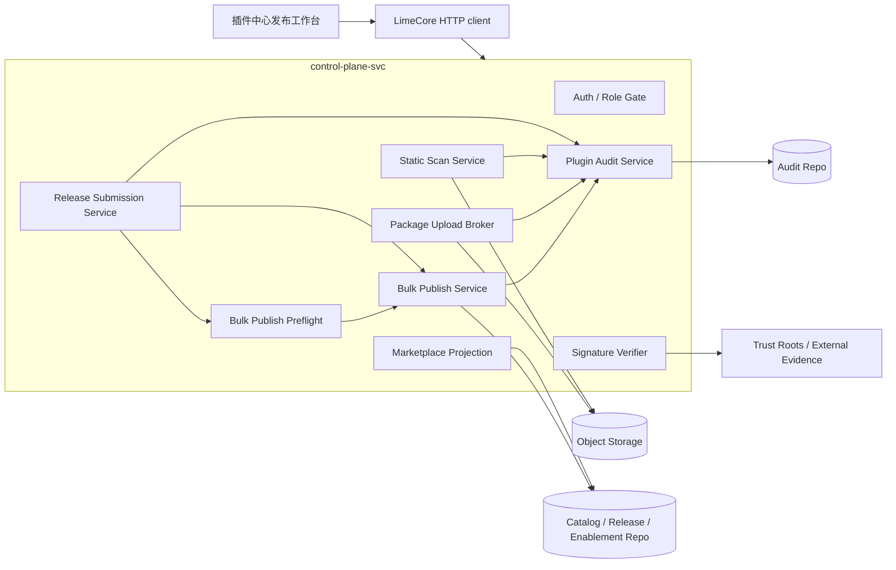
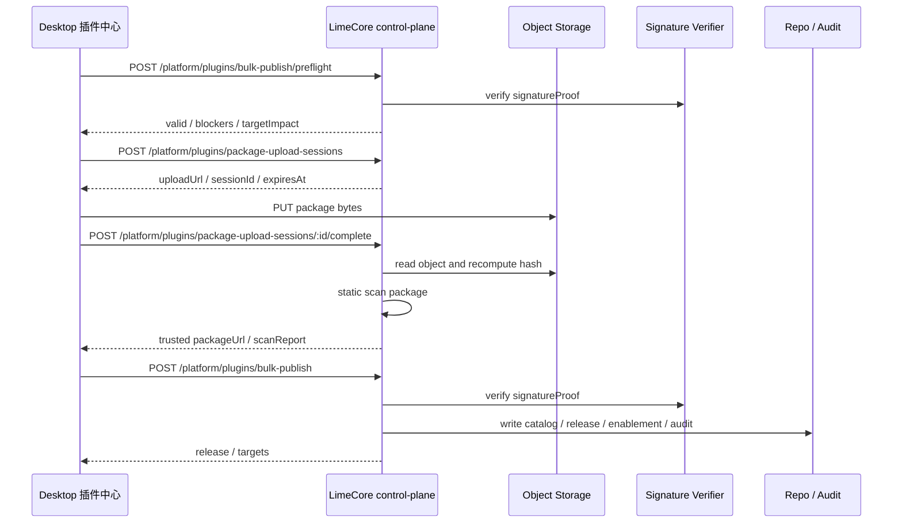
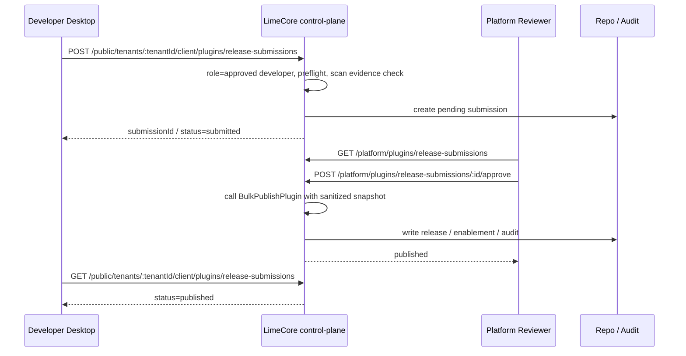
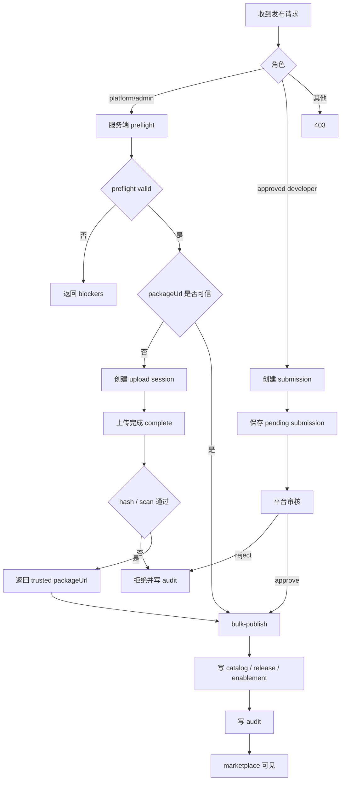

# 插件发布 LimeCore 服务端规划

更新时间：2026-07-06  
状态：LC-P1 / LC-P2 / LC-P3 已实现并完成定向验证；Desktop 开发者云端 preflight、平台审核工作台、提交状态面板与 platform audit action 展示已接入；LC-P4 export / rollback 产品化与 LimeCore console 运营后台仍为规划  
适用范围：LimeCore control-plane-svc / Plugin marketplace / package upload broker / 安全扫描 / 发布审核 / 审计

关联文档：

- 总 PRD：`internal/roadmap/plugin/deverlop/plugin-publish-center-prd.md`
- 旧发布工具：`/Users/coso/Documents/dev/ai/limecloud/lime-agent-app-studio`
- 服务端仓库：`/Users/coso/Documents/dev/ai/limecloud/limecore`
- 服务端当前事实源：
  - `services/control-plane-svc/internal/controller/plugin.go`
  - `services/control-plane-svc/internal/controller/public_client.go`
  - `services/control-plane-svc/internal/service/control_plane_authorization.go`
  - `services/control-plane-svc/internal/service/control_plane_plugin_catalog_service.go`
  - `services/control-plane-svc/internal/service/control_plane_plugin_bulk_publish_validation.go`
  - `services/control-plane-svc/internal/service/control_plane_plugin_signature_verifier.go`
  - `services/control-plane-svc/internal/service/control_plane_plugin_metadata_helpers.go`
  - `services/control-plane-svc/internal/service/control_plane_plugin_publish_preflight_service.go`
  - `services/control-plane-svc/internal/service/control_plane_plugin_package_upload_service.go`
  - `services/control-plane-svc/internal/service/control_plane_plugin_release_submission_service.go`
  - `contracts/openapi/control-plane-svc/20-paths-client.yaml`
  - `contracts/openapi/control-plane-svc/30-paths-platform-partner.yaml`
  - `contracts/openapi/control-plane-svc/70-schemas-service-skills.yaml`
  - `packages/types/index.ts`
  - `packages/api-client/index.ts`
- Desktop 审核事实源：
  - `src/lib/api/oemCloudPluginPublish.ts`
  - `src/features/plugin/publish/PluginReleaseReviewWorkbench.tsx`
  - `src/features/plugin/publish/PluginReleaseSubmissionStatusPanel.tsx`
  - `src/features/plugin/ui/PluginsPage.tsx`

## 1. 一句话目标

LimeCore 必须成为插件发布的云端唯一事实源：负责 package 资产可信化、发布预检、签名验证、catalog / release / tenant enablement 写入、开发者提交审核、审计和回滚；Lime Desktop 插件中心只做发布工作台和客户端调用，不新增私有发布后端。

```text
Desktop 插件中心：本地诊断、打包、签名输入、发布工作流 UI
LimeCore control-plane：资产、权限、校验、审核、发布写入、审计、回滚
```

## 2. 背景

旧 `lime-agent-app-studio` 已经打通过一条可工作的发布链：

1. 本地读取项目并生成发布计划。
2. 本地打包 `.lapp` 并计算 `packageHash` / `manifestHash`。
3. 读取 `app.signature.yaml`，生成 `signatureRef` / `signatureProof`。
4. 正式发布必须提供真实 HTTPS `packageUrl`。
5. 调用 LimeCore `POST /api/v1/platform/plugins/bulk-publish`，由服务端写入 catalog、release 和 tenant enablement。

这条链路的正确部分要保留：最终写入口在 LimeCore，签名证明进入 release，客户端 marketplace 从 LimeCore 投影。需要补齐的是插件时代的服务端缺口：受控上传、权威 preflight、普通开发者提交审核、安全扫描证据和完整审计。

## 3. 服务端目标

1. `bulk-publish` 继续作为唯一最终发布写入口，避免 preflight、upload、submission 各自复制写库逻辑。
2. `preflight` 复用最终发布校验，保证本地工作台看到的阻断原因和真正发布一致。
3. package 上传通过短时 upload session 或 broker 完成，Desktop 不持有长期对象存储凭证。
4. 上传完成后由服务端复算 hash，并做静态安全扫描，hash mismatch 不生成可信 `packageUrl`。
5. 普通 approved developer 不直接持有 platform token，正式发布走 submission / review / approve 或等价受控桥接。
6. 每个关键动作写入 plugin audit：upload、scan、preflight、submit、approve、reject、publish、revoke、rollback、install-state。
7. 服务端只做控制面，不执行插件包内 JS、shell、worker、renderer 或 runtime hook。

## 4. 非目标

- 不在 Lime App Server 新增 marketplace 发布 JSON-RPC。
- 不恢复旧 Tauri / Agent App 发布命令。
- 不把 Desktop 做成对象存储直连客户端。
- 不在 control-plane 执行插件代码。
- 不用 developer profile 的 approved 状态绕过 platform/admin 写权限。

## 5. 角色与用例

| 角色         | 用例                                   | 服务端责任                                       |
| ------------ | -------------------------------------- | ------------------------------------------------ |
| 平台管理员   | 直接发布官方插件或企业插件             | preflight、upload、bulk publish、audit、rollback |
| 已认证开发者 | 提交插件发布申请                       | developer submission、状态查询、失败原因         |
| 审核者       | 审核 package、签名、权限和租户影响     | submission review、approve / reject、审计留痕    |
| 租户管理员   | 查看可用插件、注册码状态、安装失败原因 | marketplace、registration、install-state 投影    |
| Lime Desktop | 在插件中心完成发布工作流               | 只调用 LimeCore current API，不保存云端密钥      |

## 6. Current / Gap 分类

| 能力                                                       | 当前状态             | 服务端规划                                                                         |
| ---------------------------------------------------------- | -------------------- | ---------------------------------------------------------------------------------- |
| `GET /public/tenants/:tenantId/client/plugins/marketplace` | current              | 插件中心云端目录唯一入口。                                                         |
| `POST /platform/plugins/bulk-publish`                      | current              | 最终写 catalog / release / targets 的唯一入口。                                    |
| release signature verifier                                 | current              | 继续支持 local / external evidence，生产要求 trust root 和 transparency log 策略。 |
| registration / install-state                               | current              | 继续用于注册码解锁和安装态审计。                                                   |
| release revoke / enablement rollback                       | current              | 接入发布历史和运营补偿。                                                           |
| `POST /platform/plugins/bulk-publish/preflight`            | current / LC-P1 done | 权威 dry-run，不写库，复用最终校验。                                               |
| package upload broker                                      | current / LC-P2 done | 新增短时上传会话、hash 复算、scan report、可信 packageUrl。                        |
| developer submission / review                              | current / LC-P3 done | 普通开发者提交，平台审核后由服务端调用 `bulk-publish`。                            |
| package security scan                                      | current / LC-P2 done | 静态扫描 evidence，覆盖结构、路径、大小、manifest、敏感字段。                      |
| audit evidence export                                      | LC-P4                | 聚合 upload / scan / submission / publish / rollback / install-state。             |

2026-07-05 current API 补充：LC-P2 upload broker 已覆盖 `POST /api/v1/platform/plugins/package-upload-sessions`、`PUT /api/v1/platform/plugins/package-upload-sessions/:sessionId/content`、`POST /api/v1/platform/plugins/package-upload-sessions/:sessionId/complete`、developer public `POST /api/v1/public/tenants/:tenantId/client/plugins/package-upload-sessions`、`PUT /api/v1/public/tenants/:tenantId/client/plugins/package-upload-sessions/:sessionId/content`、`POST /api/v1/public/tenants/:tenantId/client/plugins/package-upload-sessions/:sessionId/complete` 与 `GET /api/v1/public/plugins/package-assets/*objectKey`；发布前必须使用服务端复算 hash 和 scan report 生成可信 `packageUrl`，Desktop 不直连对象存储、不持久化云端密钥。

2026-07-05 LC-P3 current API 补充：developer submission 已覆盖 `POST /api/v1/public/tenants/:tenantId/client/plugins/release-submissions`、`GET /api/v1/public/tenants/:tenantId/client/plugins/release-submissions`、`GET /api/v1/public/tenants/:tenantId/client/plugins/release-submissions/:submissionId`；platform review 已覆盖 `GET /api/v1/platform/plugins/release-submissions`、`POST /api/v1/platform/plugins/release-submissions/:submissionId/approve`、`POST /api/v1/platform/plugins/release-submissions/:submissionId/reject`。普通 developer 不能直接调用 platform `bulk-publish`，Desktop 发布工作台默认走 upload -> submission；提交后状态面板已消费 public developer list，展示最近 submission 状态、payload hash、scan evidence 和 review notes，且不展示 `registrationCode` 明文；Desktop 平台审核工作台已先接入 list / approve / reject，401 / 403 等权限失败直接展示云端错误，不走本地 mock。

2026-07-06 LC-P3 current API 补充：developer 云端 dry-run 已覆盖 `POST /api/v1/public/tenants/:tenantId/client/plugins/release-submissions/preflight`。该路由复用 `CreatePluginReleaseSubmissionRequest` 与 `BulkPublishPluginPreflightResponse`，要求 approved developer、校验 upload session owner / verified scan evidence / trusted packageUrl / packageHash / manifestHash，拒绝 `registrationCode` 明文，不创建 `PluginReleaseSubmission`，不写 catalog / release / tenant enablement。Desktop 发布工作台已改为先调用该 public preflight，只有 `preflight.valid === true` 才允许提交审核单。

## 7. 服务端架构图



边界规则：

- Desktop 只能拿到短时上传 URL、session id、可信 `packageUrl` 和扫描结果。
- `bulk-publish` 是唯一最终写入服务；preflight 和 submission 必须复用它的校验或调用它。
- marketplace projection 只读取 catalog / release / enablement，不参与发布写入。

## 8. 服务端时序图

### 8.1 平台 direct publish



### 8.2 普通 developer submission



## 9. 服务端流程图



## 10. API 规划

### 10.1 已有 current API

| API                                                                                  | 角色           | 说明                                    |
| ------------------------------------------------------------------------------------ | -------------- | --------------------------------------- |
| `POST /api/v1/platform/plugins/bulk-publish`                                         | platform/admin | 最终发布写入口。                        |
| `POST /api/v1/platform/plugins/bulk-publish/preflight`                               | platform/admin | LC-P1，权威 dry-run，已规划为 current。 |
| `GET /api/v1/public/tenants/:tenantId/client/plugins/marketplace`                    | tenant user    | 客户端插件中心目录。                    |
| `POST /api/v1/public/tenants/:tenantId/client/plugins/:pluginName/registration-code` | tenant user    | 注册码解锁。                            |
| `POST /api/v1/public/tenants/:tenantId/client/plugins/:pluginName/install-state`     | tenant user    | 安装态审计。                            |
| `GET /api/v1/platform/plugins/audit-logs`                                            | platform/admin | 平台插件审计。                          |
| `POST /api/v1/platform/plugins/bulk-rollback-enablements`                            | platform/admin | 批量回滚 enablement。                   |

### 10.2 LC-P2 upload broker

```http
POST /api/v1/platform/plugins/package-upload-sessions
```

请求字段：

| 字段                   | 说明                                    |
| ---------------------- | --------------------------------------- |
| `tenantId`             | 目标租户或平台默认租户。                |
| `pluginName`           | 插件名，必须符合 marketplace segment。  |
| `marketplaceName`      | marketplace segment，默认 `limecloud`。 |
| `version`              | release 版本。                          |
| `expectedPackageHash`  | Desktop 计算的 `sha256:<64 hex>`。      |
| `expectedManifestHash` | Desktop 计算的 manifest hash。          |
| `sizeBytes`            | 客户端预计包大小，用于限额预判。        |
| `contentType`          | 允许 `application/zip` 或服务端白名单。 |

响应字段：

| 字段        | 说明                                 |
| ----------- | ------------------------------------ |
| `sessionId` | 短时上传会话。                       |
| `uploadUrl` | 短时 pre-signed URL，过期后不可用。  |
| `objectKey` | 服务端生成，不接受客户端自定义路径。 |
| `expiresAt` | 上传过期时间。                       |
| `headers`   | 上传必须携带的最小 header。          |

```http
POST /api/v1/platform/plugins/package-upload-sessions/:sessionId/complete
```

complete 行为：

1. 校验 session 状态、创建者、过期时间、对象 key、大小上限。
2. 从对象存储读取实际对象，由服务端复算 `packageHash`。
3. 解包但不执行，检查 path traversal、symlink、文件数量、总大小、manifest 路径、manifest schema。
4. 复算或提取 `manifestHash`，与请求期望值比较。
5. 扫描 manifest summary 敏感字段和禁止字段；Desktop 本地预检只能提前阻断，不能替代该服务端权威门禁。
6. 生成 `PluginPackageScanReport`。
7. 通过时返回可信 `packageUrl`，失败时返回 blockers，且不允许进入 `bulk-publish`。

### 10.3 LC-P3 developer submission

```http
POST /api/v1/public/tenants/:tenantId/client/plugins/release-submissions
POST /api/v1/public/tenants/:tenantId/client/plugins/release-submissions/preflight
GET  /api/v1/public/tenants/:tenantId/client/plugins/release-submissions
GET  /api/v1/public/tenants/:tenantId/client/plugins/release-submissions/:submissionId
GET  /api/v1/platform/plugins/release-submissions
POST /api/v1/platform/plugins/release-submissions/:submissionId/approve
POST /api/v1/platform/plugins/release-submissions/:submissionId/reject
```

约束：

- developer 路由只允许 approved developer 创建或查看自己的 submission。
- developer preflight 只执行权威 dry-run，不创建 submission，不写 catalog / release / enablement。
- submission 只能保存脱敏 payload snapshot，不保存 `registrationCode` 明文、token、私钥、本地路径或包内容。
- Desktop developer submission client 必须删除 `registrationCode` 明文；需要注册码时只能提交 `registrationRequired`、`registrationHint` 和 `registrationState=required`，不能在审核前声明 `active`。
- approve 时服务端读取 snapshot 和 scan report，重新执行 preflight，再调用 `BulkPublishPlugin`。
- reject 必须写入原因和 reviewer，客户端可见但不暴露内部安全规则细节。

## 11. 数据模型规划

| 模型                         | 关键字段                                                                                                                                                                               | 说明                 |
| ---------------------------- | -------------------------------------------------------------------------------------------------------------------------------------------------------------------------------------- | -------------------- |
| `PluginPackageUploadSession` | `id`、`tenantId`、`developerUserId`、`pluginName`、`marketplaceName`、`version`、`expectedPackageHash`、`expectedManifestHash`、`objectKey`、`status`、`expiresAt`、`uploadUrl` | 短时上传会话。       |
| `PluginPackageScanReport`    | `id`、`sessionId`、`packageHash`、`manifestHash`、`sizeBytes`、`fileCount`、`blockers`、`warnings`、`evidenceRef`、`createdAt`                                                         | 上传后静态扫描证据。 |
| `PluginReleaseSubmission`    | `id`、`tenantId`、`developerUserId`、`developerId`、`pluginName`、`marketplaceName`、`version`、`uploadSessionId`、`packageUrl`、`packageHash`、`manifestHash`、`payload`、`payloadHash`、`preflight`、`scanEvidenceRef`、`status`、`reviewer`、`reviewNotes`、`publishedReleaseId` | 开发者发布审核单。   |
| `PluginPublishAuditEvent`    | `id`、`action`、`actor`、`tenantId`、`pluginName`、`marketplaceName`、`releaseId`、`submissionId`、`scanReportId`、`payloadDigest`、`createdAt`                                        | 发布全链路审计事件。 |

状态枚举：

- Upload session：`created / uploaded / verified / rejected / expired`
- Scan report：`passed / blocked / warning_only`
- Release submission：`pending_review / blocked / rejected / published`

## 12. 安全规划

### 12.1 威胁模型

| 风险                 | 攻击面                                 | 服务端防线                                                                  |
| -------------------- | -------------------------------------- | --------------------------------------------------------------------------- |
| 长期对象存储凭证泄露 | Desktop 直连对象存储                   | 只发短时上传 URL，不发 access key / secret。                                |
| 包被替换             | 上传后 packageUrl 指向非原始对象       | complete 阶段服务端复算 hash，可信 URL 绑定 object key 和 hash。            |
| hash mismatch 被绕过 | 客户端伪造 packageHash                 | release 写入前再次校验 scan report / packageHash。                          |
| path traversal       | zip 内 `../` 或绝对路径                | 解包扫描拒绝越界、symlink、设备文件和异常路径。                             |
| 敏感字段入库         | manifestSummary 携带 token / key       | 复用 sensitive / forbidden metadata 拦截。                                  |
| 签名伪造             | 伪造 signatureProof                    | signature verifier 校验证据、算法白名单、trust root、transparency log。     |
| 注册码泄露           | payload / audit / preflight 回显       | 明文只允许最终 publish 请求一次性进入，服务端保存 hash，响应和 audit 脱敏。 |
| 开发者越权发布       | approved developer 直接调 platform API | 路由鉴权分层，普通 developer 只能 submission。                              |
| 重放发布             | 复用旧 upload session 或旧 signature   | session 过期、payloadHash 绑定 packageHash / manifestHash / signedAt。      |
| 扫描假阴性           | 静态扫描覆盖不足                       | 扫描只是 evidence，不替代签名、hash、权限 gate 和人工审核。                 |

### 12.2 强制门禁

- Auth：platform API 只允许 `platform_operator` / `admin`；developer API 只允许当前租户 approved developer。
- Integrity：`packageHash`、`manifestHash`、`payloadHash` 必须是 `sha256:<64 hex>`。
- Transport：`packageUrl` 必须 HTTPS；受控上传返回的 URL 必须来自服务端 allowlist 域名。
- Signature：`signatureProof` 必填，算法只允许服务端白名单。
- Metadata：`manifestSummary` 只允许摘要字段，拒绝 token、secret、credential、privateContent、workspaceData、knowledgeContent 等敏感键；Desktop 发布工作台已补明显敏感值 preflight，但 LimeCore 仍必须作为最终 metadata 拦截事实源。
- Audit：失败也要写入可追踪事件，但错误详情按角色脱敏。
- Rate limit：upload session、complete、submission 创建需要按用户、租户、pluginName 限流。
- Quota：限制包大小、文件数量、单租户并发 session、每日 submission 数。

## 13. 分期实施

| 阶段  | 目标           | LimeCore 交付物                                              | Desktop 联动                | 验证                                                   |
| ----- | -------------- | ------------------------------------------------------------ | --------------------------- | ------------------------------------------------------ |
| LC-P0 | 事实源对齐     | 服务端规划、OpenAPI 草案、旧 Studio 差异确认                 | 发布工作台不绕过 LimeCore   | 文档 diff                                              |
| LC-P1 | 权威 preflight | `bulk-publish/preflight` service / route / OpenAPI / SDK     | 发布前必须服务端预检通过    | Go service/controller tests；完整 contracts 门禁走发布前校验 |
| LC-P2 | 受控上传       | upload session / complete / scan report / trusted packageUrl | 手填 URL 升级为上传流程；本地 manifestSummary sensitive preflight 已接入 | hash mismatch、expired、MIME / archive invalid、oversize、path traversal tests |
| LC-P3 | 开发者提交审核 | developer submission preflight / submission / platform review / approve / reject | 普通 developer 先云端 preflight，再提交审核 | auth tests、state tests、audit tests（已完成定向验证） |
| LC-P4 | 审计证据       | upload / scan / submission / publish / rollback audit 聚合   | Desktop 审核工作台已消费 platform plugin audit logs 展示云端 audit action；CSV/export 和 rollback 产品化仍是后续项 | audit query tests + Desktop audit API / review tests；export tests 待补 |
| LC-P5 | 运营后台       | platform / partner web 接入审核与回滚                        | Desktop 已接入 platform review workbench；长期仍需 LimeCore console / 平台后台 | web typecheck、route tests；Desktop 定向 Vitest / contracts / GUI smoke |
| LC-P6 | 端到端闭环     | publish -> marketplace -> install -> install-state           | Desktop 提交 / 审核发布后已触发插件中心刷新，install-state action 已回传 | Desktop publish / review 定向 Vitest + LimeCore route tests；完整 Lime GUI smoke 走发版前门禁 |

## 14. 验收标准

- [x] `bulk-publish` 仍是唯一最终发布写入口。
- [x] preflight 与最终 publish 共用校验逻辑或共用 fixture，不能漂移。
- [x] upload session 不下发长期对象存储凭证。
- [x] complete 必须服务端复算 hash，hash mismatch 不生成可信 `packageUrl`。
- [x] upload session 过期、MIME 不合法、archive 不合法或 scan blocked 时不生成可信 `packageUrl`，也不能创建 developer submission / release。
- [x] scan report 不执行包内代码，只做静态检查和 evidence。
- [x] `manifestSummary` 拒绝 token、secret、credential、workspaceData、knowledgeContent、privateContent 和 bypassPermissions 等敏感 / 禁用字段，且失败发生在 catalog / release 写入前。
- [x] Desktop 已在发布工作台对 `manifestSummary` 明显敏感值做本地 blocker；LimeCore metadata 拦截仍是权威门禁。
- [x] 普通 developer 不能直接写 catalog / release / enablement。
- [x] 未批准 developer 不能创建 public upload session 或 release submission，route guard 覆盖失败响应不回显 package hash / registrationCode。
- [x] developer `release-submissions/preflight` 要求 approved developer，且不创建 submission、不写 catalog / release / enablement。
- [x] approve 必须重新 preflight 后再调用 `BulkPublishPlugin`。
- [x] `registrationCode` 明文不进入 preflight 响应、audit、submission snapshot 或日志。
- [x] Desktop 已消费 developer release-submissions list 展示提交后状态、scan evidence、payload hash 和审核备注，且不渲染 `registrationCode` 明文。
- [x] Desktop 发布工作台已接入 developer public preflight，正式提交前必须有服务端 `preflight.valid === true`。
- [x] Client install-state public route / service / controller 已覆盖 installed、enabled、disabled、uninstalled、failed 上报并写入审计；完整 audit query / export 仍归 LC-P4。
- [x] Desktop 审核发布成功后会触发插件中心 marketplace refresh；服务端 approve route 覆盖 catalog / release / enablement 写入。
- [x] Desktop 审核工作台已通过 platform plugin audit logs 展示关联 action、releaseId、tenantId、operator 和 summary；metadata 不作为 UI 明文展示。
- [x] OpenAPI fragments、bundle、`packages/types`、`packages/api-client`、JS 镜像同步。
- [x] Go service/controller 定向测试、route auth 测试通过；完整 `make verify-contracts` / 发布门禁仍需在发版前单独执行。

## 15. 未决问题

1. package 资产域名 allowlist 是平台全局配置、租户配置，还是 marketplace 配置。
2. scan report 和 upload session 的保留周期、删除策略、合规导出范围。
3. developer submission 是否需要 SLA、重复版本锁、撤回能力和批量审批。
4. signature external verifier 的生产证据服务、trust root 轮换和 transparency log 策略。
5. 运营审核后台是否进入 LimeCore console web，还是先用 platform API / admin script 承接。
