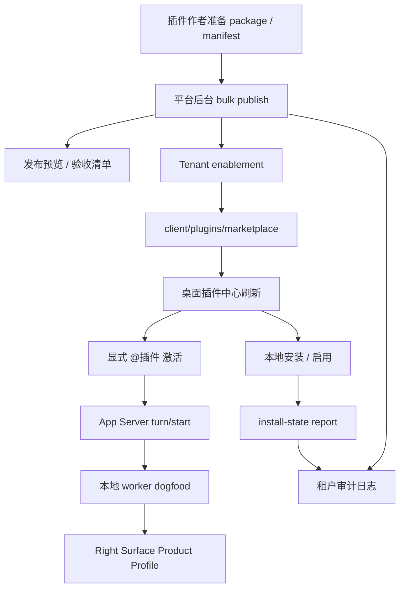

# Lime 插件跨仓端到端证据包

更新时间：2026-06-27
状态：第二轮产品化证据包

## 1. 验收目标

本证据包用于追踪第二轮产品化后的跨仓闭环：

1. LimeCore 平台后台能发布插件并留下发布证据。
2. LimeCore 租户后台能查看 enablement、注册授权、安装态和审计证据。
3. Lime Desktop 能消费 marketplace、本地安装 / 启用插件、显式 `@插件` 激活，并在 Right Surface 展示产物。
4. App Server current 运行链能处理内容工厂本地 worker dogfood、renderer 宿主占位和远端运行 fail closed。

这份证据包不声称已经接入真实外部签名 / 透明日志服务，也不声称已经做过同一真实租户账号从平台发布到桌面点击的 live 手工全链路。

## 2. 跨仓证据流程图



## 3. 证据矩阵

| 链路                                 | 当前证据                                                                                                                                                                                                                                                                                                                                   | 证据位置                                                                                                                                                                                                                                                                                                                              | 结论                                                                                                                               |
| ------------------------------------ | ------------------------------------------------------------------------------------------------------------------------------------------------------------------------------------------------------------------------------------------------------------------------------------------------------------------------------------------ | ------------------------------------------------------------------------------------------------------------------------------------------------------------------------------------------------------------------------------------------------------------------------------------------------------------------------------------- | ---------------------------------------------------------------------------------------------------------------------------------- |
| 平台发布前验收                       | payload helper 覆盖 URL、hash、manifest、版本、目标租户和灰度校验。                                                                                                                                                                                                                                                                        | LimeCore `apps/platform-web/src/pages/Plugins/pluginPublishPayload.ts`、`scripts/platform-plugin-publish-payload.test.mjs`                                                                                                                                                                                                            | 已有定向证据。                                                                                                                     |
| 平台发布预览 / 发布证据              | 后台页面展示预览 payload、发布包验收清单、最近发布结果和补偿提示。                                                                                                                                                                                                                                                                         | LimeCore `apps/platform-web/src/pages/Plugins/index.tsx`                                                                                                                                                                                                                                                                              | 已有页面骨架与 typecheck 证据。                                                                                                    |
| target 前置预检                      | bulk publish 写入前校验目标租户、状态、可见性、license、注册和灰度规则。                                                                                                                                                                                                                                                                   | LimeCore `services/control-plane-svc/internal/service/control_plane_plugin_bulk_publish_validation.go`                                                                                                                                                                                                                                | 已有 Go 定向测试。                                                                                                                 |
| 租户运营审计                         | enablement 展开行、注册证据、安装态报告标签和 metadata 展开可读。                                                                                                                                                                                                                                                                          | LimeCore `apps/partner-web/src/pages/Plugins/pluginOperationsEvidence.ts`                                                                                                                                                                                                                                                             | 已有 Node helper 与 typecheck 证据。                                                                                               |
| enablement 恢复快照                  | update 审计记录 `previous` / `current` / `changedFields`，不记录明文注册码或 hash。                                                                                                                                                                                                                                                        | LimeCore `services/control-plane-svc/internal/repo/inmemory_control_plane_repo_plugin_audit_metadata.go`                                                                                                                                                                                                                              | 已有服务层测试证据。                                                                                                               |
| 单租户回滚                           | enablement rollback API、SDK、代理后台确认入口和 `enablement_rollback` 审计。                                                                                                                                                                                                                                                              | LimeCore `services/control-plane-svc/internal/service/control_plane_plugin_catalog_service_test.go`、`scripts/api-client-workspace.test.mjs`                                                                                                                                                                                          | 已有定向证据。                                                                                                                     |
| Bulk publish 原子保护                | 服务端 bulk publish 已下沉到 repository 单入口写入；MySQL snapshot persist 失败时恢复调用前内存状态，不留下新版 release、enablement update 或污染审计；有数据库连接时会在同一个 GORM transaction 内写入 plugin catalog / release / tenant enablement / audit log / snapshot payload。                                                      | LimeCore `services/control-plane-svc/internal/repo/mysql_plugin_catalog_schema.go`、`services/control-plane-svc/internal/repo/mysql_plugin_catalog_transaction.go`、`services/control-plane-svc/internal/repo/mysql_plugin_catalog_rollback_drill.go`、`services/control-plane-svc/internal/repo/mysql_plugin_catalog_schema_test.go` | 表级事务骨架已接入；已新增 `--plugin-transaction-drill` 可执行入口，本地判定测试通过；真实 MySQL drill 与 live evidence 尚未提交。 |
| 跨租户批量回滚                       | 平台后台从最近 bulk publish 的 `updated` targets 构造批量回滚 payload，服务端按 target 回滚到上一 ready release、从审计 `previous` 快照恢复不含密钥的安全策略字段，并写 `enablement_rollback` 审计；有数据库连接时会在同一个 GORM transaction 内写入关联 catalog / release / tenant enablement / audit log / snapshot payload。            | LimeCore `services/control-plane-svc/internal/service/control_plane_plugin_catalog_service_test.go`、`services/control-plane-svc/internal/repo/mysql_plugin_catalog_rollback_drill.go`、`services/control-plane-svc/internal/repo/mysql_plugin_catalog_schema_test.go`、`scripts/platform-plugin-publish-payload.test.mjs`            | 表级事务骨架已接入并纳入同一 `--plugin-transaction-drill` 演练入口；真实 MySQL drill 与 live evidence 尚未提交。                   |
| 跨租户审计聚合                       | 平台后台跨租户汇总 Plugin 审计日志，支持租户、plugin、动作、变更字段和关键词筛选，并导出当前筛选 CSV。                                                                                                                                                                                                                                     | LimeCore `apps/platform-web/src/pages/Plugins/PluginAuditLogPanel.tsx`、`scripts/platform-plugin-release-history.test.mjs`                                                                                                                                                                                                            | 已有定向证据。                                                                                                                     |
| 桌面 GUI 消费 / 激活 / Right Surface | 真实 Electron fixture 通过 current bridge 和 App Server JSON-RPC，覆盖本地安装态、显式右侧面、worker dogfood、artifact read、renderer 占位和远端运行拒绝。                                                                                                                                                                                 | `.lime/qc/gui-evidence/claw-chat-current-fixture/plugin-productization-e2e-summary.json`                                                                                                                                                                                                                                              | 本轮新增通过证据。                                                                                                                 |
| Live 验收证据门禁                    | LimeCore `scripts/plugin/live-acceptance-evidence.mjs` 校验真实账号验收后提交的 `plugin-live-acceptance/v1` evidence JSON，并生成 JSON / Markdown 报告；LimeCore 外仓 plugin roadmap 中的 live acceptance template 与 schema 提供版本化模板和结构约束，空模板、缺少非本地 live 运行上下文、空 artifact ref、artifact 本地文件不存在、artifact SHA-256 摘要缺失或与文件内容不一致、本地签名 evidence、缺少外部证据服务 / pipeline run / 透明日志锚点、缺少 MySQL transaction drill 或任一 plugin 表哨兵行未回滚都会被阻断。 | LimeCore 外仓 plugin operations runbook 的 Live 证据门禁章节                                                                                                                                                                                                                                                         | 本地门禁、模板与 schema 已补；真实租户 evidence 尚未提交。                                                                         |

## 4. 桌面 fixture 断言摘要

执行命令：

```bash
npm run smoke:claw-chat-current-fixture -- --scenario content-factory-product-profile --prefix plugin-productization-e2e --timeout-ms 180000
```

输出：

```text
.lime/qc/gui-evidence/claw-chat-current-fixture/plugin-productization-e2e-summary.json
.lime/qc/gui-evidence/claw-chat-current-fixture/plugin-productization-e2e-chat.png
internal/roadmap/plugin/evidence/plugin-productization-e2e-summary.json
```

关键通过断言：

| 断言                                                  | 结果 |
| ----------------------------------------------------- | ---- |
| Electron preload bridge 可用                          | pass |
| App Server JSON-RPC current 链被使用                  | pass |
| `agentAppInstalled/save` 写入本地 installed state     | pass |
| `agentSession/turn/start` 触发内容工厂 worker dogfood | pass |
| Right Surface Product Profile 可见                    | pass |
| Product Workspace read model 投影完成                 | pass |
| `artifact/read` 可读回派生 artifact document          | pass |
| worker 失败分类 / 重试建议可见                        | pass |
| action result workspace patch 投影完成                | pass |
| app-declared renderer 只展示宿主占位                  | pass |
| 远端运行 fail closed                                  | pass |
| 未调用 live provider                                  | pass |
| 控制台 actionable error                               | 0    |

## 5. 服务端验证摘要

第二轮服务端产品化已记录以下验证入口：

```bash
node --test scripts/plugin/live-acceptance-evidence.test.mjs
node --test scripts/platform-plugin-publish-payload.test.mjs scripts/partner-plugin-operations-evidence.test.mjs
node --test scripts/platform-plugin-release-history.test.mjs
node --test scripts/api-client-workspace.test.mjs
npm run typecheck --workspace @limecore/platform-web
npm run typecheck --workspace @limecore/partner-web
go test ./services/control-plane-svc/internal/service -run 'TestControlPlaneService.*Plugin'
go test ./services/control-plane-svc/cmd/migrate ./services/control-plane-svc/internal/repo ./services/control-plane-svc/internal/service ./services/control-plane-svc/internal/controller
go test ./services/control-plane-svc/internal/repo -run 'TestMySQLSnapshotBulk(PublishPlugin|RollbackPluginEnablements)RestoresMemoryOnPersistFailure'
go test ./services/control-plane-svc/internal/controller -run 'TestAgentAppRoutesBulkPublishNativePlugin'
go test ./services/control-plane-svc/internal/service ./services/control-plane-svc/internal/controller
make verify-go-fast
make verify-web
```

这些验证证明发布控制面、审计可读性、target 预检和后台页面类型边界仍然可用。它们不替代真实运营账号的 live 点击验收。

## 6. 未覆盖项

| 缺口                       | 当前口径                                                                                                                                                                                                                                                                                                                                                                                                                                       |
| -------------------------- | ---------------------------------------------------------------------------------------------------------------------------------------------------------------------------------------------------------------------------------------------------------------------------------------------------------------------------------------------------------------------------------------------------------------------------------------------- |
| 外部签名 / 透明日志集成    | LimeCore 已有可配置外部 evidence verifier 骨架；live evidence 门禁已要求 `supplyChainEvidence.verifierMode=external`、证据服务引用、pipeline run、package / manifest hash 绑定和透明日志锚点；仍缺真实生产凭证与真实服务回查 evidence。                                                                                                                                                            |
| live 手工跨仓全链路        | 已有 LimeCore 本地 evidence JSON 门禁，但仍需用真实平台账号发布到真实租户，再用桌面插件中心刷新、授权、安装、激活和查看审计，最后提交包含外部供应链证据和 MySQL transaction drill 报告的 `plugin-live-acceptance/v1` evidence JSON 跑出 `verdict=pass`。                                                                                                                                                                                                                                          |
| 强事务回滚                 | 当前已有 target 预检、repository 单入口 bulk publish、补偿提示、审计恢复快照、字段级差异视图、单租户 enablement rollback、跨租户按 target 批量回滚、不含密钥的安全策略字段自动恢复、snapshot 持久化失败恢复和跨租户审计聚合；bulk publish / rollback 写路径已接入 plugin 表级 schema / backfill / GORM transaction，并新增 `--plugin-transaction-drill` 可执行入口；live evidence 门禁已要求 MySQL drill report ready、snapshot 保全和四张 plugin 表哨兵行全部回滚；仍缺真实 MySQL 环境实际报告和 live evidence，也不从审计恢复注册码密钥。 |
| 任意插件输出类型           | 当前只允许内容工厂本地 worker 输出 `content_factory.workspace_patch`。                                                                                                                                                                                                                                                                                                                                                                         |
| 真实 app-declared renderer | 当前执行模型固定为宿主占位，不加载 entry。                                                                                                                                                                                                                                                                                                                                                                                                     |
| 远端插件运行               | 当前固定 fail closed，不开放 worker/run API。                                                                                                                                                                                                                                                                                                                                                                                                  |

## 7. 当前判定

第二轮跨仓证据包已补齐到可审计状态：服务端发布 / release 历史筛选与当前筛选导出 / 签名验签状态与 evidence ref / transparency log ref / 外部 evidence verifier 本地回查骨架 / 单租户审计差异字段筛选与当前筛选导出 / 平台跨租户审计聚合 / repository 单入口 bulk publish / 单租户与跨租户 enablement rollback、策略快照恢复、snapshot 持久化失败恢复、plugin 表级 publish / rollback 事务骨架和显式事务回滚演练入口 / 桌面本地运行 / Right Surface fixture / 真实账号 evidence JSON 本地门禁、非本地 live 运行上下文、模板、schema、artifact 文件存在性和 SHA-256 摘要绑定已经串联。当前新增的外部 evidence 回查仍只是可配置骨架和本地测试证据，不应把它标记为完整 live 产品验收，因为缺少同一真实租户账号下的平台后台点击、桌面刷新和租户审计的人工或自动全链路记录；也不声明已接入真实外部签名 / 透明日志服务。
