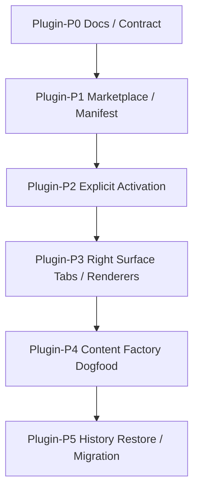

# Lime 插件实施计划

更新时间：2026-06-26
状态：Draft

## 1. 执行原则

1. 先标准后实现：先把 plugin / marketplace / rightsurface 的 contract 写清，再落实现。
2. 先显式后推断：优先做显式激活，不恢复语义猜测。
3. 先服务端骨架后客户端细化：LimeCore 先给出 marketplace 只读目录，Lime 再接本地安装态和显式激活。
4. 先 Host 后业务：先把右栏、tab、恢复、权限与 fallback 做成 Host 能力，再让插件挂载。
5. 先通用后专属：document、imageGrid、storyboard、checklist 先用 host builtin renderer。
6. 先历史恢复再增强交互：先保证打开历史可继续工作，再做复杂编辑器和多步工作流。
7. 先内容工厂闭环：以内容工厂插件验证完整链路，不同时推太多业务插件。

## 2. 开发切片总览



## 3. P0：文档与 contract

### 写集

| 仓库     | 文件                                                                     |
| -------- | ------------------------------------------------------------------------ |
| LimeCore | `/Users/coso/Documents/dev/ai/limecloud/limecore/docs/roadmap/plugin/**` |
| Lime     | `internal/roadmap/plugin/**`、`internal/roadmap/workbench/v4/**`         |

### 验收

- plugin 路线图完整，包含 PRD、架构、technical baseline、contract、实施计划、历史恢复。
- workbench/v4 路线图完整，清楚表达 工作台应用 是插件内独立 UI 能力。
- 与 `rightsurface` 路线图边界清晰，不再写成两个右栏。
- 内容工厂被明确为插件 dogfood，不再和 `旧内容工作台` 代码绑定。
- 服务端 marketplace 边界落到 LimeCore，不在 Lime App Server 新增 marketplace JSON-RPC。

## 4. P1：Marketplace / Manifest / Registry

### 目标

- 以上游插件 / 市场模型为参照，建立插件 manifest 与 marketplace item 的 current contract。
- 从 LimeCore `client/plugins/marketplace` 获取 available plugin listing。
- 让插件、工作台应用、skills、connectors、renderers、activation entries 同时可投影。
- 形成统一 registry，供插件中心和右侧面板消费。

### 验收

- manifest normalizer 能输出统一 plugin contract。
- 缺少必要字段时 fail closed。
- registry 可区分可安装、可激活、可渲染和只读历史四种状态。
- 工作台应用 catalog 只作为迁移输入，不作为插件 marketplace 设计模板。

## 5. P2：显式激活

### 目标

- composer 增加插件 chip。
- 支持 `@插件` / `@插件:技能`。
- session metadata 保存当前激活上下文和右侧 tab 状态。

### 验收

- 普通对话不会自动扫描插件并切换上下文。
- 历史恢复时不会重新猜插件。
- 激活状态可跨会话恢复，但不会自动重新执行危险 action。

## 6. P3：Right Surface Renderer

### 目标

- 建立插件产物 tab。
- 先落通用 renderer：document、imageGrid、storyboard、checklist。
- 再接入复杂插件自定义 pane。
- 直接复用现有 `rightsurface` 的单 dock、多 tab 能力，不再新增第二右栏。

### 验收

- 右侧能恢复历史产物。
- 右侧能对产物发起受控 action。
- 右侧 panel 只作为 plugin workspace，不抢中间 Claw。

## 7. P4：内容工厂插件重建

### 目标

- 重建内容工厂插件 contract。
- 只参考业务，不复用旧 `旧内容工作台` 代码。
- 先跑通文章、图片、视频脚本的最小闭环。

### 验收

- Claw 中间是运行过程。
- 右侧是可编辑产物。
- 历史恢复后可继续生成或编辑。

## 8. P5：历史恢复 / 迁移

### 目标

- 把历史对话、插件上下文、主产物和 tab 状态统一到 session read model。
- 旧 工作台应用 中无法迁移的入口下架。
- 旧 right surface 写死逻辑逐步替换为插件 contract。

### 验收

- 新能力只从插件主路径进入，不继续扩张旧 compat。
- 旧内容工厂相关历史记录能至少只读浏览。
- 文档、测试和 GUI smoke 同步收口。

## 9. 写集建议

| 模块            | 文件建议                                              | 说明                                                              |
| --------------- | ----------------------------------------------------- | ----------------------------------------------------------------- |
| Plugin Center   | `src/features/plugin-center/*`                        | 消费 LimeCore marketplace、展示插件列表、详情、安装、启用和卸载。 |
| Manifest        | `src/features/plugin/manifest/*`                      | manifest normalizer、contract gate、readiness。                   |
| Activation      | `src/components/agent/chat/workspace/*`               | composer chip、`@` 命令、session activation context。             |
| Right Surface   | `src/components/agent/chat/workspace/right-surface/*` | tab、pane、history restore 和 action router。                     |
| Content Factory | `src/features/plugin-content-factory/*`               | 内容工厂 dogfood 的具体对象、任务和 renderer。                    |

## 10. 验证

```bash
npm run test:contracts
npm run verify:gui-smoke
```

GUI 关注点：

1. 安装插件后能进入显式激活。
2. 右侧 tab 能恢复主产物和选中对象。
3. 插件 action 只能经由 runtime 回流。
4. 旧内容工厂历史至少能只读浏览。

## 11. 进度记录

### 2026-06-25 P1 Manifest / Registry 纯函数基座

- 新增 `src/features/plugin/manifest/*`，建立插件根对象的 `PluginManifest -> PluginContract` current contract。
- 新增 `buildPluginContractFromAgentAppManifest(...)`，把现有 工作台应用 v3 manifest 作为插件输入来源之一，投影出插件、工作台应用 子能力、显式激活入口、artifact renderer、history restore 和 Right Surface contract。
- 新增 `projectPluginRegistryItem(...)` / `projectPluginRegistry(...)`，先用纯函数区分 `installable`、`activatable`、`renderable`、`read_only_history` 四类状态。
- 复用 `agent-app/host` 的唯一 Right Surface / productProfile contract，不新增第二右栏或业务自有 dock。
- 当前尚未接入插件中心 GUI、composer chip、`@插件` 选择器或 App Server JSON-RPC；这些仍属于 P2 / P3 后续主线。

### 2026-06-25 P2 显式 `@插件` 发送接线

- 新增 `src/components/agent/chat/workspace/workspacePluginActivation.ts`，从已安装 工作台应用 state 投影插件 contract / registry，再复用 `buildPluginActivationMentionCatalog(...)` 和 `parsePluginActivationMention(...)` 解析显式 `@插件`。
- `useWorkspaceSendActions` 发送前先解析显式插件激活，命中后写入 `requestMetadata.harness.plugin_activation`，设置 task preference，禁用搜索偏航，并继续走 `Agent -> turn/start` 主线。
- disabled / blocked 插件显式 `@` 时 fail closed，不降级成普通消息；自然语言 工作台应用 intent 仍只消费 enabled installed apps。
- 当前 metadata 已能到达发送参数，但还未接 App Server prompt 投影、composer chip、插件中心 GUI 或右侧 tab 恢复。

### 2026-06-25 服务端 marketplace 边界纠偏

- 服务端 marketplace 事实源调整到 `/Users/coso/Documents/dev/ai/limecloud/limecore/docs/roadmap/plugin` 和 LimeCore control-plane。
- Lime 客户端路线图按上游插件与市场口径重建；旧 工作台应用 实现只作为迁移输入，不作为插件 marketplace 设计模板。
- Lime App Server 继续只消费 `requestMetadata.harness.plugin_activation` prompt context，不新增 marketplace 查询、安装或发布接口。

### 2026-06-25 服务端 marketplace 骨架

- LimeCore 已新增 `GET /api/v1/public/tenants/{tenantId}/client/plugins/marketplace` 受保护只读接口，返回 `plugin-marketplace/v1`、`pluginKey`、install/auth policy、manifest summary 和 package ref。
- LimeCore P0 仍以 工作台应用 catalog / release / tenant enablement 作为兼容输入，但输出模型是 plugin-centered；blocked / registration-required 状态不下发 package ref。
- LimeCore 已同步 OpenAPI source fragments、`packages/types` 与 `packages/api-client`，并在服务端文档增加架构图、接口时序图、投影流程图、骨架流程图和验证时序图。
- Lime Desktop 尚未消费新 API；下一刀应在 `src/features/plugin` 或插件中心客户端层接入 marketplace fetch，再合并本地 installed registry。

### 2026-06-25 路线图追踪入口

- `.gitignore` 已为 `internal/roadmap/plugin/**` 增加精确例外，插件路线图、图表和实施计划不再被忽略。
- 该例外只放开 plugin 目录，没有放开整个 `internal/roadmap/**`。

### 2026-06-25 P1 Marketplace 客户端消费骨架

- `src/lib/api/oemCloudControlPlane.ts` 新增 `getClientPluginMarketplace(...)`，从 LimeCore `client/plugins/marketplace` 读取 `plugin-marketplace/v1`，并对 schema、policy、状态和 package ref 做 fail-closed 解析。
- `src/features/plugin/marketplace/*` 新增 marketplace DTO 与投影纯函数，把 LimeCore listing 转成 `PluginContract` / `PluginRegistryProjectionInput` / `PluginRegistryItem`。
- `PluginContract.provenance.sourceKind` 新增 `plugin_marketplace`，使 marketplace 目录成为插件 contract 的 current 输入来源之一。
- registry 投影新增 `installable` 与 `blockerCodes` 输入，确保云端 blocked / `NOT_AVAILABLE` item 不会被误展示成可安装插件。
- 当前仍不接插件中心 GUI，不恢复旧 `get_plugins` / `plugin_rpc_*` 命令，也不新增 Lime App Server marketplace JSON-RPC。

### 2026-06-25 P1 Installed Registry 合并骨架

- `src/features/plugin/marketplace/pluginMarketplace.ts` 新增 `projectPluginMarketplaceInstalledKeysFromAgentApps(...)`，把 current `InstalledAgentAppState[]` 投影成 marketplace plugin 的 `installedPluginKeys`、`enabledPluginKeys`、`disabledPluginKeys` 和 hash mismatch blocker。
- installed 判定必须同时匹配 `appId`、`packageHash` 与 `manifestHash`；hash 不一致时 fail closed，不把旧 工作台应用 包误认成当前 marketplace 插件。
- 新增 `projectPluginMarketplaceRegistryInputsFromInstalledAgentApps(...)` / `projectPluginMarketplaceRegistryFromInstalledAgentApps(...)`，供后续插件中心 GUI 和显式激活直接复用统一 registry 投影。
- blocked marketplace item 仍由云端 policy / readiness blocker 控制；本地 disabled 只表达用户关闭态，不替代云端可用性判断。
- 当前仍不接安装按钮、卸载流程、composer chip 或 Right Surface tab；这些继续作为 P2 / P3 后续切片。

### 2026-06-25 P1 Marketplace Registry Loader 骨架

- 新增 `src/features/plugin/marketplace/marketplaceRegistryLoader.ts`，用 feature 层 loader 组合 LimeCore `getClientPluginMarketplace(...)` 与 App Server current `listInstalledAgentApps()`，避免继续向已超 1000 行的 `oemCloudControlPlane.ts` / `agentApps.ts` 追加业务逻辑，也避免 `src/lib/api` 反向依赖 `features`。
- `loadPluginMarketplaceRegistry(...)` 返回 `marketplace`、`installed`、`projectionInputs` 与统一 `registry` snapshot，后续插件中心 GUI / 显式激活可直接消费同一份投影。
- loader 不新增 Electron IPC、App Server JSON-RPC、DevBridge mock 或旧插件中心命令；只是组合现有 current 网关。
- installed state persistence issues 会原样透出给上层展示 / 诊断，hash mismatch 继续由 `PLUGIN_INSTALLED_PACKAGE_MISMATCH` fail closed。
- 当前仍不触发安装 / 卸载 / enable 写操作，不恢复旧 `list_installed_plugins`、`install_plugin_*`、`plugin_rpc_*` 命令族。

### 2026-06-25 P1 插件中心只读 View Model 骨架

- 新增 `src/features/plugin/marketplace/pluginMarketplaceViewModel.ts`，把 registry snapshot 投影成只读插件中心列表模型，包含 item、filter counts、installed persistence issue count、主操作 stable label key 与 blocker 摘要。
- view model 支持 `query`、`category`、`statusFilter` 和 `sort`，供后续 GUI 层直接消费，不在组件里重复筛选逻辑。
- 当前没有把 `plugins` 接回左侧栏或路由；现有导航仍会过滤旧 `plugins` 设置入口，避免和已下线旧插件中心命令族混淆。
- 主操作目前只是 `install / enable / open / view_history / blocked` 的只读投影，不触发写操作、不新增 i18n 资源、不恢复旧插件安装 / RPC 命令。

### 2026-06-25 P1 Marketplace Registry Hook 骨架

- 新增 `src/features/plugin/marketplace/usePluginMarketplaceRegistry.ts`，把 `loadPluginMarketplaceRegistry(...)` 与只读 view model 组合成 React controller，负责 `loading`、`error`、`snapshot`、`model` 与 `refresh`。
- hook 支持 `autoLoad`、依赖注入、marketplace query 规范化和 view options 更新；view options 变化只重建本地模型，不重复请求 LimeCore marketplace。
- 异步加载使用 request sequence fail-closed，较旧 refresh 结果不会覆盖较新的 marketplace snapshot；`refresh()` 失败会更新 error state 并向调用方抛出原始错误。
- 当前仍不接路由、不接 GUI、不触发安装 / enable / 卸载写操作，也不恢复旧 `get_plugins`、`list_installed_plugins`、`install_plugin_*` 或 `plugin_rpc_*` 命令族。

### 2026-06-25 P2 App Server Plugin Activation Prompt 骨架

- App Server `runtime_backend/plugin_activation_context.rs` 已消费 `requestMetadata.harness.plugin_activation` / `pluginActivation`，把显式插件激活转成 `<plugin_activation_context>` system prompt block。
- prompt context 只表达本 turn 的显式路由上下文、plugin id、entry、selected object、opened tabs 和来源；不打开 `allow_model_skills`，也不允许模型从自然语言重新猜测或切换插件。
- `session_config_from_request(...)` 已在 agent skills context 后追加 plugin activation context，使前端 `@插件` metadata 进入 RuntimeCore current turn/start 主链。
- 当前仍不在 Lime App Server 新增 marketplace 查询 / 安装 JSON-RPC；服务端 marketplace 事实源仍是 LimeCore control-plane。

### 2026-06-26 P4 Product Profile Action Runtime Prompt 骨架

- `WorkspaceProductProfileSurface` 发起的 action 已通过 `submitWorkspaceProductProfileActionIntent(...)` 回流到 Claw turn/start 主链，并继续携带 `right_surface_product_profile`、object ref、action key、risk、task kind 和 source artifact ids。
- Product Profile action 发送参数已补 `systemPromptOverride`，明确本轮来自右侧产物 action，要求 runtime 执行业务 action，而不是降级为普通聊天、插件搜索或 Skill 链路。
- 内容工厂 action prompt 已声明结构化产物应进入 `artifact.snapshot`，并产出可被 Product Workspace / right surface 投影的 `content_factory.workspace_patch`。
- action turn 已显式禁用搜索偏航；metadata 仍由发送层合并进 `requestMetadata.harness`，继续复用 App Server read model 的 action history 投影。
- App Server read model 定向测试已覆盖 Product Profile action turn 产出 `content_factory.workspace_patch` 后，同步更新 Product Workspace 选中对象、worker evidence、派生 artifact document 和 action history result artifacts。
- 当前只完成 action -> runtime prompt / metadata -> workspace patch read model 投影骨架，尚未完成真实 worker 执行、失败态回填或自定义 pane action executor。

### 2026-06-26 P4 内容工厂 Action Result GUI Fixture 骨架

- `claw-chat-current-fixture` 的内容工厂 Product Profile 场景已追加 action-result runtime event，模拟右侧图片组重新生成 action 写回 `content_factory.workspace_patch`。
- fixture 通过 App Server `agentSession/runtimeEvents/append` 追加 `artifact.snapshot`，继续验证 current read model / Product Profile 投影，不走模型 turn，也不恢复旧插件 RPC 或本地 mock fallback。
- 场景断言已覆盖重新生成后的 image object ready 状态、summary、preview artifact、worker evidence，以及源 workspace patch 与派生 artifact document 同时进入 read model artifact 列表。
- 该切片只证明 action result workspace patch 能从 App Server read model 投影到 GUI fixture 骨架；真实 worker executor、失败态回填和自定义 pane action executor 仍未完成。

### 2026-06-26 P4 内容工厂 Worker Contract 骨架

- 新增 `contentFactoryWorkerContract` 纯模型，从内容工厂 manifest 投影 worker entrypoint、contract path、sample request path、task kinds、输出 artifact kind 和 Product Workspace 输出约束。
- 新增 `buildContentFactoryWorkerRequest(...)`，为后续 action executor / App Server worker adapter 生成标准 worker request，包含 session、turn、task、prompt、action key、source object ref、runtime 限制和 expected output。
- worker request 对未知 task kind、缺少必填字段、runtime blocker、直接 provider / filesystem access 或非 `content_factory.workspace_patch` 输出 fail closed。
- 该切片不执行 worker、不新增 App Server JSON-RPC、不接 GUI、不恢复旧插件 RPC；它只把真实 worker dogfood 前的输入 / 输出 contract 固定下来。

### 2026-06-26 P4 内容工厂 Runtime Package 落盘骨架

- 新增 `src/features/agent-app/fixtures/app.runtime.yaml`、`examples/runtime-request.sample.json` 和 `src/runtime/content-factory-worker.mjs`，让内容工厂 manifest 声明的 worker entrypoint、contract path 与 sample request 不再是缺文件引用。
- worker skeleton 只接收标准 request，校验 `content-factory.worker-request.v1`、task kind、runtime 限制和 `content_factory.workspace_patch` 输出约束；失败时返回结构化错误，不直连 provider、不直接访问文件系统。
- worker skeleton 成功时返回 `artifact.snapshot`，metadata 同时带 `contentFactoryWorkspacePatch` 与 `workspace_patch`，可被当前 Product Profile / Workspace Patch 解析链消费。
- `contentFactoryWorkerContract.unit.test.ts` 已覆盖 runtime package 文件存在、sample request 与 request builder 对齐，以及 worker CLI 输出可反投影为右侧 Product Profile。
- App Server `agent_app_task_runtime` 已补就近单测，证明声明 worker 但 entrypoint 缺文件会触发 `TASK_RUNTIME_WORKER_ENTRYPOINT_NOT_FOUND`，entrypoint 文件存在时 readiness blocker 清空。
- 该切片仍不接真实 executor、不写 session read model、不执行模型调用、不新增 marketplace / plugin 运行 JSON-RPC；它只把后续 worker adapter 的可落盘包骨架补齐。

### 2026-06-26 P4 App Server Worker Adapter 内部骨架

- 新增 App Server 内部 `agent_app_worker_runtime` adapter，可用 `AgentAppTaskRuntimeContract + package root + worker request` 执行本地 worker entrypoint，并把 worker response 投影为 `artifact.snapshot` RuntimeEvent。
- adapter 校验 task runtime readiness blocker、禁止 direct provider / filesystem access、限制输出 artifact kind、清理敏感环境变量、设置超时、限制 stdout 大小，并拒绝非 completed / 无 artifact snapshot 的 worker 响应。
- adapter 不新增 JSON-RPC method、不接 marketplace、不恢复旧插件 RPC；它只是后续 Product Profile action executor / task executor 可调用的 App Server current 内部能力。
- worker response 中的 inline `content` 在无 sidecar root 时仍会从 RuntimeEvent 投影移除，避免把正文塞进 event payload；配置 sidecar root 时会保留到 append 阶段，并由现有 artifact sidecar 链持久化。
- 定向测试已覆盖 worker skeleton 执行、artifact snapshot 投影到 session read model、runtime blocker fail closed、timeout kill，以及 `artifact/read include_content` 可从 sidecar 读回 worker 正文。
- 临时 `dead_code` 允许只限该 adapter 模块；退出条件是接入 Product Profile action executor 后移除该允许并由生产路径调用。

### 2026-06-26 P4 Product Profile Action Worker 接线骨架

- App Server `agentSession/turn/start` 已按 Product Profile action metadata 做条件分流：仅当 `right_surface.productProfile` 且 `agent_app.source=right_surface_product_profile` 且 `appId=content-factory-app` 时，才从 installed Agent App state 读取 runtime package 并执行 worker adapter。
- 该接线不新增 marketplace JSON-RPC、不恢复旧插件 RPC，也不把普通 turn 改成 worker；未命中 metadata 或本地未安装内容工厂应用时，turn 仍走原 backend。
- worker 接管前会先确认本地 installed state；未安装不会写入 `turn.accepted` / `runtime.error` / `turn.failed`，避免普通 read model fixture 或未安装环境被误判为 worker 失败。已安装但 disabled、runtime blocker 或 worker 执行失败仍 fail closed。
- worker adapter 已给 `artifact.snapshot` metadata 补 `agentAppWorker` 运行证据，Product Workspace read model 可投影 worker evidence，action history 可显示 completed / failed 状态。
- Agent App runtime package 路径解析已从 UI runtime lifecycle 大文件收敛到 `agent_app_task_runtime`，供 UI runtime status 与 worker turn executor 复用，避免继续扩大中心文件。
- 已移除 `agent_app_worker_runtime` 的临时 `dead_code` 允许；生产路径现在通过 Product Profile action turn 调用 adapter。
- 定向测试覆盖 Product Profile action turn 从 installed state 找到 worker、执行内容工厂 skeleton、写回 `artifact.snapshot`、完成 turn，并在 session read model 中物化 Product Workspace、worker evidence 和 action result；同时覆盖未安装时不接管 turn 的回归。
- 仍未完成：真实发布包签名门禁、自定义 pane action executor 和完整内容工厂 worker dogfood GUI 证据。

### 2026-06-26 P4 Product Profile ArtifactDocument 派生细化骨架

- App Server `product_profile_artifact_document_projection` 已把内容工厂 `content_factory.workspace_patch` 中的图片生成组、视频分镜和交付检查清单派生成稳定 `artifact_document`。
- 派生 document 与 artifact summary 统一写入 `surfaceKind` / `layout`，右侧通用 renderer 可按 `imageGrid`、`storyboard`、`checklist` 选择宿主内置展示面。
- 新增就近 read model 测试覆盖 `artifact/read include_content`，确保历史恢复和 source-backed preview 能读回图片 URL、分镜 markdown 和 checklist 状态。
- 该切片只细化 App Server read model 派生，不新增 marketplace JSON-RPC、不恢复旧插件 RPC，也不实现自定义 pane action executor。

### 2026-06-26 P4 Product Profile 通用 Renderer Dogfood 骨架

- 前端 Product Profile preview artifact 与 App Server 派生 document 对齐，统一在顶层 metadata、`productProfile` 和 `artifactDocument.metadata.productProfile` 写入 `surfaceKind` / `layout`。
- `WorkspaceProductProfileSurface` 组件回归已覆盖从同一右侧面板切换到视频分镜和交付检查清单，并渲染宿主内置 `storyboard` / `checklist` 预览分支。
- 内容工厂 Product Profile GUI fixture 已扩展为文章、图片、视频分镜、交付检查清单 4 类对象，真实 GUI smoke 断言 `contentFactoryProductProfileRendererArtifactsProjected=true`，并确认分镜 / 清单 artifact document 带 `storyboard` / `checklist` surface。
- `claw-chat-current-fixture-scenario-assertions.mjs` 已把内容工厂断言拆到独立小模块并降到 1000 行以下；`claw-chat-current-fixture-content-factory-product-profile.mjs` 已进入 800 行预警，后续继续扩展应拆出 workspace patch builder / read-model summary helper。
- 该切片只证明宿主通用 renderer dogfood 闭环，不实现自定义 pane action executor、编辑器或新的 marketplace 写接口。

### 2026-06-26 P4 Product Profile Worker 失败分类 / 重试元数据骨架

- App Server Product Profile worker 失败事件已补 `errorCode`、`failureCategory`、`retryable`、`retryAdvice`、`retryAttempt` 和 `retryMaxAttempts`，覆盖 disabled、runtime blocker、unsupported contract、timeout、worker output invalid、runtime unavailable 与 unknown。
- Product Workspace read model 已把上述字段投影到 `workerEvidence`；字段同时兼容 RuntimeEvent payload 与 `agentAppWorker` metadata 来源。
- 前端 Product Profile worker evidence 模型和右侧“运行记录”已展示失败类型与重试建议，并补齐五语言 presentation 文案；不可重试时不展示无意义的 `0/0` 次数。
- 内容工厂 Product Profile fixture 已把失败 worker evidence 写入 summary，真实 GUI smoke 断言 `contentFactoryProductProfileWorkerFailureEvidence=true`，read model summary 中可见 `failureCategory=worker_output`、`retryable=false`、`retryAdvice=inspect_worker_output`。
- 该切片只落失败分类与重试建议元数据，不自动重试、不新增公开 worker/run API、不新增 marketplace JSON-RPC；自动重试执行已在后续条目补齐。

### 2026-06-26 P4 Product Profile Worker 自动重试 executor 骨架

- App Server Product Profile worker turn 已把 retryable failure 元数据接成真实自动重试 executor：首次可重试失败只发内部 `agent_app_worker.retry` event，不写 `runtime.error`，避免 turn 被提前置为 failed。
- retry 预算仍由失败分类统一控制，当前自动重试一次；重试成功后继续写入 worker `artifact.snapshot` 和 `turn.completed`，最终失败才写 `runtime.error` / `turn.failed`，并带最终 `retryAttempt`。
- Product Workspace read model 已把 `agent_app_worker.retry` 投影为 worker evidence，保留 `errorCode`、`failureCategory`、`retryAdvice` 和重试次数；action history 在重试成功时保持 completed，不被中间 retry event 污染。
- 新增定向测试覆盖“首次 `WORKER_RETRYABLE` 失败后重试成功”和“连续可重试失败后按预算停在 failed”两条路径。
- 该骨架不新增公开 worker/run API、不新增 marketplace JSON-RPC、不恢复旧插件 RPC；完整内容工厂 worker dogfood GUI 证据、发布包签名门禁和自定义 pane action executor 仍是后续缺口。

### 2026-06-25 P2/P3 Plugin Activation Metadata 反投影骨架

- `workspacePluginActivation` 新增 `extractWorkspacePluginActivationFromRequestMetadata(...)`，从 `requestMetadata.harness.plugin_activation` / `pluginActivation` 反投影 `PluginActivationContext`。
- 反投影 helper 同时兼容 snake_case 与 camelCase 字段，字段不完整时返回 `null`，不在组件里散落 raw JSON 解析。
- 该 helper 只作为后续 Workspace 页面接 P3 pending intent / P5 history restore 的数据提取骨架；当前不接 `AgentChatWorkspace.tsx`，不改变发送行为。
- App Server prompt 解析与前端反投影保持同一字段口径，避免后续右栏接线时再次定义第二套 `plugin_activation` 形状。

### 2026-06-25 P2/P3 Installed 工作台应用 投影复用骨架

- 新增 `src/features/plugin/installed/installedAgentApps.ts`，把 current `InstalledAgentAppState[]` 投影成 `PluginContract[]`、`PluginRegistryProjectionInput[]` 与 `PluginRegistryItem[]`。
- `workspacePluginActivation` 已改为复用 feature 层 installed projection，组件层不再私有维护 工作台应用 -> plugin contract / registry 转换。
- 投影对坏 manifest fail closed，并返回 `skippedAppIds`，后续插件中心、右栏 pending 和历史恢复可复用同一份本地 installed plugin 来源。
- 当前仍不接插件中心 GUI、不接 `AgentChatWorkspace.tsx` 页面参数、不触发安装 / enable / 卸载写操作，也不恢复旧插件中心命令族。

### 2026-06-25 P2/P3 Workspace Plugin Runtime Context 组合骨架

- 新增 `workspacePluginRuntimeContext`，把 `requestMetadata` 中的 `plugin_activation` 与 installed 工作台应用 投影出的 `PluginContract[]` / `PluginRegistryItem[]` 组合成 Workspace 可消费的插件运行上下文。
- 输出 `inactive / active / blocked` 三态，保留 `activationContext`、`contracts`、`registry`、`skippedAppIds` 与 blocker codes，后续页面只需把该 projection 接给 P3 pending hook。
- metadata 指向未安装插件、禁用插件或 registry 缺失时 fail closed 为 `blocked`，不把激活上下文默默降级成普通对话或自动执行插件 action。
- 当前仍不接 `AgentChatWorkspace.tsx`，不读取桥、不发请求、不触发 UI；它只是页面接线前的数据抽取骨架。

### 2026-06-25 P3 Right Surface Pending Intent 纯投影骨架

- 新增 `workspacePluginRightSurfaceProjection`，把 `PluginActivationContext + PluginContract.rightSurface` 投影为现有 Workspace Right Surface runtime pending intent。
- `buildWorkspaceRightSurfaceRuntimePendingIntents(...)` 支持可选 `pluginActivationContext` / `pluginContracts`，默认不传时保持原有 harness / file / objectCanvas 行为。
- 显式插件激活会生成 `productProfile` background intent，后续 GUI 只需消费既有 right-surface runtime pending queue；不新增第二右栏，不直接挂载插件 UI。
- 当前仍未把该 intent 接入 Workspace 页面状态，也不触发插件 action、renderer 执行或历史恢复写入。

### 2026-06-25 P3 Right Surface Pending Runtime Hook 骨架

- `useWorkspaceRightSurfacePendingRuntime(...)` 已支持可选 `pluginActivationContext`、`pluginContracts` 与 `pluginRightSurfaceIntentTtlMs`，可把插件激活 pending intent 与 App Server / file / objectCanvas pending intent 合并进现有 runtime pending queue。
- hook 默认使用稳定空数组，未传插件参数时不改变现有 Workspace 行为，也避免默认数组导致 `useMemo` 抖动。
- 已补 Hook 与 projection 定向测试，覆盖 App Server pending 为空时显式插件激活仍能生成 `productProfile` pending intent。
- 当前 `AgentChatWorkspace.tsx` 尚未传入这些插件参数，不接 GUI、不触发 renderer，不声明右栏自动打开已完成。

### 2026-06-25 P5 历史恢复纯投影骨架

- 新增 `src/features/plugin/history/pluginHistoryRestore.ts`，把 `PluginHistoryRestoreSnapshot + PluginContract + PluginRegistryItem` 投影为历史恢复结果。
- 投影输出 `restored / artifact_preview / chat_only`、`activationContext`、选中对象、主对象、打开 tab、action mode 与 blocker codes，后续 Workspace 可按该结果接入 Right Surface pending intent。
- 插件缺失、workspace 缺失、history restore 关闭时 fail closed，并按 contract 降级到 artifact preview 或 chat only，不猜测插件、不重新执行 action。

### 2026-06-26 P3 插件右栏占位 Product Profile 骨架

- 新增 `workspacePluginProductProfile` 纯投影，把显式插件激活或历史恢复出的 `PluginActivationContext + PluginContract` 转成最小 `WorkspaceProductProfile`。
- 当 App Server pending product workspace 与历史 read model 还没有真实产物时，Workspace 可用该占位 profile 打开现有 Right Surface `productProfile` 面板，避免右栏 tab 不出现。
- 占位 profile 只包含 draft 对象、layout state、source artifacts 和空 action / worker evidence，不触发 renderer action、不写 session read model、不新增 marketplace JSON-RPC。
- contract 缺失、右栏 product workspace 未启用、对象 kind 无法解析时 fail closed；插件显示名为空时回落到 plugin id，避免右栏对象名称为空导致不可识别。
- `AgentChatWorkspace.tsx` 已是超大主路径文件，本轮只做最小接线；P3 后续继续扩展右栏插件逻辑时，应把激活上下文选择、占位 profile、pending intent 合并策略抽到 Workspace runtime 子模块后再追加复杂行为。

### 2026-06-26 P1/P2 插件中心 Open 到显式激活入口骨架

- `PluginMarketplacePage` 的已安装且可激活插件不再是死按钮；Open 会跳转到 Agent 新建任务首页，并预填 `@插件名 `。
- 该入口仍要求用户在 composer 中显式发送，发送后复用既有 `@插件` 解析与 `requestMetadata.harness.plugin_activation` 主链；不在插件中心直接执行插件、不新增安装 / 启用写操作。
- 安装、启用、blocked、只读历史类 action 继续 disabled，并保留只读 title，避免误导为已经支持 marketplace 写操作。
- 插件显示名为空时 Open 入口回落到 plugin id，保持和输入栏 / 右栏占位 profile 一致。

### 2026-06-26 P4 内容工厂插件 dogfood contract 骨架

- 新增 `src/features/plugin-content-factory/*`，把内容工厂作为插件 dogfood 的 current 领域入口，导出 contract、registry item 和显式激活 catalog。
- 当前仍从现有内容工厂 manifest 投影，但引用集中到 `plugin-content-factory`，后续 worker / renderer / 产物闭环不再散落读取旧 工作台应用 fixture。
- 已锁定内容工厂 MVP 对象与 host builtin renderer：文章草稿、图片生成组、视频脚本、视频分镜、交付检查清单，并固定右栏 `productProfile` / history restore contract。
- 该切片只完成 P4 contract 骨架，不代表文章、图片、视频脚本 / 分镜 worker 执行和编辑器闭环已经完成。

### 2026-06-26 P3 Workspace 插件右栏 pending 接线骨架

- 新增 `useWorkspacePluginRuntimeContext(...)`，只在存在显式 `plugin_activation` metadata 时读取已安装 工作台应用 state，并复用 installed plugin registry 投影出 `inactive / active / blocked` 运行上下文。
- `AgentChatWorkspace` 已把 active 插件运行上下文传入现有 `useWorkspaceRightSurfacePendingRuntime(...)`，由已有 pending intent 队列生成 `productProfile` 右栏意图；blocked / 读取失败时 fail closed，不生成右栏 pending intent。
- 该接线不新增 marketplace JSON-RPC、不触发安装 / 启用 / 卸载 / renderer action，也不恢复旧插件中心命令族；它只把 P2 显式激活 metadata 接到 P3 Right Surface pending 骨架。
- 当前仍未完成 composer chip、可视化插件选择器、历史恢复落页、通用 renderer 执行和内容工厂完整 dogfood。
- 插件已禁用或 registry 不完整时只恢复只读历史，继续 action 必须重新激活插件。
- 当前仍不接 `AgentChatWorkspace.tsx`、不写 session read model、不新增安装 / enable / 卸载写操作，也不恢复旧插件中心命令族。

### 2026-06-26 P2 Composer 插件 chip 骨架

- `useWorkspacePluginRuntimeContext(...)` 已支持 `preloadInstalled`，`AgentChatWorkspace` 会在无显式激活时也预加载已安装插件 registry，并投影成输入栏候选。
- 输入栏 `+` 菜单新增“插件”二级面板，用户选择插件后只把输入规范成 `@插件名 ...`，继续复用既有显式激活解析与发送 metadata 链路。
- 输入栏顶部新增插件 chip，可清除对应 `@插件名` 前缀；已禁用或 blocked 插件在选择面板中不可点击，并透出 blocker codes 给 UI 候选态。
- 插件入口即使暂无候选也保持可见，并打开空态面板，避免加号菜单只显示图标或不可读空行。
- 首页空态 composer 已复用同一份插件候选和选择器：`+` 菜单的“插件”行有稳定文案、可打开空态/候选面板，选择后写入 `@插件名 ...` 并显示可清除 chip。
- `InputbarPluginSelector` 对空 `displayName` 回退显示 `pluginId`，避免 registry 投影不完整时再次出现空名称。
- 该骨架不触发安装 / 启用 / 卸载写操作，不新增后端协议，不恢复旧插件中心命令族；它只补 P2 显式激活的人机入口。
- 后续仍需补 `@插件:技能` 可视化选择、插件中心详情到 composer 的联动入口、历史恢复落页和内容工厂完整 dogfood。
- 代码体量提醒：`EmptyState.tsx` 已超过 900 行，本轮只做必要 prop 透传；下一次继续扩展首页空态时应优先拆出插件 / 输入栏 runtime 接线模块，避免把新业务逻辑继续堆入该文件。

### 2026-06-26 P2 `@插件:技能` 输入栏选择骨架

- 输入栏插件候选已从 installed plugin contract 带出 `skills` 子项；主输入栏和首页空态的 `+ -> 插件` 面板都会在插件下展示技能子按钮。
- 选择插件技能时只写回 `@插件:技能 ` 前缀，并显示 `插件:技能` chip；后续发送继续复用既有 `parsePluginActivationMention(...)`，由 `requestMetadata.harness.plugin_activation.selected_skill_keys` 表达显式选择。
- disabled / blocked 插件或技能保持 fail closed，不写回输入、不自动发送、不触发插件 action。
- 该切片不新增 marketplace 写接口、不新增 App Server 协议、不实现技能执行、worker 调度、renderer action 或内容工厂业务闭环。
- 已补 `pluginInputCapability`、`workspacePluginInputSuggestions`、`Inputbar` 和 `EmptyStateComposerPanel` 定向回归。

### 2026-06-26 P5 历史恢复 pending 接线骨架

- 新增 `workspacePluginHistoryRestoreRuntime`，从 `threadRead.session_business_object_ref_metadata` 的 `plugin_history_restore` / `pluginHistoryRestore` 只读反投影 `PluginHistoryRestoreSnapshot`。
- `AgentChatWorkspace` 在没有显式插件激活时，会把 restored projection 的 `activationContext` 交给现有 `useWorkspaceRightSurfacePendingRuntime(...)`，复用同一套右栏 pending intent 队列。
- 显式激活优先级高于历史恢复；历史恢复只打开 pending 右栏上下文，不重新执行插件 action，不写 session read model，也不触发安装 / 启用 / 卸载。
- 当前仍未实现通用 renderer 挂载、插件自定义 pane 执行、历史恢复落页确认态和内容工厂完整 dogfood。

### 2026-06-26 P5 历史恢复可见落页骨架

- 新增 `workspacePluginHistoryRestoreLanding` 纯 view model，把历史恢复 projection 投影成 `interactive / read_only / artifact_preview / chat_only` 四种可见落页状态。
- 新增 `WorkspacePluginHistoryRestoreLandingCard`，在主对话 MessageList 前展示恢复状态、应用名、对象、交付内容数量和已恢复页签数量，避免用户从历史入口进入后只看到空对话或不可见右栏 pending。
- `AgentChatWorkspace` 已把历史恢复 projection 组合成落页卡片，并通过 `useWorkspaceConversationSceneRuntime` / `WorkspaceConversationScene` 的轻量 prop 透传到 leading content。
- 该落页只展示状态，不自动执行插件 action、不写 session read model、不触发安装 / 启用 / 卸载、不新增 marketplace JSON-RPC；右栏恢复仍复用既有 pending intent 主链。
- 文件体量风险：`WorkspaceConversationScene.tsx` 与 `useWorkspaceConversationSceneRuntime.tsx` 仍接近 1000 行，本轮仅做 prop 透传。下一次继续扩展历史恢复 / 右栏恢复时，应优先拆出 `workspaceHistoryRestoreSceneRuntime` 或 `workspaceLeadingContentRuntime`，再追加复杂逻辑。

### 2026-06-26 P5 历史交付内容预览骨架

- 新增 `workspacePluginHistoryRestoreArtifacts` 纯 view model，把历史恢复 projection 中的 `artifactRefs` 去重投影成可点击的交付内容预览项。
- `WorkspacePluginHistoryRestoreLandingCard` 已在落页内展示稳定的“交付内容 N”按钮；即使历史记录里的名称为空，按钮仍可见、可点击、不会出现空标题。
- 点击交付内容时，`AgentChatWorkspace` 构造 source-backed preview artifact，写入 `appServerSessionId / appServerArtifactRef` metadata，并交给现有 artifact workbench 打开链路。
- 正文读取继续复用 current `artifact/read` 与 `useWorkspaceArtifactPreviewActions`，不新增 Lime App Server marketplace JSON-RPC，不恢复旧插件命令族，也不新增第二套右栏。
- 当前仍只是历史交付内容可查看骨架：尚未实现历史会话选择、服务端历史列表、通用 renderer action、自定义 pane 执行和内容工厂完整 dogfood。

### 2026-06-26 P4 内容工厂交付包索引骨架

- 新增 `contentFactoryDeliveryPlan` 纯模型，从内容工厂 `PluginContract.artifactRenderers` 生成固定 MVP 交付部件：内容简报、文章草稿、图片生成组、视频脚本、视频分镜、交付检查清单。
- 该模型可直接生成 `WorkspaceProductProfile`，默认选中文章草稿，右栏初始只打开 `productProfile`，避免一次性打开空文件 / evidence / terminal / browser 等辅助 tab。
- 交付包对象已带稳定 artifact id、对象 kind、surface kind、required 标记和 checklist 占位项，可被现有 `buildWorkspaceProductProfileViewModel(...)` 消费，并能投影出文章草稿的右栏动作。
- 这仍是 P4 dogfood 骨架：不执行 worker、不写 session read model、不生成真实文章 / 图片 / 分镜，也不新增 App Server 协议。下一刀应把显式激活或内容工厂运行结果接到该 profile / workspace patch 主链。

### 2026-06-26 P4 内容工厂交付包 Workspace 接线骨架

- `buildWorkspacePluginProductProfileFromActivation(...)` 已对内容工厂插件走专用交付包 profile，显式激活内容工厂时不再只生成单个 `articleDraft` 占位对象。
- 真实 App Server pending product profile 与 session read model 仍优先，内容工厂交付包只作为 fallback 主链，避免覆盖 worker 已回填的真实产物。
- 该接线让内容工厂右栏可直接看到 6 个 MVP 交付对象，并复用现有 Product Profile surface / action projection；仍不自动执行 worker、不写 session read model、不新增协议。
- 下一刀应接 `content_factory.workspace_patch` 结果到 session read model 或 artifact snapshot，使这些占位对象被真实文章 / 图片 / 分镜 / 检查清单替换。

### 2026-06-26 P4 内容工厂 Workspace Patch 解析骨架

- 新增 `contentFactoryWorkspacePatch` 纯模型，专门解析内容工厂 worker / artifact 输出中的 `content_factory.workspace_patch`，并复用现有 `buildWorkspaceProductProfileFromUnknown(...)` 生成 `WorkspaceProductProfile`。
- 解析入口覆盖 `productWorkspace` / `product_workspace`、`workspacePatch` / `workspace_patch`、`contentFactoryWorkspacePatch`、`metadata`、`artifact.metadata` 和 artifact `content` JSON，保持与 App Server read model 投影 shape 一致。
- `useWorkspaceRightSurfacePendingRuntime(...)` 已在通用 Product Profile pending 解析失败时，用内容工厂 workspace patch 解析作为 fallback，因此 artifact metadata 包装的真实 worker 产物可以进入右侧 Product Profile。
- 解析要求 `appId === content-factory-app` 且能确定 `sessionId`，非内容工厂、坏 JSON 或缺 session 会 fail closed；source artifact / worker evidence 会从 pending artifact 元数据补齐，避免右栏丢失运行记录。
- 该切片仍不执行 worker、不写 artifact snapshot、不做历史会话选择、不实现 renderer action 或自定义 pane；它只把真实 workspace patch shape 接到客户端可消费的 Product Profile 主链。

### 2026-06-25 P1 Manifest Contract 阻塞修复

- 修复 `src/features/plugin/manifest/pluginContract.ts` 中 `normalizePluginManifest(...)` 的重复 `interfaceContract` 声明，消除插件契约 transform 阶段的直接编译错误。
- 重新运行 `src/features/plugin/**` 定向测试，8 个文件、31 个测试全部通过。
- `git diff --check` 在本次插件相关改动范围内通过，未引入新的格式问题。

### 2026-06-26 P1 插件中心只读页面壳

- 新增 `src/features/plugin/PluginMarketplacePage.tsx`，把 LimeCore marketplace registry snapshot 暴露成 current 插件中心只读 GUI，展示云端连接态、状态统计、搜索、分类、状态筛选、插件列表和 blocker 摘要。
- 一级侧边栏入口已从旧 工作台应用 管理语义切到 `plugins` 页面；旧 `agent-apps` / `agent-app` 路由继续保留为兼容运行页，不再作为插件主入口。
- 页面只消费 `usePluginMarketplaceRegistry(...)` 与现有 OEM cloud runtime context；搜索只重建本地 view model，不重复请求云端目录。
- 主按钮当前为只读状态投影，不触发安装 / enable / open 写操作，不恢复旧插件中心命令族。
- 新增五语言 `plugin.marketplace.*` 与 `navigation.sidebar.items.plugins` 文案，并补 `PluginMarketplacePage`、页面分发、侧边栏导航定向测试。

### 2026-06-26 P1/P2 Marketplace Install / Enable Action 骨架

- `PluginMarketplaceViewItem` 已保留 marketplace `package`、policy、release id、marketplace display name 和稳定 displayName fallback，避免后端空名称导致列表标题为空或按钮不可识别。
- 新增 `pluginMarketplaceActions` 纯 action helper，把插件中心 install / enable 分别接到 current `installCloudAgentAppRelease(...)` 与 `setAgentAppDisabled(...)`，不新增 Lime App Server marketplace JSON-RPC，也不恢复旧插件安装 / RPC 命令族。
- 安装动作只支持 `agent_app_release + AVAILABLE + ON_USE + 完整 packageUrl/packageHash/manifestHash + appId`；缺包、缺 appId、非 cloud release、`ON_INSTALL` 注册流未接入时 fail closed 并显示 blocker code。
- 启用动作只对已安装且 disabled 的 marketplace item 调用 `disabled:false`，成功后触发 Agent App changed event 并刷新 registry snapshot。
- `PluginMarketplacePage` 已允许 install / enable / open 三类主动作；进行中禁用按钮，action 失败显示页面内错误区，Open 仍只跳到 Agent 新任务并预填 `@插件名 `，不自动发送或执行。
- 五语言文案已从“待安装 / 待启用”改为真实动作“安装 / 启用 / 打开”，并新增 action pending、write action title 与 action error 标题。
- 该切片仍不实现卸载、注册授权、详情页、只读历史落页、package 发布后台、插件 renderer action 或内容工厂 worker 闭环。

### 2026-06-26 P1 插件中心详情面板骨架

- `PluginMarketplacePage` 已从纯列表升级为列表 + 详情双栏骨架：默认选中当前排序后的第一项，用户可点击“详情”查看单个插件。
- 详情面板展示插件标识、市场、版本、分类、安装策略、认证策略、本地应用标识、发布标识、package ref、blocker codes 和按当前 primary action 推导的下一步说明。
- 详情只消费现有 marketplace view item，不发网络请求、不触发安装 / 启用 / 打开，也不新增后端协议。
- 该骨架解决“列表按钮可点但用户不知道为什么 / 下一步是什么”的管理闭环缺口；注册授权、卸载、只读历史落页、renderer action 和内容工厂 worker 仍未完成。
- 已补组件回归覆盖默认详情、详情切换、package ref 展示和 disabled blocker 展示。

### 2026-06-26 P1/P2 插件中心本地管理骨架

- `pluginMarketplaceActions` 已把详情管理动作扩展到 `disable` 与 `uninstall_keep_data`，继续复用 current Agent App `setAgentAppDisabled(...)`、`previewAgentAppUninstall(...)` 和 `uninstallAgentApp(...)`，不新增 marketplace 写接口。
- 详情面板新增“本地管理”区：已安装且启用插件可禁用，已安装插件可执行保留数据卸载；禁用插件仍通过列表主动作启用，避免主路径按钮和管理动作混在一起。
- 卸载前增加确认提示，当前只支持 `keep-data`，不会触发真实数据删除、云端目录写入、插件运行或 renderer action。
- 卸载返回 blocked / failed 时 fail closed，只显示 blocker，不广播 installed state changed，也不把列表刷新当作成功。
- 已补 action 单测与组件回归覆盖禁用、卸载预演 + keep-data 卸载、取消确认、blocked fail closed 和刷新行为。
- 该切片补齐“已安装插件本地管理”骨架；注册授权 `ON_INSTALL`、只读历史落页、通用 renderer 挂载、自定义 pane 和内容工厂 worker / 编辑器闭环仍未完成。

### 2026-06-26 P1/P2 安装授权注册骨架

- `PluginMarketplacePage` 详情面板已对未安装且 `policy.authentication === "ON_INSTALL"` 的插件显示安装授权表单，提示用户先提交企业注册码再刷新安装状态。
- `submitPluginMarketplaceRegistrationCode(...)` 复用 current Agent App `submitAgentAppRegistrationCode(...)`，成功后只广播 installed app changed event 并刷新 registry，不新增 Lime App Server marketplace JSON-RPC，也不新增服务端 marketplace 写接口。
- 主安装动作对 `ON_INSTALL` 仍 fail closed，避免在服务端 marketplace 状态刷新前绕过授权直接安装；详情下一步文案会明确指向注册表单。
- 空注册码、缺少 `appId` 时 fail closed；注册码提交失败只显示页面内 action error，不自动安装、不执行插件 action、不写 session read model。
- 已补 action 单测与页面回归，覆盖注册 API 调用、空码不可提交、提交后刷新和输入框清空。
- 该切片补齐 `ON_INSTALL` 的客户端最小授权骨架；服务端原生 plugin catalog / tenant enablement、历史落页、通用 renderer 挂载、自定义 pane 和内容工厂 worker / 编辑器闭环仍未完成。

### 2026-06-26 P5 只读历史入口骨架

- `PluginMarketplacePage` 已把 `view_history` 从 disabled 死按钮改为可点击入口：进入 Agent 工作区并携带 `initialRequestMetadata.harness.plugin_history_restore`。
- 历史入口只表达 plugin id、可选本地 app id 和 entry key，生成稳定 `plugin-history:<pluginId>` session marker；不查询历史列表、不自动发送、不执行插件 action。
- entry banner 文案已补五语言，用于提示“只读历史入口已打开，插件动作不会自动执行”。
- 该骨架只打通从插件中心到历史恢复主链的入口参数；真正的历史落页、历史会话选择、artifact preview 展示和 renderer 挂载仍未完成。

### 2026-06-26 P1/P2 插件中心技能入口联动骨架

- marketplace item 的 `manifestSummary.skills` 已进入 `PluginContract.skills` 与插件中心 view model；坏 skill 元素会被过滤，缺 title 时回退到 skill id，避免坏云端摘要污染整条目录。
- 插件详情面板新增“插件能力”入口，已安装且可激活插件可从详情页直接打开 Agent 新任务，并预填 `@插件:能力 `。
- 技能入口仍只预填输入，不自动发送、不执行插件 action、不写 session read model；发送后继续复用既有 `@插件:技能` 解析与 `selected_skill_keys` metadata 主链。
- `PluginMarketplacePage` 拆出 `PluginMarketplaceDetailPanel`、`PluginMarketplaceSkillPanel` 与 presentation helper，页面文件降到 800 行以下，后续历史落页 / renderer 接线不再继续堆进同一文件。
- 已补 marketplace 投影、view model 与页面交互回归；该切片仍不实现技能执行、通用 renderer、自定义 pane、历史会话选择或内容工厂 worker / 编辑器闭环。

### 2026-06-26 P4 发布包签名门禁骨架

- `reviewCloudAgentAppRelease(...)` 已把 Cloud release 审查生成的 `releaseEvidence` 持久化到 installed state 的 `setup.cloudReleaseEvidence`，避免只在安装弹窗展示证据而运行时无法检查。
- App Server 内容工厂 Product Profile worker 执行前新增 `cloud_release` 专用 fail-closed 门禁：必须具备 `signaturePolicy=required`、`signatureVerificationStatus=verified`、包 hash / manifest hash 均匹配、package verification 为 `verified` 且 evidence `ready`。
- 门禁失败会在 `agentSession/turn/start` current 主链写入 `runtime.error` / `turn.failed`，错误码为 `AGENT_APP_WORKER_PACKAGE_SIGNATURE_UNVERIFIED`，不可重试，建议重新安装已验证发布包；本地目录 / 开发 fixture 不受影响。
- 该骨架不新增 Lime App Server marketplace JSON-RPC、不新增公开 worker/run API、不恢复旧插件命令族；LimeCore marketplace 仍只读提供目录、策略、blocker 和 package ref。
- 代码体量风险：`src/lib/api/agentApps.ts` 已超过 1000 行，本轮仅做最小 evidence 持久化接线。退出条件是后续把 Cloud release review / install 逻辑拆到 `src/features/agent-app/install/cloudReleaseInstall.ts` 或同级领域模块，再继续扩展发布包校验。
- 验证：`cargo test --manifest-path "lime-rs/Cargo.toml" -p app-server agent_app_worker -- --nocapture`、`npm test -- "src/lib/api/agentApps.test.ts"`。
- 当前剩余主缺口：历史会话选择、自定义 pane action executor、完整内容工厂 worker dogfood GUI 证据，以及 LimeCore 原生 plugin catalog / tenant enablement。
