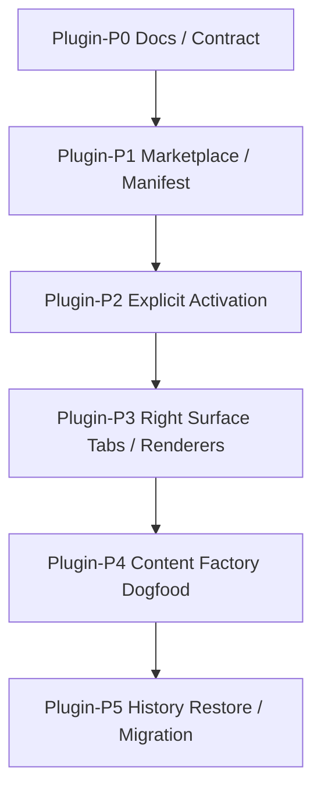

# Lime 插件实施计划

更新时间：2026-06-27
状态：第一轮骨架收口

## 1. 执行原则

1. 先标准后实现：先把 plugin / marketplace / rightsurface 的 contract 写清，再落实现。
2. 先显式后推断：优先做显式激活，不恢复语义猜测。
3. 先服务端骨架后客户端细化：LimeCore 先给出 marketplace 只读目录，Lime 再接本地安装态和显式激活。
4. 先 Host 后业务：先把右栏、tab、恢复、权限与 fallback 做成 Host 能力，再让插件挂载。
5. 先通用后专属：document、imageGrid、storyboard、checklist 先用 host builtin renderer。
6. 先历史恢复再增强交互：先保证打开历史可继续工作，再做复杂编辑器和多步工作流。
7. 先内容工厂闭环：以内容工厂插件验证完整链路，不同时推太多业务插件。

## 2. 开发切片总览



## 3. P0：文档与 contract

### 写集

| 仓库     | 文件                                                             |
| -------- | ---------------------------------------------------------------- |
| LimeCore | LimeCore 外仓 plugin roadmap / control-plane 文档                |
| Lime     | `internal/roadmap/plugin/**`、`internal/roadmap/workbench/v4/**` |

### 验收

- plugin 路线图完整，包含 PRD、架构、technical baseline、contract、实施计划、历史恢复。
- workbench/v4 路线图完整，清楚表达 工作台应用 是插件内独立 UI 能力。
- 与 `rightsurface` 路线图边界清晰，不再写成两个右栏。
- 内容工厂被明确为插件 dogfood，不再和 `旧内容工作台` 代码绑定。
- 服务端 marketplace 边界落到 LimeCore，不在 Lime App Server 新增 marketplace JSON-RPC。

## 4. P1：Marketplace / Manifest / Registry

### 目标

- 以上游插件 / 市场模型为参照，建立插件 manifest 与 marketplace item 的 current contract。
- 从 LimeCore `client/plugins/marketplace` 获取 available plugin listing。
- 让插件、工作台应用、skills、connectors、renderers、activation entries 同时可投影。
- 形成统一 registry，供插件中心和右侧面板消费。

### 验收

- manifest normalizer 能输出统一 plugin contract。
- 缺少必要字段时 fail closed。
- registry 可区分可安装、可激活、可渲染和只读历史四种状态。
- 工作台应用 catalog 只作为迁移输入，不作为插件 marketplace 设计模板。

## 5. P2：显式激活

### 目标

- composer 增加插件 chip。
- 支持 `@插件` / `@插件:技能`。
- session metadata 保存当前激活上下文和右侧 tab 状态。

### 验收

- 普通对话不会自动扫描插件并切换上下文。
- 历史恢复时不会重新猜插件。
- 激活状态可跨会话恢复，但不会自动重新执行危险 action。

## 6. P3：Right Surface Renderer

### 目标

- 建立插件产物 tab。
- 先落通用 renderer：document、imageGrid、storyboard、checklist。
- 再接入复杂插件自定义 pane。
- 直接复用现有 `rightsurface` 的单 dock、多 tab 能力，不再新增第二右栏。

### 验收

- 右侧能恢复历史产物。
- 右侧能对产物发起受控 action。
- 右侧 panel 只作为 plugin workspace，不抢中间 Claw。

## 7. P4：内容工厂插件重建

### 目标

- 重建内容工厂插件 contract。
- 只参考业务，不复用旧 `旧内容工作台` 代码。
- 先跑通文章、图片、视频脚本的最小闭环。

### 验收

- Claw 中间是运行过程。
- 右侧是可编辑产物。
- 历史恢复后可继续生成或编辑。

## 8. P5：历史恢复 / 迁移

### 目标

- 把历史对话、插件上下文、主产物和 tab 状态统一到 session read model。
- 旧 工作台应用 中无法迁移的入口下架。
- 旧 right surface 写死逻辑逐步替换为插件 contract。

### 验收

- 新能力只从插件主路径进入，不继续扩张旧 compat。
- 旧内容工厂相关历史记录能至少只读浏览。
- 文档、测试和 GUI smoke 同步收口。

## 9. 写集建议

| 模块            | 文件建议                                              | 说明                                                              |
| --------------- | ----------------------------------------------------- | ----------------------------------------------------------------- |
| Plugin Center   | `src/features/plugin-center/*`                        | 消费 LimeCore marketplace、展示插件列表、详情、安装、启用和卸载。 |
| Manifest        | `src/features/plugin/manifest/*`                      | manifest normalizer、contract gate、readiness。                   |
| Activation      | `src/components/agent/chat/workspace/*`               | composer chip、`@` 命令、session activation context。             |
| Right Surface   | `src/components/agent/chat/workspace/right-surface/*` | tab、pane、history restore 和 action router。                     |
| Content Factory | `src/features/plugin-content-factory/*`               | 内容工厂 dogfood 的具体对象、任务和 renderer。                    |

## 10. 验证

```bash
npm run test:contracts
npm run verify:gui-smoke
```

GUI 关注点：

1. 安装插件后能进入显式激活。
2. 右侧 tab 能恢复主产物和选中对象。
3. 插件 action 只能经由 runtime 回流。
4. 旧内容工厂历史至少能只读浏览。

## 11. 进度记录

### 2026-06-25 P1 Manifest / Registry 纯函数基座

- 新增 `src/features/plugin/manifest/*`，建立插件根对象的 `PluginManifest -> PluginContract` current contract。
- 新增 `buildPluginContractFromAgentAppManifest(...)`，把现有 工作台应用 v3 manifest 作为插件输入来源之一，投影出插件、工作台应用 子能力、显式激活入口、artifact renderer、history restore 和 Right Surface contract。
- 新增 `projectPluginRegistryItem(...)` / `projectPluginRegistry(...)`，先用纯函数区分 `installable`、`activatable`、`renderable`、`read_only_history` 四类状态。
- 复用 `agent-app/host` 的唯一 Right Surface / productProfile contract，不新增第二右栏或业务自有 dock。
- 当前尚未接入插件中心 GUI、composer chip、`@插件` 选择器或 App Server JSON-RPC；这些仍属于 P2 / P3 后续主线。

### 2026-06-25 P2 显式 `@插件` 发送接线

- 新增 `src/components/agent/chat/workspace/workspacePluginActivation.ts`，从已安装 工作台应用 state 投影插件 contract / registry，再复用 `buildPluginActivationMentionCatalog(...)` 和 `parsePluginActivationMention(...)` 解析显式 `@插件`。
- `useWorkspaceSendActions` 发送前先解析显式插件激活，命中后写入 `requestMetadata.harness.plugin_activation`，设置 task preference，禁用搜索偏航，并继续走 `Agent -> turn/start` 主线。
- disabled / blocked 插件显式 `@` 时 fail closed，不降级成普通消息；自然语言 工作台应用 intent 仍只消费 enabled installed apps。
- 当前 metadata 已能到达发送参数，但还未接 App Server prompt 投影、composer chip、插件中心 GUI 或右侧 tab 恢复。

### 2026-06-25 服务端 marketplace 边界纠偏

- 服务端 marketplace 事实源调整到 LimeCore 外仓 plugin roadmap 与 LimeCore control-plane。
- Lime 客户端路线图按上游插件与市场口径重建；旧 工作台应用 实现只作为迁移输入，不作为插件 marketplace 设计模板。
- Lime App Server 继续只消费 `requestMetadata.harness.plugin_activation` prompt context，不新增 marketplace 查询、安装或发布接口。

### 2026-06-25 服务端 marketplace 骨架

- LimeCore 已新增 `GET /api/v1/public/tenants/{tenantId}/client/plugins/marketplace` 受保护只读接口，返回 `plugin-marketplace/v1`、`pluginKey`、install/auth policy、manifest summary 和 package ref。
- LimeCore P0 仍以 工作台应用 catalog / release / tenant enablement 作为兼容输入，但输出模型是 plugin-centered；blocked / registration-required 状态不下发 package ref。
- LimeCore 已同步 OpenAPI source fragments、`packages/types` 与 `packages/api-client`，并在服务端文档增加架构图、接口时序图、投影流程图、骨架流程图和验证时序图。
- Lime Desktop 尚未消费新 API；下一刀应在 `src/features/plugin` 或插件中心客户端层接入 marketplace fetch，再合并本地 installed registry。

### 2026-06-26 服务端原生 Plugin 管理骨架同步

- LimeCore 已将原生 Plugin catalog / release / tenant enablement 从内部 service 写入推进到受控 HTTP 管理骨架。
- 平台侧新增 `GET/POST /api/v1/platform/plugins` 与 `GET/POST /api/v1/platform/plugins/{pluginName}/releases`，租户侧新增 `GET/POST /api/v1/partners/{partnerId}/tenants/{tenantId}/plugins/enablements`。
- LimeCore OpenAPI source fragments、`packages/types`、`packages/api-client` 与 JS 镜像已同步最小 create/list contract。
- Lime 客户端当前仍只消费 `client/plugins/marketplace` 只读投影；不新增 Lime App Server marketplace JSON-RPC，不恢复旧插件安装 / RPC 命令族。
- 下一刀应在服务端骨架验证稳定后，再决定是否细化 update/delete/revoke、安装态写回或原生插件运行；客户端侧继续保持显式激活和本地 installed registry 边界。

### 2026-06-26 服务端原生 Plugin HTTP 骨架验证闭环

- LimeCore platform 插件 catalog / release 路由已接入平台治理授权白名单，platform operator 可执行最小 create/list 管理流。
- Partner operator 仅按现有平台目录口径只读访问 plugin catalog / release list；写操作仍不下放到客户端或 partner 路径。
- LimeCore route test 已覆盖通过 HTTP 创建原生 catalog、ready release 和 tenant enablement 后，客户端 `client/plugins/marketplace` 返回 `plugin_catalog` 来源 item。
- 本轮仍不新增 Lime App Server marketplace JSON-RPC、不恢复旧插件命令族；Lime 客户端继续只消费只读 marketplace 投影和本地 installed registry。

### 2026-06-26 服务端原生 Plugin 发布生命周期骨架同步

- LimeCore 已补齐原生 plugin catalog update、release update / revoke、tenant enablement update 的 HTTP 管理骨架和 SDK contract。
- 租户 enablement 创建 / 更新现在要求 catalog active 且 release ready；release revoke 后，Lime 客户端只读 marketplace 不再看到该原生 plugin item。
- 该切片只完善服务端 marketplace 发布后台生命周期，不新增 Lime App Server marketplace JSON-RPC、不恢复旧插件安装 / RPC 命令族、不让客户端写服务端安装态。
- 下一刀应聚焦灰度规则、注册授权写流、后台审计，或客户端 app-declared renderer / 自定义 pane 的更完整输出 contract。

### 2026-06-26 服务端原生 Plugin 注册授权写流同步

- LimeCore 已新增客户端原生 plugin 注册码提交接口：`POST /api/v1/public/tenants/{tenantId}/client/plugins/{pluginName}/registration`。
- 原生 plugin enablement 现在可持久化注册码 hash、激活状态、失败次数、短时锁定和过期时间；明文注册码只在后台 create/update 请求进入服务层后转 hash。
- 客户端提交正确注册码后，LimeCore 返回刷新后的 `PluginMarketplaceListResponse`；注册前 item blocked 且不下发 package ref，注册成功后 item available 并下发 package ref。
- 该切片仍不新增 Lime App Server marketplace JSON-RPC、不恢复旧插件命令族、不让客户端写服务端安装态；Lime 客户端后续只需把 `plugin_catalog + ON_INSTALL` 从 Agent App 注册 API 切到该 SDK 方法。
- 下一刀应聚焦客户端注册授权分流、灰度规则、后台审计，或 app-declared renderer / 自定义 pane 输出 contract。

### 2026-06-25 路线图追踪入口

- `.gitignore` 已为 `internal/roadmap/plugin/**` 增加精确例外，插件路线图、图表和实施计划不再被忽略。
- 该例外只放开 plugin 目录，没有放开整个 `internal/roadmap/**`。

### 2026-06-25 P1 Marketplace 客户端消费骨架

- `src/lib/api/oemCloudControlPlane.ts` 新增 `getClientPluginMarketplace(...)`，从 LimeCore `client/plugins/marketplace` 读取 `plugin-marketplace/v1`，并对 schema、policy、状态和 package ref 做 fail-closed 解析。
- `src/features/plugin/marketplace/*` 新增 marketplace DTO 与投影纯函数，把 LimeCore listing 转成 `PluginContract` / `PluginRegistryProjectionInput` / `PluginRegistryItem`。
- `PluginContract.provenance.sourceKind` 新增 `plugin_marketplace`，使 marketplace 目录成为插件 contract 的 current 输入来源之一。
- registry 投影新增 `installable` 与 `blockerCodes` 输入，确保云端 blocked / `NOT_AVAILABLE` item 不会被误展示成可安装插件。
- 当前仍不接插件中心 GUI，不恢复旧 `get_plugins` / `plugin_rpc_*` 命令，也不新增 Lime App Server marketplace JSON-RPC。

### 2026-06-25 P1 Installed Registry 合并骨架

- `src/features/plugin/marketplace/pluginMarketplace.ts` 新增 `projectPluginMarketplaceInstalledKeysFromAgentApps(...)`，把 current `InstalledAgentAppState[]` 投影成 marketplace plugin 的 `installedPluginKeys`、`enabledPluginKeys`、`disabledPluginKeys` 和 hash mismatch blocker。
- installed 判定必须同时匹配 `appId`、`packageHash` 与 `manifestHash`；hash 不一致时 fail closed，不把旧 工作台应用 包误认成当前 marketplace 插件。
- 新增 `projectPluginMarketplaceRegistryInputsFromInstalledAgentApps(...)` / `projectPluginMarketplaceRegistryFromInstalledAgentApps(...)`，供后续插件中心 GUI 和显式激活直接复用统一 registry 投影。
- blocked marketplace item 仍由云端 policy / readiness blocker 控制；本地 disabled 只表达用户关闭态，不替代云端可用性判断。
- 当前仍不接安装按钮、卸载流程、composer chip 或 Right Surface tab；这些继续作为 P2 / P3 后续切片。

### 2026-06-25 P1 Marketplace Registry Loader 骨架

- 新增 `src/features/plugin/marketplace/marketplaceRegistryLoader.ts`，用 feature 层 loader 组合 LimeCore `getClientPluginMarketplace(...)` 与 App Server current `listInstalledAgentApps()`，避免继续向已超 1000 行的 `oemCloudControlPlane.ts` / `agentApps.ts` 追加业务逻辑，也避免 `src/lib/api` 反向依赖 `features`。
- `loadPluginMarketplaceRegistry(...)` 返回 `marketplace`、`installed`、`projectionInputs` 与统一 `registry` snapshot，后续插件中心 GUI / 显式激活可直接消费同一份投影。
- loader 不新增 Electron IPC、App Server JSON-RPC、DevBridge mock 或旧插件中心命令；只是组合现有 current 网关。
- installed state persistence issues 会原样透出给上层展示 / 诊断，hash mismatch 继续由 `PLUGIN_INSTALLED_PACKAGE_MISMATCH` fail closed。
- 当前仍不触发安装 / 卸载 / enable 写操作，不恢复旧 `list_installed_plugins`、`install_plugin_*`、`plugin_rpc_*` 命令族。

### 2026-06-25 P1 插件中心只读 View Model 骨架

- 新增 `src/features/plugin/marketplace/pluginMarketplaceViewModel.ts`，把 registry snapshot 投影成只读插件中心列表模型，包含 item、filter counts、installed persistence issue count、主操作 stable label key 与 blocker 摘要。
- view model 支持 `query`、`category`、`statusFilter` 和 `sort`，供后续 GUI 层直接消费，不在组件里重复筛选逻辑。
- 当前没有把 `plugins` 接回左侧栏或路由；现有导航仍会过滤旧 `plugins` 设置入口，避免和已下线旧插件中心命令族混淆。
- 主操作目前只是 `install / enable / open / view_history / blocked` 的只读投影，不触发写操作、不新增 i18n 资源、不恢复旧插件安装 / RPC 命令。

### 2026-06-25 P1 Marketplace Registry Hook 骨架

- 新增 `src/features/plugin/marketplace/usePluginMarketplaceRegistry.ts`，把 `loadPluginMarketplaceRegistry(...)` 与只读 view model 组合成 React controller，负责 `loading`、`error`、`snapshot`、`model` 与 `refresh`。
- hook 支持 `autoLoad`、依赖注入、marketplace query 规范化和 view options 更新；view options 变化只重建本地模型，不重复请求 LimeCore marketplace。
- 异步加载使用 request sequence fail-closed，较旧 refresh 结果不会覆盖较新的 marketplace snapshot；`refresh()` 失败会更新 error state 并向调用方抛出原始错误。
- 当前仍不接路由、不接 GUI、不触发安装 / enable / 卸载写操作，也不恢复旧 `get_plugins`、`list_installed_plugins`、`install_plugin_*` 或 `plugin_rpc_*` 命令族。

### 2026-06-25 P2 App Server Plugin Activation Prompt 骨架

- App Server `runtime_backend/plugin_activation_context.rs` 已消费 `requestMetadata.harness.plugin_activation` / `pluginActivation`，把显式插件激活转成 `<plugin_activation_context>` system prompt block。
- prompt context 只表达本 turn 的显式路由上下文、plugin id、entry、selected object、opened tabs 和来源；不打开 `allow_model_skills`，也不允许模型从自然语言重新猜测或切换插件。
- `session_config_from_request(...)` 已在 agent skills context 后追加 plugin activation context，使前端 `@插件` metadata 进入 RuntimeCore current turn/start 主链。
- 当前仍不在 Lime App Server 新增 marketplace 查询 / 安装 JSON-RPC；服务端 marketplace 事实源仍是 LimeCore control-plane。

### 2026-06-26 P4 Product Profile Action Runtime Prompt 骨架

- `WorkspaceProductProfileSurface` 发起的 action 已通过 `submitWorkspaceProductProfileActionIntent(...)` 回流到 Claw turn/start 主链，并继续携带 `right_surface_product_profile`、object ref、action key、risk、task kind 和 source artifact ids。
- Product Profile action 发送参数已补 `systemPromptOverride`，明确本轮来自右侧产物 action，要求 runtime 执行业务 action，而不是降级为普通聊天、插件搜索或 Skill 链路。
- 内容工厂 action prompt 已声明结构化产物应进入 `artifact.snapshot`，并产出可被 Product Workspace / right surface 投影的 `content_factory.workspace_patch`。
- action turn 已显式禁用搜索偏航；metadata 仍由发送层合并进 `requestMetadata.harness`，继续复用 App Server read model 的 action history 投影。
- App Server read model 定向测试已覆盖 Product Profile action turn 产出 `content_factory.workspace_patch` 后，同步更新 Product Workspace 选中对象、worker evidence、派生 artifact document 和 action history result artifacts。
- 当前只完成 action -> runtime prompt / metadata -> workspace patch read model 投影骨架，尚未完成真实 worker 执行、失败态回填或自定义 pane action executor。

### 2026-06-26 P4 内容工厂 Action Result GUI Fixture 骨架

- `claw-chat-current-fixture` 的内容工厂 Product Profile 场景已追加 action-result runtime event，模拟右侧图片组重新生成 action 写回 `content_factory.workspace_patch`。
- fixture 通过 App Server `agentSession/runtimeEvents/append` 追加 `artifact.snapshot`，继续验证 current read model / Product Profile 投影，不走模型 turn，也不恢复旧插件 RPC 或本地 mock fallback。
- 场景断言已覆盖重新生成后的 image object ready 状态、summary、preview artifact、worker evidence，以及源 workspace patch 与派生 artifact document 同时进入 read model artifact 列表。
- 该切片只证明 action result workspace patch 能从 App Server read model 投影到 GUI fixture 骨架；真实 worker executor、失败态回填和自定义 pane action executor 仍未完成。

### 2026-06-26 P4 内容工厂 Worker Contract 骨架

- 新增 `contentFactoryWorkerContract` 纯模型，从内容工厂 manifest 投影 worker entrypoint、contract path、sample request path、task kinds、输出 artifact kind 和 Product Workspace 输出约束。
- 新增 `buildContentFactoryWorkerRequest(...)`，为后续 action executor / App Server worker adapter 生成标准 worker request，包含 session、turn、task、prompt、action key、source object ref、runtime 限制和 expected output。
- worker request 对未知 task kind、缺少必填字段、runtime blocker、直接 provider / filesystem access 或非 `content_factory.workspace_patch` 输出 fail closed。
- 该切片不执行 worker、不新增 App Server JSON-RPC、不接 GUI、不恢复旧插件 RPC；它只把真实 worker dogfood 前的输入 / 输出 contract 固定下来。

### 2026-06-26 P4 内容工厂 Runtime Package 落盘骨架

- 新增 `src/features/agent-app/fixtures/app.runtime.yaml`、`examples/runtime-request.sample.json` 和 `src/runtime/content-factory-worker.mjs`，让内容工厂 manifest 声明的 worker entrypoint、contract path 与 sample request 不再是缺文件引用。
- worker skeleton 只接收标准 request，校验 `content-factory.worker-request.v1`、task kind、runtime 限制和 `content_factory.workspace_patch` 输出约束；失败时返回结构化错误，不直连 provider、不直接访问文件系统。
- worker skeleton 成功时返回 `artifact.snapshot`，metadata 同时带 `contentFactoryWorkspacePatch` 与 `workspace_patch`，可被当前 Product Profile / Workspace Patch 解析链消费。
- `contentFactoryWorkerContract.unit.test.ts` 已覆盖 runtime package 文件存在、sample request 与 request builder 对齐，以及 worker CLI 输出可反投影为右侧 Product Profile。
- App Server `agent_app_task_runtime` 已补就近单测，证明声明 worker 但 entrypoint 缺文件会触发 `TASK_RUNTIME_WORKER_ENTRYPOINT_NOT_FOUND`，entrypoint 文件存在时 readiness blocker 清空。
- 该切片仍不接真实 executor、不写 session read model、不执行模型调用、不新增 marketplace / plugin 运行 JSON-RPC；它只把后续 worker adapter 的可落盘包骨架补齐。

### 2026-06-26 P4 App Server Worker Adapter 内部骨架

- 新增 App Server 内部 `agent_app_worker_runtime` adapter，可用 `AgentAppTaskRuntimeContract + package root + worker request` 执行本地 worker entrypoint，并把 worker response 投影为 `artifact.snapshot` RuntimeEvent。
- adapter 校验 task runtime readiness blocker、禁止 direct provider / filesystem access、限制输出 artifact kind、清理敏感环境变量、设置超时、限制 stdout 大小，并拒绝非 completed / 无 artifact snapshot 的 worker 响应。
- adapter 不新增 JSON-RPC method、不接 marketplace、不恢复旧插件 RPC；它只是后续 Product Profile action executor / task executor 可调用的 App Server current 内部能力。
- worker response 中的 inline `content` 在无 sidecar root 时仍会从 RuntimeEvent 投影移除，避免把正文塞进 event payload；配置 sidecar root 时会保留到 append 阶段，并由现有 artifact sidecar 链持久化。
- 定向测试已覆盖 worker skeleton 执行、artifact snapshot 投影到 session read model、runtime blocker fail closed、timeout kill，以及 `artifact/read include_content` 可从 sidecar 读回 worker 正文。
- 临时 `dead_code` 允许只限该 adapter 模块；退出条件是接入 Product Profile action executor 后移除该允许并由生产路径调用。

### 2026-06-26 P4 Product Profile Action Worker 接线骨架

- App Server `agentSession/turn/start` 已按 Product Profile action metadata 做条件分流：仅当 `right_surface.productProfile` 且 `agent_app.source=right_surface_product_profile` 且 `appId=content-factory-app` 时，才从 installed Agent App state 读取 runtime package 并执行 worker adapter。
- 该接线不新增 marketplace JSON-RPC、不恢复旧插件 RPC，也不把普通 turn 改成 worker；未命中 metadata 或本地未安装内容工厂应用时，turn 仍走原 backend。
- worker 接管前会先确认本地 installed state；未安装不会写入 `turn.accepted` / `runtime.error` / `turn.failed`，避免普通 read model fixture 或未安装环境被误判为 worker 失败。已安装但 disabled、runtime blocker 或 worker 执行失败仍 fail closed。
- worker adapter 已给 `artifact.snapshot` metadata 补 `agentAppWorker` 运行证据，Product Workspace read model 可投影 worker evidence，action history 可显示 completed / failed 状态。
- Agent App runtime package 路径解析已从 UI runtime lifecycle 大文件收敛到 `agent_app_task_runtime`，供 UI runtime status 与 worker turn executor 复用，避免继续扩大中心文件。
- 已移除 `agent_app_worker_runtime` 的临时 `dead_code` 允许；生产路径现在通过 Product Profile action turn 调用 adapter。
- 定向测试覆盖 Product Profile action turn 从 installed state 找到 worker、执行内容工厂 skeleton、写回 `artifact.snapshot`、完成 turn，并在 session read model 中物化 Product Workspace、worker evidence 和 action result；同时覆盖未安装时不接管 turn 的回归。
- 仍未完成：真实发布包签名门禁、自定义 pane action executor 和完整内容工厂 worker dogfood GUI 证据。

### 2026-06-26 P4 Product Profile ArtifactDocument 派生细化骨架

- App Server `product_profile_artifact_document_projection` 已把内容工厂 `content_factory.workspace_patch` 中的图片生成组、视频分镜和交付检查清单派生成稳定 `artifact_document`。
- 派生 document 与 artifact summary 统一写入 `surfaceKind` / `layout`，右侧通用 renderer 可按 `imageGrid`、`storyboard`、`checklist` 选择宿主内置展示面。
- 新增就近 read model 测试覆盖 `artifact/read include_content`，确保历史恢复和 source-backed preview 能读回图片 URL、分镜 markdown 和 checklist 状态。
- 该切片只细化 App Server read model 派生，不新增 marketplace JSON-RPC、不恢复旧插件 RPC，也不实现自定义 pane action executor。

### 2026-06-26 P4 Product Profile 通用 Renderer Dogfood 骨架

- 前端 Product Profile preview artifact 与 App Server 派生 document 对齐，统一在顶层 metadata、`productProfile` 和 `artifactDocument.metadata.productProfile` 写入 `surfaceKind` / `layout`。
- `WorkspaceProductProfileSurface` 组件回归已覆盖从同一右侧面板切换到视频分镜和交付检查清单，并渲染宿主内置 `storyboard` / `checklist` 预览分支。
- 内容工厂 Product Profile GUI fixture 已扩展为文章、图片、视频分镜、交付检查清单 4 类对象，真实 GUI smoke 断言 `contentFactoryProductProfileRendererArtifactsProjected=true`，并确认分镜 / 清单 artifact document 带 `storyboard` / `checklist` surface。
- `claw-chat-current-fixture-scenario-assertions.mjs` 已把内容工厂断言拆到独立小模块并降到 1000 行以下；`claw-chat-current-fixture-content-factory-product-profile.mjs` 已进入 800 行预警，后续继续扩展应拆出 workspace patch builder / read-model summary helper。
- 该切片只证明宿主通用 renderer dogfood 闭环，不实现自定义 pane action executor、编辑器或新的 marketplace 写接口。

### 2026-06-26 P4 Product Profile Worker 失败分类 / 重试元数据骨架

- App Server Product Profile worker 失败事件已补 `errorCode`、`failureCategory`、`retryable`、`retryAdvice`、`retryAttempt` 和 `retryMaxAttempts`，覆盖 disabled、runtime blocker、unsupported contract、timeout、worker output invalid、runtime unavailable 与 unknown。
- Product Workspace read model 已把上述字段投影到 `workerEvidence`；字段同时兼容 RuntimeEvent payload 与 `agentAppWorker` metadata 来源。
- 前端 Product Profile worker evidence 模型和右侧“运行记录”已展示失败类型与重试建议，并补齐五语言 presentation 文案；不可重试时不展示无意义的 `0/0` 次数。
- 内容工厂 Product Profile fixture 已把失败 worker evidence 写入 summary，真实 GUI smoke 断言 `contentFactoryProductProfileWorkerFailureEvidence=true`，read model summary 中可见 `failureCategory=worker_output`、`retryable=false`、`retryAdvice=inspect_worker_output`。
- 该切片只落失败分类与重试建议元数据，不自动重试、不新增公开 worker/run API、不新增 marketplace JSON-RPC；自动重试执行已在后续条目补齐。

### 2026-06-26 P4 Product Profile Worker 自动重试 executor 骨架

- App Server Product Profile worker turn 已把 retryable failure 元数据接成真实自动重试 executor：首次可重试失败只发内部 `agent_app_worker.retry` event，不写 `runtime.error`，避免 turn 被提前置为 failed。
- retry 预算仍由失败分类统一控制，当前自动重试一次；重试成功后继续写入 worker `artifact.snapshot` 和 `turn.completed`，最终失败才写 `runtime.error` / `turn.failed`，并带最终 `retryAttempt`。
- Product Workspace read model 已把 `agent_app_worker.retry` 投影为 worker evidence，保留 `errorCode`、`failureCategory`、`retryAdvice` 和重试次数；action history 在重试成功时保持 completed，不被中间 retry event 污染。
- 新增定向测试覆盖“首次 `WORKER_RETRYABLE` 失败后重试成功”和“连续可重试失败后按预算停在 failed”两条路径。
- 该骨架不新增公开 worker/run API、不新增 marketplace JSON-RPC、不恢复旧插件 RPC；完整内容工厂 worker dogfood GUI 证据、发布包签名门禁和自定义 pane action executor 仍是后续缺口。

### 2026-06-25 P2/P3 Plugin Activation Metadata 反投影骨架

- `workspacePluginActivation` 新增 `extractWorkspacePluginActivationFromRequestMetadata(...)`，从 `requestMetadata.harness.plugin_activation` / `pluginActivation` 反投影 `PluginActivationContext`。
- 反投影 helper 同时兼容 snake_case 与 camelCase 字段，字段不完整时返回 `null`，不在组件里散落 raw JSON 解析。
- 该 helper 只作为后续 Workspace 页面接 P3 pending intent / P5 history restore 的数据提取骨架；当前不接 `AgentChatWorkspace.tsx`，不改变发送行为。
- App Server prompt 解析与前端反投影保持同一字段口径，避免后续右栏接线时再次定义第二套 `plugin_activation` 形状。

### 2026-06-25 P2/P3 Installed 工作台应用 投影复用骨架

- 新增 `src/features/plugin/installed/installedAgentApps.ts`，把 current `InstalledAgentAppState[]` 投影成 `PluginContract[]`、`PluginRegistryProjectionInput[]` 与 `PluginRegistryItem[]`。
- `workspacePluginActivation` 已改为复用 feature 层 installed projection，组件层不再私有维护 工作台应用 -> plugin contract / registry 转换。
- 投影对坏 manifest fail closed，并返回 `skippedAppIds`，后续插件中心、右栏 pending 和历史恢复可复用同一份本地 installed plugin 来源。
- 当前仍不接插件中心 GUI、不接 `AgentChatWorkspace.tsx` 页面参数、不触发安装 / enable / 卸载写操作，也不恢复旧插件中心命令族。

### 2026-06-25 P2/P3 Workspace Plugin Runtime Context 组合骨架

- 新增 `workspacePluginRuntimeContext`，把 `requestMetadata` 中的 `plugin_activation` 与 installed 工作台应用 投影出的 `PluginContract[]` / `PluginRegistryItem[]` 组合成 Workspace 可消费的插件运行上下文。
- 输出 `inactive / active / blocked` 三态，保留 `activationContext`、`contracts`、`registry`、`skippedAppIds` 与 blocker codes，后续页面只需把该 projection 接给 P3 pending hook。
- metadata 指向未安装插件、禁用插件或 registry 缺失时 fail closed 为 `blocked`，不把激活上下文默默降级成普通对话或自动执行插件 action。
- 当前仍不接 `AgentChatWorkspace.tsx`，不读取桥、不发请求、不触发 UI；它只是页面接线前的数据抽取骨架。

### 2026-06-25 P3 Right Surface Pending Intent 纯投影骨架

- 新增 `workspacePluginRightSurfaceProjection`，把 `PluginActivationContext + PluginContract.rightSurface` 投影为现有 Workspace Right Surface runtime pending intent。
- `buildWorkspaceRightSurfaceRuntimePendingIntents(...)` 支持可选 `pluginActivationContext` / `pluginContracts`，默认不传时保持原有 harness / file / objectCanvas 行为。
- 显式插件激活会生成 `productProfile` background intent，后续 GUI 只需消费既有 right-surface runtime pending queue；不新增第二右栏，不直接挂载插件 UI。
- 当前仍未把该 intent 接入 Workspace 页面状态，也不触发插件 action、renderer 执行或历史恢复写入。

### 2026-06-25 P3 Right Surface Pending Runtime Hook 骨架

- `useWorkspaceRightSurfacePendingRuntime(...)` 已支持可选 `pluginActivationContext`、`pluginContracts` 与 `pluginRightSurfaceIntentTtlMs`，可把插件激活 pending intent 与 App Server / file / objectCanvas pending intent 合并进现有 runtime pending queue。
- hook 默认使用稳定空数组，未传插件参数时不改变现有 Workspace 行为，也避免默认数组导致 `useMemo` 抖动。
- 已补 Hook 与 projection 定向测试，覆盖 App Server pending 为空时显式插件激活仍能生成 `productProfile` pending intent。
- 当前 `AgentChatWorkspace.tsx` 尚未传入这些插件参数，不接 GUI、不触发 renderer，不声明右栏自动打开已完成。

### 2026-06-25 P5 历史恢复纯投影骨架

- 新增 `src/features/plugin/history/pluginHistoryRestore.ts`，把 `PluginHistoryRestoreSnapshot + PluginContract + PluginRegistryItem` 投影为历史恢复结果。
- 投影输出 `restored / artifact_preview / chat_only`、`activationContext`、选中对象、主对象、打开 tab、action mode 与 blocker codes，后续 Workspace 可按该结果接入 Right Surface pending intent。
- 插件缺失、workspace 缺失、history restore 关闭时 fail closed，并按 contract 降级到 artifact preview 或 chat only，不猜测插件、不重新执行 action。

### 2026-06-26 P3 插件右栏占位 Product Profile 骨架

- 新增 `workspacePluginProductProfile` 纯投影，把显式插件激活或历史恢复出的 `PluginActivationContext + PluginContract` 转成最小 `WorkspaceProductProfile`。
- 当 App Server pending product workspace 与历史 read model 还没有真实产物时，Workspace 可用该占位 profile 打开现有 Right Surface `productProfile` 面板，避免右栏 tab 不出现。
- 占位 profile 只包含 draft 对象、layout state、source artifacts 和空 action / worker evidence，不触发 renderer action、不写 session read model、不新增 marketplace JSON-RPC。
- contract 缺失、右栏 product workspace 未启用、对象 kind 无法解析时 fail closed；插件显示名为空时回落到 plugin id，避免右栏对象名称为空导致不可识别。
- `AgentChatWorkspace.tsx` 已是超大主路径文件，本轮只做最小接线；P3 后续继续扩展右栏插件逻辑时，应把激活上下文选择、占位 profile、pending intent 合并策略抽到 Workspace runtime 子模块后再追加复杂行为。

### 2026-06-26 P1/P2 插件中心 Open 到显式激活入口骨架

- `PluginMarketplacePage` 的已安装且可激活插件不再是死按钮；Open 会跳转到 Agent 新建任务首页，并预填 `@插件名 `。
- 该入口仍要求用户在 composer 中显式发送，发送后复用既有 `@插件` 解析与 `requestMetadata.harness.plugin_activation` 主链；不在插件中心直接执行插件、不新增安装 / 启用写操作。
- 安装、启用、blocked、只读历史类 action 继续 disabled，并保留只读 title，避免误导为已经支持 marketplace 写操作。
- 插件显示名为空时 Open 入口回落到 plugin id，保持和输入栏 / 右栏占位 profile 一致。

### 2026-06-26 P4 内容工厂插件 dogfood contract 骨架

- 新增 `src/features/plugin-content-factory/*`，把内容工厂作为插件 dogfood 的 current 领域入口，导出 contract、registry item 和显式激活 catalog。
- 当前仍从现有内容工厂 manifest 投影，但引用集中到 `plugin-content-factory`，后续 worker / renderer / 产物闭环不再散落读取旧 工作台应用 fixture。
- 已锁定内容工厂 MVP 对象与 host builtin renderer：文章草稿、图片生成组、视频脚本、视频分镜、交付检查清单，并固定右栏 `productProfile` / history restore contract。
- 该切片只完成 P4 contract 骨架，不代表文章、图片、视频脚本 / 分镜 worker 执行和编辑器闭环已经完成。

### 2026-06-26 P3 Workspace 插件右栏 pending 接线骨架

- 新增 `useWorkspacePluginRuntimeContext(...)`，只在存在显式 `plugin_activation` metadata 时读取已安装 工作台应用 state，并复用 installed plugin registry 投影出 `inactive / active / blocked` 运行上下文。
- `AgentChatWorkspace` 已把 active 插件运行上下文传入现有 `useWorkspaceRightSurfacePendingRuntime(...)`，由已有 pending intent 队列生成 `productProfile` 右栏意图；blocked / 读取失败时 fail closed，不生成右栏 pending intent。
- 该接线不新增 marketplace JSON-RPC、不触发安装 / 启用 / 卸载 / renderer action，也不恢复旧插件中心命令族；它只把 P2 显式激活 metadata 接到 P3 Right Surface pending 骨架。
- 当前仍未完成 composer chip、可视化插件选择器、历史恢复落页、通用 renderer 执行和内容工厂完整 dogfood。
- 插件已禁用或 registry 不完整时只恢复只读历史，继续 action 必须重新激活插件。
- 当前仍不接 `AgentChatWorkspace.tsx`、不写 session read model、不新增安装 / enable / 卸载写操作，也不恢复旧插件中心命令族。

### 2026-06-26 P2 Composer 插件 chip 骨架

- `useWorkspacePluginRuntimeContext(...)` 已支持 `preloadInstalled`，`AgentChatWorkspace` 会在无显式激活时也预加载已安装插件 registry，并投影成输入栏候选。
- 输入栏 `+` 菜单新增“插件”二级面板，用户选择插件后只把输入规范成 `@插件名 ...`，继续复用既有显式激活解析与发送 metadata 链路。
- 输入栏顶部新增插件 chip，可清除对应 `@插件名` 前缀；已禁用或 blocked 插件在选择面板中不可点击，并透出 blocker codes 给 UI 候选态。
- 插件入口即使暂无候选也保持可见，并打开空态面板，避免加号菜单只显示图标或不可读空行。
- 首页空态 composer 已复用同一份插件候选和选择器：`+` 菜单的“插件”行有稳定文案、可打开空态/候选面板，选择后写入 `@插件名 ...` 并显示可清除 chip。
- `InputbarPluginSelector` 对空 `displayName` 回退显示 `pluginId`，避免 registry 投影不完整时再次出现空名称。
- 该骨架不触发安装 / 启用 / 卸载写操作，不新增后端协议，不恢复旧插件中心命令族；它只补 P2 显式激活的人机入口。
- 后续仍需补 `@插件:技能` 可视化选择、插件中心详情到 composer 的联动入口、历史恢复落页和内容工厂完整 dogfood。
- 代码体量提醒：`EmptyState.tsx` 已超过 900 行，本轮只做必要 prop 透传；下一次继续扩展首页空态时应优先拆出插件 / 输入栏 runtime 接线模块，避免把新业务逻辑继续堆入该文件。

### 2026-06-26 P2 `@插件:技能` 输入栏选择骨架

- 输入栏插件候选已从 installed plugin contract 带出 `skills` 子项；主输入栏和首页空态的 `+ -> 插件` 面板都会在插件下展示技能子按钮。
- 选择插件技能时只写回 `@插件:技能 ` 前缀，并显示 `插件:技能` chip；后续发送继续复用既有 `parsePluginActivationMention(...)`，由 `requestMetadata.harness.plugin_activation.selected_skill_keys` 表达显式选择。
- disabled / blocked 插件或技能保持 fail closed，不写回输入、不自动发送、不触发插件 action。
- 该切片不新增 marketplace 写接口、不新增 App Server 协议、不实现技能执行、worker 调度、renderer action 或内容工厂业务闭环。
- 已补 `pluginInputCapability`、`workspacePluginInputSuggestions`、`Inputbar` 和 `EmptyStateComposerPanel` 定向回归。

### 2026-06-26 P5 历史恢复 pending 接线骨架

- 新增 `workspacePluginHistoryRestoreRuntime`，从 `threadRead.session_business_object_ref_metadata` 的 `plugin_history_restore` / `pluginHistoryRestore` 只读反投影 `PluginHistoryRestoreSnapshot`。
- `AgentChatWorkspace` 在没有显式插件激活时，会把 restored projection 的 `activationContext` 交给现有 `useWorkspaceRightSurfacePendingRuntime(...)`，复用同一套右栏 pending intent 队列。
- 显式激活优先级高于历史恢复；历史恢复只打开 pending 右栏上下文，不重新执行插件 action，不写 session read model，也不触发安装 / 启用 / 卸载。
- 当前仍未实现通用 renderer 挂载、插件自定义 pane 执行、历史恢复落页确认态和内容工厂完整 dogfood。

### 2026-06-26 P5 历史恢复可见落页骨架

- 新增 `workspacePluginHistoryRestoreLanding` 纯 view model，把历史恢复 projection 投影成 `interactive / read_only / artifact_preview / chat_only` 四种可见落页状态。
- 新增 `WorkspacePluginHistoryRestoreLandingCard`，在主对话 MessageList 前展示恢复状态、应用名、对象、交付内容数量和已恢复页签数量，避免用户从历史入口进入后只看到空对话或不可见右栏 pending。
- `AgentChatWorkspace` 已把历史恢复 projection 组合成落页卡片，并通过 `useWorkspaceConversationSceneRuntime` / `WorkspaceConversationScene` 的轻量 prop 透传到 leading content。
- 该落页只展示状态，不自动执行插件 action、不写 session read model、不触发安装 / 启用 / 卸载、不新增 marketplace JSON-RPC；右栏恢复仍复用既有 pending intent 主链。
- 文件体量风险：`WorkspaceConversationScene.tsx` 与 `useWorkspaceConversationSceneRuntime.tsx` 仍接近 1000 行，本轮仅做 prop 透传。下一次继续扩展历史恢复 / 右栏恢复时，应优先拆出 `workspaceHistoryRestoreSceneRuntime` 或 `workspaceLeadingContentRuntime`，再追加复杂逻辑。

### 2026-06-26 P5 历史交付内容预览骨架

- 新增 `workspacePluginHistoryRestoreArtifacts` 纯 view model，把历史恢复 projection 中的 `artifactRefs` 去重投影成可点击的交付内容预览项。
- `WorkspacePluginHistoryRestoreLandingCard` 已在落页内展示稳定的“交付内容 N”按钮；即使历史记录里的名称为空，按钮仍可见、可点击、不会出现空标题。
- 点击交付内容时，`AgentChatWorkspace` 构造 source-backed preview artifact，写入 `appServerSessionId / appServerArtifactRef` metadata，并交给现有 artifact workbench 打开链路。
- 正文读取继续复用 current `artifact/read` 与 `useWorkspaceArtifactPreviewActions`，不新增 Lime App Server marketplace JSON-RPC，不恢复旧插件命令族，也不新增第二套右栏。
- 当前仍只是历史交付内容可查看骨架：尚未实现历史会话选择、服务端历史列表、通用 renderer action、自定义 pane 执行和内容工厂完整 dogfood。

### 2026-06-26 P4 内容工厂交付包索引骨架

- 新增 `contentFactoryDeliveryPlan` 纯模型，从内容工厂 `PluginContract.artifactRenderers` 生成固定 MVP 交付部件：内容简报、文章草稿、图片生成组、视频脚本、视频分镜、交付检查清单。
- 该模型可直接生成 `WorkspaceProductProfile`，默认选中文章草稿，右栏初始只打开 `productProfile`，避免一次性打开空文件 / evidence / terminal / browser 等辅助 tab。
- 交付包对象已带稳定 artifact id、对象 kind、surface kind、required 标记和 checklist 占位项，可被现有 `buildWorkspaceProductProfileViewModel(...)` 消费，并能投影出文章草稿的右栏动作。
- 这仍是 P4 dogfood 骨架：不执行 worker、不写 session read model、不生成真实文章 / 图片 / 分镜，也不新增 App Server 协议。下一刀应把显式激活或内容工厂运行结果接到该 profile / workspace patch 主链。

### 2026-06-26 P4 内容工厂交付包 Workspace 接线骨架

- `buildWorkspacePluginProductProfileFromActivation(...)` 已对内容工厂插件走专用交付包 profile，显式激活内容工厂时不再只生成单个 `articleDraft` 占位对象。
- 真实 App Server pending product profile 与 session read model 仍优先，内容工厂交付包只作为 fallback 主链，避免覆盖 worker 已回填的真实产物。
- 该接线让内容工厂右栏可直接看到 6 个 MVP 交付对象，并复用现有 Product Profile surface / action projection；仍不自动执行 worker、不写 session read model、不新增协议。
- 下一刀应接 `content_factory.workspace_patch` 结果到 session read model 或 artifact snapshot，使这些占位对象被真实文章 / 图片 / 分镜 / 检查清单替换。

### 2026-06-26 P4 内容工厂 Workspace Patch 解析骨架

- 新增 `contentFactoryWorkspacePatch` 纯模型，专门解析内容工厂 worker / artifact 输出中的 `content_factory.workspace_patch`，并复用现有 `buildWorkspaceProductProfileFromUnknown(...)` 生成 `WorkspaceProductProfile`。
- 解析入口覆盖 `productWorkspace` / `product_workspace`、`workspacePatch` / `workspace_patch`、`contentFactoryWorkspacePatch`、`metadata`、`artifact.metadata` 和 artifact `content` JSON，保持与 App Server read model 投影 shape 一致。
- `useWorkspaceRightSurfacePendingRuntime(...)` 已在通用 Product Profile pending 解析失败时，用内容工厂 workspace patch 解析作为 fallback，因此 artifact metadata 包装的真实 worker 产物可以进入右侧 Product Profile。
- 解析要求 `appId === content-factory-app` 且能确定 `sessionId`，非内容工厂、坏 JSON 或缺 session 会 fail closed；source artifact / worker evidence 会从 pending artifact 元数据补齐，避免右栏丢失运行记录。
- 该切片仍不执行 worker、不写 artifact snapshot、不做历史会话选择、不实现 renderer action 或自定义 pane；它只把真实 workspace patch shape 接到客户端可消费的 Product Profile 主链。

### 2026-06-25 P1 Manifest Contract 阻塞修复

- 修复 `src/features/plugin/manifest/pluginContract.ts` 中 `normalizePluginManifest(...)` 的重复 `interfaceContract` 声明，消除插件契约 transform 阶段的直接编译错误。
- 重新运行 `src/features/plugin/**` 定向测试，8 个文件、31 个测试全部通过。
- `git diff --check` 在本次插件相关改动范围内通过，未引入新的格式问题。

### 2026-06-26 P1 插件中心只读页面壳

- 新增 `src/features/plugin/PluginMarketplacePage.tsx`，把 LimeCore marketplace registry snapshot 暴露成 current 插件中心只读 GUI，展示云端连接态、状态统计、搜索、分类、状态筛选、插件列表和 blocker 摘要。
- 一级侧边栏入口已从旧 工作台应用 管理语义切到 `plugins` 页面；旧 `agent-apps` / `agent-app` 路由继续保留为兼容运行页，不再作为插件主入口。
- 页面只消费 `usePluginMarketplaceRegistry(...)` 与现有 OEM cloud runtime context；搜索只重建本地 view model，不重复请求云端目录。
- 主按钮当前为只读状态投影，不触发安装 / enable / open 写操作，不恢复旧插件中心命令族。
- 新增五语言 `plugin.marketplace.*` 与 `navigation.sidebar.items.plugins` 文案，并补 `PluginMarketplacePage`、页面分发、侧边栏导航定向测试。

### 2026-06-26 P1/P2 Marketplace Install / Enable Action 骨架

- `PluginMarketplaceViewItem` 已保留 marketplace `package`、policy、release id、marketplace display name 和稳定 displayName fallback，避免后端空名称导致列表标题为空或按钮不可识别。
- 新增 `pluginMarketplaceActions` 纯 action helper，把插件中心 install / enable 分别接到 current `installCloudAgentAppRelease(...)` 与 `setAgentAppDisabled(...)`，不新增 Lime App Server marketplace JSON-RPC，也不恢复旧插件安装 / RPC 命令族。
- 安装动作只支持 `agent_app_release + AVAILABLE + ON_USE + 完整 packageUrl/packageHash/manifestHash + appId`；缺包、缺 appId、非 cloud release、`ON_INSTALL` 注册流未接入时 fail closed 并显示 blocker code。
- 启用动作只对已安装且 disabled 的 marketplace item 调用 `disabled:false`，成功后触发 Agent App changed event 并刷新 registry snapshot。
- `PluginMarketplacePage` 已允许 install / enable / open 三类主动作；进行中禁用按钮，action 失败显示页面内错误区，Open 仍只跳到 Agent 新任务并预填 `@插件名 `，不自动发送或执行。
- 五语言文案已从“待安装 / 待启用”改为真实动作“安装 / 启用 / 打开”，并新增 action pending、write action title 与 action error 标题。
- 该切片仍不实现卸载、注册授权、详情页、只读历史落页、package 发布后台、插件 renderer action 或内容工厂 worker 闭环。

### 2026-06-26 P1 插件中心详情面板骨架

- `PluginMarketplacePage` 已从纯列表升级为列表 + 详情双栏骨架：默认选中当前排序后的第一项，用户可点击“详情”查看单个插件。
- 详情面板展示插件标识、市场、版本、分类、安装策略、认证策略、本地应用标识、发布标识、package ref、blocker codes 和按当前 primary action 推导的下一步说明。
- 详情只消费现有 marketplace view item，不发网络请求、不触发安装 / 启用 / 打开，也不新增后端协议。
- 该骨架解决“列表按钮可点但用户不知道为什么 / 下一步是什么”的管理闭环缺口；注册授权、卸载、只读历史落页、renderer action 和内容工厂 worker 仍未完成。
- 已补组件回归覆盖默认详情、详情切换、package ref 展示和 disabled blocker 展示。

### 2026-06-26 P1/P2 插件中心本地管理骨架

- `pluginMarketplaceActions` 已把详情管理动作扩展到 `disable` 与 `uninstall_keep_data`，继续复用 current Agent App `setAgentAppDisabled(...)`、`previewAgentAppUninstall(...)` 和 `uninstallAgentApp(...)`，不新增 marketplace 写接口。
- 详情面板新增“本地管理”区：已安装且启用插件可禁用，已安装插件可执行保留数据卸载；禁用插件仍通过列表主动作启用，避免主路径按钮和管理动作混在一起。
- 卸载前增加确认提示，当前只支持 `keep-data`，不会触发真实数据删除、云端目录写入、插件运行或 renderer action。
- 卸载返回 blocked / failed 时 fail closed，只显示 blocker，不广播 installed state changed，也不把列表刷新当作成功。
- 已补 action 单测与组件回归覆盖禁用、卸载预演 + keep-data 卸载、取消确认、blocked fail closed 和刷新行为。
- 该切片补齐“已安装插件本地管理”骨架；注册授权 `ON_INSTALL`、只读历史落页、通用 renderer 挂载、自定义 pane 和内容工厂 worker / 编辑器闭环仍未完成。

### 2026-06-26 P1/P2 安装授权注册骨架

- `PluginMarketplacePage` 详情面板已对未安装且 `policy.authentication === "ON_INSTALL"` 的插件显示安装授权表单，提示用户先提交企业注册码再刷新安装状态。
- `submitPluginMarketplaceRegistrationCode(...)` 复用 current Agent App `submitAgentAppRegistrationCode(...)`，成功后只广播 installed app changed event 并刷新 registry，不新增 Lime App Server marketplace JSON-RPC，也不新增服务端 marketplace 写接口。
- 主安装动作对 `ON_INSTALL` 仍 fail closed，避免在服务端 marketplace 状态刷新前绕过授权直接安装；详情下一步文案会明确指向注册表单。
- 空注册码、缺少 `appId` 时 fail closed；注册码提交失败只显示页面内 action error，不自动安装、不执行插件 action、不写 session read model。
- 已补 action 单测与页面回归，覆盖注册 API 调用、空码不可提交、提交后刷新和输入框清空。
- 该切片补齐 `ON_INSTALL` 的客户端最小授权骨架；服务端原生 plugin catalog / tenant enablement、历史落页、通用 renderer 挂载、自定义 pane 和内容工厂 worker / 编辑器闭环仍未完成。

### 2026-06-26 P1/P2 原生 Plugin 注册授权分流

- `src/lib/api/oemCloudControlPlane.ts` 新增 `submitClientPluginRegistrationCode(...)`，对接 LimeCore `client/plugins/{pluginName}/registration`，返回刷新后的 `plugin-marketplace/v1` 目录。
- `submitPluginMarketplaceRegistrationCode(...)` 已按 marketplace `sourceKind` 分流：`plugin_catalog + ON_INSTALL` 使用 `tenantId + pluginName + marketplaceName` 调服务端原生 plugin 注册接口；`agent_app_release` 继续使用现有 Agent App 注册接口。
- 注册面板显示条件改为原生 plugin 只要求 `pluginName`，不再要求 `appId`；因此服务端原生 catalog item 未下发本地 app id 时，详情侧栏仍可提交注册码。
- 主安装动作仍对 `ON_INSTALL` fail closed，不会在注册成功前绕过授权安装 package；注册成功只刷新 marketplace / installed registry，不自动安装、不执行插件 action、不写 session read model。
- 已补 action 单测、页面回归和控制面网关契约测试，覆盖原生注册路径、无 `appId` 详情提交、查询参数、返回目录解析和刷新行为。
- 当前仍不新增 Lime App Server marketplace JSON-RPC、不恢复旧插件安装 / RPC 命令族；当时剩余主缺口转为后台审计、app-declared renderer / 自定义 pane 输出 contract 和最终 GUI 端到端验证。

### 2026-06-26 P4 LimeCore 原生 Plugin 灰度白名单骨架同步

- LimeCore 原生 `TenantPluginEnablement` 已支持 `visibility=whitelist` 与 `whitelistUserIds`，用于最小灰度白名单裁剪。
- 服务端创建 / 更新 tenant plugin enablement 时要求 `whitelist` 只能配合 `enablementStatus=gray`，且必须提供非空白名单，避免灰度字段被误用成发布态用户分群。
- `client/plugins/marketplace` 会按当前登录用户裁剪原生 `plugin_catalog` item：`all_users` 对租户用户可见，`gray + whitelist` 只对白名单用户可见。
- OpenAPI source fragment、合并契约与 `packages/types` 已同步；该切片仍不新增 Lime App Server marketplace JSON-RPC、不恢复旧插件安装 / RPC 命令族。
- 验证：LimeCore `go test ./services/control-plane-svc/internal/service -run 'TestControlPlaneServiceListClientPluginMarketplace'`、受影响 Go 包、`make verify-contracts`、`npm run check:client-contract-sync`。

### 2026-06-26 P5 只读历史入口骨架

- `PluginMarketplacePage` 已把 `view_history` 从 disabled 死按钮改为可点击入口：进入 Agent 工作区并携带 `initialRequestMetadata.harness.plugin_history_restore`。
- 历史入口只表达 plugin id、可选本地 app id 和 entry key，生成稳定 `plugin-history:<pluginId>` session marker；不查询历史列表、不自动发送、不执行插件 action。
- entry banner 文案已补五语言，用于提示“只读历史入口已打开，插件动作不会自动执行”。
- 该骨架只打通从插件中心到历史恢复主链的入口参数；真正的历史落页、历史会话选择、artifact preview 展示和 renderer 挂载仍未完成。

### 2026-06-26 P1/P2 插件中心技能入口联动骨架

- marketplace item 的 `manifestSummary.skills` 已进入 `PluginContract.skills` 与插件中心 view model；坏 skill 元素会被过滤，缺 title 时回退到 skill id，避免坏云端摘要污染整条目录。
- 插件详情面板新增“插件能力”入口，已安装且可激活插件可从详情页直接打开 Agent 新任务，并预填 `@插件:能力 `。
- 技能入口仍只预填输入，不自动发送、不执行插件 action、不写 session read model；发送后继续复用既有 `@插件:技能` 解析与 `selected_skill_keys` metadata 主链。
- `PluginMarketplacePage` 拆出 `PluginMarketplaceDetailPanel`、`PluginMarketplaceSkillPanel` 与 presentation helper，页面文件降到 800 行以下，后续历史落页 / renderer 接线不再继续堆进同一文件。
- 已补 marketplace 投影、view model 与页面交互回归；该切片仍不实现技能执行、通用 renderer、自定义 pane、历史会话选择或内容工厂 worker / 编辑器闭环。

### 2026-06-26 P4 发布包签名门禁骨架

- `reviewCloudAgentAppRelease(...)` 已把 Cloud release 审查生成的 `releaseEvidence` 持久化到 installed state 的 `setup.cloudReleaseEvidence`，避免只在安装弹窗展示证据而运行时无法检查。
- App Server 内容工厂 Product Profile worker 执行前新增 `cloud_release` 专用 fail-closed 门禁：必须具备 `signaturePolicy=required`、`signatureVerificationStatus=verified`、包 hash / manifest hash 均匹配、package verification 为 `verified` 且 evidence `ready`。
- 门禁失败会在 `agentSession/turn/start` current 主链写入 `runtime.error` / `turn.failed`，错误码为 `AGENT_APP_WORKER_PACKAGE_SIGNATURE_UNVERIFIED`，不可重试，建议重新安装已验证发布包；本地目录 / 开发 fixture 不受影响。
- 该骨架不新增 Lime App Server marketplace JSON-RPC、不新增公开 worker/run API、不恢复旧插件命令族；LimeCore marketplace 仍只读提供目录、策略、blocker 和 package ref。
- 代码体量风险：`src/lib/api/agentApps.ts` 已超过 1000 行，本轮仅做最小 evidence 持久化接线。退出条件是后续把 Cloud release review / install 逻辑拆到 `src/features/agent-app/install/cloudReleaseInstall.ts` 或同级领域模块，再继续扩展发布包校验。
- 验证：`cargo test --manifest-path "lime-rs/Cargo.toml" -p app-server agent_app_worker -- --nocapture`、`npm test -- "src/lib/api/agentApps.test.ts"`。
- 当时剩余主缺口：自定义 pane action executor，以及 LimeCore 原生 plugin catalog / tenant enablement。

### 2026-06-26 P4 完整内容工厂 worker dogfood GUI 证据

- `claw-chat-current-fixture` 的内容工厂 Product Profile 场景已从纯 `runtimeEvents/append` 扩展为真实本地 worker dogfood：先通过 App Server current `agentAppInstalled/save` 写入内容工厂 local installed state，再通过 `agentSession/turn/start` 触发右侧 Product Profile action worker 分流。
- 新增 `claw-chat-current-fixture-content-factory-worker-dogfood.mjs`，专门负责 installed state 与 worker turn 触发；新增 `claw-chat-current-fixture-content-factory-workspace-patches.mjs`，把 workspace patch 构造从 1000 行临界的主场景文件拆出。
- GUI smoke 新增 `contentFactoryProductProfileWorkerTurnExecuted` 断言，要求 read model 中出现真实 worker `completed` evidence、`content_factory.workspace_patch` artifact ref 和 output object count，同时 backend ledger 仍不出现模型 turn，证明没有绕到 external fixture backend。
- 保留原有 runtime append / failure evidence / action result artifact 断言，用于继续覆盖 read model 投影、失败分类、通用 renderer 和右侧 GUI 可见性；真实 worker skeleton patch 的对象标题可能是英文，因此对象存在断言已改为稳定 `ref.kind`。
- 证据：`.lime/qc/gui-evidence/claw-chat-current-fixture/plugin-p4-worker-dogfood-summary.json`、`.lime/qc/gui-evidence/claw-chat-current-fixture/plugin-p4-worker-dogfood-chat.png`。
- 验证：`npm test -- "scripts/agent-runtime/claw-chat-current-fixture-smoke.test.mjs"`、`npm run smoke:claw-chat-current-fixture -- --scenario content-factory-product-profile --prefix plugin-p4-worker-dogfood --timeout-ms 180000`。
- 当时剩余主缺口：自定义 pane action executor，以及 LimeCore 原生 plugin catalog / tenant enablement。

### 2026-06-26 P5 历史会话选择骨架

- App Server `agentSession/list` 的 session overview 已透传只读 `businessObjectRefMetadata`，前端 `listAgentRuntimeSessions(...)` 可在列表层拿到 `session_business_object_ref_metadata`，用于筛选插件历史会话；字段只读，不新增 session 写接口。
- 新增 `pluginHistorySessionSelection` 纯模型，只认 `plugin_history_restore` 或 `plugin_activation` metadata 中明确归属当前插件的本地会话，不用标题、自然语言或插件名关键字猜测。
- `PluginMarketplacePage` 的 `view_history` 主按钮不再直接跳到伪造 `plugin-history:<pluginId>` marker；它先加载 current `agentSession/list` 本地会话并在详情侧栏展示候选，用户选择具体 session 后才带 `initialSessionId` 和恢复 metadata 进入 Agent 工作区。
- 无候选历史时只显示空态，不自动创建 session、不执行插件 action、不查询 LimeCore 历史列表，也不新增 Lime App Server marketplace JSON-RPC。
- 五语言文案已覆盖历史会话选择面板；历史恢复落页、artifact preview 和右栏 pending 继续复用既有 P5 主链。
- 文件体量提醒：`src/lib/api/agentRuntime/appServerSessionClient.ts` 已到 800 行预警区，本轮只补只读 overview metadata 透传；后续继续扩 session overview / metadata 解析时，应拆出独立 normalizer 模块。
- 验证：`npm test -- "src/features/plugin/history/pluginHistorySessionSelection.unit.test.ts" "src/features/plugin/PluginMarketplacePage.test.tsx" "src/lib/api/agent.test.ts"`、`npm test -- "src/components/agent/chat/workspace/workspacePluginHistoryRestoreRuntime.unit.test.ts" "src/components/agent/chat/workspace/workspacePluginHistoryRestoreLanding.unit.test.ts" "src/components/agent/chat/workspace/WorkspacePluginHistoryRestoreLandingCard.test.tsx" "src/components/agent/chat/workspace/workspacePluginHistoryRestoreArtifacts.unit.test.ts"`、`cargo test --manifest-path "lime-rs/Cargo.toml" -p app-server-protocol schema_fixtures_match_generated_output`、`cargo test --manifest-path "lime-rs/Cargo.toml" -p app-server list_agent_sessions_reads_projection_as_current_truth`、`npm run check:protocol-types`、`node scripts/check-command-contracts.mjs`、`npm run verify:gui-smoke`。
- `npm run test:contracts` 已尝试执行，但在既有 request tool policy contract 守卫处失败；失败项不在本轮插件历史选择写集内。当时剩余主缺口：自定义 pane action executor，以及 LimeCore 原生 plugin catalog / tenant enablement。

### 2026-06-26 P4 自定义 Pane Action Executor 骨架

- 新增 `workspacePluginPaneAction` 纯模型，把右侧自定义 pane action 归一为 `agent_app.pane_action` metadata，包含 app/session/workspace、surface kind、pane kind、action key / intent / risk、task kind、object ref 和 source artifact ids。
- Product Profile action 继续保留旧 `product_profile_action` 字段，同时补 `pane_action` 通用字段；现有右侧产物按钮不改变 UI 行为，但后端已有稳定的自定义 pane action 入口。
- App Server worker turn 解析从 Product Profile 专用结构扩展为 `PaneActionWorkerTurn`：优先识别 `agent_app.pane_action`，再兼容旧 `product_profile_action`；当前仍只允许内容工厂本地 installed worker 执行 `content_factory.workspace_patch`，其他插件 / 输出类型 fail closed 或回到原 turn/start backend。
- worker request 已带上 `source`、`surfaceKind`、`paneKind`、`actionIntent`、`actionRisk` 和 `sourceArtifactIds`，供后续 custom pane renderer / worker adapter 复用，不新增 Lime App Server marketplace JSON-RPC、不新增公开 worker/run API、不恢复旧插件 RPC。
- 验证：`npm test -- "src/components/agent/chat/workspace/workspacePluginPaneAction.unit.test.ts" "src/components/agent/chat/workspace/workspaceProductProfileModel.unit.test.ts" "src/components/agent/chat/workspace/workspaceProductProfileActionDispatch.unit.test.ts"`、`cargo test --manifest-path "lime-rs/Cargo.toml" -p app-server extracts_content_factory -- --nocapture`、`cargo test --manifest-path "lime-rs/Cargo.toml" -p app-server agent_app_worker_turn -- --nocapture`。
- 当时剩余主缺口：LimeCore 原生 plugin catalog / release / tenant enablement；自定义 pane action 仍只是内容工厂 worker dogfood 的骨架，尚未开放任意插件输出类型或复杂 app-declared renderer。

### 2026-06-26 P4 LimeCore 原生 Plugin Catalog 骨架同步

- LimeCore 已新增原生 plugin catalog / release / tenant enablement 内部模型、仓储和 service 骨架，marketplace 输入不再只能依赖 Agent App catalog 兼容数据。
- LimeCore 现有 `client/plugins/marketplace` HTTP contract 不变：原生 plugin item 输出 `SourceKind=plugin_catalog`，并复用 `plugin-marketplace/v1`、`pluginKey`、package ref、install/auth policy、blocker 和 manifest summary。
- marketplace 投影现在原生 plugin 优先，同一 `pluginKey` 下 Agent App release 兼容输入只做补位；Lime 客户端现有消费路径无需改协议。
- LimeCore 已继续补齐原生 plugin 后台发布路由、发布生命周期、注册授权写流和 `gray + whitelistUserIds` 灰度白名单裁剪；仍不新增安装写接口、插件运行接口、worker API、历史列表接口或 Lime App Server marketplace JSON-RPC。
- LimeCore 验证：`go test ./services/control-plane-svc/internal/service -run 'TestControlPlaneServiceListClientPluginMarketplace'`、受影响 Go 包、`npm run openapi:bundle:control-plane`、`make verify-contracts`、`npm run check:client-contract-sync`。
- 当时骨架主缺口转为：后台审计、批量发布、百分比 / 角色 / 套餐灰度、自定义 pane 任意插件输出 contract，以及更复杂 app-declared renderer。

### 2026-06-26 P4 LimeCore 原生 Plugin 后台审计骨架同步

- LimeCore 已新增原生 plugin audit 模型、租户级查询路由和 SDK contract：`GET /api/v1/partners/{partnerId}/tenants/{tenantId}/plugins/audit-logs` / `listPluginAuditLogs(...)`。
- 审计覆盖 catalog / release / tenant enablement / registration 关键写路径；registration failed / activated 只记录失败次数、锁定状态、enablement 和注册状态，不暴露明文注册码。
- 该切片只补服务端后台治理闭环，不要求 Lime Desktop 插件中心新增审计 UI，也不新增 Lime App Server marketplace JSON-RPC、不恢复旧插件安装 / RPC 命令族。
- LimeCore 验证：原生 plugin audit 定向服务 / 控制器测试、受影响 Go 包、OpenAPI bundle、`make verify-contracts`、`npm run check:client-contract-sync`、`make verify-go-fast`、`git diff --check`。
- 后台审计切片后，当时剩余主缺口为：批量发布、百分比 / 角色 / 套餐灰度、自定义 pane 任意插件输出 contract、更复杂 app-declared renderer，以及最终完整 GUI 端到端验证。

### 2026-06-26 P4 LimeCore 原生 Plugin 百分比 / 角色 / 套餐灰度骨架同步

- LimeCore 已补原生 plugin tenant enablement 灰度规则骨架：`visibility=role_gated / plan_gated`、`roleBindings`、`planBindings` 与 `rolloutPercent`，并继续保留已完成的 `gray + whitelistUserIds` 白名单裁剪。
- LimeCore marketplace 投影会按当前用户角色、订阅套餐和稳定百分比 bucket 裁剪原生 plugin item；不匹配灰度规则的插件不会进入 Lime Desktop marketplace listing。
- OpenAPI source fragments、合并契约与 `packages/types` 已同步；Lime Desktop 继续只消费 `client/plugins/marketplace` 只读投影，无需新增 Lime App Server marketplace JSON-RPC，也不恢复旧插件安装 / RPC 命令族。
- LimeCore 验证：受影响 `model / repo / service / controller` Go 包、`make verify-contracts`、`npm run check:client-contract-sync`、`make verify-go-fast`。
- 当前骨架主缺口收敛为：批量发布、运营审计页面、客户端远端安装态写回、远端插件运行、自定义 pane 任意插件输出 contract、更复杂 app-declared renderer，以及最终完整 GUI 端到端验证。

### 2026-06-26 P4 LimeCore 原生 Plugin 批量发布骨架同步

- LimeCore 已新增平台侧 `POST /api/v1/platform/plugins/bulk-publish`，可用单次请求创建或更新原生 plugin catalog / release，并批量创建或更新目标租户 enablement。
- 批量发布默认把 catalog 置为 `active`、release 置为 `ready`、目标租户置为 `published + all_users + enabled + active license`，同时支持每个 target 继续指定白名单、角色、套餐、百分比灰度和注册码要求。
- LimeCore `packages/types` / `packages/api-client` 已同步 `bulkPublishPlugin(...)`，后续运营控制台或后台页面可直接调用该 SDK；Lime Desktop 插件中心仍只消费 `client/plugins/marketplace` 只读投影。
- 该切片不新增 Lime App Server marketplace JSON-RPC、不恢复旧插件安装 / RPC 命令族，也不让客户端写服务端安装态或远端运行插件。
- 当前骨架主缺口收敛为：运营审计页面、客户端远端安装态写回、远端插件运行、自定义 pane 任意插件输出 contract、更复杂 app-declared renderer，以及最终完整 GUI 端到端验证。

### 2026-06-26 P4 LimeCore 原生 Plugin 后台运营页面骨架同步

- LimeCore 平台后台已新增 `/plugins` 页面，可查看原生 plugin catalog / release，并通过 `bulkPublishPlugin(...)` 表单执行最小批量发布。
- LimeCore 代理后台已新增 `/plugins` 页面，可按租户查看原生 plugin enablement、license、注册状态、灰度百分比和审计日志。
- 该后台页面只属于 LimeCore 控制面，不改变 Lime Desktop 插件中心职责；Desktop 继续只消费只读 marketplace 与本地 installed registry，不新增 Lime App Server marketplace JSON-RPC。
- LimeCore 验证：`npm run typecheck --workspace @limecore/platform-web`、`npm run typecheck --workspace @limecore/partner-web`。
- 当前骨架主缺口收敛为：客户端远端安装态写回、远端插件运行、自定义 pane 任意插件输出 contract、更复杂 app-declared renderer，以及最终完整 GUI 端到端验证。

### 2026-06-26 P4 客户端远端安装态写回骨架同步

- LimeCore 已新增 `POST /api/v1/public/tenants/{tenantId}/client/plugins/{pluginName}/install-state`，用于记录客户端本地安装、启用、禁用和保留数据卸载后的最新安装态。
- Lime 客户端 `oemCloudControlPlane.ts` 已新增 `reportClientPluginInstallState(...)`，并对返回的 `ClientPluginInstallStateReport` 做 fail-closed 解析。
- `performPluginMarketplaceAction(...)` 在本地 install / enable / disable / uninstall 成功后，会 fail-soft 写回 `installed / enabled / disabled / uninstalled` 状态；远端写回失败会进入 action result 的 `remoteInstallStateSync`，不回滚本地 installed registry。
- 本地 Agent App installed state 仍是插件运行事实源；LimeCore 安装态只作为控制面可观测状态与审计，不新增 Lime App Server marketplace JSON-RPC、不恢复旧插件安装 / RPC 命令族。
- 验证：LimeCore 受影响 Go 包、OpenAPI bundle、`make verify-contracts`、`npm run check:client-contract-sync`；Lime 客户端 `npm test -- src/features/plugin/marketplace/pluginMarketplaceActions.unit.test.ts`、`npm test -- src/lib/api/oemCloudControlPlane.contract.test.ts`。
- 当前骨架主缺口收敛为：远端插件运行、自定义 pane 任意插件输出 contract、更复杂 app-declared renderer，以及最终完整 GUI 端到端验证。

### 2026-06-26 P4 App-declared Renderer 输出 Contract 骨架

- `PluginArtifactRendererDeclaration` 已补 `outputArtifactKind`、`paneKind`、`actionKeys` 与 `actions`，manifest normalizer 同时接受 camelCase / snake_case，并对未知 action risk fail closed。
- marketplace `manifestSummary.artifactRenderers` 会进入 `PluginContract`，Agent App manifest 投影也会把 worker `outputArtifactKind` 写入 renderer contract，避免右侧 renderer / action 继续靠 app id 或自然语言推断输出类型。
- 新增 `pluginRendererOutput` 纯 helper，统一把 `artifactType + surfaceKind + paneKind + actionKey` 解析为 renderer 输出合同；Product Profile 占位对象、内容工厂交付计划、pane action metadata 与 Product Profile action metadata 都已透传 `output_artifact_kind`。
- App Server `PaneActionWorkerTurn` 已把 `output_artifact_kind` 写入 worker request、accepted / completed / failure event metadata；当前仍只接受空值或 `content_factory.workspace_patch`，其他输出类型不被 worker turn 接管。
- 该切片不新增 Lime App Server marketplace JSON-RPC、不开放任意插件 worker、不恢复旧插件 RPC，也不把 app-declared renderer 实现成 iframe / webview 运行面；它只把“声明可渲染 / 可路由的输出 contract”接入 current 主链。
- 本轮定向验证：插件 manifest / marketplace / 内容工厂 / Workspace action 纯模型单测、App Server worker turn 定向测试、`git diff --check` 与旧命令 / marketplace JSON-RPC 回流扫描。
- 当前骨架主缺口收敛为：远端插件运行、任意插件输出类型的运行授权设计、复杂 app-declared renderer 的真实渲染器挂载，以及最终完整 GUI 端到端验证。

### 2026-06-26 P4 Renderer 输出 Contract 宿主消费骨架

- `resolvePluginRendererOutputContract(...)` 已支持按 `outputArtifactKind` 过滤 renderer，避免多个 renderer 共用 object kind 时误选。
- 新增 `workspacePluginRendererOutputProjection` 纯投影层：从 `workspaceRightSurface/pending/list` 的 artifact kind、output kind、pane kind 与 Product Profile 对象 ref 匹配当前插件 contract，并把 `rendererContract`、`outputArtifactKind`、`surfaceKind`、`paneKind`、`rendererKind` 写回 Product Profile object source / sourceArtifacts。
- `useWorkspaceRightSurfacePendingRuntime(...)` 已在 Product Profile pending 解析后调用该投影层，因此真实 runtime 产物不再只靠占位对象携带 renderer contract；右侧 action metadata 后续可直接从对象 source 读取输出类型。
- 该切片仍不新增服务端 marketplace JSON-RPC、不新增 renderer webview / iframe 执行面、不开放任意插件 worker；`app_declared` 目前只作为声明和路由合同被宿主消费。
- 验证：`npm test -- "src/features/plugin/manifest/pluginContract.unit.test.ts" "src/components/agent/chat/workspace/workspacePluginRendererOutputProjection.unit.test.ts" "src/components/agent/chat/workspace/useWorkspaceRightSurfacePendingRuntime.unit.test.tsx"`。
- 当前骨架主缺口收敛为：复杂 app-declared renderer 的实际宿主渲染器、任意插件输出类型的运行授权设计、远端插件运行是否开放的产品边界，以及最终完整 GUI 端到端验证。

### 2026-06-26 P4 App-declared Renderer 宿主占位骨架

- `WorkspaceProductProfileSurface` 已拆出图片 cell，主文件从 1000 行以上降回 1000 行以内；新增 `WorkspaceProductProfileRendererHost` 组件承接声明型 renderer 的受控宿主展示。
- 当 Product Profile object source 中存在 `rendererContract.rendererKind=app_declared` 时，右侧会显示插件、renderer kind、surface、pane、output artifact kind、entry 与 action keys，证明 renderer contract 已进入可见宿主层。
- 该占位不加载 renderer entry、不执行 iframe / webview、不开放任意插件 worker；它只是把“复杂 app-declared renderer 已被宿主识别，但执行面未开放”的状态显式化。
- 五语言 `workspace.productProfile.rendererHost.*` 文案已补齐，组件回归覆盖 app-declared renderer 合同展示。
- 验证：`npm test -- "src/components/agent/chat/workspace/WorkspaceProductProfileSurface.test.tsx" "src/components/agent/chat/workspace/workspacePluginRendererOutputProjection.unit.test.ts" "src/components/agent/chat/workspace/useWorkspaceRightSurfacePendingRuntime.unit.test.tsx" "src/features/plugin/manifest/pluginContract.unit.test.ts"`、`npm run verify:gui-smoke`。
- 当前骨架主缺口收敛为：任意插件输出类型的运行授权设计、远端插件运行是否开放的产品边界，以及最终完整 GUI 端到端验证。

### 2026-06-26 P4 任意插件输出类型运行授权骨架

- 新增 `pluginRuntimeAuthorization` 纯模型，把 renderer / pane action 的输出类型先判定为 `allowed / placeholder_only / denied`；当前唯一允许本地 worker 执行的是内容工厂 `content_factory.workspace_patch`。
- `PluginRendererOutputContract` 已携带 `runtimeAuthorization`，右侧宿主和 action 层不用再从 renderer kind、app id 或自然语言推断能否执行。
- `workspacePluginPaneAction` 会把前端侧授权结论写入 `agent_app.runtime_authorization` 作为审计证据；该字段不作为信任来源，App Server 会独立验证。
- App Server `agent_app_worker_turn` 已从二态解析升级为 `Run / Reject / Ignore`：结构化 pane / Product Profile action 如果请求未授权 app 或未授权 output artifact kind，会直接写 `turn.accepted + runtime.error + turn.failed`，不回落普通 backend、不打开远端运行。
- 该骨架不新增 Lime App Server marketplace JSON-RPC、不开放任意插件 worker、不执行 app-declared renderer，也不改变 LimeCore 只读 marketplace 职责。
- 验证：`npm test -- "src/features/plugin/manifest/pluginRuntimeAuthorization.unit.test.ts" "src/features/plugin/manifest/pluginContract.unit.test.ts" "src/components/agent/chat/workspace/workspacePluginPaneAction.unit.test.ts" "src/components/agent/chat/workspace/workspaceProductProfileModel.unit.test.ts"`、`cargo test --manifest-path "lime-rs/Cargo.toml" -p app-server agent_app_worker_turn -- --nocapture`。
- 当前骨架主缺口收敛为：远端插件运行是否开放的产品边界、复杂 app-declared renderer 的真实渲染器挂载，以及最终完整 GUI 端到端验证。

### 2026-06-26 P4 App-declared Renderer 执行门禁可见骨架

- 新增 `workspaceProductProfileRendererHostPolicy` 纯模型，把 `runtimeAuthorization` 投影成右侧宿主可展示的执行策略：`placeholder` 表示只展示宿主占位，`blocked` 表示已被运行授权阻断。
- `WorkspaceProductProfileRendererHost` 已从 `runtimeAuthorization` / `runtime_authorization` 读取策略，并展示执行状态、执行模式、原因码和允许输出类型；缺省状态固定为 `host_placeholder + app_declared_renderer_placeholder_only`。
- 该切片让 app-declared renderer 的“已识别但不执行”成为 GUI 可见事实，不加载 renderer entry、不使用 iframe / webview、不开放任意插件 worker，也不新增远端运行 API。
- 五语言 `workspace.productProfile.rendererHost.*` 文案和组件回归已同步，测试覆盖 app-declared renderer 宿主卡片中的 `仅占位，不执行`、`host_placeholder` 和 `app_declared_renderer_placeholder_only`。
- 验证：`npm test -- "src/components/agent/chat/workspace/workspaceProductProfileRendererHostPolicy.unit.test.ts" "src/components/agent/chat/workspace/WorkspaceProductProfileSurface.test.tsx" "src/components/agent/chat/workspace/workspacePluginRendererOutputProjection.unit.test.ts" "src/features/plugin/manifest/pluginRuntimeAuthorization.unit.test.ts" "src/features/plugin/manifest/pluginContract.unit.test.ts"`。
- 当前骨架主缺口收敛为：远端插件运行是否开放的产品边界、真实 app-declared renderer 执行模型，以及最终完整 GUI 端到端验证。

### 2026-06-26 P4 远端插件运行边界 Fail-Closed 骨架

- `pluginRuntimeAuthorization` 已新增显式原因码 `remote_plugin_runtime_disabled`：非本地 allowlist 插件请求运行时，前端合同会进入 `denied + none`，而不是用普通缺少 allowlist 文案模糊处理。
- App Server 结构化 pane / Product Profile action 对非本地内容工厂插件继续 fail closed，并把错误码收敛为 `AGENT_APP_WORKER_REMOTE_RUNTIME_DISABLED`；该路径只写 `turn.accepted + runtime.error + turn.failed`，不回退普通 backend、不打开远端执行。
- app-declared renderer 仍只进入 `host_placeholder + app_declared_renderer_placeholder_only`，因此“识别 renderer contract”和“执行 renderer / worker”继续是两个独立门禁。
- 该切片不新增 Lime App Server marketplace JSON-RPC、不新增公开 worker/run API、不执行远端插件、不恢复旧插件命令族；它只把未开放远端运行从文档边界提升为代码化拒绝证据。
- 验证：`npm test -- "src/features/plugin/manifest/pluginRuntimeAuthorization.unit.test.ts" "src/features/plugin/manifest/pluginContract.unit.test.ts" "src/components/agent/chat/workspace/workspaceProductProfileRendererHostPolicy.unit.test.ts" "src/components/agent/chat/workspace/WorkspaceProductProfileSurface.test.tsx" "src/components/agent/chat/workspace/workspacePluginPaneAction.unit.test.ts"`、`cargo test --manifest-path "lime-rs/Cargo.toml" -p app-server rejects_remote_plugin_pane_action_runtime -- --nocapture`。
- 当前骨架主缺口收敛为：是否开放远端插件运行的产品方案、真实 app-declared renderer 执行模型，以及最终完整 GUI 端到端验证。

### 2026-06-26 P4 Product Profile GUI E2E 骨架证据

- `claw-chat-current-fixture --scenario content-factory-product-profile` 已补 app-declared renderer 宿主占位和远端插件运行拒绝的真实 Electron 证据：场景会打开 Product Profile，选择 `videoStoryboard` 对象，并断言右侧宿主卡片可见 `app_declared`、`host_placeholder`、`app_declared_renderer_placeholder_only`、entry 与 action keys。
- 内容工厂 worker dogfood metadata 已显式携带 `output_artifact_kind=content_factory.workspace_patch`，与 App Server fail-closed 输出授权一致；缺失输出类型不再被 fixture 隐式放行。
- 远端插件运行 probe 仍只通过 current `agentSession/turn/start` 提交结构化 Product Profile action，并通过 `agentSession/read` 轮询 read model 中的 `AGENT_APP_WORKER_REMOTE_RUNTIME_DISABLED` 失败 evidence；不新增公开 worker/run API，不新增 Lime App Server marketplace JSON-RPC。
- smoke assertion 新增 `contentFactoryProductProfileRendererHostPlaceholderVisible` 与 `contentFactoryProductProfileRemoteRuntimeFailClosed`，把“声明型 renderer 只占位”和“远端运行 fail closed”固定为 GUI 回归证据。
- 真实证据：`.lime/qc/gui-evidence/claw-chat-current-fixture/plugin-skeleton-product-profile-summary.json`。
- 验证：`npm test -- "scripts/agent-runtime/claw-chat-current-fixture-smoke.test.mjs"`、`npm run smoke:claw-chat-current-fixture -- --scenario content-factory-product-profile --prefix plugin-skeleton-product-profile --timeout-ms 180000`。
- 当前骨架主缺口收敛为：是否开放远端插件运行的产品方案，以及真实 app-declared renderer 执行模型；最终 GUI 骨架证据已覆盖当前占位 / 拒绝边界。

### 2026-06-27 P4 App-declared Renderer Execution Model 骨架

- `workspaceProductProfileRendererHostPolicy` 已把声明型 renderer 的执行模型固定为 `host_placeholder_only`，并把 entry 加载策略固定为 `not_loaded`；即使 action runtime 授权为本地 worker，renderer entry 仍不会被加载。
- `WorkspaceProductProfileRendererHost` 已展示运行授权模式、renderer 执行模型、entry 加载策略、原因码和允许输出类型，避免后续把 `entry` 字段误当成可点击或可加载入口。
- Product Profile 组件回归已覆盖 `host_placeholder_only`、`not_loaded`，并断言宿主卡片内不存在 `iframe / webview` 执行容器。
- 内容工厂真实 Electron fixture 摘要断言已扩展 `rendererExecutionModelVisible`、`entryLoadPolicyVisible` 与 `executableHostAbsent`，把“声明型 renderer 只展示元数据、不加载入口”固定为 GUI 骨架证据。
- 该切片不新增 Lime App Server marketplace JSON-RPC、不新增公开 worker/run API、不开放远端运行、不执行 app-declared renderer，也不恢复旧插件命令族。
- 当前骨架主缺口收敛为：是否开放远端插件运行的产品方案、未来若开放真实 renderer 的隔离执行设计，以及最终完整 GUI 端到端验证。

### 2026-06-27 P4 远端运行产品边界 Policy 骨架

- `pluginRuntimeAuthorization` 已新增显式 `remoteRuntimePolicy`：当前固定为 `disabled / fail_closed / marketplace_control_plane_only`，把“远端插件运行未开放”从分支条件提升为可测试合同。
- `PluginRuntimeAuthorizationDecision` 已新增 `runtimeBoundary`，区分 `local_worker_allowlist`、`remote_runtime_disabled`、`host_placeholder_only`、`output_kind_missing` 和 `output_kind_unsupported`，避免后续把不同拒绝原因混成同一类。
- `workspacePluginPaneAction` 会把 `runtime_boundary` 与 `remote_runtime_policy` 写入 `agent_app.runtime_authorization` 审计 metadata；该字段只做客户端证据，App Server 仍独立验证并 fail closed。
- 单测覆盖非 allowlist 插件拒绝、本地 allowlist 输出类型不支持时不回退远端运行，以及声明型 renderer 只进入宿主占位。
- 该切片不新增 Lime App Server marketplace JSON-RPC、不新增公开 worker/run API、不新增 LimeCore 运行 API、不执行远端插件、不恢复旧插件命令族。
- 当前骨架主缺口收敛为：未来若开放远端运行，需要单独设计隔离执行、包签名 / 权限、租户策略、审计和回滚；第一轮骨架默认不开放。

## 12. 第一轮骨架完成判定

第一轮骨架按 `P0-P5` current 主链判定为已收口。完成口径是：客户端能从 LimeCore 只读 marketplace 获取插件目录，合并本地 installed registry，显式激活插件，把插件上下文投影到 Workspace / Right Surface；内容工厂能通过本地 worker dogfood 写回 Product Profile 产物；历史恢复能落到真实本地 session 与 artifact preview；声明型 renderer 和远端运行均有可见的 fail-closed 边界。

### 已完成骨架

- P0 文档 / contract：客户端和服务端路线图、架构图、时序图、流程图、接口边界、实施计划和验证记录已落到仓库内版本化文档。
- P1 marketplace / manifest / registry：LimeCore 只读 marketplace、原生 plugin catalog / release / tenant enablement、注册授权、灰度、审计、批量发布、运营后台和客户端安装态写回骨架已完成；Lime Desktop 已消费 marketplace 并合并本地 installed registry。
- P2 显式激活：`@插件` / `@插件:能力`、composer 插件 chip、插件中心 Open 入口、技能入口、显式 activation metadata 和 App Server prompt context 已接入 current 主链。
- P3 Right Surface / renderer host：插件激活和历史恢复可投影到现有右侧 Product Profile；宿主通用 renderer 覆盖 document / imageGrid / storyboard / checklist；声明型 renderer 只展示受控宿主占位。
- P4 内容工厂 dogfood：内容工厂 contract、交付包索引、workspace patch 解析、worker request / runtime package、App Server worker adapter、Product Profile action worker、失败分类 / 自动重试 / 签名门禁、真实 GUI worker dogfood 证据已完成。
- P5 历史恢复：只读历史入口、真实本地历史会话选择、历史落页、交付内容预览和 source-backed artifact preview 已完成，不查询服务端历史列表，不自动执行插件 action。

### 第一轮明确不开放

- 不开放远端插件运行；`remoteRuntimePolicy` 固定为 `disabled / fail_closed / marketplace_control_plane_only`。
- 不执行 app-declared renderer entry；执行模型固定为 `host_placeholder_only`，entry 加载策略固定为 `not_loaded`。
- 不提供公开 worker/run API，不恢复旧插件 RPC / 安装命令族，不新增 Lime App Server marketplace JSON-RPC。
- LimeCore 不执行 renderer / worker，不注入 prompt，不承接插件运行、历史列表或远端安装执行。
- 任意插件输出类型仍不开放；当前本地 worker allowlist 只允许内容工厂产出 `content_factory.workspace_patch`。

### 第一轮证据

- 前端 / Workspace 定向测试覆盖 marketplace 投影、安装 / 启用 / 禁用 / 卸载 action、注册授权、显式激活、历史恢复、Product Profile、pane action、runtime authorization 和 renderer host policy。
- App Server 定向测试覆盖 plugin activation prompt、内容工厂 worker turn、pane action 提取、签名门禁、失败分类、自动重试、远端运行拒绝和 read model 投影。
- LimeCore 定向测试 / contract 检查覆盖 marketplace listing、原生 plugin 管理、注册授权、灰度、审计、批量发布、安装态写回和后台页面类型检查。
- GUI 证据覆盖内容工厂 Product Profile、真实本地 worker dogfood、声明型 renderer 宿主占位、entry 不加载、远端运行 fail-closed 与 `verify:gui-smoke`。

## 13. 后续阶段缺口

- 远端运行：若开放，需要单独设计隔离执行、包签名 / 权限、租户策略、审计、回滚和客户端显式确认。
- 真实 app-declared renderer：若开放，需要单独设计隔离宿主、资源加载、通信协议、权限裁剪、生命周期、错误恢复和 GUI 回归。
- 任意插件输出类型：若开放，需要先补输出 schema、运行 allowlist、worker adapter 权限、read model 投影和 Product Profile / artifact renderer 回归。
- 完整产品化：后续还需要补插件作者发布体验、复杂编辑器、端到端发布包验收和更完整用户文档。

## 14. 第二轮细化进度

### 2026-06-27 LimeCore 平台发布前验收细化同步

- LimeCore 平台后台批量发布页面已把 bulk publish payload 构造从页面组件抽到 `pluginPublishPayload` 纯 helper。
- helper 在提交前执行发布验收：plugin segment、HTTPS package URL、`sha256:` package / manifest hash、manifest summary JSON object、manifest version 与 release version 一致、目标租户去重、分类 / 能力去重和灰度百分比范围。
- 该细化只提升插件作者 / 平台运营发布体验，不改变服务端事实源；最终写入仍走现有 `POST /api/v1/platform/plugins/bulk-publish`，服务端仍保留最终校验。
- 本轮不新增远端运行、renderer 执行、worker API、历史列表 API 或 Lime App Server marketplace JSON-RPC。
- 验证已补 `node --test scripts/platform-plugin-publish-payload.test.mjs` 与 `npm run typecheck --workspace @limecore/platform-web`，覆盖 payload 构造、灰度状态推导、重复值和非法 manifest/hash/url 拒绝。

### 2026-06-27 LimeCore 平台发布预览 / 证据同步

- LimeCore 平台后台批量发布页面已新增提交前预览，展示 plugin key、版本、目标租户数量、灰度 / 发布态分布、package URL、package hash、manifest hash、signature ref 和最终 bulk publish payload。
- 提交时复用预览 helper 产出的 payload，确保预览与实际写入同源；最近一次 bulk publish 响应会保留在页面上，展示 catalog / release 状态、package hash 和每个目标租户的 created / updated、enablement、可见性、灰度百分比与更新时间。
- 该同步仍只属于 LimeCore 控制面发布体验；客户端继续只消费只读 marketplace 与本地 installed registry，不新增客户端写服务端安装执行、不新增远端运行、不新增 App Server marketplace JSON-RPC。
- 验证已扩展 `node --test scripts/platform-plugin-publish-payload.test.mjs`，并继续通过 `npm run typecheck --workspace @limecore/platform-web`。

### 2026-06-27 LimeCore 发布包验收证据同步

- LimeCore `pluginPublishPayload` 已把发布包验收结果投影成清单，覆盖 Package URL、package hash、manifest hash、manifest summary、manifest version、signature ref、目标租户和灰度策略。
- LimeCore 平台后台预览区已展示“发布包验收清单”，其中签名引用缺失或 scheme 非法为 blocked，会阻断发布；非法 URL、hash、manifest、版本、租户或灰度同样 fail closed，不生成可提交 payload。
- 空 signature ref 或未使用 `sigstore:` / `cosign://` 证据引用不再进入最终 bulk publish payload；前端 payload 构造和服务端 bulk publish 写入前预检都会直接失败。
- 该同步不改变 Lime 客户端运行边界：仍不新增远端运行、renderer 执行、worker API、历史列表 API 或 App Server marketplace JSON-RPC。
- 验证已覆盖 `node --test scripts/platform-plugin-publish-payload.test.mjs scripts/partner-plugin-operations-evidence.test.mjs` 与 `npm run typecheck --workspace @limecore/platform-web`。

### 2026-06-27 LimeCore 发布影响 / 补偿提示同步

- LimeCore 平台后台“最近发布证据”已新增“发布影响与补偿提示”，基于 bulk publish 响应区分 created / updated target，并给出新增租户撤回、更新租户审计恢复和 release revoke 的操作提示。
- 该提示只提升运营可观测性：新增 target 可停用或归档 enablement；updated target 需要结合租户审计恢复原 release、可见性、灰度和授权配置；跨租户整体撤回应先 revoke release 再按审计恢复必要 enablement。
- 该同步不声明服务端已经具备跨租户强事务补偿，不改变 bulk publish HTTP contract，不触发客户端安装，不新增远端运行、worker API、renderer API、历史列表 API 或 App Server marketplace JSON-RPC。
- 验证已覆盖 `node --test scripts/platform-plugin-publish-payload.test.mjs` 与 `npm run typecheck --workspace @limecore/platform-web`。

### 2026-06-27 LimeCore Manifest summary 模板同步

- LimeCore 平台后台批量发布表单已新增 manifest summary 模板生成动作，可根据 plugin name、展示名、描述、版本、分类和能力生成标准 JSON 草稿。
- 模板生成逻辑位于 LimeCore `pluginPublishPayload` 纯 helper，页面只负责写回表单；生成结果继续通过现有发布预览和提交校验，不引入第二套 payload 构造规则。
- 该同步只提升插件作者 / 平台运营发布体验，不改变 Lime 客户端运行边界：不新增远端运行、worker API、renderer API、历史列表 API 或 App Server marketplace JSON-RPC。
- 验证已补 `node --test scripts/platform-plugin-publish-payload.test.mjs` 与 `npm run typecheck --workspace @limecore/platform-web`。

### 2026-06-27 LimeCore Bulk publish target 预检同步

- LimeCore `BulkPublishPlugin(...)` 已在写入 catalog / release 前增加 target payload 预检，覆盖空租户、重复租户、发布状态、可见性、灰度百分比、license、注册状态、注册过期时间和灰度可见性规则。
- 预检失败时服务端会在写 catalog / release 前返回错误，降低跨租户发布时“版本已写入但目标租户配置失败”的部分写入风险。
- 该同步仍不等于跨租户强事务补偿：现有 enablement 状态、release ready、注册码 hash 和仓储并发仍由 create / update 写路径兜底；客户端不需要新增协议，也不新增远端运行、worker API、renderer API、历史列表 API 或 App Server marketplace JSON-RPC。
- 验证已覆盖 `go test ./services/control-plane-svc/internal/service -run 'TestControlPlaneServiceBulkPublish'` 与 `go test ./services/control-plane-svc/internal/controller -run 'TestAgentAppRoutesBulkPublishNativePlugin'`。

### 2026-06-27 LimeCore Enablement 审计恢复快照同步

- LimeCore 原生 plugin enablement update 审计已新增 `previous` / `current` 安全快照与 `changedFields`，用于记录 bulk publish 覆盖既有租户配置前后的 release、可见性、灰度、启停、license、注册要求和排序等恢复线索。
- 审计恢复快照不记录明文注册码或 registration hash；运营可从审计日志反查被覆盖前配置，再通过现有 enablement update / release revoke 路径人工补偿。
- LimeCore 代理后台审计 metadata 展开行已改为多行 JSON + 长文本换行，避免恢复快照不可读。
- 该同步仍不新增客户端协议、不触发客户端安装、不改变本地 installed registry 事实源，也不新增远端运行、worker API、renderer API、历史列表 API 或 App Server marketplace JSON-RPC。
- 验证已覆盖 `go test ./services/control-plane-svc/internal/service -run 'TestControlPlaneServiceBulkPublish'`、`node --test scripts/partner-plugin-operations-evidence.test.mjs` 与 `npm run typecheck --workspace @limecore/partner-web`。

### 2026-06-27 插件使用与运营指南同步

- Lime 客户端新增 `internal/roadmap/plugin/user-operations-guide.md`，把插件中心消费、授权、本地安装态报告、显式激活、Right Surface、历史恢复、支持排查和明确边界整理成单页指南。
- 指南新增客户端消费流程图、显式激活时序图和安装态与审计流程图，明确 Lime Desktop 只负责本地 installed registry、显式激活和 Right Surface，LimeCore 只负责 marketplace 控制面和审计。
- `internal/roadmap/plugin/README.md` 已加入指南索引，并修正 LimeCore 服务端文档引用为外仓 plugin roadmap / control-plane 文档。
- 该同步只补客户端侧产品化文档，不新增客户端协议、不恢复旧插件命令族、不新增 App Server marketplace JSON-RPC。
- 验证已覆盖 Markdown 链接目标本地存在检查、禁用入口新增行扫描和 `git diff --check`。

### 2026-06-27 LimeCore 租户运营审计可读性同步

- LimeCore 代理后台 `/plugins` 已把租户 enablement 的灰度 / 可见性证据与注册证据放入展开行，能查看白名单、角色、套餐、百分比灰度、停用原因、注册码提示、激活信息、失败次数、最近失败和锁定时间。
- 审计日志补齐 `client_install_state_reported` 动作标签，并支持展开查看 metadata，用于追踪客户端安装态上报、注册失败和发布配置变更等控制面证据。
- 该同步不新增 HTTP contract、不新增安装态列表 API、不触发客户端安装、不执行插件；客户端仍以本地 installed registry 和 App Server current 链为运行事实源。
- 验证已补 `node --test scripts/partner-plugin-operations-evidence.test.mjs` 与 `npm run typecheck --workspace @limecore/partner-web`。

### 2026-06-27 跨仓端到端证据包同步

- 新增 `internal/roadmap/plugin/e2e-evidence.md`，把 LimeCore 平台发布前验收、发布预览、target 预检、租户审计、enablement 恢复快照与 Lime Desktop GUI fixture 证据串成同一份跨仓证据包。
- 本轮重新执行 `npm run smoke:claw-chat-current-fixture -- --scenario content-factory-product-profile --prefix plugin-productization-e2e --timeout-ms 180000`，产出 `.lime/qc/gui-evidence/claw-chat-current-fixture/plugin-productization-e2e-summary.json`、截图和版本化精简 summary `internal/roadmap/plugin/evidence/plugin-productization-e2e-summary.json`。
- 新 summary 断言覆盖 Electron preload bridge、App Server JSON-RPC current 链、`agentAppInstalled/save`、`agentSession/turn/start`、Right Surface Product Profile、Product Workspace read model、`artifact/read`、worker dogfood、renderer 宿主占位、远端运行 fail closed、无 live provider 和无 actionable console error。
- LimeCore 同步新增 `internal/roadmap/plugin/e2e-evidence.md` 并接入 README，服务端证据包明确仍不提供插件运行面、不执行 renderer / worker、不注入 prompt。
- 该证据包补齐第二轮可审计 E2E 记录，但仍不等同真实运营账号 live 手工全链路；同一租户账号点击发布到桌面刷新和审计核对仍是后续验收项。

### 2026-06-27 LimeCore Bulk publish 签名引用硬门禁同步

- LimeCore 平台发布表单已要求 `signatureRef` 必填并限制 `sigstore:` / `cosign://` 证据引用，发布预览 / payload 构造缺失或 scheme 非法时直接失败，发布包验收清单中的 `signature-ref` 缺失或非法状态为 blocked。
- LimeCore 服务端 `BulkPublishPlugin(...)` 已在写 catalog / release / tenant enablement 前执行 release evidence 预检，缺少 `signatureRef` 或 scheme 非法会阻断写入，避免无效签名引用进入租户 marketplace。
- 该同步不改变 Lime 客户端运行边界：客户端仍只消费 marketplace package ref 和本地 installed registry，不新增远端运行、worker API、renderer API、历史列表 API 或 App Server marketplace JSON-RPC。
- 当前该切片完成的是签名引用 evidence 与格式门禁；后续已由 LimeCore 本地 verifier 骨架继续补齐，真实外部签名 / 透明日志集成仍属于供应链增强项。
- 验证已覆盖 `node --test scripts/platform-plugin-publish-payload.test.mjs`、`go test ./services/control-plane-svc/internal/service -run 'TestControlPlaneServiceBulkPublish'` 与 `npm run typecheck --workspace @limecore/platform-web`。

### 2026-06-27 LimeCore 租户审计差异视图同步

- LimeCore `pluginOperationsEvidence` 已新增审计差异 view model，可把 audit metadata 的 `previous` / `current` / `changedFields` 投影成字段级差异行。
- LimeCore 代理后台 `/plugins` 审计日志展开行会先展示“变更差异”表，再展示原始 metadata；运营可直接复核 release、可见性、灰度、注册配置等变更，不再只能阅读 `previous` / `current` JSON。
- 该同步只提升租户运营审计可读性，不新增客户端协议、不触发客户端安装、不改变本地 installed registry 事实源，也不新增远端运行、worker API、renderer API、历史列表 API 或 App Server marketplace JSON-RPC。
- 验证已覆盖 `node --test scripts/partner-plugin-operations-evidence.test.mjs` 与 `npm run typecheck --workspace @limecore/partner-web`。

### 2026-06-27 LimeCore 平台 Release 历史筛选同步

- LimeCore 新增 `pluginReleaseHistory` 纯 view model，把 catalog / release map 投影成按更新时间倒序排列的 release 历史行，并支持 plugin、status、query 筛选与当前筛选 CSV 导出。
- LimeCore 平台后台 `/plugins` 新增 “Release 历史” 面板，可全局扫描并导出版本、包地址、包哈希、manifest 哈希、签名引用和 release 状态，不再只能在单个 catalog 展开行里查看 release。
- 面板组件拆入 `PluginReleaseHistoryPanel`，避免继续扩大平台页面中心文件；该同步不新增客户端协议、不改变 release list API、不触发客户端安装、不新增远端运行、worker API、renderer API、历史列表 API 或 App Server marketplace JSON-RPC。
- 验证已覆盖 `node --test scripts/platform-plugin-release-history.test.mjs` 与 `npm run typecheck --workspace @limecore/platform-web`。
- LimeCore 代理后台 `/plugins` 新增审计差异字段类型聚合筛选和当前筛选 CSV 导出，`pluginOperationsEvidence` 可按 Release、灰度 / 可见性、注册、License、启用状态、其他字段筛选审计日志，并导出 diff summary 与原始 metadata。
- 该同步不新增客户端协议、不改变审计日志 API、不触发客户端安装、不新增远端运行、worker API、renderer API、历史列表 API 或 App Server marketplace JSON-RPC。
- 验证已覆盖 `node --test scripts/partner-plugin-operations-evidence.test.mjs` 与 `npm run typecheck --workspace @limecore/partner-web`。

### 2026-06-27 LimeCore 单租户 Enablement 回滚同步

- LimeCore 原生 plugin tenant enablement 已新增 `POST /api/v1/partners/{partnerId}/tenants/{tenantId}/plugins/enablements/{enablementId}/rollback`，用于把单个租户 enablement 切回同一 plugin 的上一 ready release。
- LimeCore 仓储会维护 `previousReleaseIds`，回滚审计动作记录为 `enablement_rollback`，审计差异会把 `releaseId` / `previousReleaseIds` 归到 Release 字段组。
- LimeCore 代理后台 `/plugins` 在 enablement 有上一 release 时显示“回滚到上一版本”，确认后调用 SDK `rollbackTenantPluginEnablement(...)` 并刷新当前租户数据。
- 该同步只属于 LimeCore 控制面单租户运营补偿；Lime Desktop 不新增协议、不改变本地 installed registry、不触发客户端安装或远端运行。
- 当前仍不声明跨租户强事务补偿或批量自动恢复；真实运营账号 live 手工全链路和真实外部签名 / 透明日志集成仍是后续缺口。
- 验证已覆盖 LimeCore plugin service / controller 定向测试、`node --test scripts/api-client-workspace.test.mjs scripts/partner-plugin-operations-evidence.test.mjs`、OpenAPI bundle 和代理后台 typecheck。

### 2026-06-27 LimeCore 跨租户批量 Enablement 回滚同步

- LimeCore 平台侧已新增 `POST /api/v1/platform/plugins/bulk-rollback-enablements`，可按 target 批量把最近 bulk publish 中 `updated` 的租户 enablement 回滚到上一 ready release。
- LimeCore 平台后台“最近发布证据”已新增“批量回滚更新租户”确认入口，只对 `updated` 且有上一 release 的 target 构造 rollback payload；`created` target 继续按停用或归档人工补偿。
- LimeCore service / repository 会全量预检 target、plugin identity、重复 enablement 和目标 release ready 状态，避免半批写入；该切片当时仍不是数据库强事务，也尚未恢复 visibility / gray / license / registration 等策略字段，后续安全策略快照恢复已继续补齐。
- 该同步只提升 LimeCore marketplace 控制面补偿能力；Lime Desktop 不新增协议、不改变本地 installed registry、不触发客户端安装或远端运行。
- 验证已覆盖 LimeCore plugin service / controller 定向测试、OpenAPI bundle、SDK 测试、平台 payload helper 测试和平台后台 typecheck。

### 2026-06-27 LimeCore 本地验签证据骨架同步

- LimeCore `BulkPublishPlugin(...)` 已接入可替换 release signature verifier：默认本地 verifier 绑定 `signatureRef`、`packageHash` 与 `manifestHash`，并在 release summary / marketplace package ref 返回 `signatureVerification.status=verified`、`verifiedAt` 与 `evidenceRef`。
- LimeCore 平台 “最近发布证据” 和 “Release 历史” 已展示 / 导出验签状态与 evidence ref；发布 helper 也会阻断 package hash 与 manifest hash 相同的假绑定。
- 该同步只强化 LimeCore 发布控制面和客户端可读 package ref；Lime Desktop 不新增协议、不改变本地 installed registry、不触发客户端安装或远端运行。
- 当前仍不声明已接入真实外部签名服务、透明日志或制品流水线 evidence 回查；若后续接入，只替换 LimeCore verifier，不应扩展客户端运行面。
- 验证已覆盖 LimeCore plugin service / controller 定向测试、OpenAPI bundle、SDK 测试、平台 payload helper / release history 测试，以及平台 / 代理后台 typecheck。

### 2026-06-27 LimeCore 回滚安全策略快照恢复同步

- LimeCore 单租户 rollback 和跨租户 `bulk-rollback-enablements` 已在切回上一 ready release 时，从最近匹配的审计 `previous` 快照恢复不含密钥的安全策略字段。
- 自动恢复字段覆盖可见性、白名单、角色、套餐、灰度百分比、启用状态、禁用原因、license 和排序；注册码密钥不写入审计，因此仍不从审计自动恢复。
- 该同步只强化 LimeCore 控制面补偿能力；Lime Desktop 不新增协议、不改变本地 installed registry、不触发客户端安装或远端运行。
- 验证已覆盖 LimeCore plugin service 定向测试 `TestControlPlaneServiceBulkRollbackPluginEnablementsRestoresPolicySnapshot`。

### 2026-06-27 LimeCore 跨租户审计聚合同步

- LimeCore 平台侧已新增 `GET /api/v1/platform/plugins/audit-logs` 和 SDK `listPlatformPluginAuditLogs(...)`，可跨租户聚合原生 plugin 审计日志，并按租户、plugin、marketplace、action 过滤。
- LimeCore 平台后台 `/plugins` 已新增“跨租户审计”面板，可按租户、plugin、动作、变更字段和关键词筛选，并导出当前筛选 CSV。
- 该同步只补服务端 marketplace 控制面和平台运营证据；Lime Desktop 不新增协议、不改变本地 installed registry、不触发客户端安装或远端运行。
- 验证已覆盖 LimeCore plugin service / controller 定向测试、OpenAPI bundle、api-client 脚本回归和 platform-web typecheck。

### 2026-06-27 LimeCore 外部签名证据回查骨架同步

- LimeCore `plugin.releaseSignature` 配置已接入服务端 runtime，默认 `mode=local` 保持本地开发离线可用；显式 `mode=external` 时由外部 evidence 服务回查 `signatureRef`、`packageHash`、`manifestHash` 和 `version`。
- 外部 verifier 会在非 2xx、非 `verified`、缺少 `evidenceRef` 或开启 `requireTransparencyLog=true` 但缺少 `transparencyLogRef` 时阻断 bulk publish 写入。
- `signatureVerification.transparencyLogRef` 已同步到 OpenAPI、`packages/types`、平台“最近发布证据”和“Release 历史” CSV 导出；客户端仍只消费 marketplace package ref，不新增本地安装协议、远端运行、worker API、renderer API、历史列表 API 或 App Server marketplace JSON-RPC。
- 当前完成的是 LimeCore 可配置外部证据回查骨架和本地 `httptest` 证据；仍不声明已接入真实签名服务、真实透明日志或真实制品流水线 evidence。
- 验证已覆盖 LimeCore 配置测试、plugin service 外部 verifier 定向测试、OpenAPI bundle、api-client 脚本回归、platform release history 测试和 platform-web typecheck。

### 2026-06-27 LimeCore Bulk rollback 持久化失败恢复同步

- LimeCore MySQL snapshot 仓储已为单租户 rollback 和跨租户 `bulk-rollback-enablements` 增加调用前 rollback point；snapshot persist 失败时会恢复调用前内存状态，避免失败响应后内存已经回滚。
- 新增 LimeCore 仓储测试模拟 snapshot store 写入失败，验证两个租户仍停留在第二版 release、release history 未被污染、且不会留下 `enablement_rollback` 审计。
- 该同步只强化服务端补偿写路径的持久化失败原子性；Lime Desktop 不新增协议、不改变本地 installed registry、不触发客户端安装或远端运行。
- 后续 LimeCore 已把 bulk publish 下沉为 repository 单入口写入；本条只记录 rollback 持久化失败恢复。
- 验证已覆盖 `go test ./services/control-plane-svc/internal/repo -run 'TestMySQLSnapshotBulkRollbackPluginEnablementsRestoresMemoryOnPersistFailure'`。

### 2026-06-27 LimeCore Bulk publish 仓储原子写入同步

- LimeCore `ControlPlaneRepository` 已新增 `BulkPublishPlugin(...)`，由仓储单入口完成 catalog / release / tenant enablement 写入；service 层只保留身份、manifest、签名 evidence、target payload 和灰度规则预校验。
- In-memory 仓储在同一把锁内全量预检目标租户、重复 target、catalog/release 状态和注册码策略，再统一写入 release、enablement 与审计。
- MySQL snapshot 仓储用调用前 rollback point 包住 bulk publish；snapshot persist 失败时会恢复调用前内存状态，不留下新版 release、enablement update 或污染审计。
- 该同步不改变 Lime Desktop 客户端事实源：桌面仍只消费 marketplace 只读投影和本地 installed registry，不新增 App Server marketplace JSON-RPC、不触发远端运行、不恢复旧插件命令族。
- 当前完成的是 snapshot 存储形态下的单仓储原子保护；仍不声明真实多表数据库事务，也不替代同一租户账号的 live 手工全链路。
- 验证已覆盖 `go test ./services/control-plane-svc/internal/repo -run 'TestMySQLSnapshotBulk(PublishPlugin|RollbackPluginEnablements)RestoresMemoryOnPersistFailure'`、`go test ./services/control-plane-svc/internal/service -run 'TestControlPlaneService.*Plugin|TestExternalPluginReleaseSignatureVerifier|TestPluginReleaseSignature'` 与 `go test ./services/control-plane-svc/internal/controller -run 'TestAgentAppRoutesBulkPublishNativePlugin'`。

### 2026-06-27 LimeCore Bulk publish 表级事务骨架同步

- LimeCore 已新增 plugin 表级 schema / backfill / row 映射：`plugin_catalog_items`、`plugin_releases`、`tenant_plugin_enablements`、`plugin_audit_logs`。
- LimeCore 迁移入口会执行 `EnsureControlPlanePluginSchema(...)` 并从 snapshot 回填 plugin 表；bulk publish 有数据库连接时会把 catalog、release、target enablements、相关 audit logs 和 snapshot payload 放进同一个 GORM transaction。
- 事务失败时 LimeCore 会恢复调用前内存状态；无数据库连接或 fake store 路径仍保留原有 snapshot 持久化失败恢复测试。
- 该同步不改变 Lime Desktop 客户端事实源：客户端不需要新增协议，不新增 App Server marketplace JSON-RPC，不触发远端运行，不恢复旧插件命令族。
- 当前完成的是服务端 bulk publish 写路径表级事务骨架；仍需真实 MySQL migration / backfill / transaction rollback drill 与真实租户 live evidence。
- 验证已覆盖 `go test ./services/control-plane-svc/internal/repo`。

### 2026-06-27 LimeCore Bulk rollback 表级事务骨架同步

- LimeCore MySQL 仓储已把单租户 `RollbackTenantPluginEnablement(...)` 和跨租户 `BulkRollbackPluginEnablements(...)` 接入 plugin 表级事务骨架。
- 有数据库连接时，rollback 会在同一个 GORM transaction 内写入关联 catalog、目标 release、tenant enablement、审计日志和 snapshot payload；失败会恢复调用前内存状态。
- 无数据库连接或 fake store 路径仍保留 snapshot persist 失败恢复测试；新增 rollback 事务行快照测试覆盖 v1/v2 发布后批量回滚的 catalog、release、enablement、audit log 和 snapshot payload。
- 该同步不改变 Lime Desktop 客户端事实源：客户端不需要新增协议，不新增 App Server marketplace JSON-RPC，不触发远端运行，不恢复旧插件命令族。
- 当前完成的是服务端 rollback 写路径表级事务骨架；仍需真实 MySQL migration / backfill / transaction rollback drill 与真实租户 live evidence。
- 验证已覆盖 `go test ./services/control-plane-svc/internal/repo`。

### 2026-06-27 LimeCore Plugin 表级事务回滚演练入口同步

- LimeCore 迁移命令新增 `--plugin-transaction-drill`，显式执行 plugin 表级事务回滚演练，并禁止与 `--dry-run` 同时使用。
- 演练会写入哨兵 catalog、release、tenant enablement、audit log 和 snapshot payload 后强制 rollback，再检查四张 plugin 表无哨兵行且原 snapshot payload 未变化。
- LimeCore 本地测试已覆盖 drill report 必须同时满足强制 rollback、snapshot 保全和全部表回滚；客户端不需要新增协议，不新增 App Server marketplace JSON-RPC，不触发远端运行。
- 当前完成的是可执行演练入口与本地判定测试；仍需真实 MySQL 环境实际运行并把迁移、backfill、drill 报告与 live evidence 留档。
- 验证已覆盖 `go test ./cmd/migrate ./internal/repo ./internal/service ./internal/controller`。

### 2026-06-27 LimeCore Live 验收证据门禁同步

- LimeCore 新增 `scripts/plugin/live-acceptance-evidence.mjs`，用于校验真实租户验收后提交的 `plugin-live-acceptance/v1` evidence JSON。
- 门禁覆盖平台 bulk publish、release 历史、平台跨租户审计、租户审计、桌面 marketplace、客户端安装态上报、显式激活和本地运行证据，支持输出 JSON / Markdown 报告。
- `--require-transparency-log` 会把 `signatureVerification.transparencyLogRef` 作为硬门禁，适配生产要求透明日志锚点的供应链策略。
- 该同步不改变 Lime Desktop 运行边界：客户端仍只提供本地 marketplace 刷新、安装 / 启用、显式激活、Right Surface 和 App Server current 运行证据，不新增远端运行、worker API、renderer API、历史列表 API 或 App Server marketplace JSON-RPC。
- 当前完成的是 live evidence 包的本地检查器；真实平台账号、真实租户、桌面刷新和审计核对记录仍需运营实际提交 evidence 后才能判定通过。
- 验证已覆盖 `node --test scripts/plugin/live-acceptance-evidence.test.mjs`。

### 2026-06-27 LimeCore Live evidence 模板同步

- LimeCore 外仓 plugin roadmap 新增 live acceptance evidence template，作为真实租户验收 evidence JSON 的版本化模板。
- LimeCore 外仓 plugin roadmap 新增 live acceptance evidence schema，固定证据包版本、核心身份字段、hash 格式和必填 artifact 类型。
- LimeCore `scripts/plugin/live-acceptance-evidence.mjs --template --output <path>` 可生成同一模板，避免手工样例与脚本分叉。
- LimeCore live evidence 门禁已要求必填 artifact type 具备非空 `ref`，没有截图或导出文件引用的 evidence 包会被阻断。
- 该同步继续只约束验收证据格式，不改变 Lime Desktop 运行边界，不新增远端运行、worker API、renderer API、历史列表 API 或 App Server marketplace JSON-RPC。
- 验证已覆盖 `node --test scripts/plugin/live-acceptance-evidence.test.mjs`。

### 2026-06-27 LimeCore Live evidence MySQL drill 门禁同步

- LimeCore `plugin-live-acceptance/v1` evidence 模板新增 `evidence.mysqlTransactionDrill`，用于提交真实 MySQL schema ensure、snapshot backfill 和 `--plugin-transaction-drill` 报告。
- LimeCore evidence 检查器新增 `mysql-transaction-drill` check，要求 `schemaEnsured=true`、`backfillCompleted=true`、drill report `ready=true`、强制 rollback 被观察到、snapshot 保全，且四张 plugin 表 `drillRows=0 && rolledBack=true`。
- 必填 artifact type 新增 `mysql-transaction-drill`，没有迁移日志、drill 报告或导出文件引用时 `verdict=blocked`。
- 该同步只提高 LimeCore live evidence 门禁强度；Lime Desktop 不新增协议、不新增 App Server marketplace JSON-RPC、不触发远端运行。
- 验证已覆盖 `node --test scripts/plugin/live-acceptance-evidence.test.mjs`。

### 2026-06-27 LimeCore Live evidence 外部供应链门禁同步

- LimeCore `plugin-live-acceptance/v1` evidence 模板新增 `evidence.supplyChainEvidence`，用于提交外部签名 / 透明日志 / 制品流水线证据。
- LimeCore evidence 检查器新增 `supply-chain-evidence` check，要求 `verifierMode=external`、证据服务引用、pipeline run、package / manifest hash 与本次 release 绑定、透明日志锚点存在，且 release `signatureVerification.evidenceRef` 不是本地 verifier 产物。
- 必填 artifact type 新增 `supply-chain-evidence`，没有外部证据导出、流水线链接或签名服务回查留档时 `verdict=blocked`。
- 该同步只提高 LimeCore live evidence 门禁强度；Lime Desktop 不新增协议、不新增 App Server marketplace JSON-RPC、不触发远端运行。
- 验证已覆盖 `node --test scripts/plugin/live-acceptance-evidence.test.mjs`。

### 2026-06-27 LimeCore Live evidence artifact 文件存在性门禁同步

- LimeCore `scripts/plugin/live-acceptance-evidence.mjs --check` 会把 `artifacts[].ref` 解析为本地文件路径，默认相对 evidence JSON 所在目录，也可通过 `--artifact-root` 指向集中留档目录。
- 必填 artifact 文件不存在时会新增 `artifact-files` 阻断项，防止只填假文件名或占位路径就得到 `verdict=pass`。
- 该同步只提高 LimeCore live evidence 门禁强度；Lime Desktop 不新增协议、不新增 App Server marketplace JSON-RPC、不触发远端运行。
- 验证已覆盖 `node --test scripts/plugin/live-acceptance-evidence.test.mjs`。

### 2026-06-27 LimeCore Live evidence artifact SHA-256 摘要门禁同步

- LimeCore `plugin-live-acceptance/v1` 模板和 schema 已把每个必填 `artifacts[]` 的 `sha256` 升级为必填字段，格式固定为 `sha256:<64hex>`。
- LimeCore `scripts/plugin/live-acceptance-evidence.mjs --check` 会读取 artifact 文件并计算 SHA-256；摘要缺失、格式错误或与实际文件内容不一致都会新增 `artifact-digests` 阻断项。
- 该同步只提高 LimeCore live evidence 门禁强度，防止截图、CSV、drill log 或供应链 evidence 与 JSON 脱钩；Lime Desktop 不新增协议、不新增 App Server marketplace JSON-RPC、不触发远端运行。
- 验证已覆盖 `node --test scripts/plugin/live-acceptance-evidence.test.mjs`。

### 2026-06-27 LimeCore Live evidence 验收运行上下文门禁同步

- LimeCore `plugin-live-acceptance/v1` 模板和 schema 新增 `acceptanceRun`，要求记录 live 环境类型、非本地 HTTPS control plane URL、目标租户、操作人、桌面 build 和起止时间。
- LimeCore evidence 检查器新增 `live-acceptance-run` check：只有 `environmentType=production/staging`、control plane URL 不是本地地址、`acceptanceRun.tenantId` 与顶层租户一致、操作人和桌面 build 非空、完成时间不早于开始时间时才通过。
- 该同步只提高 LimeCore live evidence 门禁强度，把“同一真实租户账号验收”变成 evidence 包硬字段；Lime Desktop 不新增协议、不新增 App Server marketplace JSON-RPC、不触发远端运行。
- 验证已覆盖 `node --test scripts/plugin/live-acceptance-evidence.test.mjs`。

## 15. 第二轮完成审计矩阵

| 目标                         | 当前状态                            | 证明证据                                                                                                                                                                                                                                                                                                                                                                                                                            | 剩余缺口                                                                                                                                                                          |
| ---------------------------- | ----------------------------------- | ----------------------------------------------------------------------------------------------------------------------------------------------------------------------------------------------------------------------------------------------------------------------------------------------------------------------------------------------------------------------------------------------------------------------------------- | --------------------------------------------------------------------------------------------------------------------------------------------------------------------------------- |
| 插件作者发布体验             | 基本完成                            | LimeCore manifest summary 模板、发布前验收、发布预览、发布包验收清单、`signatureRef` 前后端必填、本地 release signature verifier、可配置外部 evidence 回查骨架、release / package ref `signatureVerification`、live evidence 外部供应链硬门禁和发布 Runbook。                                                                                                                                                                                                      | 还缺真实外部签名服务凭证、透明日志和制品流水线 evidence 的 live 接入；当前完成可配置骨架、本地验证和 evidence 硬门禁。                                                                              |
| 平台 / 租户运营页面          | 基本完成                            | LimeCore 平台 `/plugins` 与代理 `/plugins` 已展示 release 历史筛选、当前筛选 CSV 导出、发布证据、补偿提示、批量回滚更新租户入口、跨租户审计聚合 / 导出、enablement 可见性、注册证据、字段级审计差异表、差异字段类型筛选和审计 metadata 导出。                                                                                                                                                                                       | 还缺真实 live 验收截图 / 导出证据。                                                                                                                                               |
| 跨租户发布补偿               | 基本完成                            | target 预检、repository 单入口 bulk publish、created / updated 提示、enablement update 审计 `previous` / `current` 恢复快照、单租户 enablement rollback API、跨租户按 target 批量回滚 API、平台批量回滚入口、回滚安全策略快照自动恢复、snapshot 持久化失败恢复、plugin 表级 schema / backfill / bulk publish / rollback GORM transaction、显式 `--plugin-transaction-drill` 演练入口、跨租户审计聚合和 `enablement_rollback` 审计。 | Bulk publish / rollback 写路径已有表级事务骨架和可执行演练入口；仍缺真实 MySQL migration / backfill / drill evidence，注册码密钥恢复和 live 演练仍未完成；客户端不需要新增协议。  |
| 用户 / 运营文档              | 基本完成                            | LimeCore `operations-runbook.md` 与 Lime `user-operations-guide.md`，并已接入 README 索引。                                                                                                                                                                                                                                                                                                                                         | 还缺面向普通终端用户的短版帮助页；当前文档面向作者、运营和支持人员。                                                                                                              |
| 复杂 renderer / 远端运行边界 | 第一轮边界已完成                    | 客户端已显式 fail closed；文档明确不加载任意 renderer entry、不开放远端运行、不新增 worker API。                                                                                                                                                                                                                                                                                                                                    | 若未来开放，需要独立设计隔离宿主、签名、权限、审计、回滚和用户确认。                                                                                                              |
| 完整端到端验收               | 证据包已补齐，live 手工全链路未完成 | `e2e-evidence.md` 已串联 LimeCore 发布 / 审计证据与 Lime Desktop `plugin-productization-e2e` GUI fixture；fixture 覆盖本地安装态、显式右侧面、worker dogfood、renderer 占位和远端运行拒绝；LimeCore live evidence 门禁、模板与 schema 已可校验真实账号 evidence JSON，且已把非本地 live 运行上下文、外部供应链 evidence、MySQL transaction drill、artifact 文件存在性和 SHA-256 内容绑定设为必填证据。                                                                                                                                                              | 还缺真实运营账号下同一租户的发布后台点击、桌面 marketplace 刷新、授权、安装态上报、显式激活、审计核对、真实外部供应链 evidence、本地 artifact 文件和真实 MySQL drill 报告，并提交 `plugin-live-acceptance/v1` evidence JSON 跑出 `verdict=pass`。 |

当前插件体系整体目标完成度约 `99.86%`。下一刀优先组织一次同一租户账号的 live 手工全链路验收，并用 `plugin-live-acceptance/v1` evidence JSON 跑出 `verdict=pass`；若继续强化供应链，应把 LimeCore 外部 verifier 指向真实签名服务、透明日志或制品流水线 evidence，并在真实 MySQL 环境执行 migration / backfill / `--plugin-transaction-drill` 后留存报告。
