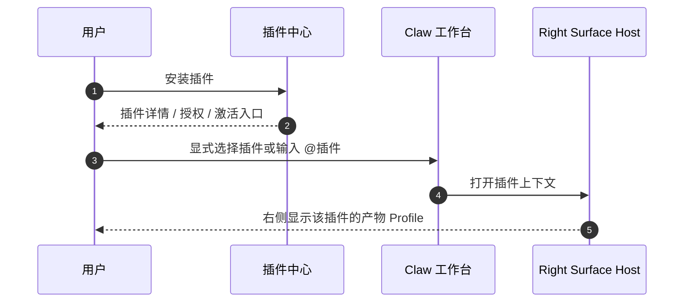
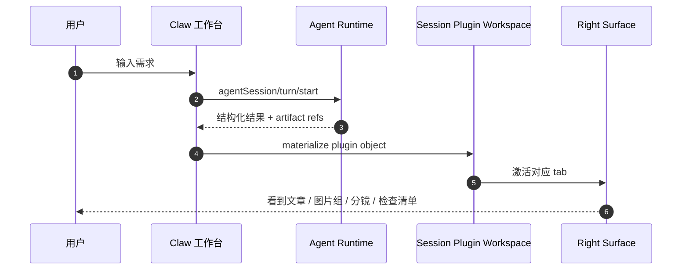
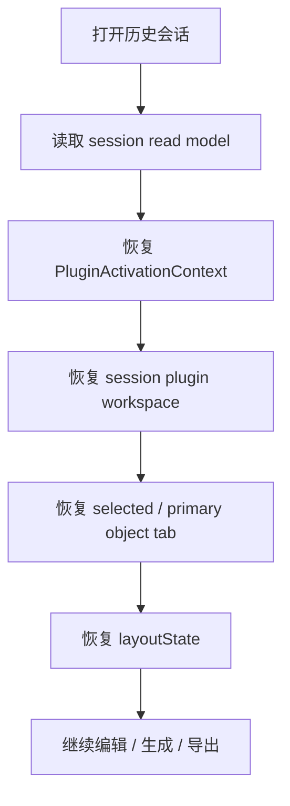

# Lime 插件产品需求文档

更新时间：2026-06-25  
状态：Draft
事实源：`internal/roadmap/rightsurface/README.md`、`internal/roadmap/workbench/v3/*`、`/Users/coso/Documents/dev/ai/limecloud/agentapp` v0.11 标准、上游插件模型参考

## 1. 一句话目标

让 Lime 进入“插件化工作台”阶段：插件负责安装、授权和分发，工作台应用 作为插件内的独立 UI 能力，Right Surface 作为唯一物理右栏承载产物 Profile 和可执行动作，Claw 继续负责中间对话、运行和审批。

```text
用户不是在打开一个孤立 App
用户是在显式激活一个插件工作上下文
```

## 2. 背景与问题

Lime 现在同时存在几个容易互相打架的概念：

1. 插件中心、工作台应用、内容工厂、右侧 Profile 都在表达“可安装且可交互的工作单元”。
2. 右侧工作区已经在 `rightsurface` 中被统一为单 dock、多 tab，但业务层仍存在按 App 直连 surface 的写法。
3. 普通会话如果按语义猜测插件，容易在发送前扫描全量列表，造成时延、误激活和状态污染。
4. 内容工厂这类业务要求产物可继续编辑、可恢复、可回流 runtime，不能只把结果塞成一段消息。

这份 PRD 的目标不是把概念再加一层，而是把层级定清楚。

| 问题 | 影响 |
| --- | --- |
| 插件与 工作台应用 同级 | 安装、授权、历史恢复和市场入口会重复设计。 |
| 右侧由业务自己包揽 | 容易回到“每个 App 一套壳子”，无法共享 tab / pane / restore。 |
| 语义猜测激活 | 普通会话会偷偷读取全量插件列表，行为不可预测。 |
| 产物只作为消息附件 | 历史任务和继续生成很难成立。 |

## 3. 目标与非目标

### 目标

1. 插件成为 Lime 用户侧一级概念。
2. `工作台应用` 作为插件内独立 UI 能力保留。
3. Right Surface 作为唯一右栏，支持插件贡献的产物 tab。
4. 历史会话恢复插件上下文、主产物和选中对象。
5. 内容工厂作为首个重型插件 dogfood，跑通文章、图片、视频脚本 / 分镜最小闭环。
6. 激活只通过显式选择、`@` 调用、历史恢复或固定 tab 进行，不靠语义猜测。

### 非目标

- 不复用 `旧内容工作台` 程序、IPC、store、renderer、Electron main service 或样式。
- 不把每个插件自建一套右侧壳子。
- 不让插件直接接管 Claw 中间聊天。
- 不把 工作台应用 重新做成另一个与插件并列的根产品。
- 不在首期实现完整素材平台、多租户协作、计费、发布审核和外部平台网关。

## 4. 用户与场景

| 用户 | 需求 | v1 体验 |
| --- | --- | --- |
| 内容创作者 | 从需求生成文章、配图和脚本。 | 先显式激活内容工厂插件，再在 Claw 中间运行，右侧看产物。 |
| 审核者 | 追溯产物来源与风险。 | 在右侧 Profile 看到 object provenance、artifact 和 evidence。 |
| 插件作者 | 发布可安装工作单元。 | 插件 manifest 一次性声明 工作台应用、skills、renderers 和 actions。 |
| 历史回看用户 | 继续编辑旧产物。 | 打开历史会话后直接恢复主对象和上次选中的 tab。 |

## 5. 核心用户路径

### 5.1 安装并激活插件



### 5.2 在插件中生成产物



### 5.3 历史恢复



## 6. 产品需求

### 6.1 插件中心

| 编号 | 需求 | 验收 |
| --- | --- | --- |
| FR-01 | 插件可安装、启用、停用、卸载和打开。 | 插件中心详情页可完成上述动作。 |
| FR-02 | 插件能按能力分类展示。 | 列表可区分 工作台应用、Skill Pack、Connector、Renderer。 |
| FR-03 | 插件详情能展示可激活入口。 | 详情页可看到显式激活入口和历史入口。 |

### 6.2 显式激活

| 编号 | 需求 | 验收 |
| --- | --- | --- |
| FR-04 | composer 支持插件 chip。 | 当前 session 能看到被激活插件。 |
| FR-05 | 支持 `@插件` 和 `@插件:技能`。 | 输入后可选择特定插件或技能。 |
| FR-06 | 历史恢复时保留激活上下文。 | 打开历史不会重新猜插件。 |

### 6.3 工作台应用

| 编号 | 需求 | 验收 |
| --- | --- | --- |
| FR-07 | 插件可包含独立 工作台应用 UI。 | 详情页和 surface 都可进入该 UI。 |
| FR-08 | 工作台应用 不单独承担安装/市场/授权。 | 同一安装包里完成分发和激活。 |
| FR-09 | 工作台应用 可携带 skills、connectors 和 renderer。 | manifest 可一次性声明。 |

### 6.4 Right Surface / Artifact Renderer

| 编号 | 需求 | 验收 |
| --- | --- | --- |
| FR-10 | 右侧支持多个 tab。 | 一次会话可并存产物、文件、证据、终端等。 |
| FR-11 | 插件可贡献产物 renderer。 | document / imageGrid / storyboard / checklist 有宿主 renderer。 |
| FR-12 | 复杂场景可挂载受控 app pane。 | 仅在 Host 允许的 pane 中挂载自定义 UI。 |
| FR-13 | action 只回流 runtime。 | 右侧不能直调 provider / filesystem / secret。 |

### 6.5 历史恢复

| 编号 | 需求 | 验收 |
| --- | --- | --- |
| FR-14 | 打开历史默认恢复主产物。 | 用户不需要翻消息找 artifact。 |
| FR-15 | 恢复选中对象和布局。 | `selectedObjectRef` 和 `layoutState` 可回放。 |
| FR-16 | 允许只读查看旧插件会话。 | 插件停用后历史仍能浏览，但不能直接继续 action。 |

## 7. 非功能需求

| 维度 | 要求 |
| --- | --- |
| 安全 | 右侧 renderer 不直接拿 provider key、Node、文件系统或 App Server transport。 |
| 隔离 | 复杂插件 UI 只能以 Host 受控 pane 挂载，不能变成第二个主窗口。 |
| 性能 | 普通会话不应在每次发送前全量扫插件目录。 |
| 可测试 | 激活、历史恢复、renderer projection 和 action router 尽量用纯函数覆盖。 |
| 可观测 | 产物、action、恢复和导出必须保留 provenance。 |

## 8. 里程碑

| 阶段 | 目标 | 交付物 |
| --- | --- | --- |
| P0 | 定义插件语言 | plugin README / PRD / architecture / contract 完整化。 |
| P1 | 显式激活 | composer chip、`@插件`、session activation context。 |
| P2 | 右侧 renderer | Host builtin renderer、tab/pane registry、history restore。 |
| P3 | 内容工厂 dogfood | 内容工厂插件的文章、图片、视频脚本 / 分镜最小闭环。 |
| P4 | 迁移与收口 | 旧 工作台应用 / 旧 旧内容工作台 退出用户主路径。 |

## 9. 验收标准

- [ ] 插件中心能看到可安装插件和其能力分类。
- [ ] 插件能显式激活，不依赖语义猜测。
- [ ] 右侧可以恢复 plugin workspace 和主产物。
- [ ] 内容工厂插件能跑通文章、图片、视频脚本 / 分镜的最小闭环。
- [ ] 历史会话打开后仍能继续对产物执行受控 action。

## 10. 风险与应对

| 风险 | 应对 |
| --- | --- |
| 插件概念再次扩散 | 明确插件是根对象，工作台应用 只是子类型。 |
| 右侧变成“万能页面系统” | 只接受 object surface / renderer contract，不复刻完整页面。 |
| 激活逻辑回到猜测 | 只保留显式入口，普通发送不做插件扫描。 |
| 历史恢复状态膨胀 | 只保存 workspace index、selection 和 layout，重内容留在 artifact / evidence。 |
| 内容工厂范围失控 | 首期只做文章、图片、视频脚本 / 分镜，不扩大到完整平台。 |

## 11. 落地口径

1. 插件中心可以复用现有 App Center 的安装壳，但用户侧命名必须收敛为“插件”。
2. 工作台应用 作为 manifest 的一段能力声明存在，不再拥有独立分发体。
3. 当前插件上下文必须由 session metadata / workspace 驱动，而不是由全局缓存或语义推断重建。
4. 插件 action 统一先过 readiness gate，再进入 runtime。
5. 右侧 renderers 只负责对象，不负责用户全局导航。

## 12. 设计结论

1. 插件是分发与授权根对象。
2. 工作台应用 是插件内的 UI 能力，不是另一个产品根。
3. Right Surface 是唯一物理右栏，plugin 只提供承载内容。
4. 内容工厂是最重要的 dogfood，它验证的是插件化工作台，不是页面壳。
