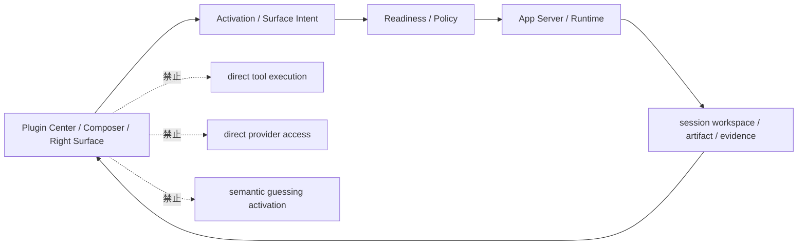

# Lime 插件产品原型图

> 状态：proposal  
> 更新时间：2026-06-25  
> 目标：把插件中心、显式激活、插件工作区能力、右侧 dock 和历史恢复画成低保真原型，避免路线图只停留在概念解释。

HTML 原型：[prototype.html](./prototype.html)

依赖文档：

- [./README.md](./README.md)
- [./prd.md](./prd.md)
- [./architecture.md](./architecture.md)
- [../rightsurface/README.md](../rightsurface/README.md)
- [../agentapp/v4/README.md](../agentapp/v4/README.md)

## 1. 原型原则

插件的 UI 不能像“又一个设置中心”。它应该一眼看懂四件事：

1. 这个插件是什么。
2. 这个插件能做什么。
3. 它怎么被显式激活。
4. 激活后右侧会出现什么产物和 tab。

固定边界：

1. 原型只展示 current projection，不自行判断 readiness。
2. 激活动作只触发当前 session context 切换，不直接执行 runtime。
3. 右侧产物区只展示对象 surface 和受控 action，不承载完整独立 App 壳。
4. 历史恢复只恢复插件上下文、主产物和 tab 状态，不重跑生成。

## 2. 插件中心首页原型

```text
┌────────────────────────────────────────────────────────────────────────┐
│ Plugins                                                                │
├────────────────────────────────────────────────────────────────────────┤
│ Search plugins... [内容工厂] [工作区能力] [Skills] [Connectors] [Renderer]│
├────────────────────────────────────────────────────────────────────────┤
│ Installed                                                              │
│ ┌──────────────────────┐  ┌──────────────────────┐  ┌────────────────┐ │
│ │ 内容工厂             │  │ 研究助手             │  │ Chrome         │ │
│ │ 工作区能力 · verified │  │ Skill Pack · ready   │  │ Connector      │ │
│ │ 文章 / 图片 / 视频   │  │ 知识检索 / 复核      │  │ 已连接         │ │
│ │ [打开] [停用]        │  │ [打开] [停用]        │  │ [打开] [停用]  │ │
│ └──────────────────────┘  └──────────────────────┘  └────────────────┘ │
└────────────────────────────────────────────────────────────────────────┘
```

信息优先级：

1. 插件名称和能力类型。
2. 状态标签。
3. 一句话用途。
4. 当前动作入口。

## 3. 插件详情页原型

```text
┌─────────────────────────────────────────────────────────────────────────────┐
│ 内容工厂 · Plugin                                                          │
├─────────────────────────────────────────────────────────────────────────────┤
│ 状态        verified                                                        │
│ 类型        工作区能力 + Renderer + Skills                                  │
│ 说明        内容工厂是文章、图片、视频脚本和分镜的生产型插件               │
│                                                                             │
│ [激活到当前会话] [安装] [停用] [卸载]                                       │
├─────────────────────────────────────────────────────────────────────────────┤
│ Tabs: [Overview] [Workspace] [Skills] [Renderer] [History] [Permissions]    │
└─────────────────────────────────────────────────────────────────────────────┘
```

### 3.1 Overview tab

```text
┌──────────────────────────────────────────────────────────────┐
│ 概览                                                         │
├──────────────────────────────────────────────────────────────┤
│ 这个插件提供：                                               │
│ - 独立插件工作区 UI                                          │
│ - 文章 / 图片 / 视频脚本 / 分镜 renderer                    │
│ - content brief / checklist / export actions                 │
│ - 历史会话恢复                                               │
│                                                              │
│ 支持入口                                                     │
│ - 插件中心打开                                               │
│ - @内容工厂                                                  │
│ - 历史恢复                                                  │
└──────────────────────────────────────────────────────────────┘
```

### 3.2 Skills tab

```text
┌──────────────────────────────────────────────────────────────┐
│ Skills                                                       │
├──────────────────────────────────────────────────────────────┤
│ article-writer      verified  required                       │
│ image-prompt-maker   verified  optional                      │
│ video-storyboard     verified  required                       │
│ content-reviewer     verified  required                       │
│                                                              │
│ [打开 skill] [查看 contract] [重新验证]                      │
└──────────────────────────────────────────────────────────────┘
```

### 3.3 Renderer tab

```text
┌──────────────────────────────────────────────────────────────┐
│ Renderer                                                     │
├──────────────────────────────────────────────────────────────┤
│ articleDraft         host_builtin · documentCanvas          │
│ imageGenerationSet   host_builtin · imageGrid               │
│ videoStoryboard      host_builtin · storyboard              │
│ deliveryChecklist    host_builtin · checklist               │
│ customEditorPane     app_declared · webcontents_view        │
└──────────────────────────────────────────────────────────────┘
```

## 4. Composer 激活 strip 原型

```text
┌──────────────────────────────────────────────────────────────┐
│ Input                                                        │
├──────────────────────────────────────────────────────────────┤
│ [内容工厂 ▾] [article-writer ▾]                              │
│ 输入需求，或键入 @ 选择插件 / 技能                            │
│ [当前插件 chip] [当前技能 chip] [清除]                       │
└──────────────────────────────────────────────────────────────┘
```

规则：

1. chip 只表示当前会话激活上下文，不是历史记录。
2. `@` 打开的是显式选择器，不是搜索引擎。
3. 未激活插件时，输入区不自动扫描插件列表。

## 5. 右侧 Dock 原型

```text
┌────────────────────────────────────────────────────────────────────────────┐
│ Right Surface Dock                                                         │
├────────────────────────────────────────────────────────────────────────────┤
│ [Product Profile] [File] [Evidence] [Terminal] [Browser] [Side Chat]       │
├────────────────────────────────────────────────────────────────────────────┤
│ Product Profile                                                             │
│ ┌────────────────────────────────────────────────────────────────────────┐ │
│ │ 当前插件：内容工厂                                                     │ │
│ │ 当前对象：articleDraft / v3                                            │ │
│ │ 下一步：继续改写 / 生成图片 / 打开分镜                                  │ │
│ │                                                                        │ │
│ │ [继续] [导出] [切换对象] [查看 provenance]                              │ │
│ └────────────────────────────────────────────────────────────────────────┘ │
└────────────────────────────────────────────────────────────────────────────┘
```

## 6. 历史会话原型

```text
┌────────────────────────────────────────────────────────────────────────────┐
│ History session                                                            │
├────────────────────────────────────────────────────────────────────────────┤
│ 2026-06-25  内容工厂 - 文章草稿                                            │
│ 2026-06-24  内容工厂 - 视频分镜                                            │
│ 2026-06-23  研究助手 - 资料复核                                            │
├────────────────────────────────────────────────────────────────────────────┤
│ 选中历史后：中间恢复对话，右侧恢复主对象和 tab                              │
└────────────────────────────────────────────────────────────────────────────┘
```

恢复规则：

1. 默认恢复主对象。
2. 如果有上次选中对象，优先恢复该对象。
3. 如果当前插件停用，只给只读历史视图，不开放继续 action。

## 7. 原型与 runtime 的边界图



**原型里的按钮都是控制入口，不是新的执行入口。**
