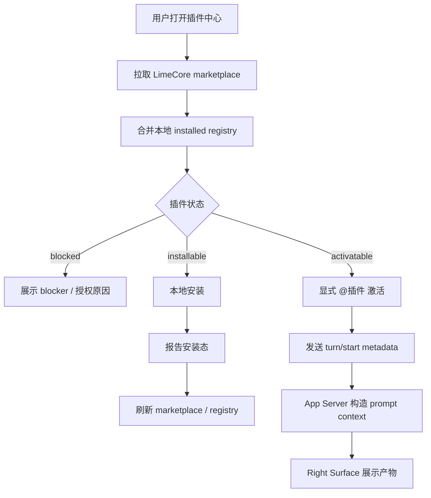
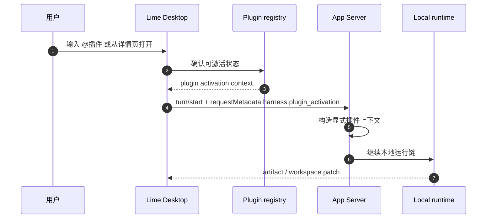
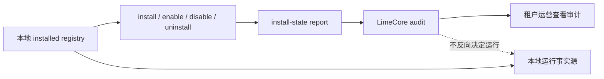

# Lime 插件使用与运营指南

更新时间：2026-06-27
状态：第二轮产品化文档

## 1. 目标读者

本文面向 Lime Desktop 的插件使用、支持和运营人员，说明客户端如何消费 LimeCore marketplace、如何处理授权与本地安装态，以及哪些能力当前不会远端执行。

服务端发布与租户运营 Runbook 见 LimeCore：

```text
LimeCore 外仓 plugin operations runbook
```

## 2. 客户端职责

| 客户端职责              | 说明                                                                  |
| ----------------------- | --------------------------------------------------------------------- |
| 拉取 marketplace        | 从 LimeCore 读取租户可见插件目录、策略、manifest 摘要和 package ref。 |
| 合并 installed registry | 使用本地安装态判断插件是否可打开、可启用、可卸载或需要处理。          |
| 授权提交                | 对需要注册码的插件，提交授权码并刷新 marketplace。                    |
| 本地安装态报告          | 本地安装、启用、禁用、保留数据卸载后向 LimeCore 报告状态，用于审计。  |
| 显式激活                | 通过插件中心或 `@插件` / `@插件:技能` 写入本 turn 激活上下文。        |
| Right Surface 渲染      | 只挂载 Host 支持的内置 renderer 或当前 allowlist 的本地插件产物。     |

## 3. 端到端消费流程



## 4. 用户路径

### 安装插件

1. 打开插件中心。
2. 确认插件状态为可安装。
3. 如插件要求注册码，先提交授权码。
4. 客户端下载并校验 package hash / manifest hash。
5. 安装成功后写入本地 installed registry。
6. 客户端向 LimeCore 报告 `installed` 状态。

### 启用或禁用插件

1. 已安装插件可在详情页启用或禁用。
2. 禁用只影响本地激活入口，不修改 LimeCore 租户发布配置。
3. 状态变化后报告 `enabled` 或 `disabled`。
4. 下次打开插件中心时，本地 registry 与 marketplace 再次合并。

### 保留数据卸载

1. 客户端先执行本地卸载预演。
2. 只走保留数据卸载，不远端删除租户配置。
3. 卸载成功后报告 `uninstalled`。
4. 重新安装时仍以 LimeCore marketplace package ref 和本地 registry 为准。

### 显式激活



规则：

- 自然语言不会自动猜测插件。
- disabled / blocked 插件 fail closed。
- 历史恢复不会重新猜插件，只恢复已记录的 plugin context。
- 右侧 action 必须回流 runtime，不直接调用 provider、文件系统或远端插件执行面。

## 5. 授权与 blocked 状态

| 状态                    | 用户看到的含义                        | 处理方式                                  |
| ----------------------- | ------------------------------------- | ----------------------------------------- |
| `registration_required` | 需要企业注册码                        | 提交注册码后刷新 marketplace。            |
| `license_blocked`       | 租户授权不足                          | 联系租户运营调整 license。                |
| `not_visible`           | 灰度 / 白名单 / 角色 / 套餐不匹配     | 检查用户、角色、套餐或灰度 bucket。       |
| `package_missing`       | 服务端没有下发 package ref            | 不允许安装，查看服务端发布状态。          |
| `package_mismatch`      | 本地安装包 hash 与 marketplace 不一致 | fail closed，要求重新安装或等待发布修正。 |

blocked 插件不能被降级成普通聊天，也不能绕过授权直接安装。

## 6. Right Surface 与产物

当前客户端只允许以下产物路径进入 Right Surface：

- Host 内置 renderer 支持的 document、imageGrid、storyboard、checklist 等结构化产物。
- 内容工厂本地 worker dogfood 产出的 workspace patch。
- 历史恢复中的 source-backed artifact preview。
- 受控 action metadata 回流到 App Server current 运行链。

当前不做：

- 不加载任意插件声明的 iframe / webview / BrowserView。
- 不把 manifest `entry` 当成可点击或可加载入口。
- 不执行远端 plugin worker。
- 不让插件 action 直接绕过 App Server current 运行链。

## 7. 安装态与审计



客户端上报安装态的目的：

- 让租户运营知道用户是否安装、启用、禁用或卸载。
- 让发布后验收有审计证据。
- 帮助排查 package hash / manifest hash 不一致。

安装态报告不做：

- 不触发远端安装。
- 不改变租户 enablement。
- 不替代本地 installed registry。
- 不作为插件运行授权的唯一事实源。

## 8. 历史恢复

历史恢复依赖 session read model、plugin activation context 和 artifact refs：

1. 恢复会话时读取历史 plugin metadata。
2. 若存在可用 artifact ref，则创建 source-backed preview。
3. 若插件不可用或无法激活，落为只读或 chat-only 状态。
4. 不调用服务端历史列表 API。
5. 不自动执行插件 action。

## 9. 支持排查清单

| 问题                   | 先查                                                                  |
| ---------------------- | --------------------------------------------------------------------- |
| 插件中心没有插件       | LimeCore marketplace 响应、租户 enablement、灰度规则。                |
| 插件显示 blocked       | blocker code、license、registration、package ref。                    |
| 授权码失败             | 租户审计中的 registration failed、锁定时间、过期时间。                |
| 安装失败               | package URL、package hash、manifest hash、本地 registry。             |
| `@插件` 不生效         | 本地 installed / enabled 状态、activation mention、request metadata。 |
| 右侧没有产物           | runtime 是否产出支持的 artifact kind 或 workspace patch。             |
| 历史记录无名称或不可点 | artifact refs 是否存在，source-backed preview 是否能读取。            |

## 10. 明确边界

- Marketplace 服务端事实源在 LimeCore control-plane。
- Lime App Server 不新增 marketplace 查询、安装、发布或运行 JSON-RPC。
- 客户端不恢复旧插件命令族。
- 服务端不执行 renderer / worker，不注入 prompt。
- 客户端只在显式激活时把插件上下文交给 App Server。
- 远端运行未来若开放，必须另起设计并补隔离执行、签名、权限、租户策略、审计、回滚和用户确认。

## 11. GUI 验收要点

- 插件中心能展示 marketplace item、状态、策略和 package ref blocker。
- 注册授权完成后刷新 marketplace，blocked item 变为 available。
- install / enable / disable / uninstall 后本地状态更新，并上报安装态。
- `@插件` / `@插件:技能` 会进入显式激活链。
- Right Surface 能展示内容工厂 dogfood 产物和历史 artifact preview。
- 远端运行、任意 renderer entry、公开 worker run 均 fail closed。

## 12. 验证入口

```bash
npm run test:contracts
npm run verify:gui-smoke
```

涉及 LimeCore 服务端发布和审计时，配合执行：

```bash
go test ./services/control-plane-svc/internal/service -run 'TestControlPlaneServiceBulkPublish'
go test ./services/control-plane-svc/internal/service ./services/control-plane-svc/internal/controller
```
