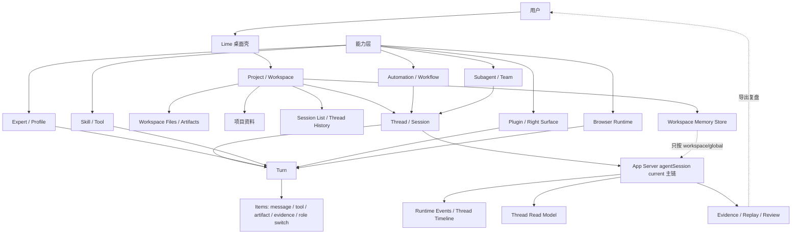
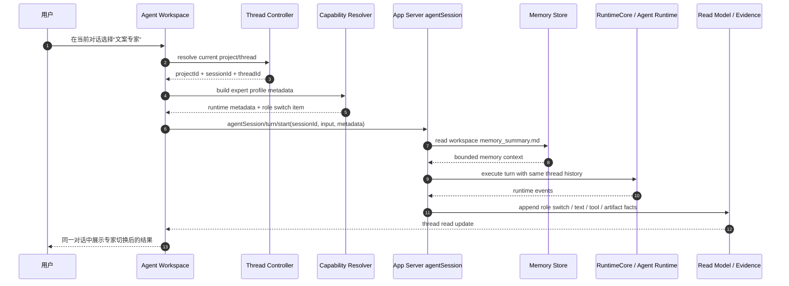
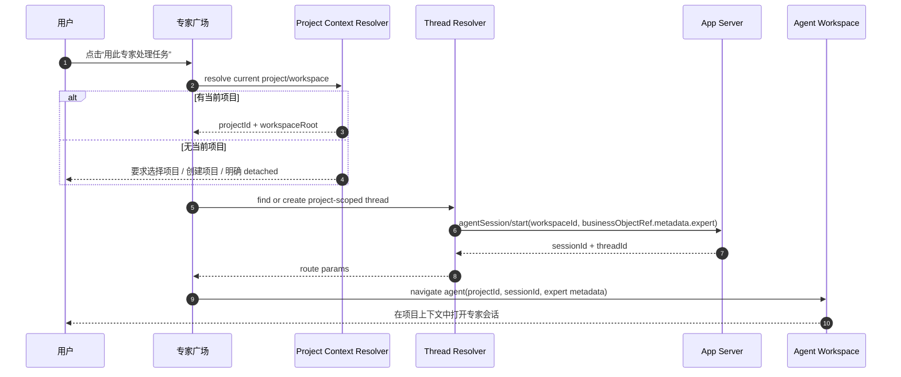
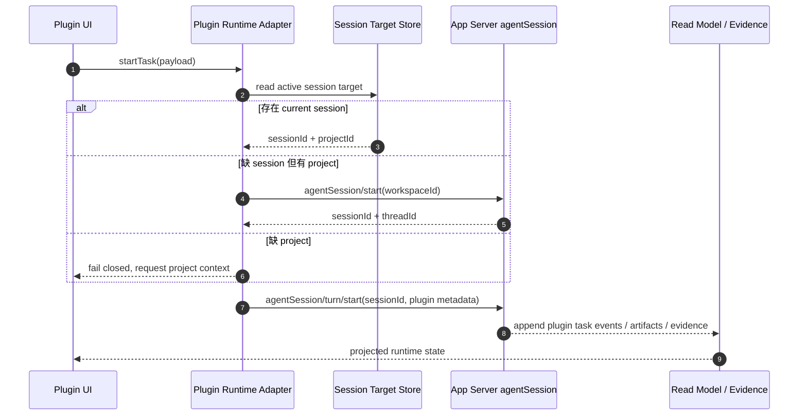
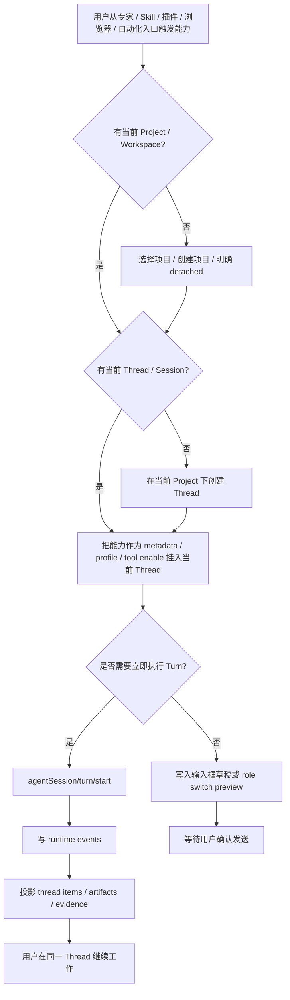
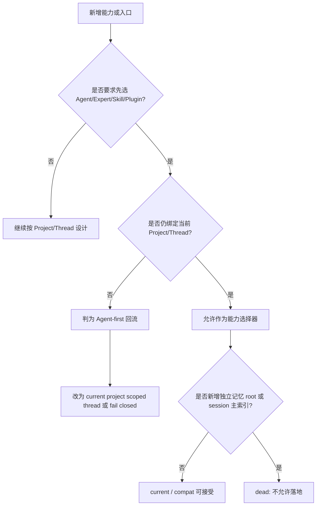
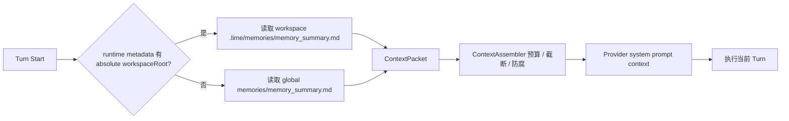

# Project / Thread-first 产品 PRD

> 状态：current planning source
> 更新时间：2026-07-05
> 作用：定义 Lime 为什么要完全对标 Codex 的 Project / Thread-first 产品形态、用户获得什么收益、用户如何使用，以及专家 / Skills / 插件 / 子代理 / 浏览器 / 自动化如何回到同一条 Project / Thread 主链。

## 1. 一句话目标

让用户先围绕“项目和当前任务”连续工作，再在同一个 Thread 中按需调用专家、Skills、插件、子代理、浏览器和自动化能力；任何能力都不能把用户带进一个上下文断开的 Agent 私有世界。

## 2. 背景

Lime 已经有较强的底座：

1. App Server `agentSession/*` current 协议。
2. workspace scoped memory store。
3. Thread timeline / runtime event / read model。
4. Agent Workspace / Artifact / Evidence / Replay。
5. 专家广场、Skills、插件、子代理、Browser Runtime、Automation / Workflow。

问题不在于能力不足，而在于产品分类有继续分裂的风险：

| 能力入口              | 当前价值                                | 潜在风险                                                     |
| --------------------- | --------------------------------------- | ------------------------------------------------------------ |
| 专家                  | 降低 prompt / skill / workflow 配置门槛 | 如果按专家恢复固定会话，会变成 Agent-first。                 |
| Skills                | 管理可复用能力                          | 如果从 Skill 直接开私有运行流，会脱离当前 Thread。           |
| 插件                  | 提供应用级 UI 和领域能力                | 如果插件自带 Agent 会话体系，会形成第二套历史。              |
| 子代理 / Team         | 支持分工和 review lane                  | 如果 child session 没有 parent lineage，会变成独立聊天列表。 |
| Browser Runtime       | 提供网页操作环境                        | 如果 Browser profile 成为第一分类，会掩盖任务上下文。        |
| Automation / Workflow | 执行长任务和定时任务                    | 如果 job 历史不回到 Project / Thread，会变成任务孤岛。       |

Codex 给出的核心判断是：**Thread 是第一公民，Agent 在 Thread 里工作。**

Lime 要完全对标的是这个判断，而不是照搬界面：

```text
Project / Workspace
  -> Thread / Session
    -> Turn / Item
      -> Expert / Agent / Skill / Tool / Plugin / Browser / Workflow
```

## 3. 为什么现在做

如果继续让专家、插件、Skills、浏览器和自动化各自长入口，会出现三个后果：

1. 用户在 A 专家里分析出来的内容，切到 B 专家时上下文不可用。
2. 记忆、证据、artifact 和历史被分散到多个入口，后续无法复盘。
3. 多 Agent 从“协作能力”退化成“很多互不相识的工具”。

当前 Lime 还没有完全走偏，正适合先定 Project / Thread-first 规则，再让后续实现都按这个方向收敛。

## 4. 产品目标

### 4.1 用户目标

| 目标       | 说明                                                                  |
| ---------- | --------------------------------------------------------------------- |
| 上下文不断 | 用户在同一个 Thread 内切换专家 / Skill / 插件时，不丢历史和项目资料。 |
| 记忆不分裂 | 长期记忆按 workspace / global 组织，不按 Agent / Expert 拆分。        |
| 历史可恢复 | 任意能力产生的结果都能从 Project / Thread 找回。                      |
| 证据可复盘 | 运行过程、工具、子代理、artifact、workflow 都能进入 Evidence Pack。   |
| 能力好发现 | 专家、Skills、插件仍可被发现和管理，但运行时必须回到当前 Thread。     |

### 4.2 工程目标

| 目标           | 说明                                                                                                       |
| -------------- | ---------------------------------------------------------------------------------------------------------- |
| 单一事实源     | session / thread / turn / item 是唯一运行事实主链。                                                        |
| 入口不分叉     | 专家、Skills、插件、Browser、Automation 不新增私有 Agent runtime。                                         |
| 元数据边界清楚 | 业务来源只进入 `businessObjectRef.metadata`、runtime metadata、thread item metadata 或 evidence metadata。 |
| 可机械守卫     | 用 contract / governance tests 防止 `agent_id / expert_id` 成为 session 或 memory 主索引。                 |

## 5. 用户收益

| 角色              | 收益                                                                       |
| ----------------- | -------------------------------------------------------------------------- |
| 普通用户          | 不需要理解 Agent 分类，直接围绕当前任务工作。                              |
| 创作者 / 运营     | 可以先做市场分析，再切文案专家润色，再切发布插件处理素材，整个过程不断流。 |
| 开发者            | Coding、Browser、Review、Evidence 都挂在同一 Thread 下，排查问题更直接。   |
| 团队负责人        | 可以提供专家模板和插件能力，但团队产出仍按项目沉淀。                       |
| 插件 / Skill 作者 | 不需要实现第二套会话系统，只需接入 current session / thread 合同。         |
| 维护者            | 可以用统一的 session / thread / evidence 追踪所有入口，不再查多个孤岛。    |

## 6. 非目标

1. 不删除专家、Skills、插件、Browser、Automation 这些入口。
2. 不把 Codex UI 逐像素复制到 Lime。
3. 不把所有能力都塞进聊天正文；Right Surface / Workbench / Task Center 继续存在。
4. 不让专家、Skill、插件拥有自己的长期记忆事实源。
5. 不新增第二套 Agent session / task / evidence 协议。
6. 不为了兼容旧入口继续扩大 Agent-first 路径。

## 7. 用户故事

| 编号  | 用户故事                                                                             | 验收口径                                                                   |
| ----- | ------------------------------------------------------------------------------------ | -------------------------------------------------------------------------- |
| PT-01 | 作为用户，我在一个项目里写商业计划书，希望先让商业专家分析，再让文案专家润色。       | 两轮发生在同一 Thread，第二轮能看到第一轮结论。                            |
| PT-02 | 作为用户，我从专家广场点一个专家，希望它处理当前项目，而不是进入默认项目孤岛。       | 新会话绑定当前 project / workspace；没有当前项目时要求显式选择或创建。     |
| PT-03 | 作为用户，我在当前对话里启用一个 Skill，希望它接着当前上下文工作。                   | Skill 作为 tool/context/workflow 注入当前 turn，不创建私有 session。       |
| PT-04 | 作为插件用户，我从插件 UI 发起 Agent 任务，希望结果回到当前对话和证据包。            | 插件任务携带 current sessionId；缺失时在当前 project 下创建 session。      |
| PT-05 | 作为开发者，我让子代理处理代码审查，希望它的结果能追溯到父对话。                     | child session / subagent turn 有 parent session / turn lineage。           |
| PT-06 | 作为用户，我关闭 Lime 后重新打开，希望所有专家、插件、浏览器操作都能从项目历史恢复。 | session list / thread read / evidence 能恢复关键状态，不依赖入口私有缓存。 |
| PT-07 | 作为维护者，我不希望未来有人给每个专家加一套长期记忆。                               | 治理测试禁止 agent/expert scoped memory root。                             |

## 8. 用户用例

### UC-01：同一 Thread 内切换专家

| 字段     | 内容                                                                                 |
| -------- | ------------------------------------------------------------------------------------ |
| 参与者   | 普通用户、专家 profile selector、Agent runtime                                       |
| 前置条件 | 用户已在某个 project 的 Thread 中。                                                  |
| 主流程   | 用户完成一轮商业分析 -> 在输入区切换到文案专家 -> 继续发送“改成投资人能读懂的版本”。 |
| 结果     | 新 turn 使用文案专家 metadata，但读取同一 Thread history 和 workspace memory。       |
| 失败处理 | 如果专家 profile 不可用，保留当前 Thread，提示配置缺失，不新开孤岛会话。             |

### UC-02：从专家广场启动任务

| 字段     | 内容                                                                                                       |
| -------- | ---------------------------------------------------------------------------------------------------------- |
| 参与者   | 用户、专家广场、Project selector、Agent workspace                                                          |
| 前置条件 | 用户可能有当前项目，也可能没有。                                                                           |
| 主流程   | 用户打开专家详情 -> 点击用此专家处理任务 -> 系统确认 current project -> 在该 project 下创建或继续 Thread。 |
| 结果     | session 绑定 project/workspace，专家只作为 session metadata 和首轮 profile context。                       |
| 失败处理 | 没有项目上下文时，不落 `default` 项目；要求选择项目、创建项目或以 detached session 明确继续。              |

### UC-03：Skill 注入当前对话

| 字段     | 内容                                                                                                             |
| -------- | ---------------------------------------------------------------------------------------------------------------- |
| 参与者   | 用户、Skill 管理页、Inputbar、RuntimeCore                                                                        |
| 前置条件 | Skill 已安装或可用。                                                                                             |
| 主流程   | 用户在当前 Thread 中选择 Skill -> Inputbar 生成能力引用 -> runtime 在下一 turn 启用对应 tool/context。           |
| 结果     | Skill 运行事件成为 thread item / tool event / evidence。                                                         |
| 失败处理 | Skill 缺依赖时生成 action_required 或诊断卡；没有 current project / thread 时不创建默认项目或 Skill 私有运行链。 |

### UC-04：插件发起 Agent 任务

| 字段     | 内容                                                                                                     |
| -------- | -------------------------------------------------------------------------------------------------------- |
| 参与者   | 插件 UI、Plugin runtime adapter、App Server agentSession                                                 |
| 前置条件 | 插件拥有 Agent capability。                                                                              |
| 主流程   | 插件提交任务 -> adapter 读取 current session target -> 调用 `agentSession/turn/start`。                  |
| 结果     | 插件任务输出进入当前 Thread / artifact / evidence。                                                      |
| 失败处理 | 没有 current session target 时，adapter fail closed 或在当前 project 下创建 Thread，不伪造私有 session。 |

### UC-05：自动化任务回到 Project / Thread

| 字段     | 内容                                                                                     |
| -------- | ---------------------------------------------------------------------------------------- |
| 参与者   | Automation job、RuntimeCore、Evidence service、用户                                      |
| 前置条件 | 用户创建了一个定时或后台 workflow。                                                      |
| 主流程   | job 执行 -> 生成 workflow facts -> 输出 artifact / evidence refs -> 用户从项目历史打开。 |
| 结果     | job 不只停留在 automation 页面；它能回到 Project / Thread 的历史和证据。                 |
| 失败处理 | job failed 时生成可恢复 incident / evidence summary。                                    |

## 9. 产品信息架构

### 9.1 架构图



### 9.2 运行时分层

```text
UI Entry
  Expert Plaza / Skills / Plugin / Browser / Automation
    -> Project Context Resolver
      -> Thread Resolver
        -> Capability Metadata Builder
          -> agentSession/turn/start
            -> Runtime Events
              -> Thread Items / Read Model / Evidence
```

## 10. 核心时序

### 10.1 同一 Thread 内切换专家

> 当前实现状态：Agent Workspace 已支持在右侧专家面板切换当前 Thread 的专家 profile，并把 `expert / harness.expert / harness.expert_role_switch` 写入下一轮 `requestMetadata`；App Server 已将该 metadata 投影为 `expert.profile_switch.completed` runtime event、`expert_profile_switch` thread item 和 evidence/export 事件。



### 10.2 从专家广场启动任务



### 10.3 插件发起 Agent 任务



## 11. 流程图

### 11.1 能力入口路由流程



### 11.2 Agent-first 回流判定



### 11.3 记忆读取流程



## 12. 功能需求

### 12.1 P0 必须做

| 编号  | 需求                                                             | 验收                                                             |
| ----- | ---------------------------------------------------------------- | ---------------------------------------------------------------- |
| FR-01 | 所有能力入口必须能解析 current project / thread。                | 没有上下文时 fail closed 或显式选择，不静默落默认项目。          |
| FR-02 | 专家启动只写 session / turn metadata。                           | 不新增 expert scoped memory root，不新增 expert session 主索引。 |
| FR-03 | 删除专家 `latestSessionId` / `resume_or_create` 稳定会话恢复链。 | 专家入口不传 `initialSessionId`，旧缓存字段读取时丢弃。          |
| FR-04 | Contract / governance tests 阻止 Agent-first schema。            | 禁止 `agent_id / expert_id` 成为 session / memory 一等索引。     |
| FR-05 | 文案明确专家是当前对话能力。                                     | 不再暗示“专家拥有独立工作空间”。                                 |

### 12.2 P1 应该做

| 编号  | 需求                                         | 验收                                                                            |
| ----- | -------------------------------------------- | ------------------------------------------------------------------------------- |
| FR-06 | 专家广场启动任务时继承当前 project。         | session workspaceId / workingDir 与当前项目一致。                               |
| FR-07 | 当前 Thread 内支持专家 / profile 切换。      | 下一轮 metadata 切换、role switch thread item 和 evidence/export 事件均可验证。 |
| FR-08 | 专家历史恢复只走普通 Project / Thread 历史。 | 不存在按专家继续会话的独立入口。                                                |

### 12.3 P2 后续做

| 编号  | 需求                                          | 验收                                                                                                                 |
| ----- | --------------------------------------------- | -------------------------------------------------------------------------------------------------------------------- |
| FR-09 | Skills 运行统一注入当前 Thread。              | Skill tool events 进入 thread items / evidence；Skills 工作台无 current project 时 fail closed，不自动创建默认项目。 |
| FR-10 | 插件 Agent task 复用 current session target。 | 缺 session 时 project scoped create，缺 project 时 fail closed。                                                     |
| FR-11 | Browser Runtime 作为 execution environment。  | 浏览器操作轨迹回到当前 Thread。                                                                                      |
| FR-12 | Automation 输出回到 Project / Thread。        | job 结果可从项目历史和 Evidence Pack 找回。                                                                          |

## 13. 数据与状态要求

| 对象                      | 所属层级         | 规则                                                          |
| ------------------------- | ---------------- | ------------------------------------------------------------- |
| `Project / Workspace`     | 第一作用域       | 拥有 workspace root、memory、files、knowledge、session list。 |
| `Thread / Session`        | 连续上下文       | 拥有 turns、items、business object metadata、read model。     |
| `Turn`                    | 执行单元         | 拥有 input、runtime options、model route、tool policy。       |
| `Item`                    | 渲染 / 证据单元  | 表达 message、tool、artifact、role switch、workflow event。   |
| `Expert / Skill / Plugin` | 能力元数据       | 只能挂在 session / turn / item / evidence metadata。          |
| `Memory`                  | workspace/global | 不按 Agent / Expert / Skill / Plugin 拆 root。                |

## 14. 成功指标

| 指标                         | 目标                                                                                  |
| ---------------------------- | ------------------------------------------------------------------------------------- |
| 专家入口项目继承率           | 100% 绑定当前 project，除非用户显式 detached。                                        |
| 能力运行可追溯率             | 专家 / Skill / 插件 / Browser / Automation 触发的运行都能追溯到 session/thread/turn。 |
| Agent scoped memory 数量     | 0。                                                                                   |
| Agent-first schema 回流      | 0。                                                                                   |
| 同 Thread 切换专家上下文保留 | P1 后必须有 GUI / fixture evidence。                                                  |
| Evidence join 完整度         | 关键能力入口都能导出 source metadata、runtime events、artifact refs。                 |

## 15. 风险与处理

| 风险                            | 处理                                                            |
| ------------------------------- | --------------------------------------------------------------- |
| 专家广场产品心智仍像 Agent 市场 | 文案和主按钮改为“用于当前对话 / 当前项目”，避免“进入专家空间”。 |
| 插件作者想自建 Agent runtime    | SDK 和 contract fail closed，要求使用 current session gateway。 |
| 自动化天然是 job-first          | job 可以独立调度，但输出和证据必须回挂 Project / Thread。       |
| 子代理需要独立执行上下文        | 允许 child session，但必须有 parent lineage 和 evidence join。  |
| 没有当前项目时体验变重          | 提供明确 detached 模式，但 detached 不能伪装成默认项目。        |

## 16. 验收计划

### 16.1 静态 / 契约验收

1. session / memory schema 没有 Agent-first 主索引。
2. 专家、Skill、插件入口测试覆盖 current session metadata。
3. `test:contracts` 证明 App Server current 主链未被绕过。

### 16.2 GUI / Evidence 验收

1. 从专家广场进入当前项目并完成一轮 turn。
2. 同一 Thread 内切换专家并继续工作。
3. 插件触发 Agent task 后能在 Thread / Evidence 中看到结果。
4. Browser 操作轨迹能回到当前 Thread。
5. Automation 输出能从项目历史找回。

## 17. 与现有路线图关系

| 路线图                      | 关系                                                                      |
| --------------------------- | ------------------------------------------------------------------------- |
| `thread/README.md`          | 负责 live timeline 写入权和 session refresh 合并策略。                    |
| `memory/README.md`          | 负责 workspace/global memory store 和 context packet。                    |
| `agent-workspace/README.md` | 负责 GUI 证据和能力评分。                                                 |
| `zuanjia/`                  | 负责专家广场和专家 profile 能力；本 PRD 约束它不能成为 Agent-first 主线。 |
| `workflow/`                 | 负责 workflow 标准化；本 PRD 要求 workflow 输出回到 Project / Thread。    |
| `plugin/`                   | 负责插件平台；本 PRD 要求插件 Agent task 复用 current session。           |

## 18. 下一步建议

下一步不应先做大规模 UI 改版，而是进入 P2 的能力入口 Thread 化盘点：

1. Skills 运行只作为当前 Thread 的 tool/context/workflow 注入。
2. 插件 Agent task 复用 current session target，缺 project 时 fail closed。
3. Browser profile 只作为 execution environment，操作轨迹回到当前 Thread。
4. Automation / Workflow 输出回写 Project / Thread / Evidence。
