# Right Surface 统一架构路线图

> 状态：设计草案，P1 / P2 骨架已落地，P3 前端 command 骨架已落地
> 更新时间：2026-06-22
> 作用：把 Lime Workspace / Task Center / Claw 主界面里的右侧辅助面板统一成一套单 dock、多 tab、可扩展、可测试的 Right Surface 架构，避免专家栏、画布、Shell、运行明细、文件面板等继续以独立右栏并排抢空间，同时支持像 Codex 一样在同一右侧工作区打开多个 tab。

## 1. 背景

Lime 当前 Workspace 主路径已经同时承载聊天、任务中心、画布、代码产物、专家信息、文件管理、运行证据、Shell 等多个辅助工作面。用户在真实使用中会频繁打开右侧内容，例如：

1. 点击抓夹 / 画布图标查看当前文件或产物。
2. 从专家入口进入聊天，查看专家信息、记忆、技能和工作流。
3. 打开 Shell、环境信息、运行过程、证据包或文件树。
4. 后续还会继续增加记忆、技能绑定、MCP 资源、浏览器协助、项目资料、自动化任务详情等面板。

当前实现里存在两套右侧承载路径：

1. `WorkspaceShellScene.rightRailNode`
   - 位于最外层 Shell。
   - 当前专家信息通过这里渲染。
   - 它和主区域的画布 / 工作台不是同一套布局系统。

2. `WorkspaceConversationScene.canvasContent`
   - 位于主工作区内部。
   - 当前画布、文件预览、代码产物工作台通过这里渲染。
   - 顶部按钮列 `TaskCenterUtilityToolbar` 也主要服务这套区域。

这导致点击抓夹 / 画布图标时，内层右侧工作区打开，但外层专家栏仍然存在，用户看到两个右侧面板并排，空间被挤压，信息层级冲突。

## 2. 目的

Right Surface 的目标不是新增一个 UI 容器，而是把所有“右侧辅助工作面”的所有权统一起来。

固定目标：

1. 同一时间只允许一个右侧 dock 展开，避免双右栏。
2. 右侧 dock 内允许多个 tab 同时存在并保持状态。
3. 顶部按钮列只负责打开或聚焦 tab，不各自维护独立展开状态。
4. 专家信息、画布、Shell、运行证据、文件等都进入统一 registry。
5. 外层 `rightRailNode` 不再承接普通业务面板。
6. 新增右侧内容必须先声明 tab / pane kind、打开 / 聚焦 / 关闭规则和回退规则。
7. 用户从任一入口切换右侧内容时，不出现双右栏、遮挡、重复标题或页面横向挤压。

## 3. 收益

### 3.1 产品收益

1. 右侧空间稳定：用户只需要理解一个右侧工作区。
2. 按钮语义清晰：按钮负责打开 / 聚焦 tab，tab strip 表示当前右侧内容。
3. 专家、画布、Shell、证据等不会以多个右栏并排抢焦点，但可以作为多个 tab 保持上下文。
4. 后续新增面板不需要重新发明一套展开 / 收起 / 多开逻辑。
5. 桌面端宽屏和窄屏都能用同一状态模型处理。

### 3.2 工程收益

1. 消除 `rightRailNode` 和 `canvasContent` 双轨。
2. 把分散在 `AgentChatWorkspace`、`WorkspaceConversationScene`、`TaskCenterUtilityToolbar` 的展开状态收敛成一个 reducer。
3. 可用纯单元测试覆盖 dock / tab / pane 状态规则，而不是只靠重型 React 挂载测试。
4. 新 tab / pane 只需要注册，不需要改多个互相不知道的开关。
5. GUI smoke / Playwright 可按统一 test id 验证右侧面板。

## 4. 非目标

本专题暂不解决：

1. 重做 CanvasWorkbench 的内部 tabs。
2. 重做专家信息面板的信息架构。
3. 重写 ChatNavbar、TaskCenter tab strip 或输入框。
4. 统一所有弹窗 / modal，它们不是 Right Surface。
5. 把左侧项目栏、文件管理永久侧栏纳入第一阶段；它们可以后续评估是否进入 secondary surface。

## 5. 术语

| 术语 | 含义 |
| --- | --- |
| Right Surface Dock | Workspace 主区域右侧唯一物理工作区，负责宽度、展开、收起和与中间 Claw 对话区的布局关系 |
| Surface Tab | Dock 内可同时保持状态的页签，例如产物、文件、证据、终端、浏览器、侧边聊天 |
| Surface Pane | 单个 Tab 内部的子面板，例如产物详情、运行记录、证据、专家信息、App 自定义 UI |
| Surface Kind | 一个可注册的 tab / pane 类型，如 `productProfile`、`file`、`evidence`、`terminal` |
| Surface Registry | tab / pane kind 到渲染、按钮、可用性、打开和回退策略的注册表 |
| Active Tab | 当前右侧 dock 中获得焦点的 tab |
| Launcher | 顶部工具列中的入口按钮，只触发激活，不拥有状态 |
| Fallback Tab | 当前 tab 不可用时的回退目标 |
| Object Canvas | 面向图片、文件、证据、产物等对象的空间化工作台，可承载框选、连线、血缘、对比和批量操作 |
| Board | 一个有边界的对象工作区，通常绑定项目、文件夹、会话或任务，而不是一次性的聊天附件 |
| Lineage | 对象从原始输入到产出变体的可见关系，例如源图 -> 标记区域 -> 生成图 -> 二次编辑 |

## 6. 当前架构问题

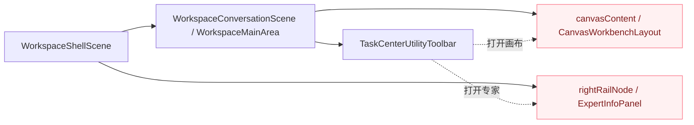

问题点：

1. `Canvas` 和 `Rail` 都在右侧，但父布局不同。
2. `Toolbar` 同时能打开内层画布和外层专家栏。
3. `AgentChatWorkspace` 只能通过局部状态折叠专家栏，无法统一治理所有右侧入口。
4. 当用户连续点击抓夹、专家、Shell、运行证据时，缺少唯一 dock / tab / pane 状态机判断。
5. 旧模型把“物理右栏只能有一个”和“右侧内容可多开”混成同一层，导致产物、文件、证据、App 面板无法像 Codex 一样作为多个 tab 保持上下文。

## 7. 目标架构

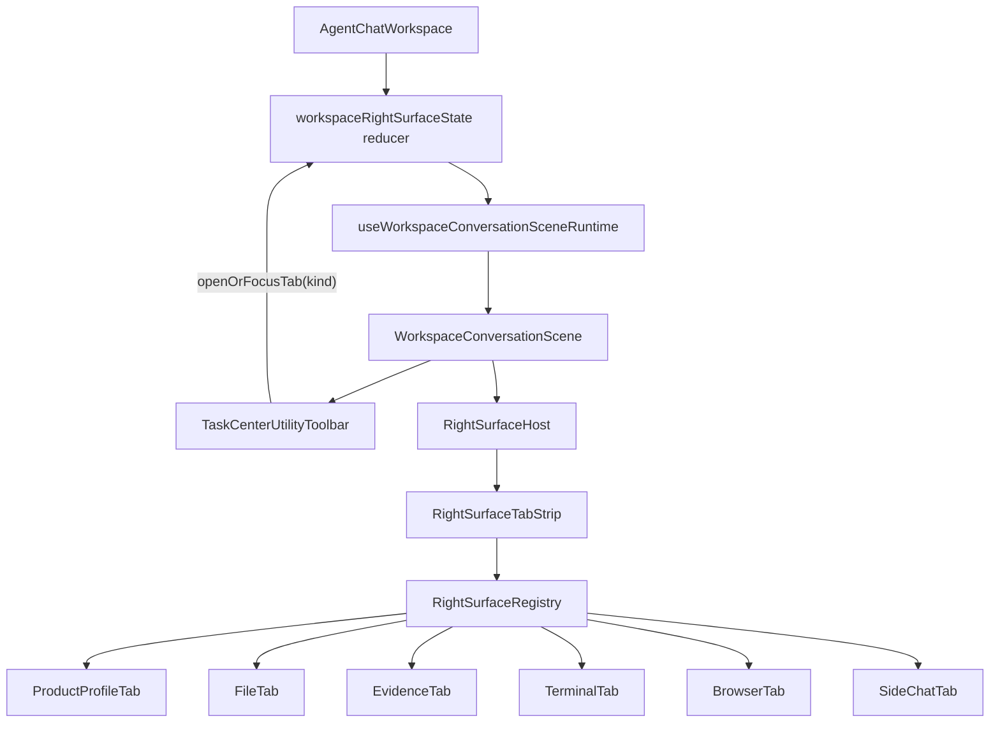

核心变化：

1. `AgentChatWorkspace` 持有唯一 `rightSurfaceDock`，物理右侧区域只能有一个。
2. `RightSurfaceDock` 内部维护多个 `tabs`，允许像 Codex 一样同时打开文件、终端、浏览器、侧边聊天、产物 Profile 和证据。
3. `TaskCenterUtilityToolbar` 不再直接切换单个 surface，只发出 `openOrFocusTab(kind)`。
4. `WorkspaceConversationScene` 通过 `RightSurfaceHost` 渲染 dock；`RightSurfaceTabStrip` 渲染当前 tab。
5. `ExpertInfoPanel` 不再是一级 tab，而是 `productProfile` 或 `sideChat` tab 内部的 pane。
6. `WorkspaceShellScene.rightRailNode` 第一阶段只保留兼容，普通业务右侧内容不再使用。

## 8. 状态模型

建议新增纯模型文件：

```ts
export type WorkspaceRightSurfaceKind =
  | "none"
  | "productProfile"
  | "file"
  | "evidence"
  | "terminal"
  | "browser"
  | "sideChat"
  | "environment";

export type WorkspaceRightSurfaceDockState = "closed" | "open";

export type WorkspaceRightSurfacePane =
  | "artifact"
  | "inspector"
  | "runtime"
  | "evidence"
  | "expertInfo"
  | "appSurface";

export interface WorkspaceRightSurfaceTab {
  id: string;
  kind: Exclude<WorkspaceRightSurfaceKind, "none">;
  title: string;
  closable: boolean;
  objectRef?: {
    appId?: string;
    kind?: string;
    id?: string;
    artifactRef?: string;
  };
  activePane?: WorkspaceRightSurfacePane;
  pinnedPanes?: WorkspaceRightSurfacePane[];
}

export interface WorkspaceRightSurfaceState {
  dock: WorkspaceRightSurfaceDockState;
  activeTabId?: string;
  tabs: WorkspaceRightSurfaceTab[];
  previousActiveTabId?: string;
  requestedBy: "user" | "route" | "auto" | "restore";
  layoutMode: "chat" | "chat-canvas" | "canvas";
  layoutVariant: "docked" | "expanded" | "canvasFirst";
}

export type WorkspaceRightSurfaceAction =
  | { type: "openOrFocusTab"; tab: WorkspaceRightSurfaceTab; source: "user" | "route" | "auto" | "restore" }
  | { type: "focusTab"; tabId: string; source: "user" | "route" | "auto" | "restore" }
  | { type: "closeTab"; tabId: string }
  | { type: "closeDock" }
  | { type: "setTabPane"; tabId: string; pane: WorkspaceRightSurfacePane; source: "user" | "auto" | "restore" }
  | { type: "canvasLayoutChanged"; layoutMode: "chat" | "chat-canvas" | "canvas" }
  | { type: "tabUnavailable"; tabId: string; fallbackTabId?: string };
```

固定状态规则：

1. `openOrFocusTab(productProfile)`：
   - 已有同一 `objectRef` 的产物 tab -> 聚焦该 tab。
   - 没有 -> 新建 tab，并打开 dock。

2. `openOrFocusTab(file / evidence / terminal / browser / sideChat)`：
   - 同类可复用 tab 已存在 -> 聚焦。
   - 需要多开时用不同 `id` 新建，例如多个文件或多个浏览器上下文。

3. `setTabPane(productProfile, expertInfo)`：
   - 只切换当前产物 tab 内部 pane，不关闭文章、图片组或证据 tab。

4. `closeDock`：
   - 只收起物理右栏，不销毁 tabs；再次打开恢复 `activeTabId`。

5. `tabUnavailable(tabId)`：
   - 当前 tab 不可用时关闭该 tab，并回退到 `fallbackTabId` 或最近一个可用 tab。

6. 物理 dock 只有一个：同一时间只展开一个右侧 dock；dock 内允许多个 tab 保持状态。

## 9. 用户故事

### Story 1：专家聊天默认打开侧边聊天 tab

作为用户，我从专家广场进入专家聊天，希望右侧默认打开侧边聊天 tab，并在 tab 内看到专家信息、记忆、技能和工作流。

验收：

1. 进入专家聊天时，右侧 dock 展开并聚焦 `sideChat` tab。
2. `sideChat` tab 内可切换 `expertInfo` pane。
3. 没有额外欢迎提示条挤占中间 Claw 对话主区域。

### Story 2：点击抓夹 / 画布时新增或聚焦产物 tab

作为用户，我点击抓夹 / 画布图标查看文件或产物，希望它在同一个右侧 dock 中作为 tab 打开，不关闭已有专家、文件或证据上下文。

验收：

1. 点击画布后，新建或聚焦 `productProfile` tab。
2. 已打开的 `sideChat`、`file`、`evidence` tab 保留在 tab strip 中。
3. 页面不出现两个右侧 dock。
4. 当前 active tab 与顶部入口 active 状态一致。

### Story 3：在产物 tab 内查看专家信息

作为用户，我查看文章、图片组或分镜时仍可能需要回看专家能力，希望它作为当前产物 tab 的 pane 出现，而不是把产物 tab 关闭。

验收：

1. 点击专家按钮后，当前 `productProfile` tab 的 `activePane` 切为 `expertInfo`，或聚焦已有 `sideChat` tab。
2. 产物 tab 不销毁，文章、图片组或分镜状态保留。
3. 再点击产物 pane 可回到原对象视图。

### Story 4：终端、文件、浏览器可多 tab 打开

作为用户，我打开终端、文件或浏览器时，希望它们像 Codex 一样作为右侧 tab 保持状态，并且不挤出中间 Claw 对话。

验收：

1. 点击终端后，新建或聚焦 `terminal` tab。
2. 已打开的 `productProfile`、`file`、`browser` tab 保留。
3. 关闭终端 tab 后回到最近一个可用 tab。
4. 右侧 dock 仍只有一个。

### Story 5：后续新增面板只注册 tab / pane

作为开发者，我新增“运行证据”“MCP 资源”“记忆详情”等右侧内容，希望只声明它是 tab 还是 pane，不改动多处开关逻辑。

验收：

1. 新内容只需要声明 tab / pane kind、button meta、render 函数、availability。
2. reducer 规则无需为每个新面板复制一套布尔状态。
3. 至少有一个 unit test 覆盖 open / focus / close / restore 行为。

## 10. 用例矩阵

| 用例 | 起始状态 | 用户动作 | 目标 active tab | 备注 |
| --- | --- | --- | --- | --- |
| 专家入口打开 | dock closed | 进入专家聊天 | `sideChat` | 专家上下文存在时默认打开 |
| 专家 -> 产物 | `sideChat` | 点击抓夹 / 画布 | `productProfile` | `sideChat` tab 保留 |
| 产物 -> 专家 pane | `productProfile` | 点击专家 | `productProfile.activePane=expertInfo` | 不关闭产物 tab |
| 产物 -> 终端 | `productProfile` | 点击终端 | `terminal` | 产物 tab 保留 |
| 终端 -> 产物 | `terminal` | 点击产物 tab | `productProfile` | 终端 tab 保留 |
| 无专家上下文 | dock closed | 页面加载 | none | 专家入口隐藏或不可用 |
| 专家上下文失效 | `sideChat` | 专家 metadata 清空 | fallback tab | 关闭或降级该 tab |
| 任务中心首页 | dock closed | 无操作 | none | 不默认打开右侧 dock |
| 文件点击预览 | dock open | 打开文件 | `file` | 多文件可多 tab |
| 证据包点击 | `productProfile` | 打开证据 | `evidence` | 证据 tab 与产物 tab 同存 |

## 11. 流程图

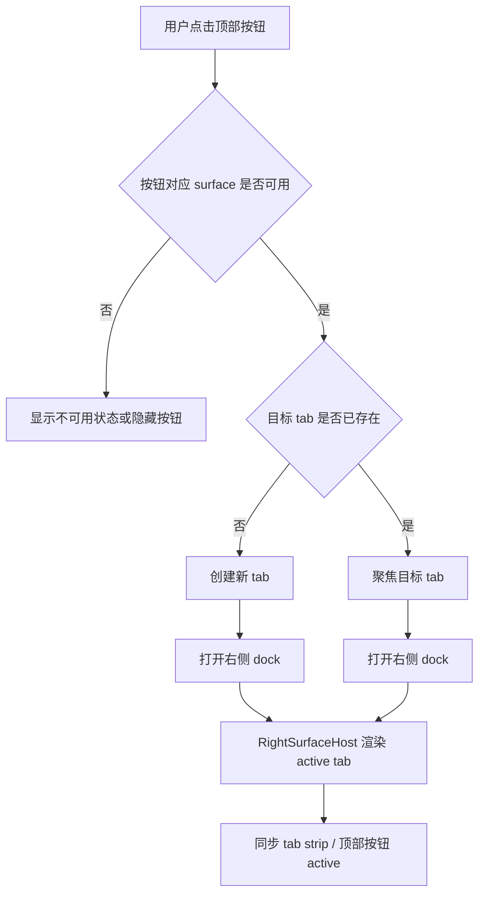

## 12. 时序图

### 12.1 点击抓夹 / 画布

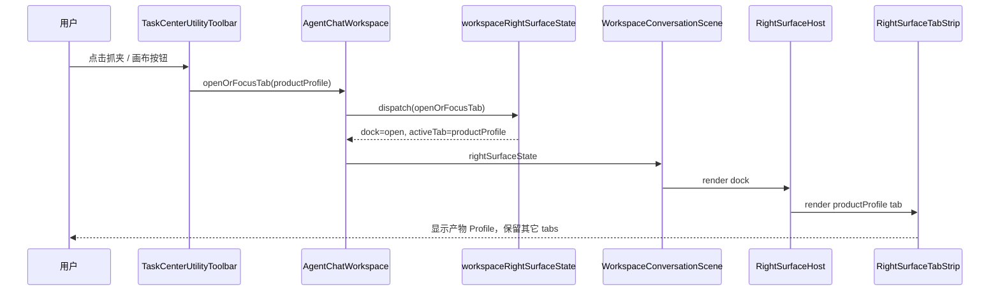

### 12.2 点击专家信息

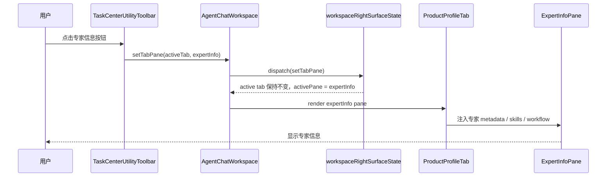

## 13. 代码架构目录规划

当前相关代码主要分散在这些位置：

| 目录 / 文件 | 当前职责 | Right Surface 改造关系 |
| --- | --- | --- |
| `src/components/agent/chat/AgentChatWorkspace.tsx` | Workspace 顶层编排，聚合会话、画布、输入、专家、运行时数据 | 保留数据聚合；逐步移除多个右栏布尔状态和直接渲染判断 |
| `src/components/agent/chat/workspace/WorkspaceConversationScene.tsx` | 聊天主场景、输入区、工具区、画布承载 | 接入 `RightSurfaceHost`，不再拥有具体 tab / pane 开关逻辑 |
| `src/components/agent/chat/workspace/WorkspaceShellScene.tsx` | Workspace shell 布局、右侧 rail / canvas 组合 | 右侧 rail 只接收统一 host，不再被专家栏或画布各自抢占 |
| `src/components/agent/chat/workspace/taskCenterSurfaceState.ts` | 现有 task center surface 状态 | 可作为 reducer 风格参考，但不继续承接所有 Right Surface 状态 |
| `src/components/agent/chat/components/TaskCenterUtilityToolbar.tsx` | 顶部工具按钮列 | 只做 launcher，不拥有 active tab truth |
| `src/components/agent/chat/experts/ExpertInfoPanel.tsx` | 专家信息展示 | 收敛为 `sideChat` tab 或 `productProfile.expertInfo` pane 的内容组件 |
| `src/features/experts/**` | 专家 catalog、runtime metadata、skill candidates | 继续做专家事实源，不进入 UI surface 状态机 |
| `src/components/agent/chat/workspace/useWorkspaceSendActions.ts` | Workspace 对话发送入口 | 后续承接 Surface -> Chat 的 structured action 组包 |
| `packages/app-server-client/**` | App Server current client 协议 | 第二阶段若开放 surface request / elicitation 才触碰 |

第一阶段建议不要继续把新文件平铺到 `workspace/` 根目录。新 Right Surface 逻辑放进子目录，根目录只保留接线入口：

```text
src/components/agent/chat/workspace/
  right-surface/
    index.ts
    rightSurfaceTypes.ts
    rightSurfaceState.ts
    rightSurfaceState.unit.test.ts
    rightSurfaceController.ts
    rightSurfaceController.unit.test.ts
    rightSurfaceCommand.ts
    rightSurfaceCommand.unit.test.ts
    rightSurfaceRegistry.ts
    rightSurfaceRegistry.unit.test.ts
    RightSurfaceHost.tsx
    RightSurfaceHost.test.tsx
    rightSurfaceScheduler.ts
    rightSurfaceScheduler.unit.test.ts
    rightSurfaceIntentQueue.ts
    rightSurfaceIntentQueue.unit.test.ts
    rightSurfaceToolbarProjection.ts
    rightSurfaceToolbarProjection.unit.test.ts
    # 后续 P3/P4 再拆
    useWorkspaceRightSurfaceRuntime.ts
    useWorkspaceRightSurfaceRuntime.test.tsx
    useRightSurfaceConversationBridge.ts
    useRightSurfaceConversationBridge.test.tsx
    surfaces/
      ProductProfileTab.tsx
      ProductProfileTab.test.tsx
      FileTab.tsx
      FileTab.test.tsx
      EvidenceTab.tsx
      EvidenceTab.test.tsx
      TerminalTab.tsx
      TerminalTab.test.tsx
      BrowserTab.tsx
      BrowserTab.test.tsx
      SideChatTab.tsx
      SideChatTab.test.tsx
      ExpertInfoPane.tsx
      ExpertInfoPane.test.tsx
    adapters/
      productProfileTabAdapter.tsx
      fileTabAdapter.tsx
      evidenceTabAdapter.tsx
      terminalTabAdapter.tsx
      browserTabAdapter.tsx
      sideChatTabAdapter.tsx
      expertInfoPaneAdapter.tsx
    testing/
      rightSurfaceTestFixtures.tsx
      rightSurfaceTestHarness.tsx

src/components/agent/chat/components/
  TaskCenterUtilityToolbar.tsx
  TaskCenterUtilityToolbar.integration.test.tsx

src/components/agent/chat/experts/
  ExpertInfoPanel.tsx

src/components/agent/chat/
  AgentChatWorkspace.tsx

internal/roadmap/rightsurface/
  README.md
```

### 13.1 目录分层规则

| 层 | 目录 / 文件 | 能依赖 | 不能依赖 |
| --- | --- | --- | --- |
| 类型层 | `rightSurfaceTypes.ts` | TypeScript type、已有 workspace 类型 | React component、DOM、App Server client |
| 状态层 | `rightSurfaceState.ts` | `rightSurfaceTypes.ts` | React、具体专家 / 画布组件 |
| 控制层 | `rightSurfaceController.ts` | registry、状态类型 | React、DOM、具体业务组件 |
| 命令层 | `rightSurfaceCommand.ts` | controller、命令 origin 映射 | 直接操作 DOM、绕过 registry 打开 tab / pane |
| 调度层 | `rightSurfaceScheduler.ts` | 状态层、request priority、user lock 信息 | DOM、具体渲染组件 |
| Intent 队列层 | `rightSurfaceIntentQueue.ts` | scheduler、pending intent、TTL prune | 直接读取 App Server、渲染 badge |
| Launcher 投影层 | `rightSurfaceToolbarProjection.ts` | registry、dock / tab state、pending intent | 具体 toolbar DOM、图标实现 |
| 注册层 | `rightSurfaceRegistry.ts` | tab / pane kind 元数据、renderer builder | reducer 内部状态 |
| Host 层 | `RightSurfaceHost.tsx` | registry、render input、layout shell | 业务数据请求 |
| Adapter 层 | `adapters/**` | 具体 tab / pane 组件、workspace render input | dock / tab reducer 细节 |
| Bridge 层 | `useRightSurfaceConversationBridge.ts` | `useWorkspaceSendActions` 的公开动作、selection payload | 直接拼 prompt、直接调用工具 DOM |
| 测试层 | `testing/**` | fixtures、render harness | 生产 runtime 副作用 |

这样拆的目的：

1. `rightSurfaceState.ts` 先保持纯函数，可用 unit test 固化 dock / tab / pane 规则。
2. `rightSurfaceController.ts` 统一 open / focus / close / pane 与 source 许可判断。
3. `rightSurfaceCommand.ts` 统一 `skill` / `mcpTool` 等外部 origin 到受控 source，不允许工具绕过 registry。
4. `rightSurfaceIntentQueue.ts` 负责 deferred intent 的 pending 队列，后续接顶部按钮 badge 和 launcher projection。
5. `rightSurfaceToolbarProjection.ts` 负责把 active tab / pending / availability 转成顶部按钮可消费的 projection。
6. `RightSurfaceHost.tsx` 只处理展示容器，不知道专家或画布业务。
7. `adapters/**` 是现有组件和新 tab / pane runtime 的防腐层，迁移时可以逐个替换。
8. `ConversationBridge` 独立出来，后续开放给 Skills / MCP tools 时不会污染 dock / tab 状态机。
9. `workspace/` 根目录只保留现有 runtime 和接线文件，避免新增一批 `useWorkspaceXxx` 文件继续平铺。

### 13.2 `rightSurfaceTypes.ts`

职责：

1. 定义 `WorkspaceRightSurfaceKind`、`WorkspaceRightSurfaceTab`、`WorkspaceRightSurfacePane`、`RightSurfaceOpenRequest`、`RightSurfaceOpenResult`。
2. 定义 tab / pane render input、availability input、toolbar button projection。
3. 定义 `RightSurfaceConversationBridgeEvent` 和 selection 类型。
4. 保持可被 App Server client / runtime 层未来复用的纯类型形状。

建议拆分边界：

```ts
export type WorkspaceRightSurfaceKind =
  | "productProfile"
  | "file"
  | "evidence"
  | "terminal"
  | "browser"
  | "sideChat"
  | "environment";

export interface RightSurfaceRuntimeSnapshot {
  dock: "closed" | "open";
  activeTabId: string | null;
  tabs: WorkspaceRightSurfaceTab[];
  pendingRequests: RightSurfaceOpenRequest[];
  userLockedTabId: string | null;
}
```

### 13.3 `rightSurfaceState.ts`

职责：

1. 管理 dock 展开状态、active tab 和 tab 列表。
2. 管理 open / focus / close / pane / unavailable 规则。
3. 不依赖 React。
4. 不依赖具体组件。

测试：

1. `openOrFocusTab(productProfile)` 新建或聚焦产物 tab。
2. `file / terminal / browser` 支持多 tab 或同类复用策略。
3. `closeDock` 只收起 dock，不销毁 tabs。
4. tab 不可用时关闭并回退到最近可用 tab。
5. `setTabPane(productProfile, expertInfo)` 只切换 pane，不关闭产物 tab。

### 13.4 `rightSurfaceScheduler.ts`

职责：

1. 接收 `RightSurfaceOpenRequest`，基于当前状态裁决 `accepted / rejected / deferred / ignored`。
2. 固化用户点击高于工具请求、foreground 高于 background、blocking 需要确认的规则。
3. 维护 `pendingRequests` 的去重、过期和 reasonCode。
4. 输出可观测结果，供 evidence / replay / GUI smoke 复盘。

不做：

1. 不渲染组件。
2. 不读取 DOM。
3. 不直接调用 `useWorkspaceSendActions`。

### 13.5 `RightSurfaceHost.tsx`

职责：

1. 接收 dock state、active tab 和 tab 列表。
2. 从 registry 解析 active tab / active pane 的渲染节点。
3. 提供统一外框、滚动、宽度、空态和 test id。
4. 不包含业务逻辑。

建议 test id：

```text
workspace-right-surface-host
workspace-right-surface-product-profile
workspace-right-surface-file
workspace-right-surface-evidence
workspace-right-surface-terminal
workspace-right-surface-browser
workspace-right-surface-side-chat
```

### 13.6 `rightSurfaceRegistry.tsx`

职责：

1. 定义 tab / pane kind 到 meta 的映射。
2. 提供按钮 label、icon、availability、render。
3. 将新增 tab / pane 的接入点集中化。

建议结构：

```ts
export interface RightSurfaceDefinition {
  kind: WorkspaceRightSurfaceKind;
  labelKey: string;
  fallbackLabel: string;
  icon: "product" | "file" | "evidence" | "terminal" | "browser" | "chat" | "environment";
  isAvailable(input: RightSurfaceAvailabilityInput): boolean;
  render(input: RightSurfaceRenderInput): ReactNode;
}
```

建议第一阶段 registry 至少注册：

| kind | adapter | 当前内容来源 |
| --- | --- | --- |
| `productProfile` | `productProfileTabAdapter.tsx` | 现有 canvas / artifact / workbench render input；内容工厂文章、图片组、分镜也进入这里 |
| `file` | `fileTabAdapter.tsx` | `workspaceFilePreview` / opened projects runtime，多文件可多 tab |
| `evidence` | `evidenceTabAdapter.tsx` | 运行证据、工具结果、MCP resource detail |
| `terminal` | `terminalTabAdapter.tsx` | 项目终端 / Shell runtime |
| `browser` | `browserTabAdapter.tsx` | Browser assist / web evidence context |
| `sideChat` | `sideChatTabAdapter.tsx` | `ExpertInfoPanel` + experts runtime metadata + 侧边上下文 |

### 13.7 `useWorkspaceRightSurfaceRuntime.ts`

职责：

1. 将 `AgentChatWorkspace` 现有的 `layoutMode`、专家 metadata、画布内容、文件预览请求映射到 dock / tab / pane action。
2. 对外暴露：

```ts
{
  rightSurfaceState,
  rightSurfaceHostNode,
  toolbarTabLaunchers,
  openOrFocusRightSurfaceTab,
  setRightSurfacePane,
  closeRightSurfaceTab,
  closeRightSurfaceDock,
}
```

3. 让 `AgentChatWorkspace` 减少直接管理多个布尔状态。

### 13.8 `useRightSurfaceConversationBridge.ts`

职责：

1. 将 Surface -> Chat 的 `quote_to_composer / attach_context / ask_follow_up / explain` 转成输入框可理解的 draft、chip 或 attachment。
2. 将 Chat -> Surface 的 turn item、artifact、MCP tool result 转成 `RightSurfaceOpenRequest`。
3. 保持结构化 action，不拼隐藏 prompt。
4. 记录 `threadId / turnId / itemId / requestId / payloadRef`，便于恢复和 replay。

建议公开接口：

```ts
export interface RightSurfaceConversationBridge {
  requestSurfaceFromTurnItem(input: TurnItemSurfaceRequestInput): RightSurfaceOpenResult;
  attachSurfaceSelection(input: AttachSurfaceSelectionInput): void;
  quoteSurfaceSelection(input: QuoteSurfaceSelectionInput): void;
  askFollowUpFromSurface(input: SurfaceFollowUpInput): void;
}
```

### 13.9 Surface adapter 目录

`surfaces/**` 放具体 UI 壳，`adapters/**` 放现有 runtime 数据到 tab / pane props 的映射：

```text
right-surface/
  surfaces/SideChatTab.tsx
  surfaces/ExpertInfoPane.tsx
  adapters/sideChatTabAdapter.tsx
  adapters/expertInfoPaneAdapter.tsx
```

拆分原则：

1. `SideChatTab.tsx` 只关心“侧聊 tab 如何展示”。
2. `ExpertInfoPane.tsx` 只关心“专家信息 pane 如何展示”。
3. `sideChatTabAdapter.tsx` / `expertInfoPaneAdapter.tsx` 负责把 `AgentChatWorkspace` 的专家数据、skill runtime evidence、launch actions 映射成 props。
4. adapter 可以临时引用旧组件；dock / tab state 不允许引用旧组件。
5. 迁移完成后可删除 adapter 中的兼容映射，但保留 registry 合同。

### 13.10 测试落点

| 文件 | 覆盖 |
| --- | --- |
| `rightSurfaceState.unit.test.ts` | dock / active tab / pane / restore 的纯解析 |
| `rightSurfaceController.unit.test.ts` | open / focus / close、source 许可、previousActiveTab |
| `rightSurfaceCommand.unit.test.ts` | `skill` / `mcpTool` origin 到 runtime source 的受控映射 |
| `rightSurfaceScheduler.unit.test.ts` | accepted / rejected / deferred / ignored、后台请求不抢焦点、用户锁定；TTL / pending badge 后续再补 |
| `rightSurfaceIntentQueue.unit.test.ts` | deferred 入队、accepted 清理同 id pending、rejected 不入队、TTL prune |
| `rightSurfaceToolbarProjection.unit.test.ts` | launcher active tab、pendingCount、disabled、collapseTarget |
| `RightSurfaceHost.test.tsx` | active tab / pane 渲染、空态、test id、宽度容器 |
| `rightSurfaceRegistry.unit.test.ts` | tab / pane kind 完整性、slot、openSources、renderer builder |
| `useRightSurfaceConversationBridge.test.tsx` | selection -> composer chip、turn item -> open request |
| `TaskCenterUtilityToolbar.integration.test.tsx` | 顶部按钮只触发 launcher，不持有 active truth |
| `WorkspaceConversationScene.test.tsx` | host 进入唯一右侧 dock，多个 tab 在同一 dock 内保留 |

### 13.11 迁移切片

| 切片 | 改动 | 退出条件 |
| --- | --- | --- |
| Slice 1 | 新增 `right-surface/` 类型、state、controller、registry 和 unit tests | dock / active tab / pane 解析与 source 许可跑通，不接复杂 UI |
| Slice 2 | 接入 `RightSurfaceHost` 和 registry，先注册 `sideChat` 与 `productProfile` | 专家信息进入 `sideChat` 或 `productProfile.expertInfo` pane，旧外层 right rail 不再承载专家 |
| Slice 3 | 补 `rightSurfaceCommand` / scheduler / intent queue / launcher projection 前端命令骨架 | Skills / MCP origin 只能映射到受控 source，后台请求入 pending，按钮状态由 projection 输出 |
| Slice 4 | 工具栏改成消费 launcher projection，并显示 pending badge | 已接入真实 `TaskCenterUtilityToolbar` props；产物、文件、证据、终端、浏览器、侧聊都按 tab 口径消费 projection |
| Slice 5 | 加入 ConversationBridge 初版 | Surface selection 能带入输入框，且不拼隐藏 prompt |
| Slice 6 | 对接 Skills / MCP intent metadata | background 请求只 badge，foreground 才可调度打开 / 聚焦 tab |
| Slice 7 | 预留 `productProfile.appSurface` pane 注册位 | 不改变中间 Claw 对话，但能承接内容工厂等 Agent App 自定义 UI |

## 14. 与现有组件的边界

### 14.1 `AgentChatWorkspace`

保留职责：

1. 聚合数据事实源。
2. 持有 `rightSurfaceDock` 状态。
3. 组装侧聊、产物、文件、证据、终端、浏览器等 tab / pane render input。

减少职责：

1. 不继续直接判断多个右栏是否同时显示。
2. 不继续把专家渲染到 `WorkspaceShellScene.rightRailNode`。

### 14.2 `WorkspaceConversationScene`

保留职责：

1. 组织聊天主区、顶部工具区、Right Surface Host。
2. 将 right surface state 和按钮状态传给 toolbar。

减少职责：

1. 不拥有专家 / 画布 / Shell 的开关业务判断。
2. 不再把某个具体业务面板写死到 `canvasContent` 外侧。

### 14.3 `TaskCenterUtilityToolbar`

保留职责：

1. 展示按钮。
2. 展示 active / expanded / disabled 状态。
3. 消费 `rightSurfaceLaunchers` projection。
4. 发出 `onOpenRightSurfaceTab(kind)` 或当前过渡期的旧 toggle handler。

减少职责：

1. 不直接维护 `expertInfoPanelVisible`、`shellPanelOpen` 等互相不知道的状态。
2. 当前过渡期允许保留旧 props fallback；后续 terminal / evidence 迁入 registry 后再删除 fallback。
3. 不决定打开一个 tab 时另一个 tab 是否关闭。

### 14.4 `CanvasWorkbenchLayout`

保留职责：

1. 渲染 `productProfile` tab 内部的文件、产物、预览、动态 pane。
2. 管理产物内部 pane，不管理 Workspace 级右侧 tab。

### 14.5 `WorkspaceShellScene`

目标职责：

1. 只做页面大壳。
2. 承载左栏、文件管理、主区域。
3. `rightRailNode` 标记为 compat / deprecated，第一阶段不再用于专家信息。

## 15. 数据流

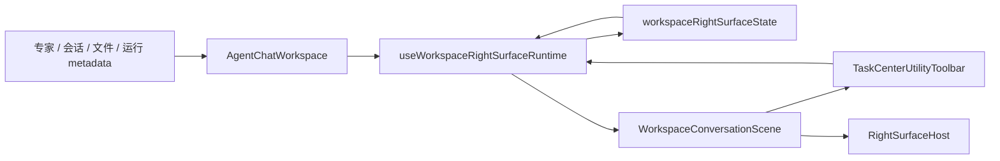

## 16. 验收标准

第一阶段完成标准：

1. 专家信息不再通过 `WorkspaceShellScene.rightRailNode` 渲染。
2. 专家信息、产物、文件、证据、终端、浏览器都只能进入同一个 Right Surface Dock。
3. 点击抓夹 / 画布时，新建或聚焦 `productProfile` tab；已有 `sideChat` tab 保留。
4. 点击专家按钮时，聚焦 `sideChat` tab，或把当前 `productProfile` tab 的 pane 切到 `expertInfo`。
5. 没有专家上下文时，专家按钮隐藏或 disabled。
6. `workspaceRightSurfaceState.unit.test.ts` 覆盖 dock / tab / pane 核心规则。
7. `TaskCenterUtilityToolbar.integration.test.tsx` 覆盖按钮 active / aria。
8. `WorkspaceConversationScene.test.tsx` 覆盖 Host 接线。
9. 至少一个 `index.workbench*.test.tsx` 覆盖侧聊 -> 产物 -> 专家 pane / 侧聊 tab 的切换。
10. GUI smoke 通过或明确记录环境阻塞。

## 17. 迁移计划

### Phase 0：冻结新右栏

规则：

1. 新增右侧辅助面板不得再直接挂 `WorkspaceShellScene.rightRailNode`。
2. 新增面板必须登记 surface kind。
3. `rightRailNode` 只允许保留已有兼容用途。

### Phase 1：抽状态机

改动：

1. 新增 `workspaceRightSurfaceState.ts`。
2. 把当前 `expertInfoPanelCollapsed`、`layoutMode !== "chat"`、文件预览、证据详情这类分散逻辑迁入 dock / tab reducer。
3. 保留现有 UI，先让测试覆盖行为。

退出条件：

1. reducer 单测通过。
2. 当前专家默认展开、点击画布打开产物 tab、关闭 dock 不销毁 tab 的行为不回退。

### Phase 2：迁移专家信息

改动：

1. 新增 `SideChatTab.tsx` 和 `ExpertInfoPane.tsx`。
2. `ExpertInfoPanel` 进入 `sideChat` tab 或 `productProfile.expertInfo` pane。
3. `WorkspaceShellScene.rightRailNode` 对专家传 `null`。
4. 顶部专家按钮聚焦 `sideChat` tab，或切换当前产物 tab 的 `expertInfo` pane。

退出条件：

1. 专家和产物不再形成两个右栏。
2. 专家入口、产物入口、专家按钮三条路径测试通过。

### Phase 3：迁移 Shell / Harness / Evidence

改动：

1. Shell / terminal 从局部 `shellPanelOpen` 迁入 tab registry。
2. Harness / evidence pack 根据实际产品形态决定是 `evidence` tab、`productProfile` pane 还是 popover。
3. 统一按钮状态和 aria。

退出条件：

1. 右侧按钮列不再存在多个互不知情的 open state。
2. Playwright 可稳定验证每个 tab 的打开 / 聚焦 / 关闭。

### Phase 4：治理清理

改动：

1. 标记或删除 `rightRailNode` 的专家用途。
2. 将 `WorkspaceShellScene` 文档更新为大壳职责。
3. 为新增 right surface 添加 lint / structure guard。

退出条件：

1. 新增右侧辅助面板必须走 registry。
2. `rightRailNode` 不再被业务面板新增引用。

## 18. 测试策略

### 18.1 单元测试

文件：

```text
src/components/agent/chat/workspace/right-surface/rightSurfaceState.unit.test.ts
```

覆盖：

1. `openOrFocusTab` 新建、复用和聚焦 tab。
2. 不可用 tab 关闭并回退。
3. route / auto / restore source 的优先级。
4. 默认专家入口打开 `sideChat` tab 的策略。
5. `setTabPane` 只切换 pane，不关闭其它 tab。

### 18.2 组件测试

文件：

```text
src/components/agent/chat/workspace/RightSurfaceHost.test.tsx
src/components/agent/chat/workspace/WorkspaceConversationScene.test.tsx
src/components/agent/chat/components/TaskCenterUtilityToolbar.integration.test.tsx
```

覆盖：

1. Host 根据 active tab / pane 渲染正确面板。
2. Toolbar 按钮 active / aria-expanded。
3. Scene 正确传递 right surface state。

### 18.3 主路径挂载测试

文件：

```text
src/components/agent/chat/index.workbench04.test.tsx
```

覆盖：

1. 专家入口默认显示 `sideChat` tab。
2. 点击画布后打开或聚焦 `productProfile` tab，`sideChat` tab 保留。
3. 点击专家后聚焦 `sideChat`，或在当前产物 tab 内打开 `expertInfo` pane。

### 18.4 GUI smoke

改动影响 Workspace / Task Center 主路径，最低门槛：

```bash
npm run verify:local
npm run verify:gui-smoke
```

如果 `verify:local` 因全仓脏改或后台进程卡住未收口，必须至少记录：

1. 定向 Vitest 结果。
2. i18n 检查结果。
3. GUI smoke 未执行原因。
4. 当前是否可以宣称产品可交付。

## 19. 风险与约束

| 风险 | 影响 | 处理 |
| --- | --- | --- |
| `AgentChatWorkspace.tsx` 已过大 | 继续加状态会恶化可维护性 | 状态机和 runtime 外提 |
| CanvasWorkbench 内部已有 tab 系统 | 可能和 Right Surface 概念混淆 | Workspace 级 Surface Tab 和 ProductProfile 内部 pane 分层 |
| Shell 当前是底部面板 | 迁移后交互变化较大 | Phase 3 单独处理，不阻塞 sideChat / productProfile 收口 |
| 文件管理可能仍需要独立侧栏 | 不是所有侧边内容都适合进 Right Surface | 第一阶段只管右侧业务辅助面 |
| 窄屏布局 | 右侧 dock 可能压缩聊天区 | Host 统一处理响应式和收起策略 |

## 20. 命名建议

避免新增品牌前缀，使用领域名：

```text
workspaceRightSurfaceState
RightSurfaceHost
rightSurfaceRegistry
useWorkspaceRightSurfaceRuntime
WorkspaceRightSurfaceKind
```

不要命名为：

```text
LimeRightSurface
limeRightRail
AgentRightDock
```

## 21. 后续开放问题

1. 聊天态专家入口是否默认打开 `sideChat`，还是只显示按钮？
   - 当前建议：专家上下文存在时默认打开 `sideChat` tab。

2. 点击当前 active tab 对应按钮后二次点击是关闭 tab、收起 dock，还是回到上一个 tab？
   - 当前建议：收起 dock 但保留 tab；如有用户路径需要，再引入 `previousActiveTabId` 恢复。

3. Shell 是否应从底部浮层完全迁入 `terminal` tab？
   - 当前建议：Phase 3 决定，先不要阻塞 `sideChat / productProfile` 收口。

4. Harness 是 `evidence` tab、popover 还是独立 dialog？
   - 当前建议：证据详情适合 tab，轻量状态适合 popover。

5. `rightRailNode` 是否最终删除？
   - 当前建议：专家迁走后标记 deprecated，等文件管理和特殊外层能力确认后再删。

## 22. 面向 Skills / MCP tools 的调度开放层

Right Surface 不应只被理解成前端布局规范。后续它还应该成为 Skills、MCP tools、Agent Runtime 和本地工作流请求“把什么展示给用户”的统一展示调度层。

固定原则：

1. Skills / MCP tools 不能直接操作 DOM、直接打开任意面板或绕过 UI 状态机。
2. 工具只能提交 Right Surface intent，例如“希望展示这个 artifact / MCP resource / expert skill evidence”。
3. UI runtime 负责判断当前应打开 tab、聚焦已有 tab、切换 pane、延迟还是只更新 pending badge。
4. 所有自动打开、拒绝、延迟和覆盖都应有可观测 reason，便于 smoke / evidence / replay 复盘。
5. 用户显式点击永远高于后台工具请求。

## 23. 展示调度请求模型

建议未来引入一个展示调度请求结构，先作为前端内部类型，后续再决定是否进入 App Server JSON-RPC 或 Runtime metadata。

```ts
export type RightSurfaceRequestSource =
  | "user"
  | "skill"
  | "mcp_tool"
  | "runtime"
  | "restore"
  | "route";

export interface RightSurfaceOpenRequest {
  requestId: string;
  source: RightSurfaceRequestSource;
  target: {
    kind: WorkspaceRightSurfaceKind;
    tabId?: string;
    pane?: WorkspaceRightSurfacePane;
  };
  reason:
    | "artifact_created"
    | "file_preview"
    | "expert_context"
    | "skill_runtime_evidence"
    | "mcp_resource_preview"
    | "tool_result_detail"
    | "user_requested"
    | "session_restore";
  priority: "background" | "normal" | "foreground" | "blocking";
  payloadRef?: {
    kind: "artifact" | "file" | "expert" | "skill" | "mcp_resource" | "tool_call";
    id: string;
  };
  ttlMs?: number;
  createdAt: number;
}

export interface RightSurfaceOpenResult {
  status: "accepted" | "rejected" | "deferred" | "ignored";
  activeTabId: string | null;
  activeTabKind?: WorkspaceRightSurfaceKind;
  reasonCode?:
    | "tab_unavailable"
    | "pane_unavailable"
    | "user_tab_locked"
    | "lower_priority"
    | "stale_request"
    | "missing_payload"
    | "already_active"
    | "dock_closed";
}
```

调度优先级建议：

| 优先级 | 来源 | 行为 |
| --- | --- | --- |
| 最高 | 用户点击 | 立即切换，覆盖其它请求 |
| 高 | 阻塞型确认 / 权限 / A2UI | 可打开，但必须明确原因 |
| 中 | 当前 turn 的 foreground skill / MCP 结果 | 可打开或聚焦当前非用户锁定 tab |
| 低 | 后台 evidence、恢复、预览建议 | 只更新按钮提示或 badge，不抢焦点 |

## 24. Skills / MCP 调度流程

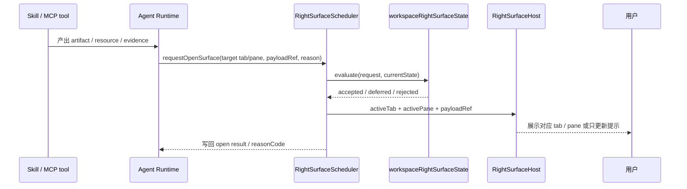

关键点：

1. Tool 只表达“希望展示”，不表达“必须打开”。
2. Scheduler 必须知道当前用户是否正在编辑输入、是否有确认面板、是否用户刚手动切换了 tab / pane。
3. 对 `background` 请求，默认不抢焦点，只在对应按钮上显示提示、badge 或 pending 状态。
4. 对 `blocking` 请求，如果会遮挡用户当前操作，需要转成确认或 toast，不直接抢右侧 tab。

## 25. 典型工具用例

| 场景 | 请求来源 | target | 调度策略 |
| --- | --- | --- | --- |
| Skill 生成代码 artifact | `skill` | `productProfile` tab | foreground 时打开，background 时只提示 |
| MCP Resource 读取结果 | `mcp_tool` | `file` 或 `evidence` tab | 若用户当前在产物编辑，默认不抢；显示资源按钮 badge |
| 专家技能 evidence 更新 | `runtime` | `sideChat` tab 或 `productProfile.expertInfo` pane | 只更新专家按钮状态，不自动覆盖产物 |
| 工具调用失败详情 | `runtime` | `evidence` tab | blocking 错误可请求打开，但用户手动锁定时延迟 |
| 从历史恢复会话 | `restore` | `productProfile` 或 `sideChat` tab | 低优先级，除非 route 明确要求 |
| 用户点击专家按钮 | `user` | `sideChat` tab 或 `expertInfo` pane | 立即打开，覆盖 pending tool 请求 |

## 26. 对外开放边界

第一阶段只做前端内部 runtime：

```text
Skill / MCP result metadata
  -> useWorkspaceRightSurfaceRuntime
  -> RightSurfaceScheduler
  -> workspaceRightSurfaceState
  -> RightSurfaceHost
```

第二阶段再评估是否暴露 App Server / Runtime current 方法。若要暴露，建议只暴露 intent 层，不暴露 DOM 或组件细节：

```text
workspaceRightSurface/requestOpen
workspaceRightSurface/readState
workspaceRightSurface/acknowledgeRequest
```

这些 method 如果未来进入协议，必须同步：

1. App Server JSON-RPC protocol。
2. `packages/app-server-client`。
3. 前端 runtime gateway。
4. current command catalog。
5. test-only mock 和 contract guard。

暂不允许：

1. MCP tool 直接调用 `openExpertPanel()` 这类组件函数。
2. Skill prompt 通过自然语言要求前端打开某个 DOM。
3. 后台工具在用户输入时强制切换右侧 surface。
4. 未带 payload provenance 的请求打开工作台。

## 27. 调度验收标准

开放给 Skills / MCP tools 前必须满足：

1. 所有 request 都有 `source / reason / priority / payloadRef`。
2. 用户点击优先级高于工具请求。
3. 后台请求不抢焦点，只能形成 pending badge。
4. 被拒绝或延迟的请求有 `reasonCode`。
5. GUI smoke 或 Playwright 能验证至少一个 Skill 产物请求打开 / 聚焦 Right Surface tab。
6. Evidence / replay 能看到 surface request 和最终处理结果。
7. 协议开放前不得绕过 App Server current 边界。

## 28. 对话与 Right Surface 的双向协作

Right Surface 不能成为对话之外的第二套产品主线。它应该和对话互相补足：

1. **对话是叙事与决策主线**：记录用户意图、Agent 解释、取舍、确认、最终结论。
2. **Right Surface 是对象化工作面**：承载 artifact、文件、专家信息、MCP resource、工具详情、证据预览和可操作表单。
3. **二者共享同一条事件事实链**：所有双向动作都必须带 `threadId / turnId / itemId / requestId / payloadRef` 中能拿到的稳定标识。
4. **交互动作结构化**：Surface 不能直接拼自然语言 prompt 写进对话；它只能提交明确 action，再由对话输入 runtime 组包。
5. **焦点由用户掌控**：后台工具结果默认形成 badge / pending marker，不覆盖用户正在阅读或编辑的 tab / pane。

推荐职责分工：

| 方向 | 行为 | 事实源 | 结果 |
| --- | --- | --- | --- |
| Chat -> Surface | 对话里的 artifact、文件、工具结果、专家建议请求打开 Right Surface | turn item / tool result / runtime metadata | `RightSurfaceOpenRequest` |
| Surface -> Chat | 用户在 surface 中选择证据、资源、专家能力或文件片段并带入对话 | active tab payload + selection | composer draft / context chip / structured action |
| Runtime -> Surface | Skill / MCP tool 产出可视对象 | App Server item / tool call / evidence export | pending badge 或打开 surface |
| Surface -> Runtime | 用户在 surface 中确认、应用、追问或拒绝 | surface action event | App Server request response 或新 turn input |
| Chat <-> Surface | 当前 turn 产生新 item，或 surface active selection 变化 | thread state + right surface state | timeline marker / active context |

关键规则：

1. `payloadRef` 是 Chat 与 Surface 之间的最小共享合同，不直接共享组件实例。
2. `selection` 是 Surface 带回对话的最小上下文，不复制整个大对象。
3. 对话输入框只接收经过 runtime 归一化的 draft / chip / attachment，不接收 Surface 直接拼出来的隐藏 prompt。
4. 用户显式点击“带入对话 / 解释 / 修复 / 应用”才会把 Surface 状态注入下一轮。
5. 如果当前有用户锁定的 surface，Chat 新产物只更新按钮提示和 timeline，不抢右栏。

## 29. 交互协议草案

建议在前端内部先定义对话桥接事件，后续再决定是否进入 App Server JSON-RPC。这个事件不是外部协议，只是 Right Surface runtime 和输入 runtime 之间的最小结构化合同。

```ts
export type RightSurfaceConversationDirection =
  | "chat_to_surface"
  | "surface_to_chat";

export type RightSurfaceConversationAction =
  | "open"
  | "quote_to_composer"
  | "attach_context"
  | "ask_follow_up"
  | "confirm"
  | "apply"
  | "explain"
  | "dismiss";

export interface RightSurfaceConversationSelection {
  kind:
    | "text"
    | "file"
    | "artifact"
    | "tool_call"
    | "mcp_resource"
    | "expert"
    | "evidence";
  id: string;
  range?: { start: number; end: number };
  preview?: string;
}

export interface RightSurfaceConversationBridgeEvent {
  eventId: string;
  direction: RightSurfaceConversationDirection;
  action: RightSurfaceConversationAction;
  sourceTurnId?: string;
  sourceItemId?: string;
  requestId?: string;
  surface: WorkspaceRightSurfaceKind;
  payloadRef?: RightSurfaceOpenRequest["payloadRef"];
  selection?: RightSurfaceConversationSelection;
  createdAt: number;
}
```

处理链路：

```text
RightSurfaceHost / SurfaceAdapter
  -> useWorkspaceRightSurfaceConversationBridge
  -> workspace input runtime / useWorkspaceSendActions
  -> composer draft 或 structured turn input
  -> App Server current turn path
```

不允许的实现：

1. Surface 直接调用 `sendMessage("请根据右侧内容继续")`。
2. MCP tool 返回自然语言指令要求前端点击某个按钮。
3. Surface 隐式把整份 artifact / resource 塞进下一轮 prompt。
4. 对话和 Surface 各自维护一套互不关联的 selected artifact 状态。

## 30. 对话协作流程图

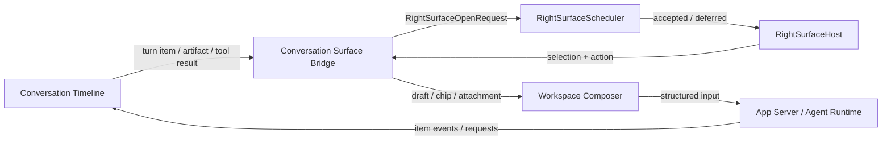

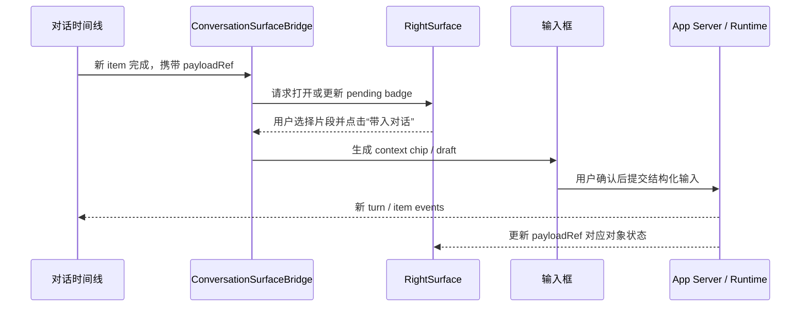

## 31. Codex ChatWidget 参考

本轮参考了本地 Codex 仓库 `/Users/coso/Documents/dev/rust/codex` 的交互痕迹，结论是 `ChatWidget` 对 Right Surface 有直接架构启发，但不应被原样照搬。

可借鉴点：

1. `codex-rs/tui/src/chatwidget.rs` 把 ChatWidget 定义为主聊天 surface：消费协议事件、构建历史 cell、维护 streaming active cell，并渲染主视口和 overlay。
2. `codex-rs/tui/src/chatwidget/protocol_requests.rs` 将 app-server request 分发到审批、权限、工具输入、MCP elicitation、guardian review 等专门交互流程。
3. `codex-rs/app-server-protocol/src/protocol/common.rs` 已有 `item/tool/requestUserInput` 和 `mcpServer/elicitation/request` 这类“后端请求客户端互动”的协议形态。
4. `codex-rs/app-server-protocol/src/protocol/v2/item.rs` 的 `ToolRequestUserInputParams` 带 `threadId / turnId / itemId / questions / autoResolutionMs`，适合作为 Lime 后续设计“请求必须绑定 turn/item”的参考。
5. `codex-rs/app-server-protocol/src/protocol/v2/mcp.rs` 的 MCP elicitation response 使用 `accept / decline / cancel`，说明工具侧互动不应直接假设用户一定接受。
6. `codex-rs/app-server/README.md` 的 `mcpToolCall` item 同时携带 `appContext.resourceUri`、`result.structuredContent`、`result._meta`，这和 Right Surface 未来展示 MCP widget / resource preview 的分层方向一致。

Lime 不照搬的点：

1. Codex TUI 的 overlay / bottom pane 是终端布局；Lime 需要的是桌面 Workspace 的右侧 dock + tab strip。
2. Codex App 的右侧工作区可以同时保留终端、浏览器、文件和侧聊等多个 tab；Lime 应借鉴“多 tab 保持上下文”，但由 Claw 中间对话继续承接主链。
3. `ChatWidget` 是单体编排器；Lime 应拆成 `RightSurfaceScheduler`、`RightSurfaceHost`、`ConversationBridge` 和各 tab / pane adapter，避免把所有交互塞进一个组件。
4. Codex 的请求多直接落到聊天交互；Lime 需要区分“对话回答”和“对象化工作面”，否则会回到右栏冲突和信息堆叠。

## 32. 互动用例

| 用例 | 触发 | Right Surface 行为 | 对话行为 |
| --- | --- | --- | --- |
| 对话生成文件 | Agent 完成 `fileChange` 或 artifact | 打开 `file` 或 `productProfile` tab，展示 diff 或预览 | 对话记录决策和摘要 |
| 用户选中专家能力 | 在 `expertInfo` pane 点击技能 | 保持 `sideChat` 或 `productProfile` tab，更新 selected skill | 输入框生成 skill chip |
| MCP resource 预览 | MCP tool 返回 resource / widget metadata | 若非用户锁定则打开 `evidence` 或 `file` tab，否则 badge | 对话保留 tool item 和结果摘要 |
| 工具失败详情 | Runtime 产生 failed tool item | 打开 `evidence` tab 或显示 pending error | 用户可点击“让对话继续修复”生成 follow-up |
| Surface 选代码片段 | 用户在 `file` tab 选中 range | 保持当前 tab selection | 输入框生成引用 chip，不复制整文件 |
| 对话要求解释右侧内容 | 用户发送“解释这个结果” | active selection 被 runtime 读取为上下文 | 新 turn 引用 selection，而不是泛指右侧 |
| MCP elicitation | MCP server 请求用户输入表单 | Right Surface 展示结构化表单或确认 | 对话形成轻量 marker，最终响应走 request response |
| 后台 evidence 更新 | Skill 产出新证据 | 按钮 badge / pending，不抢焦点 | 对话可显示一条折叠 timeline marker |

## 33. Cameo / Cowart 类交互工作台远期形态

用户参考图里的方向不是“聊天旁边放一个预览”，而是一个真正的交互应用：左侧对话保留意图和解释，右侧画布承载对象、空间关系、框选、生成结果和后续操作。Cameo README 对这个方向的描述也很明确：它是 image-first canvas，打开文件夹成为 board，用户在图上标记区域并和 Codex 连续对话，生成结果落在源图旁边，血缘可见。

这类形态对 Right Surface 的启发：

1. Right Surface 不是窄栏的同义词，它是“当前辅助工作面”的所有权模型。
2. `objectCanvas` 是 `productProfile` tab 的远期 pane / layout variant，可以升级到 expanded / canvas-first 布局，但仍然必须归属于唯一 Right Surface dock，不产生第二个物理右栏。
3. Chat 和 Object Canvas 要互相成就：Chat 负责说清楚“为什么、下一步、取舍”；Canvas 负责“指哪里、看哪个、放哪里、对比什么”。
4. 画布里的对象动作必须结构化进入对话，不靠“请根据右侧内容继续”这类隐藏 prompt。
5. Skills / MCP tools / App Server 只提交对象 mutation 或展示 intent，不直接操纵画布 DOM。

### 33.1 产品形态

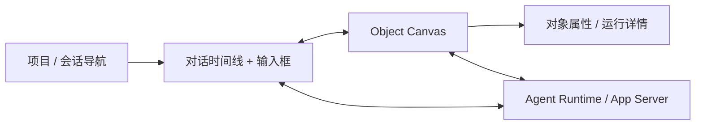

Lime 内的目标形态可以分三档：

| 档位 | 布局 | 适用场景 | 约束 |
| --- | --- | --- | --- |
| `docked` | 聊天主区 + 右侧 surface | 专家信息、文件预览、单个 artifact、工具结果详情 | 宽度克制，不承载复杂空间操作 |
| `expanded` | 聊天压缩 + 右侧大工作台 | 图片编辑、批量文件、证据图谱、MCP resource preview | 仍保留对话输入和 timeline |
| `canvasFirst` | 画布为主，对话变成左侧或浮动工作流面板 | Cameo / Cowart 类对象画布、空间编排、图像批改 | 仍由 Right Surface dock state 宣告唯一物理右侧工作区 |

### 33.2 Object Canvas 数据模型草案

```ts
export interface ObjectCanvasBoard {
  boardId: string;
  projectId?: string;
  threadId: string;
  rootPath?: string;
  title: string;
  createdAt: number;
  updatedAt: number;
}

export interface ObjectCanvasAsset {
  assetId: string;
  boardId: string;
  kind: "image" | "file" | "artifact" | "mcp_resource" | "evidence";
  sourceRef: RightSurfaceOpenRequest["payloadRef"];
  position: { x: number; y: number };
  size?: { width: number; height: number };
  contentHash?: string;
}

export interface ObjectCanvasMark {
  markId: string;
  assetId: string;
  kind: "rect" | "ellipse" | "arrow" | "brush" | "point" | "note";
  geometry: unknown;
  note?: string;
}

export interface ObjectCanvasLineageEdge {
  edgeId: string;
  fromAssetId: string;
  toAssetId: string;
  turnId?: string;
  itemId?: string;
  operation: "generate" | "edit" | "compare" | "extract" | "apply";
}
```

关键点：

1. `Board` 绑定项目 / 会话 / 文件夹，而不是一次性的聊天附件。
2. `Asset` 必须能回指 `payloadRef`，让对话、文件、MCP resource 和 evidence 能互相定位。
3. `Mark` 代表用户“指哪里”，可以被转成图片 overlay、文本引用或工具参数。
4. `LineageEdge` 记录产物来源，避免生成结果散落在聊天里失去上下文。

### 33.3 交互流

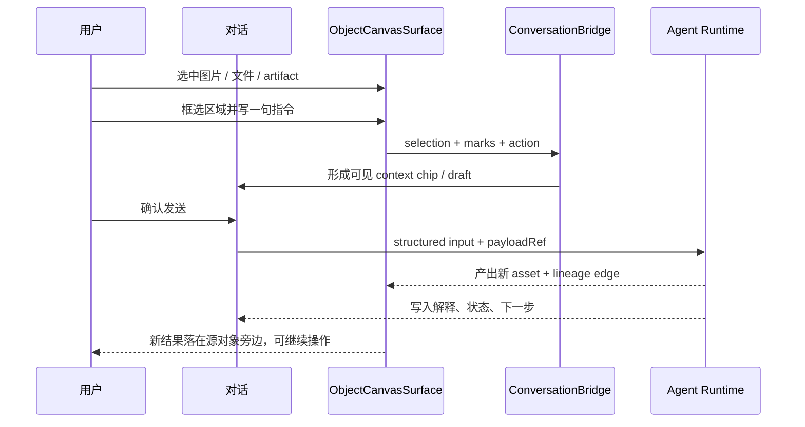

### 33.4 未来用户故事

| 故事 | 用户目标 | 期望交互 |
| --- | --- | --- |
| 图片局部修改 | 指出图片某一块并生成修改版 | 在画布上框选区域，输入自然语言，结果落在源图旁边 |
| 多图批处理 | 对多张图执行同一意图 | 框选多个 asset，选择预设或输入指令，保留每张图的独立血缘 |
| 文件证据图谱 | 把工具结果、文件、日志、截图放到同一工作面 | 从对话或工具结果拖入 canvas，连线形成证据关系 |
| MCP widget 预览 | 让 MCP resource 不只是聊天文本 | resource 以对象卡 / iframe / preview 进入 canvas，用户可带入对话 |
| 交付复盘 | 回看某个产物是怎么来的 | 点击 lineage edge 查看 turn、tool call、输入 selection 和输出 |

### 33.5 实现边界

第一阶段不要直接实现 Cameo 级画布，只做架构预留：

1. `objectCanvas` pane kind 可以进入 type / registry，但默认隐藏。
2. Right Surface state 要支持 `layoutVariant: "docked" | "expanded" | "canvasFirst"`，但第一阶段只使用 `docked`。
3. ConversationBridge 必须支持 selection / mark / payloadRef 的结构化 action。
4. 如果未来嵌入外部本地画布服务，只能通过受控 adapter 和 App Server current 协议，不把 `localhost` URL 当产品事实源。
5. Cameo 是 AGPL-3.0-or-later 项目；Lime 只能借鉴交互思想，不能在未评估许可证的情况下复制实现代码或资产。

远期验收标准：

1. 画布里任意 asset 都能定位到来源 turn / item / file / MCP resource。
2. 从画布发起的追问在对话中可见，不产生隐藏上下文。
3. Agent 产物回到画布时有可见 lineage。
4. 用户切回侧聊、文件、终端时，Object Canvas 所在 `productProfile` tab 保留或进入 pending，不产生第二个右栏。
5. GUI smoke / Playwright 能验证一次“选择对象 -> 带入对话 -> Runtime 产出 -> 画布出现新对象”的闭环。

## 34. 参考资料与设计启发

这些资料只作为设计启发，不是 Lime 的实现依赖：

1. AG-UI Protocol 文档强调 agent 与 UI 之间通过事件流同步消息、工具调用、状态和用户交互，启发 Right Surface 使用显式 event / state，而不是组件间互相调用。
2. Model Context Protocol Elicitation 说明 server 可以通过 client 请求用户结构化输入，启发 Skills / MCP tools 只能提出互动 intent，最终由 Lime 客户端裁决并返回结构化响应。
3. Vercel AI SDK UI 的 tool invocation / generative UI 模式把工具结果作为客户端渲染组件的数据源，启发 Right Surface 把 tool result 和 UI component 分层。
4. OpenAI Apps SDK 的 tool result 分为 `structuredContent`、`content` 和 `_meta`，且 component resource 可声明 widget metadata，启发 Right Surface 保持“模型可见内容”和“组件私有展示数据”分层。
5. Codex 本地 `ChatWidget` 和 app-server protocol 说明当前 Codex App / CLI 已有“后端请求客户端互动”的路径，Lime 后续可以借鉴 request / response、turn/item 绑定、accept/decline/cancel 的协议形状。
6. Cameo / Cowart 类产品说明 image-first canvas、board、region mark、continuous Codex session、visible lineage 等交互模型，启发 Lime 的远期 `objectCanvas` pane / layout variant。

参考入口：

1. `https://docs.ag-ui.com/`
2. `https://modelcontextprotocol.io/specification/2025-06-18/client/elicitation`
3. `https://ai-sdk.dev/docs/ai-sdk-ui`
4. `https://developers.openai.com/apps-sdk/reference/`
5. `/Users/coso/Documents/dev/rust/codex/codex-rs/tui/src/chatwidget.rs`
6. `/Users/coso/Documents/dev/rust/codex/codex-rs/tui/src/chatwidget/protocol_requests.rs`
7. `/Users/coso/Documents/dev/rust/codex/codex-rs/app-server-protocol/src/protocol/common.rs`
8. `/Users/coso/Documents/dev/rust/codex/codex-rs/app-server-protocol/src/protocol/v2/item.rs`
9. `/Users/coso/Documents/dev/rust/codex/codex-rs/app-server-protocol/src/protocol/v2/mcp.rs`
10. `https://github.com/hAcKlyc/cameo`

## 35. 当前主线收益

这条路线图直接服务一个主线目标：

**把 Workspace 里所有右侧辅助信息从“多个独立右栏并存”收敛为“一个单 dock、多 tab、可注册、可测试的 Right Surface”，让专家、画布、Shell、证据和后续新增面板都遵守同一套 dock / tab / pane 状态规则。**

进一步的主线收益是：

**Right Surface 会成为 Skills / MCP tools / Agent Runtime 的展示调度控制面。工具只提交展示 intent，UI 统一裁决是否打开、延迟、拒绝或只提示，从而让自动化结果可见但不抢用户焦点。**

再进一步，Right Surface 必须和对话形成互补闭环：

**对话保存意图、解释和决策；Right Surface 保存对象、预览和操作。二者通过结构化事件桥接，而不是靠隐藏 prompt、DOM 操作或独立状态互相猜测。**
