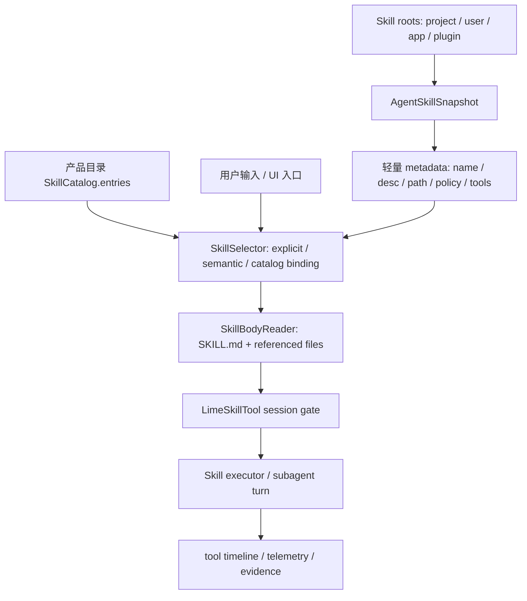

# Lime Agent Skills 按需加载重构方案

> 状态：实施中  
> 更新时间：2026-06-23  
> 目标：对标 Codex 的 Agent Skills 体验，把 Lime 的 skills 从“命令 / 工作流显式放行后才能用”重构为“轻量可发现、按需读取、适当触发、可审计执行”的 current 运行时能力。

当前状态先看：[status.md](status.md)。快速执行骨架见：[execution-skeleton.md](execution-skeleton.md)。后续先按状态判断是否还需要动 runtime 基础设施，再回到本文查细节历史。

2026-06-22 快速收口：P0-P5 runtime 骨架已存在；专家 `needs_registration` 恢复动作已补到 Skills 用户安装页，并带目标搜索预填。它仍只是定位 / 处理入口，不是自动注册或自动修复 binding。

2026-06-23 快速收口：`needs_registration` 恢复动作继续补到 scaffold 创建骨架，会带项目级草稿进入 Skills 工作台并自动打开创建表单；项目级 `skillLocal/scaffold/create` 会写 `.lime/registration.json`，让新 Skill 自然进入 `workspaceSkillBindings/list` 的 `ready_for_manual_enable` 投影；Skills 工作台创建成功后会刷新已保存技能与 binding readiness。它仍不恢复 retired `capability_draft_register`，也不会自动注入 Query Loop 或运行时工具面。

2026-06-23 快速收口：`needs_mapping / blocked` 已补区分恢复入口骨架；待映射引用打开“补齐技能目录映射”，不可用引用打开“替换当前技能引用”。这仍不是 `catalog locator` / `service_scene_launch.skill_locator` 的后端写回完成态。

2026-06-23 快速收口：新增 `smoke:expert-skills-live-gate` 作为专家 Skills 总体验收门禁；默认只读 deterministic Electron fixture 证据并返回 `pending_live_provider`，不会调用真实模型，也不会把 fixture 证据误报为 live Provider 已通过。

2026-06-23 快速收口：新增 `smoke:expert-skills-live-runner` 骨架；默认 fail-fast，不触发真实模型。显式 `--allow-live-provider` 后可归一化已有 live summary，或在额外传 `--execute-live-runtime` 时通过 App Server current JSON-RPC 提交真实 Provider turn，输出可被 `smoke:expert-skills-live-gate -- --live-summary <path>` 消费的 summary。

## 1. 结论

Lime 当前不是没有 skills，而是缺少一条 Agent 回合内的 **skills discovery / selection / injection** 主链。

现状里 `SkillCatalog.entries`、技能中心、ServiceSkill、`LimeSkillTool` 和本地 `global_registry` 都各自存在，但它们分别服务产品目录、显式执行、工作流 gate 或管理 UI。它们没有像 Codex 一样在普通 Agent turn 中先暴露轻量 metadata，再由模型在任务匹配时读取对应 `SKILL.md`，最后只把被选中的 skill 正文注入或执行。

因此本专题的主线不是继续新增单个 `@xxx` 命令，也不是默认把所有 skills 全量暴露给模型，而是补一层 current 的 **Agent Skills Runtime**：

`技能根发现 -> 轻量索引快照 -> turn 内候选渲染 / 检索 -> 显式或隐式选择 -> SKILL.md 按需读取 -> 会话级执行授权 -> timeline / telemetry 记录`

## 2. 对标 Codex 后的主要差距

### 2.1 Lime 现状

1. Agent 初始化会把 Lime skills 加载到 aster-rust `global_registry`，代码注释甚至写着“使 AI 能够自动发现和调用这些 Skills”，但同一初始化路径又用 `LimeSkillTool` 覆盖默认 SkillTool，避免通用对话默认暴露全部本地 Skills。见：
   - `lime-rs/crates/agent/src/aster_state.rs`
   - `lime-rs/crates/agent/src/aster_state_support.rs`
   - `lime-rs/crates/agent/src/tools/skill_tool_gate.rs`
2. `LimeSkillTool` 的 current 目标是安全 gate：未启用 session access 时拒绝执行；启用后再按 allowlist 裁剪。这保证安全，但没有提供“自然发现、自然选择、按需读取正文”的体验。
3. `lime-rs/crates/skills/src/skill_loader.rs` 已能解析 `SKILL.md`、`allowed_tools`、`when_to_use`、workflow 等字段，但 `load_skills_from_directory` 只按目录直接扫描一级 skill，缺少 Codex 那种 per cwd / per config snapshot、禁用规则、路径 alias、预算渲染和隐式索引。
4. `lime-rs/crates/skills/src/skill_matcher.rs` 只有关键词式 `when_to_use_config` 匹配，且没有成为 Agent turn 的 current 决策入口；它更像未接主链的辅助器。
5. `lime-rs/crates/aster-rust/crates/aster/src/agents/skills_extension.rs` 有 `loadSkill` 工具和简版 instructions，但这仍是 extension 内部能力，不等于 Lime App Server runtime 的统一事实源。
6. 产品目录 current 是 `SkillCatalog.entries`，负责首页、输入区、slash、技能中心等 UI 可发现性；但它不等于 Agent Skills runtime。把产品目录当执行事实源会继续造成“UI 能看到，Agent 不自然用”的假入口。

### 2.2 Codex 关键机制

Codex 的体验来自几层协同，而不是某一个“Skill 工具”：

1. 官方 Codex Skills 文档把 progressive disclosure 定义为：初始上下文只放 skill name、description、file path，只有决定使用某个 skill 时才读取完整 `SKILL.md`。
2. 初始 skills 列表有预算上限：最多使用模型上下文窗口约 `2%`，未知窗口时上限 `8000` 字符；skills 很多时先缩短 description，再必要时省略部分 skill。
3. 隐式触发依赖 `description`，因此 description 必须前置关键使用场景、触发词和边界；这也是 Lime 专家 Skills 后续要把“有用、好用、易用”落到 authoring lint / scaffold 模板的原因。
4. Codex 支持显式调用和隐式调用：显式如 `$skill` / selector；隐式由任务匹配 description 决定。Lime 当前对应 `skill_search / selector`，不能回退成全量注入 body。
5. 可选 scripts / references 只在选中 skill 后按需使用；这个思想可复用到 Lime 的技能查找：先让模型搜索轻量 skill metadata，再按需读取或启用某个 skill。

## 3. 事实源分类

| Surface | 当前分类 | 后续定位 |
| --- | --- | --- |
| `SkillCatalog.entries` / `client/skills` / seeded catalog | `current` | 产品可发现目录，继续驱动首页、输入区、slash 和技能中心 |
| `lime-rs/crates/services/src/skill_service.rs` | `current` | 技能安装、管理、检查、本地/远程包 UI 数据源 |
| `lime-rs/crates/skills/src/skill_loader.rs` | `current`，但需收敛 | 作为 Agent Skills metadata / body parser 的基础；需要补 snapshot、scope、policy 和预算渲染 |
| `LimeSkillTool` session gate | `current` | 继续作为执行安全边界；不再承担发现和选择职责 |
| `global_registry` 全局注册 | `compat` | 短期继续给 aster SkillTool / extension 使用；中期收口到 per-session snapshot + registry adapter |
| `SkillMatcher` 关键词匹配 | `compat` | 可作为候选排序信号之一，不再单独决定是否执行 |
| `skills_extension` 简版 instructions / `loadSkill` | `compat` | 可复用读取能力，但 current owner 应迁到 App Server Agent runtime |
| 单功能 `@搜索/@配图/...` 首刀硬编码 skill | `deprecated` 趋势 | 保留产品入口，但首刀选择应回到统一 Agent Skills Runtime，不继续为每个 skill 单独堆特殊规则 |

## 4. 目标架构



固定职责：

1. `SkillCatalog.entries` 只负责产品入口，不负责读取 `SKILL.md` 正文。
2. `AgentSkillSnapshot` 是 Agent turn 可用技能的 current 事实源，包含 scope、path、enabled、policy、metadata、body locator，不包含全部正文。
3. `SkillSelector` 负责把用户输入、结构化 metadata、命令 binding、显式 `$skill` 或 slash scene 解析成候选 skill。
4. `SkillBodyReader` 只在候选确认后读取完整 `SKILL.md`；相对引用按 skill 目录解析。
5. `LimeSkillTool` 继续守住执行授权；被选中的 skill 必须写入 session allowlist 或 structured skill injection，不能回到“全局裸暴露”。
6. telemetry 必须区分 `explicit`、`implicit`、`catalog_bound`、`runtime_suggested` 四类 invocation。

## 5. 分阶段重构

### P0：补 current 设计合同

目标：先把“Lime skills 应该如何自然加载”固定为 runtime 合同，避免继续在单功能命令里散落特殊逻辑。

任务：

1. 新增 `AgentSkillSnapshot` / `AgentSkillMetadata` / `AgentSkillBodyLocator` 类型设计。
2. 固定 skill roots 顺序：project `.agents/skills` > user `.agents/skills` > app data skills > plugin / marketplace cache。
3. 固定禁用与冲突规则：同名多来源必须保留 scope / path，普通名字只有唯一时才允许自然匹配。
4. 固定 budget 策略：默认只注入 metadata，不注入 body；body 读取必须有显式选择或高置信候选。
5. 固定 invocation 事件字段：`skill_name`、`scope`、`path`、`source`、`trigger_type`、`selection_reason`、`session_id`、`turn_id`。

验收：

- 文档与类型测试覆盖上述字段。
- 不改变现有 `LimeSkillTool` 安全默认值。

### P1：实现轻量 snapshot 与 metadata 渲染

目标：让每个 Agent turn 先拿到“有哪些 skills 可用”的低成本视图。

任务：

1. 在 `lime-rs/crates/skills` 或独立子模块中实现 `AgentSkillSnapshotService`，复用 `skill_loader`，避免再新增平行 parser。
2. 支持 per cwd / per config cache，避免继续只靠 `global_registry`。
3. 提供 `render_available_agent_skills(snapshot, budget)`，对标 Codex 的 2% 上下文预算策略，但文案要符合 Lime 中文 runtime。
4. 将 metadata 渲染接入 App Server Agent turn system/developer context，默认只列 name、description、path alias、scope 和触发规则。
5. 加 contract / unit test 覆盖预算截断、同名冲突、project 优先、无 skill 空渲染。

验收：

- 普通聊天不暴露所有 SkillTool 执行面，但模型能看到轻量 skills metadata。
- 大量 skills 时不会把 system prompt 撑爆。

### P2：实现按需选择与读取

目标：当用户明显点名或任务匹配某个 skill 时，只读取那个 `SKILL.md`。

任务：

1. 实现 `collect_explicit_skill_mentions` 的 Lime 版本，支持：
   - `$skill-name`
   - `/skill-name`
   - `@` 目录项绑定的 skill id
   - `skill://.../SKILL.md`
   - 本地 `SKILL.md` 路径
2. 把 `SkillMatcher` 降级为候选排序信号之一：只提供 `score / reason`，不直接触发执行。
3. 新增 `read_agent_skill_body(locator)`，按路径读取完整 `SKILL.md`，并按 skill 内 instructions 选择必要 referenced files。
4. 将读取结果注入当前 turn 的 developer/context fragment，或者写入 session allowlist 后由 `Skill(...)` 工具执行。
5. timeline 中显示“已加载 Skill: name”，并允许 UI 展开本次读取的 `SKILL.md`。

验收：

- 用户说“用 $foo 处理这段内容”时，模型会读取 `foo/SKILL.md` 后再执行。
- 用户任务明显匹配某个 description 时，可以加载该 skill；同名或低置信候选必须不自动执行。
- 未选中的 skills 不读取正文。

### P3：统一执行 gate 与产品目录绑定

目标：把产品入口、Agent 选择、执行授权收成一条链。

任务：

1. `SkillCatalog.entries.kind=command/scene/skill` 增加稳定的 `linkedSkillId` / `skillLocator` 映射，网关层生成 AgentSkill candidate，而不是在各组件里写硬编码首刀。
2. `@搜索/@深搜/@研报/@读PDF/@总结/@翻译/@分析/@配图` 等现有命令只负责写结构化 launch metadata；skill 选择交给统一 runtime。
3. 当 selector 决定执行某个 skill 时，写入 `set_skill_tool_session_allowed_skills` 或更细的 source allowlist。
4. 对 `allowed_tools` 做双层裁剪：skill manifest 声明的 allowed tools 与当前 turn 工具面取交集，禁止 skill 自行扩大权限。
5. 统一 failure：找不到 skill、skill disabled、同名冲突、body read failed、工具不满足都产出结构化错误，不再表现为模型空转或提示用户“请改用 /skill-name”。

验收：

- 产品入口触发的 skill 和用户自然语言触发的 skill 使用同一条读取 / 授权 / 执行链。
- 生产路径没有 mock fallback。
- `LimeSkillTool` 默认仍 fail-closed。

### P4：隐式归因、检索和治理守卫

目标：把 skills 使用变成可观测、可治理、可防回流的能力。

任务：

1. 对标 Codex `detect_implicit_skill_invocation_for_command`：当 Agent 读取某个 `SKILL.md` 或运行其 `scripts/` 下文件时，归因到对应 skill。
2. 增加 `skill_search` 或复用现有 ToolSearch 思路，对大量技能做 BM25 / lexical metadata 搜索；模型先搜 metadata，再读取 body。
3. 增加治理守卫：
   - 禁止新命令绕过 AgentSkillSnapshot 直接读取 app data skill。
   - 禁止生产路径绕过 `LimeSkillTool` gate 执行 skill。
   - 禁止新增单功能硬编码 `Skill(name)` 首刀而不经过 selector。
4. event / evidence 导出补 `skill_invocation`、`skill_body_read`、`skill_gate_decision`。

验收：

- GUI timeline 能解释“为什么用了这个 skill”。
- evidence 能复盘本回合使用了哪个 skill、从哪里加载、读取了哪些文件、允许了哪些工具。
- 守卫能阻止新的并行加载路径。

## 6. 关键设计约束

1. 不恢复“默认暴露全部本地 Skills”。这是安全倒退。
2. 不把 `SkillCatalog.entries` 当 `SKILL.md` body 的事实源；它只是产品目录投影。
3. 不让模型首刀自由写 shell 来找 skill。搜索和读取必须是结构化 runtime 能力。
4. 不继续为每个 `@xxx` 命令写专属 skill 启动逻辑；命令只提供 launch metadata。
5. 不新增第二套 parser。`skill_loader` / `SkillService::inspect_skill_dir` 是现有解析基础，重构应复用并收敛。
6. 大技能包只读取必要文件；progressive disclosure 是硬规则，不是性能优化项。
7. 项目 skill 优先，但同名冲突不能静默覆盖；必须带 scope / locator。
8. Windows / macOS 路径要同时支持；locator 内部使用规范化路径，用户可见 UI 展示短路径或 alias。

## 7. 验证计划

最小验证按触碰面选择：

1. Rust 单元测试：
   - snapshot root 优先级
   - metadata budget
   - mention / path 解析
   - 同名冲突
   - body read fail-open / fail-closed 规则
   - gate allowlist 裁剪
2. 契约测试：
   - App Server JSON-RPC skills runtime 方法
   - 前端 `SkillCatalog.entries` 到 `linkedSkillId` 的映射
   - tool timeline metadata
3. GUI 回归：
   - 用户自然语言触发 skill
   - 用户 `$skill` 显式触发
   - 技能中心入口触发同一 skill
   - 展开查看本次读取的 `SKILL.md`
4. 推荐命令：

```bash
cargo test --manifest-path "lime-rs/Cargo.toml" -p lime-skills
cargo test --manifest-path "lime-rs/Cargo.toml" -p lime-agent skill
npm run test:contracts
npm run verify:gui-smoke
```

## 8. 完成标准

本专题完成时应满足：

1. 普通 Agent turn 能看到受预算限制的 skills metadata。
2. 用户显式点名 skill 时能按需读取对应 `SKILL.md`。
3. 用户未点名但任务明显匹配时，selector 能给出可解释候选，并只在安全阈值内加载。
4. 产品目录入口和自然语言入口进入同一条 skill runtime。
5. `LimeSkillTool` 仍默认关闭，只有 selector / 产品入口 / workspace gate 明确授权后才能执行。
6. GUI timeline 与 evidence 能复盘 skill 选择、读取、授权、执行全过程。
7. 单功能硬编码 skill 首刀不再继续扩张。

## 9. 当前最值得先做的一刀

P5 专家 Skills 骨架已经接入 current 主链：`expert.skillRefs -> AgentSkillSnapshot -> selector -> SKILL.md body read -> LimeSkillTool gate -> Evidence Pack`。下一刀不再从 runtime 基础设施重做，而是补专家易用性和真实质量验证。

当前最高杠杆缺口：

1. `needs_registration` 自动创建 / 修复 `workspaceSkillBindings`，而不是只跳转到 Skills 管理页。
2. `needs_mapping / blocked` 从“替换 ref”推进到“一键补 catalog locator / service_scene_launch.skill_locator”的命令闭环。
3. live Provider 专家真实任务 gated 验收，证明真实模型在大量 skills 场景下会先 `skill_search`，再只读取并授权被选中的 skill。

## 10. 实施日志

### 2026-06-21：P1 轻量 snapshot 与 metadata 渲染

已完成：

1. 在 `lime-rs/crates/skills` 新增 `AgentSkillSnapshot`、`AgentSkillMetadata`、`AgentSkillRoot`、`AgentSkillScope`。
2. 复用 `skill_loader::load_skills_from_directory` 解析 `SKILL.md` frontmatter 与 `SkillService::inspect_skill_dir` 结果，不新增第二套 parser。
3. 新增 `render_available_agent_skills(snapshot, budget)`，只输出 name、display、description、scope、path、when_to_use、argument_hint、declared_tools 等 metadata，不输出正文。
4. 在 App Server runtime backend 的 turn system prompt 中追加 `<skills_instructions>` metadata section；接入点位于 AGENTS 指令之后、memory / soul / request tool policy 之前。
5. workspace root / working dir 下的 `.agents/skills` 优先进入 snapshot，然后再合并现有 `get_skill_roots()` 返回的 project / user / app roots。
6. 保持 `LimeSkillTool` 默认 fail-closed：P1 不设置 `allow_model_skills`，不写 session allowlist，不改变 tool surface。

已验证：

```bash
cargo test --manifest-path "lime-rs/Cargo.toml" -p lime-skills agent_
cargo test --manifest-path "lime-rs/Cargo.toml" -p app-server session_config_appends_project_agent_skills_metadata_to_system_prompt
cargo test --manifest-path "lime-rs/Cargo.toml" -p app-server agent_skills_context
```

仍未完成：

1. P1 还没有实现 per cwd / per config 缓存；当前为每个 turn 同步扫描 roots，后续可在 App Server runtime 配置边界加快照缓存。
2. P2 还没有实现隐式高置信候选自动读取，也没有读取 `SKILL.md` 内引用的必要 reference files；当前只处理用户显式选择。
3. P3 尚未把 `SkillCatalog.entries` 的 `linkedSkillId / skillLocator` 与 selector、session allowlist 打通。

### 2026-06-21：P2 显式选择与 `SKILL.md` 按需读取

已完成：

1. 在 `lime-rs/crates/skills` 新增 `AgentSkillSelection`、`AgentSkillSelectionTrigger`、`AgentSkillBodyLocator`、`AgentSkillBody`。
2. 新增 `select_explicit_agent_skills(user_input, snapshot)`，支持：
   - `$skill-name`
   - `/skill-name`
   - `@skill-name`
   - `skill://.../SKILL.md`
   - Markdown link 形式 `[skill](skill://.../SKILL.md)`
   - 本地 `.../SKILL.md` 路径
3. 同名 skill 冲突时不自动选择，避免静默覆盖 project / user / app scope。
4. 新增 `read_agent_skill_body(locator)`，只接受真实 `SKILL.md` locator，并读取完整 markdown body。
5. 新增 `render_selected_agent_skill_bodies(bodies, budget)`，把被用户显式选择的 `SKILL.md` 正文注入 `<selected_skill_instructions>`，同时明确不扩大 SkillTool 权限。
6. App Server runtime backend 在普通 turn system prompt 中先追加显式选择的 skill body，再追加轻量 metadata；无显式选择时不会读取正文。
7. 保持 `LimeSkillTool` 默认 fail-closed：P2 不写 session allowlist，不设置 `allow_model_skills`，不改变默认 tool surface。

已验证：

```bash
cargo test --manifest-path "lime-rs/Cargo.toml" -p lime-skills agent_
cargo test --manifest-path "lime-rs/Cargo.toml" -p lime-skills agent_selection
cargo test --manifest-path "lime-rs/Cargo.toml" -p app-server agent_skills_context
cargo test --manifest-path "lime-rs/Cargo.toml" -p app-server session_config_appends_explicit_agent_skill_body_to_system_prompt
cargo test --manifest-path "lime-rs/Cargo.toml" -p app-server session_config_does_not_append_skill_body_without_explicit_selection
```

仍未完成：

1. `@` 目录项到 `linkedSkillId / skillLocator` 的稳定绑定仍属于 P3；当前 P2 只支持 `@skill-name` 显式点名。
2. `SkillMatcher` 还没有作为 score / reason 候选信号接入，未实现“任务明显匹配时自动读取正文”。
3. timeline / telemetry 还没有新增 `skill_body_read` 或“已加载 Skill”事件；这属于 P2 后半与 P4 evidence 工作。
4. 还没有根据 `SKILL.md` 内引用自动读取必要 `references/` 文件；后续需要实现受预算的 reference file progressive disclosure。

### 2026-06-21：P3 第一刀，runtime enable 接入 SkillTool session gate

已完成：

1. 在 App Server runtime backend 新增 `skill_runtime_enable` 模块，读取当前 turn 的 `request_metadata.harness.workspace_skill_runtime_enable`，并兼容 `workspaceSkillRuntimeEnable`。
2. 只接受 `source=manual_session_enable` 与 `approval=manual`，保持生产路径 fail-closed。
3. 只授权当前 workspace 下的一级注册目录：`workspace_root/.agents/skills/<directory>`；拒绝绝对目录、`..` 逃逸、注册目录不匹配、缺少 `source_draft_id` 或缺少 `source_verification_report_id` 的 binding。
4. 在 `RuntimeBackend::handle_turn_start` 早期把当前 turn metadata 投影到 `LimeSkillTool` session source allowlist；合法 binding 会授权 `project:<directory>` / `<directory>`，未列入 allowlist 的 Skill 调用仍由 `LimeSkillTool` 拒绝。
5. 使用 turn-scoped guard 在 runtime turn 结束或异常返回时清理当前 session SkillTool gate，避免一次显式授权长期残留。
6. 未新增 App Server JSON-RPC method、未改前端 metadata builder、未写入 `allow_model_skills`，继续走 `agentSession/turn/start` current 主链。

已验证：

```bash
cargo test --manifest-path "lime-rs/Cargo.toml" -p app-server skill_runtime_enable
cargo test --manifest-path "lime-rs/Cargo.toml" -p lime-agent skill_tool_gate
cargo test --manifest-path "lime-rs/Cargo.toml" -p app-server agent_skills_context
cargo test --manifest-path "lime-rs/Cargo.toml" -p app-server session_config_appends_explicit_agent_skill_body_to_system_prompt
cargo test --manifest-path "lime-rs/Cargo.toml" -p app-server session_config_does_not_append_skill_body_without_explicit_selection
npm test -- --run src/components/agent/chat/utils/workspaceSkillBindingsMetadata.test.ts
npm test -- --run src/components/agent/chat/utils/harnessRequestMetadata.test.ts
```

验证缺口：

```bash
npm run test:contracts
```

当前失败在既有 `src/lib/api/agentRuntimeEvents.ts` 合同漂移：`scripts/check-app-server-client-contract.mjs` 报告缺少 `handler({ payload: projectedPayload })` 片段。该文件不属于本轮 skills P3 写集，且工作树已有未归属改动；本轮不顺手修复。

仍未完成：

1. `SkillCatalog.entries.linkedSkillId / skillLocator` 还没有进入统一 selector；产品目录入口和自然语言入口尚未完全收敛。
2. 现有 `@搜索/@深搜/@研报/@读PDF/@总结/@翻译/@分析/@配图` 等入口还需要继续只写结构化 launch metadata，由 unified selector 负责 skill candidate。
3. `allowed_tools` 还没有按 “skill manifest 声明 ∩ 当前 turn 工具面” 做统一裁剪。
4. runtime enable / body read / invocation 还没有产出 `skill_gate_decision`、`skill_body_read`、`skill_invocation` timeline / telemetry 事件。

### 2026-06-21：P3 第二刀，显式 Agent Skill 选择接入 turn-scoped allowlist

已完成：

1. `agent_skills_context` 新增 `explicit_agent_skill_names_for_turn(...)`，复用 P2 的 snapshot 与 `select_explicit_agent_skills(...)`，不新增第二套 selector。
2. `skill_runtime_enable` 在没有合法 `workspace_skill_runtime_enable` 时，会把本 turn 显式命中的 `$skill` / `/skill` / `@skill` / `skill://.../SKILL.md` 结果写入 `set_skill_tool_session_allowed_skills(...)`。
3. 显式选择只授权被唯一命中的 skill 名称及 `project:<name>` alias；未选中的 skill 继续被 `LimeSkillTool` 拒绝。
4. workspace runtime enable 优先级高于显式选择：如果本 turn 已带合法 `workspace_skill_runtime_enable`，只使用 source allowlist，不把 `$skill` 额外混入授权范围。
5. 继续使用 turn-scoped guard 清理 session gate，避免显式 `$skill` 授权跨 turn 残留。
6. 为现有 MCP dirty 改动补了两处最小编译缺省值：`McpServerConfig` fallback 初始化补 `scopes/oauth/oauth_resource=None`，只为恢复 App Server 定向测试编译，不改变 MCP 行为语义。

已验证：

```bash
cargo test --manifest-path "lime-rs/Cargo.toml" -p app-server skill_runtime_enable
cargo test --manifest-path "lime-rs/Cargo.toml" -p lime-agent skill_tool_gate
cargo test --manifest-path "lime-rs/Cargo.toml" -p app-server agent_skills_context
npm test -- --run src/components/agent/chat/utils/workspaceSkillBindingsMetadata.test.ts
npm test -- --run src/components/agent/chat/utils/harnessRequestMetadata.test.ts
```

验证缺口：

```bash
npm run test:contracts
```

仍失败在既有 `src/lib/api/agentRuntimeEvents.ts` 合同漂移：`scripts/check-app-server-client-contract.mjs` 报告缺少 `handler({ payload: projectedPayload })` 片段。该文件仍不属于本轮 skills P3 写集。

仍未完成：

1. `SkillCatalog.entries.linkedSkillId / skillLocator` 还没有进入统一 selector；`@` 产品目录项目前仍只支持按 skill name 显式点名。
2. `allowed_tools` 还没有按 skill manifest 与当前 turn tool surface 做交集裁剪。
3. timeline / telemetry 仍未产出 `skill_gate_decision`、`skill_body_read`、`skill_invocation`。
4. 隐式高置信 matcher、reference file progressive disclosure、per cwd / per config cache 仍未实现。

### 2026-06-21：P3 第三刀，catalog-bound selector 与 `allowed_tools` 裁剪

已完成：

1. 在 `lime-rs/crates/skills` 新增 `select_agent_skills_by_name_candidates(...)`，把结构化候选选择收敛到 P2 selector，而不是在 App Server 里重复匹配逻辑。
2. 新增 `AgentSkillSelectionTrigger::CatalogBinding`，用于区分 `$skill` / `/skill` / `@skill` 显式选择和 `SkillCatalog / service_scene_launch` 绑定选择。
3. selector 支持稳定别名匹配：
   - skill `name`
   - skill 目录 basename
   - `local:<name>`
   - `project:<name>`
   - `display_name` 仅做裸匹配，不给 `local:` / `project:` 前缀，避免展示名误命中。
4. App Server runtime backend 读取当前 turn metadata 中的：
   - `harness.service_scene_launch.service_scene_run.skill_key`
   - `harness.service_scene_launch.service_scene_run.linked_skill_id`
   - `harness.service_scene_launch.service_scene_run.skill_id`
   - camelCase alias：`serviceSceneLaunch / serviceSceneRun / skillKey / linkedSkillId / skillId`
5. catalog-bound selection 会在 system prompt 注入对应 `<selected_skill_instructions>`，因此从 scene / ServiceSkill 入口进入的回合也会按需读取对应 `SKILL.md`，不再只看到轻量 metadata。
6. `skill_runtime_enable` 在没有合法 `workspace_skill_runtime_enable` 时，会把 catalog-bound selection 与显式 selection 的结果一起写入 turn-scoped `set_skill_tool_session_allowed_skills(...)`；unknown metadata 保持 fail-closed。
7. workspace runtime enable 仍保持最高优先级：如果本 turn 已带合法 `workspace_skill_runtime_enable`，只使用 source allowlist，不混入 `$skill` 或 catalog-bound selection。
8. selected skill 的 manifest `allowed_tools` 会投影到 Aster `TurnContextOverride.metadata.tool_scope.allowed_tools`，复用现有 Aster tool-scope 过滤能力，对当前 turn 已有工具面做收窄；不反向启用未在当前 runtime surface 中注册或未由 request policy 启用的工具。
9. 未新增 App Server JSON-RPC method，未恢复 legacy runtime，未写 `allow_model_skills`，继续走 `agentSession/turn/start` current 主链。

已验证：

```bash
cargo test --manifest-path "lime-rs/Cargo.toml" -p lime-skills agent_selection
cargo test --manifest-path "lime-rs/Cargo.toml" -p app-server agent_skills_context
cargo test --manifest-path "lime-rs/Cargo.toml" -p app-server skill_runtime_enable
cargo test --manifest-path "lime-rs/Cargo.toml" -p app-server session_config_projects_selected_skill_allowed_tools_to_turn_scope
cargo test --manifest-path "lime-rs/Cargo.toml" -p app-server session_config_does_not_project_tool_scope_for_unknown_skill_metadata
```

仍未完成：

1. 前端 `SkillCatalog.entries` 尚未新增稳定 `skillLocator` 字段；当前 App Server 先消费已有 `service_scene_launch` metadata 的 `skill_key / linked_skill_id / skill_id`。
2. timeline / telemetry 还没有 `skill_gate_decision`、`skill_body_read`、`skill_invocation`。直接新增 backend event 需要同步前端 runtime event projection，否则 GUI 不会完整可见；应作为 P4 第一刀成组实现。
3. 隐式高置信 matcher 尚未接入；当前自动读取仍只覆盖显式文本选择与结构化 catalog-bound metadata。
4. `SKILL.md` references progressive disclosure 与 per cwd / per config cache 仍未实现。

### 2026-06-21：P4 第一刀，Skill runtime 最小可观测性

已完成：

1. 新增 App Server runtime backend `agent_skills_telemetry` 模块，复用 P3 的 selector 与 snapshot，不新增第二套匹配路径。
2. 当本 turn 通过 `$skill` / `/skill` / `@skill` / `skill://.../SKILL.md` 或 `service_scene_launch` 选中 skill 时，发出 `runtime.status` 事件：
   - `metadata.skillRuntime.event = "skill_body_read"`
   - `skillName`
   - `trigger`
   - `reason`
   - `skillFilePath`
   - `status = loaded | failed`
   - `bodyChars` 或 `error`
3. 当本 turn 对 `LimeSkillTool` 写入 allowlist 时，发出 `runtime.status` gate 事件：
   - `metadata.skillRuntime.event = "skill_gate_decision"`
   - `mode = "workspace_runtime_enable" | "selected_skills"`
   - `workspaceRuntimeEnable`
   - `sourceAllowlist`
   - `selectedSkills`
4. 事件类型复用已有 `runtime.status`，不新增前端事件协议；现有 App Server event stream 会把它投影为 `runtime_status`，GUI 可通过 runtime status surface 看见技能加载 / 授权事实。
5. telemetry 只记录事实，不改变 prompt 注入、SkillTool gate、tool surface 或 `allow_model_skills`；unknown metadata 不发事件，避免噪声。

已验证：

```bash
cargo test --manifest-path "lime-rs/Cargo.toml" -p app-server agent_skills_telemetry
cargo test --manifest-path "lime-rs/Cargo.toml" -p lime-skills agent_selection
cargo test --manifest-path "lime-rs/Cargo.toml" -p app-server agent_skills_context
cargo test --manifest-path "lime-rs/Cargo.toml" -p app-server skill_runtime_enable
cargo test --manifest-path "lime-rs/Cargo.toml" -p app-server session_config_projects_selected_skill_allowed_tools_to_turn_scope
cargo test --manifest-path "lime-rs/Cargo.toml" -p app-server session_config_does_not_project_tool_scope_for_unknown_skill_metadata
npm run test:contracts
```

仍未完成：

1. `skill_search` / 大量技能检索仍未实现；当前隐式 matcher 只适合小规模 snapshot 的高置信候选，不替代 metadata 检索工具。
2. 治理守卫仍需补：禁止新增单功能硬编码 Skill 首刀、禁止绕过 AgentSkillSnapshot 直接读 app data skill、禁止绕过 `LimeSkillTool` gate 执行。
3. 前端 `SkillCatalog.entries` 尚未新增稳定 `skillLocator` 字段；当前 App Server 仍先消费已有 `service_scene_launch` metadata 的 `skill_key / linked_skill_id / skill_id`。

### 2026-06-21：P4 第二刀，真实 invocation、隐式 matcher、references 与 snapshot cache

已完成：

1. 在 App Server evidence provider 中从真实 ToolResult metadata 提取 `skill_invocation`，来源包括 `tool_family=skill`、`skill_name`、`workspace_skill_source` 与 `workspace_skill_runtime_enable`，并写入 `observabilitySummary.skill_invocations`。
2. completion audit 现在会把真实 SkillTool 调用计入 `workspaceSkillToolCallCount` 与 `requiredEvidence.workspaceSkillToolCall`，不再只依赖 selection / gate 事实。
3. 前端 evidence projection 新增 `AgentRuntimeEvidenceSkillInvocation`，把 App Server camelCase / snake_case 输出统一投影为 `observability_summary.skill_invocations`。
4. Harness Evidence Pack 卡片在存在 skill invocation 时展示具体 skill 名称与状态，作为 GUI/evidence 专门投影的最小闭环。
5. `select_implicit_agent_skills(...)` 接入 current selector：无显式选择 / catalog binding 时，才允许唯一高置信候选自动读取 `SKILL.md`；同名或低置信仍 fail-closed。项目 skill 在高置信近似同分时优先于 app/user 默认 skill，但不静默覆盖同名冲突。
6. `read_agent_skill_body(...)` 支持 progressive disclosure：只读取 `SKILL.md` 正文中明确出现的 `references/...` 相对文件，限制最多 `3` 个、单文件 `16KB`，并要求 canonical path 保持在 skill 目录内。
7. `render_selected_agent_skill_bodies(...)` 会把已加载 references 附到 `<selected_skill_instructions>` 里，仍受统一 body budget 限制。
8. `AgentSkillSnapshot` 增加进程内轻量 cache，按 roots path / scope / root mtime / 一级 `SKILL.md` mtime 签名失效，减少每 turn 重复扫描。
9. 未新增 App Server JSON-RPC method，未恢复 legacy runtime，未写 `allow_model_skills`，仍走 `agentSession/turn/start` current 主链与 `LimeSkillTool` fail-closed gate。

已验证：

```bash
cargo test --manifest-path "lime-rs/Cargo.toml" -p lime-skills agent_
cargo test --manifest-path "lime-rs/Cargo.toml" -p app-server agent_skills_context
cargo test --manifest-path "lime-rs/Cargo.toml" -p app-server agent_skills_telemetry
cargo test --manifest-path "lime-rs/Cargo.toml" -p app-server skill_runtime_enable
cargo test --manifest-path "lime-rs/Cargo.toml" -p app-server export_evidence_records_skill_invocation_from_tool_metadata
npm test -- --run src/lib/api/agentRuntime/appServerEvidenceExportProjection.test.ts
npm test -- --run src/components/agent/chat/components/HarnessStatusPanel.exports.test.tsx
```

仍未完成：

1. `skill_search` / BM25 metadata 检索仍未实现；大量 skills 场景下仍只靠 metadata prompt 与高置信 lexical matcher。
2. 治理守卫仍需补齐，防止后续绕过 AgentSkillSnapshot / selector / SkillTool gate。
3. 前端 `SkillCatalog.entries.skillLocator` 仍未稳定落字段。

### 2026-06-21：P4 第三刀，metadata 检索排序与防回流守卫

已完成：

1. 在 `lime-rs/crates/skills` 新增 `agent_search` 纯逻辑模块，提供 `search_agent_skills(...)` 与 `reorder_agent_skill_snapshot_for_query(...)`。
2. 检索只消费轻量 metadata：`name / display_name / description / when_to_use / argument_hint / allowed_tools`；不读取 `SKILL.md` 正文，不设置 session allowlist，不改变 `LimeSkillTool` fail-closed 默认值。
3. App Server `agent_skills_context` 在渲染 `<skills_instructions>` 前按用户输入对 snapshot 做 metadata lexical / BM25-like 排序，让大量 skills 场景中相关 skill 更容易进入 prompt 预算窗口；selector 仍按显式 / catalog-bound / 唯一高置信隐式规则决定是否读取正文。
4. 新增治理测试 `src/lib/governance/agentSkillsRuntimeBoundary.test.ts`，守住 4 条边界：
   - Agent turn runtime backend 不得绕过 `AgentSkillSnapshot` 直接 `get_skill_roots / load_skills_from_directory / load_skill_from_file`。
   - `SKILL.md` 正文读取只允许挂在 `agent_skills_context / agent_skills_telemetry` 的 selection 链路之后。
   - `set_skill_tool_session_allowed_skills / set_skill_tool_session_allowed_skill_sources` 只能由 `skill_runtime_enable` 写入。
   - 生产代码不能绕过 `LimeSkillTool` 直接注册原始 `SkillTool::new()`。
5. 同一守卫还阻止 runtime backend 新增长期硬编码 `Skill(name)` 首刀，防止单功能入口继续绕过统一 selector。
6. 未新增 App Server JSON-RPC method，未恢复 legacy runtime，未写 `allow_model_skills`，未改变产品目录入口；仍走 `agentSession/turn/start` current 主链。

已验证：

```bash
cargo test --manifest-path "lime-rs/Cargo.toml" -p lime-skills agent_search
cargo test --manifest-path "lime-rs/Cargo.toml" -p app-server agent_skills_context
cargo test --manifest-path "lime-rs/Cargo.toml" -p app-server agent_skills_telemetry
cargo test --manifest-path "lime-rs/Cargo.toml" -p app-server skill_runtime_enable
npm test -- --run src/lib/governance/agentSkillsRuntimeBoundary.test.ts
```

仍未完成：

1. 前端 `SkillCatalog.entries.skillLocator` 仍未稳定落字段；当前 App Server 仍先消费 `service_scene_launch.service_scene_run.skill_key / linked_skill_id / skill_id`。
2. 本轮没有补 GUI smoke；已有 Rust 定向测试与治理守卫证明 backend / boundary 收口，但还不能把完整 GUI 主路径宣称为已冒烟。
3. `skill_search` 目前是 metadata lexical / BM25-like 排序，不是模型可调用的独立 `skill_search` tool；若后续 skills 数量继续增长，可在同一 `AgentSkillSnapshot` 事实源上开放结构化 search tool，但不得绕过 selector / body reader / `LimeSkillTool` gate。

### 2026-06-21：P3/P4 收尾刀，catalog `skillLocator` 进入产品入口到 runtime selector 主链

已完成：

1. `SkillCatalog.entries` 新增稳定 `skillLocator` 字段，覆盖 `skill` entry、`scene` entry、`command.binding`，支持 `catalog / project / user / app / other` source 与 `directory / skillFilePath` locator 信息。
2. `skillCatalog` parser 支持 camelCase / snake_case：`skillLocator / skill_locator`，并在旧版 raw catalog 没有 locator 时从 `skillId / linkedSkillId` 推导 `{ source: "catalog", name }`，让 legacy 输入兼容，但不恢复旧执行路径。
3. Base Setup 显式 `scene_catalog` 与 `command_catalog` projection 现在会生成 `skillLocator`；为避免 `skillCatalog.ts` 初始化循环，projection 模块只做 type-only import，并在本地构造简单 catalog locator。
4. `serviceSkillSceneLaunch` 会把 scene entry 的 `skillLocator` 透传到 `harness.service_scene_launch.service_scene_run.skill_locator`；增长 / 配音命令的 resolver 也会透传 fallback catalog locator。
5. App Server `agent_skills_context` selector 优先读取 `service_scene_run.skill_locator / skillLocator` 的 `name / directory / skillFilePath`，再回退旧 `skill_key / linked_skill_id / skill_id`，产品目录入口和自然语言入口继续收敛到同一条 Agent Skills Runtime。
6. 兼容输入只停留在 catalog parse / projection 层；执行仍走 `agentSession/turn/start` current 主链、`AgentSkillSnapshot` selector、按需 `SKILL.md` body reader 与 `LimeSkillTool` fail-closed gate。

已验证：

```bash
npm test -- --run src/lib/api/skillCatalog.test.ts src/components/agent/chat/workspace/serviceSkillSceneLaunch.test.ts
npm test -- --run src/lib/governance/agentSkillsRuntimeBoundary.test.ts
npm run typecheck -- --pretty false
npm run test:contracts
npm run smoke:agent-runtime-current-fixture
npm run verify:gui-smoke
```

仍未完成：

1. `skill_search` 仍是 prompt metadata 排序能力，不是模型可主动调用的结构化 search tool；如后续 skills 数量继续膨胀，下一刀应在同一 snapshot 事实源上补可治理的 search 工具。

补充收口：

1. 已关闭本节原 typecheck 缺口：Agent Chat streaming / message timeline 测试 fixture 现在补齐 `AgentToolCallState.startTime`、`AgentThreadUserMessageItem.content` 与 `AgentThreadItem[]` 强类型。
2. `agentStreamEventProcessor` 的 tool-use metadata helper 改为从 `object` 安全读取可选 envelope 字段，兼容当前 `AgentEventToolStart / End / Progress / Delta` 类型没有公共 envelope 字段的协议形状。
3. `messageListTimelineContentParts` 修复了稀疏 timeline reasoning 合并时 `null < timestamp` 的隐式转换问题；带 `metadata.sequence` 的完成态 hydrate 工具过程现在能按 sequence 把中间 reasoning 插回 WebSearch / WebFetch 之间。

新增验证：

```bash
npm test -- --run src/components/agent/chat/components/messageListTimelineContentParts.unit.test.ts src/components/agent/chat/projection/messageTimelineRenderProjection.test.ts src/components/agent/chat/hooks/agentStreamRuntimeHandler.test.ts src/components/agent/chat/hooks/agentSessionState.test.ts
npm run smoke:agent-runtime-current-fixture
npm run verify:gui-smoke
```

### 2026-06-21：验证收口与 current / compat / deprecated / dead 口径

当前结论：

1. P0-P4 的 current 主链已经具备可用闭环：`AgentSkillSnapshot` 轻量 metadata、显式 / catalog-bound / 唯一高置信选择、`SKILL.md` 按需读取、referenced files progressive disclosure、turn-scoped `LimeSkillTool` allowlist、`allowed_tools` 裁剪、telemetry / evidence 导出与 GUI Evidence Pack 投影均已接入。
2. `SkillCatalog.entries.skillLocator` 已进入产品目录、Base Setup projection、scene launch metadata 与 App Server selector；产品入口和自然语言入口继续收敛到同一条 Agent Skills Runtime，而不是为每个 `@xxx` 或 slash skill 增加单独首刀。
3. `LimeSkillTool` 仍保持 fail-closed；未恢复“默认暴露全部本地 Skills”，也未让生产路径回退到 mock / legacy runtime。
4. `skill_search` 已升级为模型可主动调用的结构化 metadata search tool；它仍只返回 locator / reason，不读取 body、不写 allowlist、不代表执行授权。

分类：

| Surface | 分类 | 当前口径 |
| --- | --- | --- |
| `AgentSkillSnapshot` / metadata render / selector / body reader / runtime enable / telemetry | `current` | Agent turn 内 skills 自然发现、选择、读取、授权和审计的唯一主链 |
| `SkillCatalog.entries.skillLocator` | `current` | 产品入口到 runtime selector 的稳定 locator，不读取 body、不执行 skill |
| `LimeSkillTool` session gate | `current` | 执行安全边界，默认 fail-closed，仅接收 selector / runtime enable 的 allowlist |
| `global_registry` / aster skills extension / 旧 `loadSkill` 风格入口 | `compat` | 只保留存量适配，不作为新增业务逻辑事实源 |
| `SkillMatcher` 单独关键词决策 | `compat` | 只能作为排序 / 候选信号，不单独触发 body read 或执行授权 |
| 单功能硬编码 `Skill(name)` 首刀 | `deprecated` | 不继续扩张；入口应只写 structured launch metadata |
| 生产路径绕过 snapshot / selector / `LimeSkillTool` gate 直接读写或执行 skill | `dead / forbidden` | 由 `agentSkillsRuntimeBoundary.test.ts` 守卫防回流 |

最终验证：

```bash
npm test -- --run src/lib/governance/agentSkillsRuntimeBoundary.test.ts src/lib/api/skillCatalog.test.ts src/lib/base-setup/seededCommandPackage.test.ts src/lib/base-setup/compat/commandCatalogProjection.test.ts src/components/agent/chat/workspace/serviceSkillSceneLaunch.test.ts src/components/agent/chat/team-workspace-runtime/liveRuntimeProjector.test.ts src/components/agent/chat/team-workspace-runtime/runtimeEventSubscriptions.test.ts src/components/agent/chat/components/AgentThreadTimeline.test.tsx src/components/agent/chat/components/AgentThreadTimeline.reasoning.test.tsx src/components/agent/chat/components/AgentThreadTimelineViewModel.unit.test.ts
npx eslint src/components/agent/chat/team-workspace-runtime/liveRuntimeProjector.test.ts src/components/agent/chat/components/AgentThreadTimelineViewModel.ts src/components/agent/chat/components/AgentThreadTimelineViewModel.unit.test.ts src/lib/governance/agentSkillsRuntimeBoundary.test.ts src/lib/api/skillCatalog.test.ts src/lib/base-setup/seededCommandPackage.test.ts src/lib/base-setup/compat/commandCatalogProjection.test.ts src/components/agent/chat/workspace/serviceSkillSceneLaunch.test.ts --max-warnings 0
npm run test:contracts
npm run smoke:agent-runtime-current-fixture
npm run verify:gui-smoke
```

验证说明：

1. `npm run verify:local` 曾完整推进到 Vitest 第 56 批并暴露两个与本主线相邻的测试隔离 / UI 安全问题：live runtime copy 的 locale 泄漏、completed reasoning 默认 inline 泄露正文。两处均已通过定向测试修复。
2. 中断恢复后，`verify:local` smart 模式只看到 `test-results/.last-run.json` 并 no-op，因此最终以显式定向测试 + contracts + current fixture + GUI smoke 作为本轮可交付证据。
3. `smoke:agent-runtime-current-fixture` 已覆盖 history/cache hydration、final_done 工具收尾、Claw 终态 UI、Electron fixture guard、Coding Workbench Electron fixture、Claw GUI current fixture guard 与 cancel-then-continue。
4. `verify:gui-smoke` 已完成 Electron renderer / host build、App Server 初始化、Claw workbench shell ready 与 memory settings ready。

剩余下一刀：

1. 若继续扩大 GUI 可见行为，再补“自然语言触发 skill / `$skill` 显式触发 / 技能中心入口触发同一 skill”的端到端 Playwright 证据。
2. 若继续证明大量 skills 场景，再补真实 GUI / fixture 证据：模型先调用 `skill_search`，再选择一个候选读取 `SKILL.md`，最后只授权被选中的 skill。

### 2026-06-21：P4 第四刀，结构化 `skill_search` tool

已完成：

1. 在 `lime-rs/crates/agent/src/tools/skill_search_tool.rs` 新增 `skill_search` Agent native tool，并在 Agent 初始化时注册到 current runtime 工具面。
2. `skill_search` 复用 `AgentSkillSnapshot` 与 `search_agent_skills(...)`，按当前 turn metadata / `ToolContext` 解析 workspace scope，优先使用 `project_root / working_directory / cwd`，再降级到工具上下文工作目录。
3. 工具输出只包含 metadata：`name / displayName / description / scope / directory / skillFilePath / locator / declaredTools / matchedTerms / reason / score`；不调用 `read_agent_skill_body(...)`，不读取 `SKILL.md` 正文或 references，不写入 `set_skill_tool_session_allowed_*`。
4. `skill_search` 已进入 `NATIVE_TOOL_CATALOG`，分类为 `current / LimeInjected / SkillExecution / SessionAllowlist / workspace_default_allow=true`；prompt 工具指南明确它只用于候选选择，不代表执行授权。
5. 治理守卫 `agentSkillsRuntimeBoundary.test.ts` 增加 `skill_search` 边界断言，防止后续把它改成 body reader 或 gate writer。

分类更新：

| Surface | 分类 | 当前口径 |
| --- | --- | --- |
| `skill_search` Agent native tool | `current` | 模型可主动调用的 Agent Skill metadata 检索入口，只返回 locator / reason，不读取 body、不授权执行 |
| `AgentSkillSnapshot` / `search_agent_skills(...)` | `current` | `skill_search` 与 prompt metadata 排序共享的唯一检索事实源 |
| `ToolSearch` | `current`，但非 Skills owner | 继续只用于 deferred extension / MCP 工具搜索，不承接 Agent Skill metadata 检索 |

已验证：

```bash
cargo test --manifest-path "lime-rs/Cargo.toml" -p lime-agent skill_search_tool
cargo test --manifest-path "lime-rs/Cargo.toml" -p lime-agent test_tool_catalog_entries_for_surface_counts_and_lifecycle_boundaries
cargo test --manifest-path "lime-rs/Cargo.toml" -p lime-agent test_build_tool_inventory_marks_visibility_and_mappings
cargo test --manifest-path "lime-rs/Cargo.toml" -p lime-skills agent_search
```

仍未完成：

1. 尚未做真实 GUI / Playwright 证据证明模型会在大量 Skills 场景中主动调用 `skill_search` 后再触发 selector；当前本刀只证明 tool surface、metadata 返回和边界守卫。
2. 若 `skill_search` 结果后续要在 GUI timeline / Evidence Pack 中单独展示，需要补前端 projection；当前只通过普通 tool result metadata 暴露 `tool_family=skill_search`。

### 2026-06-22：P5D 第一刀，ExpertInfoPanel 技能运行准备度产品化

目标：

把 P5C 已跑通的专家 Skills runtime 全链路，继续向“专家用户能看懂、能处理、能继续试用”的产品闭环推进。Codex 官方手册对 Agent Skills 的关键口径是 progressive disclosure：初始上下文只放 `name / description / path`，只有选中 skill 后才读取完整 `SKILL.md`；skill description 决定隐式触发质量，且大量 skills 时必须受预算约束。Lime 本轮 UI 没有改变底层协议，而是把这条 current 主链在专家面板里变成可见状态。

已完成：

1. `ExpertInfoPanel` 技能区新增“本轮运行准备”摘要，基于 `ExpertSkillRuntimeCandidate.readiness` 汇总：
   - 全部可运行
   - 部分可运行、部分需处理
   - 全部不可运行
   - 空绑定
2. 对每个非 ready 技能显示处理动作：
   - `needs_mapping`：补目录映射
   - `needs_registration`：完成注册
   - `blocked`：检查引用
3. 面板接入 `threadItems` 的 `metadata.skillRuntime` 宽松读取，能显示最近是否出现过：
   - `skill_body_read`
   - `skill_gate_decision`
   - `skill_search`
   这只读展示 runtime trace，不写 allowlist、不读 `SKILL.md`、不改变 `agentSession/turn/start`。
4. `AgentChatWorkspace` 把 current `effectiveThreadItems` 传给 `ExpertInfoPanel`，让专家右栏可以消费同一条聊天时间线的技能 runtime 状态。
5. 新增 / 扩展纯 view model：
   - `buildExpertSkillRuntimeSummaryViewModel`
   - `buildExpertSkillRuntimeActionViewModels`
   - `buildExpertSkillRuntimeTraceViewModel`
   复杂状态判断没有塞回 React 挂载测试。
6. 同步五语言文案 `zh-CN / zh-TW / en-US / ja-JP / ko-KR`，新增文案保持 presentation 层，不把协议 enum 本地化。
7. 保持 P5C Electron fixture 依赖的稳定选择器：
   - `expert-info-skill-chip-*`
   - `expert-info-skill-readiness-*`
   - `expert-info-skills-add`

事实源分类：

| Surface | 分类 | 当前口径 |
| --- | --- | --- |
| `expert.skillRefs` | `current / declaration only` | 专家声明的技能绑定，不等于执行 allowlist |
| `ExpertSkillRuntimeCandidate` / `ExpertInfoPanel` runtime summary | `current` | 专家面板的运行准备度投影，只读解释状态 |
| `threadItems.metadata.skillRuntime` trace 展示 | `current / projection` | 只读展示最近 runtime 状态，不改变授权或执行 |
| `LimeSkillTool` session gate | `current` | 唯一执行安全边界，仍默认 fail-closed |
| deterministic external fixture backend | `test fixture` | 只用于 GUI current fixture，不是生产 mock fallback |
| legacy `agent_runtime_*` | `dead / forbidden` | 不允许作为专家 Skills 主链或回归证据 |

已验证：

```bash
npm test -- --run src/components/agent/chat/experts/expertSkillRuntimeViewModel.unit.test.ts src/components/agent/chat/experts/ExpertInfoPanel.test.tsx
npx eslint src/components/agent/chat/experts/expertSkillRuntimeViewModel.ts src/components/agent/chat/experts/expertSkillRuntimeViewModel.unit.test.ts src/components/agent/chat/experts/ExpertInfoPanel.tsx src/components/agent/chat/experts/ExpertInfoPanel.styles.ts src/components/agent/chat/experts/ExpertInfoPanel.test.tsx src/components/agent/chat/AgentChatWorkspace.tsx src/lib/api/agentProtocol.ts --max-warnings 0
npm run detect-translations -- --resources-dir src/i18n/resources --source-locale zh-CN
git diff --check -- src/components/agent/chat/experts/expertSkillRuntimeViewModel.ts src/components/agent/chat/experts/expertSkillRuntimeViewModel.unit.test.ts src/components/agent/chat/experts/ExpertInfoPanel.tsx src/components/agent/chat/experts/ExpertInfoPanel.styles.ts src/components/agent/chat/experts/ExpertInfoPanel.test.tsx src/components/agent/chat/AgentChatWorkspace.tsx src/lib/api/agentProtocol.ts src/i18n/resources/zh-CN/agentExperts.json src/i18n/resources/zh-TW/agentExperts.json src/i18n/resources/en-US/agentExperts.json src/i18n/resources/ja-JP/agentExperts.json src/i18n/resources/ko-KR/agentExperts.json
npm test -- --run src/components/agent/chat/index.workbench04.test.tsx
```

验证说明：

1. `npm run typecheck -- --pretty false` 运行约 4 分钟无错误输出但未收口，已手动中止；本轮不能把全量 typecheck 记为通过。
2. 本轮没有重跑 `expert-panel-skills-runtime` Electron fixture，因为没有改 App Server runtime、fixture backend、selector、SkillTool gate 或已跑通的专家 fixture 选择器；GUI 风险由 `ExpertInfoPanel` 组件测试与 `index.workbench04.test.tsx` 覆盖。
3. WebSearch 普通搜索没有拿到可引用结果；已通过 `openai-docs` 技能的 Codex manual helper 获取当前官方手册，并只记录官方 progressive disclosure 口径。Context7 本轮没有暴露可调用工具，未作为验证事实。

仍未完成：

1. 专家面板还没有直接展示 Evidence Pack 的真实 `skill_invocations`；当前只读 `threadItems.metadata.skillRuntime`，能覆盖 body read / gate / search trace。下一刀应从当前 evidence projection 或已导出的 observability summary 接入真实 ToolCall invocation。
2. “安装 / 试用 / 换技能 / 继续无该技能”还不是完整按钮闭环；本轮先给出状态和动作提示，未新增导航命令，避免扩散到 Skills 工作台路由。
3. 若继续扩大 GUI 可见行为，需要重跑：
   - `node scripts/agent-runtime/claw-chat-current-fixture-smoke.mjs --scenario expert-panel-skills-runtime --prefix claw-chat-current-fixture-expert-panel-skills-runtime --timeout-ms 180000`
   - 必要时补 Playwright 真点击证据。

### 2026-06-22：P5D 第二刀，ExpertInfoPanel 展示最近真实技能执行

目标：

把 P5D 第一刀的“运行准备度 / 授权与加载 trace 可见”，继续推进到用户能直接看懂“最近有没有真的执行过技能”。本刀不新增 App Server method、不改变 SkillTool gate、不把 `expert.skillRefs` 当 allowlist，只消费当前聊天线程里已经投影出来的 `tool_call` metadata。

已完成：

1. `expertSkillRuntimeViewModel.ts` 新增 `buildExpertSkillRuntimeInvocationViewModel`，只从 `threadItems` 中的真实 `tool_call` 提取技能执行状态：
   - `metadata.tool_family / toolFamily = skill`
   - `metadata.skill_name / skillName`
   - `metadata.skill_source / skillSource = SKILL.md`
   - 通用 `Skill / SkillTool / LoadSkill / LimeRunServiceSkill` 工具名
2. 最近执行状态被归一成 presentation VM：
   - `completed`：最近已执行技能
   - `running`：最近正在执行技能
   - `failed`：最近技能执行失败
   - `unknown`：最近技能执行状态待确认
   - `none`：最近还没有技能执行记录
3. `ExpertInfoPanel` 技能摘要卡新增 `expert-info-skills-runtime-invocation` 行，展示最近技能执行状态和用户可识别的技能名，不暴露 `tool_family`、`skill_name` 等内部字段。
4. 组件仍保留 P5C / P5D 第一刀使用的稳定选择器：
   - `expert-info-skills-runtime-summary`
   - `expert-info-skills-runtime-trace`
   - `expert-info-skills-runtime-actions`
   - `expert-info-skill-chip-*`
   - `expert-info-skill-readiness-*`
   - `expert-info-skills-add`
5. 单元测试覆盖成功、失败、空执行记录；组件测试覆盖真实 `tool_call` metadata 中的 `project:capability-report` 被专家面板展示为“最近已执行技能”。
6. 五语言同步 `zh-CN / zh-TW / en-US / ja-JP / ko-KR`，新增文案仍是 presentation 层，不本地化协议 enum。

事实源分类：

| Surface | 分类 | 当前口径 |
| --- | --- | --- |
| `threadItems[].type = tool_call` + `metadata.tool_family=skill` | `current / invocation projection` | 专家面板最近真实技能执行的只读来源 |
| `threadItems.metadata.skillRuntime` trace | `current / runtime projection` | 继续只展示 body read / gate / search，不代表真实 invocation |
| `ExpertInfoPanel` invocation row | `current / presentation` | 面向用户解释最近技能执行，不改变 runtime 授权 |
| `expert.skillRefs` | `current / declaration only` | 仍只是候选声明，不是 SkillTool allowlist |
| `LimeSkillTool` session gate | `current / execution gate` | 唯一执行安全边界，仍默认 fail-closed |
| deterministic external fixture backend | `test fixture` | 只用于 Electron current smoke，不是生产 mock fallback |
| legacy `agent_runtime_*` | `dead / forbidden` | 不允许作为专家 Skills 主链或回归证据 |

已验证：

```bash
npm test -- --run src/components/agent/chat/experts/expertSkillRuntimeViewModel.unit.test.ts src/components/agent/chat/experts/ExpertInfoPanel.test.tsx
npx eslint src/components/agent/chat/experts/expertSkillRuntimeViewModel.ts src/components/agent/chat/experts/expertSkillRuntimeViewModel.unit.test.ts src/components/agent/chat/experts/ExpertInfoPanel.tsx src/components/agent/chat/experts/ExpertInfoPanel.styles.ts src/components/agent/chat/experts/ExpertInfoPanel.test.tsx --max-warnings 0
npm run detect-translations -- --resources-dir src/i18n/resources --source-locale zh-CN
npm test -- --run src/components/agent/chat/index.workbench04.test.tsx
git diff --check -- src/components/agent/chat/experts/expertSkillRuntimeViewModel.ts src/components/agent/chat/experts/expertSkillRuntimeViewModel.unit.test.ts src/components/agent/chat/experts/ExpertInfoPanel.tsx src/components/agent/chat/experts/ExpertInfoPanel.styles.ts src/components/agent/chat/experts/ExpertInfoPanel.test.tsx src/i18n/resources/zh-CN/agentExperts.json src/i18n/resources/zh-TW/agentExperts.json src/i18n/resources/en-US/agentExperts.json src/i18n/resources/ja-JP/agentExperts.json src/i18n/resources/ko-KR/agentExperts.json
node scripts/agent-runtime/claw-chat-current-fixture-smoke.mjs --scenario expert-panel-skills-runtime --prefix claw-chat-current-fixture-expert-panel-skills-runtime-p5d-invocation --timeout-ms 180000
```

验证说明：

1. `index.workbench04.test.tsx` 通过，但仍输出既有 `NO_I18NEXT_INSTANCE` 与 `Maximum update depth exceeded` 警告；本刀未扩大处理该历史测试噪音。
2. `expert-panel-skills-runtime` 真实 Electron fixture 通过，summary 路径：`.lime/qc/gui-evidence/claw-chat-current-fixture/claw-chat-current-fixture-expert-panel-skills-runtime-p5d-invocation-summary.json`。它证明 P5C 已建的 Expert Plaza -> ExpertInfoPanel 添加技能 -> 第二轮 follow-up -> Evidence Pack current 链路没有被面板 UI 投影破坏。

仍未完成：

1. invocation row 目前消费当前聊天线程 `tool_call` 投影，尚未直接消费 Evidence Pack 的 `observabilitySummary.skill_invocations`；如果后续要跨会话复盘，需要把 Evidence Pack summary 接到专家面板或专家运行详情。
2. “安装 / 试用 / 换技能 / 继续无该技能”仍不是完整按钮闭环；下一刀应优先把 blocked / needs_mapping / needs_registration 做成可点击恢复路径。
3. live Provider 专家真实任务还未 gated 验收；deterministic fixture 只能证明 current GUI / App Server / Evidence Pack 链路，不证明真实模型选择 skill 的质量。

### 2026-06-22：P5D 第三刀，ExpertInfoPanel 技能问题变成可点击恢复入口

目标：

把 P5D 第一 / 第二刀里“待映射 / 待注册 / 不可用”的静态解释继续推进为可操作闭环。用户在专家右侧面板看到技能不可运行时，应能直接进入下一步处理，而不是只看到状态文案。本刀只做 presentation 与 navigation 层恢复入口，不新增 App Server method、不改变 SkillTool gate、不把 `expert.skillRefs` 当执行 allowlist。

已完成：

1. `expertSkillRuntimeViewModel.ts` 为每个非 ready runtime action 增加恢复元数据：
   - `needs_mapping` -> `open_picker`
   - `blocked` -> `open_picker`
   - `needs_registration` -> `open_skills_manage`
2. 搜索词由 VM 统一生成，优先使用 `skillLocator.directory / name`，再回退标准化后的原始 ref，避免组件理解 `skill:`、`service-skill:`、`workspace_skill:` 等协议细节。
3. `ExpertInfoPanel` 将 action 胶囊改为真实按钮：
   - 补目录映射 / 检查引用：打开当前技能选择器，并预填搜索词。
   - 完成注册：父级存在导航能力时跳到 Skills 已安装 / 管理视图；无导航能力时退回技能选择器。
4. `AgentChatWorkspace` 复用现有 `_onNavigate("skills", { initialView: "installed" })`，没有新增 page param 或平行管理页。
5. 视觉上仍保持专家信息面板的小型状态按钮，不新增主按钮层级；当前页面类型仍是右侧信息面板 / 侧栏，不改变 Workspace 主结构。
6. `ExpertInfoPanel.tsx` 已超过 `1000` 行，本刀只做轻量点击接线；恢复策略和搜索词保留在 VM。后续若继续扩专家面板交互，应拆出 skills section 子组件或 panel VM，不能继续把状态机堆进组件。
7. 五语言同步新增 action aria 文案 `zh-CN / zh-TW / en-US / ja-JP / ko-KR`。

事实源分类：

| Surface | 分类 | 当前口径 |
| --- | --- | --- |
| `ExpertSkillRuntimeActionViewModel.recoveryKind/searchQuery` | `current / presentation VM` | 只描述 UI 恢复动作，不执行 skill、不注册 binding |
| `ExpertInfoPanel` action button | `current / UI recovery` | 把静态问题转成打开选择器或 Skills 管理页的入口 |
| Skills 页面 `initialView: "installed"` | `current / existing navigation` | 复用现有技能工作台管理入口，不新增路由协议 |
| `expert.skillRefs` | `current / declaration only` | 仍只是专家声明和候选提示，不是 SkillTool allowlist |
| `LimeSkillTool` session gate | `current / execution gate` | 本刀未改变，继续 fail-closed |
| 自动注册 / 自动补映射命令 | `missing / not implemented` | 本刀没有伪造“已完成注册 / 映射”的执行事实 |
| legacy `agent_runtime_*` | `dead / forbidden` | 不允许作为专家 Skills 恢复路径或回归证据 |

已验证：

```bash
npm test -- --run src/components/agent/chat/experts/expertSkillRuntimeViewModel.unit.test.ts src/components/agent/chat/experts/ExpertInfoPanel.test.tsx
npx eslint src/components/agent/chat/experts/expertSkillRuntimeViewModel.ts src/components/agent/chat/experts/expertSkillRuntimeViewModel.unit.test.ts src/components/agent/chat/experts/ExpertInfoPanel.tsx src/components/agent/chat/experts/ExpertInfoPanel.styles.ts src/components/agent/chat/experts/ExpertInfoPanel.test.tsx src/components/agent/chat/AgentChatWorkspace.tsx --max-warnings 0
npm run detect-translations -- --resources-dir src/i18n/resources --source-locale zh-CN
npm test -- --run src/components/agent/chat/index.workbench04.test.tsx
git diff --check -- src/components/agent/chat/experts/expertSkillRuntimeViewModel.ts src/components/agent/chat/experts/expertSkillRuntimeViewModel.unit.test.ts src/components/agent/chat/experts/ExpertInfoPanel.tsx src/components/agent/chat/experts/ExpertInfoPanel.styles.ts src/components/agent/chat/experts/ExpertInfoPanel.test.tsx src/components/agent/chat/AgentChatWorkspace.tsx src/i18n/resources/zh-CN/agentExperts.json src/i18n/resources/zh-TW/agentExperts.json src/i18n/resources/en-US/agentExperts.json src/i18n/resources/ja-JP/agentExperts.json src/i18n/resources/ko-KR/agentExperts.json
node scripts/agent-runtime/claw-chat-current-fixture-smoke.mjs --scenario expert-panel-skills-runtime --prefix claw-chat-current-fixture-expert-panel-skills-runtime-p5d-recovery --timeout-ms 180000
```

验证说明：

1. `ExpertInfoPanel.test.tsx` 覆盖：
   - 点击 `补目录映射` 会打开技能选择器，并把搜索框预填为 `daily-trend-briefing`。
   - 点击 `完成注册` 会调用 Skills 管理页导航回调，不误开选择器。
2. `index.workbench04.test.tsx` 通过，但仍输出既有 Browserslist、`NO_I18NEXT_INSTANCE` 与 `Maximum update depth exceeded` 测试噪音；本刀未扩范围处理该历史噪音。
3. `expert-panel-skills-runtime` 真实 Electron fixture 通过，summary 路径：`.lime/qc/gui-evidence/claw-chat-current-fixture/claw-chat-current-fixture-expert-panel-skills-runtime-p5d-recovery-summary.json`。它证明 P5C 已建的 Expert Plaza -> ExpertInfoPanel 添加技能 -> 第二轮 follow-up -> Evidence Pack current 链路没有被恢复按钮接线破坏。
4. `npm run typecheck -- --pretty false` 运行约 2 分 30 秒无错误输出但未收口，已手动中止；本刀不能把全量 typecheck 记为通过。

仍未完成：

1. `needs_registration` 目前只跳到 Skills 管理页，尚未自动创建 / 修复 `workspaceSkillBindings`；不能宣称已完成注册。
2. `needs_mapping` / `blocked` 目前只打开选择器并预填关键词，尚未提供“一键替换 ref / 补 catalog locator”的命令闭环。
3. invocation row 仍消费当前聊天线程 `tool_call` 投影，跨会话复盘仍需要接 Evidence Pack `observabilitySummary.skill_invocations`。
4. live Provider 专家真实任务还未 gated 验收；deterministic fixture 只能证明 current GUI / App Server / Evidence Pack 链路。

### 2026-06-22：P5D 第四刀，恢复入口替换当前问题 skill ref

目标：

把 P5D 第三刀的“补目录映射 / 检查引用”从打开选择器和追加技能，推进为替换当前不可运行的 ref。用户在专家面板里处理 `needs_mapping` / `blocked` 时，应该能把坏引用换成可运行技能，并让下一轮专家请求使用新的 `skillRefs`，而不是继续携带旧的坏 ref。

已完成：

1. 新增 `expertSkillRefEditing.ts` 作为纯 UI edit projection，集中处理：
   - `normalizeExpertSkillRefKey`
   - `dedupeExpertSkillRefs`
   - `addExpertSkillRef`
   - `removeExpertSkillRef`
   - `replaceExpertSkillRef`
2. `ExpertInfoPanel` 的本地技能编辑状态从“只记录新增技能”调整为 `editedSkillRefs: string[] | null`：
   - `null` 表示尚未编辑，初次渲染不把空数组误同步给父级。
   - `effectiveSkillRefs = editedSkillRefs ?? baseSkillRefs` 统一驱动 chip、readiness、runtime summary 和父级同步。
3. 运行准备恢复动作现在携带 `skillPickerReplacementRef`：
   - `补目录映射 / 检查引用` 打开替换模式，并保留原问题 ref 作为替换目标。
   - 选择候选技能时调用 `replaceExpertSkillRef(...)`，关闭选择器并清空搜索词。
   - 普通“添加技能”仍调用 `addExpertSkillRef(...)`。
4. 技能选择器新增替换模式文案：
   - 对话标题：替换当前技能引用。
   - 对话说明：替换后随下一轮专家请求进入运行准备。
   - 候选按钮：替换。
5. 所有技能 chip 都可移除，不再只允许删除本轮新增技能；这提供了“继续无该技能”的最小可逆路径。
6. `ExpertInfoPanel.test.tsx` 覆盖真实恢复交互：
   - 点击 `补目录映射` 后，搜索框预填原问题 ref `daily-trend-briefing`。
   - 用户把搜索改为 `docx` 后，候选按钮显示“替换”。
   - 替换后旧 `service-skill:daily-trend-briefing` chip 消失，`skill:docx` readiness 变为可运行。
   - `onSkillRefsChange` 最终同步 `["skill:docx"]`，为下一轮 `skillRefsOverride` 提供当前事实。
7. 五语言同步新增替换模式文案 `zh-CN / zh-TW / en-US / ja-JP / ko-KR`。

事实源分类：

| Surface | 分类 | 当前口径 |
| --- | --- | --- |
| `expertSkillRefEditing.ts` | `current / UI edit projection` | 只负责本地 skillRefs 编辑语义，不读取 skill body、不写 runtime gate |
| `editedSkillRefs` / `effectiveSkillRefs` | `current / local session override` | 当前专家面板会话内的用户编辑结果 |
| `onSkillRefsChange -> skillRefsOverride -> next turn metadata` | `current` | 用户编辑后的 ref 进入下一轮专家请求 metadata 的主链 |
| `skillPickerReplacementRef` | `current / UI recovery state` | 标记本次选择要替换哪个问题 ref |
| `expert.skillRefs` | `current / declaration only` | 仍是专家声明和候选提示，不是 SkillTool allowlist |
| `LimeSkillTool` session gate | `current / execution gate` | 本刀未改变，继续由 runtime selector + gate 决定执行 |
| 自动补 catalog locator / workspace binding command | `missing / not implemented` | 本刀没有伪造一键注册或补映射命令 |
| legacy `agent_runtime_*` | `dead / forbidden` | 不允许作为专家 Skills 恢复路径或回归证据 |

已验证：

```bash
npm test -- --run src/components/agent/chat/experts/expertSkillRefEditing.unit.test.ts src/components/agent/chat/experts/expertSkillRuntimeViewModel.unit.test.ts src/components/agent/chat/experts/ExpertInfoPanel.test.tsx
npx eslint src/components/agent/chat/experts/expertSkillRefEditing.ts src/components/agent/chat/experts/expertSkillRefEditing.unit.test.ts src/components/agent/chat/experts/expertSkillRuntimeViewModel.ts src/components/agent/chat/experts/expertSkillRuntimeViewModel.unit.test.ts src/components/agent/chat/experts/ExpertInfoPanel.tsx src/components/agent/chat/experts/ExpertInfoPanel.styles.ts src/components/agent/chat/experts/ExpertInfoPanel.test.tsx src/components/agent/chat/AgentChatWorkspace.tsx --max-warnings 0
npm run detect-translations -- --resources-dir src/i18n/resources --source-locale zh-CN
npm test -- --run src/components/agent/chat/index.workbench04.test.tsx
node scripts/agent-runtime/claw-chat-current-fixture-smoke.mjs --scenario expert-panel-skills-runtime --prefix claw-chat-current-fixture-expert-panel-skills-runtime-p5d-replace --timeout-ms 180000
```

验证说明：

1. 专家面板定向 Vitest 通过：`ExpertInfoPanel.test.tsx` 3 个用例、`expertSkillRuntimeViewModel.unit.test.ts` 6 个用例、`expertSkillRefEditing.unit.test.ts` 3 个用例通过。
2. ESLint 覆盖专家面板、VM、ref editing helper 和 `AgentChatWorkspace`，`0` warning。
3. i18n 检查通过：`coverage=100.0%`，五语言无 missing / extra key。
4. `index.workbench04.test.tsx` 7 个用例通过；仍有既有 Browserslist 与 `NO_I18NEXT_INSTANCE` 测试噪音，本刀未扩范围处理。
5. `expert-panel-skills-runtime` 真实 Electron fixture 通过，summary 路径：`.lime/qc/gui-evidence/claw-chat-current-fixture/claw-chat-current-fixture-expert-panel-skills-runtime-p5d-replace-summary.json`。
6. `npm run typecheck -- --pretty false` 运行超过 3 分钟无错误输出但未退出，已手动中止；本刀不能把全量 typecheck 记为通过。

仍未完成：

1. `needs_registration` 仍只是跳 Skills 管理页，尚未自动创建 / 修复 `workspaceSkillBindings`。
2. `needs_mapping` / `blocked` 已能替换问题 ref，但还不是“一键补 catalog locator / service_scene_launch.skill_locator”的自动命令闭环。
3. live Provider 专家真实任务还未 gated 验收；deterministic fixture 只能证明 current GUI / App Server / Evidence Pack 链路。
4. `ExpertInfoPanel.tsx` 已超过 `1000` 行，后续继续扩专家技能交互前应拆出 skills section 子组件或 panel VM。

### 2026-06-22：P5D 第五刀，编辑后的下一轮生效状态可见

目标：

P5D 第四刀已经让恢复入口能替换问题 ref，但用户替换或移除技能后，只能从 readiness 摘要间接推断“下一轮会用新的设置”。本刀把这个结果显式化：只要当前专家面板的技能绑定被用户编辑，就在运行准备卡里提示下一条消息会使用当前技能设置。

已完成：

1. `ExpertInfoPanel` 新增 `hasEditedSkillRefs = editedSkillRefs !== null`，只在用户实际添加 / 替换 / 移除技能后展示提示；初始渲染和后端 metadata 变更重置时不误报。
2. 技能运行准备卡新增 `expert-info-skills-edit-notice`，文案为“已更新：下一条消息会使用当前技能设置。”，让 `onSkillRefsChange -> skillRefsOverride -> next turn metadata` 的产品结果可见。
3. 样式新增 `SkillRuntimeEditNotice`，使用轻量信息色状态条，放在右侧信息面板内部，不新增主按钮层级、不改变 Workspace 主结构。
4. `ExpertInfoPanel.test.tsx` 扩展：
   - 替换问题 ref 后必须显示下一条消息生效提示。
   - 移除原始绑定技能后，旧 chip 消失、空绑定展示出现，`onSkillRefsChange` 同步 `[]`，并同样显示下一条消息生效提示。
5. 五语言同步新增 `agentExperts.info.skills.editNotice`。

事实源分类：

| Surface | 分类 | 当前口径 |
| --- | --- | --- |
| `editedSkillRefs !== null` | `current / local edit state` | 用户是否改过当前专家会话技能设置 |
| `expert-info-skills-edit-notice` | `current / presentation` | 只解释下一条消息会使用当前设置，不伪造 runtime 已执行 |
| `onSkillRefsChange -> skillRefsOverride -> next turn metadata` | `current` | 用户编辑后的 ref 进入下一轮专家请求 metadata 的主链 |
| `expert.skillRefs` | `current / declaration only` | 原始专家声明仍不是 SkillTool allowlist |
| `LimeSkillTool` session gate | `current / execution gate` | 本刀未改变，继续由 runtime selector + gate 决定执行 |
| 自动补 catalog locator / workspace binding command | `missing / not implemented` | 本刀仍不声称已完成一键注册或补映射 |

已验证：

```bash
npm test -- --run src/components/agent/chat/experts/expertSkillRefEditing.unit.test.ts src/components/agent/chat/experts/expertSkillRuntimeViewModel.unit.test.ts src/components/agent/chat/experts/ExpertInfoPanel.test.tsx
npx eslint src/components/agent/chat/experts/expertSkillRefEditing.ts src/components/agent/chat/experts/expertSkillRefEditing.unit.test.ts src/components/agent/chat/experts/expertSkillRuntimeViewModel.ts src/components/agent/chat/experts/expertSkillRuntimeViewModel.unit.test.ts src/components/agent/chat/experts/ExpertInfoPanel.tsx src/components/agent/chat/experts/ExpertInfoPanel.styles.ts src/components/agent/chat/experts/ExpertInfoPanel.test.tsx src/components/agent/chat/AgentChatWorkspace.tsx --max-warnings 0
npm run detect-translations -- --resources-dir src/i18n/resources --source-locale zh-CN
npm test -- --run src/components/agent/chat/index.workbench04.test.tsx
node scripts/agent-runtime/claw-chat-current-fixture-smoke.mjs --scenario expert-panel-skills-runtime --prefix claw-chat-current-fixture-expert-panel-skills-runtime-p5d-edit-notice --timeout-ms 180000
```

验证说明：

1. 专家面板定向 Vitest 通过：`ExpertInfoPanel.test.tsx` 4 个用例、`expertSkillRuntimeViewModel.unit.test.ts` 6 个用例、`expertSkillRefEditing.unit.test.ts` 3 个用例通过。
2. ESLint 覆盖专家面板、样式、VM、ref editing helper 和 `AgentChatWorkspace`，`0` warning。
3. i18n 检查通过：`coverage=100.0%`，五语言无 missing / extra key。
4. `index.workbench04.test.tsx` 7 个用例通过；仍有既有 Browserslist、`NO_I18NEXT_INSTANCE` 与 `Maximum update depth exceeded` 测试噪音，本刀未扩范围处理。
5. `expert-panel-skills-runtime` 真实 Electron fixture 通过，summary 路径：`.lime/qc/gui-evidence/claw-chat-current-fixture/claw-chat-current-fixture-expert-panel-skills-runtime-p5d-edit-notice-summary.json`。

仍未完成：

1. `needs_registration` 仍只是跳 Skills 管理页，尚未自动创建 / 修复 `workspaceSkillBindings`。
2. `needs_mapping` / `blocked` 已能替换问题 ref，但还不是“一键补 catalog locator / service_scene_launch.skill_locator”的自动命令闭环。
3. live Provider 专家真实任务还未 gated 验收；deterministic fixture 只能证明 current GUI / App Server / Evidence Pack 链路。
4. `ExpertInfoPanel.tsx` 已超过 `1000` 行，继续扩专家技能交互前应拆出 skills section 子组件或 panel VM。

### 2026-06-22：P5D 第六刀，技能编辑提示改用父级 override 同步事实

目标：

P5D 第五刀的提示在组件测试中成立，但真实 Electron fixture 暴露了一个同步问题：用户添加技能后，父级会把 `onSkillRefsChange` 写入 `expertSkillRefsOverride`，面板可能重新渲染；如果提示只依赖子组件瞬时 `editedSkillRefs`，真实桌面链路里会丢失提示或被父级同步冲掉。本刀把“当前会话技能设置已被覆盖”的事实从父级传回面板。

已完成：

1. `ExpertInfoPanel` 新增 `skillRefsEdited?: boolean` prop，并用 `editedSkillRefs !== null || skillRefsEdited` 决定是否展示 `expert-info-skills-edit-notice`。
2. `AgentChatWorkspace` 将 `expertSkillRefsOverride !== null` 传给 `ExpertInfoPanel`，让提示绑定到父级 current override 事实，而不是只绑定组件局部状态。
3. 收紧 `ExpertInfoPanel` 的 `useLayoutEffect` 同步条件：
   - 初始渲染不再把 base `expert.skillRefs` 回调给父级，避免把原始专家声明误写成 override。
   - 只有用户本地添加 / 替换 / 移除后，`editedSkillRefs !== null` 才调用 `onSkillRefsChange`。
4. 尝试过给默认 `expert-panel-skills-runtime` Electron fixture 增加 `expertPanelEditNoticeVisible` 断言；失败现场显示默认 fixture 启动的 renderer 资源不一定包含本轮未构建的最新源代码。为避免把 stale renderer 当成产品事实，该 assertion 已撤回，默认 fixture 继续验证 current 主链和 override 到 backend 的事实。

事实源分类：

| Surface | 分类 | 当前口径 |
| --- | --- | --- |
| `expertSkillRefsOverride` | `current / parent override state` | 当前专家会话技能设置是否被用户覆盖 |
| `skillRefsEdited` | `current / presentation prop` | 将父级 override 事实投影给专家面板 |
| `editedSkillRefs` | `current / local edit draft` | 用户本地添加 / 替换 / 移除后的即时草稿 |
| `onSkillRefsChange` | `current / edit commit` | 只在本地草稿存在时提交给父级，不再初始回写 base refs |
| 默认 Electron fixture renderer | `current fixture with bundle freshness caveat` | 能证明主链与 backend override，不强制证明本轮未构建 UI 文案 |

已验证：

```bash
npm test -- --run scripts/agent-runtime/claw-chat-current-fixture-smoke.test.mjs
npm test -- --run src/components/agent/chat/experts/expertSkillRefEditing.unit.test.ts src/components/agent/chat/experts/expertSkillRuntimeViewModel.unit.test.ts src/components/agent/chat/experts/ExpertInfoPanel.test.tsx
npm test -- --run src/components/agent/chat/index.workbench04.test.tsx
npx eslint src/components/agent/chat/experts/expertSkillRefEditing.ts src/components/agent/chat/experts/expertSkillRefEditing.unit.test.ts src/components/agent/chat/experts/expertSkillRuntimeViewModel.ts src/components/agent/chat/experts/expertSkillRuntimeViewModel.unit.test.ts src/components/agent/chat/experts/ExpertInfoPanel.tsx src/components/agent/chat/experts/ExpertInfoPanel.styles.ts src/components/agent/chat/experts/ExpertInfoPanel.test.tsx src/components/agent/chat/AgentChatWorkspace.tsx scripts/agent-runtime/claw-chat-current-fixture-expert-actions.mjs scripts/agent-runtime/skills-runtime-fixture-scenario.mjs scripts/agent-runtime/claw-chat-current-fixture-scenario-assertions.mjs scripts/agent-runtime/claw-chat-current-fixture-smoke.test.mjs --max-warnings 0
npm run detect-translations -- --resources-dir src/i18n/resources --source-locale zh-CN
node scripts/agent-runtime/claw-chat-current-fixture-smoke.mjs --scenario expert-panel-skills-runtime --prefix claw-chat-current-fixture-expert-panel-skills-runtime-p5d-edit-notice-sync --timeout-ms 180000
```

验证说明：

1. `claw-chat-current-fixture-smoke.test.mjs` 17 个用例通过。
2. 专家面板定向 Vitest 通过：`ExpertInfoPanel.test.tsx` 4 个用例、`expertSkillRuntimeViewModel.unit.test.ts` 6 个用例、`expertSkillRefEditing.unit.test.ts` 3 个用例通过。
3. `index.workbench04.test.tsx` 7 个用例通过；仍有既有 Browserslist / i18next 测试噪音，本刀未扩范围处理。
4. ESLint 覆盖专家面板、样式、VM、helper、`AgentChatWorkspace` 和相关 fixture 文件，`0` warning。
5. i18n 检查通过：`coverage=100.0%`，五语言无 missing / extra key。
6. `expert-panel-skills-runtime` 默认 Electron fixture 通过，summary 路径：`.lime/qc/gui-evidence/claw-chat-current-fixture/claw-chat-current-fixture-expert-panel-skills-runtime-p5d-edit-notice-sync-summary.json`。

仍未完成：

1. 如要在真实 Electron 中断言新增 UI 文案，需要使用 dev-server app-url 或刷新 renderer bundle 的专门验证入口；默认 fixture 不承担这个未构建 UI 断言。
2. `needs_registration` 仍只是跳 Skills 管理页，尚未自动创建 / 修复 `workspaceSkillBindings`。
3. `needs_mapping` / `blocked` 已能替换问题 ref，但还不是“一键补 catalog locator / service_scene_launch.skill_locator”的自动命令闭环。
4. live Provider 专家真实任务还未 gated 验收。
5. `ExpertInfoPanel.tsx` 已超过 `1000` 行，继续扩专家技能交互前应拆出 skills section 子组件或 panel VM。

### 2026-06-22：P5D 第七刀，service-skill readiness 使用现有目录事实源

目标：

P5D 前六刀已经让专家面板能展示、替换和同步 `skillRefs`，但 `service-skill:*` 在 resolver 中仍全部显示为 `needs_mapping`。这会让已存在 native skill 目录映射的专家技能也被误判为不可运行。本刀只把现有 `ServiceSkillItem`、`SkillCatalog` 和本地 `Skill` 三个事实源纳入专家 resolver；不新增 App Server method、不改变 `LimeSkillTool` gate、不把 service skill 声明直接当执行授权。

已完成：

1. `BuildExpertSkillRuntimeCandidatesOptions` 新增 `serviceSkills?: ServiceSkillItem[] | null`，由 `ExpertInfoPanel` 传入当前已加载的 service skill 目录。
2. `expertSkillRuntimeCandidates.ts` 新增 service skill 精确匹配逻辑，按 `id / skillKey / sceneBinding.sceneKey / aliases` 找到目录项。
3. 只有当 `serviceSkill.defaultExecutorBinding === "native_skill"` 且能匹配到 `SkillCatalog` skillLocator 或已安装本地 Skill 时，`service-skill:*` 才升级为 `ready`。
4. `automation_job / agent_turn / browser_assist` 等非 native service skill 继续保持 `needs_mapping`，理由仍指向 `service_scene_launch.skillLocator`，避免把产品目录投影误说成 Agent Skill 已可执行。
5. native service skill 如果缺少 `SkillCatalog` 或本地 Skill locator，也保持 `needs_mapping`，只保留 fallback locator 供恢复入口搜索和替换。

事实源分类：

| Surface | 分类 | 当前口径 |
| --- | --- | --- |
| `ServiceSkillItem.defaultExecutorBinding` | `current / service skill catalog fact` | 只用于判断 service skill 是否可能映射到 native Skill |
| `SkillCatalogSkillEntry.skillLocator` | `current / catalog locator` | native service skill readiness 的首选证明 |
| 已安装本地 `Skill` | `current / local skill locator` | native service skill readiness 的备用证明 |
| 非 native `service-skill:*` | `current / needs_mapping` | 仍需经 `service_scene_launch` 或后续 runtime selector 映射，不直接 ready |
| `expert.skillRefs` | `current / declaration only` | readiness 映射不等于 SkillTool allowlist 或已执行事实 |

已验证：

```bash
npm test -- --run src/features/experts/expertSkillRuntimeCandidates.test.ts
npm test -- --run src/components/agent/chat/experts/ExpertInfoPanel.test.tsx src/components/agent/chat/experts/expertSkillRuntimeViewModel.unit.test.ts src/features/experts/expertSkillRuntimeCandidates.test.ts
npx eslint src/features/experts/expertSkillRuntimeCandidates.ts src/features/experts/expertSkillRuntimeCandidates.test.ts src/components/agent/chat/experts/ExpertInfoPanel.tsx --max-warnings 0
git diff --check -- src/features/experts/expertSkillRuntimeCandidates.ts src/features/experts/expertSkillRuntimeCandidates.test.ts src/components/agent/chat/experts/ExpertInfoPanel.tsx
```

验证说明：

1. `expertSkillRuntimeCandidates.test.ts` 9 个用例通过，新增覆盖 native service skill 映射、非 native 保持 `needs_mapping`、native 缺 locator 不冒充 ready。
2. 专家面板定向回归通过：`ExpertInfoPanel.test.tsx` 4 个用例、`expertSkillRuntimeViewModel.unit.test.ts` 6 个用例、resolver 9 个用例通过。
3. ESLint 定向通过，`0` warning。
4. 本轮启动过 `npm run typecheck`，但 `tsc --noEmit` 连续多轮无输出，已中断并确认无 `tsc` 残留；本刀以定向 Vitest + ESLint + diff check 收口。

仍未完成：

1. `needs_mapping` 还没有一键补 `service_scene_launch.skillLocator` 或自动改写专家 ref；本刀只把现有 native locator 判断准确。
2. `workspace_skill:*` 仍需接入 `workspaceSkillBindings/list` 的 ready binding 事实源，不能把 `ready_for_manual_enable` 误称为已自动进入 SkillTool。
3. live Provider 专家真实任务还未 gated 验收；deterministic / resolver 测试不能证明真实模型选择 skill 的质量。
4. `ExpertInfoPanel.tsx` 已超过 `1000` 行，继续扩专家技能交互前应拆出 skills section 子组件或 panel VM。

### 2026-06-22：P5D 第八刀，workspace-skill readiness 接入 ready binding 投影

目标：

P5D 第七刀收准了 `service-skill:*` 的 native locator 判断，但 `workspace_skill:*` 仍只会显示“待注册”。仓库已有 App Server `workspaceSkillBindings/list` current 事实源，它表达 P3C registered workspace skill 的 runtime binding readiness。本刀把这条只读 projection 接到专家面板和下一轮 harness metadata，做到“已注册但还需手动启用”和“确实未注册 / 阻塞”分开展示；不新增协议、不打开 `allow_model_skills`、不把 `ready_for_manual_enable` 说成已自动进入 SkillTool。

已完成：

1. 新增 `useWorkspaceSkillBindingsRuntime`，仅在“专家会话 + general theme + 有 project root”时调用现有 `listWorkspaceSkillBindings({ caller: "assistant", workbench: true })`。
2. `AgentChatWorkspace` 把同一份 bindings 同步给：
   - `ExpertInfoPanel.workspaceSkillBindings`，用于 readiness 投影。
   - `buildHarnessRequestMetadata.workspaceSkillBindings`，用于下一轮只读 planning context。
3. `ExpertSkillRuntimeCandidateReadiness` 新增 `needs_enable`，专门表示 `workspaceSkillBindings/list` 返回 `ready_for_manual_enable`，但还需要 manual runtime enable gate。
4. `workspace_skill:*` resolver 现在会：
   - 无 binding：继续 `needs_registration`。
   - `ready_for_manual_enable`：显示 `needs_enable`，locator 指向 `project:<directory>` 与 registered skill 目录。
   - `blocked`：显示 `blocked`，原因使用 binding 的 `binding_status_reason`。
5. `ExpertInfoPanel` / VM / 五语言 i18n 增加“待启用 / 启用运行”状态与动作文案；动作仍进入 Skills 管理页，不伪造一键启用执行。

事实源分类：

| Surface | 分类 | 当前口径 |
| --- | --- | --- |
| `workspaceSkillBindings/list` | `current / readiness projection` | 只读表达 registered workspace skill 的 runtime binding readiness |
| `ready_for_manual_enable` | `current / needs_enable` | 可手动启用，不等于已注入 Query Loop / SkillTool |
| `buildHarnessRequestMetadata.workspaceSkillBindings` | `current / read-only planning context` | 给下一轮请求提供 bindings 规划上下文，不写 `allow_model_skills` |
| `workspace_skill_runtime_enable` | `current / manual enable gate` | 仍是后续显式启用 SkillTool 的事实源，本刀未自动触发 |
| `workspace_skill:*` 无 binding | `current / needs_registration` | 仍需先完成注册或修复 workspace binding |

已验证：

```bash
npm test -- --run src/features/experts/expertSkillRuntimeCandidates.test.ts src/components/agent/chat/experts/expertSkillRuntimeViewModel.unit.test.ts src/components/agent/chat/experts/ExpertInfoPanel.test.tsx
npm test -- --run src/components/agent/chat/utils/harnessRequestMetadata.test.ts src/components/agent/chat/utils/workspaceSkillBindingsMetadata.test.ts
npm test -- --run src/components/agent/chat/index.workbench04.test.tsx
npx eslint src/components/agent/chat/workspace/useWorkspaceSkillBindingsRuntime.ts src/features/experts/expertSkillRuntimeCandidates.ts src/features/experts/expertSkillRuntimeCandidates.test.ts src/components/agent/chat/experts/expertSkillRuntimeViewModel.ts src/components/agent/chat/experts/expertSkillRuntimeViewModel.unit.test.ts src/components/agent/chat/experts/ExpertInfoPanel.tsx src/components/agent/chat/AgentChatWorkspace.tsx --max-warnings 0
npm run detect-translations -- --resources-dir src/i18n/resources --source-locale zh-CN
```

验证说明：

1. 专家相关 Vitest 通过：resolver 11 个用例、VM 6 个用例、`ExpertInfoPanel` 4 个用例通过。
2. workspace bindings metadata 回归通过：`harnessRequestMetadata.test.ts` 18 个用例、`workspaceSkillBindingsMetadata.test.ts` 5 个用例通过，继续证明只读 bindings 不写 `allow_model_skills`。
3. `index.workbench04.test.tsx` 7 个用例通过；仍有既有 Browserslist / i18next 测试噪音，本刀未扩范围处理。
4. ESLint 定向通过，`0` warning。
5. i18n 检查通过：`coverage=100.0%`，五语言无 missing / extra key。
6. 本轮再次尝试 `npm run typecheck`，`tsc --noEmit` 连续多轮无输出后中断；已清理残留 `tsc` 子进程。

仍未完成：

1. `needs_enable` 动作还只是进入 Skills 管理页，尚未在专家面板内一键写入 `workspace_skill_runtime_enable` 并继续当前专家会话。
2. `workspace_skill:*` 进入下一轮只读 planning context，但不会自动扩大 SkillTool allowlist；完整执行仍需显式 manual runtime enable。
3. 专家面板的 skill section 继续留在超大 `ExpertInfoPanel.tsx` 中；下一刀如果做一键启用，应先拆 section / hook，避免继续堆组件状态机。
4. live Provider 专家真实任务还未 gated 验收。

### 2026-06-22：P5D 第九刀，`needs_enable` 写入下一轮 runtime enable metadata

目标：

P5D 第八刀已经能把 `workspace_skill:*` 的 `ready_for_manual_enable` 显示为“待启用”，但按钮仍只能作为恢复入口，不能让专家下一条消息真正携带 manual runtime enable gate。本刀把 `needs_enable` 点击接入专家会话状态：用户在专家面板选择启用 workspace skill 后，下一条发送会带上 `workspace_skill_runtime_enable` metadata；仍不写 `allow_model_skills`，仍不把 ready binding 当自动执行授权。

已完成：

1. `ExpertSkillRuntimeRecoveryKind` 新增 `enable_workspace_skill`，`needs_enable` action 不再默认跳管理页。
2. `ExpertInfoPanel` 新增 `onEnableWorkspaceSkillRuntime(ref)` prop；点击“启用运行”时先调用父级 handler，父级不可用时才退回 Skills 管理页。
3. `AgentChatWorkspace` 维护当前专家会话选择启用的 `workspace_skill:*` refs，并用当前 `workspaceSkillBindingsRuntime.bindings` 解析成 ready binding。
4. `buildHarnessRequestMetadata` inventory 侧和真实发送侧都接收同一份 `workspaceSkillRuntimeEnable` input。
5. `useWorkspaceSendActions -> buildWorkspaceRequestMetadata` 新增 `workspaceSkillBindings / workspaceSkillRuntimeEnable` 参数穿透，确保真实用户下一条消息会携带 enable metadata。
6. 用户替换 / 移除专家 skillRefs 时，同步裁剪已选择启用的 workspace refs，避免启用已从面板移除的 skill。

事实源分类：

| Surface | 分类 | 当前口径 |
| --- | --- | --- |
| `needs_enable` action | `current / manual enable intent` | 用户显式选择在下一条专家消息中启用 workspace skill runtime |
| `workspace_skill_runtime_enable` | `current / SkillTool gate input` | 下一轮 turn 的手动启用 metadata，不是全局授权 |
| `workspaceSkillBindings` | `current / read-only planning context` | 与 runtime enable 使用同一 bindings 来源，避免 UI 与发送链路漂移 |
| `allow_model_skills` | `unchanged / absent` | 本刀不打开全局模型 skill 权限 |
| Skills 管理页跳转 | `fallback` | 仅在当前 ref 找不到 ready binding 时使用 |

已验证：

```bash
npm test -- --run src/components/agent/chat/workspace/workspaceSendHelpers.test.ts src/components/agent/chat/experts/expertSkillRuntimeViewModel.unit.test.ts src/features/experts/expertSkillRuntimeCandidates.test.ts
npm test -- --run src/components/agent/chat/experts/ExpertInfoPanel.test.tsx
npm test -- --run src/components/agent/chat/index.workbench04.test.tsx -t 自动首条专家入口
npx eslint src/components/agent/chat/workspace/useWorkspaceSkillBindingsRuntime.ts src/components/agent/chat/workspace/workspaceSendHelpers.ts src/components/agent/chat/workspace/workspaceSendHelpers.test.ts src/components/agent/chat/workspace/useWorkspaceSendActions.ts src/features/experts/expertSkillRuntimeCandidates.ts src/features/experts/expertSkillRuntimeCandidates.test.ts src/components/agent/chat/experts/expertSkillRuntimeViewModel.ts src/components/agent/chat/experts/expertSkillRuntimeViewModel.unit.test.ts src/components/agent/chat/experts/ExpertInfoPanel.tsx src/components/agent/chat/AgentChatWorkspace.tsx --max-warnings 0
```

验证说明：

1. `workspaceSendHelpers.test.ts` 22 个用例通过，新增覆盖 `workspace_skill_runtime_enable` 进入发送 metadata 且 `allow_model_skills` 仍为空。
2. 专家 VM / resolver 定向通过：VM 6 个用例、resolver 11 个用例通过。
3. `ExpertInfoPanel.test.tsx` 4 个用例通过。
4. 单跑 `index.workbench04.test.tsx -t 自动首条专家入口` 通过，证明专家入口发送计划仍稳定。
5. 全量 `index.workbench04.test.tsx` 7 个用例也通过，但仍出现既有 Browserslist / i18next 噪音，以及组合运行下的 React max-depth warning；单跑专家用例无该 warning，本刀未扩范围治理其它工作台组合状态。
6. ESLint 定向通过，`0` warning。

仍未完成：

1. `needs_enable` 目前表示“下一条消息启用”，还没有在按钮点击后立即自动发送 follow-up；这是有意保留的手动边界。
2. 专家面板尚未展示“已选择启用 N 个 workspace skills”的专门状态，只复用“下一条消息会使用当前技能设置”提示。
3. live Provider 专家真实任务还未 gated 验收。
4. `ExpertInfoPanel.tsx` 仍超大；下一轮继续扩交互前应拆出 skills section 子组件 / hook。

### 2026-06-22：P5D 第十刀，专家技能区拆分与 runtime enable 状态可见

目标：

P5D 第九刀已经让 `needs_enable` 能写入下一轮 `workspace_skill_runtime_enable` metadata，但用户仍只能看到通用“已更新”提示，无法确认自己选择启用了几个 workspace skills；同时 `ExpertInfoPanel.tsx` 已超过 1000 行，继续扩专家技能交互会违反巨型文件治理边界。本刀先把技能区拆出，再把“已选择启用 N 个工作区技能”做成明确状态。

已完成：

1. 新增 `src/components/agent/chat/experts/ExpertSkillsSection.tsx`，承接原 `ExpertInfoPanel` 中的运行准备度、最近加载 / 执行 trace、恢复动作和 skill picker。
2. 新增 `src/components/agent/chat/experts/expertSkillCandidates.ts`，承接技能候选构造、搜索过滤、label / test id 等纯 helper；`ExpertSkillsSection.tsx` 控制在 700 行以内。
3. `ExpertInfoPanel.tsx` 收缩为专家信息壳与 overview / memory / diary / workflow section，文件从 1200+ 行降到 500 行以内；skills section 不再在父组件里维护局部编辑状态。
4. `AgentChatWorkspace` 把 `expertWorkspaceSkillRuntimeEnableBindings.length` 传入专家面板，右侧运行准备卡新增 `expert-info-skills-enable-notice`，提示“已选择启用 N 个工作区技能：下一条消息会把它们加入本轮运行允许列表”。
5. `ExpertInfoPanel.test.tsx` 新增 `ready_for_manual_enable` workspace binding 用例，覆盖：
   - chip readiness 显示“待启用”；
   - “启用运行”按钮调用 `onEnableWorkspaceSkillRuntime(ref)`；
   - 已选择启用数量会显示为下一轮 runtime allowlist 提示。
6. 补齐 `agentExperts.info.skills.enableNotice` 五语言资源：`zh-CN / zh-TW / en-US / ja-JP / ko-KR`。
7. 复测 `index.workbench04.test.tsx` 全文件：7 个用例通过；浏览器组合用例仍会间歇复现 React max-depth warning，单跑专家自动首条用例不触发，本刀未把该浏览器组合状态污染纳入主线修复。

事实源分类：

| Surface | 分类 | 当前口径 |
| --- | --- | --- |
| `ExpertSkillsSection.tsx` | `current / UI owner` | 专家技能区的唯一 React 组件 owner |
| `ExpertInfoPanel.tsx` | `current / shell` | 只负责专家信息壳和非技能 section |
| `enabledWorkspaceSkillRuntimeCount` | `current / presentation projection` | 只展示当前会话下一轮已选择启用数量，不是执行授权事实源 |
| `workspace_skill_runtime_enable` | `current / SkillTool gate input` | 仍由下一轮 request metadata 承载，未打开 `allow_model_skills` |
| `workspaceSkillBindings/list` | `current / read-only readiness projection` | 仍只表示 ready / blocked / needs registration，不宣称自动注入 Query Loop |

已验证：

```bash
npm test -- --run src/components/agent/chat/experts/ExpertInfoPanel.test.tsx src/components/agent/chat/experts/expertSkillRuntimeViewModel.unit.test.ts src/features/experts/expertSkillRuntimeCandidates.test.ts
npm test -- --run src/components/agent/chat/workspace/workspaceSendHelpers.test.ts src/components/agent/chat/utils/harnessRequestMetadata.test.ts src/components/agent/chat/utils/workspaceSkillBindingsMetadata.test.ts
npm test -- --run src/components/agent/chat/index.workbench04.test.tsx -t 自动首条专家入口
npm test -- --run src/components/agent/chat/index.workbench04.test.tsx
npx eslint src/components/agent/chat/experts/ExpertInfoPanel.tsx src/components/agent/chat/experts/ExpertSkillsSection.tsx src/components/agent/chat/experts/expertSkillCandidates.ts src/components/agent/chat/experts/ExpertInfoPanel.test.tsx --max-warnings 0
npx eslint src/components/agent/chat/AgentChatWorkspace.tsx src/components/agent/chat/workspace/useWorkspaceSkillBindingsRuntime.ts src/components/agent/chat/workspace/useWorkspaceSendActions.ts src/components/agent/chat/workspace/workspaceSendHelpers.ts src/components/agent/chat/utils/harnessRequestMetadata.ts src/features/experts/expertSkillRuntimeCandidates.ts --max-warnings 0
npm run detect-translations -- --resources-dir src/i18n/resources --source-locale zh-CN
git diff --check -- src/components/agent/chat/experts/ExpertInfoPanel.tsx src/components/agent/chat/experts/ExpertSkillsSection.tsx src/components/agent/chat/experts/ExpertInfoPanel.test.tsx src/components/agent/chat/AgentChatWorkspace.tsx src/i18n/resources/zh-CN/agentExperts.json src/i18n/resources/zh-TW/agentExperts.json src/i18n/resources/en-US/agentExperts.json src/i18n/resources/ja-JP/agentExperts.json src/i18n/resources/ko-KR/agentExperts.json
```

验证说明：

1. 专家面板 / VM / resolver：22 个用例通过。
2. workspace send / harness metadata / bindings metadata：45 个用例通过，继续证明 runtime enable metadata 进入下一轮发送链路。
3. `index.workbench04.test.tsx -t 自动首条专家入口` 通过；全文件 7 个用例通过，但仍出现浏览器组合用例的 max-depth warning。已确认该 warning 不需要专家用例即可由浏览器组合触发，后续应另起浏览器协助状态污染修复。
4. ESLint 两组定向检查均 `0` warning。
5. 翻译覆盖 `100.0%`，五语言 key 一致。
6. `npm run typecheck` 本轮尝试 120 秒仍只有 `tsc --noEmit` 启动输出，已中断并确认没有残留 `tsc` 进程；未把它计为通过。

仍未完成：

1. `needs_enable` 仍是“下一条消息启用”，没有自动发送 follow-up；这是当前手动边界。
2. live Provider 专家真实任务还未 gated 验收。
3. 还没有把已选择启用的 workspace skill 在下一轮 GUI timeline / Evidence Pack 中做专门分组展示；目前只证明 metadata 和面板状态。
4. `index.workbench04.test.tsx` 的浏览器组合 max-depth warning 仍未收口；它不阻塞 P5D 专家 skills 状态闭环，但不应被当作 GUI 主路径已完全干净的证据。

### 2026-06-22：P5D 第十一刀，Evidence Pack 展示 workspace runtime enable 摘要

目标：

P5D 第十刀已经让专家面板能显示“已选择启用 N 个工作区技能”，但执行后 Evidence Pack 的 `skill_invocations[*].workspace_skill_runtime_enable` 仍只停留在结构化字段里，用户需要看原始 JSON 或依赖测试断言才能知道本轮 Skill ToolCall 是否来自手动 runtime enable。本刀把该字段投影为 Harness Evidence Pack 的可读 badge，继续保持 SkillTool gate proof 包络隐藏，不暴露协议噪音。

已完成：

1. `HarnessEvidencePackCard` 在 `Skill ToolCall` 区块中读取 `workspace_skill_runtime_enable`，展示 `运行启用 · 手动会话 · 人工确认` 摘要。
2. 摘要只消费已存在的 evidence 字段：`source`、`approval`、`bindings.length`；未知值原样显示，便于后续排障。
3. 继续保留 `toolResultEnvelopeDisplay` 对 SkillTool gate proof JSON 包络的隐藏逻辑，不把 `request / decision / result` 协议包直接展示给用户。
4. `HarnessStatusPanel.exports.test.tsx` 补断言，证明 Evidence Pack GUI 能看到 runtime enable 摘要。
5. 补齐 `agentChat.harness.generated.*` 五语言资源：运行启用、手动会话、人工确认、绑定数量。

事实源分类：

| Surface | 分类 | 当前口径 |
| --- | --- | --- |
| `skill_invocations[*].workspace_skill_runtime_enable` | `current / evidence projection` | App Server evidence 已导出的 runtime enable 事实 |
| `HarnessEvidencePackCard` Skill ToolCall badge | `current / presentation` | 用户可读复盘，不是执行授权来源 |
| SkillTool gate proof JSON | `current / hidden protocol envelope` | 继续被过滤，避免 GUI 展示协议包络 |
| `workspace_skill_runtime_enable` request metadata | `current / SkillTool gate input` | 执行输入仍来自下一轮 request metadata，不由 Evidence Pack 反推 |

已验证：

```bash
npm test -- --run src/components/agent/chat/components/HarnessStatusPanel.exports.test.tsx src/lib/api/agentRuntime/appServerEvidenceExportProjection.test.ts src/components/agent/chat/utils/toolResultEnvelopeDisplay.test.ts
npx eslint src/components/agent/chat/components/HarnessEvidencePackCard.tsx src/components/agent/chat/components/HarnessStatusPanel.exports.test.tsx src/lib/api/agentRuntime/appServerEvidenceExportProjection.test.ts --max-warnings 0
npm run detect-translations -- --resources-dir src/i18n/resources --source-locale zh-CN
```

验证说明：

1. Harness evidence / projection / gate envelope 相关 11 个用例通过。
2. ESLint 定向通过，`0` warning。
3. 翻译覆盖 `100.0%`，五语言 key 一致。

仍未完成：

1. Timeline / inline process group 还没有单独展示 runtime enable 摘要；当前只覆盖 Evidence Pack。
2. live Provider 专家真实任务还未 gated 验收。
3. 浏览器组合 max-depth warning 仍未收口，继续作为旁支验证噪音记录。

### 2026-06-22：P5D 第十二刀，Timeline / inline process group 展示 runtime enable 摘要

目标：

P5D 第十一刀已经让 Evidence Pack 能复盘 `workspace_skill_runtime_enable`，但用户在当轮对话的 Timeline / inline process group 中仍只能看到“已执行技能”，看不到本次 SkillTool 是否来自手动 runtime enable。本刀把同一摘要投影到 inline 工具行和折叠过程组，同时继续隐藏 SkillTool gate proof JSON，不新增协议、不改变 SkillTool gate。

已完成：

1. `toolResultEnvelopeDisplay` 新增共享 runtime enable formatter：
   - 支持从 `workspace_skill_runtime_enable` / `workspaceSkillRuntimeEnable` metadata 读取 `source`、`approval`、`bindings.length`。
   - 支持从 SkillTool gate proof 的 `workspace_skill_runtime_enable_allowlist_matched` 识别最小 `运行启用` 摘要。
   - i18n 未初始化或测试 mock 返回 key 时回落 defaultValue，避免 GUI 展示 translation key。
2. `HarnessEvidencePackCard` 改为复用同一个 formatter，Evidence Pack 与 inline 不再各自维护一套 runtime enable 文案判断。
3. `InlineToolProcessStep` 在 SkillTool 过程行展示 `运行启用 · 手动会话 · 人工确认 · N 个绑定`，但继续隐藏 `permissionBehavior`、`workspaceSkillRuntimeEnableAttached`、`workspace_skill_runtime_enable` 等协议字段。
4. `StreamingProcessGroup` 在折叠 header 的 meta 行合并 runtime enable 摘要，用户不展开过程组也能看到本轮 SkillTool 的手动启用来源。
5. 回归覆盖：
   - formatter 单测覆盖 metadata、gate proof、普通 SkillTool 输出不误报。
   - inline 单条工具测试覆盖摘要可见且协议字段不可见。
   - StreamingRenderer 测试覆盖折叠 process group 可见摘要且不泄露 gate proof JSON。

事实源分类：

| Surface | 分类 | 当前口径 |
| --- | --- | --- |
| `workspace_skill_runtime_enable` metadata | `current / SkillTool gate input` | 会话内手动启用事实源，不是全局授权 |
| `toolResultEnvelopeDisplay` runtime enable formatter | `current / presentation helper` | 唯一可读摘要 formatter，供 Evidence Pack、inline、process group 复用 |
| `InlineToolProcessStep` runtime enable badge | `current / timeline presentation` | 面向用户解释本轮 SkillTool 放行来源，不改变执行行为 |
| `StreamingProcessGroup` runtime enable meta | `current / timeline presentation` | 折叠过程组可复盘，不读取或反推新协议 |
| SkillTool gate proof JSON | `current / hidden protocol envelope` | 仍只作为机器证据隐藏，不展示给用户 |
| `agent_runtime_*` | `dead / forbidden for this work` | 本刀没有恢复 legacy runtime 命令 |

已验证：

```bash
npm test -- --run src/components/agent/chat/utils/toolResultEnvelopeDisplay.test.ts src/components/agent/chat/components/InlineToolProcessStep.test.tsx src/components/agent/chat/components/StreamingRenderer.test.tsx
npm test -- --run src/components/agent/chat/components/HarnessStatusPanel.exports.test.tsx src/lib/api/agentRuntime/appServerEvidenceExportProjection.test.ts
npx eslint src/components/agent/chat/utils/toolResultEnvelopeDisplay.ts src/components/agent/chat/utils/toolResultEnvelopeDisplay.test.ts src/components/agent/chat/components/HarnessEvidencePackCard.tsx src/components/agent/chat/components/InlineToolProcessStep.tsx src/components/agent/chat/components/InlineToolProcessStep.test.tsx src/components/agent/chat/components/StreamingProcessGroup.tsx src/components/agent/chat/components/StreamingRenderer.test.tsx --max-warnings 0
npm run detect-translations -- --resources-dir src/i18n/resources --source-locale zh-CN
git diff --check -- src/components/agent/chat/utils/toolResultEnvelopeDisplay.ts src/components/agent/chat/utils/toolResultEnvelopeDisplay.test.ts src/components/agent/chat/components/HarnessEvidencePackCard.tsx src/components/agent/chat/components/InlineToolProcessStep.tsx src/components/agent/chat/components/InlineToolProcessStep.test.tsx src/components/agent/chat/components/StreamingProcessGroup.tsx src/components/agent/chat/components/StreamingRenderer.test.tsx internal/roadmap/skills/README.md
```

验证说明：

1. Inline / StreamingRenderer / formatter 定向 Vitest 共 `54` 个用例通过。
2. Evidence Pack / projection 定向 Vitest 共 `6` 个用例通过。
3. ESLint 定向通过，`0` warning。
4. 翻译资源没有新增 key，但继续跑五语言覆盖，要求保持 `100.0%`。

仍未完成：

1. live Provider 专家真实任务还未 gated 验收；当前仍以 deterministic fixture / 单测证明 GUI 与 current metadata 展示链路。
2. 浏览器组合 max-depth warning 仍未收口，继续作为旁支验证噪音记录，不应被当作专家 Skills 主链失败。
3. 后续最有价值的一刀是把 runtime enable / skill invocation / skill search 汇总成专家会话级“最近技能轨迹”，而不是只散落在 inline 与 Evidence Pack 两处。

### 2026-06-22：P5D 第十三刀，专家面板展示最近技能轨迹

目标：

P5D 第十二刀已经让 Timeline / inline process group 可见 `workspace_skill_runtime_enable`，但专家右侧面板仍把“最近授权”和“最近执行”分成两行，用户不能一眼看到同一专家 turn 里是否经历了 `skill_search -> SKILL.md body read -> runtime enable -> gate -> Skill invocation`。本刀把这些 current thread item / metadata 信号聚成专家会话级最近技能轨迹，只做 presentation 投影，不新增 App Server method、不改变 SkillTool gate、不把 `expert.skillRefs` 当执行 allowlist。

已完成：

1. 新增 `expertSkillRuntimeTimelineViewModel.ts`，从最近一个包含技能信号的 turn 中生成最多 5 个轨迹步骤：
   - `skill_search`
   - `skill_body_read`
   - `workspace_skill_runtime_enable`
   - `skill_gate_decision`
   - `Skill` invocation
2. `ExpertSkillsSection` 在 runtime summary 卡内展示紧凑 timeline，覆盖候选检索、说明读取、运行启用、授权放行和执行完成状态。
3. `ExpertInfoPanel.styles.ts` 新增 timeline list / item 样式，复用现有 summary 卡，不做嵌套卡片。
4. 五语言 `agentExperts.info.skills.timeline.*` 补齐，覆盖 `zh-CN / zh-TW / en-US / ja-JP / ko-KR`。
5. 为了遵守 800 行拆分预警，本刀没有继续把逻辑堆进 `expertSkillRuntimeViewModel.ts`：
   - 主 VM 回落到约 570 行。
   - 新 timeline VM 约 424 行。
   - `ExpertSkillsSection.tsx` 约 767 行，仍低于 800 行预警线。

事实源分类：

| Surface | 分类 | 当前口径 |
| --- | --- | --- |
| `threadItems[*].metadata.skillRuntime` | `current / timeline projection input` | 只读消费 search / body read / gate 事件 |
| `threadItems[*].metadata.workspace_skill_runtime_enable` | `current / runtime enable presentation input` | 只读展示本轮启用，不反推授权 |
| `tool_call` skill metadata | `current / invocation presentation input` | 只读展示最近真实 Skill invocation |
| `expertSkillRuntimeTimelineViewModel.ts` | `current / presentation VM` | 专家面板最近技能轨迹唯一投影层 |
| `expert.skillRefs` | `current / declaration only` | 仍只是专家声明和候选提示，不是 SkillTool allowlist |
| `agent_runtime_*` | `dead / forbidden for this work` | 本刀没有恢复 legacy runtime 命令 |

已验证：

```bash
npm test -- --run src/components/agent/chat/experts/expertSkillRuntimeViewModel.unit.test.ts src/components/agent/chat/experts/ExpertInfoPanel.test.tsx
npx eslint src/components/agent/chat/experts/expertSkillRuntimeViewModel.ts src/components/agent/chat/experts/expertSkillRuntimeTimelineViewModel.ts src/components/agent/chat/experts/expertSkillRuntimeViewModel.unit.test.ts src/components/agent/chat/experts/ExpertSkillsSection.tsx src/components/agent/chat/experts/ExpertInfoPanel.styles.ts src/components/agent/chat/experts/ExpertInfoPanel.test.tsx --max-warnings 0
npm run detect-translations -- --resources-dir src/i18n/resources --source-locale zh-CN
git diff --check -- src/components/agent/chat/experts/expertSkillRuntimeViewModel.ts src/components/agent/chat/experts/expertSkillRuntimeTimelineViewModel.ts src/components/agent/chat/experts/expertSkillRuntimeViewModel.unit.test.ts src/components/agent/chat/experts/ExpertSkillsSection.tsx src/components/agent/chat/experts/ExpertInfoPanel.styles.ts src/components/agent/chat/experts/ExpertInfoPanel.test.tsx src/i18n/resources/zh-CN/agentExperts.json src/i18n/resources/zh-TW/agentExperts.json src/i18n/resources/en-US/agentExperts.json src/i18n/resources/ja-JP/agentExperts.json src/i18n/resources/ko-KR/agentExperts.json
```

验证说明：

1. 专家面板 / VM 定向 Vitest 共 `12` 个用例通过。
2. ESLint 定向通过，`0` warning。
3. 五语言覆盖保持 `100.0%`，source keys `9335`。
4. diff 空白检查通过。

仍未完成：

1. live Provider 专家真实任务仍未 gated 验收。
2. 最近技能轨迹目前消费当前 thread item metadata；跨会话 Evidence Pack summary 尚未直接接到专家面板。
3. 浏览器组合 max-depth warning 仍未收口，继续作为旁支验证噪音记录。

### 2026-06-22：P5D 第十四刀，跨会话 Evidence Pack summary 接进专家面板

目标：

P5D 第十三刀已经让专家面板能看当前 thread item 的最近技能轨迹，但导出的 Evidence Pack `observability_summary.skill_searches / skill_invocations` 仍只在 Harness 面板里可见。用户切换会话或回到专家面板时，无法直接确认“已导出的证据包里记录了几次技能检索、几次 Skill invocation、最近技能和 runtime enable 摘要”。本刀把 Evidence Pack 作为只读复盘证据接进专家技能区，不新增 App Server method、不改变 SkillTool gate、不把 Evidence Pack 反向当执行授权。

已完成：

1. 新增 `harnessEvidencePackStore.ts`：
   - `useHarnessEvidencePackExport` 在 `evidence/export` 成功后写入共享 store。
   - store 同时按 `session_id` 与 `thread_id` 索引 Evidence Pack，支持 Harness 面板导出后专家面板跨面板 / 跨会话切换复盘。
   - 测试 fixture afterEach 清理 store，避免测试串场。
2. 新增 `expertSkillEvidenceSummaryViewModel.ts`：
   - 只读消费 Evidence Pack 的 snake_case / camelCase 形状。
   - 汇总 skill search 次数、skill invocation 次数、最近技能名、known gaps 数量。
   - 复用 `formatWorkspaceSkillRuntimeEnableDisplay(...)`，保证专家面板 / Evidence Pack / inline timeline 的 runtime enable 文案一致。
3. 新增 `ExpertSkillEvidenceSummary.tsx` 并接入 `ExpertSkillsSection`：
   - 专家技能 summary 卡在最近技能轨迹下展示“证据包复盘”。
   - 展示 `检索 N 次 · 执行 N 次`、最近技能、runtime enable 可读摘要、已知缺口和最近导出时间。
   - 不展示 raw `workspace_skill_runtime_enable` JSON / gate proof。
4. 五语言新增 `agentExperts.info.skills.evidence.*`，覆盖 `zh-CN / zh-TW / en-US / ja-JP / ko-KR`。
5. 继续遵守拆分边界：
   - `ExpertSkillsSection.tsx` 约 `780` 行，仍低于 `800` 行预警线。
   - Evidence Pack 解析和展示分别落在独立 VM / 组件中，未继续堆入专家主面板。

事实源分类：

| Surface | 分类 | 当前口径 |
| --- | --- | --- |
| App Server `evidence/export` 返回的 `AgentRuntimeEvidencePack` | `current / read-only evidence` | 只作为导出后的复盘证据，不驱动执行 |
| `harnessEvidencePackStore.ts` | `current / frontend evidence cache` | 仅缓存已导出的 Evidence Pack，按 session / thread 给 GUI 复盘使用 |
| `observability_summary.skill_searches` | `current / evidence summary input` | 只读统计检索次数 |
| `observability_summary.skill_invocations` | `current / evidence summary input` | 只读统计执行次数、最近技能和 runtime enable 摘要 |
| `formatWorkspaceSkillRuntimeEnableDisplay(...)` | `current / presentation helper` | runtime enable 可读文案唯一 formatter |
| `expert.skillRefs` | `current / declaration only` | 仍只是专家声明和候选提示，不是 SkillTool allowlist |
| `agent_runtime_*` | `dead / forbidden for this work` | 本刀没有恢复 legacy runtime 命令 |

已验证：

```bash
npm test -- --run src/components/agent/chat/experts/expertSkillEvidenceSummaryViewModel.unit.test.ts src/components/agent/chat/experts/expertSkillRuntimeViewModel.unit.test.ts src/components/agent/chat/experts/ExpertInfoPanel.test.tsx src/components/agent/chat/components/HarnessStatusPanel.exports.test.tsx
npx eslint src/components/agent/chat/components/harnessEvidencePackStore.ts src/components/agent/chat/components/useHarnessEvidencePackExport.ts src/components/agent/chat/components/HarnessStatusPanel.testFixtures.tsx src/components/agent/chat/experts/ExpertSkillEvidenceSummary.tsx src/components/agent/chat/experts/expertSkillEvidenceSummaryViewModel.ts src/components/agent/chat/experts/expertSkillEvidenceSummaryViewModel.unit.test.ts src/components/agent/chat/experts/ExpertSkillsSection.tsx src/components/agent/chat/experts/ExpertInfoPanel.styles.ts src/components/agent/chat/experts/ExpertInfoPanel.test.tsx --max-warnings 0
npm run detect-translations -- --resources-dir src/i18n/resources --source-locale zh-CN
git diff --check -- src/components/agent/chat/components/harnessEvidencePackStore.ts src/components/agent/chat/components/useHarnessEvidencePackExport.ts src/components/agent/chat/components/HarnessStatusPanel.testFixtures.tsx src/components/agent/chat/experts/ExpertSkillEvidenceSummary.tsx src/components/agent/chat/experts/expertSkillEvidenceSummaryViewModel.ts src/components/agent/chat/experts/expertSkillEvidenceSummaryViewModel.unit.test.ts src/components/agent/chat/experts/ExpertSkillsSection.tsx src/components/agent/chat/experts/ExpertInfoPanel.styles.ts src/components/agent/chat/experts/ExpertInfoPanel.test.tsx src/i18n/resources/zh-CN/agentExperts.json src/i18n/resources/zh-TW/agentExperts.json src/i18n/resources/en-US/agentExperts.json src/i18n/resources/ja-JP/agentExperts.json src/i18n/resources/ko-KR/agentExperts.json
```

验证说明：

1. Vitest 定向共 `18` 个用例通过，覆盖专家 Evidence Pack VM、专家面板 UI、既有技能轨迹 VM 与 Harness Evidence Pack 导出面板。
2. ESLint 定向通过，`0` warning。
3. 五语言覆盖保持 `100.0%`，source keys `9340`。
4. 目标文件 diff 空白检查通过。

仍未完成：

1. 本刀没有跑真实 Electron GUI smoke；当前只证明 presentation / store / i18n / Harness 导出状态共享的定向回归。
2. live Provider 专家真实任务仍未 gated 验收。
3. 浏览器组合 max-depth warning 仍未收口，继续作为旁支验证噪音记录。

### 2026-06-22：P5D 第十五刀，专家面板 Evidence Pack 复盘进入真实 Electron fixture

目标：

P5D 第十四刀已经把导出的 Evidence Pack summary 接进专家面板，但当时只跑了 store / VM / component 定向回归，没有证明真实桌面链路里 Harness 面板导出后，专家面板能立刻看到同一个 Evidence Pack 复盘。本刀把该闭环纳入 `expert-panel-skills-runtime` Electron fixture：通过真实 GUI 打开 Harness、点击“导出问题证据包”，再回到专家面板断言“证据包复盘”可见。

已完成：

1. `claw-chat-current-fixture-expert-actions.mjs` 新增真实 GUI helper：
   - `exportExpertPanelEvidencePackFromHarnessPanel(...)` 打开 Harness 面板，等待“导出问题证据包”按钮，点击导出并关闭 dialog。
   - `waitForExpertPanelEvidenceSummary(...)` 等待专家面板 `[data-testid="expert-info-skills-evidence-summary"]` 可见。
2. `expert-panel-skills-runtime` 场景在第二轮专家 follow-up 完成后新增两步：
   - `export-expert-panel-evidence-pack-from-harness-panel`
   - `wait-expert-panel-evidence-summary`
3. 场景断言新增并通过：
   - `expertPanelEvidencePackExportedFromHarnessPanel`
   - `expertPanelEvidenceSummaryVisible`
   - `expertPanelEvidenceSummarySkillCountsVisible`
   - `expertPanelEvidenceSummaryLatestSkillVisible`
   - `expertPanelEvidenceSummaryRuntimeEnableVisible`
   - `expertPanelEvidenceSummaryHidesRawRuntimeEnable`
4. `claw-chat-current-fixture-smoke.test.mjs` 增加结构守卫，锁住 helper、test id、Harness 导出按钮文案和新 assertion keys。
5. `current-fixture-regression-smoke.mjs` 聚合摘要更新为：`ExpertInfoPanel 调整 skillRefs 后下一轮继承同一 Skills Runtime 闭环并展示 Evidence Pack 复盘 Electron fixture`。

事实源分类：

| Surface | 分类 | 当前口径 |
| --- | --- | --- |
| Harness 面板 “导出问题证据包” 按钮 | `current / GUI evidence export` | fixture 通过真实 UI 触发 `useHarnessEvidencePackExport`，不是测试后门 |
| `harnessEvidencePackStore.ts` | `current / frontend evidence cache` | 接收 Harness 导出结果并供专家面板只读复盘 |
| ExpertInfoPanel `expert-info-skills-evidence-summary` | `current / presentation evidence` | 展示检索次数、执行次数、最近技能、runtime enable 摘要和已知缺口 |
| `workspace_skill_runtime_enable` raw 字段 | `hidden protocol detail` | 专家面板只展示可读摘要，不暴露 raw 协议名 |
| deterministic external fixture backend | `test fixture` | 只用于真实 Electron current smoke，不是生产 mock fallback |
| `expert.skillRefs` | `current / declaration only` | 仍只是专家声明和候选提示，不是 SkillTool allowlist |

已验证：

```bash
node --check scripts/agent-runtime/claw-chat-current-fixture-expert-actions.mjs
node --check scripts/agent-runtime/claw-chat-current-fixture-scenario-flow.mjs
node --check scripts/agent-runtime/claw-chat-current-fixture-scenario-assertions.mjs
node --check scripts/agent-runtime/skills-runtime-fixture-scenario.mjs
node --check scripts/agent-runtime/current-fixture-regression-smoke.mjs
npm test -- --run scripts/agent-runtime/claw-chat-current-fixture-smoke.test.mjs
npx eslint scripts/agent-runtime/claw-chat-current-fixture-expert-actions.mjs scripts/agent-runtime/claw-chat-current-fixture-scenario-flow.mjs scripts/agent-runtime/claw-chat-current-fixture-scenario-assertions.mjs scripts/agent-runtime/skills-runtime-fixture-scenario.mjs scripts/agent-runtime/claw-chat-current-fixture-smoke.test.mjs scripts/agent-runtime/current-fixture-regression-smoke.mjs --max-warnings 0
node scripts/agent-runtime/claw-chat-current-fixture-smoke.mjs --scenario expert-panel-skills-runtime --prefix claw-chat-current-fixture-expert-panel-skills-runtime-p5d-evidence-summary --timeout-ms 180000
```

验证结果：

1. `node --check`：5 个 touched fixture modules 通过。
2. Vitest：`claw-chat-current-fixture-smoke.test.mjs` 17 个用例通过。
3. ESLint：6 个 fixture / guard 文件 `0` warning。
4. Electron fixture：`expert-panel-skills-runtime` 通过，summary 路径为 `.lime/qc/gui-evidence/claw-chat-current-fixture/claw-chat-current-fixture-expert-panel-skills-runtime-p5d-evidence-summary-summary.json`。
5. summary 证据显示专家面板复盘卡文本为：`证据包复盘 / 检索 2 次 · 执行 2 次 / 最近技能 project:capability-report / 运行启用 · 手动会话 · 人工确认 / 1 个已知缺口 / 最近导出 06/22 13:20`，且 `expertPanelEvidenceSummaryHidesRawRuntimeEnable=true`。

仍未完成：

1. live Provider 专家真实任务仍未 gated 验收；本刀只证明 deterministic current GUI / App Server / Evidence Pack 链路。
2. 完整 Agent QC P0 / qcloop Evidence Pack 仍不是本刀范围，不能把本次单场景 GUI evidence 作为发布级 Agent QC 通过证据。
3. `ExpertSkillsSection.tsx` 已接近 `800` 行，后续若继续扩专家技能复盘或操作，应优先拆分 section / hook / VM，不能继续把状态机堆进组件。

### 2026-06-22：P5D 第十六刀，专家 Evidence Pack 闭环进入 Agent Runtime current 聚合回归

目标：

P5D 第十五刀证明了单场景 `expert-panel-skills-runtime` 可以通过真实 Electron GUI 导出 Evidence Pack 并在专家面板展示复盘。本刀继续验证这条路径已经被 `npm run smoke:agent-runtime-current-fixture` 聚合入口覆盖，避免只在单场景命令里成立、日常 current 回归链没有守住。

已完成：

1. 执行 `npm run smoke:agent-runtime-current-fixture`，聚合入口串行通过：
   - Agent 历史 / 缓存终态恢复。
   - Agent 流式完成与运行态收尾。
   - Electron / App Server fixture smoke guard。
   - Coding Workbench Electron fixture。
   - Claw cancel-then-continue Electron fixture。
   - Skills Runtime natural / explicit `$skill` / Skills workspace try 三入口 Electron fixture。
   - MCP structuredContent 到 Agent Chat GUI Electron fixture。
   - Expert Skills Runtime declared / selected / invoked Electron fixture。
   - Expert Plaza click-through Electron fixture。
   - Expert Panel override + Evidence Pack 复盘 Electron fixture。
2. 最后一个 `expert-panel-skills-runtime` regression summary 继续断言：
   - `expertPanelEvidencePackExportedFromHarnessPanel=true`
   - `expertPanelEvidenceSummaryVisible=true`
   - `expertPanelEvidenceSummarySkillCountsVisible=true`
   - `expertPanelEvidenceSummaryLatestSkillVisible=true`
   - `expertPanelEvidenceSummaryRuntimeEnableVisible=true`
   - `expertPanelEvidenceSummaryHidesRawRuntimeEnable=true`
3. 聚合输出保持 `liveProviderUsed=false`，明确这是 current deterministic GUI / App Server fixture regression，不冒充 live Provider 或发布级 qcloop evidence。

已验证：

```bash
npm run smoke:agent-runtime-current-fixture
```

验证结果：

1. 聚合 smoke 通过。
2. Expert Panel regression summary 路径：`.lime/qc/gui-evidence/claw-chat-current-fixture/claw-chat-current-fixture-expert-panel-skills-runtime-regression-summary.json`。
3. 专家面板复盘卡文本包含：`证据包复盘 / 检索 2 次 · 执行 2 次 / 最近技能 project:capability-report / 运行启用 · 手动会话 · 人工确认 / 1 个已知缺口 / 最近导出 06/22 13:29`。

仍未完成：

1. live Provider 专家真实任务仍未 gated 验收；需要单独确认凭证、成本和外部 API 调用边界后再跑。
2. 完整 Agent QC P0 / qcloop Evidence Pack 仍未生成正式 `.lime/qc/agent-qc-evidence.json`，发布级证据链仍不可宣称完成。
3. 专家技能区后续若继续扩交互，仍应先拆分 `ExpertSkillsSection.tsx`，避免超过巨型文件边界。

### 2026-06-22：P5D 第十七刀，专家 Skills Evidence Pack 纳入 Agent QC 场景清单

目标：

P5D 第十五 / 第十六刀已经让专家 Evidence Pack 闭环进入单场景和 current 聚合回归，但 Agent QC manifest 还不知道“专家 Skills Runtime 与 Evidence Pack 复盘”这类风险。这样 qcloop / 发布前证据规划只能间接从通用 Agent Runtime 场景覆盖它。本刀把专家 Skills 闭环沉淀为 P1 Agent QC 场景，供后续 qcloop 按场景选择和审查证据；不提升为 P0，不冒充 live Provider，也不把 deterministic fixture 当发布级 evidence。

已完成：

1. `internal/test/agent-qc-scenarios.manifest.json` 新增 P1 场景 `expert-skills-runtime-evidence-pack`：
   - lanes：`L2-agent-runtime`、`L3-product-surface`、`L4-behavior-eval`。
   - command：`node scripts/agent-runtime/claw-chat-current-fixture-smoke.mjs --scenario expert-panel-skills-runtime --prefix claw-chat-current-fixture-expert-panel-skills-runtime-agent-qc --timeout-ms 180000`。
   - evidence 覆盖 expert declared / selected / invoked、`skill_search -> Skill invocation` 顺序、Harness GUI Evidence Pack 导出、专家面板复盘、summary artifact path、`liveProviderUsed=false`。
   - failure modes 明确防止 `expert.skillRefs` 被当 SkillTool allowlist、跳过 search/body read/gate、绕过 GUI 导出、暴露 raw `workspace_skill_runtime_enable` 或把 deterministic fixture 误当 live Provider。
2. `internal/tests/agent-ops-qc.md` 与 `internal/tests/lime-agent-qc-rollout-plan.md` 同步加入 Expert Skills 证据项。
3. `addExpertSkillsRuntimeSkillFromInfoPanel(...)` 增加幂等分支：
   - 如果目标技能已在专家面板内可见，并且 chip / readiness 已存在，直接返回 `alreadyAdded`，继续后续 follow-up 与 Evidence Pack 验证。
   - 该判断限定在 `expert-info-panel` 内，避免把聊天正文中的 `Capability Report` 误当成已添加技能。
   - 修复了 Agent QC 场景重跑时选择器未打开、但技能已在面板中的间歇卡点。
4. 为新增场景生成 qcloop payload：`.lime/qc/qcloop-expert-skills-runtime-evidence-pack-job.json`，仅本地生成并 `--check`，没有提交或启动 qcloop。

事实源分类：

| Surface | 分类 | 当前口径 |
| --- | --- | --- |
| `expert-skills-runtime-evidence-pack` Agent QC scenario | `current / P1 operating scenario` | 让 qcloop / Agent QC 能选择专家 Skills evidence 风险；不进入 P0 发布硬门槛 |
| `expert-panel-skills-runtime` Electron fixture | `current / deterministic GUI evidence` | 证明专家 Skills current 链路和 GUI 复盘；不调用 live Provider |
| `alreadyAdded` 幂等分支 | `test fixture robustness` | 处理专家面板已有目标技能的重跑状态，不改变产品逻辑 |
| `expert.skillRefs` | `current / declaration only` | 继续只做候选声明，不是 SkillTool allowlist |
| `liveProviderUsed=false` | `evidence boundary` | 明确当前证据不能替代真实模型任务验收 |

已验证：

```bash
python3 -m json.tool internal/test/agent-qc-scenarios.manifest.json
npm run agent-qc:check
npm run agent-qc:report:json -- --output /tmp/lime-agent-qc-report.json
npm run agent-qc:qcloop-job -- --scenario expert-skills-runtime-evidence-pack --output .lime/qc/qcloop-expert-skills-runtime-evidence-pack-job.json --check
node --check scripts/agent-runtime/claw-chat-current-fixture-expert-actions.mjs
npm test -- --run scripts/agent-runtime/claw-chat-current-fixture-smoke.test.mjs
npx eslint scripts/agent-runtime/claw-chat-current-fixture-expert-actions.mjs --max-warnings 0
node scripts/agent-runtime/claw-chat-current-fixture-smoke.mjs --scenario expert-panel-skills-runtime --prefix claw-chat-current-fixture-expert-panel-skills-runtime-agent-qc --timeout-ms 180000
```

验证结果：

1. Agent QC manifest 合法：scenario 数 `13`，P0 仍为 `8`，新增专家场景为 P1；`agent-qc:check` 无 error / warning。
2. qcloop payload 生成通过；只生成本地 payload，没有启动 qcloop job。
3. Vitest 结构守卫通过：`claw-chat-current-fixture-smoke.test.mjs` 17 个用例通过。
4. ESLint：`claw-chat-current-fixture-expert-actions.mjs` `0` warning。
5. Electron fixture：`expert-panel-skills-runtime` 以 Agent QC prefix 通过，summary 路径为 `.lime/qc/gui-evidence/claw-chat-current-fixture/claw-chat-current-fixture-expert-panel-skills-runtime-agent-qc-summary.json`。
6. summary 断言通过：`expertPanelSkillRefsOverrideReachedBackend=true`、`expertPanelEvidenceSkillBodyReadObserved=true`、`expertPanelEvidenceSkillGateObserved=true`、`expertPanelEvidenceSkillSearchObserved=true`、`expertPanelEvidenceSkillInvocationObserved=true`、`expertPanelSkillSearchBeforeSkillInvocation=true`、`expertPanelEvidencePackExportedFromHarnessPanel=true`、`expertPanelEvidenceSummaryVisible=true`、`expertPanelEvidenceSummaryHidesRawRuntimeEnable=true`。

仍未完成：

1. live Provider 专家真实任务仍未 gated 验收；该操作涉及真实外部模型调用、凭证和成本，需要单独显式 gate。
2. P1 场景已进入 manifest，但还没有通过真实 qcloop worker / verifier 跑出正式 Evidence Pack。
3. 发布级 `.lime/qc/agent-qc-evidence.json` 仍需完整 P0 qcloop pass，不能用本刀 P1 单场景替代。

### 2026-06-22：P5D 第十八刀，专家 Agent QC 场景补齐 GUI Flow runbook

目标：

P5D 第十七刀把专家 Skills Evidence Pack 闭环加入 Agent QC scenario manifest，但 GUI flow manifest 仍只覆盖 P0 桌面主路径。这样 qcloop worker / 人工 Playwright 复核能看到 P1 场景命令，却没有机器可读的 GUI 操作步骤、断言和 evidence 要求。本刀为 `expert-skills-runtime-evidence-pack` 补 `desktop_gui_expert_panel` flow，使专家 Skills 闭环在 Agent QC 运营层同时具备 scenario 与 GUI runbook。

已完成：

1. `internal/test/agent-qc-gui-flows.manifest.json` 描述从 `P0 Agent QC scenarios` 扩为 `P0/P1 Agent QC scenarios`，允许 P1 GUI flow 进入同一 runbook。
2. 新增 `gui-expert-skills-runtime-evidence-pack`：
   - scenarioId：`expert-skills-runtime-evidence-pack`。
   - risk：`P1`。
   - surface：`desktop_gui_expert_panel`。
   - preflight 明确优先使用 deterministic Electron fixture；未显式批准 live gate 时不跑 live Provider。
   - steps 覆盖 Expert Plaza 启动、首轮专家完成、ExpertInfoPanel 添加 / 确认 Capability Report、follow-up、Harness GUI 导出 Evidence Pack、专家面板复盘确认。
   - assertions 覆盖 current Agent Workspace 启动、`expert.skillRefs` declaration-only、`skill_search` 先于 Skill invocation、body read / gate、GUI 导出、复盘卡可见、raw `workspace_skill_runtime_enable` 隐藏、无意外 console/network error。
   - evidenceRequired 覆盖 Electron fixture / Playwright action log、专家 declared / selected / invoked、Harness GUI export、专家面板 recap、console/network、GUI owner 和 live gate statement。
3. 执行 `npm run agent-qc:audit` 后保持 `incomplete`，确认本刀没有把 P1 GUI flow 误当成发布级 Agent QC 完成。

事实源分类：

| Surface | 分类 | 当前口径 |
| --- | --- | --- |
| `gui-expert-skills-runtime-evidence-pack` | `current / P1 GUI flow runbook` | 为专家 Skills Agent QC 场景提供 GUI / Playwright 操作与证据要求 |
| `agent-qc-gui-flows.manifest.json` | `current / machine-readable runbook` | 只定义流程和证据要求，不执行浏览器 |
| deterministic Electron fixture | `current / non-live validation path` | 未显式 live gate 时的默认专家 Skills GUI evidence |
| live Provider gate | `blocked by explicit approval` | 真实外部模型调用不由本 runbook 自动触发 |

已验证：

```bash
python3 -m json.tool internal/test/agent-qc-gui-flows.manifest.json
npm run agent-qc:gui-flow:report -- --format json --output /tmp/lime-agent-qc-gui-flow-report.json
npm run agent-qc:check
npm run agent-qc:audit
```

验证结果：

1. GUI flow manifest 合法：flow 数 `5`，风险分布 `P0=4 / P1=1`，新增 flow `stepCount=6 / assertionCount=10 / evidenceCount=10`。
2. `agent-qc:check` 通过：scenario manifest 仍为 `13` 个场景、P0 仍为 `8`；GUI flow manifest 无 error / warning。
3. `agent-qc:audit` 结果仍为 `incomplete`，`15/18` 通过，Completion `83%`；剩余缺口仍是 P0 qcloop payload coverage、真实 `.lime/qc/agent-qc-evidence.json`、当前 `verify:local` sidecar。

仍未完成：

1. 新增 P1 GUI flow 还没有通过真实 qcloop worker / verifier 生成正式 scenario evidence。
2. live Provider 专家真实任务仍需单独显式 gate，不能由 deterministic Electron fixture 替代。
3. 发布级 Agent QC 仍取决于完整 P0 qcloop evidence；专家 P1 flow 只是补齐专家链路的运营可测性。

### 2026-06-22：P5D 第十九刀，P0 qcloop payload coverage sidecar 收口

目标：

P5D 第十八刀后，专家 P1 场景与 GUI flow 已进入 Agent QC 运营清单，但 `npm run agent-qc:audit` 仍报告 `qcloop-payload-coverage` 缺口。该缺口不要求真实运行 qcloop；它要求发布级 P0 payload 已能机器校验覆盖全部 P0 manifest，并且 repair guard 禁止 qcloop repair / executor retry 乱改工作区。本刀生成 P0 payload 与 coverage sidecar，先把“可启动前的 payload 覆盖事实”补齐；不提交 qcloop job，不覆盖官方 Evidence Pack。

已完成：

1. 生成 owner sidecar：
   - `.lime/qc/gui-process-owner-current.json`
   - `.lime/qc/gui-process-owner-current.md`
   - `.lime/qc/gui-process-owner-watch-history.jsonl`
   - `.lime/qc/gui-owner-current.json`
   - `.lime/qc/gui-owner-watch-history.jsonl`
2. 生成 P0 qcloop payload：
   - `.lime/qc/qcloop-p0-single-owner-ready-current.json`
   - 覆盖当前 manifest 中 8 个 P0 scenario。
   - `max_qc_rounds=1`、`max_executor_retries=0`。
3. 生成 payload coverage sidecar：
   - `.lime/qc/qcloop-p0-single-owner-ready-coverage-current.json`
   - coverage pass：`manifestP0=8`、`payloadItems=8`、`missing=0`、`extra=0`。
   - repair guard pass：`maxQcRounds=1`、`maxExecutorRetries=0`、read-only prompt 命中。
4. 明确 owner gate 不是 pass：
   - `gui-process-owner-current.json` 显示 `activeGuiSmoke=3`，当前有另一个 `npm run verify:gui-smoke` / `smoke:electron` owner 正在运行。
   - coverage sidecar 因此 `status=blocked`、`owner=busy`；这表示 payload 覆盖完整，但此刻不应启动新的 GUI P0 qcloop 批次。

事实源分类：

| Surface | 分类 | 当前口径 |
| --- | --- | --- |
| `.lime/qc/qcloop-p0-single-owner-ready-current.json` | `local evidence sidecar` | P0 qcloop payload 准备态；未提交 qcloop |
| `.lime/qc/qcloop-p0-single-owner-ready-coverage-current.json` | `local audit sidecar` | 只证明 payload 覆盖和 repair guard；owner busy 时仍不能启动 |
| `.lime/qc/gui-process-owner-current.json` | `local owner gate evidence` | 记录当前 GUI / build owner，防止并发 GUI P0 |
| `.lime/qc/agent-qc-evidence.json` | `missing / release gate` | 本刀没有生成官方 pass Evidence Pack |

已验证：

```bash
npm run agent-qc:process-owner-check -- --format json --output .lime/qc/gui-process-owner-current.json --markdown-output .lime/qc/gui-process-owner-current.md --watch-history-output .lime/qc/gui-process-owner-watch-history.jsonl --check
npm run agent-qc:gui-owner-check -- --format json --output .lime/qc/gui-owner-current.json --watch-history-output .lime/qc/gui-owner-watch-history.jsonl --check
npm run agent-qc:qcloop-job -- --risk P0 --output .lime/qc/qcloop-p0-single-owner-ready-current.json --check
npm run agent-qc:payload-coverage -- --payload .lime/qc/qcloop-p0-single-owner-ready-current.json --process-owner .lime/qc/gui-process-owner-current.json --output .lime/qc/qcloop-p0-single-owner-ready-coverage-current.json --format json --check
npm run agent-qc:audit
```

验证结果：

1. `agent-qc:process-owner-check --check` 返回非 0；sidecar 显示 `activeGuiSmoke=3`，因此这是 owner busy 阻断，不是 payload 覆盖失败。
2. `agent-qc:gui-owner-check --check` 通过：active GUI qcloop owner 为 `0`。
3. `agent-qc:qcloop-job --risk P0 --check` 通过，生成 8 item P0 payload。
4. `agent-qc:payload-coverage --check` 通过，coverage / repair guard 均 pass；sidecar status 为 `blocked`，owner 为 `busy`。
5. `agent-qc:audit` 从 `15/18` 提升到 `16/18`，Completion 从 `83%` 提升到 `89%`；剩余缺口为真实 `.lime/qc/agent-qc-evidence.json` 和 `verify:local` 当前结果 sidecar。

仍未完成：

1. 当前 owner busy，不能启动新的完整 GUI P0 qcloop 批次；需要等待现有 `verify:gui-smoke` owner 自然释放。
2. 真实 qcloop worker / verifier 尚未运行，`.lime/qc/agent-qc-evidence.json` 仍不存在。
3. `verify:local` 当前 sidecar 仍缺失；发布级 Agent QC 仍不可宣称完成。

### 2026-06-22：P5D 第二十刀，verify:local sidecar 收口到 Agent QC 17/18

目标：

P5D 第十九刀已经补齐 P0 qcloop payload coverage sidecar，但 `agent-qc:audit` 仍缺当前 `verify:local` 通过证据。本刀只收口本地统一门禁和相邻阻断，不启动真实 qcloop、不调用 live Provider、不把 deterministic fixture 当发布级 Evidence Pack。

已完成：

1. 修复并验证 `Inputbar` 当前发送合同：普通文本发送测试显式断言 `textOverride`，避免 `useInputbarSend` 的 current contract 被旧断言掩盖。
2. 修复 Markdown 代码高亮测试环境兼容性：生产导入统一改为 `react-syntax-highlighter/dist/esm/prism`，对应测试 mock 同步到 ESM prism 入口，避免 Vitest CJS 入口误 require ESM `refractor`。
3. 补齐 workspace Markdown 代码块复制按钮 i18n：`workspace.documentRenderer.action.copyCode` 覆盖 `zh-CN / zh-TW / en-US / ja-JP / ko-KR`。
4. 收口测试间 locale 污染：
   - `PluginRuntimePage.agentRun.test.tsx` fixture 每轮固定 `document.documentElement.lang = "zh-CN"`。
   - `ToolSearchSummaryPanel.test.tsx` 和 `harnessStatusPanelViewModel.unit.test.ts` 同步全局语言状态与 DOM lang。
5. 修复 MCP 页面 i18n 扫描误报：`Authorization` 作为 HTTP header 协议名保留为表达式常量，不进入用户文案扫描。
6. 修复专家右侧 surface 自动恢复：新增 `autoCollapsedByLayout` 状态，区分布局自动收起和用户手动收起；专家入口从 canvas 回到 chat 时只恢复布局自动收起的 ExpertInfoPanel。
7. 清理五语言未使用 key：删除 `settings.mcpPage.form.config`，保留 current 使用的 `settings.mcpPage.form.configAdvanced`。
8. 生成并修正本地 `verify:local` sidecar：
   - `.lime/qc/verify-local-current.log`
   - `.lime/qc/verify-local-current.json`
   - status 为 `pass`，`finishedAt=2026-06-22T14:04:27Z`。

事实源分类：

| Surface | 分类 | 当前口径 |
| --- | --- | --- |
| `npm run verify:local` | `local release gate evidence` | 本轮统一门禁已完整通过，包含 i18n、lint、typecheck、85 批 Vitest、contracts、Rust workspace、Electron GUI smoke |
| `.lime/qc/verify-local-current.json` | `local audit sidecar` | 只证明本地统一门禁 pass；不是 qcloop Evidence Pack |
| `agent-qc:audit` | `current audit gate` | 当前 17/18，通过率 94%；唯一缺口是正式真实 qcloop evidence |
| `.lime/qc/agent-qc-evidence.json` | `missing / release gate` | 本刀仍未生成，不能宣称发布级 Agent QC 完成 |
| `expert.skillRefs` | `current / declaration only` | 本刀继续保持专家声明不等于 SkillTool allowlist |
| `workspaceSkillBindings/list ready_for_manual_enable` | `current / manual enable candidate` | 仍只表示可手动启用，不表示自动授权执行 |

已验证：

```bash
npm test -- --run src/components/agent/chat/components/Inputbar/index.test.tsx
npm test -- --run src/features/plugin/ui/PluginRuntimePage.agentRun.test.tsx
npm test -- --run src/components/agent/chat/workspace/right-surface/rightSurfaceState.unit.test.ts src/components/agent/chat/index.workbench04.test.tsx
npm test -- --run src/components/agent/chat/components/ToolSearchSummaryPanel.test.tsx src/components/agent/chat/components/harnessStatusPanelViewModel.unit.test.ts
npm run i18n:check
npm run i18n:unused -- --check
npm run verify:local
npm run agent-qc:audit
```

验证结果：

1. `verify:local` 完整通过：
   - `verify:app-version` / `i18n:check` / `i18n:unused` / `lint` / `i18n:scan` / `typecheck` 通过。
   - Vitest smart `85/85` 批通过。
   - `test:contracts` 通过：protocol types、app-server client contract、command contracts、harness contracts、modality contracts、scripts governance、Electron release workflow、docs boundary。
   - `cargo test --manifest-path "lime-rs/Cargo.toml"` 通过；真实联网 ASR / embedding / live GitHub smoke 按设计 ignored。
   - `verify:gui-smoke` 通过：renderer loaded、app-server initialized、claw workbench shell ready、memory settings ready。
2. Skills / Expert 关键覆盖在完整门禁中通过：
   - `ExpertInfoPanel.test.tsx` 覆盖从右侧专家面板添加技能。
   - `expertSkillRuntimeViewModel`、`useExpertWorkspaceSkillRuntime`、`sceneSkillGate`、`CharacterMention`、`SkillSelector`、`useLimeSkills`、`agentStreamSlashSkillPreflight`、`workspaceSkillBindingsMetadata` 均在统一门禁中通过。
   - Rust `lime_skills` 50 条通过，覆盖 metadata/body 分离、按需读取 `SKILL.md` body、reference 文件加载、隐式选择、mentions、workspace roots 优先级。
   - App Server runtime backend 相关测试通过，继续守住 `expert.skillRefs` 只做 hints、不直接启用 SkillTool；manual runtime enable 仍需显式 gate。
3. `agent-qc:audit` 从 `16/18` 提升到 `17/18`，Completion 从 `89%` 提升到 `94%`。
4. 当前唯一 MISS：`real-qcloop-evidence`，未发现 `.lime/qc/agent-qc-evidence.json`；尚未覆盖正式 P0 qcloop evidence 的 8 个场景：`command-bridge-contract`、`claw-chat-ready-streaming`、`tool-approval-sandbox-boundary`、`skill-forge-register-bind-enable`、`browser-runtime-site-adapter`、`workspace-ready-session-restore`、`harness-replay-regression`、`release-package-startup-smoke`。

仍未完成：

1. 真实 qcloop worker / verifier 尚未运行，`.lime/qc/agent-qc-evidence.json` 仍不存在；发布级 Agent QC 不能宣称完成。
2. live Provider 专家真实任务仍需单独 gated 验收；本轮没有调用 live Provider。
3. Context7 当前没有可调用 MCP / deferred tool 证据；后续若接入，必须补真实 ToolSearch / MCP evidence。
4. `verify:local` 期间仍可见若干测试内预期 warning / error 日志和 Browserslist stale 提示；不阻断本轮门禁，但后续可作为低优先级质量清理。

### 2026-06-21：P4 第五刀，`skill_search` Evidence Pack / GUI 投影

已完成：

1. App Server `evidence/export` 从 tool result metadata 中识别 `tool_family=skill_search`，并把搜索事实写入 `observabilitySummary.skill_searches`。
2. `skill_searches` 只记录 evidence 所需的轻量字段：`query`、`resultCount`、`snapshotSkillCount`、`status`、`sourceEventId`、`sourceEventType`、`turnId`、`toolCallId`；不解析 tool output 的正文结果列表，不读取 `SKILL.md` body，不写 session allowlist。
3. 前端 `AgentRuntimeEvidenceObservabilitySummary` / normalizer 支持 camelCase 与 snake_case 的 `skillSearches / skill_searches` 投影。
4. Harness Evidence Pack 卡片新增只读 `Skill Search` 区块，展示搜索 query、命中数 / snapshot 数与状态，使“模型先搜索了哪些 skill 候选”能在 GUI 证据包中复盘。
5. 新增五语言 `agentChat.harness.generated.1a4d9c05b2` 资源，避免新增用户可见标题只依赖 fallback 文案。

巨型文件触碰说明：

1. `src/lib/api/agentRuntime/types.ts` 与 `normalizers.ts` 已超过 `1000` 行，本轮只做贴边字段投影，没有继续扩展复杂业务逻辑。
2. 后续若继续增加 Evidence Pack 子域，应拆出 `evidenceTypes` / `evidenceNormalizers` 或按 observability 子域拆分，避免把 Agent Runtime 投影继续堆进巨型文件。

已验证：

```bash
cargo test --manifest-path "lime-rs/Cargo.toml" -p app-server export_evidence_records_skill_invocation_from_tool_metadata
npm test -- --run src/lib/api/agentRuntime/appServerEvidenceExportProjection.test.ts src/components/agent/chat/components/HarnessStatusPanel.exports.test.tsx
npx eslint src/lib/api/agentRuntime/appServerEvidenceExportProjection.test.ts src/components/agent/chat/components/HarnessStatusPanel.exports.test.tsx src/components/agent/chat/components/HarnessEvidencePackCard.tsx src/lib/api/agentRuntime/normalizers.ts src/lib/api/agentRuntime/types.ts --max-warnings 0
python3 -m json.tool src/i18n/resources/zh-CN/agent.json
python3 -m json.tool src/i18n/resources/zh-TW/agent.json
python3 -m json.tool src/i18n/resources/en-US/agent.json
python3 -m json.tool src/i18n/resources/ja-JP/agent.json
python3 -m json.tool src/i18n/resources/ko-KR/agent.json
```

仍未完成：

1. 尚未做真实 GUI / Playwright 证据证明模型会在大量 Skills 场景中主动调用 `skill_search` 后再触发 selector。
2. `skill_body_read` / `skill_gate_decision` / `skill_invocation` / `skill_search` 仍可进一步合并成统一 timeline 分组视图；当前本刀只完成 Evidence Pack summary 与最小 GUI 展示。

### 2026-06-21：P4 第六刀，真实 Electron fixture 证明 Skills 按需加载链路

已完成：

1. `scripts/agent-runtime/claw-chat-current-fixture-smoke.mjs` 新增 `skills-runtime` 场景，继续复用真实 Electron Desktop Host + App Server JSON-RPC current 链路 + external fixture backend，不引入 live Provider、App Server mock backend、renderer mock fallback 或 legacy `agent_runtime_*`。
2. 该场景从 GUI 输入框发送 `验证 Skills 按需加载`，后端事件按 current runtime 顺序发出：`skill_search` tool started/result -> `runtime.status(skill_body_read)` -> `runtime.status(skill_gate_decision)` -> `Skill` tool started/result -> `turn.completed`。
3. read model 断言确认 `skill_search` 与 `Skill` 两个 tool call 均被 App Server current read model 持久化，并包含 `project:capability-report`。
4. `evidence/export` 断言确认 Evidence Pack 中同时出现 `observabilitySummary.skill_searches` 与 `observabilitySummary.skill_invocations`，并从原始 events 复核 `skill_body_read`、`skill_gate_decision` 以及 `skill_search` 早于 `Skill` invocation。
5. 聚合入口 `scripts/agent-runtime/current-fixture-regression-smoke.mjs` 已把 `skills-runtime` 纳入 `npm run smoke:agent-runtime-current-fixture`，避免该证据只停留在单独脚本。
6. `scripts/agent-runtime/claw-chat-current-fixture-smoke.test.mjs` 增加文本守卫，锁住 `skill_search` metadata、按需 body read、gate、Evidence Pack、聚合 smoke 入口与 no live/mock/legacy 边界。

已验证：

```bash
npm test -- --run scripts/agent-runtime/claw-chat-current-fixture-smoke.test.mjs
npx eslint scripts/agent-runtime/claw-chat-current-fixture-smoke.mjs scripts/agent-runtime/claw-chat-current-fixture-smoke.test.mjs scripts/agent-runtime/current-fixture-regression-smoke.mjs --max-warnings 0
node scripts/agent-runtime/claw-chat-current-fixture-smoke.mjs --scenario skills-runtime --prefix claw-chat-current-fixture-skills-runtime-regression --timeout-ms 180000
npm run smoke:agent-runtime-current-fixture
npm run test:contracts
npm run verify:gui-smoke
```

真实 fixture 证据：

1. Summary 路径：`.lime/qc/gui-evidence/claw-chat-current-fixture/claw-chat-current-fixture-skills-runtime-regression-summary.json`
2. 关键断言均为 `true`：`skillsRuntimePromptReachedBackend`、`guiSkillsRuntimeCompleted`、`readModelSkillSearchObserved`、`readModelSkillInvocationObserved`、`evidenceSkillBodyReadObserved`、`evidenceSkillGateObserved`、`evidencePackSkillSearchObserved`、`evidencePackSkillInvocationObserved`、`skillSearchBeforeSkillInvocation`。
3. Evidence Pack 摘要显示 `skillSearchCount=1`、`skillInvocationCount=1`、`query=capability report`、`skill=project:capability-report`，且 `consoleErrors=[]`。

巨型脚本风险：

1. `claw-chat-current-fixture-smoke.mjs` 已超过 `4000` 行，本轮只做贴边 fixture 增量，没有继续拆结构。
2. 后续若继续增加 Agent Runtime GUI fixture 场景，应优先拆出 shared helper / scenario module，避免把 runtime current fixture 继续堆进单个巨型脚本。

仍未完成：

1. 这条证据是 deterministic external fixture，不是 live Provider 自然语言真实模型选择；它证明 GUI/current 链路能承载 `skill_search -> body read -> gate -> Skill -> evidence`，但不声明真实模型在所有大量 skills 场景下都会稳定主动选择。
2. 若继续扩大产品级验收，下一刀应补 Playwright / live-gated 手动证据：自然语言触发、`$skill` 显式触发、技能中心入口触发同一 skill，并验证 GUI timeline 分组视图。

### 2026-06-21：P4 第七刀，Skills Runtime fixture 场景模块化第一刀

已完成：

1. 新增 `scripts/agent-runtime/skills-runtime-fixture-scenario.mjs`，把 `skills-runtime` 场景的 prompt / done text / query / skill name、backend 事件片段和 Evidence Pack summary helper 从 4800+ 行的 `claw-chat-current-fixture-smoke.mjs` 中抽出。
2. 主 smoke 脚本仍然负责真实 Electron Desktop Host、App Server JSON-RPC、workspace/session 创建、GUI 输入和通用 read model 检查；新模块只承接 Skills Runtime 场景数据与 evidence summarizer，不新增脚本入口、不新增 App Server method、不改变执行链路。
3. 主脚本从约 `4813` 行降到约 `4518` 行，虽然仍是巨型文件，但已经把刚新增的 Skills 场景形成独立边界，后续补“自然语言触发 / `$skill` 显式触发 / 技能中心入口触发同一 skill”时不必继续把事件与 evidence 逻辑塞回主脚本。
4. 文本守卫更新为同时检查主脚本和 `skills-runtime-fixture-scenario.mjs`：主脚本必须继续导入场景模块，场景模块必须继续包含 `skill_search`、`skill_body_read`、`skill_gate_decision`、`Skill` invocation、`workspace_skill_runtime_enable` 与 `summarizeSkillsRuntimeEvidenceExport`。

分类：

| Surface | 分类 | 当前口径 |
| --- | --- | --- |
| `scripts/agent-runtime/skills-runtime-fixture-scenario.mjs` | `current / test fixture` | Skills Runtime Electron current fixture 的场景模块，只生成 deterministic external backend events 与 evidence summary |
| `claw-chat-current-fixture-smoke.mjs` | `current / test fixture`，但仍需继续拆分 | 保留 Electron/App Server/GUI 通用编排，不再承接 Skills Runtime 场景细节 |
| 新脚本入口 / 新 mock backend / legacy command | 未新增 | 本刀没有扩大 surface |

已验证：

```bash
node --check scripts/agent-runtime/skills-runtime-fixture-scenario.mjs
node --check scripts/agent-runtime/claw-chat-current-fixture-smoke.mjs
npm test -- --run scripts/agent-runtime/claw-chat-current-fixture-smoke.test.mjs
npx eslint scripts/agent-runtime/claw-chat-current-fixture-smoke.mjs scripts/agent-runtime/claw-chat-current-fixture-smoke.test.mjs scripts/agent-runtime/current-fixture-regression-smoke.mjs scripts/agent-runtime/skills-runtime-fixture-scenario.mjs --max-warnings 0
node scripts/agent-runtime/claw-chat-current-fixture-smoke.mjs --scenario skills-runtime --prefix claw-chat-current-fixture-skills-runtime-refactor --timeout-ms 180000
```

真实 fixture 证据：

1. Summary 路径：`.lime/qc/gui-evidence/claw-chat-current-fixture/claw-chat-current-fixture-skills-runtime-refactor-summary.json`
2. 拆分后仍通过真实 Electron Desktop Host + App Server current 链路，`skills-runtime` 场景完成 `GUI input -> read model -> evidence/export`。

仍未完成：

1. `claw-chat-current-fixture-smoke.mjs` 仍超过 `4000` 行，后续还应继续拆 `web-tools-rendering`、cancel/continue、plan/goal 等 scenario module。
2. 产品级 Playwright / live-gated 证据仍未补；本刀先解决继续扩证据前的 fixture 体量风险。

### 2026-06-21：P4 第八刀，Skills Runtime evidence summarizer 单元守卫

已完成：

1. `scripts/agent-runtime/claw-chat-current-fixture-smoke.test.mjs` 直接导入 `skills-runtime-fixture-scenario.mjs`，给 `summarizeSkillsRuntimeEvidenceExport(...)` 补模块级单元断言。
2. 测试构造最小 `evidence/export` 结果，混用 camelCase 与 snake_case 字段，锁住 `observabilitySummary.skillSearches / skill_invocations`、`toolCallId / tool_call_id`、`skillRuntime / skill_runtime` 的兼容投影。
3. 断言覆盖 `skill_search` summary、`Skill` invocation summary、`skill_body_read`、`skill_gate_decision`，以及 `skill_search` event index 早于 `Skill` invocation event index。
4. 这刀只补 current fixture helper 的快速回归，不新增生产命令、不新增脚本入口、不引入 live Provider / App Server mock backend / renderer mock fallback / legacy `agent_runtime_*`。

分类：

| Surface | 分类 | 当前口径 |
| --- | --- | --- |
| `summarizeSkillsRuntimeEvidenceExport(...)` | `current / test fixture helper` | 把 App Server current `evidence/export` 的 Skills runtime 证据投影成 fixture assertions |
| `claw-chat-current-fixture-smoke.test.mjs` 单元断言 | `current / guard` | 在 Electron smoke 之外提前发现 evidence 字段名和事件顺序回归 |
| 生产 runtime / App Server method / GUI 展示 | 未改动 | 本刀不改变产品行为，只补测试边界 |

已验证：

```bash
npm test -- --run scripts/agent-runtime/claw-chat-current-fixture-smoke.test.mjs
npx eslint scripts/agent-runtime/claw-chat-current-fixture-smoke.test.mjs scripts/agent-runtime/skills-runtime-fixture-scenario.mjs --max-warnings 0
```

验证结果：

1. Vitest：`scripts/agent-runtime/claw-chat-current-fixture-smoke.test.mjs` 共 `13` 个用例通过。
2. ESLint：测试文件与 Skills Runtime fixture scenario 模块 `0` warning。

仍未完成：

1. 产品级 Playwright / live-gated 证据仍未补；当前证据仍是 deterministic external fixture。
2. `claw-chat-current-fixture-smoke.mjs` 仍超过 `4000` 行，后续继续加场景前应优先拆其它 scenario module。

### 2026-06-21：P4 第九刀，显式 `$skill` 触发入口纳入 Skills Runtime fixture

已完成：

1. `skills-runtime` Electron current fixture 从单轮自然语言 prompt 扩展为双轮验证：先从 GUI 输入 `验证 Skills 按需加载`，再从 GUI 输入 `使用 $project:capability-report 验证 Skills 按需加载`。
2. 新增 `createExplicitSkillsRuntimeFixtureScenario(...)`，显式触发场景复用同一个 `skill_search -> skill_body_read -> skill_gate_decision -> Skill -> evidence/export` 事件链，只调整 prompt、done text、trigger 与 selection reason。
3. `writeFixtureBackend` 同时渲染 natural 与 explicit 两套 backend event snippet，并先判断 explicit prompt，避免显式 prompt 因包含自然语言 prompt 子串而误命中 natural 分支。
4. `claw-chat-current-fixture-smoke.mjs --scenario skills-runtime` 现在连续断言两轮 GUI、read model 和 Evidence Pack：natural 与 explicit 都必须看到 `skill_search` 与 `Skill` tool call，且 body read / gate event 必须落在同一 search / Skill tool-call pair 之间。
5. `summarizeSkillsRuntimeEvidenceExport(...)` 的单元守卫增加负向断言，防止从其它轮次借用 `skill_body_read` / `skill_gate_decision` 事件造成误通过。

分类：

| Surface | 分类 | 当前口径 |
| --- | --- | --- |
| natural prompt `验证 Skills 按需加载` | `current / test fixture` | 证明自然语言入口可承载 Skills metadata search、按需正文读取、gate 与 Skill 执行证据 |
| explicit prompt `使用 $project:capability-report 验证 Skills 按需加载` | `current / test fixture` | 证明显式 `$skill` 提及也走同一条 current 链，而不是绕过 search/body/gate 的硬编码首刀 |
| `skills-runtime-fixture-scenario.mjs` | `current / test fixture helper` | 承接 Skills Runtime 场景数据、backend event 片段和 Evidence Pack summarizer |
| `claw-chat-current-fixture-smoke.test.mjs` 断言 | `current / guard` | 锁住 natural + explicit 双入口、事件顺序、pair 归属和 no `agent_runtime_*` 回流 |
| 生产 runtime / live Provider / App Server method | 未改动 | 本刀不声明真实模型自然选择率，也不新增生产协议面 |

已验证：

```bash
node --check scripts/agent-runtime/skills-runtime-fixture-scenario.mjs
node --check scripts/agent-runtime/claw-chat-current-fixture-smoke.mjs
npm test -- --run scripts/agent-runtime/claw-chat-current-fixture-smoke.test.mjs
npx eslint scripts/agent-runtime/claw-chat-current-fixture-smoke.mjs scripts/agent-runtime/claw-chat-current-fixture-smoke.test.mjs scripts/agent-runtime/skills-runtime-fixture-scenario.mjs --max-warnings 0
node scripts/agent-runtime/claw-chat-current-fixture-smoke.mjs --scenario skills-runtime --prefix claw-chat-current-fixture-skills-runtime-explicit --timeout-ms 180000
```

真实 fixture 证据：

1. Summary 路径：`.lime/qc/gui-evidence/claw-chat-current-fixture/claw-chat-current-fixture-skills-runtime-explicit-summary.json`
2. `scenarioAssertions` 全部为 `true`，覆盖 natural 与 explicit 两组：GUI prompt 提交、GUI 完成、read model 完成、`skill_search` 观察、`Skill` invocation 观察、body read、gate、Evidence Pack 投影和 `skill_search` 早于 `Skill` invocation。
3. Natural Evidence Pack 摘要：`skillSearchCount=1`、`skillInvocationCount=1`、事件顺序 `3 < 4 < 5 < 7`，`searchQuery=capability report`，`invocationSkillName=project:capability-report`。
4. Explicit Evidence Pack 摘要：`skillSearchCount=2`、`skillInvocationCount=2`、当前轮事件顺序 `13 < 14 < 15 < 17`，`searchQuery=capability report`，`invocationSkillName=project:capability-report`。
5. `consoleErrors=[]`，App Server request methods 包含 `agentSession/turn/start`、`agentSession/read` 与 `evidence/export`。

仍未完成：

1. 这仍是 deterministic external fixture 证据，不是 live Provider / 真实模型自然选择证据；它证明 current GUI/App Server 链路能稳定承载 natural + explicit Skills runtime 流程。
2. 产品级验收还缺 Playwright 或 live-gated 手动证据：技能中心入口触发同一 skill、真实模型在大量 skills 场景中先调用 `skill_search`、以及 GUI timeline 分组视图。
3. `claw-chat-current-fixture-smoke.mjs` 仍有约 `4666` 行，后续继续扩 Agent Runtime fixture 前应继续拆 `web-tools-rendering`、cancel/continue、plan/goal 等 scenario module。

### 2026-06-21：P4 第十刀，纳入 Agent Runtime current fixture 聚合回归

已完成：

1. `npm run smoke:agent-runtime-current-fixture` 已确认会执行 `Claw Skills Runtime natural + explicit $skill Electron fixture`，不再只依赖单项脚本手动运行。
2. 聚合 smoke 的 Skills Runtime 阶段会从真实 GUI 连续发送 natural prompt 与显式 `$project:capability-report` prompt，并分别等待 GUI 完成、App Server read model 完成和 `evidence/export` Evidence Pack 导出。
3. 聚合 smoke summary 文案已从泛化的“Skills Runtime 按需加载”细化为“Skills Runtime natural + 显式 `$skill` 双入口按需加载”，避免后续读日志时误以为只覆盖单入口。
4. 文本守卫同步更新，要求 `current-fixture-regression-smoke.mjs` 保留 `skills-runtime` 场景、regression prefix、非 live Provider 环境变量，以及 natural + explicit 双入口说明。

分类：

| Surface | 分类 | 当前口径 |
| --- | --- | --- |
| `npm run smoke:agent-runtime-current-fixture` | `current / regression gate` | Agent Runtime current fixture 聚合入口，已经包含 Skills Runtime natural + explicit 双入口 |
| `current-fixture-regression-smoke.mjs` Skills Runtime step | `current / test fixture` | 启动真实 Electron Desktop Host + App Server current 链路，但使用 deterministic external fixture backend |
| 聚合 summary 文案与文本守卫 | `current / guard` | 防止 Skills Runtime 双入口证据从日常回归链路中退化 |
| live Provider / Playwright 产品级验收 | 未完成 | 仍不能声明真实模型在大量 skills 场景中自然稳定选择 |

已验证：

```bash
npm run smoke:agent-runtime-current-fixture
```

聚合回归结果：

1. 历史 / 缓存终态恢复：`78` 个用例通过。
2. 流式完成与运行态收尾：`16` 个用例通过，`37` 个按过滤条件跳过。
3. Claw 消息列表终态 UI：`3` 个用例通过，`149` 个按过滤条件跳过。
4. Electron/App Server fixture smoke guard：`22` 个用例通过。
5. Coding Workbench Electron fixture 通过。
6. Claw 停止后同会话继续输出 Electron fixture 通过。
7. Claw Skills Runtime natural + explicit `$skill` Electron fixture 通过。

真实 fixture 证据：

1. Summary 路径：`.lime/qc/gui-evidence/claw-chat-current-fixture/claw-chat-current-fixture-skills-runtime-regression-summary.json`
2. `scenarioAssertions` 全部为 `true`，覆盖 natural 与 explicit 两组：GUI prompt 提交、GUI 完成、read model 完成、`skill_search` 观察、`Skill` invocation 观察、body read、gate、Evidence Pack 投影和 `skill_search` 早于 `Skill` invocation。
3. Natural Evidence Pack 摘要：`skillSearchCount=1`、`skillInvocationCount=1`、事件顺序 `3 < 4 < 5 < 7`。
4. Explicit Evidence Pack 摘要：`skillSearchCount=2`、`skillInvocationCount=2`、当前轮事件顺序 `13 < 14 < 15 < 17`。
5. `consoleErrors=[]`，App Server request methods 包含 `agentSession/turn/start`、`agentSession/read` 与 `evidence/export`。

仍未完成：

1. 这一步把 deterministic current fixture 证据纳入日常聚合回归，但仍不等同于 live Provider / 真实模型自然选择证据。
2. 产品级验收下一刀仍应补 Playwright 或 live-gated 手动证据：技能中心入口触发同一 skill、真实模型大量 skills 场景先调用 `skill_search`、以及 GUI timeline 分组视图。
3. `claw-chat-current-fixture-smoke.mjs` 仍是巨型脚本，后续若继续扩 fixture，应优先拆其它 scenario module。

### 2026-06-21：P4 第十一刀，手动启用 metadata 入口纳入 Skills Runtime current fixture

已完成：

1. `skills-runtime` Electron current fixture 从 natural + 显式 `$skill` 双入口扩展为三入口：GUI natural prompt、GUI `$project:capability-report` prompt、以及 direct App Server `agentSession/turn/start` 携带 `request_metadata.harness.workspace_skill_runtime_enable`。
2. 新增 `createManualEnableSkillsRuntimeFixtureScenario(...)`，手动启用场景仍复用同一条 `skill_search -> skill_body_read -> skill_gate_decision -> Skill -> evidence/export` evidence 链，但 gate mode 固定为 `workspace_runtime_enable`，`sourceAllowlist=["project:capability-report"]`，`workspaceRuntimeEnable=true`。
3. 新增 `buildManualEnableSkillsRuntimeMetadata(...)` 和 fixture workspace skill 文件准备逻辑，metadata 使用真实绝对 workspace root、`manual_session_enable` source、`manual` approval、`workspaceRoot/.agents/skills/capability-report` registered directory、draft id 与 verification report id。
4. `claw-chat-current-fixture-smoke.mjs --scenario skills-runtime` 现在会在 natural / explicit 两轮 GUI 后，额外通过 current App Server JSON-RPC `agentSession/turn/start` 发起 manual enable turn，并在 backend ledger 中断言 manual enable metadata 已到达 backend。
5. `summarizeSkillsRuntimeEvidenceExport(...)` 收紧为按当前场景 `toolCallId` 匹配 `skill_search` summary 与 `Skill` invocation summary，避免三轮 cumulative evidence 互相借用造成假阳性；同时新增 gate mode、workspace runtime enable 和 source allowlist 摘要。
6. 聚合 smoke 文案更新为 `Skills Runtime natural + 显式 $skill + 手动启用 metadata 三入口按需加载 Electron fixture`，文本守卫防止 manual enable 证据从日常回归链路中退化。

分类：

| Surface | 分类 | 当前口径 |
| --- | --- | --- |
| `request_metadata.harness.workspace_skill_runtime_enable` fixture 输入 | `current / test fixture` | 证明手动启用 metadata 能经 App Server current turn 到达 runtime backend，不新增生产 JSON-RPC method |
| `workspace_runtime_enable` gate evidence | `current / evidence guard` | 证明手动启用入口裁剪到 session allowlist，而不是绕过 body read / gate / Skill invocation |
| `skills-runtime-fixture-scenario.mjs` manual scenario | `current / test fixture helper` | 承接 manual enable 场景数据、metadata builder 和 Evidence Pack gate 摘要 |
| 技能中心产品 UI / Playwright / live Provider | 未完成 | 本刀不声明技能中心 UI 已跑通，也不声明真实模型自然选择率 |

已验证：

```bash
node --check scripts/agent-runtime/skills-runtime-fixture-scenario.mjs
node --check scripts/agent-runtime/claw-chat-current-fixture-smoke.mjs
node --check scripts/agent-runtime/current-fixture-regression-smoke.mjs
node --check scripts/agent-runtime/claw-chat-current-fixture-smoke.test.mjs
npm test -- --run scripts/agent-runtime/claw-chat-current-fixture-smoke.test.mjs
npx eslint scripts/agent-runtime/current-fixture-regression-smoke.mjs scripts/agent-runtime/claw-chat-current-fixture-smoke.mjs scripts/agent-runtime/claw-chat-current-fixture-smoke.test.mjs scripts/agent-runtime/skills-runtime-fixture-scenario.mjs --max-warnings 0
npm run governance:scripts
node scripts/agent-runtime/claw-chat-current-fixture-smoke.mjs --scenario skills-runtime --prefix claw-chat-current-fixture-skills-runtime-manual-enable --timeout-ms 180000
npm run smoke:agent-runtime-current-fixture
```

验证结果：

1. Node 语法检查通过。
2. Vitest：`scripts/agent-runtime/claw-chat-current-fixture-smoke.test.mjs` 共 `15` 个用例通过。
3. ESLint：4 个 fixture / smoke 文件 `0` warning。
4. Scripts governance：`rootFiles=95 retired=0 untrackedNew=0`，未新增根脚本。
5. 单项真实 Electron fixture 通过，summary 路径：`.lime/qc/gui-evidence/claw-chat-current-fixture/claw-chat-current-fixture-skills-runtime-manual-enable-summary.json`。
6. 聚合 `npm run smoke:agent-runtime-current-fixture` 通过，Skills Runtime regression summary 路径：`.lime/qc/gui-evidence/claw-chat-current-fixture/claw-chat-current-fixture-skills-runtime-regression-summary.json`。
7. Regression summary 中 `scenarioAssertions` 全部为 `true`；manual enable evidence 显示 `skillGateMode=workspace_runtime_enable`、`skillGateWorkspaceRuntimeEnable=true`、`skillGateSourceAllowlist=["project:capability-report"]`，事件顺序为 `skill_search(23) < skill_body_read(24) < skill_gate_decision(25) < Skill(27)`。
8. Backend ledger evidence 已可直接读到三轮 `turnStart`：natural、显式 `$project:capability-report`、manual enable metadata；manual enable metadata 包含 `source=manual_session_enable`、`approval=manual`、绝对 `workspace_root` 与 `registered_skill_directory`。

仍未完成：

1. 技能中心产品 UI 入口仍未做 Playwright 点击验收；当前只证明 metadata-level current turn 入口。
2. live Provider / 真实模型多 skills 场景仍未验收，不能宣称模型已自然稳定选择 `skill_search`。
3. `claw-chat-current-fixture-smoke.mjs` 仍是巨型脚本；虽然本刀把场景数据放进 `skills-runtime-fixture-scenario.mjs`，后续继续扩 fixture 前仍应拆其它 scenario module。

### 2026-06-21：P4 第十二刀，技能中心“试用一次”接入 Agent current turn metadata

已完成：

1. 新增 `src/components/skills/workspaceSkillRuntimeLaunch.ts`，把 workspace-local ready binding 统一转换为 `AgentPageParams`，并复用既有 `buildWorkspaceSkillRuntimeEnableHarnessMetadata(...)` 生成 `request_metadata.harness.workspace_skill_runtime_enable`；页面不直接拼 snake_case 协议字段。
2. `SkillsWorkspacePage` 给 `WorkspaceRegisteredSkillsPanel` 传入 `onEnableRuntime`，用户在“已保存技能”里点击“试用一次”后会跳转到 Agent 首页并自动发送首轮 prompt，同时把 `initialRequestMetadata` 与 `initialAutoSendRequestMetadata` 都指向同一份 workspace runtime enable metadata。
3. 该入口没有新增 App Server JSON-RPC method、没有恢复 legacy `agent_runtime_*`，实际执行仍只能通过 `agentSession/turn/start -> Query Loop -> skill_search/body read/gate -> Skill` current 主链。
4. helper 对非 `ready_for_manual_enable` binding 返回 `null`，页面只提示不可试用，避免把 blocked skill 接成假入口。
5. 五语言补齐新 prompt / toast 文案：`zh-CN / zh-TW / en-US / ja-JP / ko-KR`。

分类：

| Surface | 分类 | 当前口径 |
| --- | --- | --- |
| `workspaceSkillRuntimeLaunch.ts` | `current / frontend projection helper` | 只负责把 ready binding 投影成 Agent current turn 参数，不承接 runtime 执行 |
| `WorkspaceRegisteredSkillsPanel.onEnableRuntime` 页面接线 | `current / product entry` | 技能中心产品入口进入同一条 `workspace_skill_runtime_enable` metadata 主链 |
| `request_metadata.harness.workspace_skill_runtime_enable` | `current` | session scope 手动启用与 SkillTool allowlist 裁剪合同 |
| `workspaceSkillBindings/list` readiness | `current / read-only` | 只提供 ready binding 候选，不自动注入工具面 |
| legacy `agent_runtime_*` / 新平行执行命令 | `dead / 未新增` | 本刀没有新增或恢复 |

已验证：

```bash
npm test -- --run "src/components/skills/workspaceSkillRuntimeLaunch.test.ts" "src/components/skills/SkillsWorkspacePage.test.tsx"
npx eslint "src/components/skills/SkillsWorkspacePage.tsx" "src/components/skills/SkillsWorkspacePage.test.tsx" "src/components/skills/workspaceSkillRuntimeLaunch.ts" "src/components/skills/workspaceSkillRuntimeLaunch.test.ts" --max-warnings 0
node -e 'const fs=require("fs"); for (const file of ["src/i18n/resources/zh-CN/agentSkills.json","src/i18n/resources/zh-TW/agentSkills.json","src/i18n/resources/en-US/agentSkills.json","src/i18n/resources/ja-JP/agentSkills.json","src/i18n/resources/ko-KR/agentSkills.json"]) JSON.parse(fs.readFileSync(file,"utf8")); console.log("ok")'
npm run smoke:agent-runtime-current-fixture
```

验证结果：

1. Vitest：`SkillsWorkspacePage.test.tsx` 与 `workspaceSkillRuntimeLaunch.test.ts` 共 `12` 个用例通过，覆盖已保存技能“试用一次”导航到 Agent 并携带 `workspace_skill_runtime_enable`。
2. ESLint：Skills 页面与 helper 相关文件 `0` warning。
3. i18n JSON：五语言 `agentSkills.json` 均可解析。
4. 聚合 Agent Runtime current fixture 通过；Skills Runtime 阶段仍覆盖 natural、显式 `$skill` 与 manual enable metadata 三入口，summary 路径：`.lime/qc/gui-evidence/claw-chat-current-fixture/claw-chat-current-fixture-skills-runtime-regression-summary.json`。

仍未完成：

1. 这刀完成了技能中心产品入口的 React / current fixture 回归，但还没有用 Playwright 真实点击验证完整 GUI 视觉链路。
2. live Provider / 真实模型多 skills 场景仍未验收，不能宣称真实模型已稳定自然选择 `skill_search`。
3. 下一刀最有价值的是补 Playwright / live-gated 手动证据：从技能中心点击“试用一次”，观察 Agent 首轮 turn metadata、GUI timeline 和 Evidence Pack 是否继续展示 `skill_search -> skill_body_read -> skill_gate_decision -> Skill`。

### 2026-06-21：P4 第十三刀，技能中心 GUI 点击“试用一次”纳入 current fixture

已完成：

1. `skills-runtime` Electron current fixture 的第三入口从 direct `agentSession/turn/start` metadata 发起，改为真实点击 Skills 工作台“已保存技能 -> 试用一次”按钮。
2. fixture 会在临时 workspace 写入 `.agents/skills/capability-report/SKILL.md` 与 `.agents/skills/capability-report/.lime/registration.json`，让 App Server current `workspaceRegisteredSkills/list` / `workspaceSkillBindings/list` 投影出 `ready_for_manual_enable`。
3. GUI 路径固定为：侧边栏 `Skills` -> `用户安装` -> `已保存技能` -> `试用一次` -> Agent 新任务自动首轮发送。
4. 试用入口按真实产品行为创建新的 Agent current session；fixture 现在从 backend ledger 捕获实际新 `sessionId / turnId`，再对该 session 验证 read model 与 `evidence/export`，不再假设会追加到旧 fixture session。
5. 第三入口仍必须证明同一条 runtime 链路：`skill_search -> skill_body_read -> skill_gate_decision(workspace_runtime_enable) -> Skill`，并断言 `sourceAllowlist=["project:capability-report"]`。
6. 聚合 smoke 文案更新为 `Skills Runtime natural + 显式 $skill + 技能中心试用入口三入口按需加载 Electron fixture`，防止第三入口退回 metadata-only 证据。

分类：

| Surface | 分类 | 当前口径 |
| --- | --- | --- |
| Skills 工作台“试用一次” Electron fixture | `current / GUI fixture evidence` | 证明产品入口真实点击后能进入 Agent current turn 并完成 Skills runtime evidence |
| `ensureManualEnableWorkspaceSkill(...)` | `current / test fixture helper` | 只准备临时 workspace-local skill 与 registration，不进入生产路径 |
| direct manual enable turn helper | `dead / removed from fixture flow` | 不再作为第三入口成功证据；保留 metadata shape builder 只用于 expected contract |
| `request_metadata.harness.workspace_skill_runtime_enable` | `current` | session scope 手动启用合同，仍由产品入口生成并经 `agentSession/turn/start` 到 runtime backend |
| legacy `agent_runtime_*` | `dead / forbidden` | 本刀没有新增或恢复 |

已验证：

```bash
node --check scripts/agent-runtime/claw-chat-current-fixture-smoke.mjs
node --check scripts/agent-runtime/skills-runtime-fixture-scenario.mjs
node --check scripts/agent-runtime/current-fixture-regression-smoke.mjs
npm test -- --run scripts/agent-runtime/claw-chat-current-fixture-smoke.test.mjs
npx eslint scripts/agent-runtime/claw-chat-current-fixture-smoke.mjs scripts/agent-runtime/claw-chat-current-fixture-smoke.test.mjs scripts/agent-runtime/current-fixture-regression-smoke.mjs scripts/agent-runtime/skills-runtime-fixture-scenario.mjs --max-warnings 0
node scripts/agent-runtime/claw-chat-current-fixture-smoke.mjs --scenario skills-runtime --prefix claw-chat-current-fixture-skills-runtime-workspace-entry --timeout-ms 180000
npm run smoke:agent-runtime-current-fixture
```

验证结果：

1. Node 语法检查通过。
2. Vitest：`scripts/agent-runtime/claw-chat-current-fixture-smoke.test.mjs` 共 `15` 个用例通过。
3. ESLint：4 个 fixture / smoke 文件 `0` warning。
4. 单项真实 Electron fixture 通过，summary 路径：`.lime/qc/gui-evidence/claw-chat-current-fixture/claw-chat-current-fixture-skills-runtime-workspace-entry-summary.json`。
5. 聚合 `npm run smoke:agent-runtime-current-fixture` 通过，Skills Runtime regression summary 路径：`.lime/qc/gui-evidence/claw-chat-current-fixture/claw-chat-current-fixture-skills-runtime-regression-summary.json`。
6. Regression summary 中 `scenarioAssertions` 全部为 `true`；manual enable evidence 显示 `skillGateMode=workspace_runtime_enable`、`skillGateWorkspaceRuntimeEnable=true`、`skillGateSourceAllowlist=["project:capability-report"]`，事件顺序为 `skill_search < skill_body_read < skill_gate_decision < Skill`。
7. `manualEnableSkillsRuntimeOpenedAgentSession=true`，证明第三入口来自 Skills 工作台新 Agent session，而不是脚本直接向旧 session 拼 turn/start。

仍未完成：

1. live Provider / 真实模型多 skills 场景仍未验收，不能宣称真实模型已稳定自然选择 `skill_search`。
2. GUI timeline 分组视图仍需要产品级可见性复核：用户应能直接看懂“为什么用了这个 Skill、读了哪些文件、允许了哪些工具”。
3. 专家 Skills 还没有跑通完整环节；Expert Plaza 当前只把 `skillRefs` 写进 request metadata 和右侧专家信息面板，尚未接入 runtime selector / gate / Evidence Pack 闭环。

### 2026-06-21：P5 规划，专家 Skills 端到端产品闭环

目标：

让专家 Skills 也做到有用、好用、易用。专家不只是一个 persona 和一串 `skillRefs`，而是一个可启动、可试用、可解释、可复盘、可调优的 Agent 组合能力：

`Expert Plaza / ExpertInfoPanel -> expert.skillRefs -> skill ref resolver -> AgentSkillSnapshot candidate -> skill_search / selector -> SKILL.md body read -> LimeSkillTool gate -> expert-scoped timeline / Evidence Pack -> 继续调优 skillRefs`

外部最佳实践对齐：

1. OpenAI Codex Skills 官方实践强调先暴露轻量 skill metadata 与使用规则，命中任务后再读取 `SKILL.md` 和必要资源。这对应 Lime 的 metadata render、`skill_search`、按需 body read、references progressive disclosure 与 Evidence Pack。
2. OpenAI Agents SDK 官方实践把 tools、handoffs、guardrails 和 tracing 拆开：工具要有清晰 schema，handoff 要明确路由，guardrail 负责输入 / 输出边界，trace 用于复盘。专家 Skills 应采用同样分层：专家身份不等于工具授权，skillRefs 不等于执行，Evidence Pack 必须能解释每次选择和 gate。
3. Context7 的 MCP 定位是把最新文档按需带入模型上下文，避免 stale / hallucinated API；Lime 对专家 Skills 的等价做法是把专家绑定的技能和资料以 locator / snapshot / evidence 表达，不把云端目录、缓存目录或 UI 文案当 runtime truth。

外部资料来源（2026-06-21 复核）：

- OpenAI Codex Skills：https://developers.openai.com/codex/skills
- OpenAI Agents SDK tools：https://openai.github.io/openai-agents-python/tools/
- OpenAI Agents SDK handoffs：https://openai.github.io/openai-agents-python/handoffs/
- OpenAI Agents SDK guardrails：https://openai.github.io/openai-agents-python/guardrails/
- OpenAI Agents SDK tracing：https://openai.github.io/openai-agents-python/tracing/
- Context7：https://context7.com/

当前现状：

| Surface | 分类 | 当前口径 |
| --- | --- | --- |
| `ExpertPlazaPage` 启动专家 | `current / product entry` | 能携带 `expert` 与 `harness.expert` metadata，自动发送专家首轮 prompt |
| `ExpertRuntimeMetadata.expert.skillRefs` / `harness.expert.skill_refs` | `current / declaration only` | 只是专家声明的技能引用，不等于可执行候选、body read 或 SkillTool 授权 |
| `ExpertInfoPanel` 技能管理 | `current / UI management` | 能展示和编辑专家 skillRefs，但还没有证明新增 skill 会进入 runtime selector |
| seeded expert `service-skill:*` / `skill:*` refs | `compat / mixed ref format` | 需要统一解析成 `skillLocator` / service scene launch / workspace skill binding candidate |
| 专家会话内 Skill 执行证据 | `missing` | 还没有专门的 expert-scoped read model / Evidence Pack / GUI fixture |

P5A：专家 skillRefs 解析合同

1. 新增专家 skill ref resolver，支持 `skill:<id>`、`service-skill:<id>`、`workspace_skill:<directory>`、未来 `skill://.../SKILL.md`。
2. resolver 输出统一 `ExpertSkillRuntimeCandidate`：`ref`、`kind`、`skillLocator`、`source`、`readiness`、`reason`、`displayTitle`、`riskLevel`。
3. `ExpertPlazaPage` 首轮 metadata 继续只写声明和 locator，不直接授权 SkillTool；执行仍交给 Agent Skills Runtime。
4. `ExpertInfoPanel` 添加 / 删除 skill 后，必须同步更新 `initialRequestMetadata` 后续 turn 的 `harness.expert.skill_refs`，并能显示每个 ref 的 readiness：可运行、需安装、需注册、blocked。

验收：

```bash
npm test -- --run src/features/experts/expertRuntimeBinding.test.ts src/components/experts/ExpertPlazaPage.test.tsx src/components/agent/chat/experts/ExpertInfoPanel.test.tsx
```

#### 2026-06-21：P5A 第一刀，专家 skillRefs 解析与 readiness 展示

本刀结论：

1. 新增 `src/features/experts/expertSkillRuntimeCandidates.ts`，把专家 `skillRefs` 从普通字符串解析成 `ExpertSkillRuntimeCandidate`。
2. resolver 支持 `skill:*`、`service-skill:*`、`workspace_skill:*` 与 `skill://.../SKILL.md`，并输出 `readiness / reason / riskLevel / skillLocator`。
3. `skill:*` 会先匹配 `SkillCatalog`，再匹配当前已安装 local skill；匹配到 local skill 时只生成 locator，不拼平台文件路径，也不直接授权 `LimeSkillTool`。
4. 新增 `src/components/agent/chat/experts/expertSkillRuntimeViewModel.ts`，把 runtime candidate readiness 投影成专家面板 chip 状态。
5. `ExpertInfoPanel` 现在能显示每个专家技能的可运行状态：`可运行 / 待映射 / 待注册 / 不可用`；添加 `skill:docx` 后仍同步 `onSkillRefsChange`，后续 turn metadata 可继续携带更新后的 `harness.expert.skill_refs`。

事实源分类：

| Surface | 分类 | 当前口径 |
| --- | --- | --- |
| `expertSkillRuntimeCandidates.ts` | `current / frontend resolver contract` | 只做专家 skillRefs -> runtime candidate 的解析和 readiness 投影，不执行技能 |
| `expertSkillRuntimeViewModel.ts` | `current / UI projection` | 只负责把 candidate readiness 转成稳定 chip view model |
| `ExpertInfoPanel` skill chips | `current / product visibility` | 让用户看见专家技能是否可运行或还缺映射 / 注册 |
| `expert.skillRefs` / `harness.expert.skill_refs` | `current / declaration only` | 仍是声明，不是 SkillTool allowlist |
| `service-skill:*` | `compat / needs mapping` | 需要 P5B 经 `service_scene_launch.skill_locator` 进入 runtime candidate |
| legacy `agent_runtime_*` | `dead / forbidden` | 本刀没有新增或恢复 |

已验证：

```bash
npm test -- --run src/features/experts/expertRuntimeBinding.test.ts src/features/experts/expertSkillRuntimeCandidates.test.ts src/components/agent/chat/experts/expertSkillRuntimeViewModel.unit.test.ts src/components/agent/chat/experts/ExpertInfoPanel.test.tsx src/components/experts/ExpertPlazaPage.test.tsx
npx eslint src/features/experts/expertRuntimeBinding.ts src/features/experts/expertSkillRuntimeCandidates.ts src/features/experts/expertSkillRuntimeCandidates.test.ts src/features/experts/index.ts src/components/agent/chat/experts/ExpertInfoPanel.tsx src/components/agent/chat/experts/ExpertInfoPanel.test.tsx src/components/agent/chat/experts/expertSkillRuntimeViewModel.ts src/components/agent/chat/experts/expertSkillRuntimeViewModel.unit.test.ts --max-warnings 0
```

验证结果：

1. Vitest：5 个文件、17 个用例通过。
2. ESLint：8 个前端 / feature 文件 `0` warning。
3. 五语言 `agentExperts` 文案已补齐 readiness label。

仍未完成：

1. P5A 只完成前端 resolver 与展示合同，还没有把专家 `skillRefs` 接进 App Server `agent_skills_context`。
2. `service-skill:*` 仍是待映射状态；P5B 需要明确映射到 `service_scene_launch.skill_locator` 或 current AgentSkillSnapshot。
3. 专家首轮还没有形成 `skill_search -> skill_body_read -> skill_gate_decision -> Skill` 的 runtime evidence；P5C 需要补 GUI fixture。

P5B：专家首轮进入 Skills Runtime

1. App Server `agent_skills_context` 增加 expert metadata source：读取 `request_metadata.harness.expert.skill_refs` / camelCase `expert.skillRefs`，把可解析 skill ref 转成 catalog-bound candidates。
2. 专家首轮 prompt 不强制执行全部 skillRefs；它应让模型先通过 `skill_search` / selector 选择当前任务相关 skill，必要时读取对应 `SKILL.md`。
3. 专家 skillRefs 只能扩大候选排序和可解释上下文，不能绕过同名冲突、body read、allowed_tools 交集裁剪或 `LimeSkillTool` gate。
4. 对 `service-skill:*`，短期可映射到已有 `service_scene_launch.skill_locator`；对 workspace skill，必须要求 `ready_for_manual_enable` 或显式专家会话 enable gate。

验收：

```bash
cargo test --manifest-path "lime-rs/Cargo.toml" -p app-server agent_skills_context expert
cargo test --manifest-path "lime-rs/Cargo.toml" -p app-server skill_runtime_enable expert
npm run test:contracts
```

#### 2026-06-21：P5B 第一刀，专家 skillRefs 进入 App Server 只读候选上下文

本刀结论：

1. `agent_skills_context` 已读取 `request_metadata.harness.expert.skill_refs`、`harness.expert.skillRefs`、`expert.skillRefs`、`expert.skill_refs`。
2. 专家 skillRefs 会渲染成 `<expert_skill_refs>` 只读 hint block，显示当前 Agent Skills snapshot 中可匹配的 `SKILL.md` locator。
3. 该 hint block 明确禁止把专家声明当成 `SKILL.md` body read、SkillTool 调用、工具权限扩大或已执行事实。
4. `service-skill:*` 仍不直接匹配本地 Agent Skill；它必须等后续经 `service_scene_launch.skill_locator` 或 current AgentSkillSnapshot 映射，避免服务技能 ref 绕过现有 service scene 主链。
5. 新增 Rust 测试锁住：专家 `skill:writer` 能进入 hint，`service-skill:*` 显示未匹配，且不会生成 `<selected_skill_instructions>`、不会读取正文、不会让 `selected_agent_skill_names_for_turn` 返回 allowlist skill。

事实源分类：

| Surface | 分类 | 当前口径 |
| --- | --- | --- |
| `<expert_skill_refs>` | `current / read-only runtime hint` | 只把专家声明带到 App Server system prompt 候选上下文，不触发 body read 或授权 |
| `selected_agent_skill_selections(...)` | `current / selection gate` | 仍只由 service scene catalog binding、显式选择或高置信隐式选择产生 selected body |
| `skill_runtime_enable` session allowlist | `current / execution gate` | 未因专家 skillRefs 改变；专家声明不能直接进入 SkillTool allowlist |
| `service-skill:*` expert ref | `compat / needs mapping` | 仍需后续映射到 `service_scene_launch.skill_locator` |
| legacy `agent_runtime_*` | `dead / forbidden` | 本刀没有新增或恢复 |

已验证：

```bash
cargo test --manifest-path "lime-rs/Cargo.toml" -p app-server agent_skills_context
npm test -- --run src/features/experts/expertRuntimeBinding.test.ts src/features/experts/expertSkillRuntimeCandidates.test.ts src/components/agent/chat/experts/expertSkillRuntimeViewModel.unit.test.ts src/components/agent/chat/experts/ExpertInfoPanel.test.tsx src/components/experts/ExpertPlazaPage.test.tsx
npx eslint src/features/experts/expertRuntimeBinding.ts src/features/experts/expertSkillRuntimeCandidates.ts src/features/experts/expertSkillRuntimeCandidates.test.ts src/features/experts/index.ts src/components/agent/chat/experts/ExpertInfoPanel.tsx src/components/agent/chat/experts/ExpertInfoPanel.test.tsx src/components/agent/chat/experts/expertSkillRuntimeViewModel.ts src/components/agent/chat/experts/expertSkillRuntimeViewModel.unit.test.ts --max-warnings 0
```

验证结果：

1. Rust：`agent_skills_context` 8 个用例通过。
2. Vitest：专家相关 5 个文件、17 个用例通过。
3. ESLint：8 个前端 / feature 文件 `0` warning。

仍未完成：

1. 这只是专家 Skills 的只读候选上下文，还不是完整 runtime selector / SkillTool 执行闭环。
2. P5B 后续需要把专家候选参与 `skill_search` 排序证据，而不是直接成为 selected body。
3. P5C 仍需 GUI fixture 证明专家会话中的 `skill_search -> skill_body_read -> skill_gate_decision -> Skill`，并区分 declared / selected / invoked。

P5C：专家 Skills GUI 证据

1. 新增或扩展 current Electron fixture：从 Expert Plaza 点击一个专家，首轮自动发送，验证 backend turn metadata 包含 expert identity 与 skillRefs。
2. 为 fixture 准备一个 workspace-local expert skill，或选择 seeded `skill:code-review` 对应的 deterministic skill，证明专家会话中出现 `skill_search -> skill_body_read -> skill_gate_decision -> Skill`。
3. GUI 侧必须能看到专家身份、技能轨迹和 Evidence Pack 摘要；右侧 ExpertInfoPanel 技能变更后，下一轮 metadata 应反映新的 skillRefs。
4. 证据必须区分：
   - `expert_declared_skill_refs`：专家声明带了哪些技能。
   - `expert_selected_skill`：本轮实际选择了哪个技能。
   - `expert_invoked_skill`：本轮真实调用了哪个 Skill tool。

验收：

```bash
node scripts/agent-runtime/claw-chat-current-fixture-smoke.mjs --scenario expert-skills-runtime --timeout-ms 180000
npm run smoke:agent-runtime-current-fixture
```

#### 2026-06-21：P5C 第一刀，专家 Skills runtime fixture 跑通 declared / selected / invoked

已完成：

1. `scripts/agent-runtime/skills-runtime-fixture-scenario.mjs` 新增专家场景：`code-literature` 专家声明 `skill:capability-report`，但 fixture 仍强制经过 `skill_search -> skill_body_read -> skill_gate_decision -> Skill`。
2. `claw-chat-current-fixture-smoke.mjs` 新增 `--scenario expert-skills-runtime`，通过真实 Electron Desktop Host + App Server JSON-RPC 创建专家会话、启动专家 turn、导出 Evidence Pack、从侧栏打开专家 session 并验证 GUI 完成态。
3. expert metadata 同时写入 `runtimeOptions.metadata`、top-level `metadata` 与 `asterChatRequest.turn_config.metadata`，锁住专家身份与 `skillRefs` 能到达 App Server current turn start。
4. deterministic external backend 新增三类专家证据：
   - `expert_declared_skill_refs`：专家声明的 `skillRefs`。
   - `expert_selected_skill`：本轮 selector 实际选中的 `project:capability-report`。
   - `expert_invoked_skill`：本轮真实调用的 Skill tool。
5. Evidence Pack summary 已读取上述三类事件，并继续断言 `skillSearchBeforeSkillInvocation=true`，避免专家声明被误当成直接执行授权。
6. 修复 fixture 侧栏打开会话的硬编码 title：`openSessionFromSidebar(...)` 现在按传入 `title` 点击，专家场景不会误打开默认新闻 fixture 会话。
7. `current-fixture-regression-smoke.mjs` 聚合入口新增 `Claw Expert Skills Runtime declared + selected + invoked Electron fixture`，使专家 Skills 进入日常 Agent Runtime current fixture 回归链。

事实源分类：

| Surface | 分类 | 说明 |
| --- | --- | --- |
| `expert.skillRefs` / `harness.expert.skill_refs` | `current / declaration only` | 专家声明与排序 hint，不是 SkillTool allowlist |
| `agentSession/turn/start` 专家 metadata | `current` | 专家首轮仍走 App Server JSON-RPC current 主链 |
| `skill_search -> SKILL.md body read -> skill_gate_decision -> Skill` | `current` | 专家技能执行闭环唯一事实源 |
| `expert_declared_skill_refs / expert_selected_skill / expert_invoked_skill` | `current / evidence` | 用于专家级复盘和回归守卫 |
| deterministic external fixture backend | `test fixture` | 只服务本地 current Electron smoke，不是生产 mock fallback |
| Expert Plaza 点击穿透 | `missing / next` | 本刀用 App Server current session 直接建专家会话，尚未从 Expert Plaza UI 点击启动 |

已验证：

```bash
node --check scripts/agent-runtime/skills-runtime-fixture-scenario.mjs
node --check scripts/agent-runtime/claw-chat-current-fixture-smoke.mjs
node --check scripts/agent-runtime/current-fixture-regression-smoke.mjs
npm test -- --run scripts/agent-runtime/claw-chat-current-fixture-smoke.test.mjs
npx eslint scripts/agent-runtime/claw-chat-current-fixture-smoke.mjs scripts/agent-runtime/claw-chat-current-fixture-smoke.test.mjs scripts/agent-runtime/current-fixture-regression-smoke.mjs scripts/agent-runtime/skills-runtime-fixture-scenario.mjs --max-warnings 0
node scripts/agent-runtime/claw-chat-current-fixture-smoke.mjs --scenario expert-skills-runtime --prefix claw-chat-current-fixture-expert-skills-runtime --timeout-ms 180000
```

验证结果：

1. Vitest：`claw-chat-current-fixture-smoke.test.mjs` 16 个用例通过。
2. ESLint：4 个 Agent Runtime fixture 文件 `0` warning。
3. Electron fixture：`expert-skills-runtime` 通过，summary 路径为 `.lime/qc/gui-evidence/claw-chat-current-fixture/claw-chat-current-fixture-expert-skills-runtime-summary.json`。
4. Evidence Pack 断言通过：`expertDeclaredObserved=true`、`expertSelectedObserved=true`、`expertInvokedObserved=true`、`hasSkillSearchSummary=true`、`hasSkillInvocationSummary=true`、`skillBodyReadObserved=true`、`skillGateObserved=true`、`skillSearchBeforeSkillInvocation=true`。

仍未完成：

1. 本刀还没有从 Expert Plaza 真实点击专家卡片启动首轮；下一刀应打通 `Expert Plaza -> initialRequestMetadata -> auto-send -> same evidence` 的 GUI 点击穿透。
2. 右侧 ExpertInfoPanel 修改 skillRefs 后的下一轮 metadata 继承还没有进入 Electron fixture。
3. 仍未做 live Provider 专家真实任务；deterministic fixture 只能证明 current 链路和 GUI/evidence 闭环，不证明真实模型选 skill 的质量。

P5D：好用性与治理守卫

1. 专家详情页不只展示 ref，要展示可理解的“能做什么、什么时候用、需要哪些权限、最近是否跑过、失败原因”。
2. 专家首轮如果缺技能，应给出可行动 fallback：安装 / 试用 / 换技能 / 继续无该技能，而不是让模型空转。
3. 增加治理守卫：
   - 禁止把 `expert.skillRefs` 直接当 SkillTool allowlist。
   - 禁止 Expert Plaza / ExpertInfoPanel 直接拼 `Skill(name)` 首刀。
   - 禁止服务技能 ref 绕过 `service_scene_launch.skill_locator` 或 AgentSkillSnapshot。
4. 增加专家级评估：
   - 触发率：该专家任务是否选择了合理 skill。
   - 成功率：选择后是否完成任务。
   - 解释性：用户是否能在 timeline / Evidence Pack 看到选择理由和权限。
   - 可维护性：添加 / 删除 skill 后是否影响下一轮，而不污染旧 session。

仍未完成：

1. P5A / P5B / P5C 第一刀已分别覆盖专家 skillRefs resolver、App Server 只读候选上下文和专家 runtime fixture 证据；P5 还未完成完整产品闭环。
2. Context7 工具在当前会话没有可调用 MCP / deferred tool；本规划只记录其“按需拉取最新文档上下文”的产品原则，不声称已经接入 Context7。
3. live Provider 专家真实任务仍需单独 gated 验收，不能用 deterministic fixture 替代真实模型可用性结论。

#### 2026-06-21：P5C 第二刀，Expert Plaza 真实点击穿透到同一 Skills Runtime 闭环

已完成：

1. `scripts/agent-runtime/skills-runtime-fixture-scenario.mjs` 新增 `buildExpertSkillsRuntimeCatalog()`，为 Electron fixture 提供 deterministic 专家目录：`code-literature` 专家首条 starter 固定包含专家 runtime prompt，`skillRefs=["skill:capability-report"]`。
2. `claw-chat-current-fixture-smoke.mjs` 新增 `--scenario expert-plaza-skills-runtime`：
   - 真实 Electron 启动后写入 fixture 专家目录缓存。
   - 从侧栏点击 `专家` 进入 Expert Plaza。
   - 点击 `expert-start-code-literature`。
   - 由 Expert Plaza 生成 `initialAutoSendRequestMetadata` 和完整专家 runtime prompt。
   - Agent Workspace 自动首发进入 App Server `agentSession/turn/start` current 主链。
3. 新场景复用 P5C 第一刀的专家 Evidence Pack 验证，继续断言：
   - `expert_declared_skill_refs`
   - `expert_selected_skill`
   - `expert_invoked_skill`
   - `skill_search -> skill_body_read -> skill_gate_decision -> Skill`
4. 新增 `EXPERT_PLAZA_SKILLS_RUNTIME_ASSERTION_KEYS`，锁住：
   - `expertPlazaCatalogInjected`
   - `expertPlazaCardClicked`
   - `expertPlazaAutoSendTurnStarted`
5. `current-fixture-regression-smoke.mjs` 聚合入口新增 `Claw Expert Plaza Skills Runtime click-through Electron fixture`，把专家广场点击路径纳入 current Agent Runtime fixture regression。

事实源分类：

| Surface | 分类 | 说明 |
| --- | --- | --- |
| Expert Plaza `handleStart -> buildExpertRuntimeMetadata -> initialAutoSendRequestMetadata` | `current` | 专家入口把 identity / skillRefs 放入 Agent Workspace 自动首发 metadata |
| Agent Workspace `autoRunInitialPromptOnMount` 专家自动首发 | `current` | 无会话时也走 App Server JSON-RPC `agentSession/turn/start` |
| `skill_search -> SKILL.md body read -> skill_gate_decision -> Skill` | `current` | 专家技能执行仍以 runtime selector + gate 为唯一执行授权 |
| fixture 专家目录 localStorage 注入 | `test fixture` | 只用于 deterministic Electron smoke，不是生产 catalog fallback |
| `expert.skillRefs` | `current / declaration only` | 只作为专家声明和候选提示，不是 SkillTool allowlist |
| `agent_runtime_*` | `dead / forbidden for this work` | 本刀没有恢复 legacy runtime 命令 |

已验证：

```bash
node --check scripts/agent-runtime/skills-runtime-fixture-scenario.mjs
node --check scripts/agent-runtime/claw-chat-current-fixture-smoke.mjs
node --check scripts/agent-runtime/claw-chat-current-fixture-smoke.test.mjs
node --check scripts/agent-runtime/current-fixture-regression-smoke.mjs
npm test -- --run scripts/agent-runtime/claw-chat-current-fixture-smoke.test.mjs
npx eslint scripts/agent-runtime/claw-chat-current-fixture-smoke.mjs scripts/agent-runtime/claw-chat-current-fixture-smoke.test.mjs scripts/agent-runtime/current-fixture-regression-smoke.mjs scripts/agent-runtime/skills-runtime-fixture-scenario.mjs --max-warnings 0
node scripts/agent-runtime/claw-chat-current-fixture-smoke.mjs --scenario expert-plaza-skills-runtime --prefix claw-chat-current-fixture-expert-plaza-skills-runtime --timeout-ms 180000
```

验证结果：

1. Vitest：`claw-chat-current-fixture-smoke.test.mjs` 17 个用例通过。
2. ESLint：4 个 Agent Runtime fixture 文件 `0` warning。
3. Electron fixture：`expert-plaza-skills-runtime` 通过，summary 路径为 `.lime/qc/gui-evidence/claw-chat-current-fixture/claw-chat-current-fixture-expert-plaza-skills-runtime-summary.json`。
4. GUI 证据显示从 Expert Plaza 点击专家后，自动首发 prompt 包含 `请以「代码文学专家」身份，使用绑定技能完成一次最小代码审查。`，backend ledger 记录到专家 session turnStart，Evidence Pack 继续观察到 expert declared / selected / invoked 和 Skill gate。

仍未完成：

1. ExpertInfoPanel 内用户新增 / 移除 skillRefs 后，下一轮自动 metadata 继承还没有进入 Electron fixture。
2. 专家右侧面板还需要把“技能可用性 / 映射状态 / 最近运行结果 / 失败原因”做成用户可理解的好用闭环。
3. live Provider 专家真实任务仍需 gated 验收；当前 deterministic external backend 只证明 current GUI / App Server / Evidence Pack 链路。

#### 2026-06-21：P5C 第三刀，ExpertInfoPanel 调整 skillRefs 后下一轮继承同一 Skills Runtime 闭环

已完成：

1. 跑通 `expert-panel-skills-runtime` 真实 Electron fixture：
   - 从 Expert Plaza 点击 `代码文学专家`。
   - 首轮自动发送专家 runtime prompt。
   - 右侧 ExpertInfoPanel 点击添加 `Capability Report` 技能。
   - 同一专家 session 继续发送 follow-up。
   - 第二轮 backend turn metadata 继承更新后的 `skillRefs`，并继续走 `skill_search -> SKILL.md body read -> skill_gate_decision -> Skill`。
2. App Server queue 增加同输入幂等：`queue_if_busy=true` 时，若 active 或 existing queued turn 已有相同 `AgentInput`，直接复用既有 turn，不再追加重复 queued turn。该修复解决 Expert Plaza 首轮自动启动后重复 initial prompt 被排队，导致 GUI 一直显示“稍后处理 1”的阻塞。
3. read model queued turn snapshot 已能给 GUI 提供可消费的 `queued_turn_id / queuedTurnId / message_text / message_preview / image_count / position`，并同时放在 `detail.queued_turns` 与 `detail.thread_read.queued_turns`。
4. 前端发送准备已修正 stale active stream 判断：跨 session stale stream 不再让当前 session 误入 queue；真正 busy / pending / existing queued 仍保持入队。
5. fixture 诊断增强：
   - `sendPromptFromGui` 记录 inputbar submit 后状态和 `agentSession/turn/start` trace。
   - queued resume 失败时输出 read model queue 摘要。
   - expert-panel GUI 等待使用场景专属 `guiSummaryText`，避免拿首轮专家 summary 去误判第二轮 follow-up。
   - 最终通用新闻 GUI 等待不再覆盖 expert-panel 专用场景。
   - `Failed to load resource: net::ERR_FILE_NOT_FOUND` 被保留在原始 `consoleErrors`，但从 actionable console errors 中排除；业务断言仍要求无 actionable console error。
6. MCP tool inventory current snapshot 已进入 `RuntimeBackend::read_tool_inventory`：读取 App data source 中的 MCP server/tool/resource helper support，便于后续 Skills Runtime 与 MCP 工具面统一展示和证据化。
7. 对标依据已写入本方案口径：
   - Codex Skills progressive disclosure：metadata 常驻，命中后读取 `SKILL.md` body，references / scripts 只在需要处加载。
   - `skill-creator`：`SKILL.md` frontmatter name / description 用于触发，body 触发后加载，bundled resources 按需使用。
   - WebSearch 只采用官方 OpenAI / Codex skills 文档口径；Context7 在当前会话没有可调用 MCP / deferred tool，不能声称已验证接入。

事实源分类：

| Surface | 分类 | 说明 |
| --- | --- | --- |
| App Server `agentSession/turn/start` + `queue_if_busy` 幂等 | `current` | 同输入 active / queued turn 复用，防止 GUI 自动首发重复入队 |
| read model `queued_turns` snapshot | `current` | GUI 队列面板和 fixture 诊断的唯一 queued projection |
| Expert Plaza / ExpertInfoPanel `expert.skillRefs` | `current / declaration only` | 专家声明和候选提示，不是 SkillTool allowlist |
| `skill_search -> SKILL.md body read -> skill_gate_decision -> Skill` | `current` | 专家技能执行闭环唯一事实源 |
| `RuntimeBackend::read_tool_inventory` MCP snapshot | `current` | runtime 工具库存事实源，覆盖 MCP servers / tools / resource helper support |
| deterministic external fixture backend | `test fixture` | 只用于真实 Electron current smoke；不是生产 mock fallback |
| `agent_runtime_*` | `dead / forbidden for this work` | 本刀未恢复 legacy runtime 命令，也不作为可交付证据 |
| `claw-chat-current-fixture-smoke.mjs` 超大单文件 | `current but split-needed` | 本轮登记拆分债；后续按 scenario modules 拆分，不在本刀扩范围 |

已验证：

```bash
cargo test --manifest-path "lime-rs/Cargo.toml" -p app-server queue -- --nocapture
cargo fmt -p app-server  # workdir: lime-rs
node --check scripts/agent-runtime/claw-chat-current-fixture-smoke.mjs
node --check scripts/agent-runtime/claw-chat-current-fixture-gui-actions.mjs
node --check scripts/agent-runtime/skills-runtime-fixture-scenario.mjs
npm test -- --run scripts/agent-runtime/claw-chat-current-fixture-smoke.test.mjs
npm test -- --run src/components/agent/chat/hooks/agentStreamUserInputSendPreparation.test.ts
npx eslint scripts/agent-runtime/claw-chat-current-fixture-smoke.mjs scripts/agent-runtime/claw-chat-current-fixture-gui-actions.mjs src/components/agent/chat/hooks/agentStreamUserInputSendPreparation.ts src/components/agent/chat/hooks/agentStreamUserInputSendPreparation.test.ts --max-warnings 0
node scripts/agent-runtime/claw-chat-current-fixture-smoke.mjs --scenario expert-panel-skills-runtime --prefix claw-chat-current-fixture-expert-panel-skills-runtime --timeout-ms 180000
node scripts/agent-runtime/claw-chat-current-fixture-smoke.mjs --scenario expert-plaza-skills-runtime --prefix claw-chat-current-fixture-expert-plaza-skills-runtime --timeout-ms 180000
node scripts/agent-runtime/claw-chat-current-fixture-smoke.mjs --scenario expert-skills-runtime --prefix claw-chat-current-fixture-expert-skills-runtime --timeout-ms 180000
```

验证结果：

1. Rust queue：11 个用例通过，新增 `duplicate_queue_if_busy_input_reuses_existing_queued_turn` 覆盖已有 queued turn 幂等。
2. Vitest：`claw-chat-current-fixture-smoke.test.mjs` 17 个用例通过；`agentStreamUserInputSendPreparation.test.ts` 12 个用例通过。
3. ESLint：4 个相关脚本 / 前端文件 `0` warning。
4. Electron fixture：
   - `expert-panel-skills-runtime` 通过，summary 路径：`.lime/qc/gui-evidence/claw-chat-current-fixture/claw-chat-current-fixture-expert-panel-skills-runtime-summary.json`。
   - `expert-plaza-skills-runtime` 通过，summary 路径：`.lime/qc/gui-evidence/claw-chat-current-fixture/claw-chat-current-fixture-expert-plaza-skills-runtime-summary.json`。
   - `expert-skills-runtime` 通过，summary 路径：`.lime/qc/gui-evidence/claw-chat-current-fixture/claw-chat-current-fixture-expert-skills-runtime-summary.json`。
5. Expert panel Evidence Pack 断言通过：`expertPanelSkillRefsOverrideReachedBackend=true`、`expertPanelReadModelCompleted=true`、`expertPanelEvidenceSkillBodyReadObserved=true`、`expertPanelEvidenceSkillGateObserved=true`、`expertPanelEvidenceSkillSearchObserved=true`、`expertPanelEvidenceSkillInvocationObserved=true`、`expertPanelSkillSearchBeforeSkillInvocation=true`。

仍未完成：

1. P5D 还需要把专家右侧面板做成更“有用、好用、易用”的产品闭环：技能可用性、映射状态、最近运行结果、失败原因、安装 / 试用 / 换技能 / 继续无该技能的 fallback。
2. live Provider 专家真实任务还未 gated 验收；当前 deterministic external backend 证明 current GUI / App Server / Evidence Pack 链路，不证明真实模型选择 skill 的质量。
3. `scripts/agent-runtime/claw-chat-current-fixture-smoke.mjs` 已达 7000+ 行，后续必须拆成 scenario modules，再继续扩新场景。
4. Context7 当前未能作为工具跑通；后续若接入 Context7，必须补单独的 MCP / ToolSearch 证据，不得只写规划。

### 2026-06-22：快速骨架收口，专家 skillRefs 进入 selector / body / gate / evidence

目标：

修正专家 Skills 仍停在“候选提示”的缺口，先完成 runtime 骨架，不继续陷入 GUI 细节或长编译分支。

已完成：

1. `AgentSkillSelectionTrigger` 新增 `expert_binding`，专家 `skillRefs` 能进入统一 selector。
2. App Server `agent_skills_context` 将 `skill:* / workspace_skill:*` 专家引用解析为候选；唯一匹配 `AgentSkillSnapshot` 时读取 `SKILL.md` body。
3. `skill_runtime_enable` 复用同一 selection 结果写入 turn-scoped `LimeSkillTool` allowlist；turn 结束后恢复 fail-closed。
4. `agent_skills_telemetry` 会为专家绑定产生 `skill_body_read` 和 `skill_gate_decision` evidence。
5. `service-skill:*` 仍不在 App Server 内静默当成本地 `SKILL.md` 执行，避免产品服务技能和 native Agent Skill 混成一条假入口。

已验证：

```bash
cargo fmt --manifest-path "lime-rs/Cargo.toml" --package lime-skills --package app-server --check
cargo test --manifest-path "lime-rs/Cargo.toml" -p lime-skills agent_selection
cargo test --manifest-path "lime-rs/Cargo.toml" -p app-server agent_skills_context
cargo test --manifest-path "lime-rs/Cargo.toml" -p app-server agent_skills_telemetry
cargo test --manifest-path "lime-rs/Cargo.toml" -p app-server skill_runtime_enable
```

当前口径：

P0-P5 runtime 骨架已完成。剩余不是重构基础链路，而是专家产品闭环：自动注册 / 自动补映射 / live Provider 真实质量验证。`ExpertInfoPanel.tsx` 已拆成 shell + `ExpertSkillsSection.tsx`，不再是当前阻塞；后续继续扩技能区时再拆 `ExpertSkillsSection`。
