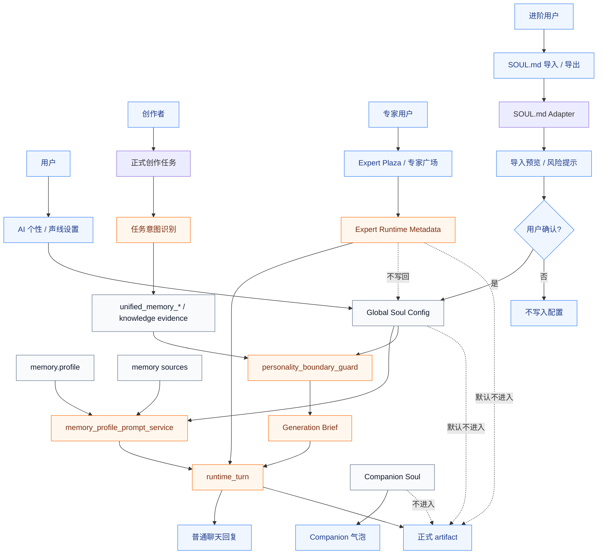
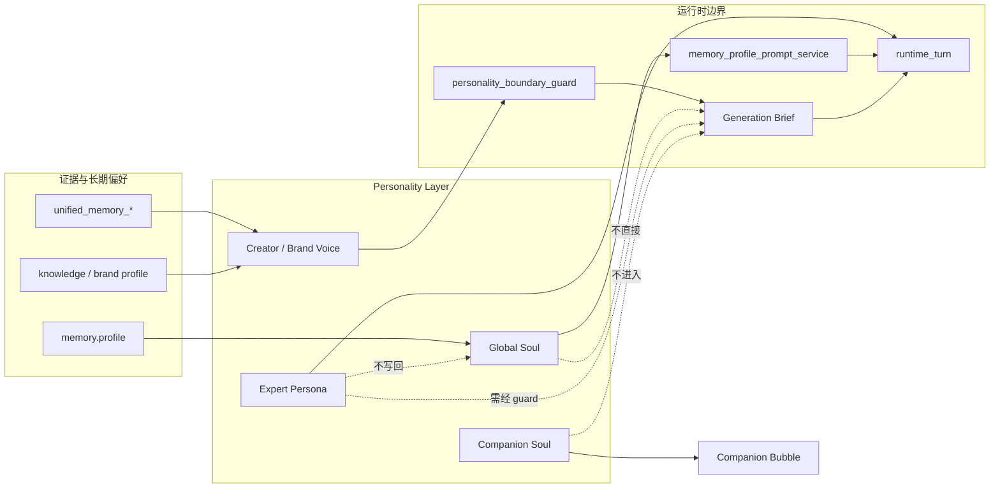
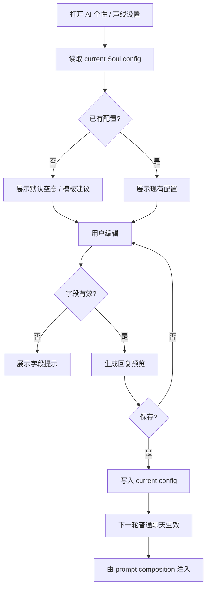
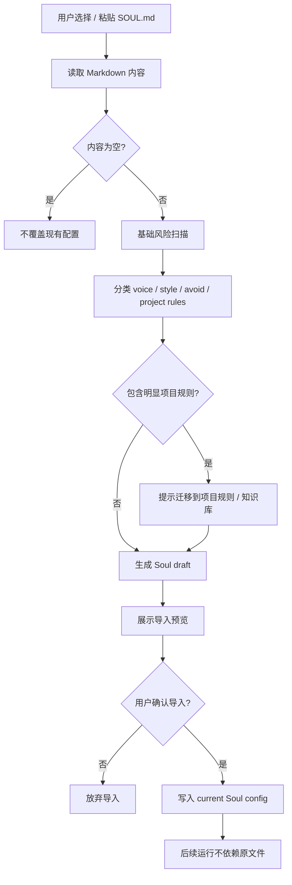
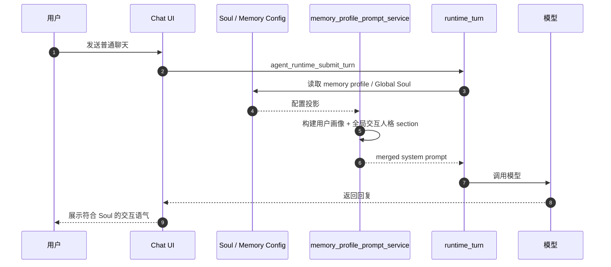
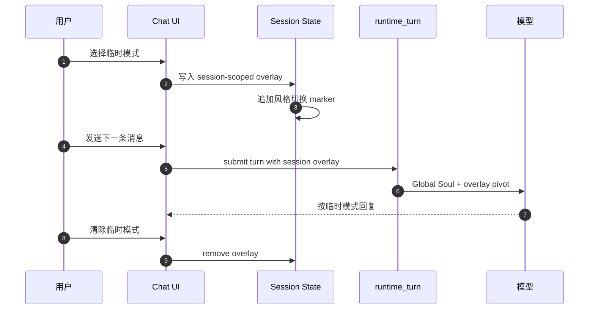
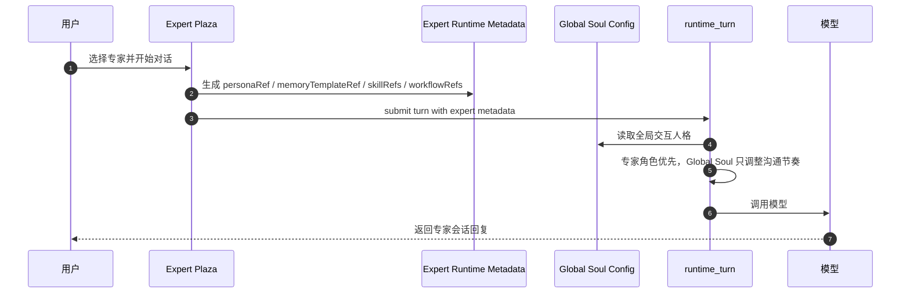
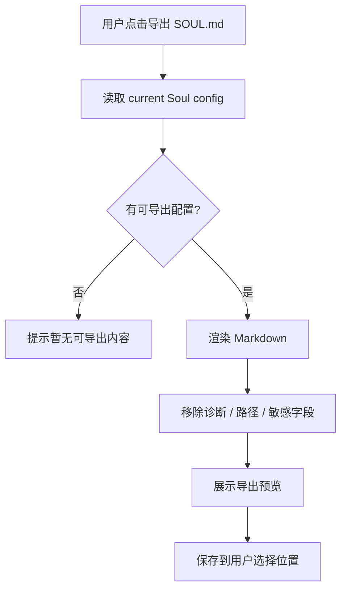

# Lime Soul 个性化图谱

> 状态：current diagrams
> 更新时间：2026-06-03
> 目标：用架构图、流程图和时序图固定 Soul 与 Memory、SOUL.md、Generation Brief 的边界。

## 1. 总体架构图



固定判断：

1. `SOUL.md Adapter` 只写 current config，不成为 runtime 输入源。
2. `Global Soul Config` 默认只通过 prompt service 影响普通聊天。
3. 正式 artifact 只从 `Generation Brief` 接收 Creator / Brand Voice。
4. Companion Soul 只影响气泡。
5. Expert Persona 通过 expert runtime metadata 影响当前专家会话，不写回 Global Soul。

## 2. Soul / Memory 边界图



固定判断：

- Memory 保存证据。
- Soul 投影交互人格。
- Expert 投影当前会话的专业角色和能力包。
- Voice 通过 guard 进入正式创作。
- Companion 不反写 artifact。

## 3. 全局 Soul 设置流程图



验收重点：

1. 不编辑文件。
2. 空配置不注入。
3. 保存后下一轮生效。
4. 关闭后下一轮取消注入。

## 4. SOUL.md 导入流程图



验收重点：

1. 导入前必须预览。
2. 导入后不保留原始文件路径依赖。
3. 项目规则不自动混入 Soul。
4. 空文件不覆盖现有配置。

## 5. 普通聊天注入时序图



验收重点：

1. Global Soul 与 memory profile 在同一 prompt composition 边界。
2. 稳定 marker 防止重复注入。
3. 当前用户指令优先。
4. 关闭 Soul 后不渲染 Soul section。

## 6. 正式创作声线时序图

```mermaid
sequenceDiagram
  autonumber
  participant U as 用户
  participant Create as 创作入口
  participant Toggle as 本轮创作声线开关
  participant Metadata as artifactGenerationBriefMetadata
  participant Intent as Intent Classifier
  participant Evidence as unified_memory_* / knowledge
  participant Soul as Global Soul Config
  participant Guard as personality_boundary_guard
  participant Request as artifact_request_metadata_service
  participant Brief as Generation Brief Compiler
  participant Runtime as runtime_turn
  participant Model as 模型

  U->>Create: 发起正式创作任务
  Create->>Soul: 读取已保存的 memory.soul.artifact_voice
  Soul-->>Create: saved voice candidate
  U->>Toggle: 本轮开启 / 关闭创作声线
  Create->>Metadata: 显式 Creator / Brand Voice metadata
  Toggle-->>Metadata: enabled_for_turn
  Metadata->>Metadata: 无显式 generation_brief 且本轮开启时应用 saved fallback
  Metadata->>Metadata: 归一化为 artifact.generation_brief
  Metadata->>Metadata: 清理互斥 creator / brand voice ID
  Metadata->>Metadata: 写入 diagnostics.soul_artifact_voice
  Create->>Intent: 识别任务类型 / 输出渠道
  Intent-->>Create: task_intent / output_shape
  Create->>Evidence: 读取相关个人 / 品牌声线 evidence
  Evidence-->>Guard: creator / brand voice candidates
  Soul-->>Guard: product soul context
  Guard->>Guard: 判断哪些 personality 可进入本轮
  Guard-->>Brief: allowed creator / brand voice fields
  Metadata-->>Request: request metadata
  Request->>Request: 补默认边界 / alias normalize
  Request->>Request: 后端再次清理互斥 voice ID
  Request-->>Brief: normalized generation_brief
  Brief->>Brief: 编译 Generation Brief 声线边界
  Brief-->>Runtime: prompt augmentation
  Runtime->>Model: 调用模型
  Model-->>Create: artifact
```

验收重点：

1. Product Soul 不默认进入 artifact。
2. Creator / Brand Voice 必须经过 guard。
3. 所有 voice 字段有 evidence 或显式配置。
4. Companion Soul 不参与。
5. 只携带 `generation_brief` 时不触发 Artifact Stage / Schema 合同。
6. 已保存声线只能在 `memory.soul.artifact_voice.enabled=true` 且本轮“创作声线”开关开启时作为发送 fallback；本轮显式 `generation_brief` 优先。
7. 同一份 Generation Brief 不允许同时保留个人和品牌声线 ID。
8. `diagnostics.soul_artifact_voice` 只解释来源、开关和 guard 结果，不作为模型 prompt 事实源。

## 7. 临时 personality overlay 时序图



验收重点：

1. overlay 不默认写入长期 Soul。
2. 切换不清空历史。
3. 清除后回到 Global Soul。
4. 用户确认后才可沉淀为长期配置。

## 8. 专家会话联动时序图



验收重点：

1. Expert Persona 不写回 Global Soul。
2. 专家角色只影响当前专家会话或专家任务。
3. Global Soul 可影响解释节奏，但不能覆盖专家职责。
4. 专家输出进入正式 artifact 前仍需 `Generation Brief`。

## 9. SOUL.md 导出流程图



验收重点：

1. 导出来自 current config。
2. 导出不包含运行时诊断。
3. 导出文件不会反向成为事实源。
