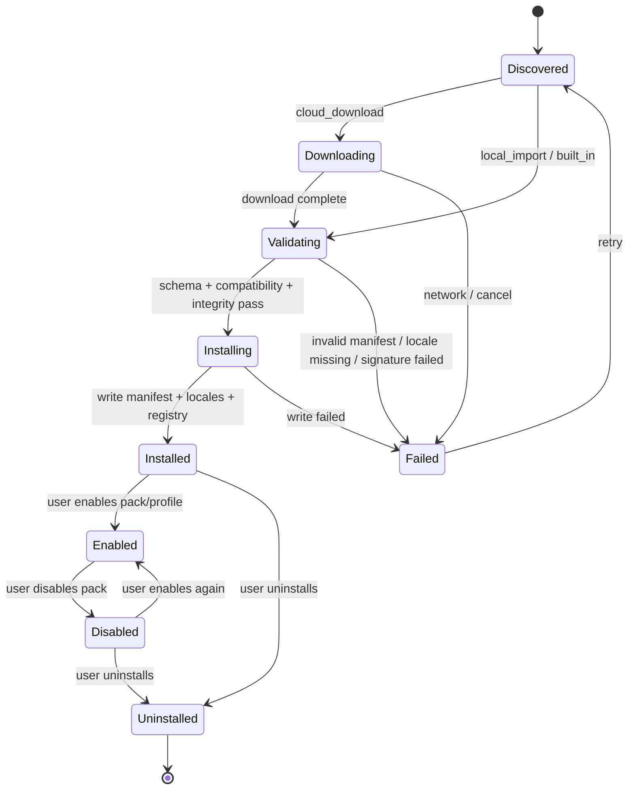
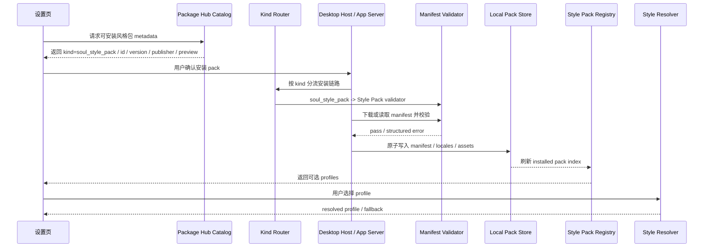

# Soul Style Pack 安装与目录规范

> 状态：current planning source；前端 registry / resolver installed manifest 入口、App Server installed read model、install status guard、本地 store core、`soulStylePack/*` JSON-RPC / 前端 API 网关、设置页 GUI 管理骨架、当前 profile 失效回退、bundled locale 守卫与骨架级 `verify:gui-smoke` 已落地；Cloud 下载、签名校验、安装审计和真实风格包安装后的 Claw 体验验收仍 deferred
> 更新时间：2026-07-07
> 上游路线图：[personal-style-profiles.md](personal-style-profiles.md)
> 关联细节：[personal-style-output-surfaces.md](personal-style-output-surfaces.md)
> 目标：定义未来风格包的安装、目录、manifest、校验和扩展边界，同时保持首版 KISS / YAGNI，不把 Style Profile 做成 PersonalStyle 平行系统。

## 1. 事实源声明

风格包是 Soul `Style Profile` 的分发形态，不是新的运行时。

**后续所有风格包能力只允许向 `memory.soul` + `Style Pack Registry` + `Style Resolver` + `Directive Composer` + `Boundary Guard` 收敛；不得新增 `personalstyle` 表、Runtime、prompt composer、工具权限系统或远程代码执行链路。**

## 2. 设计目标

首版只需要支持内置风格包 seed：

1. 四个 `built_in` Style Pack seed 随应用发布，每个 seed 默认只包含一个首发 profile。
2. 四个 seed 统一注册到 `Style Pack Registry`；组件、工具卡片、timeline 和 i18n 不直接 switch profile id 拼文案。
3. 用户选择保存到 `memory.soul.style_profile_id`，不保存整份风格包正文。
4. Resolver 根据 registry 找 profile，并继续走严肃场景降级和 artifact 旁路。
5. 所有用户可见名称、描述、错误、安装状态走五语言 i18n。

后续扩展目标：

1. 支持用户从 Cloud 下载官方或审核过的风格包。
2. 支持本地导入签名 manifest，便于企业或高级用户内部分发。
3. 支持版本、兼容性、完整性校验、启用 / 禁用 / 卸载。
4. 支持多 profile 共用一个 pack，但同一会话只激活一个最终 profile；首版 built-in 先采用一 pack 一 profile，减少 hard-coded 聚合感。

非目标：

1. 不支持远程 JavaScript、脚本、WASM、动态 system prompt 或工具权限。
2. 不支持风格包携带用户资料、事实、搜索结果、图片结果、正式 artifact 正文。
3. 不支持风格包绕过 Soul guard、高风险降级、Generation Brief 边界。
4. 不在首版实现市场、付费、评分、推荐流、自动同步或后台自动更新。

## 3. 来源类型

| source           | 状态       | 用途                          | 约束                                                                          |
| ---------------- | ---------- | ----------------------------- | ----------------------------------------------------------------------------- |
| `built_in`       | `current`  | 应用内置风格包，随版本发布。  | 不需要安装流程；只读；不能卸载；可被用户选择。                                |
| `local_import`   | `current read model / current local store core / current App Server API / current GUI skeleton` | 从本地文件导入签名 manifest。 | installed manifest 已进入 registry read model；App Server 本地 store core 已覆盖 manifest / locale 校验、staging 写入、atomic replace、rollback、list、disable 与 disabled uninstall；`soulStylePack/list|install|status/set|uninstall` 已作为 JSON-RPC API 落地；设置页已支持 manifest + 五语言 locale 文件导入、启用 / 禁用 / 卸载；签名校验仍 deferred。 |
| `cloud_download` | `current read model / current local store core / current App Server API / deferred cloud transport` | 从 Cloud 下载风格包。         | installed manifest 已进入 registry read model；下载完成后的本地写入可复用 store core 与同一组 `soulStylePack/*` API；Cloud catalog / download、签名校验和安装审计仍 deferred。 |

## 4. 与 Agent Skills 包的关系

参考 Agent Skills 公开规范：

1. [Agent Skills Overview](https://agentskills.io/home)：Skill 是一个目录，至少包含 `SKILL.md`，并可选包含 `scripts/`、`references/`、`assets/` 等资源。
2. [Agent Skills Specification](https://agentskills.io/specification)：Skill 采用 progressive disclosure，启动时只加载 `name` / `description`，命中任务后才加载 `SKILL.md` 和按需资源。
3. [Adding Skills Support](https://agentskills.io/client-implementation/adding-skills-support)：客户端需要负责发现、加载和把 Skill 内容提供给模型，运行时边界与能力执行有关。

因此 Agent Skill 通过 name / description 做发现，任务匹配后再加载完整指令和资源，属于“能力 / 工作流”扩展。规范允许脚本、references 和 assets，因此它的默认风险面是“让 Agent 执行更多能力”。

因此 Style Pack 不应直接做成同一种 Skill 包：

| 维度          | Agent Skill                             | Soul Style Pack                                                  |
| ------------- | --------------------------------------- | ---------------------------------------------------------------- |
| 核心问题      | 让 Agent 会做什么任务。                 | 同一份事实用什么口吻说出来。                                     |
| 必需入口      | `SKILL.md` 指令。                       | `manifest.json` + profiles + i18n resources。                    |
| 激活方式      | 根据任务意图按需激活。                  | 根据 `memory.soul.style_profile_id` 持续生效，并受风险降级控制。 |
| 可执行内容    | 可包含 `scripts/`，并可能需要工具权限。 | 禁止脚本、HTML、WASM、远程代码和工具权限。                       |
| Runtime owner | Skills / tools / workflow runtime。     | Soul resolver / prompt context / boundary guard。                |
| 风险边界      | 工具执行、文件、网络、工作流可靠性。    | 人格化表达、事实保真、高风险降级、i18n。                         |

设计结论：

1. **不合包为同一种 runtime package**：Style Pack 不能伪装成 Skill，也不能通过 `SKILL.md` 指令注入人格。
2. **可以共享 Cloud 分发基础设施**：catalog、下载、签名、digest、版本兼容、安装日志、回滚机制可以复用同一套 package installer。
3. **必须按 kind 分流**：Cloud package metadata 需要显式 `kind`，例如 `agent_skill`、`soul_style_pack`，未来可扩展 `persona_pack`。
4. **安装后目录分离**：Skill 进入 skills root；Style Pack 进入 `soul/style-packs`；两者不互相扫描。
5. **validator 分离**：Skill validator 校验 `SKILL.md`、脚本、references；Style Pack validator 校验 manifest、i18n、signature、禁用可执行内容。
6. **运行时分离**：Skill 只在任务匹配时进入工具 / workflow 上下文；Style Pack 只进入 Soul directive，不进入 tool surface。
7. **组合包只做 bundle manifest**：如果 Cloud 未来提供“能力 + 口吻”套装，应使用 bundle manifest 引用多个独立 package，而不是把 Style Pack 塞进 Skill 目录。

推荐包层拓扑：

```text
Cloud Package Hub
  catalog.json                          # 通用：id / kind / version / publisher / digest / signature
  packages/
    agent-skill/<id>/<version>/          # kind=agent_skill
      SKILL.md
      scripts/
      references/
      assets/
    soul-style-pack/<id>/<version>/      # kind=soul_style_pack
      manifest.json
      locales/
      assets/preview.png
    bundle/<id>/<version>/               # kind=bundle，optional
      manifest.json                      # 只引用多个独立 package，不内联 Skill 或 Style Pack
```

本地安装后目录仍必须分离：

```text
<app-data>/
  skills/                                # 只由 Agent Skills runtime 扫描
    <skill-name>/SKILL.md
  soul/style-packs/                      # 只由 Soul Style Pack registry 扫描
    packs/<pack-id>/manifest.json
```

包层分离规则：

1. `Package Hub` 可以统一做 catalog、下载、签名、digest、兼容性、安装日志和回滚。
2. `kind=agent_skill` 进入 Skill installer、Skill validator、Skill runtime。
3. `kind=soul_style_pack` 进入 Style Pack installer、manifest validator、Soul resolver。
4. `kind=bundle` 只描述组合关系，例如“安装一个 code-review skill 和一个 cool operator style pack”，执行时仍拆成独立包安装。
5. 任何 `soul_style_pack` 包内出现 `SKILL.md`、`scripts/`、`allowed-tools`、HTML、WASM 或可执行文件，都必须 fail closed。

建议 Cloud package metadata：

```ts
type CloudPackageKind = "agent_skill" | "soul_style_pack" | "persona_pack";

type CloudPackageMetadata = {
  kind: CloudPackageKind;
  id: string;
  version: string;
  publisherId: string;
  digest: string;
  signature?: string;
  compatibility: {
    minAppVersion: string;
    schemaVersion: number;
  };
};
```

KISS / YAGNI 约束：

1. 现在不实现统一 package installer，只把 `kind` 分流和目录分离写成约束。
2. Style Pack 首版继续是 built-in registry，不依赖 Agent Skills 目录。
3. 如果先实现 Skills Cloud 安装，也不能顺手让 Style Pack 共用 Skill validator 或 `SKILL.md`。
4. 如果先实现 Style Pack Cloud 下载，也不能顺手允许脚本或 allowed-tools。
5. 如果未来产品需要“技能 + 风格”套装，只实现 bundle manifest 引用，不把两种包合并成一个物理目录。

## 5. 目录规划

### 5.1 前端当前目录

```text
src/lib/soul/style-profiles/
  types.ts                              # current：StyleProfile / StylePack 类型
  builtInProfiles.ts                    # current：四个 built_in style pack seed registry
  manifest.ts                           # current：StylePackManifest schema / validator
  registry.ts                           # current：合并 built_in + installed manifests，输出只读 registry
  resolveStyleProfile.ts                # current：按 memory.soul 选择最终 profile
  composeStyleDirectives.ts             # current：profile -> prompt directives
  evaluateStyleBoundary.ts              # current：artifact 旁路、高风险降级、危险操作边界
  index.ts                              # current：稳定导出面
```

### 5.2 前端后续目录

```text
src/lib/soul/style-packs/
  installPlan.ts                        # deferred：安装前检查，返回 plan，不执行 IO
  installState.ts                       # deferred：installed / disabled / failed 状态投影
  integrity.ts                          # deferred：digest / signature 校验 facade
  locale.ts                             # deferred：pack locale key 映射与缺失检查
  __tests__/
    manifest.unit.test.ts
    installPlan.unit.test.ts
```

KISS 约束：manifest validator 和 read-only registry 已落在现有 `style-profiles/` 模块中，避免创建空壳目录；只有实现 Cloud / local import 的 IO / 状态机时再创建 `style-packs/`。

### 5.3 App Server 后续目录

```text
lime-rs/crates/app-server/src/runtime/soul/
  style_profile.rs                      # current：built_in / installed manifest 解析和 prompt context
  style_pack_registry.rs                # current：只读 installed pack registry read model
  style_pack_install.rs                 # current：install status enum / transition guard，不拼 prompt
  style_pack_paths.rs                   # current：app data 逻辑目录、required locales 和安全 id 校验
  style_pack_store.rs                   # current：本地安装 / list / disable / disabled uninstall store core；Cloud deferred
  style_pack_integrity.rs               # deferred：签名 / digest 校验 facade
```

App Server 边界：

1. 安装链路只产生本地 installed pack read model，不直接改 prompt。
2. prompt context 仍只消费 resolver 的最终 profile。
3. Cloud 下载和本地文件读取必须走 App Server / Desktop Host current 文件与网络能力，不走前端直接下载执行。
4. 安装失败、签名失败、版本不兼容必须返回结构化 error code，由前端 i18n 渲染。

### 5.4 用户数据目录

实际路径不得硬编码平台路径，必须走统一 app data / config path API。逻辑目录建议：

```text
<app-data>/soul/style-packs/
  registry.json                         # installed pack index，只存 metadata、status 和完整性摘要
  packs/
    <pack-id>/
      manifest.json                     # 原始 manifest，安装后只读
      locales/
        zh-CN.json
        zh-TW.json
        en-US.json
        ja-JP.json
        ko-KR.json
      assets/
        preview.png                     # optional：只用于设置页预览，不进入 prompt
```

目录约束：

1. `registry.json` 只记录安装状态、版本、来源、`integrity.digest`、`status`、`installed_at`、`last_error`；旧 `enabled: true` 和顶层 `digest` 不再作为 current schema。
2. `manifest.json` 不存用户资料、token、prompt history、工具结果或 artifact 正文。
3. `assets/` 只允许图片预览，不允许脚本、HTML、可执行文件、动态组件。
4. 卸载只删除对应 pack 目录和 registry 条目；如果当前 profile 来自该 pack，回退到 built-in 默认 profile。

## 6. Manifest 规范

```ts
type SoulStylePackManifest = {
  schemaVersion: 1;
  id: string;
  version: string;
  source: "built_in" | "local_import" | "cloud_download";
  publisher: {
    id: string;
    name: string;
    verified: boolean;
  };
  i18n: {
    nameKey: string;
    descriptionKey: string;
    locales: Array<"zh-CN" | "zh-TW" | "en-US" | "ja-JP" | "ko-KR">;
  };
  compatibility: {
    minAppVersion: string;
    maxAppVersion?: string;
  };
  profiles: Array<{
    id: string;
    nameKey: string;
    descriptionKey: string;
    tone:
      | "cheeky_sassy"
      | "warm_supportive"
      | "cool_confident"
      | "calm_professional"
      | string;
    scopes: Array<
      "chat_interaction" | "tool_narrative" | "companion" | "artifact_voice"
    >;
    voicePrimitives: string[];
    surfaceContracts: Record<string, string[]>;
    allowedMoves: string[];
    forbiddenMoves: string[];
    antiRepetitionRules: string[];
    fewShotAnchors: Array<{
      surface: string;
      intent: string;
      example: string;
    }>;
    defaultUseCases: string[];
    riskFallback: {
      profileId: "calm_professional_partner";
      triggers: string[];
    };
    seriousModeFallback: "calm_professional_partner";
  }>;
  integrity: {
    digest: string;
    signature?: string;
    signatureKeyId?: string;
  };
};
```

Manifest 约束：

1. `id` 必须全局稳定，建议反向域名或官方命名空间，例如 `com.lime.soul.cheeky-sassy-executor`.
2. `profiles[].id` 必须在 pack 内唯一；运行时展示时使用 `<pack-id>/<profile-id>` 作为安装态唯一键。
3. `tone` 允许未来扩展，但未知 tone 必须降级到中性或拒绝安装，不能猜测行为。
4. `voicePrimitives` / `surfaceContracts` / `allowedMoves` / `forbiddenMoves` / `antiRepetitionRules` 是行为规则，不是可执行 prompt 模板；不允许包含工具调用权限、系统指令覆盖、用户资料要求。
5. `fewShotAnchors` 只能作为风格锚点，不得被 UI / i18n / tool renderer 当成固定终稿句子。
6. 五语言 locale 必须齐全；缺失任何 current locale 时安装失败。
7. `intensity` / `style_intensity` 属于已删除设计；manifest validator 必须拒绝该字段，风格差异只能来自完整 Style Pack 合同。

## 7. 安装状态机



状态语义：

1. `Discovered`：只看到 catalog metadata，不影响本地 registry。
2. `Downloading`：只适用于 Cloud；可取消；不写入可用 profile。
3. `Validating`：校验 schema、版本、locale、digest、signature。
4. `Installing`：写入临时目录，全部成功后原子移动到 pack 目录。
5. `Installed`：pack 已可被 registry 读取，但不一定被选中。
6. `Enabled`：pack 允许出现在选择器中。
7. `Disabled`：pack 保留在磁盘，不出现在可选 profile 列表。
8. `Failed`：保留 error code 和可恢复动作，不留下半安装 profile。

当前实现状态：

1. App Server `style_pack_install.rs` 已固定上述状态枚举和合法转移，防止后续写入链路重新发明状态图。
2. `style_pack_registry.rs` 只把 registry entry 的 `status: "enabled"` 视为 prompt-readable；`Installed` / `Disabled` / `Failed` / `Uninstalled` 均不进入 resolver。
3. 缺 `status`、旧 `enabled: true`、顶层 `digest`、缺 `integrity.digest`、缺五语言 locale 文件或 key 都 fail closed。
4. App Server `style_pack_paths.rs` 已统一 `soul/style-packs` 数据根、五语言 locale 列表和 pack id 安全校验。
5. App Server `style_pack_store.rs` 已落本地 store core：先写 `.installing/<pack-id>-<timestamp>`，再替换 `packs/<pack-id>`；registry 使用临时文件和备份替换；registry 写入失败会尝试恢复旧 pack；`enable_after_install` 可写入 `Enabled`；disable 与 disabled uninstall 已有状态机约束和文件清理。
6. 公开 JSON-RPC / App Server command 已落地为 `soulStylePack/list`、`soulStylePack/install`、`soulStylePack/status/set`、`soulStylePack/uninstall`，并有前端 API 网关；设置页 GUI 管理骨架已支持本地导入、启用 / 禁用、disabled / installed uninstall 和当前 profile 被禁用 / 卸载后的用户可见回退。Cloud catalog / download、签名校验和安装审计仍 deferred。

## 8. 安装流程



流程约束：

1. UI 只发起安装请求和展示状态，不直接解析远程包。
2. Catalog metadata 不等于已安装，不能提前出现在 profile 选择器中。
3. 安装成功后默认不自动切换 profile，除非用户明确选择。
4. 当前 profile 被卸载或禁用时，立即回退到 built-in 默认 profile，并给出 i18n toast。
5. 安装、启用、卸载都必须可审计，记录 pack id、version、source、result、error code。

## 9. 安全与治理

必须拒绝：

1. 包内含脚本、HTML、WASM、动态组件、二进制可执行文件。
2. manifest 中要求新增工具权限、网络权限、文件权限、系统权限。
3. manifest 中包含用户资料、密钥、token、历史消息、搜索结果或 artifact 正文。
4. profile 试图覆盖系统身份、危险操作确认、高风险降级、Generation Brief 边界。
5. 缺少五语言资源、签名不可信、digest 不匹配、版本不兼容。

必须保留：

1. `built_in` 默认包永远可用。
2. 安装失败不污染 registry。
3. 选择器只展示 `status: "enabled"` 且通过校验的 pack。
4. resolver 对未知 pack/profile fail closed，回退默认 profile。
5. 所有错误提示走 i18n key，不拼硬编码中文。

## 10. UI 与文案

设置页已经增加“风格包管理”骨架，但不应变成市场首页。

当前 UI 结构：

```text
AI 个性 / Soul
  交互口吻
    Built-in profiles
    Installed style packs
  风格包管理
    已安装 / 已禁用
    本地 manifest + 五语言 locale 导入
    启用 / 禁用 / 卸载
    当前 profile 失效时回退默认 built-in
```

KISS 约束：

1. 首版管理 UI 只做本地导入和已安装包管理，不做市场首页。
2. 后续 Cloud 下载先做“输入官方 pack id / 从官方 catalog 选择”这类窄入口，不做推荐流。
3. 安装状态必须可恢复：重试、取消、卸载、回退默认。
4. 危险确认、失败恢复、权限说明必须专业，不跟随被安装风格包人格化。

## 11. 测试与验收

| 场景                         | 验收方式                | 必须证明                                                                           |
| ---------------------------- | ----------------------- | ---------------------------------------------------------------------------------- |
| built-in registry            | unit test               | 四个内置 profile 始终可用，默认 profile 可解析。                                   |
| manifest schema              | unit test               | 缺字段、未知 schema、重复 profile id、未知 source 被拒绝。                         |
| locale completeness          | unit test               | bundled registry pack/profile settings key 缺失时测试失败；App Server installed read model 缺五语言 locale 文件或 key 时 fail closed。 |
| registry status schema       | unit test               | App Server 只加载 `status: "enabled"`；缺 `status`、旧 `enabled: true` 和顶层 `digest` fail closed。 |
| integrity failure            | unit test / integration | 缺 `integrity.digest` 或未来 signature 不匹配时不写 registry / 不进入 read model。 |
| install rollback             | unit / integration      | App Server store core 写入失败或校验失败不会留下半安装 pack；公开命令接入后补 integration。 |
| disable / uninstall fallback | unit / component        | store core 已覆盖 disable 与 disabled uninstall；设置页 list / registry 集成已在当前 profile 来自被禁用 / 卸载 pack 时回退 built-in 默认 profile。 |
| high-risk downgrade          | prompt snapshot         | Cloud pack 不能覆盖 `calm_professional_partner` 严肃降级。                         |
| artifact boundary            | prompt snapshot         | 风格包不能让正式 artifact 默认吸收 Product Soul。                                  |
| package kind split           | unit / integration      | `agent_skill` 和 `soul_style_pack` 共用下载基础设施时仍进入不同 validator 和目录。 |
| 设置页骨架 smoke             | `npm run verify:gui-smoke` | Electron smoke 已到达 `memory settings ready`，证明设置页骨架能进入真实 Electron Desktop Host / App Server current 启动链。 |
| 安装后 Claw 体验验收         | Playwright / Claw       | 安装后选择 profile，真实 Claw 对话生效；失败状态可见且可恢复。                     |

## 12. 分阶段路线

| 阶段 | 目标                          | 主产物                                                                             |
| ---- | ----------------------------- | ---------------------------------------------------------------------------------- |
| P0   | 规划边界                      | 本文档、主路线图引用、输出面文档引用                                               |
| P1   | 内置 seed registry            | `builtInProfiles.ts` 表达四个 built-in Style Pack seed，不新增安装器；公共 barrel 不导出 built-in profile list |
| P2   | Manifest schema               | `style-profiles/manifest.ts` + 单测，校验 built-in 与 installed manifest，缺 integrity fail closed |
| P3   | Installed registry read model | 前端 registry 与 App Server 只读 read model 已可消费 installed manifest，并在 App Server 校验五语言 locale resources、显式 install status 和旧 schema fail-closed；不接 Cloud |
| P4   | Local import                  | App Server local store core、`soulStylePack/*` JSON-RPC / 前端 API 网关和设置页 GUI 骨架已覆盖原子写入、list、启用 / 禁用、disabled uninstall 文件清理、回滚和当前 profile 回退；签名校验仍待补 |
| P5   | Cloud package infrastructure  | 通用 catalog / download / signature 基础设施，按 `kind` 分流到 Skill 或 Style Pack |
| P6   | GUI 管理                      | 设置页风格包管理骨架已落地并通过骨架级 `verify:gui-smoke`；剩余为错误恢复细节、安装真实风格包后的 Playwright / Claw 验收和 Cloud 分发体验 |

## 13. 当前必须避免的误区

1. 把风格包做成 `personalstyle` 独立系统。
2. 为了未来 Cloud 下载，提前实现市场、推荐流、账号同步或自动更新。
3. 把远程 manifest 当 system prompt 直接拼进去。
4. 让风格包携带工具权限、脚本、HTML 或用户资料。
5. 让设置页直接下载和解析远程包，绕过 App Server / Desktop Host current 边界。
6. 安装失败后留下半可用 profile。
7. 忽略五语言资源，回退到硬编码中文。
8. 把 Style Pack 放进 Agent Skill 目录，用 `SKILL.md` 当人格注入入口。
